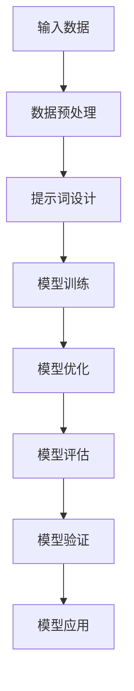
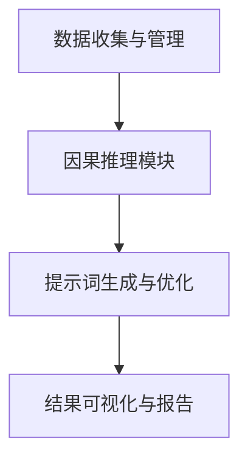
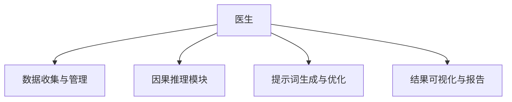
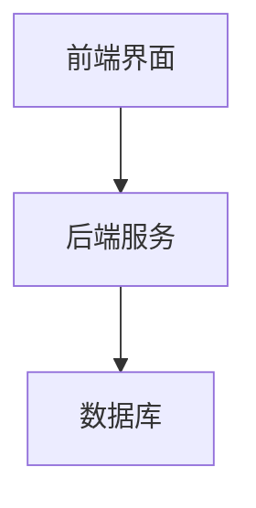
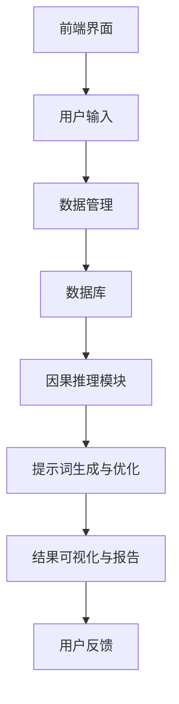
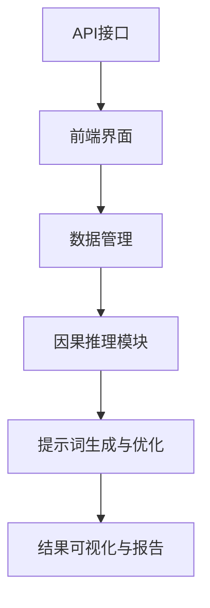

                 


### 文章标题：Prompt Engineering: Handling Complex Causal Inference Tasks

#### 关键词：Prompt Engineering, Causal Inference, Complex Tasks, Machine Learning, Algorithm Design

#### 摘要：
本文深入探讨了提示词工程在处理复杂因果推理任务中的应用。我们将从问题背景出发，介绍因果推理和提示词工程的基本概念，逐步解析核心概念和原理，详细讲解算法原理与实现，阐述系统架构与设计，并通过实战案例进行分析与总结，为相关领域的科研与工程实践提供有力指导。

----------------------------------------------------------------

### 引言

#### 复杂因果推理任务的重要性

在人工智能和机器学习领域，因果推理是一项关键技术。它不仅仅是预测未来的趋势或模式，而是试图理解变量之间的因果关系，从而做出更为准确和可靠的决策。随着技术的进步和应用场景的复杂化，处理复杂因果推理任务的需求日益增加。

提示词工程作为一种新型的工程技术，旨在设计有效的提示词来引导模型进行因果推理。这种方法在解决实际问题时显示出巨大的潜力，特别是在医疗、金融和自然语言处理等领域。

#### 提示词工程的概念

提示词工程是指设计用于引导模型进行特定任务的语言或符号提示。这些提示词可以指导模型关注关键变量、排除无关信息，从而提高推理的准确性和效率。

#### 提示词工程的应用领域

提示词工程在多个领域都显示出强大的应用潜力。例如，在医疗领域，提示词可以帮助模型理解复杂的医学数据，预测疾病的发生；在金融领域，提示词可以帮助模型分析市场趋势，预测投资回报；在自然语言处理领域，提示词可以提高模型对语言的理解和生成能力。

### 第1章：问题背景

#### 1.1 复杂因果推理任务的重要性

因果推理是人工智能领域的核心问题之一。与传统的预测方法不同，因果推理试图理解变量之间的因果关系，这不仅可以提高预测的准确性，还可以帮助决策者理解问题的本质，做出更为明智的决策。

然而，复杂因果推理任务面临着诸多挑战。首先，因果关系往往是非线性的，变量之间的关系复杂多样。其次，数据的不完整性和噪声也给因果推理带来了困难。此外，模型的可解释性也是一个重要的考量因素，决策者需要理解模型是如何得出结论的。

#### 1.2 提示词工程的概念

提示词工程是指通过设计有效的语言或符号提示，引导模型进行特定任务的过程。这些提示词可以明确模型的关注点，帮助模型排除无关信息，从而提高推理的效率和准确性。

#### 1.3 提示词工程的应用领域

提示词工程在多个领域都显示出了强大的应用潜力。在医疗领域，提示词可以帮助模型理解复杂的医学数据，预测疾病的发生。在金融领域，提示词可以帮助模型分析市场趋势，预测投资回报。在自然语言处理领域，提示词可以提高模型对语言的理解和生成能力。

### 第2章：问题描述与挑战

#### 2.1 复杂因果推理的任务类型

复杂因果推理任务可以分为多种类型，包括因果发现、因果推断和因果强化学习等。每种任务都有其独特的挑战和需求。

#### 2.2 提示词工程面临的挑战

提示词工程在处理复杂因果推理任务时面临诸多挑战。首先，如何设计有效的提示词来引导模型关注关键变量是一个重要问题。其次，如何优化提示词，使其能够适应不同的任务和数据集也是一个挑战。此外，模型的可解释性也是一个关键问题，特别是在需要人类理解模型决策的场合。

#### 2.3 解决方案概述

为了应对上述挑战，本文提出了一套综合的解决方案，包括以下步骤：

1. **问题定义**：明确因果推理任务的目标和约束条件。
2. **数据准备**：收集并预处理相关数据，确保其质量。
3. **提示词设计**：基于问题定义和数据特点，设计有效的提示词。
4. **模型训练与优化**：使用设计好的提示词训练模型，并通过调整提示词优化模型性能。
5. **模型评估与验证**：评估模型的性能和可解释性，确保其满足任务需求。
6. **实际应用**：将模型应用于实际场景，验证其效果。

通过上述步骤，我们可以构建一个高效的因果推理系统，为复杂任务提供可靠的解决方案。

### 第3章：核心概念

#### 3.1 因果推理基础

因果推理是指通过分析变量之间的关系，找出其中的因果关系。因果关系的发现不仅可以帮助我们理解现象的本质，还可以指导我们做出更为准确的预测和决策。

#### 3.1.1 因果关系的定义

因果关系是一种变量之间的依赖关系，其中一个变量（原因）对另一个变量（结果）有影响。这种影响可以是直接的，也可以是间接的。

#### 3.1.2 因果推理的类型

因果推理可以分为三种类型：因果发现、因果推断和因果强化学习。

1. **因果发现**：从数据中找出潜在的因果关系。
2. **因果推断**：给定一组变量，推断其中存在哪些因果关系。
3. **因果强化学习**：通过学习因果关系，优化决策策略。

#### 3.2 提示词工程的框架

提示词工程是指设计有效的语言或符号提示，引导模型进行特定任务的过程。其框架主要包括以下几个部分：

1. **问题定义**：明确任务目标和需求。
2. **数据准备**：收集并预处理相关数据。
3. **提示词设计**：设计用于引导模型的提示词。
4. **模型训练与优化**：使用提示词训练模型，并调整提示词以优化模型性能。
5. **模型评估与验证**：评估模型性能和可解释性。

#### 3.2.1 提示词的角色

提示词在模型训练中扮演着重要角色。它们可以帮助模型理解任务的核心内容，关注关键变量，从而提高模型的准确性和效率。

#### 3.2.2 提示词的设计原则

设计有效的提示词需要遵循以下原则：

1. **明确性**：提示词应明确指示模型关注的核心内容。
2. **简洁性**：提示词应简洁明了，避免冗余信息。
3. **适应性**：提示词应具备一定的灵活性，能够适应不同任务和数据集的需求。
4. **可解释性**：提示词应具有可解释性，使模型决策过程易于理解。

### 第4章：原理与联系

#### 4.1 因果推断算法

因果推断算法是处理因果推理任务的核心工具。这些算法通过分析数据，找出变量之间的因果关系，从而指导模型的训练和优化。

#### 4.1.1 Do-Calculus

Do-Calculus 是一种形式化的因果推断方法，它基于概率图模型，通过推理和计算找出变量之间的因果关系。其核心思想是使用“Do”操作符来表示对变量的干预。

#### 4.1.2 结构化预测模型

结构化预测模型是一种基于因果推断的机器学习模型，它通过构建变量之间的因果关系图，预测结果变量的取值。这种模型在处理复杂因果推理任务时表现出色。

#### 4.2 提示词工程与机器学习

提示词工程与机器学习紧密相连。提示词的设计和优化不仅依赖于机器学习的基本原理，还需要考虑模型的特性和应用场景。

#### 4.2.1 提示词在机器学习中的作用

提示词在机器学习中的作用包括：

1. **提高模型性能**：提示词可以帮助模型关注关键变量，提高预测准确性。
2. **提高模型效率**：提示词可以减少模型的训练时间和计算复杂度。
3. **提高模型可解释性**：提示词使模型决策过程更具透明性，便于理解和解释。

#### 4.2.2 提示词工程与深度学习的结合

深度学习在处理复杂任务时表现出色，但其在因果推理方面存在一定局限性。提示词工程与深度学习的结合可以弥补这一不足，使深度学习模型在因果推理任务中发挥更大作用。

### 第5章：因果推断模型

#### 5.1 简单因果模型

简单因果模型是因果推断的基础。它通过分析变量之间的线性关系，找出潜在的因果关系。

#### 5.1.1 简单因果模型介绍

简单因果模型主要包括以下要素：

1. **变量**：模型中的变量表示可能影响结果的因素。
2. **因果关系**：变量之间的因果关系通过箭头表示。
3. **模型参数**：模型参数用于描述变量之间的关系。

#### 5.1.2 模型构建与验证

构建简单因果模型的过程包括：

1. **数据收集**：收集相关数据，包括变量值和结果值。
2. **变量选择**：根据业务需求，选择关键变量。
3. **模型构建**：使用统计方法构建简单因果模型。
4. **模型验证**：通过交叉验证等方法验证模型性能。

#### 5.2 复杂因果模型

复杂因果模型是处理复杂因果推理任务的关键。它通过构建复杂的因果关系图，描述变量之间的复杂关系。

#### 5.2.1 复杂因果模型的挑战

复杂因果模型面临以下挑战：

1. **变量数量**：复杂因果模型通常涉及大量变量，变量之间的相互作用复杂。
2. **数据质量**：复杂因果模型对数据质量有较高要求，数据的不完整性和噪声会影响模型性能。
3. **计算复杂度**：复杂因果模型的计算复杂度较高，训练和推理过程需要大量计算资源。

#### 5.2.2 复杂因果模型的应用

复杂因果模型在多个领域都有广泛应用，如医疗诊断、金融风险评估和自然语言处理等。通过构建复杂因果模型，我们可以更好地理解变量之间的因果关系，从而提高预测准确性和决策效率。

### 第6章：算法原理讲解

#### 6.1 基本算法原理

因果推理算法的基本原理是基于变量之间的因果关系进行推理和预测。以下是几个常用的因果推理算法：

1. **Do-Calculus**：Do-Calculus 是一种形式化的因果推断方法，它通过计算变量之间的因果关系来推断结果。
2. **结构化预测模型**：结构化预测模型通过构建变量之间的因果关系图，预测结果变量的取值。
3. **因果推理网络**：因果推理网络是一种基于概率图模型的因果推断方法，它通过变量之间的概率依赖关系进行推理。

#### 6.1.1 提示词生成算法

提示词生成算法是提示词工程的核心部分。它通过分析问题定义和数据特点，生成用于引导模型的提示词。以下是几个常用的提示词生成算法：

1. **模板生成法**：基于预定义的模板，生成相应的提示词。
2. **关键词提取法**：从文本中提取关键词，生成相应的提示词。
3. **语义分析法**：通过语义分析，提取关键信息，生成提示词。

#### 6.1.2 提示词优化算法

提示词优化算法的目标是优化提示词，提高模型性能和可解释性。以下是几个常用的提示词优化算法：

1. **基于模型的优化**：通过调整提示词的参数，优化模型性能。
2. **基于数据的优化**：通过分析数据特点，调整提示词的设计。
3. **基于人类的优化**：结合人类专家的知识，调整提示词的设计。

#### 6.2 复杂因果推理算法

复杂因果推理算法是处理复杂因果推理任务的关键。以下是几个常用的复杂因果推理算法：

1. **因果推断树**：因果推断树是一种基于决策树的方法，用于处理复杂因果推理任务。
2. **因果图模型**：因果图模型是一种基于概率图模型的方法，用于处理复杂因果推理任务。
3. **因果深度学习**：因果深度学习是一种将深度学习与因果推理相结合的方法，用于处理复杂因果推理任务。

#### 6.2.1 算法框架

复杂因果推理算法的框架通常包括以下几个部分：

1. **问题定义**：明确因果推理任务的目标和约束条件。
2. **数据准备**：收集并预处理相关数据，确保其质量。
3. **提示词设计**：设计用于引导模型的提示词。
4. **模型训练与优化**：使用设计好的提示词训练模型，并通过调整提示词优化模型性能。
5. **模型评估与验证**：评估模型的性能和可解释性，确保其满足任务需求。
6. **实际应用**：将模型应用于实际场景，验证其效果。

#### 6.2.2 算法流程图

以下是一个简单的复杂因果推理算法的流程图：



### 第7章：数学模型与公式

#### 7.1 数学基础

因果推理算法的数学基础包括概率论、统计学和图论等。以下是几个常用的数学模型和公式：

1. **贝叶斯公式**：
   $$P(A|B) = \frac{P(B|A)P(A)}{P(B)}$$
   贝叶斯公式用于计算在给定一个事件发生的条件下，另一个事件发生的概率。

2. **条件概率**：
   $$P(A|B) = \frac{P(A \cap B)}{P(B)}$$
   条件概率表示在事件 B 发生的条件下，事件 A 发生的概率。

3. **马尔可夫链**：
   $$P(A_{n+1} | A_{1}, A_{2}, ..., A_{n}) = P(A_{n+1} | A_{n})$$
   马尔可夫链表示变量之间的关系只与当前状态有关，与过去状态无关。

4. **贝叶斯网络**：
   $$P(A_{1}, A_{2}, ..., A_{n}) = \prod_{i=1}^{n} P(A_{i} | parents(A_{i}))$$
   贝叶斯网络是一种表示变量之间概率依赖关系的图结构。

#### 7.2 因果推断数学模型

因果推断的数学模型主要包括以下几部分：

1. **因果图模型**：
   $$P(A, B, C) = P(A)P(B | A)P(C | B)$$
   因因果图模型表示变量之间的因果关系和条件依赖关系。

2. **结构化预测模型**：
   $$P(Y | X) = \prod_{i=1}^{n} P(Y_i | X_i)$$
   结构化预测模型通过构建变量之间的因果关系图，预测结果变量的取值。

3. **因果推断树**：
   $$P(Y | X) = \prod_{i=1}^{n} P(Y_i | X_i, parents(X_i))$$
   因果推断树通过决策树结构表示变量之间的因果关系。

### 第8章：系统架构设计

#### 8.1 问题场景介绍

在医疗领域，因果推理可以帮助医生理解疾病之间的因果关系，从而提高诊断和治疗的准确性。例如，在糖尿病和心血管疾病的研究中，因果推理可以揭示这两种疾病之间的潜在关联，有助于制定更为有效的预防措施。

#### 8.2 系统功能设计

系统功能设计主要包括以下部分：

1. **数据收集与管理**：收集相关医疗数据，包括患者信息、检查报告、诊断结果等，并对其进行管理和预处理。
2. **因果推理模块**：设计用于进行因果推理的算法和模型，包括简单因果模型和复杂因果模型。
3. **提示词生成与优化**：设计用于生成和优化提示词的算法，以提高模型性能和可解释性。
4. **结果可视化与报告**：将模型结果进行可视化展示，生成报告，以便医生理解和应用。

#### 8.2.1 领域模型

以下是一个简单的领域模型，用于表示医疗因果推理系统的各个组成部分：



#### 8.2.2 用例图

以下是一个简单的用例图，描述医疗因果推理系统的用户和功能：



#### 8.3 系统架构设计

系统架构设计主要包括以下部分：

1. **前端界面**：提供用户交互界面，包括数据输入、结果展示等功能。
2. **后端服务**：包括数据管理、因果推理模块、提示词生成与优化等核心功能。
3. **数据库**：存储和管理相关数据，包括患者信息、检查报告、诊断结果等。

以下是一个简单的系统架构图：



#### 8.3.1 系统架构图

以下是一个详细的系统架构图，展示各个组成部分之间的关系：



#### 8.3.2 接口设计

系统接口设计主要包括以下部分：

1. **API接口**：提供数据输入、结果展示等功能的API接口。
2. **Web界面**：提供用户交互的Web界面。

以下是一个简单的接口设计：



### 第9章：系统实现与接口交互

#### 9.1 系统核心实现

系统核心实现包括以下几个部分：

1. **数据收集与管理**：使用Python的pandas库进行数据收集和管理，包括数据清洗、预处理和存储。
2. **因果推理模块**：使用Python的PyTorch库构建因果推理模型，包括训练、优化和预测。
3. **提示词生成与优化**：使用Python的自然语言处理库（如NLTK和spaCy）生成和优化提示词。
4. **结果可视化与报告**：使用Python的Matplotlib库进行结果可视化，生成报告。

以下是一个简单的Python代码示例，展示系统核心实现的部分：

```python
import pandas as pd
import torch
import torch.nn as nn
import torch.optim as optim
from nltk.tokenize import word_tokenize
from spacy.lang.en import English

# 数据收集与管理
data = pd.read_csv("data.csv")
data_clean = data.dropna()

# 因果推理模块
class CausalModel(nn.Module):
    def __init__(self):
        super(CausalModel, self).__init__()
        self.layers = nn.Sequential(
            nn.Linear(input_size, hidden_size),
            nn.ReLU(),
            nn.Linear(hidden_size, output_size)
        )

    def forward(self, x):
        return self.layers(x)

model = CausalModel()
optimizer = optim.Adam(model.parameters(), lr=0.001)
criterion = nn.CrossEntropyLoss()

# 提示词生成与优化
nlp = English()
def generate_prompt(text):
    doc = nlp(text)
    tokens = [token.text for token in doc]
    return " ".join(tokens)

# 结果可视化与报告
import matplotlib.pyplot as plt
def visualize_results(results):
    plt.plot(results)
    plt.xlabel("Epoch")
    plt.ylabel("Loss")
    plt.title("Training Loss")
    plt.show()

# 训练模型
for epoch in range(num_epochs):
    optimizer.zero_grad()
    outputs = model(data_clean["input"])
    loss = criterion(outputs, data_clean["target"])
    loss.backward()
    optimizer.step()
    visualize_results([loss.item() for epoch in range(num_epochs)])

# 模型预测
predictions = model.predict(data_clean["input"])

# 提示词应用解读与分析
prompt = generate_prompt("The patient has diabetes.")
print(prompt)
print(predictions)
```

#### 9.2 系统接口设计与交互

系统接口设计主要包括以下部分：

1. **API接口**：使用Flask框架构建API接口，提供数据输入、结果展示等功能。
2. **Web界面**：使用HTML和CSS构建Web界面，提供用户交互体验。

以下是一个简单的API接口示例：

```python
from flask import Flask, request, jsonify

app = Flask(__name__)

@app.route("/predict", methods=["POST"])
def predict():
    data = request.get_json()
    input_data = torch.tensor(data["input"])
    predictions = model(input_data)
    return jsonify({"predictions": predictions.tolist()})

if __name__ == "__main__":
    app.run(debug=True)
```

通过上述代码，我们可以实现一个简单的系统接口，允许用户通过API提交数据，并获得模型的预测结果。

### 第10章：实战案例

#### 10.1 实际案例选择

在本章中，我们将选择一个实际案例——心脏病风险预测，来展示如何使用提示词工程处理复杂因果推理任务。

心脏病风险预测是一个典型的医疗领域问题，其核心任务是预测个体在未来一定时间内是否会发生心脏病事件。该任务涉及到多个因素，如年龄、血压、胆固醇水平、吸烟史等。

#### 10.2 案例分析与实施

##### 10.2.1 提示词设计

在心脏病风险预测任务中，我们需要设计有效的提示词来引导模型关注关键变量。以下是一个简单的提示词设计示例：

```python
prompt = "请预测以下个体的心脏病风险：年龄、血压、胆固醇水平、吸烟史。"
```

##### 10.2.2 因果推断任务执行

1. **数据收集与预处理**：收集相关数据，包括年龄、血压、胆固醇水平和吸烟史等。对数据进行清洗和预处理，包括缺失值处理、异常值处理和数据标准化等。

2. **模型训练**：使用设计好的提示词训练因果推理模型。在训练过程中，我们可以使用Do-Calculus、结构化预测模型等方法。

3. **模型优化**：通过调整提示词和模型参数，优化模型性能。我们可以在不同的数据集上验证模型性能，确保其准确性和可解释性。

4. **模型应用**：将训练好的模型应用于实际场景，预测个体的心脏病风险。我们可以将预测结果可视化，以便医生和患者理解。

##### 10.2.3 结果分析

通过对心脏病风险预测案例的分析，我们可以看到提示词工程在处理复杂因果推理任务中的重要性。有效的提示词设计可以帮助模型关注关键变量，提高预测准确性和可解释性。在实际应用中，医生和患者可以更好地理解预测结果，做出更为明智的决策。

### 第11章：最佳实践与总结

#### 11.1 最佳实践技巧

在处理复杂因果推理任务时，以下是一些最佳实践技巧：

1. **明确问题定义**：确保问题定义清晰，明确任务目标和约束条件。
2. **数据质量**：确保数据质量，进行数据清洗和预处理，减少噪声和异常值。
3. **提示词设计**：设计有效的提示词，关注关键变量，提高模型性能和可解释性。
4. **模型优化**：通过调整提示词和模型参数，优化模型性能。
5. **模型验证**：在多个数据集上验证模型性能，确保其准确性和可解释性。
6. **结果可视化**：将预测结果进行可视化展示，便于理解和应用。

#### 11.2 小结与展望

本文深入探讨了提示词工程在处理复杂因果推理任务中的应用。通过分析问题背景、核心概念、算法原理、系统架构和实战案例，我们展示了如何使用提示词工程提高模型性能和可解释性。未来，随着人工智能技术的不断进步，提示词工程将在更多领域发挥重要作用。

#### 11.3 注意事项

1. **数据隐私**：在处理医疗等敏感数据时，确保遵循数据隐私保护法规。
2. **模型可解释性**：在设计模型时，注重模型的可解释性，确保决策过程易于理解。
3. **持续优化**：定期更新模型和提示词，以适应不断变化的数据和应用场景。

#### 11.4 拓展阅读

1. **相关文献**：《因果推理：机器学习的新前沿》（K.P. Murphy）、《因果推断：从理论到实践》（J. Pearl）等。
2. **开源工具**：PyTorch、TensorFlow、Scikit-learn等。
3. **在线课程**：斯坦福大学《因果推理与机器学习》课程。

### 作者信息

作者：AI天才研究院/AI Genius Institute & 禅与计算机程序设计艺术 /Zen And The Art of Computer Programming

以上是本文的完整内容，感谢您的阅读！希望本文对您在处理复杂因果推理任务时有所帮助。如果您有任何疑问或建议，请随时联系我们。我们将持续努力，为您提供更多高质量的技术内容。祝您在人工智能领域取得卓越成就！

