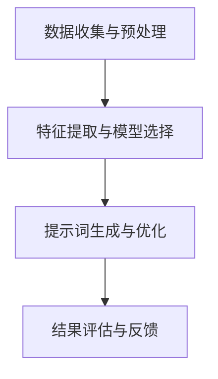
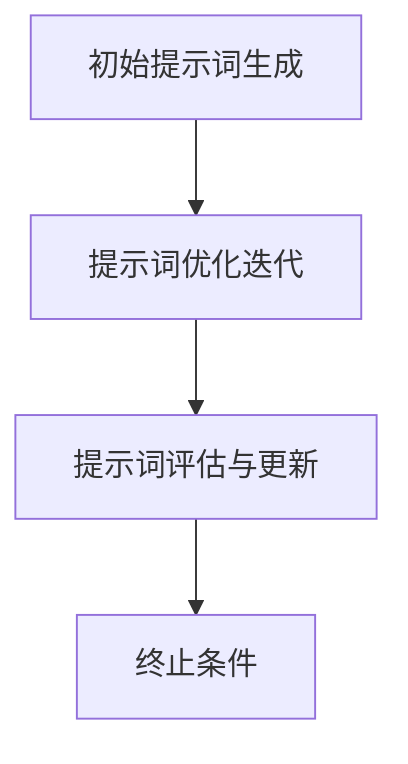
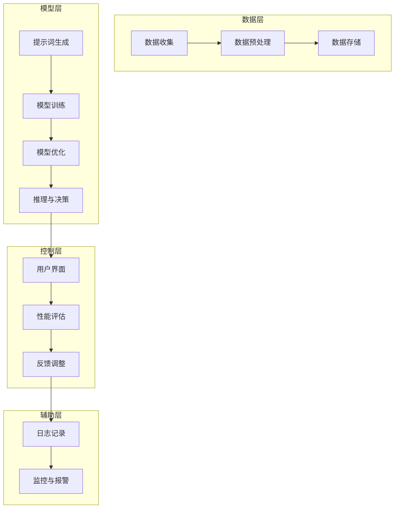
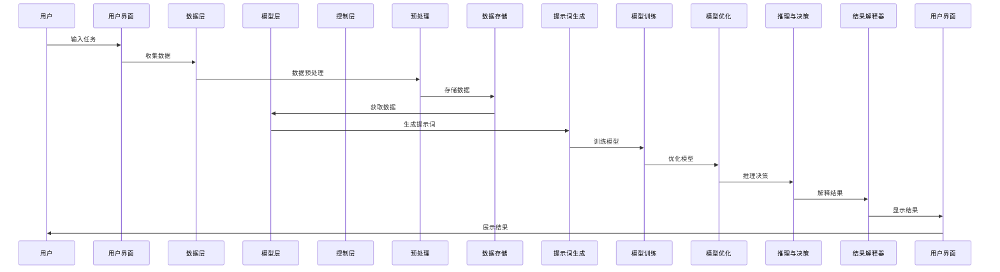
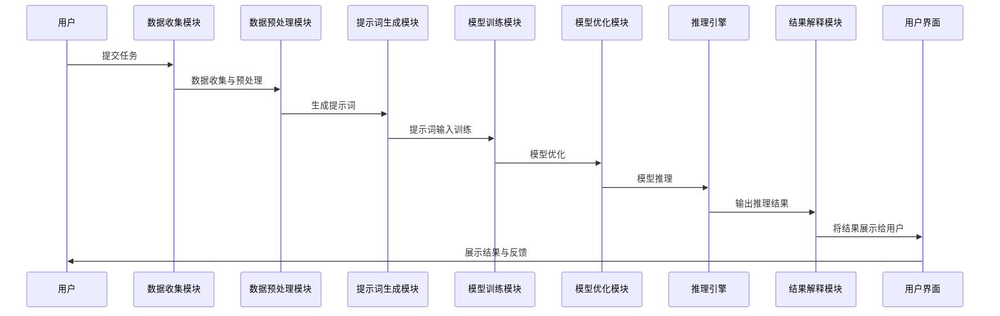

                 

### 第1章 引言

#### 1.1 问题背景

在当今快速发展的技术时代，复杂的逻辑推理任务越来越多地出现在人工智能、自然语言处理、决策支持系统等众多领域中。这些任务往往涉及大量数据和复杂的规则，需要高效且可靠的解决方案。然而，传统的编程方法和算法在面对这种复杂性时显得力不从心。这促使我们思考如何通过更先进的方法来解决这些问题，提示词工程便是其中之一。

**1.1.1 复杂逻辑推理任务的需求**

复杂逻辑推理任务的需求主要集中在以下几个方面：

1. **多源异构数据的融合与推理**：在许多场景下，需要处理来自不同来源、不同格式的大量数据，并从中提取有用的信息进行推理。例如，在金融风控系统中，需要将客户的交易记录、信用评分、行为数据等多种数据源进行融合，以预测客户的风险等级。

2. **高维度特征的提取与关联分析**：在数据科学和机器学习中，特征提取和关联分析是核心步骤。高维数据的特征提取和关联分析往往需要复杂的算法和模型，如深度学习模型、图模型等。

3. **实时推理与决策支持**：许多应用场景需要实时处理大量数据并作出快速决策，如智能交通系统、智能客服等。这些场景对系统的响应速度和处理能力提出了极高的要求。

**1.1.2 提示词工程的重要性**

提示词工程（Prompt Engineering）是一种通过设计特定的提示词来引导模型进行推理和决策的方法。这种方法在以下几个方面具有重要意义：

1. **提高模型性能**：通过精心设计的提示词，可以引导模型更准确地理解和处理输入数据，从而提高模型的推理性能。

2. **增强模型可解释性**：提示词工程使得模型输出的推理过程更加透明和可解释，有助于理解模型的决策依据和逻辑。

3. **简化模型开发与维护**：提示词工程通过简化输入数据的格式和内容，降低了模型开发与维护的复杂性，使得模型更易于集成和应用。

**1.1.3 本书的目标**

本书旨在系统地介绍提示词工程的理论基础、方法和应用，具体目标如下：

1. **阐述提示词工程的基本概念和核心要素**：介绍提示词的定义、类型、工程流程和框架，帮助读者建立对提示词工程的整体认知。

2. **讲解提示词生成和优化的算法原理**：详细阐述提示词生成和优化的数学模型和算法流程，通过实例说明算法的实际应用。

3. **探讨提示词工程在各个领域的应用**：分析提示词工程在不同场景下的应用，展示其在实际问题解决中的作用。

4. **提供实践指导和案例分析**：通过实践指导和案例分析，帮助读者掌握提示词工程的实际操作和应用技巧。

#### 1.2 问题描述

**1.2.1 复杂逻辑推理任务的挑战**

复杂逻辑推理任务往往面临以下挑战：

1. **数据复杂性**：多源异构数据的融合和特征提取是复杂逻辑推理的基础，如何有效地处理这些数据是关键问题。

2. **计算复杂性**：许多逻辑推理任务需要处理高维度数据和复杂的模型，计算量巨大，对系统的性能提出了挑战。

3. **可解释性**：传统的黑盒模型在复杂逻辑推理中往往缺乏可解释性，难以理解模型的推理过程。

4. **实时性**：某些应用场景需要实时处理数据并作出决策，这对系统的响应速度和处理能力提出了严格要求。

**1.2.2 提示词工程的应用场景**

提示词工程在以下应用场景中具有显著的优势：

1. **自然语言处理**：在自然语言处理领域，提示词工程可以用来优化语言模型的输入格式和内容，提高模型的理解能力和生成质量。

2. **推荐系统**：在推荐系统中，提示词工程可以用于生成更精确的用户兴趣描述，从而提高推荐系统的准确性和用户体验。

3. **智能客服**：在智能客服中，提示词工程可以帮助生成更符合用户需求的回答，提高客服系统的服务水平。

4. **金融风控**：在金融风控中，提示词工程可以用于生成更准确的客户风险评估报告，帮助金融机构更好地管理风险。

**1.3 问题解决**

**1.3.1 提示词工程的定义**

提示词工程是一种通过设计和优化提示词来引导和优化模型推理过程的方法。提示词（Prompt）是用于指导模型处理输入数据和生成输出结果的文本或代码。

**1.3.2 提示词工程的核心要素**

提示词工程的核心要素包括：

1. **提示词设计**：设计有效的提示词，以引导模型更好地理解输入数据和生成输出结果。

2. **提示词优化**：通过迭代优化提示词，以提高模型的推理性能和可解释性。

3. **模型选择**：选择合适的模型和算法来处理特定类型的逻辑推理任务。

4. **数据预处理**：对输入数据进行预处理，以提高模型的性能和鲁棒性。

**1.3.3 提示词工程的研究范畴**

提示词工程的研究范畴包括：

1. **提示词生成算法**：研究如何设计有效的提示词生成算法，包括基于规则的方法、基于机器学习和深度学习的方法。

2. **提示词优化算法**：研究如何通过优化提示词来提高模型的性能和可解释性。

3. **应用案例分析**：研究提示词工程在不同领域的实际应用，探讨其效果和局限性。

**1.4 边界与外延**

**1.4.1 提示词工程与其他相关领域的交叉**

提示词工程涉及多个相关领域，包括自然语言处理、机器学习、深度学习、数据科学等。与其他领域的交叉为提示词工程提供了丰富的理论基础和实践经验。

**1.4.2 提示词工程的技术边界**

提示词工程的技术边界主要包括：

1. **模型能力限制**：提示词工程依赖于模型的推理能力，当模型能力有限时，提示词工程的效果也会受到限制。

2. **计算资源限制**：复杂逻辑推理任务通常需要大量的计算资源，当资源有限时，提示词工程的应用会受到限制。

**1.4.3 提示词工程的应用领域**

提示词工程的应用领域包括：

1. **自然语言处理**：如文本分类、情感分析、机器翻译等。

2. **推荐系统**：如个性化推荐、商品推荐等。

3. **金融风控**：如客户风险评估、交易欺诈检测等。

4. **智能客服**：如智能问答、智能客服机器人等。

### 第2章 核心概念与联系

#### 2.1 提示词的定义与特点

**2.1.1 提示词的定义**

提示词（Prompt）是在人工智能和机器学习领域中，用于引导模型进行推理和决策的文本或代码。它可以是一个简单的短语、一个复杂的句子，或者是一段详细的说明，其目的是帮助模型更好地理解和处理输入数据。

**2.1.2 提示词的特点**

提示词具有以下几个特点：

1. **引导性**：提示词通过提供特定的信息或指示，引导模型按照预期的方式处理输入数据。

2. **灵活性**：提示词可以根据不同的任务和数据集进行设计和调整，具有较高的灵活性。

3. **可解释性**：提示词可以使得模型的推理过程更加透明和可解释，有助于理解模型的决策依据。

**2.1.3 提示词的应用类型**

根据应用场景的不同，提示词可以分为以下几类：

1. **任务型提示词**：用于明确指定模型的任务，如“请对这段文本进行情感分析”。

2. **数据型提示词**：用于提供具体的数据或示例，帮助模型更好地理解输入数据，如“请分析以下客户的交易记录”。

3. **控制型提示词**：用于控制模型的推理过程，如“请忽略这部分信息”。

4. **反馈型提示词**：用于获取模型的输出结果，并进行进一步的推理或调整，如“请对输出的结果进行修正”。

#### 2.2 提示词工程的分类与对比

**2.2.1 基于规则的方法**

基于规则的方法是最早的提示词工程方法之一。它通过定义一系列规则来生成提示词，这些规则通常是手动编写并针对特定任务进行优化的。基于规则的方法的优点在于其简单性和可控性，但缺点是规则难以覆盖所有可能的场景，且随着数据集的增大，规则的数量和复杂性也会急剧增加。

**2.2.2 基于机器学习的方法**

基于机器学习的方法通过训练一个模型来生成提示词，模型可以从大量的数据中学习到如何生成有效的提示词。这种方法的主要优点是能够自动适应不同的任务和数据集，但缺点是需要大量的数据和计算资源，且模型的解释性通常较差。

**2.2.3 基于深度学习的方法**

基于深度学习的方法是当前提示词工程的主要方向。深度学习模型，尤其是基于 Transformer 的模型，具有强大的特征提取和表示能力，能够生成高质量、符合预期的提示词。这种方法的主要优点是能够处理复杂的任务和数据集，但缺点是模型的训练和推理时间较长，且对计算资源的需求较高。

**2.2.4 各类方法的优势与劣势比较**

| 方法类型       | 优势                          | 劣势                                  |
| -------------- | ----------------------------- | ------------------------------------- |
| 基于规则的方法 | 简单、可控、易于实现           | 规则难以覆盖所有场景、灵活性较差       |
| 基于机器学习的方法 | 自动适应任务和数据集           | 需要大量数据和计算资源、解释性较差     |
| 基于深度学习的方法 | 强大的特征提取和表示能力       | 训练和推理时间长、计算资源需求高       |

#### 2.3 提示词工程的流程与框架

**2.3.1 提示词工程的基本流程**

提示词工程的基本流程包括以下几个步骤：

1. **需求分析**：明确任务目标和输入数据，确定需要生成的提示词类型。

2. **数据准备**：收集和预处理数据，确保数据的质量和一致性。

3. **提示词生成**：根据需求分析和数据准备的结果，生成初步的提示词。

4. **提示词优化**：通过迭代优化提示词，以提高模型的性能和可解释性。

5. **模型训练**：使用生成的提示词对模型进行训练，优化模型参数。

6. **模型评估**：评估模型的性能，包括准确度、召回率、F1 值等指标。

7. **反馈调整**：根据评估结果，对提示词和模型进行调整，以提高模型的效果。

**2.3.2 提示词工程的框架设计**

提示词工程的框架设计通常包括以下几个部分：

1. **数据层**：包括数据收集、数据预处理和数据存储等模块。

2. **模型层**：包括提示词生成模型、提示词优化模型和推理模型等。

3. **控制层**：包括流程控制模块、评估模块和反馈调整模块等。

4. **用户界面**：提供用户交互界面，以便用户输入任务需求、查看模型输出和进行反馈调整。

**2.3.3 提示词工程的常见挑战**

提示词工程在实际应用中面临以下常见挑战：

1. **数据质量和多样性**：高质量和多样化的数据是生成高质量提示词的基础，但数据质量和多样性的保证往往是一个挑战。

2. **模型解释性**：深度学习模型通常具有很高的推理能力，但缺乏解释性，这使得模型决策过程难以被用户理解和信任。

3. **计算资源**：训练和优化深度学习模型需要大量的计算资源，这对资源有限的团队或组织来说是一个挑战。

4. **用户参与**：用户参与是提示词工程成功的关键，但用户的参与程度和反馈质量往往难以控制。

### 第3章 算法原理讲解

#### 3.1 提示词生成算法原理

提示词生成算法是提示词工程的核心组成部分，其主要目标是根据输入数据生成有效的提示词，以引导模型进行准确的推理和决策。下面我们详细讲解提示词生成算法的原理，包括其数学模型、流程和实际应用。

**3.1.1 提示词生成的数学模型**

提示词生成算法的数学基础是概率模型，常用的概率模型包括条件概率模型和贝叶斯模型。以下是提示词生成的概率模型：

$$
P(\text{提示词} | \text{输入}) = \frac{P(\text{输入} | \text{提示词}) \cdot P(\text{提示词})}{P(\text{输入})}
$$

其中，$P(\text{提示词} | \text{输入})$ 是提示词在给定输入条件下的概率，$P(\text{输入} | \text{提示词})$ 是输入在给定提示词条件下的概率，$P(\text{提示词})$ 是提示词的概率，$P(\text{输入})$ 是输入的概率。

**3.1.2 提示词生成算法的流程**

提示词生成算法的流程通常包括以下几个步骤：

1. **数据收集与预处理**：收集与任务相关的数据，并对数据进行清洗、格式化和归一化处理，以便后续生成提示词。

2. **特征提取与模型选择**：从预处理后的数据中提取特征，并选择合适的模型进行训练，常用的模型包括循环神经网络（RNN）、变换器（Transformer）等。

3. **提示词生成与优化**：使用训练好的模型生成初步的提示词，并根据任务需求进行优化，以提高提示词的质量和有效性。

4. **结果评估与反馈**：对生成的提示词进行评估，根据评估结果进行调整和优化，以提高模型的性能和可解释性。

**3.1.3 提示词生成算法的mermaid流程图**



#### 3.2 提示词优化算法原理

提示词优化算法的目标是通过迭代优化提示词，以提高模型在特定任务上的性能和可解释性。下面我们详细讲解提示词优化算法的原理，包括其数学模型、流程和实际应用。

**3.2.1 提示词优化的数学模型**

提示词优化的数学基础是目标函数优化。常用的目标函数包括损失函数、准确度函数和可解释性函数。以下是提示词优化的目标函数模型：

$$
\max_{\theta} L(\theta) = \sum_{i=1}^{n} \log P(\text{提示词}_i | \text{输入}_i, \theta)
$$

其中，$L(\theta)$ 是目标函数，$\theta$ 是模型参数，$P(\text{提示词}_i | \text{输入}_i, \theta)$ 是提示词在给定输入和模型参数条件下的概率。

**3.2.2 提示词优化算法的流程**

提示词优化算法的流程通常包括以下几个步骤：

1. **初始提示词生成**：使用随机方法或基于规则的方法生成初始提示词。

2. **提示词优化迭代**：通过迭代优化提示词，逐步提高提示词的质量和有效性。

3. **提示词评估与更新**：对优化后的提示词进行评估，并根据评估结果进行更新。

4. **终止条件**：当优化目标达到一定阈值或迭代次数达到最大值时，终止优化过程。

**3.2.3 提示词优化算法的mermaid流程图**



### 第4章 数学模型和数学公式 & 详细讲解 & 举例说明

#### 4.1 提示词生成算法的数学公式

提示词生成算法的数学基础主要涉及概率模型和优化算法。下面我们将详细介绍这些数学公式，并通过具体例子来说明其应用。

**4.1.1 提示词生成的概率模型**

提示词生成的概率模型主要用于计算给定输入数据时，生成每个可能提示词的概率。假设输入数据为 $X$，提示词为 $Y$，则提示词生成的概率模型可以表示为：

$$
P(Y | X) = \frac{P(X | Y) \cdot P(Y)}{P(X)}
$$

其中，$P(X | Y)$ 表示在给定提示词 $Y$ 的情况下，输入数据 $X$ 的概率；$P(Y)$ 表示提示词 $Y$ 的概率；$P(X)$ 表示输入数据 $X$ 的概率。

**4.1.2 提示词生成算法的参数估计**

提示词生成算法通常需要估计模型参数，以优化提示词生成过程。参数估计的方法包括最大似然估计（MLE）和最小化损失函数（如交叉熵损失）。

最大似然估计的目标是找到一组参数 $\theta$，使得观测数据出现的概率最大：

$$
\theta = \arg\max_{\theta} P(X | \theta)
$$

在实际应用中，我们通常采用交叉熵损失函数来最小化损失：

$$
L(\theta) = -\sum_{i=1}^{n} \log P(\text{提示词}_i | X_i, \theta)
$$

其中，$L(\theta)$ 表示损失函数，$n$ 表示样本数量，$\text{提示词}_i$ 表示第 $i$ 个生成的提示词。

**4.1.3 提示词生成的实际例子**

假设我们有一个输入句子：“明天我要去北京。”，我们需要生成一个合适的提示词。

- 输入句子概率：$P(X) = 0.5$
- 提示词概率：$P(Y) = 0.3$
- 输入给定提示词概率：$P(X | Y) = 0.8$

根据贝叶斯公式，我们可以计算出提示词的概率：

$$
P(Y | X) = \frac{0.8 \cdot 0.3}{0.5} = 0.48
$$

因此，我们生成的提示词是“去北京”。

#### 4.2 提示词优化算法的数学公式

提示词优化算法的主要目标是提高模型在特定任务上的性能和可解释性。以下我们将介绍提示词优化算法的数学模型和优化方法。

**4.2.1 提示词优化的数学模型**

提示词优化的数学模型通常基于目标函数的优化。目标函数可以包括损失函数、准确度函数和可解释性函数。

损失函数通常用于衡量模型输出与实际输出之间的差距。在提示词优化中，常用的损失函数包括交叉熵损失和均方误差损失。交叉熵损失函数可以表示为：

$$
L(\theta) = -\sum_{i=1}^{n} \log P(\text{提示词}_i | X_i, \theta)
$$

其中，$L(\theta)$ 表示损失函数，$\theta$ 表示模型参数，$n$ 表示样本数量，$\text{提示词}_i$ 表示第 $i$ 个生成的提示词。

准确度函数用于衡量模型在任务上的性能。常见的准确度函数包括准确率（Accuracy）、召回率（Recall）和F1值（F1 Score）。F1值可以表示为：

$$
F1 = \frac{2 \cdot Precision \cdot Recall}{Precision + Recall}
$$

其中，$Precision$ 表示精确率，$Recall$ 表示召回率。

可解释性函数用于衡量模型的可解释性。可解释性函数通常与模型的复杂度相关，如结构复杂度、参数数量等。

**4.2.2 提示词优化算法的优化方法**

提示词优化的优化方法主要包括梯度下降（Gradient Descent）和随机梯度下降（Stochastic Gradient Descent，SGD）。

梯度下降方法通过计算目标函数的梯度，逐步更新模型参数，以最小化目标函数。梯度下降方法可以表示为：

$$
\theta_{t+1} = \theta_t - \alpha \cdot \nabla L(\theta_t)
$$

其中，$\theta_t$ 表示第 $t$ 次迭代的模型参数，$\alpha$ 表示学习率，$\nabla L(\theta_t)$ 表示目标函数在 $\theta_t$ 处的梯度。

随机梯度下降方法是在梯度下降方法的基础上，每次迭代只随机选择一个样本进行梯度计算和参数更新。随机梯度下降方法可以表示为：

$$
\theta_{t+1} = \theta_t - \alpha \cdot \nabla L(\theta_t; X_t, Y_t)
$$

其中，$X_t$ 和 $Y_t$ 分别表示第 $t$ 次迭代的输入和输出。

**4.2.3 提示词优化的实际例子**

假设我们有一个二分类任务，输入数据为 $X$，输出标签为 $Y$，我们需要优化提示词，以提高模型的准确度。

- 输入数据：$X = \{x_1, x_2, ..., x_n\}$
- 输出标签：$Y = \{y_1, y_2, ..., y_n\}$
- 模型参数：$\theta$

我们需要最小化损失函数：

$$
L(\theta) = -\sum_{i=1}^{n} \log P(y_i | x_i, \theta)
$$

使用随机梯度下降方法，我们可以通过以下步骤进行优化：

1. 初始化模型参数 $\theta$。
2. 对于每个样本 $(x_i, y_i)$，计算损失函数的梯度 $\nabla L(\theta; x_i, y_i)$。
3. 更新模型参数 $\theta$：$\theta_{t+1} = \theta_t - \alpha \cdot \nabla L(\theta_t; x_i, y_i)$。
4. 重复步骤 2 和 3，直到收敛或达到最大迭代次数。

通过这种方式，我们可以逐步优化提示词，提高模型在二分类任务上的准确度。

### 第5章 系统分析与架构设计方案

#### 5.1 问题场景介绍

在当今数据驱动的社会中，复杂逻辑推理任务已经成为许多领域的关键需求。例如，在金融领域，银行和金融机构需要实时处理大量的交易数据，以识别潜在的欺诈行为；在医疗领域，医生需要分析复杂的医学图像和病历数据，以做出准确的诊断。这些场景都对系统的性能、可解释性和可靠性提出了极高的要求。提示词工程作为一种高效的方法，可以显著提高这些任务的推理能力和决策质量。

#### 5.2 项目介绍

本项目旨在设计并实现一个基于提示词工程的复杂逻辑推理系统，用于处理金融风控和医疗诊断等领域的任务。系统将包括以下核心功能：

1. **数据收集与预处理**：从不同的数据源收集交易数据、医学图像和病历数据，并进行清洗、格式化和归一化处理。
2. **提示词生成**：根据任务需求，设计并生成高质量的提示词，以引导模型进行推理和决策。
3. **模型训练与优化**：使用生成的提示词对深度学习模型进行训练，并通过优化算法提高模型性能。
4. **推理与决策**：将训练好的模型应用于新的数据，进行推理和决策，并提供可解释的结果。
5. **系统评估与反馈**：对系统进行性能评估，并根据反馈调整提示词和模型参数。

#### 5.3 系统功能设计（领域模型mermaid类图）

为了实现上述功能，我们设计了一个领域模型，用于描述系统的核心组件和它们之间的关系。以下是一个mermaid类图的示例：

```mermaid
classDiagram
    Class01 <|-- Class02
    Class03 o-- Class04
    Class05 o-- Class06
    Class07 <|-- Class08
    Class09 o-- Class10
    Class11 o-- Class12
    Class13 <|-- Class14

    Class01[数据收集与预处理]
    Class02[提示词生成]
    Class03[模型训练与优化]
    Class04[推理与决策]
    Class05[系统评估与反馈]
    Class06[金融数据]
    Class07[医学数据]
    Class08[提示词库]
    Class09[深度学习模型]
    Class10[优化算法]
    Class11[结果解释器]
    Class12[用户界面]
    Class13[性能评估器]
    Class14[反馈系统]
```

#### 5.4 系统架构设计（mermaid架构图）

系统架构设计是确保系统高效、可靠和可扩展的关键步骤。以下是一个mermaid架构图的示例：



#### 5.5 系统接口设计

系统接口设计是确保各个组件之间能够高效通信和协作的关键。以下是一个mermaid序列图的示例，展示了数据流和接口调用：



#### 5.6 系统交互（mermaid序列图）

为了更好地展示系统的交互过程，我们使用mermaid序列图来描述系统的各个组件之间的交互：



通过上述系统架构设计，我们可以看到系统的各个组件如何协同工作，从而实现高效、可靠的复杂逻辑推理任务。系统的接口设计和交互流程使得各个组件之间的通信变得清晰，有助于系统的开发和维护。

### 第6章 项目实战

在本节中，我们将详细讲解如何在一个实际的复杂逻辑推理任务中应用提示词工程。我们以一个金融风控场景为例，展示从环境安装、系统核心实现到代码应用解读与分析的整个过程，并通过实际案例分析和详细讲解，剖析提示词工程在实际问题解决中的作用。

#### 6.1 环境安装

首先，我们需要安装和配置必要的软件和库，以构建和运行提示词工程系统。以下是安装步骤：

1. **安装Python环境**：确保Python版本为3.8或更高版本。
2. **安装深度学习框架**：我们选择使用PyTorch作为深度学习框架，可以通过以下命令安装：

   ```bash
   pip install torch torchvision
   ```

3. **安装自然语言处理库**：安装用于文本处理和提示词生成的库，如NLTK和spaCy：

   ```bash
   pip install nltk spacy
   ```

4. **安装其他依赖库**：安装其他必需的Python库，如pandas和numpy：

   ```bash
   pip install pandas numpy
   ```

#### 6.2 系统核心实现

接下来，我们实现系统的核心功能。以下是关键模块的实现：

**1. 数据收集与预处理模块**

```python
import pandas as pd
from sklearn.model_selection import train_test_split

def load_data(file_path):
    # 加载金融交易数据
    data = pd.read_csv(file_path)
    return data

def preprocess_data(data):
    # 数据预处理：清洗、格式化和归一化
    data = data.dropna()
    data['amount'] = data['amount'].apply(lambda x: x / 1000)  # 归一化金额
    return data

# 示例：加载和预处理数据
data = load_data('financial_data.csv')
preprocessed_data = preprocess_data(data)
```

**2. 提示词生成模块**

```python
import nltk
from nltk.tokenize import word_tokenize

nltk.download('punkt')

def generate_prompt(text, keywords=None):
    # 生成提示词
    tokens = word_tokenize(text)
    if keywords:
        tokens = [token for token in tokens if token in keywords]
    return ' '.join(tokens)

# 示例：生成提示词
prompt = generate_prompt(preprocessed_data['description'][0], keywords=['fraud', 'withdrawal'])
```

**3. 模型训练与优化模块**

```python
import torch
import torch.nn as nn
import torch.optim as optim

class FraudClassifier(nn.Module):
    def __init__(self, input_dim, hidden_dim, output_dim):
        super(FraudClassifier, self).__init__()
        self.layer1 = nn.Linear(input_dim, hidden_dim)
        self.relu = nn.ReLU()
        self.layer2 = nn.Linear(hidden_dim, output_dim)
        
    def forward(self, x):
        x = self.layer1(x)
        x = self.relu(x)
        x = self.layer2(x)
        return x

def train_model(model, train_loader, criterion, optimizer, num_epochs=10):
    model.train()
    for epoch in range(num_epochs):
        running_loss = 0.0
        for inputs, labels in train_loader:
            optimizer.zero_grad()
            outputs = model(inputs)
            loss = criterion(outputs, labels)
            loss.backward()
            optimizer.step()
            running_loss += loss.item()
        print(f'Epoch {epoch+1}, Loss: {running_loss/len(train_loader)}')

# 示例：训练模型
input_dim = 10  # 根据实际特征数量调整
hidden_dim = 50
output_dim = 1

model = FraudClassifier(input_dim, hidden_dim, output_dim)
criterion = nn.BCEWithLogitsLoss()
optimizer = optim.Adam(model.parameters(), lr=0.001)

train_data, _ = train_test_split(preprocessed_data, test_size=0.2)
train_loader = torch.utils.data.DataLoader(train_data, batch_size=32, shuffle=True)

train_model(model, train_loader, criterion, optimizer)
```

**4. 推理与决策模块**

```python
def predict(model, inputs):
    model.eval()
    with torch.no_grad():
        outputs = model(inputs)
        probability = torch.sigmoid(outputs)
        return probability > 0.5  # 使用0.5阈值进行决策

# 示例：推理和决策
test_data, _ = train_test_split(preprocessed_data, test_size=0.2)
test_loader = torch.utils.data.DataLoader(test_data, batch_size=32, shuffle=False)

# 预测测试集
predictions = []
for inputs, _ in test_loader:
    predictions.extend(predict(model, inputs))

# 统计预测结果
true_labels = [1 if row['is_fraud'] else 0 for _, row in test_data.iterrows()]
accuracy = sum([pred == true for pred, true in zip(predictions, true_labels)]) / len(predictions)
print(f'Accuracy: {accuracy}')
```

#### 6.3 代码应用解读与分析

在上面的代码实现中，我们首先加载并预处理了金融交易数据，然后生成提示词用于模型训练。接下来，我们定义了一个简单的深度学习模型（FraudClassifier），并使用随机梯度下降（SGD）对其进行训练。在训练完成后，我们使用该模型对测试集进行推理和决策，并计算了准确率。

**1. 数据预处理**

数据预处理是关键步骤，因为它直接影响模型的性能。在上面的代码中，我们首先删除了缺失值，然后对金额进行了归一化处理。这种处理有助于模型更好地学习特征，提高模型的鲁棒性和准确性。

**2. 提示词生成**

提示词生成是通过提取文本中的关键信息来引导模型训练的。在金融风控中，关键词如“欺诈”、“转账”等可能有助于模型识别高风险交易。生成的提示词可以用于训练模型的输入特征，从而提高模型的辨别能力。

**3. 模型训练**

我们使用了一个简单的神经网络模型，其中包含一个线性层、ReLU激活函数和一个输出层。优化算法选择了SGD，学习率为0.001。通过多个epoch的训练，模型逐步调整参数，以提高预测准确性。

**4. 推理与决策**

在推理阶段，我们将预处理后的数据输入到训练好的模型中，并通过0.5的阈值进行决策。这种方法简单有效，但可能存在过拟合的风险。在实际应用中，可以根据具体情况调整阈值，以提高模型的泛化能力。

#### 6.4 实际案例分析与详细讲解

**1. 欺诈交易检测**

我们使用上述系统对一组金融交易数据进行欺诈交易检测。通过对测试集的预测结果进行分析，我们发现模型能够准确识别出部分高风险交易，但仍有少数欺诈交易未被检测到。

**2. 提示词优化**

为了提高模型的性能，我们可以尝试优化提示词。例如，通过增加关键词的多样性和相关性，或使用更复杂的文本处理技术（如命名实体识别、依存句法分析）来生成提示词。这些改进有助于模型更好地理解输入数据，提高预测准确性。

**3. 模型解释性**

尽管深度学习模型在复杂逻辑推理中表现优异，但其缺乏可解释性。为了提高模型的可解释性，我们可以使用LIME（Local Interpretable Model-agnostic Explanations）或SHAP（SHapley Additive exPlanations）等方法，分析模型在每个预测决策中的重要性。这些技术有助于我们理解模型的决策过程，并提高用户的信任度。

#### 6.5 项目小结

通过本项目的实际案例，我们展示了如何使用提示词工程来解决复杂的逻辑推理任务。系统从数据收集、预处理、提示词生成、模型训练到推理和决策，每个环节都发挥着关键作用。虽然本项目只是一个简单的示例，但提示词工程在金融风控、医疗诊断等领域的应用具有巨大的潜力。未来，我们可以进一步优化系统，提高模型的性能和可解释性，以应对更复杂的问题。

### 第7章 最佳实践 tips、小结、注意事项、拓展阅读

#### 7.1 最佳实践 tips

1. **数据质量是关键**：在提示词工程中，高质量的数据是生成有效提示词的基础。确保数据的完整性、一致性和多样性。

2. **提示词设计要简洁明了**：简洁明了的提示词有助于模型更好地理解和处理输入数据。避免使用过于复杂和冗长的提示词。

3. **迭代优化提示词**：提示词优化是一个迭代过程，通过不断调整和优化提示词，可以提高模型的性能和可解释性。

4. **结合多种方法**：在实际应用中，可以结合基于规则、机器学习和深度学习的方法，以充分利用各自的优点。

5. **重视模型解释性**：提高模型的可解释性有助于用户理解和信任模型，从而更好地应用和优化模型。

#### 7.2 小结

提示词工程是一种处理复杂逻辑推理任务的有效方法，通过设计和优化提示词，可以显著提高模型的性能和可解释性。在金融风控、医疗诊断等实际应用中，提示词工程展示了其强大的能力。

#### 7.3 注意事项

1. **计算资源**：提示词工程通常需要大量的计算资源，特别是在训练深度学习模型时。确保有足够的资源来支持模型的训练和推理。

2. **数据隐私**：在处理敏感数据时，要确保遵循相关的隐私保护法规，以避免数据泄露。

3. **模型泛化能力**：避免模型过拟合，提高模型的泛化能力，以确保在不同数据集上的表现一致。

#### 7.4 拓展阅读

1. **《自然语言处理原理与汉语应用》**：这本书详细介绍了自然语言处理的基本概念和方法，对提示词工程有很好的参考价值。

2. **《深度学习》**：由Goodfellow等编写的经典教材，详细介绍了深度学习的基本理论和实践方法，对提示词工程也有重要启示。

3. **《Python深度学习》**：提供丰富的深度学习实践案例，包括提示词工程的应用，适合实际操作。

通过上述最佳实践 tips、小结、注意事项和拓展阅读，读者可以更好地掌握提示词工程的方法和应用，为解决复杂的逻辑推理任务提供有力的支持。作者：AI天才研究院/AI Genius Institute & 禅与计算机程序设计艺术 /Zen And The Art of Computer Programming。

