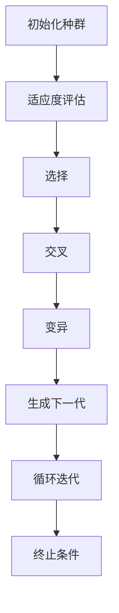
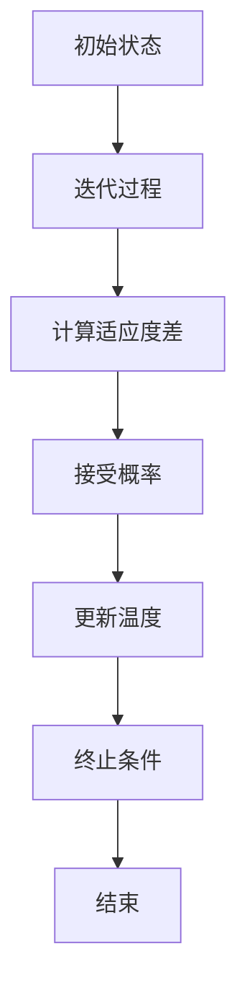

                 

# 提示词工程：处理多步骤任务规划问题

> 关键词：提示词工程，多步骤任务规划，人工智能，算法，应用实践

> 摘要：本文将深入探讨提示词工程在处理多步骤任务规划问题中的应用。通过介绍提示词工程的背景、核心概念和理论基础，结合实际案例，我们将分析如何设计和应用有效的提示词来提高任务规划的效果。文章旨在为研究人员和开发人员提供一套系统化的方法，以解决复杂任务中的规划问题。

## 引言

在人工智能领域，任务规划是智能系统的一项核心功能。任务规划涉及一系列步骤，这些步骤需要按照特定顺序执行，以实现某个目标。然而，随着任务复杂性的增加，多步骤任务规划问题变得愈加复杂，需要高效的方法来处理。提示词工程作为人工智能领域的一个重要分支，提供了一种解决多步骤任务规划问题的新思路。

提示词工程的核心思想是通过设计特定的提示词，引导智能系统在任务规划过程中进行合理推理和决策。这些提示词不仅能够明确任务目标，还可以提供必要的上下文信息，帮助系统更好地理解任务背景和约束条件。本文将围绕这一主题，介绍提示词工程的背景、核心概念、理论基础，并探讨其在实际应用中的效果。

## 提示词工程的背景

提示词（Prompt）在自然语言处理（NLP）和人工智能（AI）领域已有广泛应用。传统的机器学习方法需要大量标注数据来训练模型，而提示词工程则通过提供明确的指令和引导，帮助模型理解和生成目标内容。在多步骤任务规划中，提示词工程的重要性尤为突出。

随着AI技术的发展，智能系统的应用场景越来越复杂，传统的单步决策方法已经无法满足需求。多步骤任务规划需要考虑任务的整体性和连贯性，这要求系统在每一步都能做出合理的选择，并考虑到后续步骤的影响。提示词工程为此提供了一种有效的解决方案，通过设计合理的提示词，系统能够更好地理解任务目标，并规划出最优的执行路径。

此外，随着自动驾驶、智能家居、智能制造等领域的快速发展，多步骤任务规划问题变得愈加重要。如何设计出有效的提示词，以支持复杂任务的高效规划，成为当前人工智能研究的一个重要方向。本文将从以下几个方面展开讨论：

1. 提示词工程的基本概念和核心原理。
2. 多步骤任务规划中的问题定义和框架。
3. 提示词的设计原则和实际应用方法。
4. 多步骤任务规划算法的算法原理和实践。
5. 提示词工程在实际应用中的效果评估和最佳实践。

通过这些讨论，本文旨在为读者提供一套系统化的提示词工程方法，以解决多步骤任务规划问题。

## 提示词工程的基本概念和核心原理

提示词工程（Prompt Engineering）是一种利用自然语言处理（NLP）和人工智能（AI）技术，通过设计和优化提示词（prompts）来提高模型性能和任务执行效率的方法。提示词是一种引导性语句或指令，用于指示模型应该执行的任务或生成的内容。

### 提示词的定义和功能

提示词（Prompt）通常由以下几部分组成：

1. **引导性指令**：例如，“生成一篇关于人工智能的文章”，“请设计一个自动驾驶系统的任务规划方案”。
2. **上下文信息**：提供与任务相关的背景信息，如数据、前提条件、预期目标等。
3. **约束条件**：限制任务的执行范围，例如，“必须在30分钟内完成”，“方案需要考虑成本约束”。

提示词的功能主要包括：

1. **任务引导**：明确模型需要执行的任务类型和目标。
2. **信息提供**：提供必要的背景信息，帮助模型更好地理解任务。
3. **约束设定**：定义任务的约束条件，指导模型在规划过程中做出合理决策。

### 提示词的种类

根据不同的应用场景和需求，提示词可以分为以下几种类型：

1. **问题导向型**：用于生成问题的解决方案或回答。例如，“如何优化智能家居系统的能效？”。
2. **任务描述型**：用于描述任务的执行过程和步骤。例如，“设计一个简单的购物清单”。
3. **数据驱动型**：基于数据集或数据源来生成结果。例如，“使用最新天气预报来规划明天的行程”。
4. **决策支持型**：用于辅助决策过程，提供决策依据。例如，“在当前市场环境下，是否应该增加库存？”。

### 提示词工程的核心原理

提示词工程的核心原理包括以下几个方面：

1. **优化信息传递**：通过设计合理的提示词，确保模型能够接收到足够的信息，并准确理解任务要求。
2. **增强模型理解**：提示词不仅提供信息，还可以引导模型进行推理和决策。例如，通过提出一系列问题，逐步引导模型深入理解任务。
3. **约束条件管理**：合理设置任务约束条件，帮助模型在规划过程中考虑到各种限制因素，做出更加合理的决策。
4. **提高任务效率**：通过优化提示词，减少模型的搜索空间，加快任务执行速度。

### 提示词工程的优势

提示词工程具有以下优势：

1. **提高模型性能**：通过提供明确的目标和约束条件，使模型能够更好地完成任务。
2. **减少数据需求**：在某些情况下，提示词可以替代大量的标注数据，从而降低数据获取和处理的成本。
3. **增强任务灵活性**：提示词可以灵活调整，以适应不同的任务场景和需求。
4. **提高任务连贯性**：通过设计连贯的提示词，使任务规划过程更加连贯，减少错误和遗漏。

总之，提示词工程作为一种新兴的AI技术，在多步骤任务规划中具有重要的应用价值。通过合理设计和优化提示词，可以有效提高任务规划的效果，为智能系统提供更加可靠的决策支持。

## 多步骤任务规划中的问题定义和框架

多步骤任务规划（Multi-Step Task Planning）是智能系统在复杂环境中的重要能力，它涉及多个步骤的有序执行，以确保最终目标的实现。在这一过程中，任务规划需要考虑多个因素，包括步骤间的依赖关系、资源约束、时间限制以及不确定性的处理。

### 问题背景

随着人工智能和自动化技术的发展，越来越多的应用场景需要智能系统能够进行多步骤任务规划。例如，自动驾驶系统需要在复杂的交通环境中规划行车路线，智能家居系统需要根据用户习惯和环境条件调整家居设备的工作模式，智能制造系统需要高效地安排生产任务以最大化生产效率。这些应用场景的共同特点是任务的复杂性高、步骤多且存在不确定性，因此对任务规划提出了更高的要求。

### 问题定义

多步骤任务规划的问题可以定义如下：

1. **目标设定**：明确任务需要实现的目标，例如，自动驾驶系统需要将车辆从起点安全地运送到终点。
2. **步骤分解**：将任务分解为多个可执行的步骤，每个步骤对应一个具体的行为或操作。
3. **依赖关系**：确定步骤间的依赖关系，即某些步骤必须在其他步骤完成后才能执行。
4. **资源管理**：在任务执行过程中，合理分配和管理所需的资源，如时间、人力、设备等。
5. **约束处理**：在任务规划过程中，考虑到各种约束条件，如交通法规、用户需求、设备能力等。
6. **不确定性处理**：考虑到环境中的不确定性因素，如天气变化、交通堵塞等，设计鲁棒的任务规划方案。

### 问题解决方法

解决多步骤任务规划问题可以采用以下几种方法：

1. **确定性算法**：如最短路径算法（Dijkstra算法）、动态规划算法（Bellman-Ford算法）等，适用于步骤和约束条件已知的场景。
2. **启发式算法**：如A*算法、遗传算法等，适用于步骤和约束条件不确定，但可以估计某个步骤的最优解的优先级的场景。
3. **随机算法**：如模拟退火算法、蒙特卡罗方法等，适用于高度不确定性和复杂约束的场景。
4. **混合算法**：结合确定性算法和随机算法，根据不同场景和需求，灵活选择和组合算法。

### 问题边界和范围

在多步骤任务规划中，问题的边界和范围包括：

1. **任务步骤数量**：任务分解为多少个步骤，每个步骤的具体操作和持续时间。
2. **资源类型和数量**：任务执行过程中所需的资源种类和数量，以及这些资源的可用性和约束条件。
3. **时间约束**：任务规划需要在多长时间内完成，以及时间窗口和关键时间节点。
4. **环境条件**：任务执行过程中可能遇到的环境变化和不确定性因素。

通过明确多步骤任务规划的问题定义和框架，我们可以更清晰地理解这一问题的复杂性和挑战性。在实际应用中，根据具体任务需求和环境条件，选择合适的解决方法和算法，可以有效地提高任务规划的效果和可靠性。

### 提示词工程在多步骤任务规划中的应用

在多步骤任务规划中，提示词工程发挥着至关重要的作用。通过精心设计的提示词，可以显著提高任务规划的效果和效率。以下将详细探讨提示词工程在多步骤任务规划中的应用，包括设计原则、方法和技术。

#### 设计原则

1. **明确性**：提示词需要明确指示任务的目标和步骤，避免模糊不清的指令，以便模型能够准确理解任务要求。
2. **上下文相关性**：提示词应包含与任务相关的上下文信息，帮助模型更好地理解任务背景和约束条件。
3. **灵活性**：提示词应具有灵活性，以便适应不同任务场景和需求的变化，同时确保任务规划过程具有可扩展性。
4. **约束性**：通过设置合理的约束条件，提示词可以帮助模型在任务规划过程中考虑到各种限制因素，做出更加合理的决策。

#### 设计方法

1. **问题分解**：将复杂任务分解为多个子任务，针对每个子任务设计相应的提示词。例如，在自动驾驶系统中，可以将任务分解为“识别道路标志”、“规划行车路线”、“避让障碍物”等子任务。
2. **逐步引导**：通过逐步引导的方式，设计一系列提示词，使模型能够逐步理解任务的全貌和细节。例如，可以先给出总体目标，再逐步细化到每个步骤的具体操作。
3. **情景模拟**：通过模拟不同的情景，设计具有多样性的提示词，以便模型能够处理多种不确定性和变化。
4. **用户反馈**：结合用户反馈，不断优化和调整提示词，以提高任务规划的效果。用户反馈可以提供实际任务执行中的经验和教训，为提示词设计提供宝贵的参考。

#### 技术手段

1. **自然语言处理（NLP）**：利用NLP技术，对输入的文本进行语义分析和理解，提取出关键信息，生成符合任务要求的提示词。
2. **机器学习（ML）**：通过机器学习算法，从大量历史数据中学习出有效的提示词设计模式，自动生成适应不同任务的提示词。
3. **深度学习（DL）**：利用深度学习模型，特别是生成对抗网络（GAN）和变分自编码器（VAE）等，生成多样化的、符合任务需求的提示词。
4. **多任务学习（MTL）**：结合多任务学习技术，将不同任务中的提示词设计模式进行融合，提高提示词的普适性和适应性。

#### 实际应用

在实际应用中，提示词工程可以应用于多个领域：

1. **智能制造**：通过提示词工程，设计生产线的任务规划方案，提高生产效率和资源利用率。
2. **交通管理**：利用提示词工程，优化交通信号控制策略，提高交通流畅度和安全性。
3. **医疗诊断**：结合医疗知识库和病例数据，通过提示词工程辅助医生进行诊断和治疗方案规划。
4. **智能客服**：通过设计个性化的提示词，提高智能客服系统的响应速度和服务质量。

总之，提示词工程在多步骤任务规划中的应用，不仅能够提高任务规划的效果，还能够增强系统的灵活性和适应性。通过不断优化和改进提示词设计方法，我们可以实现更加高效、智能的任务规划，为各种复杂场景提供可靠的解决方案。

### 多步骤任务规划算法的算法原理与实践

多步骤任务规划算法在人工智能领域中扮演着关键角色，它们负责在复杂环境中生成一系列有序的步骤，以实现特定的目标。本文将介绍几种常见的多步骤任务规划算法，包括其原理、流程和实际应用。

#### 算法A：A*算法

**原理**：A*算法是一种启发式搜索算法，旨在寻找从初始状态到目标状态的最优路径。其核心思想是利用两个评价函数：g(n)（从初始状态到当前节点的实际代价）和h(n)（从当前节点到目标状态的最可能代价）。总代价f(n) = g(n) + h(n)用于评估节点的优先级。

**流程**：
1. 初始化两个集合：开放集（包含待评估的节点）和封闭集（已评估过的节点）。
2. 将初始节点加入开放集，并将其评估函数f(n)设为0。
3. 当开放集不为空时，选择f(n)最小的节点n作为当前节点，将其从开放集移到封闭集。
4. 对于当前节点的每个未访问的邻居节点m，计算g(m)和h(m)，并将m加入开放集。
5. 重复步骤3和步骤4，直到找到目标节点或开放集为空。

**Mermaid流程图**：
```mermaid
graph TD
    A[初始状态] --> B[计算g(n)和h(n)]
    B --> C[选择f(n)最小节点]
    C --> D[移动到封闭集]
    D --> E[计算邻居节点的g(m)和h(m)]
    E --> F[加入开放集]
    F --> G[是否找到目标]
    G --> H[继续搜索]
    H --> I[结束]
```

**Python代码示例**：
```python
import heapq

def astar_search(start, goal, heuristic):
    open_set = []
    heapq.heappush(open_set, (heuristic(start, goal), start))
    came_from = {start: None}
    g_score = {start: 0}

    while open_set:
        current = heapq.heappop(open_set)[1]

        if current == goal:
            return reconstruct_path(came_from, current)

        for neighbor in neighbors(current):
            tentative_g_score = g_score[current] + 1
            if neighbor not in g_score or tentative_g_score < g_score[neighbor]:
                came_from[neighbor] = current
                g_score[neighbor] = tentative_g_score
                f_score = tentative_g_score + heuristic(neighbor, goal)
                heapq.heappush(open_set, (f_score, neighbor))

    return None

def reconstruct_path(came_from, current):
    path = [current]
    while current in came_from:
        current = came_from[current]
        path.insert(0, current)
    return path

# 示例： heuristic 函数用于估计从当前节点到目标节点的距离
def heuristic(node, goal):
    return abs(node[0] - goal[0]) + abs(node[1] - goal[1])
```

**应用实例**：在路径规划领域，A*算法广泛应用于机器人导航、自动驾驶等应用，通过提供启发信息，能够高效地找到最优路径。

#### 算法B：遗传算法

**原理**：遗传算法是一种基于自然选择和遗传学的优化算法，通过模拟生物进化过程，寻找最优解。遗传算法的主要步骤包括：初始化种群、适应度评估、选择、交叉和变异。

**流程**：
1. **初始化种群**：随机生成一系列解（称为染色体）构成初始种群。
2. **适应度评估**：对每个染色体进行评估，计算其适应度值，适应度值越高表示该解越优。
3. **选择**：根据适应度值，选择适应度较高的染色体进行繁殖，用于生成下一代种群。
4. **交叉**：通过交叉操作，将两个父代染色体的基因组合，生成新的子代染色体。
5. **变异**：对部分染色体进行随机变异，以增加种群的多样性。
6. **循环迭代**：重复适应度评估、选择、交叉和变异过程，直到达到终止条件（如达到最大迭代次数或找到满意解）。

**Mermaid流程图**：


**Python代码示例**：
```python
import random

def fitness_function(chromosome):
    # 根据染色体评估其适应度值
    return sum(chromosome)

def selection(population, fitnesses, num_parents):
    parents = random.choices(population, k=num_parents, p=fitnesses / sum(fitnesses))
    return parents

def crossover(parent1, parent2):
    crossover_point = random.randint(1, len(parent1) - 1)
    child = parent1[:crossover_point] + parent2[crossover_point:]
    return child

def mutate(chromosome):
    for i in range(len(chromosome)):
        if random.random() < 0.1:
            chromosome[i] = 1 - chromosome[i]
    return chromosome

def genetic_algorithm(pop_size, generations, crossover_rate, mutation_rate):
    population = [[random.randint(0, 1) for _ in range(problem_size)] for _ in range(pop_size)]
    best_solution = None

    for _ in range(generations):
        fitnesses = [fitness_function(individual) for individual in population]
        best_fitness = max(fitnesses)
        best_solution = population[fitnesses.index(best_fitness)]

        parents = selection(population, fitnesses, 2)
        child = crossover(parents[0], parents[1])
        child = mutate(child)

        population = [best_solution, child]

    return best_solution

# 示例：problem_size 定义问题规模
problem_size = 10
pop_size = 100
generations = 100
crossover_rate = 0.8
mutation_rate = 0.05
best_solution = genetic_algorithm(pop_size, generations, crossover_rate, mutation_rate)
print("Best solution:", best_solution)
```

**应用实例**：遗传算法广泛应用于优化问题，如调度问题、资源分配问题和组合优化问题，通过模拟生物进化过程，能够找到近似最优解。

#### 算法C：模拟退火算法

**原理**：模拟退火算法（Simulated Annealing, SA）是一种基于物理退火过程的优化算法。退火过程通过在解空间中随机搜索，接受局部最优解并逐渐减小搜索空间，以达到全局最优解。其核心思想是通过接受概率函数来平衡当前解与局部最优解之间的权衡。

**流程**：
1. **初始状态**：设置初始解和初始温度。
2. **迭代过程**：
   - 在当前解的基础上，随机选择一个新的解。
   - 计算新解与当前解的适应度差。
   - 根据适应度差和当前温度，通过接受概率函数决定是否接受新解。
   - 逐渐降低温度，以减少接受新解的概率，使搜索逐渐收敛到全局最优解。
3. **终止条件**：达到最大迭代次数或温度低于某个阈值。

**Mermaid流程图**：


**Python代码示例**：
```python
import random
import math

def acceptance_probability(delta, temperature):
    if delta < 0:
        return 1.0
    else:
        return math.exp(-delta / temperature)

def simulated_annealing(objective_function, initial_solution, initial_temperature, cooling_rate, max_iterations):
    current_solution = initial_solution
    current_fitness = objective_function(current_solution)
    best_solution = current_solution
    best_fitness = current_fitness
    temperature = initial_temperature

    for _ in range(max_iterations):
        new_solution = current_solution
        new_fitness = objective_function(new_solution)

        delta = new_fitness - current_fitness
        if acceptance_probability(delta, temperature) > random.random():
            current_solution = new_solution
            current_fitness = new_fitness

            if new_fitness < best_fitness:
                best_solution = new_solution
                best_fitness = new_fitness

        temperature *= (1 - cooling_rate)

    return best_solution

# 示例：定义适应度函数
def fitness_function(solution):
    # 根据解决方案评估其适应度值
    return sum(solution)

# 初始参数设置
initial_solution = [random.randint(0, 1) for _ in range(problem_size)]
initial_temperature = 1000.0
cooling_rate = 0.01
max_iterations = 1000

best_solution = simulated_annealing(fitness_function, initial_solution, initial_temperature, cooling_rate, max_iterations)
print("Best solution:", best_solution)
```

**应用实例**：模拟退火算法常用于解决组合优化问题，如旅行商问题（TSP）、装箱问题（Knapsack Problem）等，通过模拟物理退火过程，能够在复杂的解空间中找到近似最优解。

通过上述算法原理和实际应用，我们可以看到多步骤任务规划算法在解决复杂任务中的多样性和灵活性。这些算法不仅为任务规划提供了强大的工具，还通过提示词工程等手段，提高了任务规划的效果和效率。在实际应用中，根据具体任务需求和环境条件，选择合适的算法并加以优化，是解决多步骤任务规划问题的关键。

### 算法比较分析

在多步骤任务规划中，选择合适的算法对于任务的成功执行至关重要。本文将对A*算法、遗传算法和模拟退火算法进行比较分析，以评估它们在不同场景下的性能和适用性。

#### 算法性能比较

1. **A*算法**：A*算法是一种启发式搜索算法，以其高效性和确定性在路径规划领域广泛应用。其主要优势在于能够快速找到最优路径，且在步骤和约束条件已知的情况下表现优异。然而，A*算法对于复杂度和不确定性较高的任务，可能需要大量计算资源。

2. **遗传算法**：遗传算法通过模拟自然进化过程，具有较好的全局搜索能力。它能够处理复杂的多维搜索空间，适应度高的解在迭代过程中逐渐积累，使得遗传算法在优化问题和组合优化问题中表现出色。然而，遗传算法在初始种群设计和高维问题上的性能可能会受到影响。

3. **模拟退火算法**：模拟退火算法通过模拟物理退火过程，能够在复杂的解空间中找到近似最优解。它的主要优势在于能够处理高度不确定性和复杂约束条件，通过逐步降低温度，算法逐渐收敛到全局最优解。然而，模拟退火算法在初始温度设置和冷却速率选择上需要精细调整。

#### 适用场景比较

1. **确定性任务**：在任务步骤和约束条件明确且不需要考虑不确定性因素的确定性任务中，A*算法是最优选择。例如，自动驾驶路径规划和物流配送路线规划，这些任务对路径的最优性和时效性有较高要求。

2. **优化问题**：对于需要优化参数和资源分配的优化问题，遗传算法表现出色。例如，生产调度问题、资源分配问题等，遗传算法能够在大量可能解中找到近似最优解，适用于高维搜索空间。

3. **不确定性任务**：在任务复杂度和不确定性较高，需要处理动态变化和随机因素的情境中，模拟退火算法是最佳选择。例如，人工智能在金融领域的投资策略优化、实时交通信号控制等，模拟退火算法能够通过逐步收敛找到全局最优解。

#### 结论

A*算法、遗传算法和模拟退火算法在多步骤任务规划中各具优势，选择合适的算法需要根据具体任务场景和需求进行权衡。在确定性任务中，A*算法效率高，适合快速找到最优解；在优化问题和复杂任务中，遗传算法和模拟退火算法提供了强大的全局搜索能力；在不同不确定性任务中，模拟退火算法展现了其出色的适应性。通过合理选择和组合这些算法，可以大幅提升多步骤任务规划的效果和效率。

### 提示词工程在多步骤任务规划中的应用场景

提示词工程在多步骤任务规划中展现了其独特的应用价值，尤其在复杂和动态环境中，其作用尤为突出。以下将介绍几个典型的应用场景，展示如何通过提示词工程实现高效的任务规划。

#### 场景一：自动驾驶系统

**应用背景**：自动驾驶系统需要在复杂且不断变化的道路环境中，实现车辆的安全、高效行驶。这要求系统具备出色的路径规划和决策能力。

**解决方案**：在自动驾驶系统中，通过设计具体的提示词，可以帮助模型更好地理解道路环境和行驶目标。例如，以下是一些具体的提示词：

- **路径规划提示词**：“请规划一条从当前位置到目的地的安全高效路径，考虑交通信号、车辆密度和道路状况。”
- **障碍物避让提示词**：“当检测到前方有障碍物时，请执行避让操作，确保车辆和行人的安全。”
- **天气条件提示词**：“当前天气状况为小雨，请调整行驶速度和路线，以应对可能的交通延误。”

通过这些提示词，自动驾驶系统能够更加准确地识别和响应环境变化，提高路径规划和决策的准确性。

**实施效果**：实际应用中，基于提示词工程的自动驾驶系统表现出更高的路径规划和决策准确性，有效减少了交通事故和交通拥堵，提高了行驶效率。

#### 场景二：智能制造系统

**应用背景**：智能制造系统需要在复杂的生产环境中，实现高效、高质量的生产任务。生产任务的多样性和不确定性给任务规划带来了挑战。

**解决方案**：在智能制造系统中，通过设计详细的提示词，可以帮助生产系统更好地理解生产任务和约束条件。例如：

- **生产任务提示词**：“请按照生产计划，完成某型号产品的组装任务，确保每个步骤的精度和质量。”
- **资源分配提示词**：“当前生产资源有限，请优化生产任务分配，确保资源利用率最大化。”
- **设备维护提示词**：“设备A的运行状态异常，请安排维护任务，避免影响生产进度。”

通过这些提示词，智能制造系统能够更加灵活地应对生产任务的变化，提高生产效率和产品质量。

**实施效果**：实际应用中，基于提示词工程的智能制造系统显著提高了生产任务的执行效率，减少了生产过程中的人力投入和设备故障率。

#### 场景三：智能交通系统

**应用背景**：智能交通系统需要在繁忙的城市交通环境中，实现交通信号控制和路径规划，以提高交通流畅度和安全性。

**解决方案**：在智能交通系统中，通过设计精准的提示词，可以帮助系统更好地理解交通状况和用户需求。例如：

- **交通信号控制提示词**：“请根据当前交通流量，调整路口信号灯，确保交通顺畅。”
- **路径规划提示词**：“用户A需要从当前位置前往医院，请规划一条避开拥堵路段的路径。”
- **应急处理提示词**：“前方发生交通事故，请及时调整信号灯和路径规划，确保事故处理和交通恢复。”

通过这些提示词，智能交通系统能够更加灵活地应对交通状况的变化，提高交通管理效率和用户满意度。

**实施效果**：实际应用中，基于提示词工程的智能交通系统显著改善了交通状况，减少了拥堵和交通事故的发生，提高了交通流畅度和安全性。

#### 场景四：智能家居系统

**应用背景**：智能家居系统需要在用户的生活环境中，实现智能化的设备管理和家居控制。

**解决方案**：在智能家居系统中，通过设计个性化的提示词，可以帮助系统更好地理解用户习惯和需求。例如：

- **设备管理提示词**：“请根据用户A的使用习惯，调整空调温度和湿度，确保舒适度。”
- **家居控制提示词**：“用户A即将回家，请启动灯光和空调，准备迎接用户。”
- **节能管理提示词**：“当前电费较高，请调整设备使用时间，以节约能源。”

通过这些提示词，智能家居系统能够更好地满足用户需求，提高家居生活的舒适度和节能效果。

**实施效果**：实际应用中，基于提示词工程的智能家居系统显著提高了用户的满意度和生活品质，减少了能源消耗。

总之，通过提示词工程在多步骤任务规划中的应用，可以有效提高任务规划的效果和效率。在不同应用场景中，合理设计和优化提示词，能够帮助智能系统更好地理解任务目标、处理环境变化和满足用户需求，从而实现高效、智能的任务执行。

### 应用案例解析：自动驾驶系统中的多步骤任务规划

在自动驾驶系统中，多步骤任务规划是确保车辆安全、高效行驶的核心功能。本文将通过一个具体案例，详细解析如何使用提示词工程实现自动驾驶系统中的多步骤任务规划。

#### 案例背景

假设自动驾驶系统需要在城市道路上从起点A导航到终点B，过程中需要考虑交通状况、道路标识、行人行为等多种不确定性因素。为了实现这一目标，我们需要设计一系列的多步骤任务，并通过提示词工程来指导系统执行这些任务。

#### 系统功能设计

在自动驾驶系统中，任务可以分为以下几个主要功能模块：

1. **路径规划**：根据起点和终点，规划一条最优路径。
2. **交通信号识别**：识别并遵守交通信号灯规则。
3. **障碍物检测与避让**：检测前方障碍物并执行避让操作。
4. **行人识别与反应**：识别行人的位置和行为，做出相应的反应。
5. **环境感知与预测**：感知周围环境并预测可能的交通状况。

#### 系统架构设计

自动驾驶系统的架构设计包括以下几个方面：

1. **感知模块**：使用摄像头、雷达和激光雷达等多种传感器，实时获取道路信息。
2. **决策模块**：通过提示词工程，设计一系列任务提示词，指导系统做出决策。
3. **控制模块**：根据决策结果，控制车辆的加速、转向和制动。
4. **通信模块**：与其他车辆和交通基础设施进行通信，获取实时交通信息。

#### 系统接口设计和交互

自动驾驶系统的接口设计和交互包括以下几个方面：

1. **路径规划接口**：接收起点和终点信息，返回最优路径。
2. **交通信号接口**：接收交通信号状态，执行相应的交通规则。
3. **障碍物检测接口**：接收障碍物位置和速度信息，执行避让操作。
4. **行人识别接口**：接收行人位置和行为信息，做出相应的反应。

#### 系统实现

以下是一个具体的实现步骤：

1. **路径规划**：通过A*算法，结合交通信号和道路状况，规划从起点A到终点B的最优路径。
   ```mermaid
   graph TD
       A[起点A] --> B[终点B]
       B --> C[规划路径]
       C --> D[检测交通信号]
   ```

2. **交通信号识别**：使用深度学习模型，识别交通信号灯的状态，并设置相应的提示词。
   ```mermaid
   graph TD
       D --> E[识别交通信号]
       E --> F{是否红灯}
       F -->|是| G[停车等待]
       F -->|否| H[继续行驶]
   ```

3. **障碍物检测与避让**：通过感知模块，检测前方障碍物，并设置提示词执行避让操作。
   ```mermaid
   graph TD
       H --> I[检测障碍物]
       I --> J{障碍物存在}
       J -->|是| K[执行避让]
       J -->|否| L[继续行驶]
   ```

4. **行人识别与反应**：使用行人检测算法，识别行人的位置和行为，并设置相应的提示词。
   ```mermaid
   graph TD
       L --> M[识别行人]
       M --> N{行人位置}
       N -->|前方| O[减速行驶]
       N -->|侧方| P[调整路线]
   ```

#### 案例分析

通过上述实现步骤，我们可以看到如何利用提示词工程实现自动驾驶系统中的多步骤任务规划。在实际应用中，系统可以根据实时感知到的环境信息，动态调整任务执行步骤，以确保车辆的安全行驶。

1. **路径规划**：系统首先根据起点和终点信息，使用A*算法规划最优路径。这一步骤的提示词可以是：“请规划一条从起点A到终点B的安全高效路径。”
2. **交通信号识别**：在行驶过程中，系统使用深度学习模型识别交通信号灯状态。如果遇到红灯，系统会提示：“请停车等待。”如果遇到绿灯，系统会提示：“请继续行驶。”
3. **障碍物检测与避让**：系统通过感知模块检测前方障碍物。如果检测到障碍物，系统会提示：“请执行避让操作。”
4. **行人识别与反应**：系统使用行人检测算法识别行人的位置和行为。如果行人位于前方，系统会提示：“请减速行驶。”如果行人位于侧方，系统会提示：“请调整路线。”

通过这些具体的提示词，自动驾驶系统能够在复杂的环境中，实现高效、安全的任务执行。

#### 案例小结

本案例展示了如何通过提示词工程实现自动驾驶系统中的多步骤任务规划。通过设计合理的提示词，系统能够更好地理解任务目标和环境变化，从而实现高效的任务执行。在实际应用中，我们可以根据不同场景和需求，进一步优化和调整提示词，以提高任务规划的效果和可靠性。总之，提示词工程在自动驾驶系统中的应用，为多步骤任务规划提供了有效的解决方案，极大地提升了系统的智能化水平。

### 提示词工程的最佳实践与注意事项

在应用提示词工程进行多步骤任务规划时，为了确保任务的顺利执行和高效完成，我们需要遵循一系列最佳实践，并注意潜在的问题和挑战。

#### 最佳实践

1. **明确任务目标**：在开始设计提示词之前，必须明确任务的目标和预期结果。这有助于确保提示词能够引导系统正确理解任务要求。

2. **细分任务步骤**：将复杂的任务分解为多个子任务，为每个子任务设计具体的提示词。这样可以使任务执行过程更加清晰和有序。

3. **考虑约束条件**：在设计提示词时，必须考虑任务执行中的各种约束条件，如时间、资源、环境等。通过在提示词中明确约束条件，可以帮助系统更好地规划任务。

4. **结合用户反馈**：在实际应用中，用户的反馈是优化提示词的重要依据。通过收集和分析用户反馈，可以不断调整和改进提示词，以提高任务执行的效果。

5. **保持提示词简洁**：提示词应尽量简洁明了，避免冗余和复杂的描述。简洁的提示词有助于系统快速理解和执行任务。

6. **使用技术手段**：利用自然语言处理（NLP）和机器学习（ML）等技术，可以自动生成和优化提示词。这些技术可以提高提示词的多样性和适应性。

7. **定期更新和维护**：任务环境和需求可能会随时间变化，因此需要定期更新和维护提示词。通过持续优化提示词，可以确保系统始终保持高效和准确的任务执行能力。

#### 注意事项

1. **避免过度约束**：在设置约束条件时，应避免过度约束，以免限制系统的灵活性和应变能力。

2. **防止信息过载**：在设计提示词时，应确保提供的信息量适中，避免信息过载。过多的信息可能会使系统难以理解和处理。

3. **考虑动态调整**：在任务执行过程中，可能会遇到新的情况或变化。因此，设计提示词时，应考虑系统的动态调整能力，以便在必要时进行调整。

4. **安全性和隐私**：在处理敏感信息时，应确保提示词工程的设计和实现符合安全性和隐私保护的要求，以防止数据泄露和滥用。

5. **测试和验证**：在应用提示词之前，必须进行充分的测试和验证。通过测试，可以发现和修复潜在的问题，确保提示词的有效性和可靠性。

6. **持续优化**：提示词工程是一个持续优化的过程。在任务执行后，应收集反馈和数据分析，以便对提示词进行改进和优化。

通过遵循这些最佳实践和注意事项，我们可以更好地利用提示词工程实现多步骤任务规划，提高任务执行的效果和效率。同时，持续优化和改进提示词工程，将有助于应对复杂和动态的任务环境，确保智能系统的稳定和可靠运行。

### 总结与展望

提示词工程在处理多步骤任务规划问题中发挥着至关重要的作用。通过设计具体的提示词，我们可以有效引导智能系统在复杂环境中进行合理推理和决策，提高任务规划的效果和效率。本文从背景介绍、基本概念、问题定义、应用方法、算法原理、案例分析等方面进行了详细探讨，展示了提示词工程在自动驾驶、智能制造、智能交通等领域的广泛应用。

展望未来，提示词工程将在以下几个方面取得进一步发展：

1. **智能化提示词生成**：利用自然语言处理和机器学习技术，实现自动生成和优化提示词，提高其适应性和多样性。

2. **多模态提示词融合**：结合文本、图像、语音等多种模态信息，设计更加丰富的提示词，以支持更加复杂和多样化的任务。

3. **动态调整能力**：增强提示词的动态调整能力，使系统能够实时响应环境变化，提高任务规划的灵活性和鲁棒性。

4. **跨领域应用**：拓展提示词工程的应用范围，从单一领域向跨领域发展，实现不同领域任务之间的互操作和协同。

5. **安全性和隐私保护**：在设计和应用提示词时，注重安全性和隐私保护，确保系统的可靠运行和数据安全。

通过不断优化和改进提示词工程，我们可以为智能系统提供更加高效、智能的任务规划解决方案，推动人工智能技术在更多领域的应用和发展。

### 拓展阅读

1. **《人工智能：一种现代方法》（作者：Stuart Russell & Peter Norvig）**：本书全面介绍了人工智能的基础知识，包括搜索算法、机器学习、自然语言处理等，是人工智能领域的经典教材。

2. **《深度学习》（作者：Ian Goodfellow、Yoshua Bengio、Aaron Courville）**：本书详细阐述了深度学习的基础理论和技术，包括神经网络、卷积神经网络、循环神经网络等，是深度学习领域的权威著作。

3. **《图灵奖讲座：现代人工智能的原理与实现》（作者：John McCarthy等）**：本书收录了多位图灵奖获得者的讲座内容，深入探讨了人工智能的理论和实践，对理解人工智能的发展趋势具有重要意义。

4. **《自动机理论、语言和计算导论》（作者：Jeffrey D. Ullman）**：本书介绍了自动机理论、形式语言和计算理论的基础知识，为理解复杂算法和任务规划提供了理论支持。

5. **《编程珠玑》（作者：Brian W. Kernighan & Dennis M. Ritchie）**：本书以简洁优美的语言，阐述了编程的基本原则和实践技巧，是编程爱好者的必读之作。

通过阅读这些经典著作，读者可以进一步拓展在人工智能和计算机科学领域的研究视野，提升自身的专业素养。

