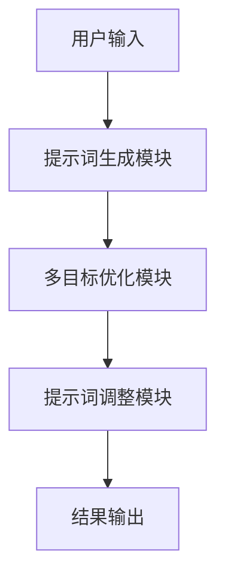
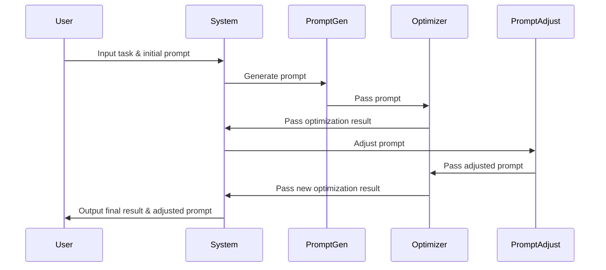

                 

### 问题背景与核心概念

**1.1.1 问题背景**

在当今信息化社会中，人工智能（AI）技术已经成为推动社会进步的重要力量。人工智能不仅改变了传统产业的运作方式，还在许多新兴领域展现出巨大的潜力。然而，随着AI技术的不断发展和应用场景的扩展，许多复杂的问题也随之而来，特别是多目标优化问题（Multi-Objective Optimization Problem，MOOP）。多目标优化问题在工程、金融、物流、能源等多个领域都有广泛的应用，其核心在于同时优化多个互斥的目标，从而找到一种平衡方案。

**1.1.2 提示词工程的概念**

提示词工程（Prompt Engineering）是一种利用人类语言与计算机系统交互的技术。其核心理念是通过提供关键提示或指令，使计算机系统能够更好地理解和执行复杂的任务。在AI领域，提示词工程的应用越来越广泛，特别是在自然语言处理（NLP）、对话系统、推荐系统等场景中。通过设计有效的提示词，可以大幅提升系统的性能和用户体验。

**定义**：提示词工程是一种利用人类语言与计算机系统交互的技术，旨在通过向系统提供关键提示或指令，以实现特定任务的目标。

**1.1.3 提示词工程在多目标优化问题中的应用**

在多目标优化问题中，提示词工程扮演着至关重要的角色。传统的多目标优化算法往往需要大量的计算资源和时间才能找到最优解。而通过设计精确的提示词，可以引导优化算法在目标空间中快速找到平衡点，从而提高优化效率。具体来说，提示词工程可以帮助优化算法：

- **明确目标**：通过提示词，将复杂的优化目标转化为具体的、可操作的指令，使得优化算法能够更清晰地理解任务目标。
- **动态调整**：在优化过程中，根据算法的反馈动态调整提示词，使其更符合当前优化状态，从而提高优化效果。
- **提高收敛速度**：有效的提示词可以帮助优化算法更快地收敛到最优解，减少不必要的计算。

**1.1.4 提示词工程的核心要素**

提示词工程的成功依赖于以下几个核心要素：

**1. 提示词设计原则**

在设计提示词时，需要遵循以下原则：

- **简洁性**：提示词应当简洁明了，避免冗余信息，以便系统快速理解。
- **明确性**：提示词需要精确地传达用户意图，避免歧义。
- **灵活性**：提示词应具有足够的灵活性，以适应不同场景和任务需求。

**2. 提示词优化方法**

提示词优化方法主要包括以下几种：

- **基于机器学习的提示词生成**：利用机器学习算法，自动生成提示词，能够快速适应新的优化任务。
- **提示词适应性调整**：根据优化过程中的反馈，动态调整提示词，提高优化效果。
- **提示词优化策略**：设计一系列优化策略，适用于多种优化算法，提高系统的整体性能。

**1.1.5 多目标优化问题的边界与外延**

**1. 边界**

多目标优化问题通常涉及到以下边界条件：

- **目标空间的维度**：多目标优化问题的目标函数通常包含多个维度，维度越高，优化难度越大。
- **约束条件的限制**：约束条件是对决策变量施加的限制，过多的约束条件可能会导致优化问题无解或找到的解不够理想。

**2. 外延**

多目标优化问题的应用范围非常广泛，不仅限于工程领域，还广泛应用于金融、物流、能源等多个行业。例如：

- **金融**：在金融领域，多目标优化可以用于资产分配、风险控制等问题。
- **物流**：在物流领域，多目标优化可以用于路径规划、车辆调度等问题。
- **能源**：在能源领域，多目标优化可以用于电力分配、能源效率优化等问题。

**1.2 核心概念原理与特征对比**

**1.2.1 提示词与多目标优化算法的关系**

提示词和多目标优化算法之间存在密切的联系。有效的提示词可以引导优化算法在目标空间中找到更好的平衡点，从而提高优化效果。具体来说：

- **提示词对优化算法的影响**：通过提供精确的提示词，可以引导优化算法在目标空间中快速找到最优解。
- **多目标优化算法对提示词的响应**：不同的优化算法对提示词的敏感度和适应性有所不同，需要根据具体算法特点设计提示词。

**1.2.2 提示词优化方法对比**

在提示词优化方法中，常见的方法包括基于机器学习的提示词生成、提示词适应性调整和提示词优化策略。以下是这些方法的优缺点对比：

- **基于机器学习的提示词生成**：

  - **优点**：自动化程度高，能够快速适应新的优化任务。

  - **缺点**：对数据依赖性强，可能存在过拟合风险。

- **提示词适应性调整**：

  - **优点**：可以根据优化过程中的反馈动态调整，提高优化效果。

  - **缺点**：计算成本较高，需要频繁交互。

- **提示词优化策略**：

  - **优点**：具有较强的一般性，适用于多种优化算法。

  - **缺点**：需要人工设计，对经验要求较高。

**1.2.3 多目标优化问题的数学模型与算法原理**

1. **数学模型**

多目标优化问题的数学模型通常包括以下组成部分：

- **目标函数**：定义了优化问题的目标，通常包含多个互斥的目标。

- **约束条件**：定义了决策变量（优化问题的变量）所需要满足的限制。

数学表示如下：

目标函数： \( f(x) \)

约束条件： \( g_i(x) \leq 0 \)，其中 \( i = 1, 2, ..., m \)

2. **算法原理**

多目标优化算法的原理主要涉及以下几个方面：

- **初始化种群/粒子**：生成初始的解（种群或粒子），作为优化的起点。

- **计算目标函数值和约束条件**：对每个解计算目标函数值和约束条件，评估解的优劣。

- **选择优秀个体/粒子**：根据适应度选择优秀的解，作为优化的参考。

- **生成新个体/粒子**：通过交叉、变异等操作生成新的解。

- **判断是否达到终止条件**：若达到终止条件，结束优化；否则，返回步骤3。

常见多目标优化算法包括遗传算法（GA）、粒子群优化（PSO）和差分进化算法（DE）。

### 1.2.4 提示词在算法中的应用

1. **提示词设计策略**

设计提示词时，需要遵循以下步骤：

- **确定优化目标**：明确需要优化的目标，并将其转化为具体的提示词。

- **生成初始提示词**：根据优化目标生成初始的提示词。

- **根据优化过程调整提示词**：在优化过程中，根据算法的反馈动态调整提示词。

- **检验提示词有效性**：评估提示词的有效性，确保其能够引导优化算法找到最优解。

2. **提示词效果评估**

提示词的效果可以通过以下指标进行评估：

- **目标函数值变化**：评估提示词是否能够降低目标函数值，提高优化效果。

- **约束条件满足情况**：评估提示词是否能够使约束条件得到满足。

- **优化算法收敛速度**：评估提示词是否能够提高优化算法的收敛速度。

### 1.3 系统架构设计

**1.3.1 系统功能设计**

一个典型的多目标优化系统通常包括以下几个功能模块：

- **提示词生成模块**：根据优化任务生成合适的提示词。

- **多目标优化模块**：执行多目标优化算法，寻找最优解。

- **提示词调整模块**：根据优化过程动态调整提示词。

**1.3.2 系统架构设计**

系统架构设计需要综合考虑功能模块之间的关系和交互。以下是系统架构的简要描述：

- **用户输入**：用户输入优化任务和初始提示词。

- **提示词生成模块**：根据用户输入，生成合适的提示词。

- **多目标优化模块**：执行多目标优化算法，使用提示词指导优化过程。

- **提示词调整模块**：根据优化过程的反馈，动态调整提示词。

- **结果输出**：输出优化结果和调整后的提示词。

以下是一个简单的系统架构图，使用Mermaid语法表示：

**1.3.3 系统接口设计**

系统接口设计需要定义输入和输出接口，以便与其他系统或组件进行交互。以下是系统接口的简要描述：

- **输入接口**：接收用户输入的优化任务和初始提示词。

- **输出接口**：返回优化结果和调整后的提示词。

**1.3.4 系统交互设计**

系统交互设计需要描述不同模块之间的交互过程。以下是系统交互的简要描述：

- **初始化阶段**：用户输入优化任务和初始提示词，系统初始化提示词生成模块、多目标优化模块和提示词调整模块。

- **优化阶段**：多目标优化模块使用提示词生成模块生成的提示词指导优化过程，并不断调整提示词。

- **输出阶段**：系统输出优化结果和调整后的提示词。

以下是一个简单的系统交互序列图，使用Mermaid语法表示：

### 结论

本文从多目标优化问题和提示词工程的背景入手，详细探讨了提示词工程在多目标优化问题中的应用及其核心概念。通过分析提示词设计原则、优化方法、数学模型和算法原理，我们揭示了提示词在优化过程中的关键作用。最后，我们提出了一个多目标优化系统的架构设计，展示了提示词工程在系统中的具体实现。本文的研究为多目标优化问题提供了一种新的解决思路，也为提示词工程的应用提供了理论和实践依据。

### 关键词

- 多目标优化问题（Multi-Objective Optimization Problem）
- 提示词工程（Prompt Engineering）
- 提示词设计原则
- 机器学习提示词生成
- 系统架构设计

### 摘要

本文探讨了多目标优化问题与提示词工程之间的联系，分析了提示词工程在多目标优化问题中的应用及其核心概念。通过对提示词设计原则、优化方法、数学模型和算法原理的详细讨论，本文揭示了提示词在优化过程中的关键作用。此外，本文提出了一个多目标优化系统的架构设计，展示了提示词工程在系统中的具体实现。本文的研究为多目标优化问题提供了一种新的解决思路，也为提示词工程的应用提供了理论和实践依据。

