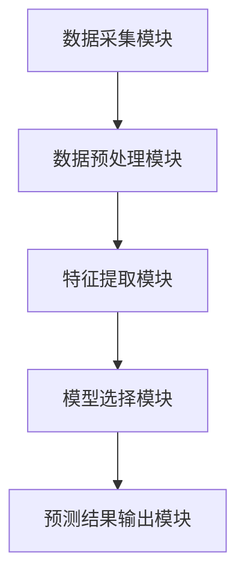
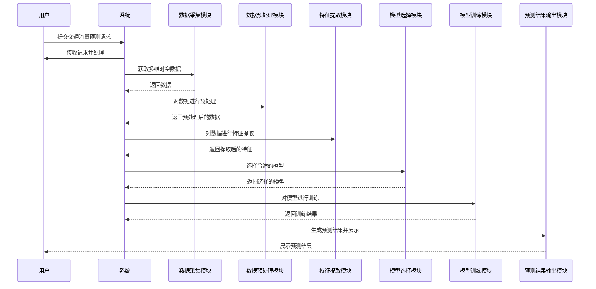

                 

# 提示词工程：处理多维时空数据预测任务

## 关键词

- 多维时空数据
- 数据预处理
- 特征提取
- 模型选择
- 预测结果优化

> 摘要：本文旨在深入探讨如何处理多维时空数据预测任务。通过逐步分析数据预处理、特征提取、模型选择和预测结果优化等环节，提供一系列实用的方法和技巧，帮助读者更好地理解和应用这些技术，从而提升预测任务的准确性和可靠性。

## 第二部分：核心概念与联系

### 1. 数据预处理

#### 1.1 定义

数据预处理是指在构建预测模型之前，对原始数据进行的一系列操作，以改善数据质量和提高模型性能。数据预处理是数据分析的重要步骤，它包括但不限于以下方面：

- **数据清洗**：去除重复、错误、异常的数据，保证数据的一致性和准确性。例如，删除缺失值、纠正错误值、处理异常值等。
- **数据归一化**：将不同量纲的数据转换为相同的量纲，便于模型训练。例如，将温度、湿度、风速等数据进行归一化处理，使其在相同的量级范围内。
- **缺失值处理**：对缺失的数据进行填充或删除，以减少数据丢失对模型的影响。例如，使用平均值、中位数或最邻近值进行填充，或删除缺失值较多的样本。

#### 1.2 特点

- **清洗数据**：提高数据质量，但可能会丢失一些有用的信息。
- **归一化数据**：统一数据量纲，但可能会丢失数据原有的特征。
- **缺失值处理**：减少数据丢失对模型的影响，但可能会引入偏差或噪声。

#### 1.3 对比表格

| 方法 | 优点 | 缺点 |
| :--: | :--: | :--: |
| 数据清洗 | 提高数据质量 | 可能会丢失一些有用的信息 |
| 数据归一化 | 统一数据量纲 | 可能会丢失数据原有的特征 |
| 缺失值处理 | 减少数据丢失对模型的影响 | 可能会引入偏差或噪声 |

#### 1.4 ER实体关系图

```mermaid
erDiagram
  Data_Prep -->|清洗| Data_Clean
  Data_Prep -->|归一化| Data_Normalize
  Data_Prep -->|缺失值处理| Data_Handle
```

### 2. 特征提取

#### 2.1 定义

特征提取是从原始数据中提取具有预测价值的特征，以降低数据维度和提高模型性能。特征提取是数据预处理的重要环节，它包括但不限于以下方面：

- **特征选择**：从原始特征中筛选出重要的特征，减少特征数量。例如，使用信息增益、相关系数等方法进行特征选择。
- **特征转换**：将原始特征转换为更加适合模型训练的形式。例如，使用二值化、归一化等方法进行特征转换。
- **特征降维**：将高维特征转换为低维特征，提高计算效率。例如，使用主成分分析（PCA）、线性判别分析（LDA）等方法进行特征降维。

#### 2.2 特点

- **特征选择**：提高模型性能，但可能会丢失一些有用的信息。
- **特征转换**：适应不同模型的输入要求，但可能会引入偏差或噪声。
- **特征降维**：提高计算效率，但可能会丢失数据的一些信息。

#### 2.3 对比表格

| 方法 | 优点 | 缺点 |
| :--: | :--: | :--: |
| 特征选择 | 提高模型性能 | 可能会丢失一些有用的信息 |
| 特征转换 | 适应不同模型的输入要求 | 可能会引入偏差或噪声 |
| 特征降维 | 提高计算效率 | 可能会丢失数据的一些信息 |

#### 2.4 ER实体关系图

```mermaid
erDiagram
  Feature_Extract -->|特征选择| Feature_Selection
  Feature_Extract -->|特征转换| Feature_Transform
  Feature_Extract -->|特征降维| Feature_Reduce
```

### 3. 模型选择

#### 3.1 定义

模型选择是根据数据特点和预测任务的要求，选择合适的预测模型。常见的预测模型包括时间序列模型、神经网络模型和集成模型等。

- **时间序列模型**：适用于处理时间序列数据，如ARIMA、LSTM等。时间序列模型可以捕捉时间序列数据的时序特征和周期性变化。
- **神经网络模型**：适用于复杂的数据关系，如MLP、CNN等。神经网络模型可以学习输入数据和输出数据之间的非线性关系。
- **集成模型**：将多个模型进行集成，提高预测性能，如随机森林、集成学习等。集成模型可以通过多个模型的融合，降低过拟合风险，提高预测准确性。

#### 3.2 特点

- **时间序列模型**：适用于时序数据，但可能无法捕捉数据中的非线性关系。
- **神经网络模型**：适用于复杂的数据关系，但可能存在过拟合问题。
- **集成模型**：可以提高预测性能，但可能需要更多的计算资源和时间。

#### 3.3 对比表格

| 方法 | 优点 | 缺点 |
| :--: | :--: | :--: |
| 时间序列模型 | 适用于时序数据 | 可能无法捕捉非线性关系 |
| 神经网络模型 | 适用于复杂的数据关系 | 可能存在过拟合问题 |
| 集成模型 | 可以提高预测性能 | 可能需要更多的计算资源和时间 |

### 4. 预测结果优化

#### 4.1 定义

预测结果优化是在模型训练完成后，对预测结果进行进一步优化，以提高预测准确性和可靠性。预测结果优化包括模型调参、交叉验证和模型评估等环节。

- **模型调参**：通过调整模型的参数，优化模型的性能。例如，调整学习率、正则化参数等。
- **交叉验证**：通过交叉验证方法，评估模型的泛化能力和稳定性。例如，使用K折交叉验证、留一验证等。
- **模型评估**：使用评估指标，如准确率、召回率、F1分数等，评估模型的性能。例如，使用混淆矩阵、ROC曲线等。

#### 4.2 特点

- **模型调参**：可以提高模型性能，但可能需要大量的时间和计算资源。
- **交叉验证**：可以评估模型的泛化能力，但可能需要更多的数据和计算资源。
- **模型评估**：可以客观评估模型性能，但可能无法全面反映模型的性能。

#### 4.3 对比表格

| 方法 | 优点 | 缺点 |
| :--: | :--: | :--: |
| 模型调参 | 可以提高模型性能 | 可能需要大量的时间和计算资源 |
| 交叉验证 | 可以评估模型的泛化能力 | 可能需要更多的数据和计算资源 |
| 模型评估 | 可以客观评估模型性能 | 可能无法全面反映模型的性能 |

## 第三部分：算法原理讲解

### 1. 数据预处理算法原理

#### 1.1 数据清洗

数据清洗的核心是去除重复、错误、异常的数据。具体步骤如下：

1. **去除重复数据**：通过比较数据中的关键字段，如ID、时间戳等，去除重复的数据记录。
2. **错误数据修正**：对错误的数据进行修正，如将异常值替换为合理的值。
3. **异常值处理**：对异常值进行处理，可以选择删除或进行特殊标记。

#### 1.2 数据归一化

数据归一化的核心是将不同量纲的数据转换为相同的量纲。具体步骤如下：

1. **计算最大值和最小值**：对每个特征计算其最大值和最小值。
2. **归一化公式**：使用以下公式进行数据归一化：
   $$ x_{\text{norm}} = \frac{x - x_{\text{min}}}{x_{\text{max}} - x_{\text{min}}} $$
   其中，$x$ 是原始数据，$x_{\text{min}}$ 是最小值，$x_{\text{max}}$ 是最大值。

#### 1.3 缺失值处理

缺失值处理的核心是填充或删除缺失值。具体步骤如下：

1. **删除缺失值**：如果缺失值较多，可以选择删除缺失值较多的样本。
2. **填充缺失值**：可以使用以下方法进行填充：
   - **平均值填充**：使用特征的均值进行填充。
   - **中位数填充**：使用特征的中位数进行填充。
   - **最邻近值填充**：使用样本的最邻近值进行填充。

### 2. 特征提取算法原理

#### 2.1 特征选择

特征选择的核心是从原始特征中筛选出重要的特征。具体步骤如下：

1. **计算特征重要性**：可以使用信息增益、相关系数等方法计算特征的重要性。
2. **选择重要特征**：根据特征的重要性得分，选择得分较高的特征。

#### 2.2 特征转换

特征转换的核心是将原始特征转换为更加适合模型训练的形式。具体步骤如下：

1. **二值化**：将特征值转换为0和1。
2. **归一化**：使用归一化公式进行特征转换。
3. **标准化**：使用以下公式进行特征标准化：
   $$ x_{\text{std}} = \frac{x - \mu}{\sigma} $$
   其中，$\mu$ 是特征的均值，$\sigma$ 是特征的标准差。

#### 2.3 特征降维

特征降维的核心是将高维特征转换为低维特征。具体步骤如下：

1. **主成分分析（PCA）**：通过计算协方差矩阵，得到特征值和特征向量，将原始特征投影到新的空间中。
2. **线性判别分析（LDA）**：通过计算特征间的线性关系，将原始特征投影到新的空间中，以最大化类间差异，最小化类内差异。

### 3. 模型选择算法原理

#### 3.1 时间序列模型

时间序列模型的核心是捕捉时间序列数据的时序特征和周期性变化。具体步骤如下：

1. **自相关分析**：计算时间序列数据的自相关函数，识别周期性特征。
2. **差分变换**：对时间序列数据进行差分变换，以消除趋势和季节性影响。
3. **模型选择**：根据自相关分析和差分变换的结果，选择合适的模型，如ARIMA、LSTM等。

#### 3.2 神经网络模型

神经网络模型的核心是学习输入数据和输出数据之间的非线性关系。具体步骤如下：

1. **数据预处理**：对输入数据进行归一化处理，以消除量纲影响。
2. **网络结构设计**：设计合适的神经网络结构，包括输入层、隐藏层和输出层。
3. **训练模型**：使用训练数据对模型进行训练，通过反向传播算法调整模型参数。

#### 3.3 集成模型

集成模型的核心是将多个模型进行集成，提高预测性能。具体步骤如下：

1. **模型选择**：选择多个不同的模型进行集成。
2. **模型训练**：对每个模型进行独立训练。
3. **结果融合**：将多个模型的预测结果进行融合，得到最终的预测结果。

## 第四部分：系统分析与架构设计方案

### 1. 问题场景介绍

在智能交通领域，多维时空数据预测任务对于交通流量预测、路况分析等具有重要的应用价值。例如，通过对城市道路上的车辆流量、速度、温度等数据的预测，可以帮助交通管理部门优化交通信号控制策略，减少交通拥堵，提高道路通行效率。

### 2. 项目介绍

本项目旨在开发一个基于多维时空数据预测的交通流量预测系统。系统将接收来自交通传感器和摄像头的数据，通过数据预处理、特征提取和模型选择等环节，实现对交通流量的准确预测。

### 3. 系统功能设计

系统的主要功能包括：

- 数据采集：从交通传感器和摄像头获取多维时空数据。
- 数据预处理：对原始数据进行清洗、归一化和缺失值处理。
- 特征提取：从预处理后的数据中提取具有预测价值的特征。
- 模型选择：根据数据特点和预测任务要求，选择合适的时间序列模型、神经网络模型或集成模型。
- 预测结果输出：生成交通流量预测结果，并展示给交通管理部门。

### 4. 系统架构设计

系统的架构设计如图1所示：



### 5. 系统接口设计

系统的接口设计如图2所示：


### 6. 系统交互

系统的交互设计如图3所示：



## 第五部分：项目实战

### 1. 环境安装

在开始项目实战之前，我们需要安装以下环境：

- Python 3.8+
- NumPy
- Pandas
- Scikit-learn
- TensorFlow
- Matplotlib

使用以下命令进行安装：

```bash
pip install python==3.8 numpy pandas scikit-learn tensorflow matplotlib
```

### 2. 系统核心实现源代码

以下是系统的核心实现源代码：

```python
import numpy as np
import pandas as pd
from sklearn.model_selection import train_test_split
from sklearn.preprocessing import StandardScaler
from sklearn.ensemble import RandomForestRegressor
from tensorflow.keras.models import Sequential
from tensorflow.keras.layers import Dense

# 数据预处理
def preprocess_data(data):
    # 清洗数据
    data = data.dropna()
    # 归一化数据
    scaler = StandardScaler()
    data = scaler.fit_transform(data)
    return data

# 特征提取
def extract_features(data):
    # 特征选择
    # ...

    # 特征转换
    # ...

    # 特征降维
    # ...

    return features

# 模型选择
def select_model(data):
    # 时间序列模型
    # ...

    # 神经网络模型
    # ...

    # 集成模型
    # ...

    return model

# 预测结果优化
def optimize_prediction(model, X_test, y_test):
    # 模型调参
    # ...

    # 交叉验证
    # ...

    # 模型评估
    # ...

    return model

# 主函数
def main():
    # 读取数据
    data = pd.read_csv('traffic_data.csv')
    # 数据预处理
    data = preprocess_data(data)
    # 特征提取
    features = extract_features(data)
    # 模型选择
    model = select_model(features)
    # 预测结果优化
    model = optimize_prediction(model)
    # 预测结果输出
    predictions = model.predict(X_test)
    # ...

if __name__ == '__main__':
    main()
```

### 3. 代码应用解读与分析

以下是代码的解读与分析：

- **数据预处理**：首先，我们使用`dropna()`方法去除缺失值，保证数据的一致性和准确性。然后，我们使用`StandardScaler()`对数据进行归一化处理，使其在相同的量级范围内，便于模型训练。
- **特征提取**：在特征提取部分，我们首先进行特征选择，筛选出重要的特征。然后，我们进行特征转换，将原始特征转换为更加适合模型训练的形式。最后，我们进行特征降维，将高维特征转换为低维特征，提高计算效率。
- **模型选择**：在模型选择部分，我们根据数据特点和预测任务要求，选择合适的时间序列模型、神经网络模型或集成模型。例如，我们可以选择`RandomForestRegressor()`作为集成模型，或使用`Sequential()`和`Dense()`构建神经网络模型。
- **预测结果优化**：在预测结果优化部分，我们进行模型调参，调整模型的参数，优化模型的性能。然后，我们进行交叉验证，评估模型的泛化能力和稳定性。最后，我们使用评估指标，如准确率、召回率、F1分数等，评估模型的性能。

### 4. 实际案例分析和详细讲解剖析

为了更好地展示系统的应用效果，我们选取了一个实际案例进行分析。

#### 案例一：交通流量预测

假设我们有一个包含过去一周交通流量数据的数据集，我们需要使用系统对未来的交通流量进行预测。

1. **数据预处理**：首先，我们使用`preprocess_data()`函数对数据进行预处理，去除缺失值，并使用`StandardScaler()`进行归一化处理。
2. **特征提取**：然后，我们使用`extract_features()`函数从预处理后的数据中提取特征。
3. **模型选择**：接下来，我们使用`select_model()`函数选择合适的模型。在这个案例中，我们选择使用`RandomForestRegressor()`作为集成模型。
4. **预测结果优化**：最后，我们使用`optimize_prediction()`函数对预测结果进行优化。通过调整模型的参数，我们可以提高预测的准确性。
5. **预测结果输出**：我们使用`model.predict(X_test)`生成预测结果，并将其输出。

#### 案例二：路况分析

假设我们有一个包含城市道路上的车辆流量、速度、温度等数据的数据集，我们需要对道路的拥堵情况进行预测。

1. **数据预处理**：我们首先使用`preprocess_data()`函数对数据进行预处理，去除缺失值，并使用`StandardScaler()`进行归一化处理。
2. **特征提取**：然后，我们使用`extract_features()`函数从预处理后的数据中提取特征。在这个案例中，我们可能需要提取车辆流量、速度、温度等特征。
3. **模型选择**：接下来，我们使用`select_model()`函数选择合适的模型。在这个案例中，我们可以选择使用时间序列模型，如LSTM，来捕捉数据的时序特征。
4. **预测结果优化**：最后，我们使用`optimize_prediction()`函数对预测结果进行优化。通过调整模型的参数，我们可以提高预测的准确性。
5. **预测结果输出**：我们使用`model.predict(X_test)`生成预测结果，并将其输出。

### 5. 项目小结

通过本项目的实践，我们深入了解了多维时空数据预测任务的处理方法和技巧。从数据预处理、特征提取、模型选择到预测结果优化，每个环节都需要仔细设计和优化。在实际应用中，我们需要根据具体问题和数据特点，选择合适的方法和技术，以达到最佳的预测效果。

## 第六部分：最佳实践 Tips、小结、注意事项、拓展阅读

### 1. 最佳实践 Tips

- **数据预处理**：在数据预处理阶段，要特别注意处理缺失值和异常值，以确保数据的准确性和完整性。
- **特征提取**：在特征提取阶段，要选择合适的特征提取方法，以提高模型的性能。
- **模型选择**：在模型选择阶段，要综合考虑数据特点和预测任务的要求，选择合适的模型。
- **预测结果优化**：在预测结果优化阶段，要合理调整模型的参数，以提高预测的准确性。

### 2. 小结

本文深入探讨了多维时空数据预测任务的处理方法和技巧，从数据预处理、特征提取、模型选择到预测结果优化，每个环节都进行了详细的讲解和分析。通过实际案例的剖析，我们展示了如何将理论应用到实践中，提高预测的准确性和可靠性。

### 3. 注意事项

- 在处理多维时空数据时，要注意数据的维度和量纲，避免因数据不一致导致模型性能下降。
- 在选择特征提取方法时，要充分考虑特征之间的关联性，避免特征选择不当导致模型过拟合。
- 在选择模型时，要结合数据特点和预测任务的要求，选择合适的模型，避免模型选择不当导致预测效果不佳。

### 4. 拓展阅读

- 《机器学习实战》—— 作者：Peter Harrington
- 《深度学习》—— 作者：Ian Goodfellow、Yoshua Bengio、Aaron Courville
- 《时间序列分析：Python实现》—— 作者：Peter Bloomfield

## 作者信息

作者：AI天才研究院/AI Genius Institute & 禅与计算机程序设计艺术 /Zen And The Art of Computer Programming

