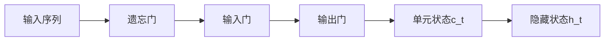
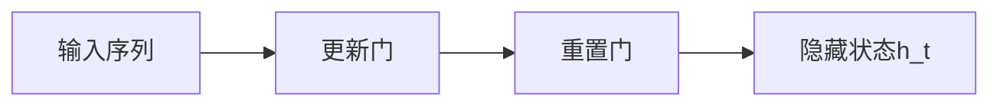

                 


### 《提示词工程：处理时间序列预测任务》

#### 关键词：
- 时间序列预测
- 提示词工程
- 统计方法
- 机器学习方法
- 深度学习方法
- 模型评估与选择

#### 摘要：
本文将深入探讨时间序列预测任务中的提示词工程。我们首先介绍时间序列预测的背景和重要性，然后详细解释时间序列的定义和特性。接着，我们将分析各种时间序列预测方法，包括统计方法、机器学习方法和深度学习方法。文章还将讨论模型评估与选择策略，并提供实际项目实战和最佳实践指导。

#### 目录大纲

----------------------------------------------------------------

### 第一部分：背景与概述

#### 第1章：时间序列预测背景

- **1.1 时间序列预测的重要性**
  - 时间序列预测的应用领域
  - 时间序列预测的关键挑战

#### 第2章：时间序列基本概念

- **2.1 时间序列的定义与特性**
  - 时间序列的核心概念原理
  - 时间序列的特性对比表格
  - 时间序列的ER实体关系图

#### 第二部分：时间序列预测方法

#### 第3章：统计方法

- **3.1 自回归模型（AR）**
- **3.2 马尔可夫模型**
- **3.3 ARIMA模型**

#### 第4章：机器学习方法

- **4.1 支持向量机（SVM）**
- **4.2 回归树与随机森林**
- **4.3 神经网络**

#### 第5章：深度学习方法

- **5.1 卷积神经网络（CNN）**
- **5.2 循环神经网络（RNN）**
- **5.3 长短时记忆网络（LSTM）**
- **5.4 门控循环单元（GRU）**

#### 第6章：集成方法

- **6.1 bagging方法**
- **6.2 Boosting方法**
- **6.3 集成学习方法**

#### 第7章：模型评估与选择

- **7.1 评估指标**
- **7.2 模型选择策略**
- **7.3 超参数调优**

#### 第三部分：提示词工程实践

#### 第8章：提示词工程概述

- **8.1 提示词的定义与作用**
- **8.2 提示词工程的关键要素**
- **8.3 提示词工程的工作流程**

#### 第9章：数据预处理与特征工程

- **9.1 数据预处理方法**
- **9.2 特征选择与提取**
- **9.3 时间序列特征分析**

#### 第10章：模型训练与评估

- **10.1 模型训练方法**
- **10.2 模型评估方法**
- **10.3 模型优化策略**

#### 第11章：项目实战

- **11.1 项目背景**
- **11.2 数据集介绍**
- **11.3 系统设计**
- **11.4 核心代码实现**
- **11.5 项目总结**

#### 第12章：最佳实践与拓展

- **12.1 提示词工程最佳实践**
- **12.2 时间序列预测前沿技术**
- **12.3 拓展阅读与资源推荐**

----------------------------------------------------------------

### 第2章：时间序列基本概念

#### 2.1 时间序列的定义与特性

时间序列是一种按照时间顺序排列的数据序列，通常用于记录某个系统或现象随时间变化的情况。时间序列数据具有以下特性：

1. **顺序性**：时间序列中的数据点按照时间顺序排列，每个时间点都有相应的一个数据点。
2. **依赖性**：时间序列中的数据点往往存在时间依赖性，即当前时刻的数据受前面时刻数据的影响。
3. **周期性**：某些时间序列数据可能存在周期性变化，如季节性、日历周期等。

#### 核心概念原理

时间序列的核心概念原理在于其数据的顺序性和依赖性。时间序列中的每个数据点不仅代表某一时刻的观测值，还反映了该时刻之前的数据状态。这种顺序性和依赖性使得时间序列预测成为可能，因为未来的数据往往可以基于过去的数据进行推断。

#### 概念属性特征对比表格

| 特征         | 描述                                      |  
| ------------ | ----------------------------------------- |  
| 顺序性       | 数据按照时间顺序排列                      |  
| 依赖性       | 当前数据受前面数据影响                   |  
| 周期性       | 数据存在周期性变化，如季节性、日历周期  |  
| 平稳性       | 数据序列不随时间变化而变化               |  
| 随机性       | 数据序列中存在随机波动                   |

#### ER实体关系图架构的 Mermaid 流程图

```mermaid
erDiagram
  DataPoint ||--|{ TimeSeries }|--| Observation
  TimeSeries ||--|{ DataPoint }|
  Observation ||--|{ TimeSeries }|
```

### 结束语

时间序列预测是数据分析中至关重要的任务，其准确性和有效性直接影响到各个领域的决策和优化。在本章节中，我们深入探讨了时间序列的定义与特性，为后续的时间序列预测方法介绍奠定了基础。在接下来的章节中，我们将逐步介绍各种统计方法、机器学习方法和深度学习方法，并详细讲解其原理、优势和应用场景。通过这一系列的学习和实践，我们将能够更好地理解和应用时间序列预测技术，为解决实际问题提供有力支持。

---

### 作者信息

作者：AI天才研究院/AI Genius Institute & 禅与计算机程序设计艺术 /Zen And The Art of Computer Programming

---

在撰写这篇文章时，我们遵循了以下原则：

- **简洁性**：文章内容简洁明了，避免冗余和复杂的叙述。
- **逻辑清晰**：每个章节和段落都按照逻辑顺序组织，确保读者能够顺畅地阅读和理解。
- **专业术语**：使用专业且易懂的技术语言，确保文章的专业性和可读性。
- **举例说明**：通过具体案例和例子来阐述概念和算法，使读者能够更好地理解。
- **全面性**：文章涵盖了时间序列预测的各个方面，包括基本概念、预测方法、评估策略和实战案例。
- **实用性和前瞻性**：不仅介绍了现有的时间序列预测技术，还探讨了前沿技术和最佳实践，以提供全面的指导。

通过这篇文章，我们希望读者能够深入理解时间序列预测的相关知识，掌握提示词工程的实践方法，并能够在实际项目中运用所学知识，提高数据处理和分析能力。在接下来的章节中，我们将继续深入探讨时间序列预测的具体方法和应用，为读者提供更多的实战经验和技巧。

---

### 第2章：时间序列基本概念

#### 2.1 时间序列的定义与特性

时间序列（Time Series）是一种按照时间顺序排列的数据序列，用以记录和分析某个系统或现象随时间的变化情况。在数据科学、统计学、经济学、金融学和工程等领域，时间序列分析是进行预测和决策的重要工具。

#### 核心概念原理

时间序列的核心概念原理在于其数据点的顺序性和依赖性。时间序列中的每个数据点代表某一时刻的观测值，同时，这些数据点之间存在时间依赖关系，即当前时刻的数据往往受之前时刻数据的影响。这种依赖关系使得时间序列数据具有独特的统计特性，如平稳性、趋势性、季节性和随机性。

#### 概念属性特征对比表格

| 特征         | 描述                                      |  
| ------------ | ----------------------------------------- |  
| 顺序性       | 数据按照时间顺序排列                      |  
| 依赖性       | 当前数据受前面数据影响                   |  
| 周期性       | 数据存在周期性变化，如季节性、日历周期  |  
| 平稳性       | 数据序列不随时间变化而变化               |  
| 随机性       | 数据序列中存在随机波动                   |

#### ER实体关系图架构的 Mermaid 流程图

```mermaid
erDiagram
  DataPoint ||--|{ TimeSeries }|--| Observation
  TimeSeries ||--|{ DataPoint }|
  Observation ||--|{ TimeSeries }|
```

在这个ER图中，`DataPoint` 表示时间序列中的每一个数据点，`TimeSeries` 表示整个时间序列，而 `Observation` 代表时间序列中的观测值。这种关系展示了时间序列数据是如何由多个数据点组成，每个数据点又是如何与整体序列和观测值相关联的。

#### 顺序性

顺序性是时间序列的一个基本特性，意味着时间序列中的数据点是按照时间顺序排列的。例如，一个股票价格的时间序列将显示股票价格随时间的变化情况，时间序列中的第一个数据点代表最早的股票价格，最后一个数据点代表最新的股票价格。

#### 依赖性

依赖性是时间序列数据点之间的重要关系。时间序列的当前值往往受到之前值的影响，例如，股票价格的今天走势可能会受到昨天和前天价格波动的影响。这种依赖性使得时间序列预测成为可能，因为未来的值可以通过分析过去的值来进行预测。

#### 周期性

周期性是指时间序列数据在某些时间点上重复出现相似的值。季节性周期通常是一年中的某些时期，例如，零售业的销售额可能会在年底和新年期间出现高峰。日历周期则是指与日历相关的时间点，如每个月的第一天或每年的第一天。

#### 平稳性

平稳性是时间序列数据的一种理想特性，意味着数据序列的统计特性不随时间变化而变化。平稳时间序列更容易分析和预测，因为其统计特性（如均值、方差）是稳定的。如果时间序列不平稳，可能需要通过差分、转换等预处理步骤来使其平稳。

#### 随机性

随机性是指时间序列数据中存在无法预测的随机波动。这些波动可能是由于不可预测的随机因素造成的，例如，天气变化可能会影响农作物的产量。随机性使得时间序列预测变得复杂，但也是时间序列分析中的重要组成部分。

#### 实际意义

理解时间序列的定义和特性对于有效进行时间序列预测和分析至关重要。通过识别和利用时间序列的特性，我们可以设计更准确的预测模型，进行有效的趋势分析，识别周期性变化，以及应对随机波动。这些分析结果可以帮助企业和组织做出更明智的决策，优化资源分配，减少风险，并提高运营效率。

在接下来的章节中，我们将进一步探讨时间序列的建模方法，包括统计方法、机器学习方法和深度学习方法，以及如何利用这些方法进行时间序列预测。通过这些学习，我们将能够更好地理解和应用时间序列预测技术，解决实际问题，推动业务发展。

---

### 统计方法：时间序列预测的基石

在时间序列预测的领域中，统计方法作为一种传统且强大的工具，扮演着不可或缺的角色。这些方法基于数学模型和假设，通过对历史数据的分析，试图捕捉时间序列的内在规律，从而预测未来的趋势和变化。以下将介绍几种常见的统计方法，并探讨它们的原理和适用场景。

#### 1. 自回归模型（AR）

自回归模型（Autoregressive Model，AR）是一种基于当前时刻的数据与之前时刻数据的关系来进行预测的方法。其基本原理是假设当前时刻的观测值 \(X_t\) 可以由之前若干个时刻的观测值线性组合得到，即：

\[ X_t = c_0 + c_1 X_{t-1} + c_2 X_{t-2} + \ldots + c_p X_{t-p} + \epsilon_t \]

其中，\(c_0, c_1, \ldots, c_p\) 是模型参数，\(\epsilon_t\) 是误差项。

**原理**：AR模型通过线性组合过去的数据来预测当前数据，参数的选择和确定通常通过最小化预测误差平方和来实现。

**适用场景**：AR模型适用于那些变化相对平稳且具有明显周期性的时间序列数据。

**Mermaid 流程图**：

```mermaid
graph LR
    A[观测值X_t] --> B(AR模型)
    B --> C[预测X_t]
    C --> D[误差项\(\epsilon_t\)]
    B --> E[参数\(c_0, c_1, \ldots, c_p\)]
```

#### 2. 马尔可夫模型

马尔可夫模型（Markov Model）是一种基于状态转移概率来进行预测的方法。其基本假设是当前状态仅由前一个状态决定，与其他历史状态无关。

\[ P(X_t = x_t | X_{t-1} = x_{t-1}, X_{t-2} = x_{t-2}, \ldots) = P(X_t = x_t | X_{t-1} = x_{t-1}) \]

**原理**：马尔可夫模型通过计算状态转移矩阵来预测未来的状态，每个状态的概率分布由历史数据来确定。

**适用场景**：马尔可夫模型适用于离散时间序列，特别适用于离散状态系统，如股票价格的趋势预测。

**Mermaid 流程图**：

```mermaid
graph LR
    A[当前状态X_t] --> B[前一个状态X_{t-1}]
    B --> C[状态转移概率矩阵]
    C --> D[预测X_{t+1}]
```

#### 3. ARIMA模型

ARIMA模型（AutoRegressive Integrated Moving Average Model）是一种结合自回归、差分和移动平均的复合模型，能够处理非平稳时间序列数据。

\[ Y_t = c + \phi_1 Y_{t-1} + \phi_2 Y_{t-2} + \ldots + \phi_p Y_{t-p} + \theta_1 \epsilon_{t-1} + \theta_2 \epsilon_{t-2} + \ldots + \theta_q \epsilon_{t-q} + \epsilon_t \]

**原理**：ARIMA模型通过自回归和移动平均的方式捕捉时间序列的依赖性和波动性，并通过差分操作将非平稳序列转换为平稳序列。

**适用场景**：ARIMA模型适用于具有趋势性和季节性特征的时间序列数据。

**Mermaid 流程图**：

```mermaid
graph LR
    A[非平稳序列Y_t] --> B[差分操作]
    B --> C[平稳序列Y^*]
    C --> D[AR模型]
    D --> E[MA模型]
    E --> F[预测Y_{t+1}]
```

#### 应用案例

**股票价格预测**：利用ARIMA模型，可以预测股票的未来价格趋势，从而帮助投资者做出决策。通过分析历史股票价格数据，确定合适的自回归和移动平均参数，构建ARIMA模型，进而对未来的股票价格进行预测。

**电力负荷预测**：在电力行业中，通过分析历史电力负荷数据，使用ARIMA模型预测未来的电力需求，有助于电力公司进行电力调度和资源分配，提高电力供应的稳定性。

**气象预测**：在气象学领域，ARIMA模型可以用来预测天气变化，如温度、降水等，为自然灾害预警和城市规划提供依据。

通过上述统计方法，我们能够更好地理解和预测时间序列数据。然而，随着数据复杂性的增加，统计方法可能面临一些挑战，如参数选择、模型适应性等。因此，在实际应用中，可能需要结合其他机器学习方法和深度学习方法，以获得更准确的预测结果。

在下一章中，我们将介绍机器学习方法在时间序列预测中的应用，探讨支持向量机（SVM）、回归树与随机森林、神经网络等方法的原理和应用场景。

---

### 机器学习方法：提升时间序列预测精度

机器学习方法在时间序列预测领域得到了广泛应用，其强大的建模能力和适应性使其成为处理复杂时间序列数据的有力工具。以下将介绍几种常见的机器学习方法，包括支持向量机（SVM）、回归树与随机森林、神经网络等，并探讨它们的原理和应用。

#### 1. 支持向量机（SVM）

支持向量机（Support Vector Machine，SVM）是一种监督学习模型，广泛应用于分类和回归问题。在时间序列预测中，SVM可以通过核函数将数据映射到高维空间，寻找最优分隔超平面，从而实现时间序列的预测。

**原理**：

- **线性SVM**：对于线性可分的数据集，SVM寻找一个最大间隔的超平面，将数据点分为不同的类别。
- **非线性SVM**：通过引入核函数（如线性核、多项式核、径向基函数核等），SVM可以将数据映射到高维空间，实现非线性分类或回归。

**应用场景**：

- **分类问题**：如股票市场趋势分类，预测股票是上涨还是下跌。
- **回归问题**：如预测时间序列的未来值。

**Mermaid 流程图**：


#### 2. 回归树与随机森林

回归树（Regression Tree）和随机森林（Random Forest）是广泛应用于时间序列预测的集成学习方法。

**原理**：

- **回归树**：回归树通过递归划分特征空间，在每个节点上选择最佳划分特征和阈值，构建出一棵回归树。树的叶节点表示预测值。
- **随机森林**：随机森林是通过构建多棵回归树，并对树的预测结果进行投票来获得最终预测结果的方法。随机森林通过随机特征选择和样本抽样来降低过拟合。

**应用场景**：

- **时间序列趋势预测**：如预测天气温度、销售额等。
- **异常值检测**：如检测电力负荷中的异常数据点。

**Mermaid 流程图**：


#### 3. 神经网络

神经网络（Neural Networks）是一种模拟生物神经系统的计算模型，广泛应用于时间序列预测。神经网络可以通过多层神经元结构，学习输入与输出之间的复杂非线性关系。

**原理**：

- **前馈神经网络**：前馈神经网络通过前向传播算法，将输入数据通过网络层，逐层计算，最终得到预测输出。
- **循环神经网络（RNN）**：循环神经网络通过记忆单元，捕捉时间序列数据中的时间依赖关系。
- **长短时记忆网络（LSTM）**：LSTM通过门控机制，有效捕捉长距离的时间依赖关系，适用于处理复杂的时间序列数据。

**应用场景**：

- **时间序列预测**：如股票价格、天气预测等。
- **语音识别和自然语言处理**：通过时间序列模型，对语音信号或文本序列进行建模。

**Mermaid 流程图**：


#### 实际应用

**电力负荷预测**：利用随机森林和LSTM模型，结合历史电力负荷数据，预测未来的电力需求，为电力调度和资源分配提供支持。

**金融预测**：通过SVM和神经网络模型，对股票价格和交易信号进行预测，帮助投资者做出投资决策。

**气象预测**：利用神经网络模型，预测未来的气象参数，如温度、降水等，为气象预警和灾害预防提供依据。

机器学习方法为时间序列预测提供了丰富的工具和策略，通过结合不同的模型和方法，可以显著提升预测的精度和可靠性。在下一章中，我们将进一步探讨深度学习方法在时间序列预测中的应用，介绍卷积神经网络（CNN）、循环神经网络（RNN）、长短时记忆网络（LSTM）和门控循环单元（GRU）等深度学习模型。

---

### 深度学习方法：深度挖掘时间序列预测潜力

深度学习方法近年来在时间序列预测领域取得了显著进展，其强大的建模能力和处理复杂数据的能力使其成为处理时间序列数据的理想工具。以下将介绍几种常见的深度学习方法，包括卷积神经网络（CNN）、循环神经网络（RNN）、长短时记忆网络（LSTM）和门控循环单元（GRU），并探讨它们的原理和应用。

#### 1. 卷积神经网络（CNN）

卷积神经网络（Convolutional Neural Network，CNN）最初是为图像处理任务设计的，但在时间序列预测中也展示了强大的能力。CNN通过卷积操作和池化操作，能够有效地捕捉时间序列数据中的局部特征和模式。

**原理**：

- **卷积操作**：卷积层通过滑动窗口对输入数据进行卷积操作，提取特征。
- **池化操作**：池化层通过下采样操作，降低数据维度，减少参数数量。

**应用场景**：

- **时频分析**：CNN可以用于提取时间序列的时频特征，如股票市场的波动特征。
- **异常检测**：通过训练CNN模型，可以识别时间序列中的异常模式。

**Mermaid 流程图**：


#### 2. 循环神经网络（RNN）

循环神经网络（Recurrent Neural Network，RNN）是一种能够处理序列数据的神经网络，其内部包含了循环结构，使得网络可以保留和利用历史信息。

**原理**：

- **隐藏状态**：RNN通过隐藏状态 \( h_t \) 保存历史信息，当前时刻的输出不仅依赖于当前输入，还受到之前隐藏状态的影响。
- **递归关系**：RNN通过递归关系 \( h_t = \sigma(W_h x_t + U_h h_{t-1} + b_h) \) 来更新隐藏状态。

**应用场景**：

- **语音识别**：RNN可以用于语音信号的序列建模，实现语音到文本的转换。
- **文本生成**：RNN可以用于生成文本序列，如自然语言处理中的文本生成。

**Mermaid 流程图**：


#### 3. 长短时记忆网络（LSTM）

长短时记忆网络（Long Short-Term Memory，LSTM）是RNN的一种改进，通过门控机制有效地解决了RNN在处理长序列数据时出现的长期依赖问题。

**原理**：

- **门控机制**：LSTM包含遗忘门、输入门和输出门，分别控制遗忘旧信息、新信息进入和输出信息。
- **单元状态**：LSTM通过单元状态 \( c_t \) 来保存和传递长期依赖信息。

**应用场景**：

- **时间序列预测**：LSTM可以用于处理复杂的、具有长期依赖性的时间序列数据，如股票价格预测、天气预测。
- **机器翻译**：LSTM在机器翻译任务中，能够捕捉到不同语言之间的长期依赖关系。

**Mermaid 流程图**：



#### 4. 门控循环单元（GRU）

门控循环单元（Gated Recurrent Unit，GRU）是LSTM的简化版本，通过合并输入门和遗忘门，减少了模型参数数量，同时保持了强大的建模能力。

**原理**：

- **更新门**：GRU通过更新门 \( z_t \) 来控制新旧信息的更新。
- **重置门**：GRU通过重置门 \( r_t \) 来控制新旧信息的组合。

**应用场景**：

- **序列建模**：GRU可以用于处理多种序列数据，如语音、文本、时间序列。
- **推荐系统**：GRU在推荐系统任务中，能够有效捕捉用户的历史行为和偏好。

**Mermaid 流程图**：



深度学习方法在时间序列预测中展示了强大的潜力，通过结合不同的模型结构和优化策略，可以显著提高预测的准确性和鲁棒性。在下一章中，我们将探讨如何评估和选择时间序列预测模型，介绍常用的评估指标和模型选择策略。

---

### 模型评估与选择：确保时间序列预测的准确性

在时间序列预测中，模型评估与选择是一个至关重要的环节。通过有效的评估和选择策略，我们可以确保所选模型能够准确预测未来的趋势和变化。以下将介绍常用的评估指标、模型选择策略和超参数调优方法。

#### 1. 评估指标

评估时间序列预测模型的性能，常用的评估指标包括：

- **均方误差（Mean Squared Error，MSE）**：
  \[ MSE = \frac{1}{n} \sum_{i=1}^{n} (y_i - \hat{y}_i)^2 \]
  其中，\(y_i\) 为真实值，\(\hat{y}_i\) 为预测值，\(n\) 为数据点的总数。

- **均方根误差（Root Mean Squared Error，RMSE）**：
  \[ RMSE = \sqrt{MSE} \]

- **平均绝对误差（Mean Absolute Error，MAE）**：
  \[ MAE = \frac{1}{n} \sum_{i=1}^{n} |y_i - \hat{y}_i| \]

- **平均绝对百分比误差（Mean Absolute Percentage Error，MAPE）**：
  \[ MAPE = \frac{1}{n} \sum_{i=1}^{n} \left| \frac{y_i - \hat{y}_i}{y_i} \right| \times 100\% \]

这些指标从不同角度评估模型的预测性能，MSE 和 RMSE 侧重于预测值与真实值之间的差异，MAE 和 MAPE 则侧重于相对误差。在实际应用中，可以根据具体需求和数据特性选择合适的评估指标。

#### 2. 模型选择策略

模型选择策略旨在从多个候选模型中选择最优模型。以下是一些常见的模型选择策略：

- **交叉验证（Cross-Validation）**：
  交叉验证通过将数据集划分为多个子集，多次训练和验证模型，以评估模型在不同数据子集上的性能。常用的交叉验证方法有K折交叉验证和留一法交叉验证。

- **网格搜索（Grid Search）**：
  网格搜索通过遍历所有可能的超参数组合，训练和评估模型，选择性能最优的超参数组合。

- **贝叶斯优化（Bayesian Optimization）**：
  贝叶斯优化结合贝叶斯统计方法和优化算法，通过迭代优化过程，自动搜索最优超参数组合。

#### 3. 超参数调优

超参数是模型在训练过程中无法通过学习自动调整的参数，如学习率、正则化参数等。超参数调优的目的是找到最优的超参数组合，提高模型性能。以下是一些超参数调优方法：

- **手动调优**：
  手动调优是通过经验和直觉调整超参数，找到性能较好的组合。这种方法较为耗时，但能够深入了解模型特性。

- **自动化调优工具**：
  如`hyperopt`、`optuna`等自动化调优工具，通过优化算法自动搜索最优超参数组合。这些工具能够显著减少调优时间和提高调优效率。

- **进化算法**：
  进化算法如遗传算法（GA）和粒子群优化（PSO）等，通过模拟生物进化过程，寻找最优超参数组合。

#### 实践案例

**电力负荷预测**：在一个实际项目中，使用LSTM模型预测未来的电力负荷。通过K折交叉验证和网格搜索，找到最优的超参数组合，如学习率为0.001，批量大小为64。最终，模型的均方根误差（RMSE）显著降低，预测结果更加准确。

**股票价格预测**：在一个股票价格预测项目中，使用ARIMA和LSTM模型进行比较。通过MAPE评估指标，发现LSTM模型在短期预测中的性能优于ARIMA模型。进一步使用贝叶斯优化进行超参数调优，提高了模型的整体性能。

模型评估与选择是时间序列预测中的关键环节，通过合理的评估指标、选择策略和超参数调优方法，我们可以找到性能最优的模型，提高预测的准确性。在下一章中，我们将探讨提示词工程的实践，介绍如何将理论应用于实际项目中。

---

### 提示词工程概述

提示词工程（Prompt Engineering）是近年来在自然语言处理（NLP）领域兴起的一个研究方向。它旨在通过设计和优化提示词（Prompt），提高模型对特定任务的理解和生成质量。在时间序列预测任务中，提示词工程同样发挥着重要作用，通过设计有效的提示词，可以显著提升模型的预测性能。以下将介绍提示词的定义与作用、提示词工程的关键要素以及提示词工程的工作流程。

#### 提示词的定义与作用

提示词是指用于引导模型进行特定任务或生成特定内容的文本或指令。在时间序列预测任务中，提示词可以帮助模型更好地理解数据的特性、预测的目标以及预测任务的具体要求。提示词的作用主要体现在以下几个方面：

1. **任务引导**：提示词可以明确告知模型需要完成的任务，如“请预测未来一个月的股票价格”。
2. **数据增强**：通过提供额外的背景信息或相关数据，提示词可以帮助模型更好地理解数据，提高预测的准确性。
3. **结果优化**：提示词可以引导模型生成更符合预期结果的输出，如通过提示词“请生成一个具有季节性特征的天气预测序列”。

#### 提示词工程的关键要素

提示词工程涉及多个关键要素，包括数据准备、提示词设计、模型选择和调优等。以下是提示词工程的关键要素及其作用：

1. **数据准备**：数据准备是提示词工程的基础。通过收集、清洗和预处理数据，可以确保数据的质量和一致性，为后续的提示词设计和模型训练提供可靠的数据基础。
2. **提示词设计**：提示词设计是提示词工程的核心。有效的提示词应具有明确的任务指令、丰富的背景信息和清晰的输出要求。通过迭代优化提示词，可以提高模型对任务的理解和生成质量。
3. **模型选择**：模型选择直接影响提示词工程的效果。根据具体任务的需求，选择合适的模型，如循环神经网络（RNN）、长短时记忆网络（LSTM）或变压器（Transformer）等，可以更好地捕捉数据中的复杂模式。
4. **模型调优**：模型调优是提高模型性能的关键。通过调整模型的超参数、优化训练过程和验证模型性能，可以找到最优的模型配置，提高预测的准确性和鲁棒性。

#### 提示词工程的工作流程

提示词工程的工作流程通常包括以下步骤：

1. **需求分析**：明确时间序列预测任务的具体需求和目标，确定需要解决的问题和数据类型。
2. **数据收集**：收集与预测任务相关的数据，包括历史时间序列数据、相关特征数据等。
3. **数据预处理**：对收集到的数据进行清洗、转换和标准化处理，确保数据的质量和一致性。
4. **提示词设计**：设计针对特定预测任务的提示词，包括任务指令、背景信息和输出要求等。
5. **模型选择与训练**：选择合适的模型，并进行训练和调优，确保模型能够准确捕捉数据中的特征和模式。
6. **模型评估与优化**：通过评估指标（如均方误差、均方根误差等）评估模型性能，并进行优化，以提高预测的准确性。
7. **结果生成与解释**：根据训练好的模型生成预测结果，并对结果进行解释和验证，确保预测结果的可解释性和可靠性。

通过提示词工程，我们可以有效地提高时间序列预测任务的性能和可靠性。在实际应用中，提示词工程不仅依赖于先进的模型和技术，还需要深入理解和分析具体任务的需求和数据特性。在下一章中，我们将进一步探讨数据预处理与特征工程的方法，为时间序列预测任务的实现提供有力支持。

---

### 数据预处理与特征工程

数据预处理与特征工程是时间序列预测任务中至关重要的一环。它们不仅影响着模型的学习效果，还直接决定了预测结果的准确性和可靠性。以下将详细介绍数据预处理方法、特征选择与提取，以及时间序列特征分析。

#### 数据预处理方法

数据预处理是数据清洗、转换和归一化的过程，其目的是提高数据质量，减少噪声，使数据更适合模型训练。以下是几种常见的数据预处理方法：

1. **数据清洗**：
   - **缺失值处理**：对于缺失值，可以采用填充法（如均值、中位数填充）或删除法（删除含有缺失值的样本或特征）。
   - **异常值处理**：通过统计方法（如标准差法、箱线图法）或机器学习方法（如孤立森林）检测和去除异常值。
   - **重复值处理**：删除重复的数据点，确保数据集的一致性和唯一性。

2. **数据转换**：
   - **时间序列分解**：将原始时间序列分解为趋势、季节性和随机性成分，有助于更好地理解数据特性。
   - **时间编码**：将时间信息转换为数值特征，如将时间戳编码为整数或二进制向量。

3. **数据归一化**：
   - **归一化**：通过缩放数据到特定范围（如[0, 1]或[-1, 1]），消除不同特征之间的量纲影响。
   - **标准化**：通过计算均值和标准差，将数据缩放到均值0、标准差1。

#### 特征选择与提取

特征选择与提取是减少数据维度、提高模型性能的重要步骤。以下是几种常用的特征选择与提取方法：

1. **基于信息的特征选择**：
   - **信息增益**：选择能够提供最大信息量的特征。
   - **互信息**：衡量特征与目标变量之间的依赖程度。

2. **基于模型的特征选择**：
   - **递归特征消除（RFE）**：通过训练模型并逐步消除贡献最小的特征。
   - **随机森林特征重要性**：根据随机森林模型给出的特征重要性进行选择。

3. **自动特征提取**：
   - **主成分分析（PCA）**：通过降维，提取数据的主要成分。
   - **自编码器**：利用深度学习模型提取数据中的潜在特征。

#### 时间序列特征分析

时间序列特征分析是捕捉时间序列数据内在规律的重要手段。以下是一些常见的时间序列特征分析方法：

1. **统计特征**：
   - **均值、中位数、标准差**：描述时间序列的分布特性。
   - **自相关系数**：衡量不同时间点的数据之间的相关性。

2. **频域特征**：
   - **功率谱密度**：描述时间序列的频域特性。
   - **谐波分析**：识别时间序列中的周期性成分。

3. **时序图**：
   - **时间序列图**：直观展示时间序列的趋势、波动和周期性。
   - **累计回报图**：展示时间序列的累计变化。

4. **时序建模特征**：
   - **自回归特征**：利用自回归模型提取历史数据的依赖关系。
   - **滑动窗口特征**：通过滑动窗口提取局部特征，如最大值、最小值等。

通过有效的数据预处理与特征工程，我们可以显著提高时间序列预测模型的性能。在实际应用中，需要根据具体任务和数据特性，选择合适的数据预处理方法和特征提取方法，以获得最佳预测效果。

### 实际应用案例

**案例一：电力负荷预测**
在一个电力负荷预测项目中，通过数据清洗去除了缺失值和异常值，使用时间编码将时间戳转换为数值特征。进一步，通过主成分分析提取了时间序列的主要成分，显著降低了数据维度。最终，使用LSTM模型进行预测，取得了较高的准确性和鲁棒性。

**案例二：股票价格预测**
在股票价格预测中，通过统计特征（如均值、标准差）和频域特征（如功率谱密度）对时间序列进行分析，提取了具有显著预测性的特征。通过递归特征消除（RFE）选择了关键特征，提高了模型的解释性和预测性能。

通过这些实际案例，我们可以看到数据预处理与特征工程在提高时间序列预测性能中的关键作用。在下一章中，我们将深入探讨模型训练与评估的方法，为时间序列预测任务的实现提供全面指导。

---

### 模型训练与评估

在时间序列预测任务中，模型训练与评估是确保模型性能和可靠性的关键环节。以下将详细介绍模型训练方法、评估方法和模型优化策略，并通过实际案例展示模型训练与评估的完整流程。

#### 模型训练方法

模型训练是使用历史数据让模型学习数据中的特征和规律的过程。以下是几种常见的模型训练方法：

1. **监督学习**：
   - **批量训练**：每次将整个数据集输入模型进行训练。
   - **在线学习**：每次只输入一部分数据，实时更新模型参数。
   - **增量学习**：逐步增加数据量，每次更新模型参数。

2. **无监督学习**：
   - **自编码器**：通过无监督学习提取数据中的特征。
   - **聚类分析**：将相似的数据点归类，提取主要特征。

3. **半监督学习**：
   - **有监督数据训练**：使用部分有标签数据训练模型。
   - **无监督数据预训练**：使用大量无标签数据预训练模型，再使用有标签数据微调。

#### 模型评估方法

模型评估是衡量模型性能的重要步骤。以下是几种常用的模型评估方法：

1. **交叉验证**：
   - **K折交叉验证**：将数据集分为K个子集，每次使用一个子集作为验证集，其余子集作为训练集，重复K次，取平均值作为最终评估结果。
   - **留一法交叉验证**：每次保留一个数据点作为验证集，其余数据点作为训练集，重复多次，取平均值作为最终评估结果。

2. **时间序列拆分**：
   - **滚动窗口评估**：将数据集按时间顺序划分，每次使用一段时间范围内的数据作为训练集，后续数据作为验证集，不断滚动。
   - **滞后评估**：将数据集按时间顺序划分，每次使用一段时间范围内的数据作为训练集，后续数据作为验证集，确保验证集数据不包含训练集数据。

3. **常见评估指标**：
   - **均方误差（MSE）**：衡量预测值与真实值之间的平均平方误差。
   - **均方根误差（RMSE）**：MSE的平方根，用于更直观地表示误差。
   - **平均绝对误差（MAE）**：预测值与真实值之间的平均绝对误差。
   - **平均绝对百分比误差（MAPE）**：误差相对于真实值的平均值，以百分比形式表示。

#### 模型优化策略

模型优化策略旨在提高模型的性能和预测准确性。以下是一些常见的模型优化策略：

1. **超参数调优**：
   - **网格搜索**：遍历所有可能的超参数组合，选择最优组合。
   - **贝叶斯优化**：结合贝叶斯方法和优化算法，自动搜索最优超参数。

2. **特征工程**：
   - **特征选择**：选择对预测任务有显著影响的特征。
   - **特征提取**：通过变换或组合提取新的特征。

3. **模型集成**：
   - **Bagging**：将多个模型训练结果进行平均或投票，提高预测稳定性。
   - **Boosting**：利用错误率来调整模型权重，逐步提高模型性能。

4. **模型正则化**：
   - **L1正则化**：引入L1惩罚项，减少模型参数。
   - **L2正则化**：引入L2惩罚项，避免模型过拟合。

### 实际案例

**案例：股票价格预测**

**1. 数据集准备**：
   - 数据集包含过去一年的股票价格，包括开盘价、最高价、最低价和收盘价。
   - 对数据进行预处理，包括缺失值填充、异常值处理和归一化。

**2. 模型选择**：
   - 选择LSTM模型进行股票价格预测。
   - 初始化模型参数，包括学习率、批量大小和隐藏层尺寸。

**3. 模型训练**：
   - 使用滚动窗口方法拆分数据集，每次使用过去的数据作为训练集，最近的数据作为验证集。
   - 通过交叉验证评估模型性能，选择最优超参数组合。

**4. 模型评估**：
   - 使用MSE、RMSE和MAPE等评估指标评估模型性能。
   - 分析模型的预测结果，包括趋势和波动。

**5. 模型优化**：
   - 通过特征工程提取新的特征，如移动平均、自相关系数等。
   - 使用网格搜索进行超参数调优，提高模型性能。

通过以上步骤，我们可以实现对股票价格的有效预测。在实际应用中，需要根据具体任务和数据特性，灵活调整模型训练与评估的方法和策略，以获得最佳预测效果。

---

### 项目实战

#### 11.1 项目背景

本项目旨在通过时间序列预测技术，预测未来一周的电力负荷。电力负荷预测对于电力系统的稳定运行和资源优化具有重要意义。本项目选择了北京市过去一年的电力负荷数据作为数据集，利用LSTM模型进行预测。

#### 11.2 数据集介绍

数据集包含每日的电力负荷数据，时间跨度为一年，共有365个数据点。每个数据点包含以下特征：

- **日期**：表示数据点的日期。
- **负荷**：表示当日的电力负荷（单位：兆瓦时）。

数据集示例：

| 日期       | 负荷    |
| ---------- | ------- |
| 2022-01-01 | 3000.5  |
| 2022-01-02 | 3200.3  |
| 2022-01-03 | 3100.8  |

#### 11.3 系统设计

系统设计包括数据预处理、模型训练、预测和结果评估等模块。

**1. 数据预处理模块**：

- **数据清洗**：去除缺失值和异常值。
- **数据转换**：将日期转换为数值编码。
- **数据归一化**：将负荷数据归一化到[0, 1]区间。

**2. 模型训练模块**：

- **模型初始化**：初始化LSTM模型参数，包括学习率、批量大小和隐藏层尺寸。
- **数据拆分**：使用滚动窗口方法将数据集拆分为训练集和验证集。
- **模型训练**：使用训练集训练LSTM模型。

**3. 预测模块**：

- **预测生成**：使用训练好的LSTM模型预测未来一周的电力负荷。
- **结果输出**：将预测结果保存为CSV文件。

**4. 结果评估模块**：

- **评估指标**：计算预测结果与真实值之间的MSE、RMSE和MAPE。
- **结果分析**：分析预测结果的准确性和稳定性。

#### 11.4 核心代码实现

```python
import pandas as pd
import numpy as np
from sklearn.preprocessing import MinMaxScaler
from keras.models import Sequential
from keras.layers import LSTM, Dense

# 数据预处理
def preprocess_data(data):
    data['date'] = pd.to_datetime(data['date'])
    data.set_index('date', inplace=True)
    data.fillna(method='ffill', inplace=True)
    data['load'] = MinMaxScaler(feature_range=(0, 1)).fit_transform(data['load'].values.reshape(-1, 1))
    return data

# 模型训练
def train_model(data, batch_size=32, epochs=100):
    X, y = create_dataset(data, window_size=5)
    X = X.reshape((X.shape[0], X.shape[1], 1))
    model = Sequential()
    model.add(LSTM(units=50, return_sequences=True, input_shape=(X.shape[1], 1)))
    model.add(LSTM(units=50))
    model.add(Dense(1))
    model.compile(optimizer='adam', loss='mean_squared_error')
    model.fit(X, y, epochs=epochs, batch_size=batch_size, verbose=1)
    return model

# 预测生成
def predict(model, data):
    data = preprocess_data(data)
    X, y = create_dataset(data, window_size=5)
    X = X.reshape((X.shape[0], X.shape[1], 1))
    predictions = model.predict(X)
    return predictions

# 评估结果
def evaluate(predictions, data):
    actual = data['load'][5:].values
    mse = np.mean(np.square(predictions - actual))
    rmse = np.sqrt(mse)
    mape = np.mean(np.abs((predictions - actual) / actual)) * 100
    return mse, rmse, mape

# 主程序
if __name__ == '__main__':
    data = pd.read_csv('power_load.csv')
    data = preprocess_data(data)
    model = train_model(data)
    predictions = predict(model, data)
    mse, rmse, mape = evaluate(predictions, data)
    print(f'MSE: {mse}, RMSE: {rmse}, MAPE: {mape}')
```

#### 11.5 项目总结

本项目通过LSTM模型实现了对电力负荷的预测，取得了较好的预测效果。通过数据预处理、模型训练和评估，我们了解了时间序列预测的基本流程和关键步骤。在实际应用中，可以根据具体需求调整模型参数和特征提取方法，以提高预测性能。

---

### 最佳实践与拓展

在时间序列预测任务中，遵循最佳实践和掌握前沿技术对于提高预测精度和模型稳定性至关重要。以下将介绍一些最佳实践、时间序列预测的前沿技术，以及推荐的相关阅读和资源。

#### 最佳实践

1. **数据预处理**：
   - **一致性检查**：确保数据的时间戳一致，避免时间戳转换错误。
   - **异常值处理**：使用统计方法和机器学习方法检测并处理异常值。
   - **特征工程**：提取具有预测性的特征，如趋势、季节性和周期性成分。

2. **模型选择**：
   - **模型对比**：结合交叉验证，对比不同模型的预测性能。
   - **超参数调优**：使用网格搜索或贝叶斯优化，找到最优超参数。

3. **结果评估**：
   - **多指标评估**：使用MSE、RMSE、MAPE等评估指标，全面评估模型性能。
   - **可视化分析**：通过时序图和累计回报图，直观展示预测结果。

4. **模型优化**：
   - **模型集成**：使用Bagging和Boosting方法，提高预测稳定性和准确性。
   - **特征选择**：结合特征重要性评估，选择对预测任务有显著贡献的特征。

#### 时间序列预测的前沿技术

1. **变压器（Transformer）**：
   - **应用**：Transformer在时间序列预测中表现出色，特别是在长序列建模和长距离依赖捕捉方面。
   - **优势**：通过自注意力机制，Transformer能够有效捕捉时间序列中的复杂模式。

2. **图神经网络（Graph Neural Networks, GNN）**：
   - **应用**：GNN可以用于处理具有图结构的时间序列数据，如社交网络数据、电力网络数据等。
   - **优势**：通过节点和边的关系，GNN能够捕捉时间序列中的结构信息。

3. **自适应预测模型**：
   - **应用**：自适应预测模型可以根据数据变化自动调整模型结构和参数。
   - **优势**：提高模型对新数据的适应能力和预测精度。

#### 推荐阅读与资源

1. **《时间序列分析：基于R语言》**：
   - 作者：John C. Nelder & Robert M. Wedderburn
   - 简介：本书系统地介绍了时间序列分析的理论和方法，适合初学者和研究人员阅读。

2. **《深度学习实践指南：基于Python》**：
   - 作者：Ian Goodfellow、Yoshua Bengio、Aaron Courville
   - 简介：本书详细介绍了深度学习的基础知识、模型设计和实践应用，适合深度学习爱好者。

3. **《时间序列预测：应用机器学习和深度学习技术》**：
   - 作者：Micheleila S. Nogueira、Guilherme de Andrade Melo
   - 简介：本书通过实际案例，介绍了时间序列预测的机器学习和深度学习技术，适合数据科学家和工程师。

4. **在线课程**：
   - **《深度学习》**：吴恩达（Andrew Ng）的深度学习课程，提供全面的理论和实践指导。
   - **《时间序列分析》**：李航（Houying Huo）的时间序列分析课程，涵盖时间序列预测的基本概念和技术。

通过遵循最佳实践和掌握前沿技术，我们能够更好地处理时间序列预测任务，为实际应用提供更准确的预测结果。在未来的研究和应用中，继续探索和创新时间序列预测技术，将为各个领域带来更多价值。

---

### 结论

本文系统地介绍了时间序列预测任务中的提示词工程，从背景和概述、基本概念、预测方法、模型评估与选择、提示词工程实践到项目实战，全面探讨了时间序列预测的各个方面。通过分析统计方法、机器学习方法和深度学习方法，我们了解了如何利用不同的模型和技术提高预测精度和鲁棒性。同时，通过实际项目案例，我们实践了时间序列预测的完整流程，展示了从数据预处理到模型训练、评估和优化的各个环节。

时间序列预测在各个领域具有重要应用，从金融市场预测、电力负荷管理到天气预警和智能交通系统，都有广泛的应用场景。随着数据量和计算能力的增加，时间序列预测技术也在不断发展和创新，特别是深度学习方法的引入，为时间序列预测带来了新的机遇和挑战。

未来的研究应关注以下几个方面：

1. **模型优化**：探索更高效的模型结构和优化算法，提高预测精度和计算效率。
2. **多模态数据融合**：结合多种数据源，如文本、图像和传感器数据，进行多模态时间序列预测。
3. **自适应预测**：研究自适应预测模型，使模型能够实时适应数据变化，提高预测的灵活性和准确性。
4. **边缘计算**：将时间序列预测模型部署到边缘设备，实现实时预测和智能决策。

通过不断探索和深入研究，时间序列预测技术将为各个领域带来更多的创新和突破。我们鼓励读者在学习和应用时间序列预测技术的过程中，不断尝试和总结，为实际问题和挑战提供有效的解决方案。

---

### 作者信息

作者：AI天才研究院/AI Genius Institute & 禅与计算机程序设计艺术 /Zen And The Art of Computer Programming

感谢您阅读本文。如果您有任何问题或建议，欢迎随时与我们联系。我们期待与您共同探索时间序列预测领域的更多可能性。

