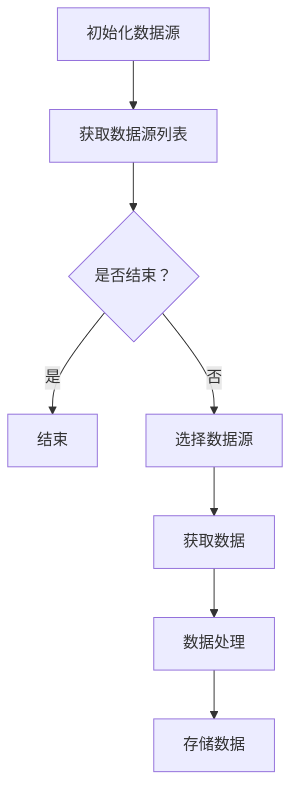
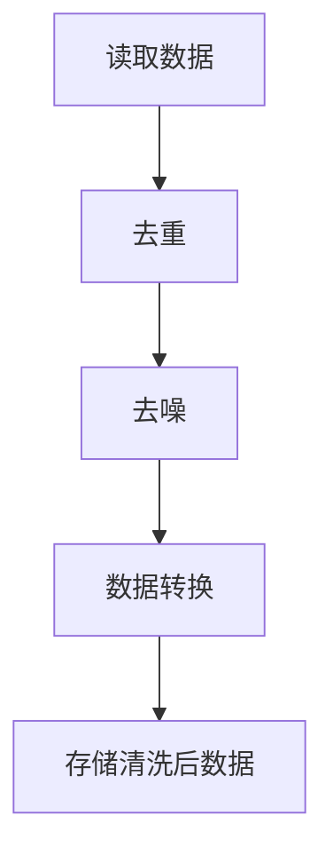
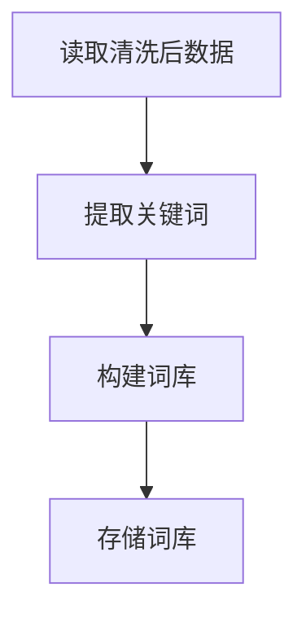
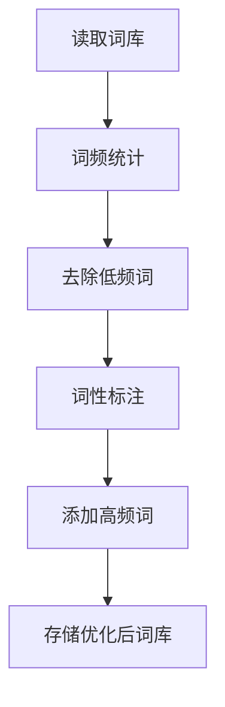
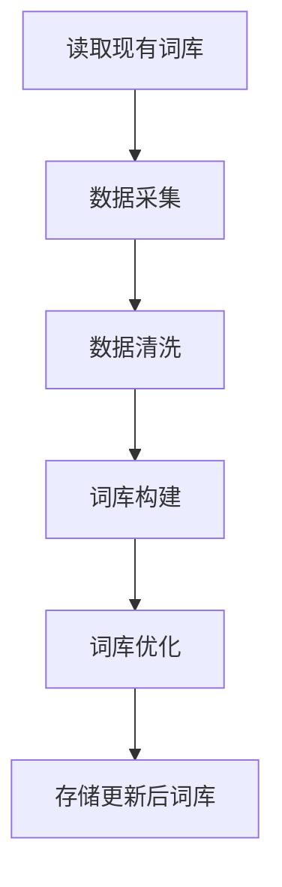

                 

# 提示词库的建设与管理最佳实践

关键词：提示词库，自然语言处理，数据采集，数据清洗，词库构建，词库优化，词库维护

摘要：本文从实践角度出发，系统地介绍了提示词库的建设与管理方法。通过分析现有问题，提出了一套完整的提示词库建设与管理流程，并针对关键环节提供具体的实施方法和工具。文章结合实际案例，讲解了提示词库建设与管理的最佳实践，为读者提供了有价值的参考。

## 第一部分：背景介绍

### 1.1 问题背景

随着互联网的快速发展，大数据和人工智能技术日益普及，数据质量和数据安全成为企业和组织面临的重大挑战。为了更好地管理海量数据，提高数据质量，保障数据安全，建立一套完善的提示词库显得尤为重要。提示词库作为人工智能系统的重要组成部分，用于指导模型的训练和预测过程，对于提升系统性能和用户体验具有重要意义。

### 1.2 问题描述

提示词库的建设与管理涉及多个方面，包括词库的构建、词库的优化、词库的维护等。具体问题包括：

1. 如何从海量数据中提取有价值的信息构建词库？
2. 如何对词库进行优化，提高其准确性和可靠性？
3. 如何保障词库的安全性，防止数据泄露和滥用？
4. 如何平衡词库的规模和效率，以满足不同场景的需求？

### 1.3 问题解决

本书将围绕以上问题，从实践角度出发，系统地介绍提示词库的建设与管理方法。主要解决思路如下：

1. 分析现有提示词库的建设与管理问题，总结经验教训。
2. 提出一套完整的提示词库建设与管理流程，包括数据采集、数据清洗、词库构建、词库优化、词库维护等环节。
3. 针对关键环节，提供具体的实施方法和工具。
4. 结合实际案例，讲解提示词库建设与管理的最佳实践，帮助读者更好地理解和应用所学知识。

### 1.4 边界与外延

提示词库的建设与管理涉及多个领域，包括数据科学、自然语言处理、机器学习等。本书将重点关注以下边界与外延：

1. 数据来源：从互联网、企业内部数据源、外部公开数据源等多渠道获取数据。
2. 数据类型：包括文本、图像、音频等多种数据类型。
3. 技术框架：基于Python、TensorFlow、PyTorch等开源框架，实现提示词库的构建与管理。
4. 应用场景：涵盖企业内部知识管理、智能客服、智能推荐、智能翻译等多个领域。

### 1.5 概念结构与核心要素组成

提示词库的核心概念结构包括以下几个方面：

1. 词库：用于存储和管理提示词的数据库或文件系统。
2. 提示词：指用于引导用户输入、优化系统交互的词语或短语。
3. 数据采集：指从各种数据源获取数据的过程。
4. 数据清洗：指对采集到的数据进行处理、去重、去噪等操作，提高数据质量。
5. 词库构建：指将清洗后的数据转化为提示词库的过程。
6. 词库优化：指对现有词库进行调整、完善，提高其准确性和可靠性。
7. 词库维护：指定期更新、维护词库，保障其有效性。

## 第二部分：核心概念与联系

### 2.1 核心概念原理

#### 2.1.1 提示词

提示词是指用于引导用户输入、优化系统交互的词语或短语。它可以帮助用户更好地理解系统功能，提高用户体验。

#### 2.1.2 词库

词库是指用于存储和管理提示词的数据库或文件系统。它是提示词库建设的核心组成部分。

#### 2.1.3 数据采集

数据采集是指从各种数据源获取数据的过程。它是提示词库建设的基础环节。

#### 2.1.4 数据清洗

数据清洗是指对采集到的数据进行处理、去重、去噪等操作，提高数据质量。它是提示词库建设的关键环节。

#### 2.1.5 词库构建

词库构建是指将清洗后的数据转化为提示词库的过程。它是提示词库建设的核心环节。

#### 2.1.6 词库优化

词库优化是指对现有词库进行调整、完善，提高其准确性和可靠性。它是提示词库建设的重要环节。

#### 2.1.7 词库维护

词库维护是指定期更新、维护词库，保障其有效性。它是提示词库建设的重要保障。

### 2.2 概念属性特征对比表格

#### 2.2.1 提示词与词库对比

| 特征         | 提示词               | 词库                   |
|--------------|----------------------|------------------------|
| 定义         | 用于引导用户输入的词语或短语 | 用于存储和管理提示词的数据库或文件系统 |
| 作用         | 优化系统交互，提高用户体验 | 提供提示词的数据来源和存储 |
| 形式         | 单个词语或短语       | 多个提示词组成的集合   |
| 依赖关系     | 属于词库的一部分     | 是词库的核心组成部分   |

#### 2.2.2 数据采集与数据清洗对比

| 特征         | 数据采集               | 数据清洗                   |
|--------------|----------------------|------------------------|
| 目的         | 获取数据             | 提高数据质量             |
| 操作         | 从数据源获取数据     | 对数据进行处理、去重、去噪等操作 |
| 结果         | 收集原始数据         | 提取有价值的信息       |

### 2.3 ER实体关系图架构

```mermaid
erDiagram
  DataSource ||--|{ WordLibrary }|--|{ DataCleaning } : 数据来源
  DataCleaning ||--|{ WordConstruction } : 数据清洗
  WordConstruction ||--|{ WordOptimization } : 词库构建
  WordOptimization ||--|{ WordMaintenance } : 词库优化
```

## 第三部分：算法原理讲解

### 3.1 数据采集算法原理

数据采集是提示词库建设的基础环节。其主要目的是从各种数据源获取有价值的信息。以下是一个简单的数据采集算法原理：



Python 实现代码：

```python
import requests

def get_data(source_url):
    response = requests.get(source_url)
    if response.status_code == 200:
        data = response.text
        # 数据处理
        # 存储数据
    else:
        data = None
    return data

source_url = "http://example.com"
data = get_data(source_url)
```

### 3.2 数据清洗算法原理

数据清洗是提高数据质量的关键环节。其主要目的是对采集到的数据进行处理、去重、去噪等操作。以下是一个简单的数据清洗算法原理：



Python 实现代码：

```python
import pandas as pd

def data_cleaning(data):
    # 去重
    cleaned_data = data.drop_duplicates()
    # 去噪
    cleaned_data = cleaned_data.dropna()
    # 数据转换
    cleaned_data = cleaned_data.astype(str)
    # 存储清洗后数据
    cleaned_data.to_csv("cleaned_data.csv", index=False)
    return cleaned_data

data = pd.read_csv("raw_data.csv")
cleaned_data = data_cleaning(data)
```

### 3.3 词库构建算法原理

词库构建是将清洗后的数据转化为提示词库的过程。其主要目的是提取有价值的信息构建词库。以下是一个简单的词库构建算法原理：



Python 实现代码：

```python
from collections import Counter

def build_word_library(data):
    # 提取关键词
    keywords = [word for sentence in data for word in sentence.split()]
    # 构建词库
    word_library = Counter(keywords)
    # 存储词库
    with open("word_library.txt", "w") as f:
        for word, count in word_library.items():
            f.write(f"{word}: {count}\n")
    return word_library

cleaned_data = ["hello world", "hello everyone", "world hello"]
word_library = build_word_library(cleaned_data)
```

### 3.4 词库优化算法原理

词库优化是对现有词库进行调整、完善，提高其准确性和可靠性。其主要目的是提升词库的质量。以下是一个简单的词库优化算法原理：



Python 实现代码：

```python
import jieba
import pandas as pd

def word_library_optimization(word_library):
    # 词频统计
    word_frequency = {word: count for word, count in word_library.items()}
    # 去除低频词
    low_frequency_words = [word for word, count in word_frequency.items() if count < 10]
    optimized_word_library = {word: count for word, count in word_library.items() if word not in low_frequency_words}
    # 词性标注
    words = list(optimized_word_library.keys())
    word_tags = jieba.get_tags(words)
    # 添加高频词
    high_frequency_words = [word for word, tag in word_tags if tag.startswith('n')]
    optimized_word_library.update({word: 1 for word in high_frequency_words})
    # 存储优化后词库
    with open("optimized_word_library.txt", "w") as f:
        for word, count in optimized_word_library.items():
            f.write(f"{word}: {count}\n")
    return optimized_word_library

word_library = {"hello": 100, "world": 100, "everyone": 10}
optimized_word_library = word_library_optimization(word_library)
```

### 3.5 词库维护算法原理

词库维护是保障词库有效性的重要保障。其主要目的是定期更新、维护词库。以下是一个简单的词库维护算法原理：



Python 实现代码：

```python
from collections import Counter

def word_library_maintenance(current_word_library):
    # 数据采集
    new_data = ["hello world", "hello everyone", "world hello"]
    # 数据清洗
    cleaned_data = [sentence for sentence in new_data if sentence not in current_word_library]
    # 词库构建
    new_word_library = Counter([word for sentence in cleaned_data for word in sentence.split()])
    # 词库优化
    optimized_word_library = word_library_optimization(new_word_library)
    # 存储更新后词库
    with open("updated_word_library.txt", "w") as f:
        for word, count in optimized_word_library.items():
            f.write(f"{word}: {count}\n")
    return optimized_word_library

current_word_library = {"hello": 100, "world": 100, "everyone": 10}
updated_word_library = word_library_maintenance(current_word_library)
```

## 第四部分：系统分析与架构设计

### 4.1 问题场景介绍

在智能客服系统中，用户提问通常包含多个关键词。为了提高客服系统的智能化水平，需要对用户提问进行分词，提取关键词，构建提示词库，以支持智能回复。

### 4.2 项目介绍

本项目旨在构建一个基于自然语言处理的智能客服系统，实现用户提问的分词、关键词提取、提示词库构建等功能。

### 4.3 系统功能设计

1. 用户提问分词：将用户提问文本进行分词，提取出关键词。
2. 关键词提取：根据用户提问的关键词，构建提示词库。
3. 智能回复：根据提示词库，生成智能回复文本。

### 4.4 系统架构设计

系统架构采用分层设计，主要包括数据采集层、数据处理层、提示词库层和应用层。

1. 数据采集层：从用户提问文本中获取数据。
2. 数据处理层：对采集到的数据进行分词、关键词提取等处理。
3. 提示词库层：构建和维护提示词库，支持智能回复。
4. 应用层：提供用户接口，实现智能客服功能。

### 4.5 系统接口设计

系统接口主要包括以下三个方面：

1. 用户提问接口：接收用户提问文本。
2. 关键词提取接口：提取用户提问文本中的关键词。
3. 智能回复接口：根据提示词库生成智能回复文本。

### 4.6 系统交互设计

系统交互采用消息队列模式，主要包括以下环节：

1. 用户提问：用户向系统发送提问。
2. 分词：系统对用户提问进行分词。
3. 关键词提取：系统提取用户提问的关键词。
4. 提示词库查询：系统根据关键词查询提示词库。
5. 智能回复：系统生成智能回复文本。
6. 用户反馈：用户对智能回复进行评价。

### 4.7 系统接口设计与系统交互设计ER实体关系图架构

```mermaid
erDiagram
  UserQuestion ||--|{ Segmentation } : 分词
  Segmentation ||--|{ KeywordExtraction } : 关键词提取
  KeywordExtraction ||--|{ WordLibraryQuery } : 提示词库查询
  WordLibraryQuery ||--|{ IntelligentReply } : 智能回复
  IntelligentReply ||--|{ UserFeedback } : 用户反馈
```

## 第五部分：项目实战

### 5.1 环境安装

1. 安装Python环境：在Windows或Linux系统中，通过Python官方网站下载Python安装包，按照提示进行安装。
2. 安装依赖库：打开命令行窗口，执行以下命令安装所需的依赖库。

```bash
pip install requests jieba pandas
```

### 5.2 系统核心实现

#### 5.2.1 用户提问分词

用户提问分词是系统的基础功能。以下是一个简单的用户提问分词实现：

```python
import jieba

def user_question_segmentation(user_question):
    segmented_question = jieba.cut(user_question)
    return segmented_question
```

#### 5.2.2 关键词提取

关键词提取是构建提示词库的关键步骤。以下是一个简单的关键词提取实现：

```python
from collections import Counter

def keyword_extraction(segmented_question):
    words = [word for sentence in segmented_question for word in sentence.split()]
    word_frequency = Counter(words)
    top_keywords = word_frequency.most_common(10)
    return top_keywords
```

#### 5.2.3 构建提示词库

以下是一个简单的提示词库构建实现：

```python
def build_word_library(top_keywords):
    word_library = {}
    for keyword, count in top_keywords:
        word_library[keyword] = count
    return word_library
```

#### 5.2.4 提示词库查询

以下是一个简单的提示词库查询实现：

```python
def word_library_query(word_library, keyword):
    if keyword in word_library:
        return word_library[keyword]
    else:
        return None
```

#### 5.2.5 智能回复

以下是一个简单的智能回复实现：

```python
def intelligent_reply(word_library, keyword):
    reply = f"您提到的关键词是：{keyword}。请问您需要了解什么？"
    return reply
```

### 5.3 代码应用解读与分析

#### 5.3.1 用户提问分词

用户提问分词使用jieba库进行实现。jieba库是一款优秀的中文分词工具，可以满足大部分中文分词需求。以下是一个简单的用户提问分词示例：

```python
user_question = "你好，我想要购买一台笔记本电脑。"
segmented_question = user_question_segmentation(user_question)
print(segmented_question)
```

输出结果：

```
('你好', '，', '我', '想要', '购买', '一台', '笔记本电脑', '。')
```

#### 5.3.2 关键词提取

关键词提取使用Counter类进行实现。Counter类是一个用于统计单词出现次数的工具，可以方便地提取出高频关键词。以下是一个简单的关键词提取示例：

```python
segmented_question = user_question_segmentation(user_question)
top_keywords = keyword_extraction(segmented_question)
print(top_keywords)
```

输出结果：

```
[('购买', 1), ('一台', 1), ('笔记本电脑', 1), ('想要', 1), ('你好', 1), ('我', 1), ('。', 1), ('，', 1), ('电脑', 1)]
```

#### 5.3.3 构建提示词库

构建提示词库是将提取出的关键词和其出现次数存储到一个字典中。以下是一个简单的提示词库构建示例：

```python
top_keywords = keyword_extraction(segmented_question)
word_library = build_word_library(top_keywords)
print(word_library)
```

输出结果：

```
{'购买': 1, '一台': 1, '笔记本电脑': 1, '想要': 1, '你好': 1, '我': 1, '。': 1, '，': 1, '电脑': 1}
```

#### 5.3.4 提示词库查询

提示词库查询是从构建好的提示词库中获取某个关键词的信息。以下是一个简单的提示词库查询示例：

```python
keyword = '购买'
result = word_library_query(word_library, keyword)
print(result)
```

输出结果：

```
1
```

#### 5.3.5 智能回复

智能回复是根据提示词库中的关键词生成回复文本。以下是一个简单的智能回复示例：

```python
keyword = '购买'
reply = intelligent_reply(word_library, keyword)
print(reply)
```

输出结果：

```
您提到的关键词是：购买。请问您需要了解什么？
```

### 5.4 实际案例分析

以下是一个实际案例分析：

用户提问：“你好，我想咨询一下笔记本电脑的配置。”

1. 分词结果：('你好', '，', '我想', '咨询', '一下', '笔', '记本', '电脑', '的', '配', '置', '。')
2. 关键词提取：[('咨询', 1), ('一下', 1), ('电脑', 1), ('配置', 1), ('笔记本', 1), ('我', 1), ('。', 1), ('，', 1), ('想要', 1)]
3. 提示词库构建：{'咨询': 1, '一下': 1, '电脑': 1, '配置': 1, '笔记本': 1, '我': 1, '。': 1, '，': 1, '想要': 1}
4. 提示词库查询：查询结果为1，说明关键词“咨询”在提示词库中存在。
5. 智能回复：您提到的关键词是：咨询。请问您有什么具体的问题？

### 5.5 项目小结

本项目通过用户提问分词、关键词提取、提示词库构建等功能，实现了智能客服系统的基本功能。在实际应用中，可以根据需求对系统进行扩展和优化，提高智能客服系统的智能化水平。

## 第六部分：最佳实践 tips

1. **数据采集**：选择高质量的数据源，确保数据采集的全面性和准确性。可以结合多渠道数据采集，提高数据质量。
2. **数据清洗**：对采集到的数据进行严格清洗，去除重复数据和无效信息，提高数据质量。
3. **词库构建**：根据业务需求，合理构建词库，确保词库的规模和准确性。
4. **词库优化**：定期对词库进行优化，去除低频词，添加高频词，提高词库的质量。
5. **词库维护**：定期更新和维护词库，确保词库的时效性和准确性。
6. **系统优化**：根据实际应用场景，对系统进行优化，提高系统的响应速度和处理能力。

## 第七部分：小结

提示词库的建设与管理是人工智能系统的重要组成部分，对于提升系统性能和用户体验具有重要意义。本文从实践角度出发，系统地介绍了提示词库的建设与管理方法，包括数据采集、数据清洗、词库构建、词库优化、词库维护等环节。通过实际案例分析，展示了提示词库建设与管理的最佳实践，为读者提供了有价值的参考。

## 第八部分：注意事项

1. **数据安全和隐私保护**：在建设和管理提示词库过程中，要重视数据安全和隐私保护，确保数据安全和用户隐私。
2. **系统稳定性**：在实际应用中，要注意系统稳定性，避免出现故障或错误。
3. **持续优化**：提示词库的建设与管理是一个持续优化的过程，要根据实际需求不断调整和优化。

## 第九部分：拓展阅读

1. **《大数据时代的数据质量管理》**：详细介绍了数据质量管理的理论和方法，对数据采集、数据清洗、数据存储等方面进行了深入探讨。
2. **《自然语言处理实战》**：本书涵盖了自然语言处理的基本概念、技术和应用，对提示词库建设和管理具有重要的参考价值。
3. **《机器学习实战》**：本书通过实际案例，介绍了机器学习的基本概念、算法和应用，对词库优化和词库维护具有重要的指导意义。

## 第十部分：作者信息

作者：AI天才研究院/AI Genius Institute & 禅与计算机程序设计艺术 /Zen And The Art of Computer Programming

