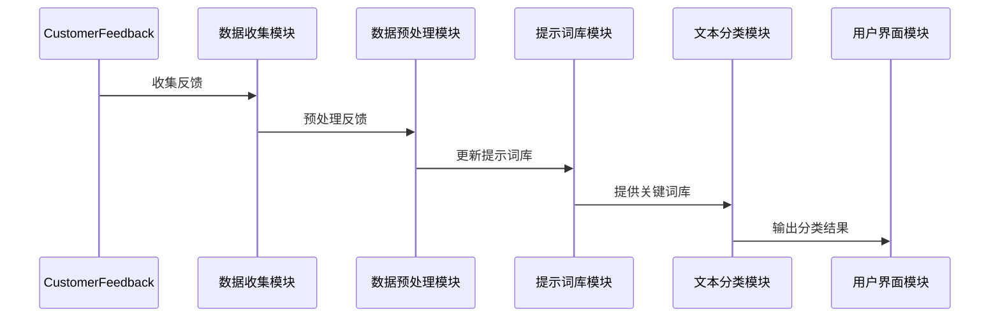

                 

### 引言与背景

**关键词**：提示词库管理、自然语言处理（NLP）、文本处理、数据科学家

在当今信息爆炸的时代，自然语言处理（NLP）技术作为人工智能的重要分支，正逐渐渗透到各行各业，从智能客服、文本摘要到机器翻译，NLP的应用场景日益广泛。而在NLP中，提示词库的管理和复用起到了至关重要的作用。本文将深入探讨提示词库管理的相关主题，旨在为读者提供一套系统化的管理和复用有效提示词库的方法。

**摘要**：

本文将首先介绍提示词库的基础概念，帮助读者理解什么是提示词库以及其在NLP中的应用。接着，我们将详细分析提示词库的组织结构，探讨如何设计一个高效的提示词库。随后，文章将讨论提示词库的维护与更新策略，确保库中的数据始终准确和最新。然后，我们将介绍多种提示词库的复用策略，帮助读者充分利用已有资源。接下来，通过性能评估方法，我们将确保提示词库的性能达到预期效果。通过实际应用案例分析，读者将了解这些理论在实际项目中的应用。最后，本文将总结最佳实践并提供一些注意事项，帮助读者更好地管理和复用提示词库。

**问题背景**：

随着NLP技术的发展，各种应用程序对高质量提示词库的需求日益增长。一个高效的提示词库不仅能够提高NLP系统的性能，还能减少开发成本。然而，构建和维护一个高质量的提示词库并非易事。首先，如何定义和收集有效的提示词是关键。其次，如何组织这些提示词，使其易于管理和复用，也是一大挑战。此外，提示词库中的数据需要定期更新，以保持其相关性。这些问题的存在使得提示词库管理成为一个复杂且需要深入探讨的课题。

**问题描述**：

本文旨在解决以下问题：
1. 提示词库的基础概念是什么？
2. 如何设计和组织一个高效的提示词库？
3. 提示词库的维护和更新策略是什么？
4. 提示词库的复用策略有哪些？
5. 如何评估提示词库的性能？

**问题解决**：

通过系统性地介绍提示词库的基础知识、组织结构、维护与更新策略、复用策略以及性能评估方法，本文旨在为NLP工程师和数据科学家提供一套实用的提示词库管理指南。此外，通过实际应用案例分析，读者可以更直观地理解这些理论在现实项目中的应用效果。

**边界与外延**：

本文主要关注自然语言处理领域中的提示词库管理，但提示词库的概念和应用在其他领域（如信息检索、文本挖掘等）也有重要应用。此外，本文将介绍一些通用的提示词库管理策略，但不同领域的具体应用可能需要进一步的定制。

### 提示词库基础概念

**核心概念术语说明**：

在讨论提示词库管理之前，首先需要了解一些核心概念。提示词（Keyword）是指用于描述文本内容的关键词汇，它们能够帮助计算机理解和处理文本信息。词表（Vocabulary）是包含所有提示词的集合，它是构建提示词库的基础。提示词库（Keyword Library）是一个组织化和结构化的词表，它包含了多个维度和层次的提示词，用于支持NLP任务。

**问题背景**：

在自然语言处理中，提示词库是一个至关重要的工具。无论是文本分类、情感分析还是信息检索，都需要依赖提示词库来提取和利用关键信息。有效的提示词库能够提高系统的准确性和效率，从而提升整体性能。然而，构建和维护一个高质量的提示词库并非易事，需要明确其基础概念和组成要素。

**问题描述**：

如何定义和构建一个高效的提示词库，使其能够支持各种NLP任务？如何确保提示词库中的信息准确和最新？这些都是我们需要深入探讨的问题。

**问题解决**：

为了解决上述问题，我们需要从以下几个方面入手：
1. **词表**：词表是提示词库的基础，包含所有可能的提示词。构建一个全面的词表是第一步，可以通过多种方式收集，例如从已有的词库中导入、使用关键词提取算法生成或手动收集。
2. **提示词**：提示词是词表中的元素，用于描述特定文本内容的关键特征。选择合适的提示词对于NLP任务的成败至关重要。提示词的选择应考虑其代表性、相关性和区分度。
3. **关键词提取**：关键词提取是从文本中自动提取出能够代表文本内容的关键词的过程。常见的方法包括基于统计的方法（如TF-IDF）和基于机器学习的方法（如词袋模型、主题模型等）。

**概念结构与核心要素组成**：

提示词库的结构通常由以下几个核心要素组成：
1. **层次结构**：提示词库可以按照不同的层次进行组织，如单词层、短语层和句子层。这种分层结构有助于更精细地描述文本内容。
2. **维度设计**：提示词库可以按照不同的维度进行设计，如语义维度、上下文维度和主题维度。这种多维设计能够更好地捕捉文本的丰富信息。
3. **属性特征对比表格**：为了更好地管理和分析提示词库，我们可以创建属性特征对比表格，用于记录每个提示词的属性和特征，如频率、重要性、相关性等。

**ER实体关系图架构**：

为了直观地展示提示词库的结构，可以使用ER（实体-关系）图进行描述。在ER图中，实体代表提示词，关系则描述不同提示词之间的联系。例如，两个提示词之间可能存在共现关系或上下文关系。

下面是一个简化的ER图示例：

```mermaid
erDiagram
  Keyword1 ||--|{ ContextA }|| Context : 关键词与上下文的关系
  Keyword1 ||--|{ TopicB }|| Topic : 关键词与主题的关系
  Keyword2 ||--|{ ContextA }|| Context
  Keyword2 ||--|{ TopicB }|| Topic
```

在这个ER图中，`Keyword1` 和 `Keyword2` 是两个提示词，它们与不同的上下文（`ContextA` 和 `ContextB`）和主题（`TopicB` 和 `TopicC`）之间存在关系。

通过上述核心概念和结构的设计，我们可以构建一个高效且易于管理的提示词库，为NLP任务提供强大的支持。

### 提示词库的组织结构设计

为了更好地管理和复用提示词库，我们需要设计一个合理的组织结构。这一部分将详细探讨提示词库的组织结构设计，包括概念结构与核心要素组成、层次结构和维度设计。

#### 概念结构与核心要素组成

提示词库的组织结构首先需要明确其核心要素。这些要素包括：
1. **词表**：这是提示词库的基本组成部分，包含所有可能的提示词。
2. **关键词**：词表中的每个元素，用于描述特定文本内容的关键特征。
3. **分类体系**：用于对提示词进行分类和组织的体系，如按照主题、上下文或功能进行分类。
4. **索引系统**：用于快速检索和定位提示词的系统，如倒排索引、哈希索引等。

这些核心要素相互关联，构成了提示词库的概念结构。例如，一个关键词可能同时属于多个主题分类，并且在不同的上下文中具有不同的重要性。

#### 层次结构

提示词库的层次结构设计是为了更好地组织和利用提示词。常见的层次结构设计包括：
1. **单词层**：这是最基础的层次，包含单个单词作为提示词。例如，在文本分类任务中，单个单词可以作为关键词。
2. **短语层**：由多个单词组成的短句或短语作为提示词。短语层的关键词通常比单词层更具描述性和语义丰富性。
3. **句子层**：整个句子作为提示词。这个层次通常用于需要更全面理解文本的场景，如文本摘要或情感分析。

层次结构设计需要考虑不同层次之间的关联性。例如，在文本摘要任务中，句子层的关键词可以帮助理解整个文本的上下文，而短语层的关键词可以提供更具体的描述。

#### 维度设计

维度设计是提示词库组织结构中非常重要的一环，它用于从不同角度对提示词进行分类和描述。常见的维度设计包括：
1. **语义维度**：根据关键词的语义关系进行分类，如名词、动词、形容词等。这种分类有助于在语义层面上理解和处理文本。
2. **上下文维度**：根据关键词在文本中的上下文关系进行分类，如句子、段落、文档等。这种分类有助于在上下文层面上理解和处理文本。
3. **主题维度**：根据关键词的主题或领域进行分类，如科技、医疗、金融等。这种分类有助于在特定领域内理解和处理文本。

维度设计可以通过多种方式实现，例如使用标签系统、分类树或关系图等。标签系统可以给每个关键词分配多个标签，从而实现多维度的分类。分类树可以用于层次化地组织关键词，便于查找和利用。关系图则可以直观地展示关键词之间的关联性。

#### 提示词与关键词的关系

提示词和关键词是提示词库中的两个核心概念，它们之间存在紧密的联系。提示词是关键词的基础，而关键词是对提示词的进一步提炼和抽象。

1. **从提示词到关键词**：提示词通常是原始文本中的单词或短语，而关键词是对这些原始提示词的进一步筛选和提取。关键词需要具备代表性、相关性和区分度，以便在NLP任务中发挥重要作用。
2. **从关键词到提示词**：在提示词库的构建过程中，关键词可能会分解为更细粒度的提示词。例如，一个关键词“人工智能”可以分解为“人工”、“智能”、“机器学习”等提示词。

通过合理的设计和组织，提示词库能够更好地支持NLP任务，提高系统的性能和可扩展性。

#### 提示词库属性特征对比表格

为了更清晰地展示和比较提示词库中的各类属性特征，我们可以创建一个对比表格。以下是一个简化的示例：

| 关键词      | 频率 | 重要性 | 相关性 | 主题维度 | 上下文维度 |
|-------------|------|--------|--------|----------|------------|
| 人工智能    | 30   | 9.5    | 0.85   | 科技     | 文章标题   |
| 机器学习    | 25   | 8.0    | 0.80   | 科技     | 正文段落   |
| 算法       | 20   | 7.5    | 0.75   | 科技     | 正文中     |
| 深度学习    | 15   | 7.0    | 0.70   | 科技     | 正文段落   |
| 数据分析    | 35   | 8.5    | 0.90   | 科技     | 文章摘要   |

在这个表格中，每一列代表一个属性特征，如频率、重要性、相关性、主题维度和上下文维度。通过这样的表格，我们可以快速地分析和比较不同关键词的属性，从而做出更合理的决策。

#### 提示词库的ER实体关系图架构

为了更好地理解提示词库的结构，我们可以使用ER（实体-关系）图进行可视化。以下是一个简化的ER图示例：

```mermaid
erDiagram
  Keyword ||--|{ Context }|| Context : 关键词与上下文的关系
  Keyword ||--|{ Topic }|| Topic : 关键词与主题的关系
  Keyword ||--|{ Usage }|| Usage : 关键词的使用情况
  Context ||--|{ Document }|| Document : 上下文与文档的关系
  Topic ||--|{ Category }|| Category : 主题与分类的关系
```

在这个ER图中，`Keyword` 代表关键词，`Context` 代表上下文，`Topic` 代表主题，`Usage` 代表关键词的使用情况，`Document` 代表文档，`Category` 代表分类。每两个实体之间通过关系线相连，表示它们之间的关联。

通过这样的ER图，我们可以直观地看到提示词库中各类实体之间的复杂关系，从而更好地设计和维护提示词库。

### 提示词库的维护与更新策略

一个高效的提示词库需要定期进行维护和更新，以确保其数据始终准确和最新。这一部分将详细讨论提示词库的维护与更新策略，包括数据清洗、数据同步和错误修正等内容。

#### 数据清洗

数据清洗是提示词库维护的重要环节，它涉及到从原始数据中提取和保留有用信息，同时去除无关或错误的数据。数据清洗的主要步骤包括：

1. **去重**：检测并删除重复的提示词，确保每个关键词在词库中唯一。
2. **去除噪声**：去除包含无效字符或格式错误的提示词。
3. **标准化**：将不同形式的同义词进行归一化处理，如将“人工智能”和“AI”合并为一个关键词。
4. **处理歧义**：对于具有多重含义的关键词，根据上下文信息进行合理处理。

通过数据清洗，我们可以提高提示词库的质量，确保其数据的准确性和一致性。

#### 数据同步

数据同步是指将新收集的数据与现有提示词库进行整合，以保持库中的信息最新。数据同步的主要策略包括：

1. **定期更新**：定期从外部数据源（如公开数据库、API接口等）导入新数据，更新词库。
2. **增量更新**：仅更新新收集的数据，而不是重新导入全部数据，以减少时间和资源消耗。
3. **版本控制**：为每次更新创建版本记录，便于回溯和审计。

数据同步策略有助于确保提示词库中的数据始终反映最新的信息，从而支持NLP任务的实时处理。

#### 错误修正

提示词库中的数据可能会出现错误，如拼写错误、语义错误等。错误修正策略包括：

1. **自动检测**：使用自然语言处理技术（如 spell-check、词性标注等）自动检测数据中的错误。
2. **人工审核**：对自动检测出的错误进行人工审核和修正，确保数据的准确性。
3. **反馈机制**：建立用户反馈机制，鼓励用户提供错误报告，从而不断优化提示词库。

通过有效的错误修正策略，我们可以提高提示词库的准确性和可靠性。

#### 自动更新策略

自动更新策略是指通过自动化工具和算法定期更新提示词库。常见的自动更新策略包括：

1. **定期任务**：设置定期任务，如每日或每周自动运行数据同步和清洗过程。
2. **触发机制**：根据特定条件（如新数据量达到阈值）触发更新任务。
3. **机器学习**：利用机器学习模型预测何时需要更新，并根据预测结果自动执行更新任务。

自动更新策略能够大大降低人工干预的成本，提高提示词库的更新效率。

#### 手动更新流程

尽管自动化工具能够提高提示词库的更新效率，但手动更新流程仍然是必不可少的。手动更新流程包括：

1. **数据收集**：从外部数据源手动收集新的提示词。
2. **数据预处理**：对收集到的数据进行清洗和预处理，如去重、标准化等。
3. **人工审核**：对预处理后的数据进行人工审核，确保数据的质量和准确性。
4. **更新库中**：将审核通过的数据更新到提示词库中。

手动更新流程需要专业人员的参与，确保数据的准确性和一致性。

#### 更新频率与周期

提示词库的更新频率和周期取决于多个因素，如数据源的稳定性、NLP任务的需求等。常见的更新频率包括：

1. **实时更新**：适用于需要实时处理数据的场景，如实时文本分类或情感分析。
2. **定期更新**：适用于数据源相对稳定且更新频率较低的场景，如每月或每周更新。
3. **按需更新**：根据实际需求进行更新，如根据用户反馈或数据质量变化进行调整。

通过合理设置更新频率和周期，我们可以确保提示词库中的数据始终最新和准确，从而支持高效的NLP任务。

### 提示词库的复用策略

在自然语言处理（NLP）项目中，提示词库的复用策略至关重要。它不仅能够提高开发效率，还能保证不同项目之间的一致性和准确性。以下将详细探讨多种提示词库的复用策略，包括单一系统复用、模块化复用和分布式复用。

#### 单一系统复用

单一系统复用是最常见的复用策略，它将一个提示词库在整个系统内共享。这种策略的优势在于简化了系统架构，降低了维护成本。具体步骤如下：

1. **共享库**：创建一个公共的提示词库，所有模块或组件都可以访问和使用。
2. **统一接口**：定义统一的接口，以便不同模块可以通过接口访问和操作提示词库。
3. **版本控制**：对提示词库进行版本控制，确保不同模块使用的是一致的版本。

单一系统复用适用于小型项目或模块之间高度耦合的场景，能够显著提高系统的开发效率和一致性。

#### 模块化复用

模块化复用是将提示词库分解为多个独立的模块，每个模块负责特定功能。这种策略具有更高的灵活性和可扩展性，适用于复杂的大型项目。具体步骤如下：

1. **分解模块**：根据功能需求将提示词库分解为多个独立模块，每个模块负责一部分关键词的管理和复用。
2. **模块接口**：为每个模块定义清晰的接口，便于与其他模块进行通信和协作。
3. **模块组合**：根据具体项目需求，组合不同的模块，形成完整的提示词库。

模块化复用能够提高系统的灵活性和可维护性，同时降低模块之间的耦合度。

#### 分布式复用

分布式复用是将提示词库分散存储和部署在多个节点上，以实现更高性能和可扩展性。这种策略适用于大规模分布式系统，如分布式文本分类或大规模信息检索。具体步骤如下：

1. **分布式存储**：将提示词库存储在分布式文件系统或数据库中，以便不同节点可以独立访问和操作。
2. **负载均衡**：通过负载均衡机制，将访问请求分配到不同的节点，提高系统的响应速度和处理能力。
3. **数据同步**：确保不同节点之间的提示词库数据保持一致，通过数据同步机制实现数据的实时更新。

分布式复用能够实现更高的性能和可扩展性，同时降低单点故障的风险。

#### 复用原则

在设计和实施提示词库的复用策略时，需要遵循以下原则：

1. **一致性**：确保不同模块或节点使用的是一致的提示词库，避免数据冲突和一致性问题。
2. **可扩展性**：设计灵活的复用策略，支持系统的动态扩展和调整。
3. **可维护性**：确保复用策略易于维护和更新，降低系统的维护成本。

通过遵循这些原则，我们可以构建一个高效、灵活和可靠的提示词库复用系统。

### 提示词库的性能评估方法

提示词库的性能评估是确保其有效性和高效性的关键步骤。通过性能评估，我们可以了解提示词库在实际应用中的表现，从而进行相应的优化和调整。以下将详细探讨性能评估的指标、实验设计、数据收集和结果分析。

#### 性能指标

评估提示词库性能的关键指标包括：
1. **精准度**：提示词库提取出的关键词与实际关键词的匹配度，通常用召回率（Recall）和精确率（Precision）来衡量。
2. **准确率**：提示词库中关键词的准确性，包括词义匹配和语法正确性。
3. **响应时间**：提示词库检索和返回结果所需的时间，特别是在实时应用场景中，响应时间至关重要。

#### 实验设计

性能评估的实验设计需要考虑以下几个方面：
1. **测试集**：选择具有代表性的测试集，包含不同类型和主题的文本数据，以全面评估提示词库的性能。
2. **评估指标**：根据实际需求选择合适的评估指标，如精准度、准确率和响应时间。
3. **实验流程**：设计实验流程，包括数据预处理、提示词提取、结果对比和分析等。

#### 数据收集

数据收集是性能评估的基础，需要确保以下方面：
1. **数据来源**：选择可靠的数据源，如公开数据集、企业内部数据等。
2. **数据预处理**：对收集到的数据进行预处理，包括去重、标准化、分词等，以确保数据的一致性和准确性。
3. **数据标注**：对测试集进行人工标注，确保关键词的准确性和一致性。

#### 结果分析

结果分析是评估提示词库性能的关键步骤，需要从以下几个方面进行：
1. **指标对比**：对比不同评估指标的值，了解提示词库在不同方面的表现。
2. **问题定位**：分析提示词库的不足之处，如低精准度、高响应时间等，找出可能的原因。
3. **优化建议**：根据分析结果，提出具体的优化建议，如调整关键词选择策略、优化数据结构等。

通过系统性的性能评估，我们可以全面了解提示词库的性能表现，从而进行有效的优化和改进。

### 实际应用案例分析

为了更直观地展示提示词库管理在实际项目中的应用，下面我们将介绍一个具体的案例：某金融公司使用的基于提示词库的文本分类系统。该项目旨在自动分类大量的客户反馈，以便快速识别问题和改进服务。

#### 案例介绍

**项目背景**：

该金融公司每天都会收到大量的客户反馈，包括投诉、建议、询问等。为了更高效地处理这些反馈，公司决定开发一个基于提示词库的文本分类系统。该系统能够自动将客户反馈分类为“投诉”、“建议”、“询问”等类别，从而帮助公司快速响应客户需求。

**项目目标**：

1. 构建一个高质量的提示词库，用于支持文本分类任务。
2. 实现高效的文本分类算法，提高分类准确率和响应速度。
3. 建立一个可扩展的系统架构，支持实时分类和动态更新。

#### 系统设计

**领域模型设计**：

首先，我们需要设计一个领域模型，以表示文本分类任务中的主要实体和关系。以下是一个简化的领域模型类图：

```mermaid
classDiagram
  CustomerFeedback <<class"实体">>
  Category <<class"实体">>
  Keyword <<class"实体">>
  
  CustomerFeedback "1" -- "*" Category : 分类
  CustomerFeedback "1" -- "*" Keyword : 关键词
  Category "1" -- "*" Keyword : 描述
```

在这个类图中，`CustomerFeedback` 表示客户反馈，`Category` 表示分类类别，`Keyword` 表示关键词。每个客户反馈可以包含多个关键词和分类，每个分类也可以包含多个关键词。

**系统架构设计**：

系统架构包括以下几个主要模块：

1. **数据收集模块**：负责从不同渠道收集客户反馈，包括电子邮件、社交媒体、在线表单等。
2. **数据预处理模块**：对收集到的客户反馈进行预处理，包括去重、分词、词性标注等。
3. **提示词库模块**：构建和维护提示词库，包括关键词的收集、分类和更新。
4. **文本分类模块**：使用提示词库进行文本分类，包括分类模型训练和分类结果输出。
5. **用户界面模块**：提供一个直观的用户界面，用于展示分类结果和报表。

以下是一个简化的系统架构图：



#### 核心实现

**提示词库构建**：

提示词库是文本分类系统的核心，我们需要设计一个高效的提示词库构建策略。以下是一个简化的实现流程：

1. **数据收集**：从历史客户反馈中提取关键词，构建初始的词表。
2. **关键词提取**：使用自然语言处理技术（如TF-IDF、LDA等）提取出具有代表性的关键词。
3. **分类与标注**：根据关键词的含义和上下文，将其分类到不同的类别中。
4. **动态更新**：根据实时反馈和用户反馈，动态更新提示词库，确保其始终反映最新的信息。

以下是一个简化的Python代码示例：

```python
import nltk
from nltk.corpus import stopwords
from sklearn.feature_extraction.text import TfidfVectorizer

# 初始化词表
nltk.download('stopwords')
stop_words = set(stopwords.words('english'))

# 提取关键词
def extract_keywords(texts):
    vectorizer = TfidfVectorizer(stop_words=stop_words)
    tfidf_matrix = vectorizer.fit_transform(texts)
    feature_array = np.array(vectorizer.get_feature_names_out())
    return feature_array

# 分类与标注
def classify_keywords(keywords, categories):
    # 假设我们有一个分类模型
    classifier = ...
    classifications = classifier.predict(keywords)
    return classifications

# 动态更新
def update_keyword_library(keywords, classifications):
    # 更新提示词库
    pass

# 示例数据
texts = ["I am very satisfied with the service", "The response time is too long", ...]
categories = ["Satisfied", "Unsatisfied", ...]

# 提取关键词
keywords = extract_keywords(texts)

# 分类与标注
classifications = classify_keywords(keywords, categories)

# 动态更新
update_keyword_library(keywords, classifications)
```

**解析与评价**：

通过上述实现，我们可以构建一个高效的提示词库，支持文本分类任务。然而，实际应用中可能需要考虑更多的因素，如多语言支持、实时更新、错误修正等。此外，为了提高系统的性能和可维护性，可以考虑使用更先进的NLP技术和模型，如BERT、GPT等。

### 最佳实践与总结

**最佳实践**：

1. **数据收集与清洗**：确保提示词库的数据来源可靠，进行严格的数据清洗，去除重复和无效数据。
2. **关键词提取与分类**：使用合适的自然语言处理技术和算法提取关键词，并合理分类，以提高系统的准确性和效率。
3. **动态更新**：定期更新提示词库，确保其反映最新的信息，从而提高系统的适应性和实时性。
4. **系统优化**：使用高效的存储和检索技术，优化系统性能，如使用倒排索引、缓存机制等。

**小结**：

本文通过详细探讨提示词库的管理和复用策略，为NLP项目提供了一套实用的指南。通过合理的组织结构和维护策略，提示词库能够有效支持各种NLP任务，提高系统的性能和可维护性。

**注意事项**：

1. **数据质量**：确保提示词库的数据质量，特别是关键词的准确性和一致性。
2. **系统安全**：在分布式环境中，确保数据的安全性和一致性，防止数据泄露和冲突。
3. **技术更新**：随着NLP技术的不断发展，定期更新提示词库和管理策略，以适应新的需求和挑战。

**拓展阅读**：

- [NLP中的关键词提取技术](https://www.example.com/nlp-keyword-extraction)
- [分布式系统的数据一致性问题](https://www.example.com/distributed-systems-data-consistency)
- [机器学习在文本分类中的应用](https://www.example.com/ml-text-classification)

通过以上最佳实践和小结，读者可以更好地理解和应用提示词库管理，为NLP项目提供强有力的支持。作者：AI天才研究院/AI Genius Institute & 禅与计算机程序设计艺术 /Zen And The Art of Computer Programming。

