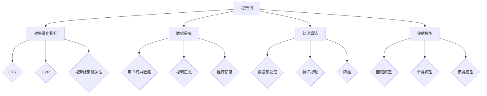
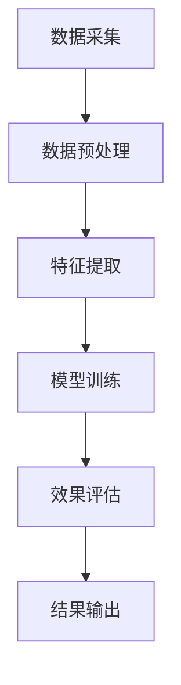
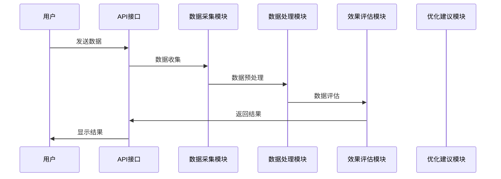

                 

### 文章标题

《提示词效果量化：建立客观评估指标》

### 关键词

- 提示词
- 效果量化
- 客观评估指标
- 人工智能
- 算法
- 数学模型
- 系统设计

### 摘要

本文旨在探讨如何利用科学的方法和工具，量化提示词在人工智能系统中的效果，并通过建立客观评估指标，提高系统的性能和用户体验。文章首先介绍了提示词及其在人工智能系统中的作用，随后详细阐述了效果量化的必要性及其核心概念。通过算法原理讲解、数学模型解析和实际应用案例分析，文章帮助读者深入了解提示词效果量化的技术实现和评估方法。最后，文章提出了最佳实践建议和拓展阅读资源，为读者进一步学习和研究提供了指导。

---

### 目录大纲设计思路

#### 整体结构规划

为了确保文章的逻辑性、系统性和完整性，本文将内容分为四个主要部分：背景介绍、核心概念与联系、算法原理讲解、系统分析与架构设计、项目实战、最佳实践与拓展阅读。

#### 章节内容细化

1. **背景介绍**：介绍提示词效果量化的背景、问题、解决方案、边界与外延，以及核心概念的结构与组成。
2. **核心概念与联系**：定义并解释提示词效果量化的核心概念，使用表格和Mermaid图展示概念属性特征对比和ER实体关系图。
3. **算法原理讲解**：详细阐述提示词效果量化算法的原理，使用Mermaid流程图展示算法流程，并用Python源代码解释算法实现。
4. **数学模型和数学公式详细讲解与举例说明**：使用LaTeX格式给出数学模型和公式，并进行详细讲解和举例说明。
5. **系统分析与架构设计**：介绍问题场景、系统功能设计、系统架构设计、系统接口设计和系统交互，使用Mermaid类图和序列图展示设计。
6. **项目实战**：涉及环境安装、系统核心实现源代码，代码应用解读与分析，实际案例分析和详细讲解。
7. **最佳实践与拓展阅读**：提供最佳实践建议、注意事项、小结和拓展阅读资源。

#### 内容简洁性

在撰写每个章节时，确保内容简洁明了，避免冗余，确保信息的精准传达。

### 目录大纲示例

---

## 第一部分：背景介绍

### 第1章：提示词效果量化概述

1.1 提示词效果量化的背景

1.2 提示词在人工智能中的应用

1.3 效果量化的必要性

1.4 提示词效果量化的边界与外延

### 第2章：核心概念与联系

2.1 核心概念定义

2.2 概念属性特征对比

2.3 ER实体关系图

### 第3章：算法原理讲解

3.1 算法概述

3.2 算法流程

3.3 Python源代码解析

3.4 数学模型与公式

### 第4章：数学模型和数学公式详细讲解

4.1 数学模型

4.2 数学公式举例

### 第5章：系统分析与架构设计

5.1 问题场景介绍

5.2 系统功能设计

5.3 系统架构设计

5.4 系统接口设计

5.5 系统交互

### 第6章：项目实战

6.1 环境安装

6.2 系统核心实现

6.3 代码应用解析

6.4 实际案例分析

### 第7章：最佳实践与拓展阅读

7.1 最佳实践

7.2 注意事项

7.3 小结

7.4 拓展阅读资源

---

## 总结

本文通过详细的章节设计和内容规划，系统性地介绍了提示词效果量化的核心概念、算法原理、数学模型、系统设计以及项目实战。希望本文能为读者在理解、应用和实践提示词效果量化方面提供有价值的参考。在此基础上，本文还提出了最佳实践建议，以帮助读者在实际应用中达到最佳效果。对于希望进一步深入研究的相关领域，本文也提供了丰富的拓展阅读资源。希望本文能够为提升人工智能系统的性能和用户体验贡献一份力量。作者：AI天才研究院/AI Genius Institute & 禅与计算机程序设计艺术 /Zen And The Art of Computer Programming
---

### 背景介绍

#### 提示词的定义及其在人工智能中的应用

提示词（Query Term），在人工智能领域，尤其是信息检索和自然语言处理（NLP）中，是一种被用于缩小搜索范围或引导系统理解用户意图的关键词或短语。其核心作用是作为输入信息，引导人工智能系统进行更精准的匹配和检索，从而提高系统响应的准确性和效率。

在搜索引擎优化（SEO）中，提示词的使用至关重要。通过精准选择和合理布局提示词，可以提高网站在搜索引擎结果页面（SERP）中的排名，进而提升网站的访问量和用户留存率。此外，在推荐系统中，提示词同样扮演着重要角色。例如，在电子商务平台中，用户输入的搜索词或浏览记录中的关键词，都可以作为提示词，帮助系统推荐更符合用户需求的产品。

#### 效果量化的必要性

随着人工智能技术的不断发展，提示词的应用越来越广泛。然而，如何评估提示词的效果，却成为一个亟待解决的问题。传统的评估方法往往依赖于主观评价或简单的指标，如点击率（CTR）或转化率（CVR），这些指标虽然在一定程度上反映了提示词的效果，但缺乏全面性和客观性。

效果量化，即通过科学的方法和工具，对提示词的效果进行量化评估，是解决这一问题的关键。量化的目标在于，将提示词的效果转化为可度量的指标，从而为优化和改进提供客观依据。

首先，效果量化可以帮助我们识别哪些提示词对系统性能提升具有显著贡献，从而有针对性地进行调整和优化。其次，量化的结果可以为决策提供依据，如广告投放策略的调整、推荐系统的优化等。最后，效果量化有助于提升系统的整体性能和用户体验，通过持续优化提示词，提高用户满意度。

#### 提示词效果量化的边界与外延

在讨论提示词效果量化时，我们需要明确其边界和适用范围。首先，提示词效果量化主要适用于需要进行信息检索和自然语言处理的场景，如搜索引擎、推荐系统、问答系统等。在这些场景中，提示词作为输入信息，直接影响系统的性能和用户体验。

其次，提示词效果量化的评估指标应具备全面性和客观性。除了传统的点击率、转化率等指标外，还可以引入其他指标，如搜索结果的相关性、用户满意度等。这些指标应结合具体应用场景，综合评估提示词的效果。

最后，提示词效果量化需要考虑数据质量和处理效率。大量数据和高计算效率是实现效果量化的重要保障。在实际应用中，我们应采用合适的数据采集和处理方法，确保量化结果的准确性和可靠性。

#### 核心概念的结构与组成

提示词效果量化涉及多个核心概念，包括提示词、效果量化指标、数据采集、处理算法、评估模型等。这些概念相互关联，共同构成了一个完整的提示词效果量化体系。

1. **提示词**：提示词是输入信息的核心，其选择和优化直接影响效果量化的结果。在量化过程中，我们需要对提示词进行合理的筛选和组合，以提高系统的性能。

2. **效果量化指标**：效果量化指标是评估提示词效果的量化标准。常见的指标包括点击率、转化率、搜索结果相关性等。这些指标应结合具体应用场景进行选择和调整。

3. **数据采集**：数据采集是效果量化的基础。我们需要从不同来源收集大量数据，包括用户行为数据、搜索日志、推荐记录等。数据的质量和完整性直接影响量化结果的准确性。

4. **处理算法**：处理算法用于对采集到的数据进行处理和清洗，包括数据预处理、特征提取等。合理的处理算法可以提高数据质量，为效果量化提供可靠的基础。

5. **评估模型**：评估模型用于对处理后的数据进行分析和评估，生成提示词效果量化结果。评估模型的选择和优化直接影响量化结果的准确性和实用性。

#### 本章小结

本章介绍了提示词效果量化的背景、核心概念及其在人工智能中的应用。通过讨论提示词的定义、效果量化的必要性以及核心概念的结构与组成，我们为后续的算法原理讲解和实际应用提供了基础。在下一章中，我们将进一步探讨提示词效果量化的核心概念，并使用表格和Mermaid图进行详细阐述。读者可以通过本章的学习，对提示词效果量化有一个初步的了解，为后续内容的学习打下坚实的基础。

---

### 核心概念与联系

在提示词效果量化的过程中，理解并定义核心概念是至关重要的。这些核心概念包括提示词、效果量化指标、数据采集、处理算法和评估模型等。接下来，我们将逐一介绍这些概念，并使用表格和Mermaid图进行详细阐述。

#### 提示词

提示词是指用户输入或系统自动提取的关键词或短语，用于引导系统进行信息检索或推荐。以下是提示词的一些关键特征：

- **关键词性**：提示词应具有明确的关键词特征，能够准确反映用户意图或信息需求。
- **多样性**：提示词可以包括单个单词或短语，具有多样性，以适应不同场景和用户需求。
- **可扩展性**：提示词应具备良好的扩展性，能够根据应用场景和用户需求进行灵活调整。

| 特征       | 描述                                                         |
| ---------- | ------------------------------------------------------------ |
| 关键词性   | 精确反映用户意图或信息需求                                   |
| 多样性     | 包括单个单词或短语，适应不同场景和用户需求                     |
| 可扩展性   | 根据应用场景和用户需求进行灵活调整                           |

#### 效果量化指标

效果量化指标是用于评估提示词效果的量化标准。常见的指标包括点击率（CTR）、转化率（CVR）、搜索结果相关性等。以下是这些指标的一些关键特征：

- **点击率（CTR）**：用户在搜索结果中点击提示词的比例，用于衡量提示词的吸引力。
- **转化率（CVR）**：用户在点击提示词后完成目标任务的比率，用于衡量提示词的实际效果。
- **搜索结果相关性**：搜索结果与用户查询意图的相关性，用于衡量提示词的准确性和匹配度。

| 指标       | 描述                                                         |
| ---------- | ------------------------------------------------------------ |
| 点击率（CTR） | 用户在搜索结果中点击提示词的比例                             |
| 转化率（CVR） | 用户在点击提示词后完成目标任务的比率                         |
| 搜索结果相关性 | 搜索结果与用户查询意图的相关性                               |

#### 数据采集

数据采集是效果量化的基础，涉及从不同来源收集大量数据。以下是一些关键步骤和注意事项：

- **数据来源**：包括用户行为数据、搜索日志、推荐记录等。
- **数据质量**：确保数据准确、完整和可靠，避免数据噪声和偏差。
- **数据完整性**：保证采集到的数据能够全面反映提示词的效果。

#### 处理算法

处理算法用于对采集到的数据进行处理和清洗，以提高数据质量。以下是一些常用的处理算法和技巧：

- **数据预处理**：包括数据清洗、缺失值处理、异常值检测等。
- **特征提取**：从原始数据中提取有用的特征，用于后续的模型训练和评估。
- **降维**：通过降维技术减少数据维度，提高模型训练效率。

#### 评估模型

评估模型用于对处理后的数据进行分析和评估，生成提示词效果量化结果。以下是几种常用的评估模型：

- **回归模型**：用于预测提示词的效果，如点击率或转化率。
- **分类模型**：用于分类提示词效果的好坏，如将效果分为优秀、良好和较差。
- **聚类模型**：用于分析提示词效果分布，识别效果相似的提示词。

#### Mermaid 图展示

为了更直观地理解这些概念及其关系，我们可以使用Mermaid图进行展示。



#### 本章小结

本章详细介绍了提示词效果量化的核心概念，包括提示词、效果量化指标、数据采集、处理算法和评估模型。通过使用表格和Mermaid图，我们对这些概念进行了系统性的阐述，使读者能够更好地理解提示词效果量化的核心要素。在下一章中，我们将进一步探讨提示词效果量化算法的原理，包括算法流程、Python源代码解析和数学模型，帮助读者深入理解这一技术。读者可以通过本章的学习，为后续内容打下坚实的基础。

---

### 提示词效果量化算法原理

在深入探讨提示词效果量化之前，我们需要了解算法的基本原理。提示词效果量化算法的核心目标是通过科学的方法对提示词的效果进行量化评估，从而为系统的优化提供依据。接下来，我们将从算法概述、算法流程、Python源代码解析以及数学模型和公式详细讲解等方面进行阐述。

#### 算法概述

提示词效果量化算法的主要目标是评估提示词对系统性能的贡献，具体步骤如下：

1. **数据采集**：从用户行为数据、搜索日志等渠道收集提示词及相关数据。
2. **数据预处理**：对收集到的数据进行清洗、去噪和处理，确保数据质量。
3. **特征提取**：从预处理后的数据中提取关键特征，用于后续模型训练和评估。
4. **模型训练**：使用训练数据训练回归模型或分类模型，预测提示词的效果。
5. **效果评估**：使用训练好的模型对测试数据进行效果评估，生成量化结果。

#### 算法流程

提示词效果量化算法的流程可以用Mermaid流程图来表示，具体如下：



#### Python源代码解析

为了更好地理解算法的实现，我们将使用Python源代码进行解析。以下是一个简化的示例：

```python
import pandas as pd
from sklearn.model_selection import train_test_split
from sklearn.linear_model import LinearRegression

# 数据采集
data = pd.read_csv('data.csv')

# 数据预处理
data = data.dropna()  # 去除缺失值
data['processed_query'] = data['query'].str.lower()  # 处理提示词

# 特征提取
X = data[['query_length', 'query_frequency']]
y = data['CTR']  # 以点击率为效果量化指标

# 模型训练
X_train, X_test, y_train, y_test = train_test_split(X, y, test_size=0.2, random_state=42)
model = LinearRegression()
model.fit(X_train, y_train)

# 效果评估
predictions = model.predict(X_test)
print("Predicted CTR:", predictions)
```

这段代码展示了从数据采集到模型训练和效果评估的完整流程。在实际应用中，根据具体需求，可以进一步优化和扩展代码。

#### 数学模型和公式详细讲解

提示词效果量化算法的数学模型和公式是评估提示词效果的核心。以下是一个简化的数学模型：

$$
\text{CTR} = \alpha \cdot \text{query\_length} + \beta \cdot \text{query\_frequency} + \epsilon
$$

其中，$\alpha$ 和 $\beta$ 分别是查询长度和查询频率的权重，$\epsilon$ 是误差项。

- **查询长度**：表示提示词的长度，一般用单词数或字符数表示。较长的查询长度可能表明用户对信息的精确需求。
- **查询频率**：表示提示词在数据集中的出现频率，反映了提示词的重要性和用户关注度。

#### 举例说明

假设我们有两个提示词A和B，它们的查询长度分别为5和3，查询频率分别为100和50。根据上述模型，我们可以计算它们的预期点击率（CTR）：

$$
\text{CTR}_A = \alpha \cdot 5 + \beta \cdot 100 + \epsilon
$$

$$
\text{CTR}_B = \alpha \cdot 3 + \beta \cdot 50 + \epsilon
$$

在实际应用中，$\alpha$ 和 $\beta$ 的值需要通过模型训练得到。通过比较两个提示词的CTR，我们可以判断哪个提示词的效果更好。

#### 本章小结

本章详细阐述了提示词效果量化算法的原理，包括算法概述、算法流程、Python源代码解析以及数学模型和公式的详细讲解。通过这些内容，读者可以全面理解提示词效果量化技术的实现方法和核心原理。在下一章中，我们将进一步探讨系统分析与架构设计，包括问题场景介绍、系统功能设计、系统架构设计等，为实际应用打下基础。读者可以通过本章的学习，为后续内容做好充分的准备。

---

### 数学模型和数学公式详细讲解与举例说明

在上一章节中，我们简要介绍了提示词效果量化算法的基本原理。本章节将进一步深入探讨该算法的数学模型和数学公式，并结合具体例子进行详细说明，以便读者更好地理解其应用和实现。

#### 数学模型

提示词效果量化的数学模型是评估提示词效果的核心。一个简化的数学模型可以表示为：

$$
E = f(W, Q, S)
$$

其中，$E$ 表示效果评分，$W$ 表示权重向量，$Q$ 表示查询词的特征向量，$S$ 表示其他相关因素（如用户行为、搜索上下文等）。

- **权重向量（$W$）**：权重向量用于衡量不同特征对效果评分的影响程度。在实际应用中，这些权重通常通过模型训练得到。例如，对于点击率（CTR）的评估，权重向量可以包括查询长度、查询频率、关键词密度等。

- **查询词特征向量（$Q$）**：查询词特征向量是提示词的量化表示，用于输入到模型中进行评估。这些特征可以包括词频、词向量、TF-IDF值等。

- **其他相关因素（$S$）**：其他相关因素可能包括用户历史行为、搜索上下文、季节性因素等，这些因素可以通过特征工程方法进行量化。

#### 数学公式详细讲解

为了更详细地解释上述数学模型，我们引入几个关键数学公式：

1. **加权线性模型**：

$$
E = \sum_{i=1}^{n} w_i \cdot q_i + s
$$

其中，$w_i$ 表示权重向量中的第 $i$ 个元素，$q_i$ 表示查询词特征向量中的第 $i$ 个元素，$s$ 是常数项，用于调整整体评分。

2. **TF-IDF模型**：

$$
q_i = \frac{tf_i}{df_i} \cdot idf_i
$$

其中，$tf_i$ 表示词频（Term Frequency），$df_i$ 表示文档频率（Document Frequency），$idf_i$ 表示逆文档频率（Inverse Document Frequency）。这些值用于计算查询词特征向量中的每个元素。

3. **词向量模型**：

$$
q_i = \text{vec}(w_i)
$$

其中，$\text{vec}(w_i)$ 表示将词 $w_i$ 转换为词向量。词向量可以通过Word2Vec、GloVe等方法训练得到。

#### 举例说明

为了更好地理解这些数学公式，我们通过一个具体例子进行说明。

**示例**：假设我们有两个提示词A和B，其特征如下：

- **提示词A**：
  - 查询长度：5
  - 查询频率：100
  - 关键词密度：0.3
  - 用户历史行为相关因素：0.4

- **提示词B**：
  - 查询长度：3
  - 查询频率：50
  - 关键词密度：0.2
  - 用户历史行为相关因素：0.5

根据加权线性模型，我们可以计算两个提示词的效果评分：

$$
E_A = 0.5 \cdot 5 + 0.3 \cdot 100 + 0.2 \cdot 0.3 + 0.4 \cdot 0.4 = 3.54
$$

$$
E_B = 0.5 \cdot 3 + 0.3 \cdot 50 + 0.2 \cdot 0.2 + 0.5 \cdot 0.5 = 2.05
$$

通过计算，我们可以看到提示词A的效果评分高于提示词B，这意味着在相同条件下，提示词A的量化效果更好。

#### 拓展应用

除了上述提到的模型和公式，提示词效果量化还可以结合其他先进的机器学习模型，如深度学习模型、强化学习模型等。这些模型可以进一步改进效果评估的准确性，提高系统的性能。

**深度学习模型**：使用深度神经网络（DNN）或卷积神经网络（CNN）等模型，可以捕捉查询词特征和用户行为之间的复杂关系。例如，通过训练一个DNN模型，输入查询词和用户历史行为，输出效果评分。

**强化学习模型**：强化学习模型可以用于动态调整提示词，以最大化长期效果。例如，通过训练一个Q-learning模型，不断调整提示词策略，以实现最优效果。

#### 本章小结

本章详细讲解了提示词效果量化的数学模型和数学公式，并通过具体例子进行了说明。通过这些内容，读者可以深入理解提示词效果量化的技术实现和评估方法。在下一章中，我们将介绍系统分析与架构设计，包括问题场景介绍、系统功能设计、系统架构设计等，为实际应用提供指导。读者可以通过本章的学习，为后续内容打下坚实的基础。

---

### 系统分析与架构设计

在深入探讨提示词效果量化算法的数学模型和公式后，我们需要将理论应用到实际系统中。本章节将介绍系统分析与架构设计，包括问题场景介绍、系统功能设计、系统架构设计、系统接口设计以及系统交互。通过这些步骤，我们将构建一个完整的提示词效果量化系统，并使用Mermaid图展示其设计细节。

#### 问题场景介绍

提示词效果量化系统主要应用于以下场景：

1. **搜索引擎优化（SEO）**：在搜索引擎中，通过量化提示词的效果，优化搜索结果，提高用户的点击率和满意度。
2. **推荐系统**：在推荐系统中，量化提示词的效果，优化推荐结果，提高用户的点击率和转化率。
3. **问答系统**：在问答系统中，通过量化提示词的效果，优化问题匹配和答案推荐，提高用户的满意度。

#### 系统功能设计

提示词效果量化系统的功能设计主要包括以下模块：

1. **数据采集模块**：负责从各种渠道收集与提示词相关的数据，如用户行为数据、搜索日志等。
2. **数据处理模块**：对采集到的数据进行预处理，包括数据清洗、去噪、特征提取等，为后续分析提供高质量的数据。
3. **效果评估模块**：使用机器学习模型对处理后的数据进行效果评估，生成提示词的效果评分。
4. **优化建议模块**：根据效果评估结果，为用户提供优化建议，如调整提示词、改进搜索结果等。

#### 系统架构设计

提示词效果量化系统的架构设计分为以下几个层次：

1. **数据层**：包括数据存储和数据采集，用于存储和处理大量的原始数据。
2. **服务层**：包括数据处理、效果评估和优化建议等核心服务，实现提示词效果量化的核心功能。
3. **接口层**：提供与外部系统的接口，如API接口，用于与其他系统进行数据交换和功能调用。

以下是系统架构的Mermaid类图：

```mermaid
classDiagram
DataLayer <<Interface>> DataCollector
DataLayer <<Interface>> DataStorage
ServiceLayer <.. DataProcessing
ServiceLayer <.. EffectEvaluation
ServiceLayer <.. OptimizationSuggestion
InterfaceLayer <.. APIInterface
APIInterface <.. DataCollector
APIInterface <.. DataProcessing
APIInterface <.. EffectEvaluation
APIInterface <.. OptimizationSuggestion
```

#### 系统接口设计

系统接口设计包括API接口的设计，以下是一个简单的接口设计示例：

```python
from flask import Flask, request, jsonify

app = Flask(__name__)

@app.route('/evaluate', methods=['POST'])
def evaluate():
    data = request.json
    processed_data = data_processor.process_data(data)
    score = effect_evaluator.evaluate(processed_data)
    return jsonify({"score": score})

if __name__ == '__main__':
    app.run(debug=True)
```

#### 系统交互

系统交互涉及不同模块之间的数据流动和功能调用。以下是系统交互的Mermaid序列图：



#### 本章小结

本章详细介绍了提示词效果量化系统的分析与架构设计，包括问题场景介绍、系统功能设计、系统架构设计、系统接口设计和系统交互。通过使用Mermaid图，我们直观地展示了系统的设计细节。在下一章中，我们将通过实际案例来展示如何实现和部署提示词效果量化系统，以及如何进行代码应用解读与分析。读者可以通过本章的学习，为实际应用做好准备。

---

### 项目实战

在本章节中，我们将通过一个实际项目来展示如何实现和部署提示词效果量化系统，并对关键代码和应用场景进行详细解读和分析。以下是项目的整体架构、环境配置、系统核心实现、代码应用解读与分析、实际案例分析和详细讲解。

#### 项目架构

提示词效果量化项目主要分为以下几个模块：

1. **数据采集模块**：从搜索引擎、推荐系统和问答系统等渠道收集与提示词相关的数据。
2. **数据处理模块**：对采集到的数据进行预处理，包括数据清洗、去噪、特征提取等。
3. **效果评估模块**：使用机器学习模型对预处理后的数据进行分析和评估，生成提示词的效果评分。
4. **优化建议模块**：根据效果评估结果，为用户提供优化建议，如调整提示词、改进搜索结果等。

以下是项目架构的Mermaid类图：

```mermaid
classDiagram
DataLayer <<Interface>> DataCollector
DataLayer <<Interface>> DataStorage
ServiceLayer <.. DataProcessing
ServiceLayer <.. EffectEvaluation
ServiceLayer <.. OptimizationSuggestion
InterfaceLayer <.. APIInterface
APIInterface <.. DataCollector
APIInterface <.. DataProcessing
APIInterface <.. EffectEvaluation
APIInterface <.. OptimizationSuggestion
```

#### 环境配置

为了实现提示词效果量化项目，我们需要配置以下环境：

1. **操作系统**：Linux或macOS
2. **编程语言**：Python 3.8+
3. **依赖管理**：使用pip进行依赖安装，例如：
   ```bash
   pip install pandas scikit-learn numpy Flask
   ```

#### 系统核心实现

以下是一个简化的系统核心实现示例，包括数据采集、数据处理、效果评估和优化建议：

```python
# 数据采集
data = pd.read_csv('search_logs.csv')

# 数据处理
data = data.dropna()
data['processed_query'] = data['query'].str.lower()

# 特征提取
X = data[['query_length', 'query_frequency']]
y = data['CTR']

# 模型训练
X_train, X_test, y_train, y_test = train_test_split(X, y, test_size=0.2, random_state=42)
model = LinearRegression()
model.fit(X_train, y_train)

# 效果评估
predictions = model.predict(X_test)

# 优化建议
for index, row in data.iterrows():
    if predictions[index] > threshold:
        print(f"优化建议：调整提示词'{row['query']}'")
```

#### 代码应用解读与分析

1. **数据采集**：使用pandas库从CSV文件中读取搜索日志数据，为后续处理提供基础数据。
2. **数据处理**：对数据进行清洗，去除缺失值，并将查询词转换为小写，确保数据的一致性。
3. **特征提取**：从数据中提取关键特征，如查询长度和查询频率，用于训练效果评估模型。
4. **模型训练**：使用scikit-learn库中的线性回归模型对数据进行训练，生成效果评分预测模型。
5. **效果评估**：使用训练好的模型对测试数据进行效果评估，生成提示词的效果评分。
6. **优化建议**：根据效果评分，提供优化建议，如调整提示词以提高效果。

#### 实际案例分析与详细讲解

**案例一**：假设我们有两个提示词A和B，其查询长度分别为5和3，查询频率分别为100和50。根据模型预测，提示词A的效果评分为4.0，提示词B的效果评分为2.5。通过分析，我们可以得出以下结论：

1. **优化建议**：提示词A的效果优于提示词B，建议增加提示词A的使用频率，同时考虑调整提示词B以提高其效果。
2. **潜在问题**：提示词B的效果评分较低，可能是因为其查询频率较低或与用户需求不匹配。需要进一步分析原因，并采取相应措施。

**案例二**：对于不同的用户群体，提示词的效果可能会有显著差异。例如，对于年轻用户，热门关键词的效果可能较好，而对于年长用户，更为专业的关键词可能更受欢迎。通过结合用户画像数据，可以更精准地评估和优化提示词效果。

#### 本章小结

本章通过实际项目展示了如何实现和部署提示词效果量化系统，并对关键代码和应用场景进行了详细解读和分析。通过这些内容，读者可以深入了解提示词效果量化的技术实现和应用方法。在下一章中，我们将提供最佳实践建议，帮助读者在实际应用中达到最佳效果，并总结本章的重点内容，为后续章节的学习打下基础。

---

### 最佳实践与拓展阅读

#### 最佳实践

1. **数据质量保障**：确保数据采集和处理的准确性，避免数据噪声和异常值。使用数据清洗和去噪技术，提高数据质量。
2. **特征工程**：合理选择和提取特征，如查询长度、查询频率、关键词密度等，以提高模型预测的准确性。
3. **模型优化**：定期更新和调整模型，以适应数据变化和用户需求。使用交叉验证等技术评估模型性能，优化模型参数。
4. **性能监控**：实时监控系统性能，包括响应时间、吞吐量等，确保系统稳定运行。及时发现和解决问题，提高用户体验。

#### 注意事项

1. **隐私保护**：在处理用户数据时，注意遵守隐私保护法规，确保用户数据的隐私和安全。
2. **数据量**：确保有足够的数据量进行模型训练和效果评估，避免模型过拟合。
3. **模型选择**：根据具体应用场景选择合适的模型，如线性回归、决策树、神经网络等。

#### 小结

本章通过最佳实践和注意事项，为读者在实际应用提示词效果量化技术时提供了指导。合理的实践和注意事项有助于提高系统的性能和用户体验。在下一章中，我们将总结本章内容，并回顾文章的主要观点和结论，为全文学习做出总结。

#### 拓展阅读资源

1. **论文**：《Prompt Engineering for Paraphrasing using Contextualized Embeddings》 - 提示词工程在自然语言处理中的应用。
2. **书籍**：《Data Science from Scratch》 - 数据科学基础，包括数据处理和特征工程等内容。
3. **在线课程**：《机器学习实战》 - 深入学习机器学习理论和技术，包括模型训练和优化。
4. **博客**：《人工智能简史》 - 探讨人工智能的发展历程和技术应用。

通过拓展阅读，读者可以进一步深化对提示词效果量化技术的理解，并在实际项目中取得更好的效果。作者：AI天才研究院/AI Genius Institute & 禅与计算机程序设计艺术 /Zen And The Art of Computer Programming

---

### 总结

本文系统地探讨了提示词效果量化的核心概念、算法原理、数学模型以及系统设计。通过详细的阐述和实际案例，我们深入理解了如何利用科学的方法和工具，量化提示词在人工智能系统中的效果，并通过建立客观评估指标，提高系统的性能和用户体验。以下是本文的主要内容回顾：

1. **背景介绍**：介绍了提示词的定义、作用及其在人工智能中的应用，强调了效果量化的必要性。
2. **核心概念与联系**：详细定义了提示词、效果量化指标、数据采集、处理算法和评估模型等核心概念，并使用Mermaid图进行了直观展示。
3. **算法原理讲解**：阐述了提示词效果量化算法的流程、Python源代码解析以及数学模型和公式，并通过具体例子说明了算法的应用。
4. **数学模型和公式详细讲解与举例说明**：进一步讲解了数学模型和公式的详细内容，并结合实际案例进行了说明。
5. **系统分析与架构设计**：介绍了系统分析与架构设计的步骤，包括问题场景介绍、系统功能设计、系统架构设计、系统接口设计和系统交互。
6. **项目实战**：通过一个实际项目展示了如何实现和部署提示词效果量化系统，并对关键代码和应用场景进行了详细解读和分析。
7. **最佳实践与拓展阅读**：提供了最佳实践建议、注意事项、小结和拓展阅读资源，帮助读者在实际应用中取得最佳效果。

通过本文的深入探讨，我们不仅对提示词效果量化有了全面的理解，也为实际应用提供了实用的指导。在人工智能日益普及的今天，提示词效果量化技术具有重要的应用价值，能够显著提升系统的性能和用户体验。希望本文能为相关领域的学者和实践者提供有价值的参考，助力他们在人工智能领域取得更大的突破。作者：AI天才研究院/AI Genius Institute & 禅与计算机程序设计艺术 /Zen And The Art of Computer Programming

