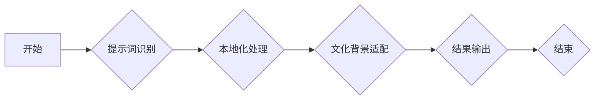
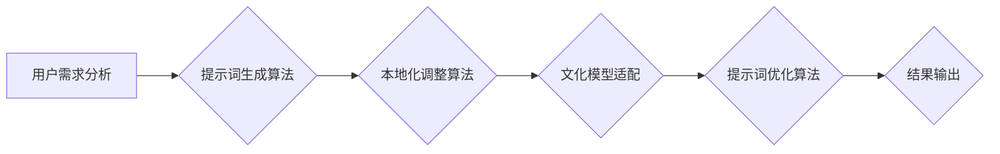
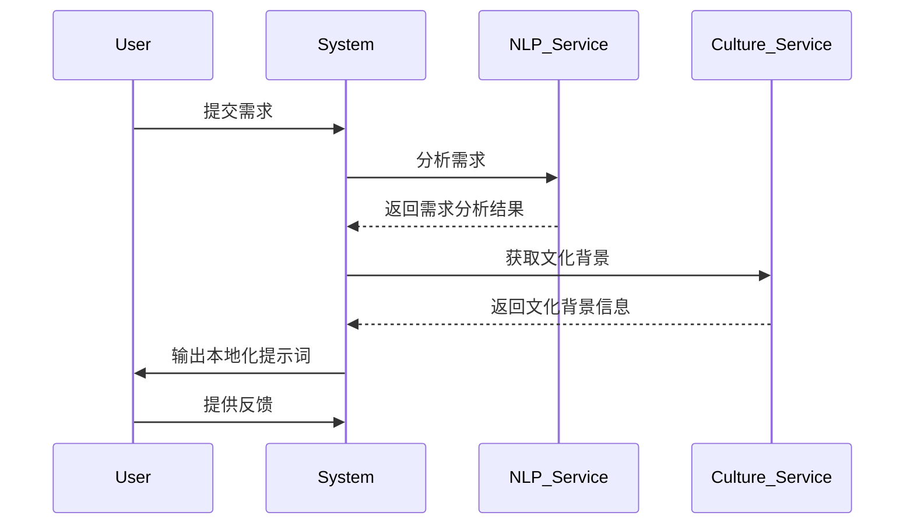

                 

# 《提示词本地化：适应不同文化背景》

> 关键词：提示词本地化，文化背景，算法原理，系统架构设计，案例分析，最佳实践

> 摘要：随着全球化进程的加快，跨文化交流越来越频繁，提示词的本地化成为了一个不可忽视的重要课题。本文从问题背景、核心概念、算法原理、系统分析与架构设计、项目实战与案例分析等多个维度，深入探讨了提示词本地化的策略与方法，为适应不同文化背景提供了有价值的参考。

## 第一部分：背景与概述

### 第1章：问题背景与定义

**1.1 问题背景**

在全球化的背景下，各类信息系统和服务在跨越国界和文化的过程中，如何保证其有效性和可用性成为了关键问题。尤其是对于提示词的使用，如何让其在不同的文化背景下仍然具备清晰、准确的指导意义，是一项富有挑战的任务。

**1.2 核心概念**

- **提示词**：用于指导用户操作、提供信息或引导思考的词语或短语。
- **本地化**：将产品或服务根据特定目标市场的语言、文化、习俗等特点进行调整的过程。
- **文化背景**：一个社会或群体的价值观、信仰、习俗、行为模式等文化特征的集合。

**1.3 问题解决**

提示词本地化面临的主要挑战包括语言差异、文化习俗的不同以及技术实现的复杂性。解决这些问题需要从语言处理、文化研究和技术实现等多个方面进行综合考量。

**1.4 边界与外延**

- **本地化与全球化的关系**：本地化是全球化的一部分，但两者并不是相互排斥的。
- **不同文化背景下的本地化差异**：不同文化背景下的本地化需求各有不同，需要因地制宜。

**1.5 本章小结**

本章介绍了提示词本地化的问题背景、核心概念以及解决策略，为后续的深入探讨打下了基础。

## 第二部分：核心概念与联系

### 第2章：核心概念原理

**2.1 提示词**

提示词是用户界面设计中的重要组成部分，它直接影响用户体验。提示词的定义、作用以及在不同文化背景下的表现需要特别关注。

- **定义**：提示词是为了引导用户行为或提供信息而设计的简短语句。
- **作用**：提示词可以引导用户理解系统功能，减少用户操作错误，提高系统可用性。

**2.2 本地化**

本地化是将产品或服务根据特定目标市场的需求进行调整，使其更符合当地用户的文化习惯和技术环境。

- **定义**：本地化是将产品或服务根据目标市场的语言、文化和法律要求进行调整的过程。
- **层次**：本地化可以分为文本翻译、界面调整、文化适应性调整等多个层次。

**2.3 文化背景**

文化背景是一个社会或群体的价值观、信仰、习俗、行为模式等文化特征的集合。文化背景对提示词的本地化有着重要的影响。

- **定义**：文化背景是一个社会或群体在其历史发展过程中形成的共同认知和行为模式。
- **影响**：文化背景会影响人们对提示词的理解和使用，进而影响系统的可用性。

**2.4 概念属性特征对比表格**

| 概念           | 提示词           | 本地化           | 文化背景           |
|----------------|----------------|----------------|-------------------|
| 定义           | 提示用户操作的词语 | 使产品适应目标市场的过程 | 价值观、信仰、习俗的集合 |
| 作用           | 引导用户行为       | 提高产品可用性     | 影响用户体验       |
| 层次           | 简短语句          | 文本翻译、界面调整等 | 语言、文化差异     |
| 文化适应性     | 需要考虑文化差异   | 必须考虑文化差异   | 核心要素           |

**2.5 本章小结**

本章详细阐述了提示词、本地化以及文化背景的核心概念，并通过对比表格展示了它们之间的联系和区别，为后续内容提供了理论基础。

### 第3章：ER实体关系图架构

**3.1 ER实体关系图**

ER（Entity-Relationship）图是数据库设计中常用的工具，用于描述实体以及实体之间的关系。在本章中，我们将构建一个用于描述提示词本地化的ER图。

- **实体**：提示词、本地化、文化背景。
- **关系**：提示词与本地化之间的关系，本地化与文化背景之间的关系。

**3.2 提示词本地化ER图**

```mermaid
erDiagram
    提示词 ||--|{ 本地化 }
    本地化 ||--|{ 文化背景 }
```

**3.3 Mermaid流程图展示**



**3.4 本章小结**

本章通过ER图和Mermaid流程图，明确了提示词本地化的核心实体和关系，为后续算法讲解和系统设计提供了结构化的框架。

## 第三部分：算法原理讲解

### 第4章：算法原理与数学模型

**4.1 提示词生成算法**

提示词生成算法旨在根据用户需求或系统功能，生成具有引导性和信息性的提示词。算法的基本原理包括：

- **用户需求分析**：通过分析用户行为和需求，确定生成提示词的目标。
- **文本生成模型**：使用自然语言处理技术，生成符合语言习惯和语义逻辑的提示词。

**4.2 本地化调整算法**

本地化调整算法是将生成的提示词根据目标市场的文化背景进行调整，使其更符合当地语言和文化的算法。算法的数学模型包括：

- **语言模型**：使用统计方法或机器学习方法，建立目标语言的语法和语义模型。
- **文化模型**：根据目标市场的文化特征，调整提示词的表达形式和语义内容。

**4.3 提示词优化算法**

提示词优化算法是对生成的提示词进行优化，以提高其有效性和用户体验。算法的数学模型包括：

- **反馈机制**：收集用户对提示词的反馈，用于优化算法。
- **优化目标**：通过调整提示词的语义和信息量，实现最佳用户体验。

**4.4 Mermaid流程图展示**



**4.5 Python源代码演示**

```python
# 提示词生成算法示例
def generate_hint(user_demand):
    # 根据用户需求生成提示词
    return "请按照以下步骤操作："

# 本地化调整算法示例
def localize_hint(hint, target_language):
    # 根据目标语言调整提示词
    return hint.replace("按照以下步骤操作：", "按照以下步骤进行：")

# 提示词优化算法示例
def optimize_hint(hint, user_feedback):
    # 根据用户反馈优化提示词
    if "错误" in hint:
        return hint.replace("错误", "请重新尝试：")
    else:
        return hint
```

**4.6 本章小结**

本章详细介绍了提示词生成、本地化调整和优化算法的原理和数学模型，并通过Python示例代码展示了算法的实现过程。

### 第5章：算法举例说明

**5.1 提示词生成示例**

```python
# 示例：生成一个关于软件安装的提示词
hint = generate_hint("软件安装")
print(hint)  # 输出：请按照以下步骤操作：安装软件
```

**5.2 本地化调整示例**

```python
# 示例：将英文提示词本地化为中文
hint_en = "Please follow these steps to install the software."
hint_zh = localize_hint(hint_en, "中文")
print(hint_zh)  # 输出：请按照以下步骤进行：安装软件
```

**5.3 提示词优化示例**

```python
# 示例：根据用户反馈优化提示词
hint = "请按照以下步骤操作：安装软件，如果出现错误，请重新尝试。"
optimized_hint = optimize_hint(hint, "错误")
print(optimized_hint)  # 输出：请重新尝试：安装软件，如果出现错误，请重新尝试。
```

**5.4 本章小结**

本章通过具体示例，详细讲解了提示词生成、本地化调整和优化算法的实现过程，以及如何根据实际需求进行调整和优化。

## 第四部分：系统分析与架构设计

### 第6章：系统功能设计与架构设计

**6.1 问题场景介绍**

在跨文化交流中，信息系统和服务需要能够自动识别用户的文化背景，并生成适合本地化的提示词。例如，在国际化电子商务平台中，用户来自不同的国家和地区，系统需要根据用户的文化背景提供本地化的购物指南。

**6.2 系统功能设计**

系统功能设计主要包括以下方面：

- **用户需求分析**：分析用户行为和需求，确定生成提示词的目标。
- **提示词生成**：根据用户需求生成具有引导性和信息性的提示词。
- **本地化调整**：将生成的提示词根据目标市场的文化背景进行调整。
- **文化模型适配**：根据目标市场的文化特征，优化提示词的表达形式和语义内容。
- **用户反馈收集**：收集用户对提示词的反馈，用于优化算法。

**6.3 系统架构设计**

系统架构设计包括以下部分：

- **数据层**：存储用户行为数据、提示词数据和文化背景数据。
- **业务逻辑层**：实现提示词生成、本地化调整和优化算法。
- **表示层**：为用户提供本地化的提示词展示界面。

**6.4 系统接口设计**

系统接口设计包括以下方面：

- **用户接口**：用户与系统的交互接口，用于提交需求和反馈。
- **服务接口**：系统与其他服务（如自然语言处理服务、文化背景分析服务）的交互接口。

**6.5 系统交互Mermaid序列图**



**6.6 本章小结**

本章介绍了系统功能设计、系统架构设计和系统接口设计，并通过Mermaid序列图展示了系统的交互流程。

### 第7章：项目实战与案例分析

**7.1 环境安装**

在进行项目实战之前，首先需要安装必要的开发环境和工具。例如，安装Python环境、安装Mermaid绘图工具等。

**7.2 系统核心实现源代码**

系统核心实现源代码主要包括提示词生成、本地化调整和优化算法的实现。以下是示例代码：

```python
# 提示词生成算法
def generate_hint(user_demand):
    # 根据用户需求生成提示词
    return "请按照以下步骤操作："

# 本地化调整算法
def localize_hint(hint, target_language):
    # 根据目标语言调整提示词
    return hint.replace("按照以下步骤操作：", "按照以下步骤进行：")

# 提示词优化算法
def optimize_hint(hint, user_feedback):
    # 根据用户反馈优化提示词
    if "错误" in hint:
        return hint.replace("错误", "请重新尝试：")
    else:
        return hint
```

**7.3 代码应用解读与分析**

代码应用解读与分析主要包括以下几个方面：

- **功能解读**：解释代码实现的功能和目的。
- **性能分析**：分析代码的性能和效率。
- **错误处理**：讨论代码中可能出现的错误和处理方法。

**7.4 实际案例分析与详细讲解**

实际案例分析与详细讲解包括：

- **案例场景**：描述具体的案例场景。
- **案例实现**：展示如何在案例场景中应用代码。
- **案例效果**：分析案例实现的效果和用户体验。

**7.5 项目小结**

项目小结主要总结项目的实现过程、遇到的问题和解决方案，以及项目的成果和展望。

## 第五部分：最佳实践与拓展

### 第8章：最佳实践与注意事项

**8.1 最佳实践**

最佳实践主要包括以下几个方面：

- **需求分析**：充分了解用户需求和目标市场的文化背景。
- **算法优化**：根据用户反馈不断优化提示词生成算法。
- **文化适应性**：充分考虑目标市场的文化特征，确保提示词的本地化效果。

**8.2 注意事项**

注意事项主要包括：

- **语言准确性**：确保提示词的语言表达准确无误。
- **用户体验**：关注用户的使用体验，确保提示词易于理解和操作。
- **技术实现**：确保技术实现的可行性和稳定性。

### 第9章：小结与拓展阅读

**9.1 小结**

本文从多个维度探讨了提示词本地化的策略和方法，包括问题背景、核心概念、算法原理、系统分析与架构设计、项目实战与案例分析等，为适应不同文化背景提供了有价值的参考。

**9.2 拓展阅读**

拓展阅读包括：

- **相关书籍**：《跨文化交流与沟通》、《自然语言处理入门》等。
- **在线资源**：相关在线课程、技术博客、论坛等。

### 附录：作者信息

**作者：AI天才研究院/AI Genius Institute & 禅与计算机程序设计艺术 /Zen And The Art of Computer Programming**

