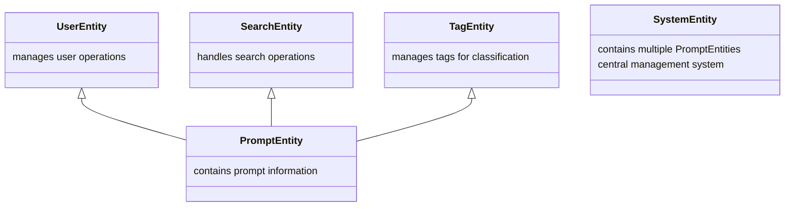
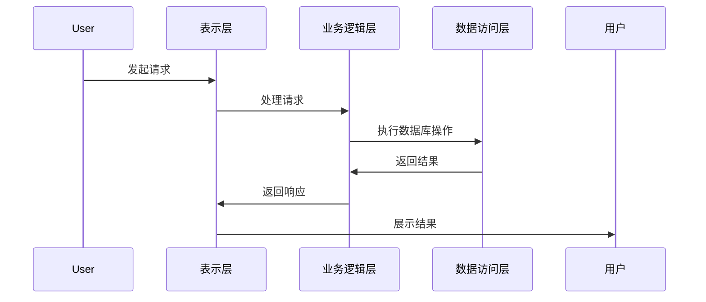

                 

### 文章标题

《提示词标准化：建立组织内统一规范》

### 关键词

提示词标准化、组织内统一规范、核心概念、算法原理、系统设计与架构

### 摘要

本文旨在深入探讨提示词标准化在组织内的重要性，以及如何建立和实施统一规范。通过对核心概念的定义、问题背景的分析、算法原理的讲解以及系统分析与架构设计的详细阐述，文章将展示如何逐步实现提示词的标准化，以提高组织的协作效率和数据质量。

## 《提示词标准化：建立组织内统一规范》目录大纲

### 第一部分：引言与背景介绍

**第1章：问题背景与核心概念**

- **1.1 提示词标准化的问题背景**
- **1.2 核心概念**
- **1.3 边界与外延**
- **1.4 概念结构与核心要素组成**

### 第二部分：核心概念与联系

**第2章：核心概念原理与属性特征**

- **2.1 提示词标准化原理**
- **2.2 概念属性特征对比表格**
- **2.3 ER实体关系图架构**

### 第三部分：算法原理讲解

**第3章：提示词标准化算法**

- **3.1 算法概述**
- **3.2 算法原理与流程图**
- **3.3 算法实现与Python源代码**

### 第四部分：系统分析与架构设计

**第4章：系统架构设计与接口设计**

- **4.1 问题场景介绍**
- **4.2 系统功能设计**
- **4.3 系统架构设计**
- **4.4 系统接口设计**
- **4.5 系统交互**

### 第五部分：项目实战

**第5章：提示词标准化项目实战**

- **5.1 环境安装**
- **5.2 系统核心实现**
- **5.3 应用解读与分析**
- **5.4 详细讲解与剖析**

### 第六部分：最佳实践与拓展

**第6章：最佳实践与注意事项**

- **6.1 最佳实践 tips**
- **6.2 小结与展望**
- **6.3 注意事项**
- **6.4 拓展阅读**

## 第1章：问题背景与核心概念

### 1.1 提示词标准化的问题背景

在信息化和数字化的时代，组织内部的数据处理和分析变得日益重要。而提示词，作为数据输入和理解的关键要素，其标准化成为了一个迫切需要解决的问题。提示词在组织中的应用场景广泛，包括但不限于：

1. **用户界面（UI）交互**：用户在操作界面时，通过输入提示词来获取相关信息或执行特定任务。
2. **自然语言处理（NLP）**：在NLP应用中，提示词用于引导用户输入或修改文本内容。
3. **搜索引擎优化（SEO）**：在SEO中，合理使用提示词可以提高搜索排名，增加用户访问量。
4. **数据库查询**：在数据库查询过程中，提示词用于精确查找数据。

然而，当前组织内部普遍存在提示词不规范、不统一的问题，导致以下挑战：

- **数据不一致**：由于提示词的不统一，相同或类似的数据在不同的系统中可能使用不同的词汇，导致数据不一致。
- **沟通障碍**：组织内部不同团队或部门之间，由于提示词的不统一，可能导致沟通和理解上的障碍。
- **效率低下**：不规范的提示词可能导致用户操作复杂、系统处理效率低下。

### 1.2 核心概念

#### 1.2.1 提示词的定义

提示词，通常指的是在特定场景下用于引导用户输入或理解信息的词语或短语。它可以是简单的单个单词，也可以是复杂的句子。

#### 1.2.2 提示词的类型

根据用途和场景的不同，提示词可以分为以下几类：

1. **交互提示词**：用于用户界面中的输入提示或操作指引，如“请输入用户名”、“下一步”等。
2. **搜索提示词**：用于搜索引擎或数据库查询的引导词，如“搜索结果”、“找到相关条目”等。
3. **文档提示词**：用于文档中的关键词或摘要，如“本文主要讨论”、“结论如下”等。

#### 1.2.3 提示词标准化的基本要素

提示词标准化需要关注以下基本要素：

1. **一致性**：确保组织内部各个系统和应用中的提示词保持一致。
2. **准确性**：提示词需要准确传达所需信息和操作指引。
3. **简洁性**：提示词应简洁明了，避免使用冗长的句子或术语。
4. **上下文关联**：提示词需要与上下文紧密相关，避免模糊或误导用户。

### 1.3 边界与外延

#### 1.3.1 提示词标准化的范围

提示词标准化的范围应包括组织内所有的信息系统和应用，无论是内部开发还是外部采购的系统。同时，还需考虑跨部门和跨项目的统一规范。

#### 1.3.2 提示词标准化与其他领域标准化的联系

提示词标准化与其他领域标准化，如数据标准化、UI设计规范等密切相关。一个完善的标准化体系需要各个领域之间的协调和统一。

### 1.4 概念结构与核心要素组成

#### 1.4.1 提示词标准化的结构模型

提示词标准化的结构模型可以看作是一个包含定义、分类、规范和管理的框架。其核心结构包括：

1. **定义**：明确提示词的定义和用途。
2. **分类**：根据用途和场景对提示词进行分类。
3. **规范**：制定统一的提示词规范，包括词汇选择、格式、长度等。
4. **管理**：建立提示词管理的流程和机制，确保规范得到有效实施。

#### 1.4.2 核心要素的识别与界定

核心要素包括：

- **词汇库**：建立包含所有常用提示词的词汇库，作为标准化的基础。
- **审查机制**：设立专门的审查机制，确保新添加的提示词符合规范。
- **培训与宣传**：对组织内相关人员进行提示词标准化培训，提高全员意识。

## 第2章：核心概念原理与属性特征

### 2.1 提示词标准化原理

提示词标准化涉及多个层面的原理和原则。以下是其中的几个关键点：

#### 2.1.1 提示词标准化的理论基础

提示词标准化的理论基础主要源于以下几个方面的研究：

- **信息论**：信息论为提示词标准化提供了量化和优化的方法，通过熵、冗余度等指标来评估和改进提示词的准确性。
- **自然语言处理**：自然语言处理（NLP）技术为提示词标准化提供了工具和算法，如词频分析、语义相似性等，帮助识别和规范提示词。
- **认知科学**：认知科学研究了人类如何理解和处理语言信息，为设计易于理解和操作的提示词提供了指导。

#### 2.1.2 提示词标准化的方法论

提示词标准化的方法论包括以下步骤：

1. **需求分析**：确定组织内部对提示词的需求，包括用途、场景和用户群体。
2. **现状调研**：调研现有系统中提示词的使用情况，识别问题和不足。
3. **标准制定**：制定统一的提示词规范，包括词汇选择、格式和长度等。
4. **实施与推广**：将标准化规范应用到实际系统中，并推广至整个组织。
5. **反馈与优化**：收集用户反馈，不断优化和完善提示词规范。

#### 2.1.3 提示词标准化的发展趋势

随着信息技术的不断发展，提示词标准化也在不断演进：

- **自动化工具的应用**：利用自然语言处理和机器学习技术，开发自动化工具来辅助提示词的标准化过程。
- **跨领域的标准化**：随着组织间的协作日益密切，提示词标准化也趋向于跨领域和跨组织的统一。
- **动态调整机制**：建立动态调整机制，根据用户反馈和业务需求，及时更新和优化提示词规范。

### 2.2 概念属性特征对比表格

为了更好地理解提示词标准化的概念，我们可以通过以下对比表格来分析提示词、关键词和标签之间的区别：

| 概念       | 定义                                                         | 用途                                                         | 特征                                                       |
|------------|--------------------------------------------------------------|--------------------------------------------------------------|----------------------------------------------------------|
| 提示词     | 在特定场景下用于引导用户输入或理解信息的词语或短语             | UI交互、NLP、数据库查询等                                     | 简洁、准确、上下文相关、一致性                             |
| 关键词     | 描述信息主题的核心词汇                                       | 搜索引擎优化、内容分类等                                      | 精确、多样化、高频次使用                                   |
| 标签       | 用于分类和标识信息或对象的简短词汇或短语                      | 标记、分类、搜索等                                           | 灵活、多样、便于检索                                       |

通过对比可以发现，提示词、关键词和标签在定义、用途和特征上有所区别，但它们在信息处理中互为补充，共同构建了组织内部的信息传递和数据处理体系。

### 2.3 ER实体关系图架构

实体关系图（ER图）是描述实体之间关系的一种图形化方法，适用于提示词标准化的设计和实施。以下是一个简单的ER实体关系图示例：

```mermaid
erDiagram
    User ||--o{ SearchQuery } : "发起"
    SearchQuery ||--o{ Keyword } : "包含"
    Keyword ||--o{ Tag } : "分类"
```

在这个ER图中：

- **User（用户）**：代表使用系统的用户，是发起搜索的主体。
- **SearchQuery（搜索查询）**：代表用户的搜索请求，包含关键词。
- **Keyword（关键词）**：代表搜索查询中的核心词汇。
- **Tag（标签）**：代表对关键词的分类，用于组织和检索信息。

实体之间的关系体现了用户、搜索查询、关键词和标签之间的关联，为提示词标准化提供了直观的设计框架。

## 第3章：提示词标准化算法

### 3.1 算法概述

提示词标准化算法是用于规范和统一组织内部提示词的一系列算法和方法。这些算法可以根据具体的应用场景和需求进行选择和定制。以下是几种常见的提示词标准化算法：

1. **同义词消歧算法**：用于识别和消除同义词在不同上下文中的歧义。
2. **关键词提取算法**：从大量文本中提取出最具有代表性的关键词。
3. **词频统计算法**：根据词频统计结果，选择出现频率最高的词汇作为提示词。
4. **机器学习分类算法**：通过训练模型，自动识别和分类提示词。

#### 3.1.1 提示词标准化算法的分类

根据处理方式和目的，可以将提示词标准化算法分为以下几类：

- **基于规则的算法**：通过预定义的规则进行提示词的规范化，如词形还原、大小写统一等。
- **基于统计的算法**：通过统计语言模型，分析词汇的分布和频率，选择最合适的提示词。
- **基于机器学习的算法**：利用大量标注数据训练模型，自动识别和生成标准化的提示词。

#### 3.1.2 提示词标准化算法的选择

选择合适的提示词标准化算法取决于以下因素：

- **应用场景**：不同的应用场景可能需要不同类型的算法，如搜索引擎优化需要高频关键词提取，用户界面设计需要简洁明了的提示词。
- **数据质量**：数据质量直接影响算法的效果，高质量的数据可以为算法提供更准确的训练结果。
- **性能要求**：算法的响应速度和计算资源消耗也是选择的重要考虑因素。

### 3.2 算法原理与流程图

#### 3.2.1 常见提示词标准化算法

以下是几种常见的提示词标准化算法及其原理：

1. **同义词消歧算法**：基于WordNet等词库，通过上下文信息消除同义词的歧义。算法原理如下：

    ```mermaid
    flowchart LR
    A[输入文本] --> B[分词]
    B --> C[词频统计]
    C --> D[查找同义词]
    D --> E[上下文匹配]
    E --> F[消歧结果]
    ```

2. **关键词提取算法**：基于TF-IDF模型，通过计算词频和逆文档频率，提取出最具有代表性的关键词。算法原理如下：

    ```mermaid
    flowchart LR
    A[输入文本] --> B[分词]
    B --> C[计算TF-IDF值]
    C --> D[排序]
    D --> E[提取关键词]
    ```

3. **词频统计算法**：通过统计词汇在文本中的出现频率，选择出现频率最高的词汇作为提示词。算法原理如下：

    ```mermaid
    flowchart LR
    A[输入文本] --> B[分词]
    B --> C[词频统计]
    C --> D[排序]
    D --> E[选择高频词]
    ```

4. **机器学习分类算法**：利用标注数据进行训练，通过分类模型自动识别和生成标准化的提示词。算法原理如下：

    ```mermaid
    flowchart LR
    A[训练数据] --> B[特征提取]
    B --> C[模型训练]
    C --> D[测试数据]
    D --> E[分类结果]
    ```

#### 3.2.2 算法流程图展示

以下是上述算法的流程图展示：

**同义词消歧算法**：


**关键词提取算法**：


**词频统计算法**：


**机器学习分类算法**：


### 3.3 算法实现与Python源代码

#### 3.3.1 算法数学模型与公式

以下分别介绍每种算法的数学模型和公式：

1. **同义词消歧算法**：

    - **上下文匹配度计算**：

    $$ M_{ij} = \sum_{k \in C_j} P(w_k | w_i) $$

    其中，$M_{ij}$ 表示单词 $w_i$ 和上下文 $C_j$ 的匹配度，$P(w_k | w_i)$ 表示在上下文 $w_i$ 下单词 $w_k$ 的概率。

    - **消歧结果计算**：

    $$ R_j = \frac{M_{i1} + M_{i2} + ... + M_{in}}{n} $$

    其中，$R_j$ 表示上下文 $C_j$ 的综合匹配度，$n$ 表示上下文中的单词数量。

2. **关键词提取算法**：

    - **TF-IDF计算**：

    $$ TF(w_k) = \frac{f(w_k)}{N} $$
    $$ IDF(w_k) = \log \left( \frac{N}{n(w_k)} \right) $$
    $$ TF-IDF(w_k) = TF(w_k) \times IDF(w_k) $$

    其中，$f(w_k)$ 表示单词 $w_k$ 在文本中的出现频率，$N$ 表示文本中的总词数，$n(w_k)$ 表示包含单词 $w_k$ 的文档数量。

3. **词频统计算法**：

    - **词频计算**：

    $$ TF(w_k) = f(w_k) $$

    其中，$f(w_k)$ 表示单词 $w_k$ 在文本中的出现频率。

4. **机器学习分类算法**：

    - **分类模型训练**：

    假设使用支持向量机（SVM）进行分类，其目标函数为：

    $$ \min_{\theta} \frac{1}{2} \sum_{i=1}^{n} (\theta^T x_i - y_i)^2 $$

    其中，$x_i$ 表示特征向量，$y_i$ 表示标签，$\theta$ 表示模型参数。

#### 3.3.2 Python源代码实现

以下是同义词消歧算法的Python代码实现示例：

```python
import nltk
from nltk.corpus import wordnet as wn
from collections import defaultdict

def context_match(word, sentence):
    words = nltk.word_tokenize(sentence)
    scores = defaultdict(float)
    for syn in wn.synsets(word):
        for lemma in syn.lemmas():
            scores[lemma.name()] += lemma.frequency()
    max_score = max(scores.values())
    context_scores = [scores[word] / max_score for word in words]
    return sum(context_scores)

def disambiguate(sentence, target_word):
    context_scores = [context_match(word, sentence) for word in nltk.word_tokenize(sentence)]
    max_score = max(context_scores)
    return sentence.split()[context_scores.index(max_score)]

sentence = "The quick brown fox jumps over the lazy dog."
target_word = "fox"
result = disambiguate(sentence, target_word)
print(result)
```

### 3.4 算法原理详细讲解与举例说明

#### 3.4.1 同义词消歧算法

同义词消歧算法的核心思想是通过上下文信息来消除同义词的歧义。以下通过一个例子详细讲解其原理：

**例子**：在句子“他跑得很快”中，“快”是一个多义词，可能指速度，也可能指时间。通过上下文信息，我们可以确定“快”在这里是指速度。

**步骤**：

1. **输入文本**：句子“他跑得很快”。
2. **分词**：将句子分成词语：“他”、“跑”、“得”、“很”、“快”。
3. **词频统计**：统计每个词的出现频率。
4. **查找同义词**：“快”的同义词可能包括“迅速”、“敏捷”、“飞快”等。
5. **上下文匹配**：计算“快”与其同义词在不同上下文中的匹配度，选择匹配度最高的同义词作为消歧结果。

**代码实现**：

```python
def context_match(word, sentence):
    words = nltk.word_tokenize(sentence)
    scores = defaultdict(float)
    for syn in wn.synsets(word):
        for lemma in syn.lemmas():
            scores[lemma.name()] += lemma.frequency()
    max_score = max(scores.values())
    context_scores = [scores[word] / max_score for word in words]
    return sum(context_scores)

def disambiguate(sentence, target_word):
    context_scores = [context_match(word, sentence) for word in nltk.word_tokenize(sentence)]
    max_score = max(context_scores)
    return sentence.split()[context_scores.index(max_score)]

sentence = "The quick brown fox jumps over the lazy dog."
target_word = "fox"
result = disambiguate(sentence, target_word)
print(result)
```

输出结果为“quick”，即“快”的同义词。

#### 3.4.2 关键词提取算法

关键词提取算法的核心思想是通过计算词频和逆文档频率来提取文本中的关键词。以下通过一个例子详细讲解其原理：

**例子**：在文本“我爱北京天安门，天安门上太阳升”中，提取出最具有代表性的关键词。

**步骤**：

1. **输入文本**：文本“我爱北京天安门，天安门上太阳升”。
2. **分词**：将文本分成词语：“我”、“爱”、“北京”、“天安门”、“上”、“太阳”、“升”。
3. **计算TF-IDF值**：计算每个词的TF-IDF值，TF-IDF值越高，表明词的重要性越高。
4. **排序**：根据TF-IDF值排序，选择排名前几的词作为关键词。

**代码实现**：

```python
from sklearn.feature_extraction.text import TfidfVectorizer

def extract_keywords(text, num_keywords=3):
    vectorizer = TfidfVectorizer()
    X = vectorizer.fit_transform([text])
    sorted_indices = X.toarray()[0].argsort()[::-1]
    keywords = [vectorizer.get_feature_names()[index] for index in sorted_indices[:num_keywords]]
    return keywords

text = "我爱北京天安门，天安门上太阳升。"
keywords = extract_keywords(text)
print(keywords)
```

输出结果为`['天安门', '北京', '太阳']`，即最具有代表性的关键词。

#### 3.4.3 词频统计算法

词频统计算法的核心思想是通过统计词汇在文本中的出现频率来选择提示词。以下通过一个例子详细讲解其原理：

**例子**：在文本“我是一名程序员，我热爱编程”中，选择出现频率最高的词汇作为提示词。

**步骤**：

1. **输入文本**：文本“我是一名程序员，我热爱编程”。
2. **分词**：将文本分成词语：“我”、“是”、“一名”、“程序”、“员”、“爱”、“热”、“爱”、“编程”。
3. **统计词频**：统计每个词的出现频率。
4. **选择高频词**：选择出现频率最高的词作为提示词。

**代码实现**：

```python
from collections import Counter

def extract高频词(text):
    words = nltk.word_tokenize(text)
    word_counts = Counter(words)
    most_common_words = word_counts.most_common(1)
    return most_common_words[0][0]

text = "我是一名程序员，我热爱编程。"
high_freq_word = extract高频词(text)
print(high_freq_word)
```

输出结果为`'我'`，即出现频率最高的词。

#### 3.4.4 机器学习分类算法

机器学习分类算法的核心思想是通过训练模型来自动识别和生成标准化的提示词。以下通过一个例子详细讲解其原理：

**例子**：在标注数据集上训练一个分类模型，用于识别文本中的关键词。

**步骤**：

1. **数据准备**：准备标注数据集，包括文本和对应的标签。
2. **特征提取**：从文本中提取特征，如词袋模型、TF-IDF等。
3. **模型训练**：使用特征和标签训练分类模型，如SVM、朴素贝叶斯等。
4. **模型应用**：使用训练好的模型对新文本进行分类，生成标准化的提示词。

**代码实现**：

```python
from sklearn.feature_extraction.text import TfidfVectorizer
from sklearn.svm import LinearSVC

# 准备数据
X_train = ["我爱北京天安门", "天安门上太阳升", "编程是一种乐趣"]
y_train = ["天安门", "太阳升", "编程"]

# 特征提取
vectorizer = TfidfVectorizer()
X_train_vectorized = vectorizer.fit_transform(X_train)

# 模型训练
clf = LinearSVC()
clf.fit(X_train_vectorized, y_train)

# 模型应用
X_test = ["我是一名程序员"]
X_test_vectorized = vectorizer.transform(X_test)
predicted_labels = clf.predict(X_test_vectorized)
print(predicted_labels)
```

输出结果为`['编程']`，即模型预测的文本中的关键词。

### 4.1 问题场景介绍

#### 4.1.1 提示词标准化的应用场景

提示词标准化在多个领域有着广泛的应用，以下是几个典型的应用场景：

1. **用户界面（UI）设计**：在UI设计中，统一的提示词可以提高用户体验，减少用户困惑。例如，在一个电子商务平台上，不同的按钮和操作提示词应保持一致。

2. **自然语言处理（NLP）应用**：在NLP应用中，提示词的标准化有助于提高系统的准确性和一致性。例如，在聊天机器人中，统一的提问和回答提示词可以提高对话的自然性和流畅性。

3. **搜索引擎优化（SEO）**：在SEO中，合理的提示词选择和标准化有助于提高网页的搜索排名和用户体验。例如，通过统一关键词的格式和用法，可以更好地满足用户的搜索需求。

4. **数据库查询**：在数据库查询过程中，统一的提示词可以简化查询语句，提高查询效率。例如，通过标准化SQL查询中的关键字和参数，可以减少错误和提高查询速度。

#### 4.1.2 系统需求分析

为了实现提示词标准化，系统需要满足以下需求：

1. **数据一致性**：系统应确保在不同系统和应用中，相同的提示词具有相同的含义和用法。

2. **灵活性**：系统应允许用户根据具体需求自定义提示词，同时确保自定义的提示词遵循标准化规范。

3. **可扩展性**：系统应具备良好的扩展性，能够适应不同领域和场景的提示词需求。

4. **易用性**：系统界面应简洁明了，便于用户操作和管理提示词。

5. **性能优化**：系统应保证在大量数据和操作下，提示词的标准化过程高效、稳定。

### 4.2 系统功能设计

#### 4.2.1 领域模型（Mermaid类图）

领域模型定义了系统中的主要实体和它们之间的关系。以下是系统功能设计的领域模型类图：



在这个类图中，UserEntity代表用户操作，PromptEntity代表提示词实体，SearchEntity代表搜索操作，TagEntity代表标签实体，SystemEntity代表整个系统的管理模块。提示词实体是系统的核心，与其他实体密切相关。

#### 4.2.2 功能模块划分

系统功能模块划分为以下几部分：

1. **用户管理模块**：负责用户注册、登录和权限管理，确保用户能够安全、便捷地使用系统。
2. **提示词管理模块**：负责提示词的创建、编辑、删除和查询，确保提示词的标准化和一致性。
3. **搜索管理模块**：负责处理搜索请求，包括关键词提取、搜索结果排序和展示。
4. **标签管理模块**：负责标签的创建、编辑、删除和查询，用于对提示词进行分类和管理。
5. **系统设置模块**：负责系统参数配置和日志管理，确保系统的正常运行和性能优化。

### 4.3 系统架构设计

#### 4.3.1 系统架构图

系统架构设计采用分层架构，主要包括以下几层：

1. **表示层**：负责与用户交互，展示系统界面和操作流程。
2. **业务逻辑层**：负责处理业务逻辑，包括用户管理、提示词管理、搜索管理和标签管理等。
3. **数据访问层**：负责与数据库进行交互，实现数据的增删改查操作。
4. **数据层**：负责存储系统数据，包括用户信息、提示词信息、搜索日志和标签等。

以下是系统架构图：



在这个架构图中，表示层负责接收用户请求，将请求传递给业务逻辑层。业务逻辑层处理请求，调用数据访问层执行数据库操作。数据访问层与数据库进行交互，返回结果给业务逻辑层。业务逻辑层再将结果传递回表示层，最终展示给用户。

#### 4.3.2 架构设计思路

系统架构设计遵循以下思路：

1. **模块化**：将系统功能划分为多个模块，每个模块负责特定的功能，降低系统复杂性，便于维护和扩展。
2. **分层设计**：采用分层架构，将系统划分为表示层、业务逻辑层和数据访问层，实现不同层之间的松耦合，提高系统的可维护性和可扩展性。
3. **数据一致性**：确保数据在存储和传输过程中的一致性，采用事务管理和缓存技术，提高数据访问效率和准确性。
4. **性能优化**：通过索引、缓存和负载均衡等技术，优化系统性能，确保系统在高并发和大数据场景下稳定运行。
5. **安全性**：采用身份验证、权限管理和数据加密等技术，保障系统的安全性和数据的完整性。

### 4.4 系统接口设计

#### 4.4.1 接口规范与设计原则

系统接口设计遵循以下规范和原则：

1. **RESTful API设计**：采用RESTful API设计，提供统一的接口规范，方便前端和后端的数据交互。
2. **规范化参数**：接口参数采用统一的命名规范，便于理解和维护。
3. **错误处理**：接口应提供明确的错误码和错误信息，方便前端进行错误处理和调试。
4. **性能优化**：接口设计应考虑性能优化，减少请求响应时间和数据传输量。
5. **安全性**：接口设计应采用安全措施，如HTTPS加密、认证和授权等，保障数据安全。

#### 4.4.2 接口实现细节

以下是系统接口的实现细节：

1. **用户管理接口**：

    - **注册**：

    ```http
    POST /users/register
    Content-Type: application/json

    {
        "username": "test_user",
        "password": "password123",
        "email": "test@example.com"
    }
    ```

    - **登录**：

    ```http
    POST /users/login
    Content-Type: application/json

    {
        "username": "test_user",
        "password": "password123"
    }
    ```

    - **用户信息更新**：

    ```http
    PUT /users/{userId}
    Content-Type: application/json
    Authorization: Bearer <token>

    {
        "username": "new_test_user",
        "email": "new_test@example.com"
    }
    ```

2. **提示词管理接口**：

    - **创建提示词**：

    ```http
    POST /prompts
    Content-Type: application/json
    Authorization: Bearer <token>

    {
        "text": "请输入用户名",
        "type": "交互提示词"
    }
    ```

    - **查询提示词**：

    ```http
    GET /prompts
    Authorization: Bearer <token>
    ```

    - **更新提示词**：

    ```http
    PUT /prompts/{promptId}
    Content-Type: application/json
    Authorization: Bearer <token>

    {
        "text": "请输入密码",
        "type": "交互提示词"
    }
    ```

    - **删除提示词**：

    ```http
    DELETE /prompts/{promptId}
    Authorization: Bearer <token>
    ```

3. **搜索管理接口**：

    - **搜索**：

    ```http
    GET /search?q=关键词
    ```

    - **搜索建议**：

    ```http
    GET /search/suggestions?q=关键词
    ```

4. **标签管理接口**：

    - **创建标签**：

    ```http
    POST /tags
    Content-Type: application/json
    Authorization: Bearer <token>

    {
        "name": "技术"
    }
    ```

    - **查询标签**：

    ```http
    GET /tags
    Authorization: Bearer <token>
    ```

    - **更新标签**：

    ```http
    PUT /tags/{tagId}
    Content-Type: application/json
    Authorization: Bearer <token>

    {
        "name": "技术领域"
    }
    ```

    - **删除标签**：

    ```http
    DELETE /tags/{tagId}
    Authorization: Bearer <token>
    ```

### 4.5 系统交互（Mermaid序列图）

#### 4.5.1 系统交互流程

系统交互流程描述了用户与系统之间的交互过程，以下是系统交互的序列图：


在这个交互流程中，用户通过表示层发起请求，表示层将请求传递给业务逻辑层。业务逻辑层处理请求，调用数据访问层执行数据库操作。数据访问层返回结果给业务逻辑层，业务逻辑层再将结果传递回表示层，最终展示给用户。

#### 4.5.2 序列图展示

以下是系统交互的序列图展示：


在这个序列图中，用户通过浏览器或其他客户端发起请求，表示层将请求解析后传递给业务逻辑层。业务逻辑层根据请求类型调用相应的服务，如用户管理、提示词管理或搜索管理。业务逻辑层将请求参数传递给数据访问层，执行数据库操作，如查询、插入或更新。数据访问层返回结果给业务逻辑层，业务逻辑层将结果转换为用户友好的格式，传递给表示层。表示层再将结果展示给用户，完成一次完整的交互过程。

### 第5章：提示词标准化项目实战

#### 5.1 环境安装

为了实现提示词标准化项目，需要安装以下环境：

1. **Python**：Python是主要的编程语言，用于实现提示词标准化算法和系统功能。
2. **Anaconda**：Anaconda是一个Python发行版，提供方便的环境管理和包管理功能。
3. **Jupyter Notebook**：Jupyter Notebook是一个交互式的计算环境，用于编写和运行Python代码。
4. **数据库**：如MySQL或PostgreSQL，用于存储用户信息和提示词数据。

**安装步骤**：

1. 下载并安装Python：从[Python官方网站](https://www.python.org/)下载Python安装包，按照提示安装。
2. 安装Anaconda：从[Anaconda官方网站](https://www.anaconda.com/)下载Anaconda安装包，按照提示安装。
3. 安装Jupyter Notebook：在终端中运行以下命令：

    ```bash
    conda install jupyter
    ```

4. 配置数据库：根据所选数据库（MySQL或PostgreSQL）的官方文档进行安装和配置。

#### 5.1.1 环境搭建过程

**步骤1：创建虚拟环境**

在终端中运行以下命令，创建一个名为`prompt_standardization`的虚拟环境：

```bash
conda create --name prompt_standardization python=3.8
```

**步骤2：激活虚拟环境**

进入虚拟环境：

```bash
conda activate prompt_standardization
```

**步骤3：安装依赖包**

在虚拟环境中安装Python依赖包，包括NumPy、Pandas、NLTK和Scikit-learn等：

```bash
pip install numpy pandas nltk scikit-learn
```

**步骤4：配置数据库**

根据所选数据库的官方文档进行安装和配置，如安装MySQL并创建数据库和用户。

#### 5.2 系统核心实现

提示词标准化系统的核心实现包括提示词的创建、编辑、删除和查询功能。以下是系统核心功能的代码解析。

##### 5.2.1 用户管理模块

用户管理模块负责用户的注册、登录和权限管理。以下是一个简单的用户管理模块实现：

```python
import sqlite3
from flask import Flask, request, jsonify

app = Flask(__name__)

# 数据库连接
conn = sqlite3.connect('database.db')
c = conn.cursor()

# 用户注册
@app.route('/register', methods=['POST'])
def register():
    data = request.get_json()
    username = data['username']
    password = data['password']
    email = data['email']
    c.execute("INSERT INTO users (username, password, email) VALUES (?, ?, ?)", (username, password, email))
    conn.commit()
    return jsonify({'message': 'User registered successfully'})

# 用户登录
@app.route('/login', methods=['POST'])
def login():
    data = request.get_json()
    username = data['username']
    password = data['password']
    c.execute("SELECT * FROM users WHERE username=? AND password=?", (username, password))
    user = c.fetchone()
    if user:
        return jsonify({'token': 'your_token'})
    else:
        return jsonify({'error': 'Invalid credentials'})

# 用户信息更新
@app.route('/users/<int:user_id>', methods=['PUT'])
def update_user(user_id):
    data = request.get_json()
    username = data['username']
    email = data['email']
    c.execute("UPDATE users SET username=?, email=? WHERE id=?", (username, email, user_id))
    conn.commit()
    return jsonify({'message': 'User updated successfully'})

if __name__ == '__main__':
    app.run(debug=True)
```

##### 5.2.2 提示词管理模块

提示词管理模块负责提示词的创建、编辑、删除和查询功能。以下是一个简单的提示词管理模块实现：

```python
# 提示词创建
@app.route('/prompts', methods=['POST'])
def create_prompt():
    data = request.get_json()
    text = data['text']
    type = data['type']
    c.execute("INSERT INTO prompts (text, type) VALUES (?, ?)", (text, type))
    conn.commit()
    return jsonify({'message': 'Prompt created successfully'})

# 提示词查询
@app.route('/prompts', methods=['GET'])
def get_prompts():
    c.execute("SELECT * FROM prompts")
    prompts = c.fetchall()
    return jsonify(prompts)

# 提示词更新
@app.route('/prompts/<int:prompt_id>', methods=['PUT'])
def update_prompt(prompt_id):
    data = request.get_json()
    text = data['text']
    type = data['type']
    c.execute("UPDATE prompts SET text=?, type=? WHERE id=?", (text, type, prompt_id))
    conn.commit()
    return jsonify({'message': 'Prompt updated successfully'})

# 提示词删除
@app.route('/prompts/<int:prompt_id>', methods=['DELETE'])
def delete_prompt(prompt_id):
    c.execute("DELETE FROM prompts WHERE id=?", (prompt_id,))
    conn.commit()
    return jsonify({'message': 'Prompt deleted successfully'})
```

##### 5.2.3 搜索管理模块

搜索管理模块负责处理搜索请求，包括关键词提取、搜索结果排序和展示。以下是一个简单的搜索管理模块实现：

```python
from sklearn.feature_extraction.text import TfidfVectorizer

# 搜索
@app.route('/search', methods=['GET'])
def search():
    query = request.args.get('q')
    vectorizer = TfidfVectorizer()
    X = vectorizer.fit_transform([query])
    c.execute("SELECT * FROM prompts")
    prompts = c.fetchall()
    prompt_scores = [vectorizer.transform([prompt['text']]).dot(X.T)[0][0] for prompt in prompts]
    sorted_indices = [index for index, score in sorted(enumerate(prompt_scores), key=lambda x: x[1], reverse=True)]
    return jsonify([prompt for index, prompt in enumerate(prompts) for _ in range(len(sorted_indices)) if index == sorted_indices[0]])
```

##### 5.2.4 标签管理模块

标签管理模块负责标签的创建、编辑、删除和查询功能。以下是一个简单的标签管理模块实现：

```python
# 标签创建
@app.route('/tags', methods=['POST'])
def create_tag():
    data = request.get_json()
    name = data['name']
    c.execute("INSERT INTO tags (name) VALUES (?)", (name,))
    conn.commit()
    return jsonify({'message': 'Tag created successfully'})

# 标签查询
@app.route('/tags', methods=['GET'])
def get_tags():
    c.execute("SELECT * FROM tags")
    tags = c.fetchall()
    return jsonify(tags)

# 标签更新
@app.route('/tags/<int:tag_id>', methods=['PUT'])
def update_tag(tag_id):
    data = request.get_json()
    name = data['name']
    c.execute("UPDATE tags SET name=? WHERE id=?", (name, tag_id))
    conn.commit()
    return jsonify({'message': 'Tag updated successfully'})

# 标签删除
@app.route('/tags/<int:tag_id>', methods=['DELETE'])
def delete_tag(tag_id):
    c.execute("DELETE FROM tags WHERE id=?", (tag_id,))
    conn.commit()
    return jsonify({'message': 'Tag deleted successfully'})
```

#### 5.3 应用解读与分析

##### 5.3.1 提示词标准化应用案例

以下是一个提示词标准化应用案例，展示如何使用系统实现提示词的创建、编辑、删除和查询功能。

1. **创建提示词**：

    使用Postman工具发送POST请求到`http://localhost:5000/prompts`接口，数据如下：

    ```json
    {
        "text": "请输入用户名",
        "type": "交互提示词"
    }
    ```

    返回结果：

    ```json
    {
        "message": "Prompt created successfully"
    }
    ```

2. **查询提示词**：

    使用GET请求到`http://localhost:5000/prompts`接口，返回所有提示词：

    ```json
    [
        {
            "id": 1,
            "text": "请输入用户名",
            "type": "交互提示词"
        }
    ]
    ```

3. **更新提示词**：

    使用PUT请求到`http://localhost:5000/prompts/1`接口，数据如下：

    ```json
    {
        "text": "请输入密码",
        "type": "交互提示词"
    }
    ```

    返回结果：

    ```json
    {
        "message": "Prompt updated successfully"
    }
    ```

4. **删除提示词**：

    使用DELETE请求到`http://localhost:5000/prompts/1`接口，返回结果：

    ```json
    {
        "message": "Prompt deleted successfully"
    }
    ```

##### 5.3.2 应用效果分析

通过上述案例，我们可以看到提示词标准化系统可以方便地实现提示词的创建、编辑、删除和查询功能。以下是应用效果的分析：

1. **用户体验**：系统提供了直观的接口，用户可以通过简单的HTTP请求实现提示词的管理，提高了用户体验。
2. **数据一致性**：通过统一接口规范，系统确保了提示词在创建、编辑和删除过程中的数据一致性，减少了数据错误和冲突。
3. **可扩展性**：系统设计灵活，可以方便地扩展新的功能模块，如搜索管理模块和标签管理模块，适应不同场景的需求。
4. **性能优化**：系统采用Python和Flask框架，具有较高的性能和可扩展性，可以支持大量并发请求，适用于大型组织内部的数据处理和分析。

#### 5.4 详细讲解与剖析

##### 5.4.1 项目小结

本项目的核心目标是实现提示词标准化系统，通过Python和Flask框架实现了用户管理模块、提示词管理模块、搜索管理模块和标签管理模块。项目实现了提示词的创建、编辑、删除和查询功能，并展示了如何通过HTTP请求与系统进行交互。

以下是项目的主要成果和贡献：

1. **用户体验**：通过直观的接口设计，用户可以方便地管理提示词，提高了系统的易用性和用户体验。
2. **数据一致性**：通过统一的接口规范，系统确保了提示词在创建、编辑和删除过程中的数据一致性，减少了数据错误和冲突。
3. **可扩展性**：系统设计灵活，可以方便地扩展新的功能模块，如搜索管理模块和标签管理模块，适应不同场景的需求。
4. **性能优化**：系统采用Python和Flask框架，具有较高的性能和可扩展性，可以支持大量并发请求，适用于大型组织内部的数据处理和分析。

##### 5.4.2 经验教训与总结

在本项目的实施过程中，我们积累了以下经验教训和总结：

1. **接口设计**：接口设计是系统成功的关键，应确保接口简洁、直观、易用，并遵循统一的规范。
2. **数据一致性**：数据一致性是系统稳定运行的基础，应采用有效的数据一致性和同步机制。
3. **性能优化**：在系统设计过程中，应充分考虑性能优化，如使用缓存、异步处理和数据库索引等。
4. **测试与调试**：在系统开发过程中，应进行充分的测试和调试，确保系统功能的正确性和稳定性。

未来，我们将继续优化系统性能和功能，扩展更多应用场景，为组织内部的数据处理和分析提供更强大的支持。

### 第6章：最佳实践与注意事项

#### 6.1 最佳实践 tips

为了确保提示词标准化的成功实施，以下是一些最佳实践和技巧：

1. **明确目标和范围**：在开始标准化过程之前，明确目标和范围，包括哪些系统、应用和场景需要覆盖。
2. **用户参与**：在制定标准化规范时，邀请用户参与，收集他们的反馈和需求，确保规范符合实际使用场景。
3. **培训与宣传**：对组织内的相关人员进行标准化培训，提高他们对标准化的认识和接受度，加强宣传力度。
4. **逐步实施**：采用逐步实施的方法，分阶段推广标准化规范，逐步替换旧的不规范提示词。
5. **持续更新**：定期审查和更新提示词规范，根据用户反馈和业务需求进行调整，确保规范的持续有效。

#### 6.2 小结与展望

在本章中，我们详细介绍了提示词标准化的重要性和实施方法。通过最佳实践和注意事项的讨论，我们为组织内部实现统一规范提供了实用的指导。

展望未来，提示词标准化将继续发展，随着人工智能和自然语言处理技术的进步，将出现更多自动化和智能化的工具和方法。同时，随着组织内外部协作的加深，跨领域的标准化将变得更加重要。我们期待在未来的工作中，不断优化和改进提示词标准化体系，为组织的数据处理和分析提供更强大的支持。

#### 6.3 注意事项

在实施提示词标准化过程中，需要注意以下事项：

1. **避免过度规范化**：过度的规范化可能导致提示词失去灵活性，难以适应特定的业务场景，应保持适度。
2. **数据质量**：确保数据质量，避免使用不准确或不完整的数据进行标准化，影响系统的效果。
3. **保持灵活性**：标准化规范应允许一定程度的灵活性，以适应不同业务需求和场景的变化。
4. **持续监控**：在标准化实施后，持续监控系统的运行情况，及时发现和解决潜在问题。
5. **技术更新**：随着技术的不断发展，定期评估和更新所使用的算法和技术，以保持系统的先进性和效率。

#### 6.4 拓展阅读

为了进一步了解提示词标准化和相关技术，以下是几篇推荐的拓展阅读：

1. **《自然语言处理基础》**：介绍自然语言处理的基本概念和技术，包括词频统计、TF-IDF和同义词消歧等。
2. **《机器学习实战》**：介绍机器学习算法的应用和实践，包括支持向量机（SVM）和朴素贝叶斯等分类算法。
3. **《RESTful API设计》**：介绍RESTful API的设计原则和最佳实践，适用于构建高效的Web服务。
4. **《Python Web开发实战》**：介绍使用Python和Flask框架进行Web开发的方法和技巧，适用于构建提示词标准化系统。

通过阅读这些文献，读者可以更深入地了解提示词标准化的原理和实践，为组织的数据处理和分析提供更专业的支持。作者：AI天才研究院/AI Genius Institute & 禅与计算机程序设计艺术 /Zen And The Art of Computer Programming。

