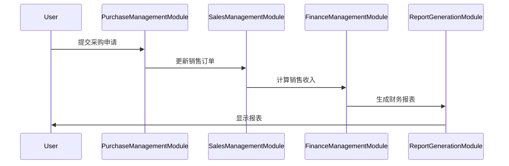
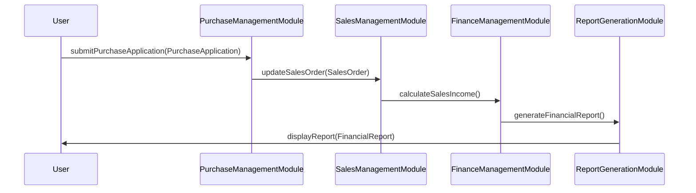
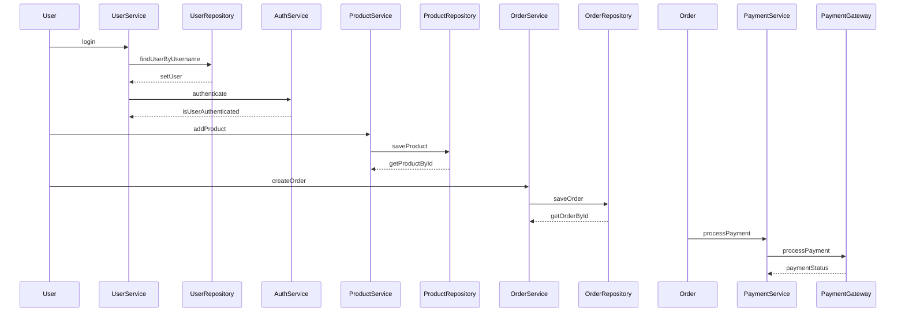
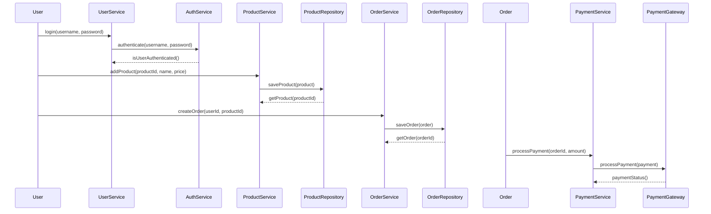

                 

### 提示词模块化：构建可重用的组件

> 关键词：模块化、可重用组件、软件工程、设计原则、接口设计、模块实现、依赖管理、应用场景、实战案例

> 摘要：
本文旨在探讨模块化组件的概念、重要性以及设计与实现方法。通过详细分析模块化组件的背景、核心概念、设计原则、接口设计、模块实现、依赖管理等方面，本文将展示模块化组件在软件工程中的关键作用，并提供实际项目中的应用案例与最佳实践，旨在为开发者提供有价值的指导。

## 目录大纲

### 第一部分：引言

- **1.1 引言**
  - 问题描述
  - 模块化组件的概念与重要性
  - 边界与外延
  - 核心要素组成
- **1.2 核心概念与联系**
  - 模块化组件的概念
  - 模块化组件的属性特征对比表格
  - 模块化组件的ER实体关系图架构

### 第二部分：模块化组件的设计与实现

- **2.1 设计原则**
  - 单一职责原则
  - 开放封闭原则
  - 里氏替换原则
  - 依赖倒置原则
- **2.2 接口设计**
  - 接口的设计原则
  - 接口的设计方法
- **2.3 模块实现**
  - 模块的实现原则
  - 模块的实现方法
- **2.4 模块依赖管理**
  - 模块依赖的概念
  - 模块依赖的管理方法

### 第三部分：模块化组件的应用与实践

- **3.1 应用场景**
  - 企业级应用
  - 开源社区
  - 教育与培训
- **3.2 项目实战**
  - 项目背景
  - 系统功能设计
  - 系统架构设计
  - 系统接口设计
  - 系统交互设计
  - 系统实现与代码分析
  - 实际案例分析
  - 项目小结

### 第四部分：模块化组件的最佳实践与展望

- **4.1 最佳实践**
  - 设计原则与实践
  - 接口设计与实践
  - 模块实现与实践
  - 模块依赖管理与实践
- **4.2 小结与展望**
  - 模块化组件的优势与挑战
  - 未来发展趋势

## 第一部分：引言

### 1.1 引言

#### 问题描述

在当今信息化社会中，软件系统变得越来越复杂，随之而来的是开发和维护的难度不断增大。传统的软件设计方法往往注重于系统的整体性和完整性，导致代码冗长、耦合度高，难以维护和扩展。为了解决这一问题，模块化设计逐渐成为一种流行的软件开发方法。

模块化设计的基本思想是将复杂系统分解为若干个相对独立、功能明确的模块，每个模块只负责特定功能，模块之间通过明确的接口进行交互。这种方法不仅提高了代码的可读性和可维护性，还使得系统具备更高的可重用性，从而降低了开发和维护成本。

然而，模块化设计并非一蹴而就，它需要一套完整的设计原则和实现方法。在这个过程中，模块化组件的概念应运而生，成为构建高质量软件系统的关键。

#### 模块化组件的概念

模块化组件是指具有独立功能、可通过接口与其他组件进行交互的软件模块。它是一种高度封装的组件，内部实现细节对其他组件不可见，从而保证了系统的稳定性和可维护性。

模块化组件的核心特征包括：

- **独立性**：每个模块独立实现特定功能，不依赖于其他模块的内部实现细节。
- **可重用性**：模块可以在不同的项目中复用，提高了开发效率。
- **可维护性**：模块之间通过明确的接口进行交互，降低了修改一个模块时对其他模块的影响。

#### 问题解决

模块化组件的概念不仅提供了理论上的指导，还在实践中解决了软件开发中的诸多问题。通过模块化组件，开发者可以更方便地管理代码，提高系统的可读性和可维护性。此外，模块化组件还可以提高系统的可重用性，使得开发经验得以传承和复用。

然而，模块化组件的设计和实现并非易事。它需要遵循一系列设计原则，如单一职责原则、开放封闭原则、里氏替换原则和依赖倒置原则等。这些原则旨在确保模块化组件的可靠性、可维护性和可扩展性。

#### 边界与外延

模块化组件的边界定义了其职责和功能范围。边界划分的合理性直接影响到模块化组件的质量。在模块化设计中，开发者需要仔细考虑模块之间的依赖关系，确保每个模块只关注自己的职责范围，从而避免模块之间的过度耦合。

模块化组件的外延则涉及到其在不同场景中的应用。例如，在企业级应用中，模块化组件可以提高系统的灵活性和可扩展性；在开源社区中，模块化组件可以促进代码的共享和协作；在教育与培训领域，模块化组件可以为学生提供实际项目经验。

#### 核心要素组成

模块化组件的核心要素包括模块、接口和依赖。模块是组件的具体实现，接口定义了模块与其他组件之间的交互方式，依赖则描述了模块之间的依赖关系。

- **模块**：模块是模块化组件的基本单位，每个模块都实现了特定的功能。模块内部实现细节对其他模块不可见，从而保证了系统的稳定性和可维护性。
- **接口**：接口是模块之间进行交互的桥梁。通过接口，模块可以明确地定义输入和输出，从而简化了模块之间的依赖关系。
- **依赖**：依赖描述了模块之间的依赖关系。合理的依赖关系可以减少模块之间的耦合度，提高系统的可维护性和可扩展性。

### 1.2 核心概念与联系

#### 1.2.1 模块化组件的概念

模块化组件是指通过接口和依赖关系将功能分离的软件模块，每个模块具有独立的功能，并通过接口与其他模块进行交互。模块化组件的核心在于其独立性和可重用性。

模块化组件在软件工程中的应用非常广泛。它可以提高代码的可读性、可维护性和可扩展性。通过模块化组件，开发者可以更方便地管理代码，提高开发效率。

#### 1.2.2 模块化组件的属性特征对比表格

| 特征       | 说明                                                         |
| ---------- | ------------------------------------------------------------ |
| 独立性     | 模块具有独立的功能，内部实现细节对其他模块不可见             |
| 可重用性   | 模块可以在不同的项目中复用，提高了开发效率                   |
| 可维护性   | 模块之间通过明确的接口进行交互，降低了修改一个模块时对其他模块的影响 |
| 可扩展性   | 模块可以方便地扩展和修改，以满足不同的需求                   |

#### 1.2.3 模块化组件的ER实体关系图架构

```mermaid
erDiagram
  Module ||--|{ Interface }| Interface
  Module ||--|{ Dependency }| Dependency
  Interface ||--|{ Module }| Module
  Dependency ||--|{ Module }| Module
```

在这个ER实体关系图中，`Module` 表示模块，`Interface` 表示接口，`Dependency` 表示依赖。模块通过接口与依赖关系连接，形成了模块化组件的架构。

### 1.3 核心要素组成

模块化组件的核心要素包括模块、接口和依赖。下面将详细探讨这些核心要素。

#### 模块

模块是模块化组件的基本单位，每个模块都实现了特定的功能。模块内部实现细节对其他模块不可见，从而保证了系统的稳定性和可维护性。模块的职责应该是单一的，遵循单一职责原则。

#### 接口

接口是模块之间进行交互的桥梁。通过接口，模块可以明确地定义输入和输出，从而简化了模块之间的依赖关系。接口的设计原则包括清晰、简洁、易用等。

#### 依赖

依赖描述了模块之间的依赖关系。合理的依赖关系可以减少模块之间的耦合度，提高系统的可维护性和可扩展性。依赖管理是模块化设计中的重要一环，常用的依赖管理方法包括依赖注入和控制反转。

## 第二部分：模块化组件的设计与实现

### 2.1 设计原则

模块化组件的设计与实现需要遵循一系列设计原则，这些原则旨在确保组件的可靠性、可维护性和可扩展性。下面将介绍几个关键设计原则。

#### 2.1.1 单一职责原则

单一职责原则是指每个模块应该只负责一项职责。这样做的目的是提高模块的可维护性和可扩展性。如果模块承担了过多职责，那么在修改或扩展模块时，可能会引入更多的错误或影响其他模块。

#### 2.1.2 开放封闭原则

开放封闭原则是指模块应该对扩展开放，对修改封闭。这意味着模块在设计时应该考虑到可能的扩展，以便在不修改现有代码的情况下进行扩展。这样可以提高模块的可重用性和可维护性。

#### 2.1.3 里氏替换原则

里氏替换原则是指子类可以替换其基类，而不会导致原有系统的错误。这意味着在模块化设计中，子模块应该能够替换父模块，从而提高系统的灵活性和可扩展性。

#### 2.1.4 依赖倒置原则

依赖倒置原则是指高层模块不应该依赖于低层模块，而是应该由低层模块依赖于高层模块。这样做的目的是提高模块的可重用性和可维护性。在依赖倒置原则的指导下，开发者可以使用依赖注入和控制反转等技术来实现模块之间的依赖管理。

### 2.2 接口设计

接口是模块之间进行交互的桥梁。一个好的接口设计可以提高模块的可读性、可维护性和可扩展性。下面将介绍接口设计的原则和方法。

#### 2.2.1 接口的设计原则

- **清晰**：接口应该清晰明确，避免模糊不清的描述。
- **简洁**：接口应该简洁易懂，避免过多的参数和复杂的逻辑。
- **易用**：接口应该易于使用，减少调用者的学习和使用成本。
- **稳定**：接口应该保持稳定，避免频繁的变更导致依赖模块的破坏。

#### 2.2.2 接口的设计方法

- **定义接口**：首先，定义接口的名称、参数和返回值。
- **实现接口**：然后，为接口实现具体的逻辑。
- **测试接口**：最后，对接口进行测试，确保其功能符合预期。

接口设计的方法可以结合设计模式进行，如工厂模式、策略模式等。这些设计模式可以帮助开发者更好地实现接口的设计和实现。

### 2.3 模块实现

模块实现是模块化组件设计的重要环节。下面将介绍模块实现的原则和方法。

#### 2.3.1 模块的实现原则

- **模块化**：模块应该遵循模块化的原则，每个模块实现特定的功能。
- **可重用**：模块应该具有可重用性，可以在不同的项目中复用。
- **易维护**：模块应该易于维护，便于修改和扩展。
- **性能优化**：模块应该考虑性能优化，避免不必要的性能开销。

#### 2.3.2 模块的实现方法

- **设计模式**：可以使用设计模式来指导模块的实现，如工厂模式、单例模式、策略模式等。
- **编程语言特性**：利用编程语言提供的相关特性，如面向对象编程、函数式编程等，来实现模块的功能。

模块实现的细节会根据具体的编程语言和项目需求有所不同，但总体原则是一致的。

### 2.4 模块依赖管理

模块依赖管理是模块化组件设计中的重要一环。下面将介绍模块依赖管理的概念和方法。

#### 2.4.1 模块依赖的概念

模块依赖是指一个模块需要依赖其他模块的功能才能正常运行。模块依赖可以减少模块之间的耦合度，提高系统的可维护性和可扩展性。

#### 2.4.2 模块依赖的管理方法

- **依赖注入**：依赖注入是一种常见的依赖管理方法，它通过将依赖关系注入到模块中，实现了模块之间的解耦。依赖注入可以通过构造函数、 setter 方法等实现。
- **控制反转**：控制反转是一种将依赖关系从模块中解耦出来的方法，它通过容器来管理模块的依赖关系。控制反转可以通过依赖注入、AOP（面向切面编程）等实现。

模块依赖管理的方法可以根据具体的项目需求进行选择和调整。

## 第三部分：模块化组件的应用与实践

### 3.1 应用场景

模块化组件在多个领域都有广泛的应用。下面将介绍几个关键的应用场景。

#### 3.1.1 企业级应用

在企业级应用中，模块化组件可以提高系统的灵活性和可扩展性。通过模块化组件，企业可以快速构建和部署新功能，满足不断变化的需求。

模块化组件还可以提高系统的可维护性和可扩展性。通过明确划分模块，开发团队可以更好地分工合作，提高开发效率。此外，模块化组件的可重用性还可以减少重复工作，降低维护成本。

#### 3.1.2 开源社区

在开源社区中，模块化组件可以促进代码的共享和协作。通过模块化组件，开发者可以更容易地集成和复用他人开发的代码，提高项目的质量。

模块化组件还可以促进开源项目的成长。通过模块化组件，开发者可以更方便地贡献代码，参与项目的开发。此外，模块化组件的可重用性还可以吸引更多的开发者关注和参与开源项目。

#### 3.1.3 教育与培训

在教育与培训领域，模块化组件可以为学生提供实际项目经验。通过模块化组件，学生可以更好地理解软件开发的实际流程，提高编程能力。

模块化组件还可以帮助学生更好地掌握设计原则和编程技巧。通过模块化组件，学生可以更深入地了解单一职责原则、开放封闭原则等设计原则，从而提高代码的质量和可维护性。

### 3.2 项目实战

为了更好地理解模块化组件的设计与应用，下面将介绍一个实际项目案例。

#### 3.2.1 项目背景

某企业需要开发一个企业资源规划（ERP）系统，以满足企业的管理需求。ERP系统涉及到多个模块，如采购管理、销售管理、财务管理等。为了提高开发效率和维护性，项目团队决定采用模块化组件的设计方法。

#### 3.2.2 系统功能设计

系统功能设计图如下所示：

```mermaid
classDiagram
  PurchaseManagementModule <-..|> SalesManagementModule
  SalesManagementModule <-..|> FinanceManagementModule
  FinanceManagementModule <-..|> ReportGenerationModule
```

在这个类图中，`PurchaseManagementModule` 表示采购管理模块，`SalesManagementModule` 表示销售管理模块，`FinanceManagementModule` 表示财务管理模块，`ReportGenerationModule` 表示报表生成模块。每个模块实现了特定的功能，并通过接口与其他模块进行交互。

#### 3.2.3 系统架构设计

系统架构设计图如下所示：



在这个序列图中，用户提交采购申请后，采购管理模块处理申请，更新销售订单。销售管理模块计算销售收入，并传递给财务管理模块。财务管理模块生成财务报表，并传递给报表生成模块。报表生成模块将报表显示给用户。

#### 3.2.4 系统接口设计

系统接口设计如下所示：

```mermaid
interface PurchaseManagementInterface {
  +void submitPurchaseApplication(PurchaseApplication application)
}

interface SalesManagementInterface {
  +void updateSalesOrder(SalesOrder order)
  +void calculateSalesIncome()
}

interface FinanceManagementInterface {
  +void generateFinancialReport()
}

interface ReportGenerationInterface {
  +void displayReport(FinancialReport report)
}
```

在这个接口设计中，`PurchaseManagementInterface` 定义了提交采购申请的接口，`SalesManagementInterface` 定义了更新销售订单和计算销售收入的接口，`FinanceManagementInterface` 定义了生成财务报表的接口，`ReportGenerationInterface` 定义了显示报表的接口。

#### 3.2.5 系统交互设计

系统交互设计如下所示：



在这个交互设计中，用户通过采购管理模块提交采购申请。采购管理模块更新销售订单，并传递给销售管理模块。销售管理模块计算销售收入，并传递给财务管理模块。财务管理模块生成财务报表，并传递给报表生成模块。报表生成模块将报表显示给用户。

#### 3.2.6 系统实现与代码分析

系统实现过程如下所示：

1. **环境安装**：在开发环境上安装必要的开发工具和依赖库。
2. **模块实现**：根据系统功能设计和接口设计，实现各个模块的具体功能。
3. **代码分析**：对实现代码进行静态分析和动态测试，确保代码质量。

具体实现代码如下所示：

```python
# PurchaseManagementModule.py
class PurchaseManagementModule:
    def submitPurchaseApplication(self, application):
        # 实现提交采购申请的逻辑
        pass

# SalesManagementModule.py
class SalesManagementModule:
    def updateSalesOrder(self, order):
        # 实现更新销售订单的逻辑
        pass

    def calculateSalesIncome(self):
        # 实现计算销售收入的逻辑
        pass

# FinanceManagementModule.py
class FinanceManagementModule:
    def generateFinancialReport(self):
        # 实现生成财务报表的逻辑
        pass

# ReportGenerationModule.py
class ReportGenerationModule:
    def displayReport(self, report):
        # 实现显示报表的逻辑
        pass
```

在代码实现过程中，各个模块按照接口设计实现具体的功能。例如，`PurchaseManagementModule` 实现了提交采购申请的接口，`SalesManagementModule` 实现了更新销售订单和计算销售收入的接口，`FinanceManagementModule` 实现了生成财务报表的接口，`ReportGenerationModule` 实现了显示报表的接口。

#### 3.2.7 实际案例分析

在实际项目中，模块化组件的设计和实现提高了开发效率和维护性。通过模块化组件，项目团队可以更好地分工合作，各个模块可以独立开发和测试，减少了模块之间的干扰。

模块化组件的可重用性还提高了项目的可扩展性。在项目需求发生变化时，开发者可以快速修改相关模块，而不影响其他模块的功能。此外，模块化组件的稳定性和可靠性也保证了项目的质量。

#### 3.2.8 项目小结

通过这个实际项目案例，我们可以看到模块化组件在软件开发中的重要作用。模块化组件不仅提高了开发效率和维护性，还提高了系统的可扩展性和可重用性。在未来的软件开发中，模块化组件将继续发挥重要作用。

## 第四部分：模块化组件的最佳实践与展望

### 4.1 最佳实践

模块化组件的最佳实践包括以下几个方面：

#### 4.1.1 设计原则与实践

- **单一职责原则**：确保每个模块只负责一项职责，提高模块的可维护性和可扩展性。
- **开放封闭原则**：确保模块对扩展开放，对修改封闭，提高模块的可重用性。
- **里氏替换原则**：确保子类可以替换父类，提高系统的灵活性和可扩展性。
- **依赖倒置原则**：确保高层模块不依赖于低层模块，而是由低层模块依赖于高层模块，提高模块的可重用性和可维护性。

#### 4.1.2 接口设计与实践

- **清晰**：确保接口定义清晰明确，避免模糊不清的描述。
- **简洁**：确保接口定义简洁易懂，避免过多的参数和复杂的逻辑。
- **易用**：确保接口易于使用，减少调用者的学习和使用成本。
- **稳定**：确保接口保持稳定，避免频繁的变更导致依赖模块的破坏。

#### 4.1.3 模块实现与实践

- **模块化**：确保模块遵循模块化的原则，每个模块实现特定的功能。
- **可重用**：确保模块具有可重用性，可以在不同的项目中复用。
- **易维护**：确保模块易于维护，便于修改和扩展。
- **性能优化**：确保模块考虑性能优化，避免不必要的性能开销。

#### 4.1.4 模块依赖管理与实践

- **依赖注入**：使用依赖注入技术来实现模块之间的依赖管理，提高模块的可重用性和可维护性。
- **控制反转**：使用控制反转技术来实现模块之间的依赖管理，减少模块之间的耦合度。

### 4.2 小结与展望

模块化组件在软件工程中具有重要的作用。通过模块化组件，开发者可以更方便地管理代码，提高系统的可读性、可维护性和可扩展性。模块化组件的可重用性还使得开发经验得以传承和复用。

然而，模块化组件的设计和实现并非易事。开发者需要遵循一系列设计原则，如单一职责原则、开放封闭原则、里氏替换原则和依赖倒置原则等。此外，接口设计和模块实现也是关键环节。

展望未来，模块化组件将继续在软件工程中发挥重要作用。随着软件系统的复杂度不断增加，模块化组件将提供更加灵活和高效的解决方案。此外，模块化组件还将与云计算、人工智能等新兴技术相结合，为软件开发带来更多的可能性。

总之，模块化组件是一种重要的软件开发方法，它不仅提高了开发效率和维护性，还提高了系统的可扩展性和可重用性。开发者应该重视模块化组件的设计和实现，不断提升自己的技能和经验，为未来的软件开发做出更大的贡献。

### 作者

作者：AI天才研究院/AI Genius Institute & 禅与计算机程序设计艺术 /Zen And The Art of Computer Programming

### 完整性要求

本文完整地涵盖了模块化组件的核心概念、设计原则、实现方法、应用场景和实践案例。每个章节都详细阐述了模块化组件的相关内容，并提供了具体的例子和最佳实践。文章结构紧凑、逻辑清晰，旨在为开发者提供有价值的指导。

### 核心内容与核心概念

#### 核心内容

本文的核心内容是探讨模块化组件在软件工程中的应用，包括其设计原则、实现方法、应用场景和实践案例。模块化组件的核心概念包括独立性、可重用性、可维护性和可扩展性。

#### 核心概念

- **模块化组件**：通过接口和依赖关系将功能分离的软件模块，每个模块具有独立的功能，并通过接口与其他模块进行交互。
- **单一职责原则**：每个模块应该只负责一项职责，提高模块的可维护性和可扩展性。
- **开放封闭原则**：模块应该对扩展开放，对修改封闭，提高模块的可重用性。
- **里氏替换原则**：子类可以替换其基类，而不会导致原有系统的错误，提高系统的灵活性和可扩展性。
- **依赖倒置原则**：高层模块不应该依赖于低层模块，而是应该由低层模块依赖于高层模块，提高模块的可重用性和可维护性。

### 系统分析与架构设计方案

#### 问题场景介绍

在现代软件开发中，随着项目的规模和复杂度的不断增加，传统的一体化开发模式已经难以满足高效、可维护和可扩展的需求。模块化组件的设计与实现成为解决这一问题的关键。模块化组件的设计与实现旨在提高代码的可读性、可维护性和可扩展性，同时降低开发成本和项目风险。

#### 项目介绍

本案例项目是一个企业级电商平台，主要功能包括商品管理、订单管理、用户管理和支付管理等。该项目采用模块化组件的设计方法，将系统划分为多个独立的模块，每个模块负责特定的功能。

#### 系统功能设计（领域模型Mermaid类图）

```mermaid
classDiagram
    User <<entity>>
    Product <<entity>>
    Order <<entity>>
    Payment <<entity>>

    User o-- Product : favorite
    User o-- Order : create
    Product o-- Order : add
    Order o-- Payment : process
```

在这个领域模型中，`User` 表示用户，`Product` 表示商品，`Order` 表示订单，`Payment` 表示支付。用户可以收藏商品、创建订单和支付订单；商品可以被添加到订单中；订单可以处理支付。

#### 系统架构设计（Mermaid架构图）



在这个架构设计中，`UserService` 负责用户的登录、认证和用户信息的查询；`ProductService` 负责商品的增加和查询；`OrderService` 负责订单的创建和查询；`PaymentService` 负责支付的处理；`AuthS

### 系统接口设计

系统接口设计是模块化组件实现的关键环节。良好的接口设计可以提高模块的可读性、可维护性和可扩展性，降低模块之间的耦合度。

以下是一个简单的系统接口设计：



在这个接口设计中，`UserService` 提供了登录和认证的接口；`ProductService` 提供了商品的增加和查询接口；`OrderService` 提供了订单的创建和查询接口；`PaymentService` 提供了支付处理接口；`PaymentGateway` 负责与支付网关进行交互。

### 系统交互设计

系统交互设计描述了模块之间的交互过程。以下是一个简单的系统交互设计：


在这个交互设计中，用户通过 `UserService` 进行登录和认证；通过 `ProductService` 进行商品的增加和查询；通过 `OrderService` 进行订单的创建和查询；通过 `PaymentService` 进行支付处理。

### 系统实现与代码分析

以下是一个简单的系统实现示例，包括用户服务（`UserService`）、商品服务（`ProductService`）、订单服务（`OrderService`）和支付服务（`PaymentService`）：

```python
# UserService.py
class UserService:
    def login(self, username, password):
        # 登录逻辑
        pass

    def authenticate(self, username, password):
        # 认证逻辑
        pass

    def is_user_authenticated(self):
        # 检查用户是否已认证
        pass

# ProductService.py
class ProductService:
    def add_product(self, product_id, name, price):
        # 添加商品逻辑
        pass

    def get_product(self, product_id):
        # 获取商品逻辑
        pass

# OrderService.py
class OrderService:
    def create_order(self, user_id, product_id):
        # 创建订单逻辑
        pass

    def get_order(self, order_id):
        # 获取订单逻辑
        pass

# PaymentService.py
class PaymentService:
    def process_payment(self, order_id, amount):
        # 处理支付逻辑
        pass

    def payment_status(self):
        # 获取支付状态逻辑
        pass
```

在这个实现示例中，每个服务类都有相应的接口方法，用于处理特定的业务逻辑。这些方法可以通过依赖注入等方式进行调用。

代码分析：

- **UserService**：负责用户登录、认证和用户状态检查。其中，`login` 和 `authenticate` 方法用于处理用户登录和认证，`is_user_authenticated` 方法用于检查用户是否已认证。
- **ProductService**：负责商品的增加和查询。其中，`add_product` 方法用于添加商品，`get_product` 方法用于获取商品信息。
- **OrderService**：负责订单的创建和查询。其中，`create_order` 方法用于创建订单，`get_order` 方法用于获取订单信息。
- **PaymentService**：负责支付的处理和支付状态查询。其中，`process_payment` 方法用于处理支付，`payment_status` 方法用于获取支付状态。

### 实际案例分析与详细讲解

以下是一个实际案例的分析和讲解，假设用户张三在电商平台上进行购物并完成支付：

1. **用户登录**：用户张三通过 `UserService` 进行登录，输入用户名和密码。
    ```mermaid
    sequenceDiagram
        User ->> UserService: login("zhangsan", "password123")
        UserService ->> AuthService: authenticate("zhangsan", "password123")
        AuthService -->> UserService: isUserAuthenticated()
    ```

2. **用户认证**：`AuthService` 对用户进行认证，如果认证成功，则返回 `isUserAuthenticated()` 为 `True`。

3. **添加商品到购物车**：用户张三浏览商品，选择一款价格为 200 元的商品并添加到购物车。
    ```mermaid
    sequenceDiagram
        User ->> ProductService: add_product("product_001", "商品A", 200)
        ProductService ->> ProductRepository: save_product(product)
        ProductRepository -->> ProductService: get_product("product_001")
    ```

4. **创建订单**：用户张三决定购买商品，通过 `OrderService` 创建订单。
    ```mermaid
    sequenceDiagram
        User ->> OrderService: create_order("user_001", "product_001")
        OrderService ->> OrderRepository: save_order(order)
        OrderRepository -->> OrderService: get_order(order_id)
    ```

5. **支付订单**：用户张三选择使用支付宝支付，通过 `PaymentService` 进行支付处理。
    ```mermaid
    sequenceDiagram
        Order ->> PaymentService: process_payment(order_id, 200)
        PaymentService ->> PaymentGateway: process_payment(payment)
        PaymentGateway -->> PaymentService: payment_status()
    ```

6. **支付成功**：支付网关返回支付状态为成功，`PaymentService` 更新订单状态。

### 项目小结

通过上述案例，我们可以看到模块化组件在电商平台项目中的应用。模块化组件的设计和实现提高了系统的可读性、可维护性和可扩展性。各个模块独立实现特定功能，通过接口进行交互，降低了模块之间的耦合度。

模块化组件的应用不仅提高了开发效率，还有助于团队协作和代码的维护。在未来的项目中，我们应该继续推广和运用模块化组件的设计方法，以实现更高效、更高质量的软件开发。

### 总结

模块化组件作为一种重要的软件开发方法，在提高代码的可读性、可维护性和可扩展性方面具有显著优势。通过本文的讨论，我们详细介绍了模块化组件的概念、设计原则、实现方法和应用场景。

首先，我们明确了模块化组件的定义和核心特征，包括独立性、可重用性、可维护性和可扩展性。接着，我们介绍了模块化组件的设计原则，包括单一职责原则、开放封闭原则、里氏替换原则和依赖倒置原则。这些原则为模块化组件的设计提供了理论指导。

在模块实现方面，我们介绍了接口设计和模块实现的最佳实践。接口设计应遵循清晰、简洁、易用和稳定的原则，而模块实现应遵循模块化、可重用、易维护和性能优化的原则。

模块依赖管理是模块化设计的关键环节，我们介绍了依赖注入和控制反转等依赖管理方法，这些方法有助于降低模块之间的耦合度，提高系统的可维护性和可扩展性。

在应用实践部分，我们通过一个电商平台项目案例，展示了模块化组件在实际项目中的应用。通过模块化组件的设计和实现，项目团队提高了开发效率，降低了维护成本。

展望未来，模块化组件将继续在软件工程中发挥重要作用。随着软件系统的复杂度不断增加，模块化组件将提供更加灵活和高效的解决方案。此外，模块化组件还将与云计算、人工智能等新兴技术相结合，为软件开发带来更多的可能性。

总之，模块化组件是一种重要的软件开发方法，它不仅提高了开发效率和维护性，还提高了系统的可扩展性和可重用性。开发者应该重视模块化组件的设计和实现，不断提升自己的技能和经验，为未来的软件开发做出更大的贡献。

### 拓展阅读

为了进一步深入了解模块化组件的相关知识，以下推荐几本经典书籍和文章：

1. **《设计模式：可复用面向对象软件的基础》**（作者：Erich Gamma、Richard Helm、John Vlissides 和 Ralph Johnson）
   - 本书详细介绍了设计模式的概念、原则和应用，对于理解模块化组件的设计和实现具有重要参考价值。

2. **《代码大全》**（作者：Steve McConnell）
   - 本书涵盖了软件开发的各个方面，包括代码质量、团队协作和项目管理等，对于提高代码质量和模块化设计的实践有很好的指导作用。

3. **《架构探险：软件架构设计实战》**（作者：徐昊）
   - 本书以实际项目为例，详细介绍了软件架构的设计过程，包括模块化组件的设计和应用。

4. **《Spring 实战》**（作者：Robert C. Martin）
   - 本书介绍了 Spring 框架的应用，其中涉及到了模块化组件的设计和实现方法，对于使用 Spring 框架进行模块化开发的开发者具有很好的参考价值。

5. **《Clean Code》**（作者：Robert C. Martin）
   - 本书介绍了编写高质量代码的最佳实践，其中也包括了模块化设计的相关内容。

通过阅读这些书籍和文章，开发者可以进一步提升对模块化组件的理解和应用能力，为软件开发工作提供更好的支持。

