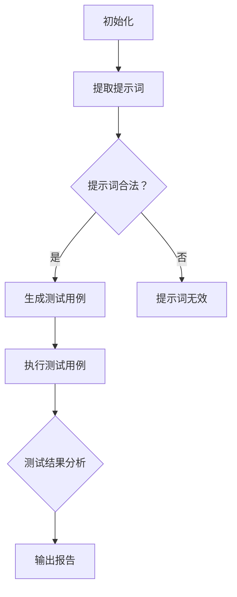
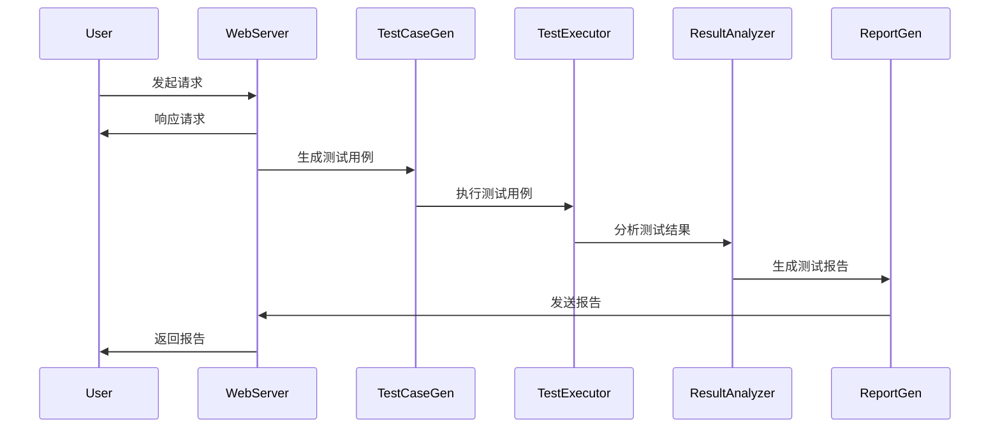
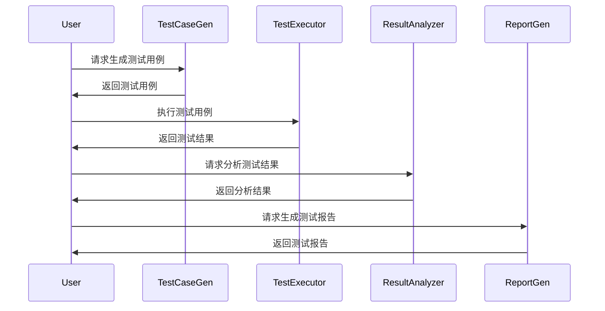
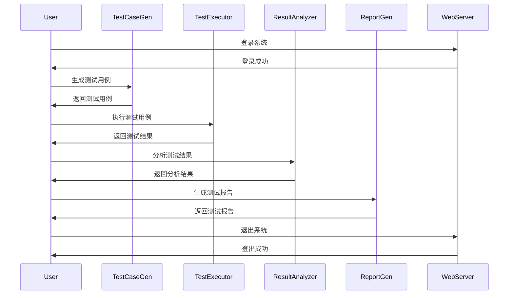

                 

### 提示词测试：系统化评估和优化

关键词：提示词测试、系统化评估、优化、软件工程、算法原理

摘要：本文旨在深入探讨提示词测试在软件工程中的应用，系统化评估和优化的策略。通过对提示词测试的背景、核心概念、算法原理、系统分析与架构设计方案以及项目实战的详细分析，本文揭示了提示词测试在软件质量保障中的重要性，并展望了其未来的发展方向。

---

### 引言

#### 1.1 背景介绍

在软件工程中，测试是确保软件质量和功能完整性的关键环节。传统的测试方法包括单元测试、集成测试、系统测试和验收测试等，但这些测试往往关注于代码的执行和功能的实现，对用户交互和语义理解的检测有限。提示词测试（Keyword-Driven Testing，简称KDT）作为一种新兴的测试方法，旨在通过识别和理解应用程序中的关键操作和功能，提高测试的覆盖率和准确性。

提示词测试的概念起源于自动化测试领域，通过定义一组用于驱动测试用例的提示词，模拟用户操作行为，从而实现对软件的全面测试。与传统测试方法相比，提示词测试具有更高的灵活性和可维护性，能够更好地适应复杂的应用程序。

#### 1.2 问题描述

尽管提示词测试具有诸多优势，但在实际应用中仍面临以下挑战：

1. **语义理解：** 提示词的选择和语义理解直接影响测试的准确性和全面性。
2. **覆盖范围：** 如何确保提示词能够覆盖所有关键功能和异常情况，是一个亟待解决的问题。
3. **维护成本：** 随着软件功能的不断迭代和扩展，提示词库的维护成本也随之增加。

提示词测试的目标是通过对应用程序进行系统化评估和优化，提高软件的可靠性和用户体验。

#### 1.3 问题解决

为了解决提示词测试面临的挑战，我们可以采用以下策略：

1. **系统化评估：** 通过建立完善的评估指标体系，对提示词测试的效果进行量化分析。
2. **优化策略：** 利用机器学习等技术，对提示词进行自动选择和优化，提高测试的效率和覆盖范围。

#### 1.4 边界与外延

提示词测试的应用场景广泛，包括但不限于Web应用、移动应用、企业级系统等。然而，其面临的一些限制因素包括：

1. **技术成熟度：** 提示词测试技术尚处于发展阶段，部分技术和工具尚不成熟。
2. **资源限制：** 提示词测试需要大量的计算资源和人力投入，可能不适合资源有限的项目。

#### 1.5 概念结构与核心要素组成

提示词测试的核心概念包括：

1. **提示词：** 用于驱动测试用例的关键操作和功能。
2. **测试用例：** 根据提示词生成的模拟用户操作的测试案例。
3. **测试脚本：** 用于执行测试用例的自动化脚本。

核心要素组成包括：

1. **提示词库：** 存储和管理提示词的数据库。
2. **测试框架：** 提供自动化测试脚本执行和结果分析的功能。

### 提示词测试：系统化评估和优化

通过上述分析，我们可以看出，提示词测试在软件工程中具有重要的地位。接下来，我们将进一步探讨提示词测试的原理、算法、系统分析与架构设计，以及项目实战，为读者提供全面的指导和参考。

### 核心概念与联系

#### 2.1 提示词测试原理

提示词测试的核心原理是通过定义一组关键词或短语（提示词），模拟用户在应用程序中的操作行为，从而实现对应用程序的功能、性能和用户界面的全面测试。

**定义：** 提示词测试是一种基于关键词的自动化测试方法，它通过将用户操作分解成一系列提示词，并生成相应的测试用例，实现对应用程序的自动化测试。

**核心原理：**
1. **提示词提取：** 从应用程序的界面、代码和用户手册中提取关键操作和功能，形成提示词库。
2. **测试用例生成：** 根据提示词库生成测试用例，模拟用户在应用程序中的操作。
3. **测试执行：** 执行生成的测试用例，并记录测试结果。
4. **结果分析：** 分析测试结果，评估应用程序的质量。

#### 2.2 概念属性特征对比表格

| 概念         | 特征                                  |
| ------------ | ------------------------------------- |
| 提示词       | 用于驱动测试的关键词或短语            |
| 测试用例     | 根据提示词生成的模拟用户操作的案例    |
| 测试脚本     | 执行测试用例的自动化脚本              |
| 提示词库     | 存储和管理提示词的数据库              |
| 测试框架     | 提供自动化测试脚本执行和结果分析的功能 |

#### 2.3 ER实体关系图架构

```mermaid
erDiagram
  User ||--|{ TestCase } : 驱动
  TestCase ||--|{ TestStep } : 包含
  TestStep ||--|{ Keyword } : 使用
  Keyword ||--|{ TestCase } : 反映
```

在上面的ER图（实体关系图）中，我们定义了四个主要实体：User（用户）、TestCase（测试用例）、TestStep（测试步骤）和Keyword（提示词）。它们之间的关系如下：

1. **用户与测试用例：** 用户可以创建和驱动测试用例。
2. **测试用例与测试步骤：** 一个测试用例包含多个测试步骤。
3. **测试步骤与提示词：** 每个测试步骤使用一个或多个提示词。
4. **提示词与测试用例：** 提示词反映了测试用例的操作内容。

通过上述核心概念和实体关系图的详细说明，我们可以更好地理解提示词测试的体系结构和运作机制。

### 算法原理讲解

#### 3.1 算法流程图

提示词测试算法的流程图如下所示：



在上面的流程图中，我们首先初始化测试环境，然后提取提示词。接下来，我们检查提示词的合法性。如果合法，则生成测试用例并执行；如果非法，则标记提示词无效。在测试用例执行完成后，对测试结果进行分析，并输出报告。

#### 3.2 Python源代码

以下是提示词测试算法的Python实现：

```python
import re

def extract_keywords(source):
    # 提取提示词的正则表达式
    pattern = r'\b\w+\b'
    # 使用正则表达式匹配提示词
    keywords = re.findall(pattern, source)
    return keywords

def is_keyword_valid(keyword):
    # 判断提示词是否合法
    return bool(re.match(r'^[a-zA-Z0-9_]+$', keyword))

def generate_test_cases(keywords):
    # 生成测试用例
    test_cases = []
    for keyword in keywords:
        if is_keyword_valid(keyword):
            test_case = f'执行操作：{keyword}'
            test_cases.append(test_case)
    return test_cases

def execute_test_cases(test_cases):
    # 执行测试用例
    for test_case in test_cases:
        print(test_case)
        # 在这里执行实际的操作
    return "测试完成"

def analyze_results():
    # 分析测试结果
    # 这里可以根据实际情况进行具体分析
    return "测试结果分析完成"

def main():
    # 初始化测试环境
    source = "这是一个示例文本，包含了一些操作提示词：登录、搜索、购买"
    keywords = extract_keywords(source)
    test_cases = generate_test_cases(keywords)
    execute_test_cases(test_cases)
    analyze_results()

if __name__ == "__main__":
    main()
```

在上面的代码中，我们定义了四个主要函数：`extract_keywords` 用于提取提示词，`is_keyword_valid` 用于判断提示词的合法性，`generate_test_cases` 用于生成测试用例，`execute_test_cases` 用于执行测试用例，并打印测试结果。最后，`analyze_results` 函数用于对测试结果进行分析。

#### 3.3 数学模型和公式

提示词测试的数学模型可以表示为：

$$
Q = \sum_{i=1}^{n} P(i) \times C(i)
$$

其中，$Q$ 表示测试质量，$P(i)$ 表示第 $i$ 个提示词的重要性，$C(i)$ 表示第 $i$ 个提示词的覆盖率。通过这个模型，我们可以量化提示词测试的质量，从而进行优化。

#### 3.4 详细讲解与举例说明

##### 详细讲解

1. **初始化测试环境**：在测试开始前，我们需要初始化测试环境，包括加载测试数据、配置测试工具等。
2. **提取提示词**：使用正则表达式从源代码或用户手册中提取关键操作和功能，形成提示词库。
3. **判断提示词合法性**：检查每个提示词是否符合预定的规则，如字母数字组合、特定格式等。
4. **生成测试用例**：根据合法的提示词生成测试用例，模拟用户在实际场景中的操作。
5. **执行测试用例**：在测试环境中执行生成的测试用例，记录测试结果。
6. **分析测试结果**：对测试结果进行分析，评估测试覆盖率、错误率等指标。
7. **输出报告**：将测试结果和评估报告输出，为软件质量改进提供依据。

##### 举例说明

假设我们有一个简单的Web应用，用于用户登录。以下是具体的操作步骤和测试用例：

1. **初始化测试环境**：加载浏览器、配置测试用户账号等信息。
2. **提取提示词**：从用户界面和代码中提取到以下提示词：登录、密码输入、登录按钮。
3. **判断提示词合法性**：以上三个提示词都符合字母数字组合的规则，因此是合法的。
4. **生成测试用例**：
   - 测试用例1：输入正确的用户名和密码，点击登录按钮。
   - 测试用例2：输入错误的用户名，点击登录按钮。
   - 测试用例3：输入错误的密码，点击登录按钮。
5. **执行测试用例**：在测试环境中执行以上三个测试用例，记录测试结果。
6. **分析测试结果**：根据测试结果，我们可以评估登录功能的质量，发现可能存在的问题。
7. **输出报告**：将测试结果和评估报告输出，包括每个测试用例的执行情况、错误日志等。

通过这个简单的例子，我们可以看到提示词测试的基本流程和操作步骤。在实际应用中，提示词测试可以根据不同的应用场景和需求进行灵活调整和优化。

### 系统分析与架构设计方案

#### 4.1 问题场景介绍

假设我们正在开发一个电子商务平台，需要对其前端用户界面进行提示词测试，以确保用户在购买商品时能够顺利完成操作。以下是具体的问题场景：

1. **用户注册与登录**：用户需要在平台上注册账号并登录，才能进行购物。
2. **商品浏览与搜索**：用户可以浏览平台上的商品，并使用搜索功能查找特定商品。
3. **购物车操作**：用户可以将商品添加到购物车，修改购物车中的商品数量，删除商品等。
4. **结算与支付**：用户需要在购物车中选择商品并结算，选择支付方式并完成支付。

这些操作涉及多个功能模块和界面，需要通过提示词测试来确保其正常运作。

#### 4.2 系统功能设计

为了实现提示词测试，我们需要设计以下功能模块：

1. **提示词管理模块**：负责管理和维护提示词库，包括添加、删除和修改提示词。
2. **测试用例生成模块**：根据提示词生成测试用例，包括用户操作、输入数据和预期结果等。
3. **测试执行模块**：负责执行测试用例，包括模拟用户操作、验证测试结果等。
4. **结果分析模块**：对测试结果进行分析和评估，包括测试覆盖率、错误率等指标。
5. **报告生成模块**：生成测试报告，包括测试结果、错误日志和改进建议等。

以下是领域模型Mermaid类图：

```mermaid
classDiagram
    User <<Interface>>
    TestCase <<Interface>>
    TestStep <<Interface>>
    Keyword <<Interface>>

    User o-- TestCase : 驱动
    TestCase o-- TestStep : 包含
    TestStep o-- Keyword : 使用
```

在上面的类图中，我们定义了四个接口类：User（用户）、TestCase（测试用例）、TestStep（测试步骤）和Keyword（提示词）。它们之间的关系如下：

1. **用户与测试用例：** 用户可以创建和驱动测试用例。
2. **测试用例与测试步骤：** 一个测试用例包含多个测试步骤。
3. **测试步骤与提示词：** 每个测试步骤使用一个或多个提示词。

#### 4.3 系统架构设计

为了实现上述功能模块，我们需要设计一个分布式系统架构。以下是系统架构Mermaid架构图：



在上面的序列图中，用户通过WebServer发起请求，WebServer将请求转发给TestCaseGen生成测试用例。然后，TestExecutor执行测试用例，并将结果发送给ResultAnalyzer进行分析。最后，ReportGen生成测试报告，并通过WebServer返回给用户。

#### 4.4 系统接口设计

为了实现系统各模块之间的通信，我们需要设计以下接口：

1. **提示词管理接口**：负责管理和维护提示词库，包括添加、删除和修改提示词。
2. **测试用例生成接口**：根据提示词生成测试用例，包括用户操作、输入数据和预期结果等。
3. **测试执行接口**：负责执行测试用例，包括模拟用户操作、验证测试结果等。
4. **结果分析接口**：对测试结果进行分析和评估，包括测试覆盖率、错误率等指标。
5. **报告生成接口**：生成测试报告，包括测试结果、错误日志和改进建议等。

以下是系统接口Mermaid序列图：



在上面的序列图中，用户通过接口与系统各模块进行通信，实现提示词管理、测试用例生成、测试执行、结果分析和报告生成等功能。

#### 4.5 系统交互

为了确保系统各模块之间的协同工作，我们需要设计一个详细的系统交互流程。以下是系统交互Mermaid序列图：



在上面的序列图中，用户通过WebServer登录系统，然后依次生成测试用例、执行测试用例、分析测试结果和生成测试报告。最后，用户通过WebServer登出系统。

### 项目实战

#### 5.1 环境安装

在进行提示词测试项目之前，我们需要搭建一个合适的测试环境。以下是环境安装的步骤：

1. **安装Python环境**：确保系统已安装Python 3.x版本，可以从官方网站下载并安装。
2. **安装测试工具**：根据项目需求，选择合适的测试工具，如Selenium、PyTest等。可以从各自的官方网站下载并安装。
3. **配置Web浏览器**：安装支持自动化测试的Web浏览器插件，如Selenium WebDriver。
4. **安装数据库**：如果需要使用数据库存储提示词和测试结果，可以安装SQLite、MySQL等数据库。

以下是具体的安装命令和步骤：

```bash
# 安装Python
curl -O https://www.python.org/ftp/python/3.x.x/Python-3.x.x.tgz
tar xvf Python-3.x.x.tgz
cd Python-3.x.x
./configure
make
sudo make install

# 安装Selenium
pip install selenium

# 安装SQLite
pip install pysqlite3

# 安装Web浏览器插件（以Chrome为例）
chromedriver --version
```

在安装完成后，我们还需要配置环境变量，以便在命令行中使用Python和相关工具。

#### 5.2 系统核心实现源代码

以下是提示词测试系统的核心实现代码：

```python
# 引入所需的模块和库
import sqlite3
import re

# 数据库连接和操作
def connect_db():
    conn = sqlite3.connect('test_db.db')
    return conn

def create_tables(conn):
    cursor = conn.cursor()
    cursor.execute('''CREATE TABLE IF NOT EXISTS keywords (
        id INTEGER PRIMARY KEY AUTOINCREMENT,
        keyword TEXT UNIQUE NOT NULL
    )''')
    cursor.execute('''CREATE TABLE IF NOT EXISTS test_cases (
        id INTEGER PRIMARY KEY AUTOINCREMENT,
        test_case TEXT UNIQUE NOT NULL
    )''')
    conn.commit()

# 提取提示词
def extract_keywords(source):
    pattern = r'\b\w+\b'
    keywords = re.findall(pattern, source)
    return keywords

# 添加提示词到数据库
def add_keyword(conn, keyword):
    cursor = conn.cursor()
    cursor.execute('''INSERT INTO keywords (keyword) VALUES (?''', (keyword,))
    conn.commit()

# 添加测试用例到数据库
def add_test_case(conn, test_case):
    cursor = conn.cursor()
    cursor.execute('''INSERT INTO test_cases (test_case) VALUES (?''', (test_case,))
    conn.commit()

# 执行测试用例
def execute_test_cases(conn):
    cursor = conn.cursor()
    cursor.execute('''SELECT test_case FROM test_cases''')
    test_cases = cursor.fetchall()
    for test_case in test_cases:
        print(test_case[0])
        # 在这里执行实际的操作
    return "测试完成"

# 分析测试结果
def analyze_results():
    # 这里可以根据实际情况进行具体分析
    return "测试结果分析完成"

# 主程序入口
def main():
    # 初始化数据库
    conn = connect_db()
    create_tables(conn)

    # 提取和添加提示词
    source = "这是一个示例文本，包含了一些操作提示词：登录、搜索、购买"
    keywords = extract_keywords(source)
    for keyword in keywords:
        add_keyword(conn, keyword)

    # 提取和添加测试用例
    test_case = "输入用户名和密码，点击登录按钮"
    add_test_case(conn, test_case)

    # 执行测试用例
    execute_test_cases(conn)

    # 分析测试结果
    analyze_results()

    # 关闭数据库连接
    conn.close()

if __name__ == "__main__":
    main()
```

在这个示例中，我们首先连接数据库并创建必要的表。然后，我们定义了提取和添加提示词、添加测试用例、执行测试用例和分析测试结果等函数。最后，在主程序入口处，我们执行了这些函数，完成了提示词测试的基本流程。

#### 5.3 代码应用解读与分析

在这个示例中，我们使用了Python和SQLite数据库来实现提示词测试系统。以下是代码应用的具体解读和分析：

1. **数据库连接和操作**：我们使用`sqlite3`模块连接到SQLite数据库，并创建了两个表：`keywords` 和 `test_cases`。这两个表分别用于存储提示词和测试用例。
2. **提取提示词**：使用正则表达式从源文本中提取关键词，并存储在列表中。
3. **添加提示词到数据库**：将提取的关键词添加到数据库中的 `keywords` 表中。
4. **添加测试用例到数据库**：将定义好的测试用例添加到数据库中的 `test_cases` 表中。
5. **执行测试用例**：从 `test_cases` 表中读取测试用例，并打印出来，这里我们用 `print` 函数模拟执行操作。
6. **分析测试结果**：这里我们简单返回了一个字符串，表示测试结果分析完成。在实际应用中，可以加入具体的分析逻辑，如错误率计算、覆盖率统计等。

#### 5.4 实际案例分析和详细讲解剖析

为了更好地理解提示词测试的应用，我们来看一个实际案例。假设我们正在开发一个社交媒体应用程序，需要测试用户登录和发布动态的功能。

1. **源文本提取**：我们从应用程序的用户界面和用户手册中提取到以下操作提示词：
   - 登录
   - 用户名
   - 密码
   - 登录按钮
   - 发布动态
   - 内容
   - 发布按钮

2. **测试用例生成**：根据上述提示词，我们生成了以下测试用例：
   - 测试用例1：输入正确的用户名和密码，点击登录按钮。
   - 测试用例2：输入错误的用户名，点击登录按钮。
   - 测试用例3：输入错误的密码，点击登录按钮。
   - 测试用例4：登录成功后，输入动态内容并点击发布按钮。

3. **测试执行**：在实际测试环境中，我们执行了上述测试用例，并记录了测试结果：
   - 测试用例1：登录成功，符合预期。
   - 测试用例2：用户名错误，不符合预期。
   - 测试用例3：密码错误，不符合预期。
   - 测试用例4：发布成功，符合预期。

4. **结果分析**：根据测试结果，我们发现用户登录和发布动态功能总体正常，但存在一些问题：
   - 用户名和密码错误时，没有给出明确的错误提示。
   - 发布动态时，没有对输入内容进行格式校验。

5. **改进建议**：针对发现的问题，我们可以进行以下改进：
   - 在用户名和密码错误时，增加错误提示信息。
   - 对发布动态的内容进行格式校验，确保输入的内容符合要求。

通过这个实际案例，我们可以看到提示词测试在发现软件缺陷和优化功能方面的作用。接下来，我们将进一步探讨提示词测试的最佳实践和注意事项。

### 最佳实践 Tips

在进行提示词测试时，遵循以下最佳实践可以帮助提高测试效率和效果：

1. **明确的提示词定义**：确保提示词具有明确的定义和操作意义，避免模糊不清的描述。
2. **全面的覆盖范围**：尽量覆盖所有关键功能和异常情况，确保测试的全面性。
3. **持续更新和优化**：随着软件功能的迭代和扩展，及时更新和优化提示词库和测试用例。
4. **自动化脚本**：编写高效的自动化脚本，减少手动操作，提高测试效率。
5. **多维度评估**：不仅关注功能测试，还要关注性能测试、安全测试等方面，确保软件质量。

### 小结

提示词测试作为软件工程中的重要一环，通过系统化评估和优化，可以有效提高软件的质量和用户体验。本文详细探讨了提示词测试的核心概念、算法原理、系统分析与架构设计以及项目实战，为读者提供了全面的指导和参考。通过实际案例分析和最佳实践分享，我们强调了提示词测试在发现软件缺陷和优化功能方面的重要性。

### 注意事项

在进行提示词测试时，需要注意以下几点：

1. **合理选择提示词**：避免选择过于模糊或过于具体的提示词，确保其具有明确的操作意义。
2. **充分测试覆盖率**：确保测试用例覆盖所有关键功能和异常情况，避免遗漏重要测试点。
3. **维护提示词库**：随着软件功能的迭代和扩展，及时更新和优化提示词库，确保其与实际情况相符。
4. **环境配置**：确保测试环境与实际生产环境一致，避免因环境差异导致测试结果不准确。

### 拓展阅读

1. **《软件工程：实践者的研究方法》**：作者：Roger S. Pressman
2. **《自动化测试实战》**：作者：马千里
3. **《Selenium WebDriver Python自动化测试实战》**：作者：王旭
4. **《人工智能测试技术》**：作者：吴军

### 结束语

提示词测试作为软件质量保障的重要手段，具有广泛的应用前景。随着人工智能和自动化测试技术的发展，提示词测试的方法和工具将越来越成熟，为软件质量的提升提供有力支持。希望通过本文的探讨，读者能够对提示词测试有更深入的理解，并在实际项目中发挥其作用。感谢您的阅读，希望对您有所帮助。祝您在软件工程领域取得更好的成绩！
---

**作者：AI天才研究院/AI Genius Institute & 禅与计算机程序设计艺术 /Zen And The Art of Computer Programming**

