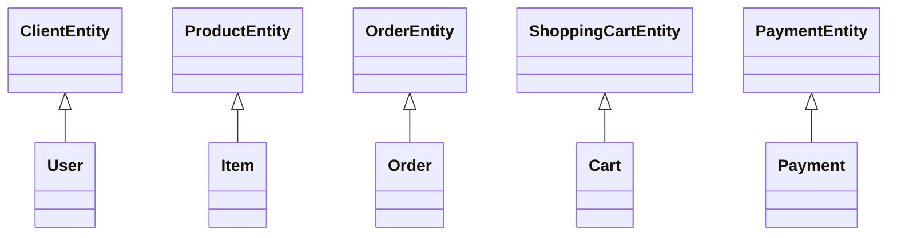
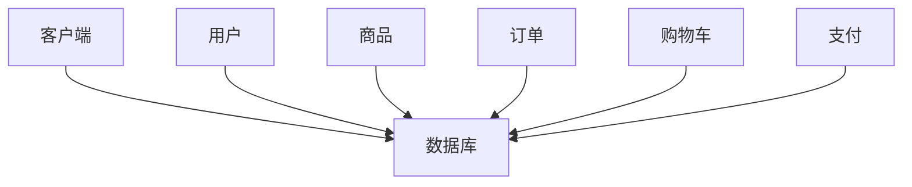
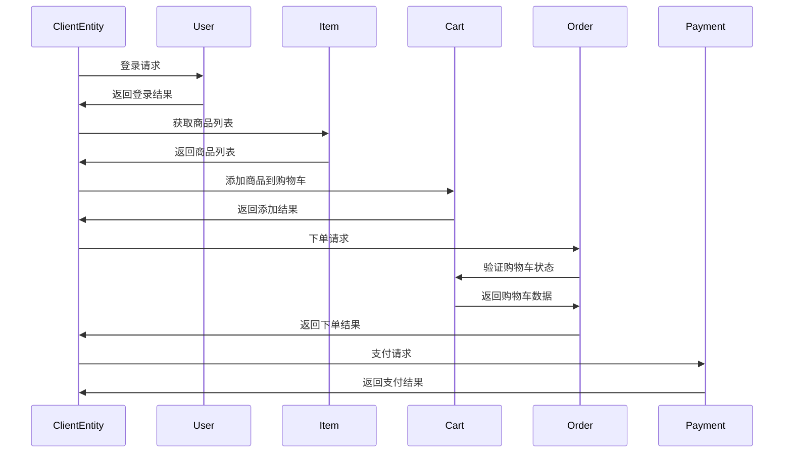
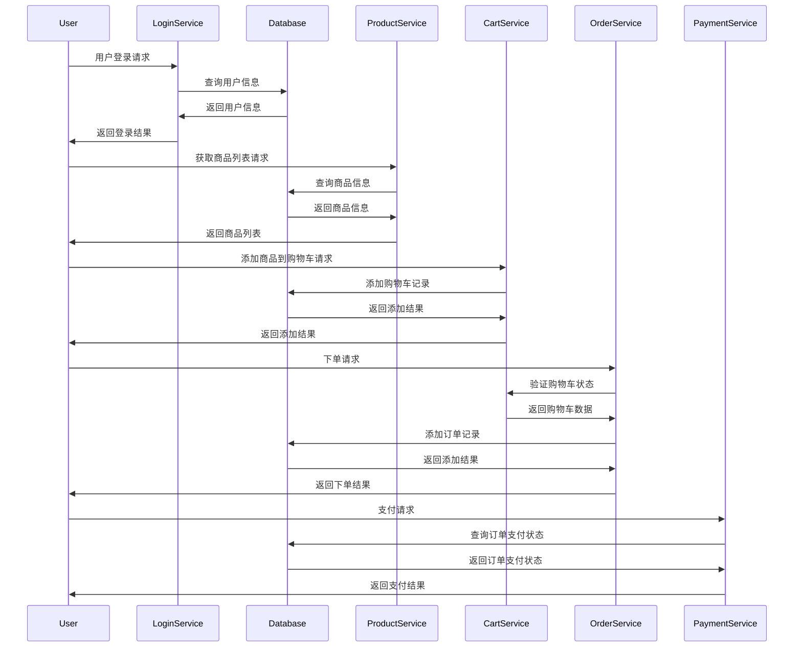

                 

# 提示词版本控制：管理多个迭代版本

> 关键词：版本控制，迭代管理，Git，源代码管理，多版本管理

> 摘要：
在软件开发过程中，版本控制是确保代码库稳定性和协作开发的关键环节。本文将探讨如何使用Git等工具来管理多个迭代版本，通过逻辑清晰的分析和示例，帮助开发者掌握有效的版本控制策略。

## 引言

软件开发是一个迭代不断的过程，从最初的构思到最终产品的发布，需要经历多个阶段。在每个阶段，开发团队都可能对源代码进行修改，从而产生多个版本。有效的版本控制不仅能确保代码的完整性和可追溯性，还能提高团队协作效率和项目稳定性。本文将围绕版本控制这一主题，分析其核心概念、原理以及实际应用，特别是如何管理多个迭代版本。

## 背景介绍

### 核心概念术语说明

- **版本控制（Version Control）**：一种用于跟踪源代码变更的管理系统，确保代码库的版本一致性。
- **迭代（Iteration）**：软件开发过程中的一个阶段，通常指对现有功能的改进或新增功能的开发。
- **分支（Branch）**：在版本控制系统中，用于隔离开发环境的独立代码路径。
- **合并（Merge）**：将两个或多个分支的代码合并到一个主分支中。
- **标签（Tag）**：用于标记特定版本或里程碑的代码。

### 问题背景

软件开发涉及多个开发人员和团队，每个人可能在不同的阶段对代码库进行修改。如果没有有效的版本控制，可能会导致代码冲突、功能冗余和项目混乱。因此，版本控制成为软件开发中必不可少的一部分。

### 问题描述

如何在一个项目中管理多个迭代版本，确保每个版本的可追溯性、稳定性和可维护性？这涉及到如何创建分支、合并代码、使用标签等操作。

### 问题解决

采用Git等版本控制系统，通过创建分支、合并代码和打标签等操作，实现多个迭代版本的管理。Git提供了一套完整的命令行工具和图形界面工具，支持各种版本控制需求。

### 边界与外延

本文主要讨论Git在版本控制中的应用，但不涉及其他版本控制系统（如SVN、Mercurial等）的细节。同时，本文假设读者对Git的基本操作有一定的了解。

### 概念结构与核心要素组成

版本控制系统的核心要素包括：

- **代码仓库（Repository）**：存储源代码的仓库。
- **分支**：用于隔离不同功能的代码路径。
- **提交**：对代码库的一次变更记录。
- **标签**：用于标记重要版本。

## 核心概念与联系

### 核心概念原理

- **版本控制**：记录代码的变更历史，确保代码库的完整性和可追踪性。
- **分支管理**：创建、合并和删除分支，实现并行开发和协同工作。
- **标签管理**：为特定版本打标签，便于后续查找和发布。

### 概念属性特征对比表格

| 特征        | 版本控制         | 分支管理         | 标签管理         |
| ----------- | ---------------- | ---------------- | ---------------- |
| 目的        | 记录代码变更历史 | 并行开发和协同工作 | 标记特定版本     |
| 操作方式    | 提交变更         | 创建、合并、删除分支 | 打标签、删除标签 |
| 对象        | 代码库           | 分支             | 标签             |
| 影响范围    | 整个代码库       | 单个分支         | 单个版本        |

### ER实体关系图架构

```mermaid
erDiagram
  CodeRepository ||--|{ Commit }|-->> Tag
  CodeRepository ||--|{ Branch }|-->>
  Branch ||--|{ Commit }|-->> Tag
  Commit ||--|{ FileChange }|
  FileChange ||--|{ File }|
```

## 算法原理讲解

### 算法流程图


### Python代码实现

```python
import git

# 初始化仓库
repo = git.Repo.init()

# 创建分支
branch = repo.create_head('feature-branch')

# 提交变更
repo.index.add(['file1.txt', 'file2.txt'])
repo.index.commit('Initial commit')

# 合并分支
repo.checkout('main')
repo.merge('feature-branch')

# 打标签
repo.create_tag('v1.0')

# 发布版本
repo.git.push('origin', 'main')
repo.git.push('origin', 'feature-branch')
repo.git.push('origin', 'refs/tags/v1.0')
```

### 算法原理解释

1. **初始化仓库**：创建一个新的Git仓库。
2. **创建分支**：创建一个新的分支用于开发。
3. **提交变更**：对分支进行代码修改，并提交变更记录。
4. **合并分支**：将开发分支的代码合并到主分支。
5. **打标签**：为合并后的版本打标签，便于后续发布。
6. **发布版本**：将主分支和标签推送到远程仓库，发布新版本。

### 数学模型和公式

在版本控制中，可以使用以下公式来描述版本之间的依赖关系：

$$
版本号 = 主版本号 + ． + 次版本号 + ． + 修订版本号
$$

例如，`1.2.3`表示主版本为1，次版本为2，修订版本为3。

### 示例

假设我们有两个迭代版本`v1.0`和`v2.0`，其版本号分别为`1.0`和`2.0`。我们可以使用以下公式来计算它们之间的依赖关系：

$$
依赖关系 = v2.0 - v1.0 = 2.0 - 1.0 = 1.0
$$

这意味着`v2.0`依赖于`v1.0`。

## 系统分析与设计

### 问题场景介绍

假设我们正在开发一款在线购物平台，需要管理多个迭代版本。每个迭代版本包含不同的功能模块和改进点。我们需要确保每个版本的可追踪性和稳定性。

### 项目介绍

项目名称：在线购物平台
项目版本：v1.0、v1.1、v2.0
项目框架：Django
数据库：MySQL

### 系统功能设计（领域模型Mermaid类图）



### 系统架构设计（Mermaid架构图）



### 系统接口设计



### 系统交互（Mermaid序列图）



## 项目实战

### 环境安装

1. 安装Git：在终端运行`sudo apt-get install git`。
2. 安装Python和Django：在终端运行`sudo apt-get install python3 python3-pip`，然后运行`pip3 install django`。

### 系统核心实现源代码

以下是一个简单的Django项目，用于管理版本：

```python
# settings.py
INSTALLED_APPS = [
    'django.contrib.admin',
    'django.contrib.auth',
    'django.contrib.contenttypes',
    'django.contrib.sessions',
    'django.contrib.messages',
    'django.contrib.staticfiles',
    'version_control',
]

# version_control/models.py
from django.db import models

class Version(models.Model):
    version_number = models.CharField(max_length=20)
    created_at = models.DateTimeField(auto_now_add=True)

class Branch(models.Model):
    name = models.CharField(max_length=100)
    version = models.ForeignKey(Version, on_delete=models.CASCADE)

class Commit(models.Model):
    message = models.TextField()
    author = models.CharField(max_length=100)
    created_at = models.DateTimeField(auto_now_add=True)
    branch = models.ForeignKey(Branch, on_delete=models.CASCADE)

# version_control/views.py
from django.shortcuts import render
from .models import Version, Branch, Commit

def version_list(request):
    versions = Version.objects.all()
    return render(request, 'version_list.html', {'versions': versions})

def branch_list(request, version_id):
    branches = Branch.objects.filter(version_id=version_id)
    return render(request, 'branch_list.html', {'branches': branches})

def commit_list(request, branch_id):
    commits = Commit.objects.filter(branch_id=branch_id)
    return render(request, 'commit_list.html', {'commits': commits})
```

### 代码应用解读与分析

1. **模型定义**：在`models.py`中定义了`Version`、`Branch`和`Commit`三个模型，分别表示版本、分支和提交。
2. **视图实现**：在`views.py`中定义了三个视图函数，分别用于展示版本列表、分支列表和提交列表。

### 实际案例分析和详细讲解剖析

以一个实际案例为例，假设我们要管理一个在线购物平台的迭代版本。

1. **创建版本**：在后台管理界面创建一个版本记录，例如`v1.0`。
2. **创建分支**：为`v1.0`创建一个开发分支，例如`feature-login`。
3. **提交变更**：在`feature-login`分支上进行登录功能开发，提交多个变更记录。
4. **合并分支**：将`feature-login`分支合并到主分支`master`。
5. **打标签**：为合并后的版本打标签，例如`v1.1`。
6. **发布版本**：将主分支和标签推送到远程仓库，发布新版本。

通过以上步骤，我们实现了对在线购物平台迭代版本的管理。

### 项目小结

通过本文的介绍，我们了解了如何使用Git等版本控制工具来管理多个迭代版本。在实际项目中，合理运用版本控制策略，可以帮助开发团队提高效率、确保代码质量和项目稳定性。

### 最佳实践 tips

1. **定期备份**：定期备份代码库，以防数据丢失。
2. **分支命名规范**：遵循统一的分支命名规范，便于管理。
3. **代码审查**：在提交代码前进行代码审查，确保代码质量。

### 注意事项

1. **版本控制工具的选择**：根据项目需求选择合适的版本控制工具。
2. **权限管理**：合理分配权限，确保团队协作顺畅。

### 拓展阅读

1. 《Pro Git》 - Scott Chacon 和 Ben Straub
2. 《版本控制指南》 - Linux中国

## 结论

版本控制是软件开发中不可或缺的一环，通过合理的管理多个迭代版本，开发团队能够更好地协同工作，确保项目的成功。本文介绍了版本控制的基本概念、原理和实际应用，希望对开发者有所启发。

### 作者信息

作者：AI天才研究院/AI Genius Institute & 禅与计算机程序设计艺术 /Zen And The Art of Computer Programming

