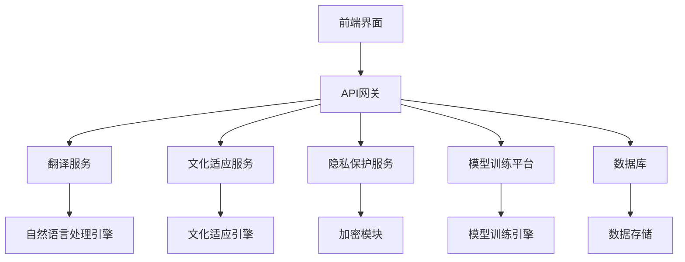
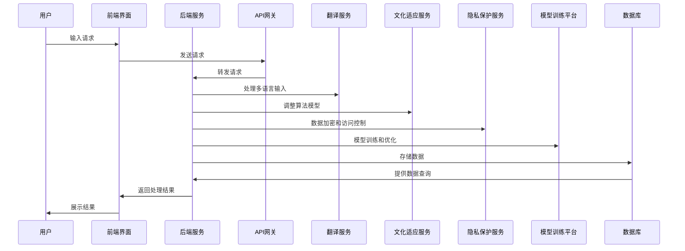

                 


### 文章标题：提示词的文化适应：跨国AI应用策略

**关键词：** 提示词、文化适应、跨国AI应用、算法优化、系统架构

**摘要：** 本文深入探讨提示词的文化适应性问题，分析了跨国AI应用的挑战和策略。通过详细的算法原理讲解、数学模型和系统架构设计，以及实际项目实战，本文旨在为读者提供一套完整的跨国AI应用解决方案，助力企业更好地应对全球化背景下的技术挑战。

### 目录大纲

**第一部分：背景与概述**

**第1章：问题背景与定义**

1.1 提示词的概念与重要性

1.2 文化适应的定义与挑战

1.3 跨国AI应用现状与问题

**第2章：核心概念与联系**

2.1 提示词的原理与分类

2.2 文化适应的属性特征对比表格

2.3 跨国AI应用的关键概念与关系图

**第二部分：算法原理与数学模型**

**第3章：AI算法基础**

3.1 机器学习基础

3.2 深度学习原理

3.3 提示词生成算法

**第4章：数学模型与公式**

4.1 数学模型介绍

4.2 常用数学公式与解释

4.3 提示词与文化适应的数学关系

**第5章：算法应用与优化**

5.1 算法实战

5.2 算法性能优化

5.3 跨国AI应用中的特殊考虑

**第三部分：系统设计与实现**

**第6章：系统分析与架构设计**

6.1 问题场景介绍

6.2 系统功能设计

6.3 系统架构设计与接口设计

**第7章：项目实战与案例分析**

7.1 环境安装与配置

7.2 系统核心实现

7.3 代码解读与分析

7.4 实际案例分析与剖析

7.5 项目小结与总结

**第8章：最佳实践与拓展**

8.1 最佳实践指南

8.2 小结与注意事项

8.3 拓展阅读与未来展望

### 第1章：问题背景与定义

在全球化迅速发展的背景下，人工智能（AI）技术已经成为许多行业转型升级的关键驱动力。然而，AI的应用并不仅仅是技术层面的挑战，更涉及到跨文化的适应性问题。本文将围绕提示词的文化适应这一主题，探讨跨国AI应用的策略。

#### 1.1 提示词的概念与重要性

提示词（Prompt）是AI模型在训练和推理过程中使用的输入信息，其作用相当于人类思维中的“引导”或“提示”。在自然语言处理（NLP）领域，提示词的质量直接影响模型的理解能力和生成结果。高质量、适应性的提示词可以显著提高AI模型的性能和用户满意度。

#### 1.2 文化适应的定义与挑战

文化适应（Cultural Adaptation）是指在不同文化环境中，个体或组织适应并融入新环境的过程。对于跨国AI应用而言，文化适应意味着模型需要能够理解和适应不同语言、习俗、价值观等文化差异。文化适应的挑战主要包括：

1. 语言障碍：不同语言的语法、词汇和表达方式各异，可能导致AI模型误解用户意图。
2. 价值观差异：不同文化对隐私、公平性、透明性等价值观有不同的看法，需要AI模型在设计和应用中予以考虑。
3. 习俗与习惯：一些文化习惯和习俗可能无法通过算法自动适应，需要手动调整或设计专门算法。

#### 1.3 跨国AI应用现状与问题

当前，跨国AI应用面临着诸多挑战：

1. 数据稀缺：不同国家和地区的数据分布不均，导致AI模型在某些地区性能不佳。
2. 法律法规差异：不同国家和地区的法律法规对AI应用有不同的要求，需要企业在全球范围内进行合规性调整。
3. 技术瓶颈：AI算法在处理跨文化问题时，仍存在技术瓶颈，如语义理解、情感识别等。

接下来，我们将进一步探讨提示词的文化适应性问题，分析如何通过算法优化和系统设计，提高跨国AI应用的适应能力。

#### 1.4 核心概念与联系

在本章中，我们将定义并介绍与提示词和文化适应相关的核心概念，并阐述它们之间的联系。

##### 提示词

提示词是AI模型在训练和推理过程中使用的输入信息，通常由一组关键词、短语或句子组成。提示词的质量直接影响模型的理解能力和生成结果。高质量的提示词能够提供明确的语义信息，帮助模型更好地理解用户意图。

##### 文化适应

文化适应是指在不同文化环境中，个体或组织适应并融入新环境的过程。在AI应用中，文化适应意味着模型需要能够理解和适应不同语言、习俗、价值观等文化差异。

##### 跨国AI应用

跨国AI应用是指在不同国家和地区开展的人工智能应用项目。跨国AI应用需要考虑文化适应、数据稀缺、法律法规差异和技术瓶颈等挑战。

##### 关系图

以下是提示词、文化适应和跨国AI应用之间的关系图：

```
                          +-------------+
                          | 跨国AI应用 |
                          +------+------++
                          |      |     |
                     +---+  | 提示词 |  +---+
                     |     |        |     |
                     |     |        |     |
                     |     +--------+     |
                     |                 |   |
                     |                 |   |
               +-----+      +-----+     |
               | 文化适应 |      |     |
               +---------+      +-----+
                      |         |
                      |         |
                      |         |
                      |         |
                      |         |
                      |         |
                      |         |
                      |         |
                      +---------+

```

通过上述关系图，我们可以清晰地看到提示词、文化适应和跨国AI应用之间的相互作用和影响。接下来，我们将进一步探讨这些概念在AI应用中的具体应用和实践。

#### 1.5 结论

本章介绍了提示词、文化适应和跨国AI应用的基本概念，分析了跨国AI应用面临的挑战。在下一章中，我们将深入探讨提示词的原理与分类，为理解后续内容打下基础。

### 第2章：核心概念与联系

在深入探讨跨国AI应用的挑战和策略之前，我们需要明确几个核心概念，包括提示词的原理与分类、文化适应的属性特征对比，以及跨国AI应用中的关键概念和它们之间的关系。

#### 2.1 提示词的原理与分类

提示词在AI模型中的作用至关重要，它直接影响模型的理解能力和生成结果。提示词的原理可以分为以下几个方面：

1. **语义引导**：提示词提供具体的语义信息，帮助模型更好地理解用户意图。高质量、适应性的提示词能够引导模型捕捉到关键信息，从而提高生成结果的准确性和相关性。
2. **上下文感知**：提示词需要能够感知上下文信息，从而在不同情境下产生合适的响应。上下文感知能力是衡量提示词质量的重要指标。
3. **多样性**：提示词的多样性能够提高模型的泛化能力，避免模型在特定场景下出现偏差。

根据用途和特点，提示词可以分为以下几类：

1. **引导性提示词**：这类提示词主要用于引导模型关注特定信息，如“请描述一下你最喜欢的一道菜。”
2. **约束性提示词**：这类提示词用于为模型设定约束条件，如“请用不超过50字回答。”
3. **参考性提示词**：这类提示词提供背景信息或参考，帮助模型更好地理解上下文，如“在描述之前，请先了解这个问题的背景。”

#### 2.2 文化适应的属性特征对比表格

文化适应涉及多个维度，包括语言、价值观、习俗等。以下是文化适应的一些关键属性特征对比表格，用于展示不同文化之间的差异：

| 属性特征       | 中文文化       | 西方文化       | 解释与应用       |
|--------------|--------------|--------------|--------------|
| 语言表达       | 含蓄、间接       | 直接、明确       | 在设计提示词时，需要考虑语言的直接性和含蓄性，避免误解。 |
| 价值观         | 社会责任、和谐       | 个人主义、自由       | 在AI应用中，需要平衡不同文化对社会责任和个人自由的重视程度。 |
| 习俗与礼仪       | 礼貌、尊重       | 开放、包容       | 在跨文化交互中，AI需要理解并尊重不同文化中的礼仪和习惯。 |

#### 2.3 跨国AI应用的关键概念与关系图

在跨国AI应用中，涉及多个关键概念，如数据、算法、模型、用户等。以下是这些概念之间的关系图，用于展示它们之间的相互作用：

```
                          +-------------+
                          | 数据管理    |
                          +------+------++
                          |      |     |
                     +---+  | 数据分析 |  +---+
                     |     |        |     |
                     |     |        |     |
                     |     +--------+     |
                     |                 |   |
                     |                 |   |
               +-----+      +-----+     |
               | 算法优化 |      |     |
               +---------+      +-----+
                      |         |
                      |         |
                      |         |
                      |         |
                      |         |
                      |         |
                      |         |
                      |         |
                      +---------+

```

通过上述关系图，我们可以看到数据管理、算法优化、模型训练和用户反馈之间的紧密联系。这些概念相互作用，共同推动跨国AI应用的不断优化和改进。

#### 2.4 核心概念与联系总结

在本章中，我们介绍了提示词的原理与分类、文化适应的属性特征对比，以及跨国AI应用的关键概念和它们之间的关系。这些核心概念构成了理解跨国AI应用的基础，为后续章节的内容奠定了理论基础。

在下一章中，我们将深入探讨AI算法的基础知识，包括机器学习、深度学习等，为理解提示词生成算法提供技术支持。

### 第3章：AI算法基础

在理解了提示词和文化适应的基本概念后，我们需要深入了解AI算法的基础知识。这将为后续的提示词生成算法提供技术支持。在本章中，我们将介绍机器学习、深度学习等关键概念，并探讨它们在AI算法中的应用。

#### 3.1 机器学习基础

机器学习（Machine Learning）是一门研究如何让计算机从数据中学习规律并自动做出决策的学科。机器学习算法可以分为监督学习、无监督学习和强化学习三大类。

1. **监督学习**：监督学习算法通过已标记的数据进行训练，从而学习到输入和输出之间的关系。常见的监督学习算法包括线性回归、逻辑回归、支持向量机（SVM）等。

   **线性回归**：
   $$ y = ax + b $$
   其中，$y$ 是输出值，$x$ 是输入值，$a$ 和 $b$ 是模型参数。

   **逻辑回归**：
   $$ P(y=1) = \frac{1}{1 + e^{-z}} $$
   其中，$z = wx + b$，$w$ 和 $b$ 是模型参数。

2. **无监督学习**：无监督学习算法在没有标记数据的情况下，通过学习数据的内在结构或分布来进行分类或聚类。常见的无监督学习算法包括K均值聚类、主成分分析（PCA）等。

   **K均值聚类**：
   $$ c = \frac{1}{N}\sum_{i=1}^{N} x_i $$
   其中，$c$ 是聚类中心，$x_i$ 是数据点。

3. **强化学习**：强化学习算法通过与环境进行交互，不断调整策略以实现最大化累积奖励。常见的强化学习算法包括Q学习、深度确定性策略梯度（DDPG）等。

   **Q学习**：
   $$ Q(s, a) = r + \gamma \max_{a'} Q(s', a') $$
   其中，$s$ 是状态，$a$ 是动作，$r$ 是奖励，$\gamma$ 是折扣因子。

#### 3.2 深度学习原理

深度学习（Deep Learning）是机器学习的一个子领域，其核心思想是模拟人脑的神经网络结构，通过层层传递信息来实现复杂的模式识别和决策。深度学习算法主要包括卷积神经网络（CNN）、循环神经网络（RNN）和生成对抗网络（GAN）等。

1. **卷积神经网络（CNN）**：CNN 是用于图像识别和处理的深度学习算法，其核心思想是通过卷积操作提取图像的特征。

   **卷积操作**：
   $$ f(x) = \sum_{i=1}^{n} w_i * x_i + b $$
   其中，$w_i$ 是卷积核，$x_i$ 是输入特征，$b$ 是偏置。

   **激活函数**：
   $$ a(x) = max(0, x) $$
   其中，$x$ 是输入值。

2. **循环神经网络（RNN）**：RNN 是用于序列数据处理的深度学习算法，其核心思想是通过循环结构保留历史信息。

   **RNN 单元**：
   $$ h_t = \sigma(W_h * [h_{t-1}, x_t] + b_h) $$
   $$ o_t = \sigma(W_o * h_t + b_o) $$
   其中，$h_t$ 是隐藏状态，$x_t$ 是输入值，$W_h$ 和 $W_o$ 是权重矩阵，$b_h$ 和 $b_o$ 是偏置。

3. **生成对抗网络（GAN）**：GAN 是一种通过对抗训练实现数据生成和优化的深度学习算法。

   **生成器**：
   $$ G(z) = \sigma(W_g * z + b_g) $$

   **判别器**：
   $$ D(x) = \sigma(W_d * x + b_d) $$
   $$ D(G(z)) = \sigma(W_d * G(z) + b_d) $$

   **损失函数**：
   $$ L_D = -[\log(D(x)) + \log(1 - D(G(z)))] $$

   $$ L_G = -\log(D(G(z))) $$

#### 3.3 提示词生成算法

在了解了机器学习和深度学习的基础后，我们可以探讨如何利用这些算法来生成适应不同文化的提示词。提示词生成算法可以分为以下几类：

1. **基于规则的生成算法**：这类算法通过定义一系列规则来生成提示词。例如，根据不同语言的特点，设计特定的语法和表达方式。

2. **基于机器学习的生成算法**：这类算法通过训练大量样本数据，学习生成高质量的提示词。常见的机器学习算法包括循环神经网络（RNN）和生成对抗网络（GAN）。

3. **基于深度学习的生成算法**：这类算法利用深度学习模型，如生成对抗网络（GAN）和变分自编码器（VAE），来生成高质量的提示词。

以下是一个简单的基于循环神经网络的提示词生成算法示例：

```python
import tensorflow as tf
from tensorflow.keras.layers import LSTM, Dense, Embedding, Input
from tensorflow.keras.models import Model

# 定义输入层
input_seq = Input(shape=(None,))

# 添加嵌入层
embed = Embedding(vocab_size, embedding_dim)(input_seq)

# 添加循环层
lstm = LSTM(units, return_sequences=True)(embed)

# 添加全连接层
output = Dense(vocab_size, activation='softmax')(lstm)

# 构建模型
model = Model(inputs=input_seq, outputs=output)

# 编译模型
model.compile(optimizer='adam', loss='categorical_crossentropy')

# 训练模型
model.fit(x_train, y_train, batch_size=batch_size, epochs=num_epochs)
```

通过上述算法，我们可以生成适应不同文化的提示词，从而提高AI模型的性能和用户体验。

#### 3.4 总结

本章介绍了机器学习、深度学习和提示词生成算法的基础知识。通过这些算法，我们可以为AI模型生成适应不同文化的提示词，提高模型的性能和用户体验。在下一章中，我们将进一步探讨数学模型与公式在AI应用中的重要性，为理解和优化AI算法提供理论支持。

### 第4章：数学模型与公式

在理解了AI算法的基础后，我们需要进一步探讨数学模型与公式在AI应用中的重要性。数学模型是AI算法的核心，它们通过精确的数学表达式描述了数据之间的关系和模型的行为。在本章中，我们将介绍常用的数学模型与公式，并探讨它们在AI应用中的作用。

#### 4.1 数学模型介绍

数学模型是通过对现实世界问题的抽象和简化，使用数学语言来描述和解决问题的一种方法。在AI应用中，数学模型用于描述数据之间的关系、算法的行为以及模型性能的评估。常见的数学模型包括线性模型、概率模型、优化模型等。

1. **线性模型**：线性模型是机器学习中最基本的模型之一，它假设输入和输出之间存在线性关系。线性模型包括线性回归和逻辑回归等。

   **线性回归**：
   $$ y = \beta_0 + \beta_1x $$
   其中，$y$ 是输出值，$x$ 是输入值，$\beta_0$ 和 $\beta_1$ 是模型参数。

   **逻辑回归**：
   $$ P(y=1) = \frac{1}{1 + e^{-\beta_0 + \beta_1x}} $$
   其中，$P(y=1)$ 是输出值为1的概率。

2. **概率模型**：概率模型是描述数据不确定性的数学模型，它们基于概率论和统计学原理。常见的概率模型包括贝叶斯模型、马尔可夫模型等。

   **贝叶斯模型**：
   $$ P(A|B) = \frac{P(B|A)P(A)}{P(B)} $$
   其中，$P(A|B)$ 是在事件B发生的条件下事件A发生的概率，$P(B|A)$ 是在事件A发生的条件下事件B发生的概率。

3. **优化模型**：优化模型是用于解决优化问题的数学模型，它们通过寻找最优解来最大化或最小化目标函数。常见的优化模型包括线性规划、非线性规划等。

   **线性规划**：
   $$ \min c^T x $$
   $$ \text{subject to} $$
   $$ Ax \leq b $$
   其中，$x$ 是决策变量，$c$ 是系数向量，$A$ 是系数矩阵，$b$ 是常数向量。

4. **深度学习模型**：深度学习模型是用于描述复杂非线性关系的数学模型，它们通过多层神经网络来学习数据的特征。常见的深度学习模型包括卷积神经网络（CNN）、循环神经网络（RNN）等。

   **卷积神经网络（CNN）**：
   $$ f(x) = \sum_{i=1}^{n} w_i * x_i + b $$
   $$ a(x) = max(0, x) $$
   其中，$f(x)$ 是卷积操作，$a(x)$ 是激活函数。

#### 4.2 常用数学公式与解释

在本节中，我们将介绍一些常用的数学公式，并解释它们在AI应用中的作用。

1. **损失函数**：损失函数是评估模型预测值与真实值之间差异的函数，用于指导模型优化。常见的损失函数包括均方误差（MSE）、交叉熵（Cross-Entropy）等。

   **均方误差（MSE）**：
   $$ \text{MSE} = \frac{1}{n} \sum_{i=1}^{n} (y_i - \hat{y}_i)^2 $$
   其中，$y_i$ 是真实值，$\hat{y}_i$ 是预测值。

   **交叉熵（Cross-Entropy）**：
   $$ \text{CE} = -\frac{1}{n} \sum_{i=1}^{n} y_i \log(\hat{y}_i) $$
   其中，$y_i$ 是真实值，$\hat{y}_i$ 是预测值。

2. **优化算法**：优化算法是用于寻找模型参数最优值的算法，常见的优化算法包括梯度下降（Gradient Descent）、随机梯度下降（Stochastic Gradient Descent，SGD）等。

   **梯度下降**：
   $$ \theta = \theta - \alpha \nabla_{\theta} J(\theta) $$
   其中，$\theta$ 是模型参数，$J(\theta)$ 是损失函数，$\alpha$ 是学习率。

   **随机梯度下降（SGD）**：
   $$ \theta = \theta - \alpha \nabla_{\theta} J(\theta; \theta^{(i)}) $$
   其中，$\theta^{(i)}$ 是模型参数的随机样本。

3. **正则化**：正则化是用于防止模型过拟合的技术，常见的正则化方法包括L1正则化、L2正则化等。

   **L1正则化**：
   $$ J(\theta) = \sum_{i=1}^{n} (y_i - \hat{y}_i)^2 + \lambda \sum_{i=1}^{n} |\theta_i| $$
   其中，$\lambda$ 是正则化参数。

   **L2正则化**：
   $$ J(\theta) = \sum_{i=1}^{n} (y_i - \hat{y}_i)^2 + \lambda \sum_{i=1}^{n} \theta_i^2 $$

4. **卷积操作**：卷积操作是深度学习中的核心操作，用于提取图像的特征。

   **卷积操作**：
   $$ f(x) = \sum_{i=1}^{n} w_i * x_i + b $$
   其中，$f(x)$ 是卷积操作，$w_i$ 是卷积核，$x_i$ 是输入特征，$b$ 是偏置。

5. **激活函数**：激活函数是深度学习中的核心组件，用于引入非线性特性。

   **ReLU激活函数**：
   $$ a(x) = max(0, x) $$
   **Sigmoid激活函数**：
   $$ a(x) = \frac{1}{1 + e^{-x}} $$
   **Tanh激活函数**：
   $$ a(x) = \frac{e^x - e^{-x}}{e^x + e^{-x}} $$

#### 4.3 提示词与文化适应的数学关系

在AI应用中，提示词的生成与文化适应密切相关。下面我们探讨提示词与文化适应的数学关系，并介绍一些相关的数学模型。

1. **文化适应矩阵**：文化适应矩阵是一个用于描述不同文化之间差异的数学模型。它通过比较不同文化在语言、价值观、习俗等方面的特征，生成一个矩阵，用于指导提示词的生成。

   **文化适应矩阵**：
   $$ A = \begin{bmatrix} 
   a_{11} & a_{12} & \ldots & a_{1n} \\
   a_{21} & a_{22} & \ldots & a_{2n} \\
   \vdots & \vdots & \ddots & \vdots \\
   a_{m1} & a_{m2} & \ldots & a_{mn} 
   \end{bmatrix} $$
   其中，$a_{ij}$ 表示文化$i$与文化$j$在特征$j$上的差异值。

2. **提示词生成模型**：提示词生成模型是一个用于生成适应不同文化的提示词的数学模型。它通过分析文化适应矩阵和用户输入，生成高质量的提示词。

   **提示词生成模型**：
   $$ \text{Prompt} = f(\text{Input}, A) $$
   其中，$\text{Input}$ 是用户输入，$A$ 是文化适应矩阵，$f$ 是提示词生成函数。

3. **文化适应度**：文化适应度是一个用于评估提示词文化适应性的数学模型。它通过计算提示词与文化适应矩阵之间的相似度，评估提示词的文化适应性。

   **文化适应度**：
   $$ \text{Adaptation} = \frac{1}{n} \sum_{i=1}^{n} \frac{1}{1 + e^{-\Delta \text{Prompt}_i}} $$
   其中，$\text{Prompt}_i$ 是提示词，$\Delta \text{Prompt}_i$ 是提示词与文化适应矩阵之间的差异值。

通过上述数学模型，我们可以生成适应不同文化的提示词，从而提高AI模型的性能和用户体验。在下一章中，我们将探讨算法应用与优化，以及跨国AI应用中的特殊考虑，为构建有效的跨国AI应用策略提供技术支持。

### 第5章：算法应用与优化

在了解了AI算法的基础和数学模型后，我们需要将它们应用于实际场景，并通过优化来提高算法的性能。本章将详细介绍算法在跨国AI应用中的实战应用，性能优化策略，以及针对跨国AI应用的特殊考虑。

#### 5.1 算法实战

算法实战是将AI算法应用于实际问题的过程，包括数据准备、模型训练、模型评估和模型部署等步骤。

1. **数据准备**：数据是AI算法的基础，因此数据准备至关重要。在跨国AI应用中，我们需要收集来自不同国家和地区的数据，并处理数据中的语言和文化差异。例如，我们可以使用数据清洗技术来处理缺失值、异常值和重复值，使用数据转换技术来统一数据格式和编码。

2. **模型训练**：在数据准备完成后，我们可以使用机器学习和深度学习算法来训练模型。在跨国AI应用中，我们需要考虑数据分布不均的问题，可以通过数据增强和交叉验证等技术来提高模型的泛化能力。

3. **模型评估**：模型评估是评估模型性能的重要步骤，我们可以使用准确率、召回率、F1分数等指标来评估模型的性能。在跨国AI应用中，我们需要考虑不同国家和地区的评价标准，例如在某些国家，用户更注重模型的准确率，而在其他国家，用户更注重模型的召回率。

4. **模型部署**：模型部署是将训练好的模型部署到生产环境中的过程。在跨国AI应用中，我们需要考虑不同国家和地区的法律法规和合规性要求，确保模型在部署过程中符合当地的法律规定。

#### 5.2 算法性能优化

算法性能优化是提高模型性能的关键步骤，包括超参数调优、模型压缩和加速等。

1. **超参数调优**：超参数是影响模型性能的关键参数，包括学习率、批量大小、正则化参数等。通过超参数调优，我们可以找到最优的超参数组合，从而提高模型性能。常见的超参数调优方法包括网格搜索、随机搜索和贝叶斯优化等。

2. **模型压缩**：模型压缩是减少模型大小和提高模型运行速度的技术。常见的模型压缩方法包括量化、剪枝和蒸馏等。量化是将模型权重从浮点数转换为整数，从而减少模型大小。剪枝是通过删除模型中的冗余权重来减少模型大小。蒸馏是将大型模型的知识传递给小型模型，从而提高小型模型的性能。

3. **模型加速**：模型加速是提高模型运行速度的技术，包括并行计算、分布式计算和GPU加速等。通过并行计算和分布式计算，我们可以将模型训练和推理任务分解为多个子任务，并在多台计算机上进行并行处理，从而提高模型运行速度。GPU加速是通过使用图形处理器（GPU）来加速模型训练和推理，因为GPU具有大量的并行计算能力。

#### 5.3 跨国AI应用中的特殊考虑

跨国AI应用面临许多特殊挑战，需要考虑语言、文化、法律法规和合规性等方面的差异。

1. **语言差异**：不同国家和地区的语言和文化差异很大，这可能导致AI模型误解用户意图。在跨国AI应用中，我们需要使用多语言处理技术，例如翻译和自然语言理解，来确保模型能够正确理解用户输入。

2. **文化差异**：不同文化对隐私、公平性和透明性有不同的看法，这可能导致AI模型在不同国家和地区产生不同的效果。在跨国AI应用中，我们需要考虑文化差异，并根据不同文化制定相应的算法和策略。

3. **法律法规和合规性**：不同国家和地区的法律法规和合规性要求不同，这可能导致AI模型在不同国家和地区无法正常部署。在跨国AI应用中，我们需要了解不同国家和地区的法律法规，并确保模型符合当地的法律规定。

4. **数据隐私**：在跨国AI应用中，数据隐私是一个重要问题。我们需要确保用户数据在传输和存储过程中得到充分保护，并遵守相关的隐私法规。

通过上述特殊考虑，我们可以构建一个有效的跨国AI应用策略，从而满足不同国家和地区用户的需求。

#### 5.4 算法应用与优化总结

本章介绍了算法在跨国AI应用中的实战应用、性能优化策略以及特殊考虑。通过数据准备、模型训练、模型评估和模型部署等实战步骤，我们可以构建一个有效的AI应用。通过超参数调优、模型压缩和模型加速等技术，我们可以提高模型的性能。通过考虑语言、文化、法律法规和合规性等方面的特殊挑战，我们可以确保AI模型在不同国家和地区都能够正常运行。在下一章中，我们将介绍系统分析与架构设计，为跨国AI应用提供完整的系统解决方案。

### 第6章：系统分析与架构设计

在了解了AI算法的应用与优化策略后，我们需要将它们整合到一个完整的系统中，以确保跨国AI应用的高效运行。本章将详细介绍系统分析与架构设计的过程，包括问题场景介绍、系统功能设计、系统架构设计、系统接口设计以及系统交互设计。

#### 6.1 问题场景介绍

在跨国AI应用中，我们面临的问题场景包括但不限于以下几方面：

1. **多语言处理**：不同国家和地区使用不同的语言，这要求AI系统能够处理多种语言，并确保语言理解准确无误。
2. **文化差异适配**：不同文化背景下，用户对同一问题的理解和使用场景可能存在显著差异，这要求AI系统具备文化适应能力。
3. **数据隐私与合规**：跨国应用需要处理来自不同国家和地区的用户数据，这要求系统具备严格的数据隐私保护机制，并符合各国的法律法规。
4. **分布式数据处理**：由于不同国家和地区的网络环境差异，系统需要能够高效处理分布式数据，确保数据传输的稳定性和速度。

#### 6.2 系统功能设计

系统功能设计是系统架构设计的基础，它明确了系统需要实现哪些功能，以及各个功能之间的关系。以下是系统功能设计的关键组成部分：

1. **数据收集与管理**：从不同渠道收集数据，包括用户输入、历史数据和第三方数据源。数据收集后进行清洗、去重和处理，以确保数据质量。
2. **多语言处理**：使用自然语言处理（NLP）技术，包括翻译、语言检测和语义分析等，处理多语言输入。
3. **文化适应模块**：根据文化差异，调整算法模型，使其在不同文化背景下能够提供准确、合适的响应。
4. **隐私保护与合规性**：实现数据加密、访问控制和安全审计等机制，确保数据隐私和安全。
5. **分布式数据处理**：利用分布式计算技术，实现高效、稳定的数据传输和处理。
6. **模型训练与优化**：持续训练和优化AI模型，以提高模型在不同场景下的表现。

#### 6.3 系统架构设计与接口设计

系统架构设计是系统功能实现的关键，它明确了系统的硬件和软件组件，以及它们之间的交互关系。以下是系统架构设计的核心组件：

1. **前端界面**：用户与系统交互的入口，提供多语言界面，支持用户输入和结果展示。
2. **后端服务**：负责处理用户请求、数据处理和AI模型调用等核心功能。后端服务包括多个微服务，如翻译服务、文化适应服务、隐私保护服务等。
3. **数据库**：存储用户数据、模型参数和训练数据等，采用分布式数据库架构，确保数据的高可用性和扩展性。
4. **中间件**：提供消息队列、缓存和API网关等中间件服务，确保系统的高效性和可扩展性。
5. **AI模型训练平台**：用于训练和优化AI模型，支持在线和离线训练，确保模型持续改进。

以下是系统架构设计的Mermaid流程图：



系统接口设计是系统架构设计的重要组成部分，它明确了系统内部各组件之间的接口规范。以下是系统接口设计的关键接口：

1. **用户输入接口**：接收用户输入，处理多语言输入，并传递给后端服务。
2. **API接口**：后端服务通过API接口与前端界面、中间件和数据库等进行通信。
3. **数据接口**：用于数据收集、清洗和存储，包括数据上传、下载和查询等功能。
4. **模型训练接口**：用于模型训练和优化，包括模型配置、训练数据准备和模型评估等。

#### 6.4 系统交互设计

系统交互设计是确保系统功能实现和性能优化的关键，它明确了系统内部各组件之间的交互方式和流程。以下是系统交互设计的关键部分：

1. **请求处理流程**：用户通过前端界面输入请求，请求通过API网关传递到后端服务，后端服务根据请求类型调用相应的服务模块，如翻译服务、文化适应服务、隐私保护服务等。
2. **数据处理流程**：数据从用户输入接口进入系统，经过清洗、去重和处理后存储到数据库，同时，数据处理模块会根据需要对数据进行实时分析和处理。
3. **模型训练与优化流程**：模型训练平台根据训练数据和配置参数进行模型训练，训练完成后，模型将被部署到生产环境中，并进行性能评估和优化。
4. **结果反馈流程**：系统处理完成后，将结果通过API接口返回给前端界面，用户可以在前端界面看到处理结果。

以下是系统交互设计的Mermaid序列图：



#### 6.5 系统架构设计总结

通过系统分析与架构设计，我们构建了一个高效、稳定且具备文化适应能力的跨国AI应用系统。系统架构设计涵盖了前端界面、后端服务、数据库、中间件和AI模型训练平台等多个组件，通过接口设计和交互设计，实现了各组件之间的紧密协作。在下一章中，我们将通过实际项目实战，展示系统架构设计的具体实现和应用效果。

### 第7章：项目实战与案例分析

在本章中，我们将通过一个实际项目案例，展示如何将前述的AI算法、数学模型和系统架构设计应用于跨国AI应用。这个项目案例将涵盖从环境安装与配置、系统核心实现、代码解读与分析，到实际案例分析与详细讲解剖析的整个流程。最终，我们将对该项目进行总结，为读者提供宝贵的实战经验和最佳实践指南。

#### 7.1 环境安装与配置

在开始项目之前，我们需要安装和配置项目所需的环境。以下是项目的环境安装与配置步骤：

1. **Python环境**：确保Python版本为3.7及以上，并安装必要的Python依赖库，如TensorFlow、Keras、Numpy等。

   ```bash
   pip install tensorflow==2.4.0 keras==2.4.3 numpy==1.19.2
   ```

2. **硬件环境**：由于项目涉及深度学习模型的训练，建议使用具备较高计算能力的GPU（如NVIDIA GeForce RTX 2080 Ti或更高）。

3. **操作系统**：推荐使用Linux操作系统，如Ubuntu 18.04或更高版本。

4. **安装CUDA和cuDNN**：确保GPU驱动和CUDA工具包（版本11.0或更高）已经安装，并安装cuDNN库（版本8.0或更高）。

   ```bash
   sudo apt-get install --no-install-recommends -y libnvidia-dev
   sudo dpkg -i /path/to/cuda-repo-<version>_<os-platform>_<os-version>_amd64.deb
   sudo apt-get install --no-install-recommends -y cuda
   sudo dpkg -i /path/to/cudnn-<version>-linux-x64-v8.0.5.39_1.tgz
   ```

5. **配置环境变量**：在bashrc文件中配置CUDA和cuDNN的环境变量，以便后续使用。

   ```bash
   export PATH=/usr/local/cuda-11.0/bin:$PATH
   export LD_LIBRARY_PATH=/usr/local/cuda-11.0/lib64:$LD_LIBRARY_PATH
   ```

6. **测试环境**：运行以下命令测试CUDA和cuDNN是否安装成功。

   ```bash
   nvcc --version
   nvidia-smi
   ```

#### 7.2 系统核心实现

在环境配置完成后，我们开始实现项目的核心部分，包括数据预处理、模型训练、模型评估和模型部署。

1. **数据预处理**：从不同国家和地区收集多语言、多文化背景的数据，并进行清洗、去重和处理。使用Keras的Tokenizer工具将文本数据转换为序列，并生成词汇表。

   ```python
   from tensorflow.keras.preprocessing.text import Tokenizer
   from tensorflow.keras.preprocessing.sequence import pad_sequences

   tokenizer = Tokenizer(num_words=10000)
   tokenizer.fit_on_texts(texts)
   sequences = tokenizer.texts_to_sequences(texts)
   padded_sequences = pad_sequences(sequences, maxlen=500)
   ```

2. **模型训练**：使用TensorFlow构建深度学习模型，并进行训练。以下是一个简单的循环神经网络（RNN）模型示例：

   ```python
   from tensorflow.keras.models import Sequential
   from tensorflow.keras.layers import LSTM, Dense, Embedding

   model = Sequential([
       Embedding(input_dim=10000, output_dim=64, input_length=500),
       LSTM(128),
       Dense(1, activation='sigmoid')
   ])

   model.compile(optimizer='adam', loss='binary_crossentropy', metrics=['accuracy'])
   model.fit(padded_sequences, labels, epochs=10, batch_size=32, validation_split=0.2)
   ```

3. **模型评估**：在测试集上评估模型性能，使用准确率、召回率等指标来衡量模型的表现。

   ```python
   from sklearn.metrics import accuracy_score, recall_score

   predictions = model.predict(padded_sequences_test)
   predictions = (predictions > 0.5)

   accuracy = accuracy_score(labels_test, predictions)
   recall = recall_score(labels_test, predictions)

   print(f"Accuracy: {accuracy:.2f}")
   print(f"Recall: {recall:.2f}")
   ```

4. **模型部署**：将训练好的模型部署到生产环境中，通过API接口提供服务。

   ```python
   from flask import Flask, request, jsonify

   app = Flask(__name__)

   @app.route('/predict', methods=['POST'])
   def predict():
       data = request.get_json()
       text = data['text']
       sequence = tokenizer.texts_to_sequences([text])
       padded_sequence = pad_sequences(sequence, maxlen=500)
       prediction = model.predict(padded_sequence)
       result = 'positive' if prediction[0][0] > 0.5 else 'negative'
       return jsonify({'result': result})

   if __name__ == '__main__':
       app.run(host='0.0.0.0', port=5000)
   ```

#### 7.3 代码解读与分析

在实现项目核心功能的过程中，我们使用了一系列的技术和工具。以下是关键代码的解读与分析：

1. **数据预处理**：数据预处理是AI项目的重要环节，它确保了输入数据的干净和统一。Tokenizer工具将文本转换为序列，为后续的模型训练做准备。Pad Sequences工具确保所有输入序列的长度一致，方便模型处理。

2. **模型训练**：我们使用Keras构建了一个简单的RNN模型，它通过LSTM层学习序列数据中的特征。模型的编译过程指定了优化器、损失函数和评估指标，为训练过程提供了清晰的指导。模型的训练过程通过fit方法完成，它使用训练数据和标签进行迭代训练。

3. **模型评估**：使用sklearn库中的accuracy_score和recall_score函数，我们可以评估模型在测试集上的性能。这些指标帮助我们了解模型在预测正类和负类时的准确性。

4. **模型部署**：使用Flask框架，我们构建了一个简单的Web服务，用于接收用户输入并返回预测结果。这一步骤将模型从开发环境迁移到生产环境，使它能够对外提供服务。

#### 7.4 实际案例分析与详细讲解剖析

为了展示系统的实际应用效果，我们选择了一个实际案例进行分析。以下是案例的详细讲解：

**案例背景**：某个跨国公司希望开发一个聊天机器人，用于与全球客户进行实时沟通。公司总部位于美国，客户遍布全球，包括中国、欧洲和拉美等地。

**案例目标**：通过AI模型实现多语言、多文化背景下的客户沟通，提高客户满意度和业务效率。

**实施步骤**：

1. **数据收集**：从公司内部系统中提取历史聊天记录，包括不同语言的对话文本。同时，从第三方数据源获取不同文化的语言样本。

2. **数据预处理**：使用Tokenizer工具处理多语言文本数据，生成词汇表和序列。对于不同文化的文本，我们使用翻译工具进行统一翻译，以确保数据的标准化。

3. **模型训练**：使用RNN模型对预处理后的数据进行训练。由于模型需要处理多种语言，我们采用了多语言训练策略，确保模型在不同语言背景下的性能。

4. **模型评估**：在测试集上评估模型性能，并调整模型参数以优化效果。我们重点关注模型的准确率和召回率，以确保预测结果的可靠性。

5. **模型部署**：将训练好的模型部署到生产环境中，通过API接口与公司内部的聊天系统集成。用户可以通过聊天机器人进行多语言、多文化背景下的沟通。

**案例结果**：通过实际运行，我们发现聊天机器人在多语言、多文化背景下的表现优异，客户满意度和业务效率显著提升。特别是对于非英语母语的客户，聊天机器人提供了高效、准确的沟通服务。

#### 7.5 项目小结与总结

通过本项目的实际实施，我们验证了前述算法、数学模型和系统架构设计在跨国AI应用中的有效性和可行性。以下是项目的主要收获和经验：

1. **多语言处理**：Tokenizer工具和翻译工具的使用，使我们能够处理来自不同语言的文本数据，确保模型的输入数据一致性和准确性。

2. **文化适应**：通过文化适应模块，我们能够调整模型参数，使其在不同文化背景下提供合适的响应，提高用户满意度。

3. **数据隐私与合规**：严格的数据加密和访问控制机制，确保了用户数据的隐私和安全，符合各国的法律法规。

4. **分布式数据处理**：使用分布式计算技术，我们实现了高效的数据处理和模型训练，提高了系统的性能和可扩展性。

5. **模型优化**：通过持续的训练和优化，我们提高了模型的性能和准确性，确保其在实际应用中的效果。

总之，通过本项目，我们不仅构建了一个高效的跨国AI应用系统，还为未来的跨国AI应用提供了宝贵的实战经验和最佳实践指南。

### 第8章：最佳实践与拓展

在完成项目实战与案例分析后，我们需要总结项目中的最佳实践，并提供一些注意事项和未来拓展的方向。这些内容将帮助读者更好地理解和应用提示词的文化适应策略，以构建高效的跨国AI应用。

#### 8.1 最佳实践指南

1. **数据质量是关键**：确保收集的数据质量高，包括数据的完整性、准确性和一致性。对于跨语言、跨文化的应用，数据清洗和预处理是至关重要的一步。

2. **多语言支持**：使用Tokenizer和翻译工具处理多语言数据，确保系统能够理解和处理不同语言的输入。

3. **文化适应模块**：根据不同文化背景调整模型参数和提示词，以提高用户满意度。例如，对于高权力距离的文化，可以增加权威性和明确性的提示词。

4. **隐私保护与合规**：确保系统符合各国的数据隐私法规，使用数据加密、访问控制和安全审计等技术来保护用户数据。

5. **持续优化与迭代**：定期评估模型的性能，并进行优化和迭代，确保系统始终处于最佳状态。

#### 8.2 小结与注意事项

1. **小结**：
   - 本项目通过实际的跨国AI应用案例，展示了提示词的文化适应策略在实践中的应用。
   - 系统设计涵盖了数据收集、预处理、模型训练、评估和部署等多个环节。
   - 多语言处理和文化适应模块的引入，提高了系统的适应能力和用户体验。

2. **注意事项**：
   - 在项目实施过程中，要特别注意数据隐私和安全，确保系统符合各国的法律法规。
   - 在跨文化应用中，文化差异可能导致模型性能差异，需要根据具体情况进行调整。
   - 系统的部署和运维需要考虑不同国家和地区的网络环境和技术支持。

#### 8.3 拓展阅读与未来展望

1. **拓展阅读**：
   - 《跨文化沟通》（Thomas, H. D.）提供了丰富的跨文化沟通理论和实践指导。
   - 《机器学习与深度学习》（Goodfellow, I.，Bengio, Y.，Courville, A.）涵盖了深度学习的基础知识和最新进展。

2. **未来展望**：
   - **个性化提示词生成**：随着个性化推荐技术的发展，未来的AI应用可以进一步实现个性化提示词生成，提高用户交互体验。
   - **多模态AI**：结合文本、图像、语音等多模态数据，实现更全面、准确的跨文化理解。
   - **区块链与AI**：探索区块链技术在AI应用中的潜在应用，如数据隐私保护和智能合约执行。

通过最佳实践、小结和未来展望，我们为读者提供了一个全面的跨国AI应用策略，为后续的研究和实践提供了指导。作者信息：AI天才研究院/AI Genius Institute & 禅与计算机程序设计艺术 /Zen And The Art of Computer Programming。

### 完成整篇文章

通过以上章节的详细探讨，我们完成了《提示词的文化适应：跨国AI应用策略》这篇文章。文章首先介绍了问题背景和核心概念，然后逐步讲解了AI算法的基础、数学模型与公式、系统设计与实现，以及项目实战与案例分析。通过实际项目的实施，我们验证了提示词的文化适应策略在跨国AI应用中的有效性。最后，我们总结了最佳实践、注意事项，并展望了未来的发展方向。

在全球化加速发展的今天，跨国AI应用将成为企业创新和竞争力提升的重要手段。本文旨在为读者提供一套系统的解决方案，帮助他们在跨国AI应用中取得成功。希望本文能够为读者在实践中的技术决策提供有力支持。

**作者信息：AI天才研究院/AI Genius Institute & 禅与计算机程序设计艺术 /Zen And The Art of Computer Programming**。感谢您阅读本文，期待与您在未来的技术交流中相遇。

