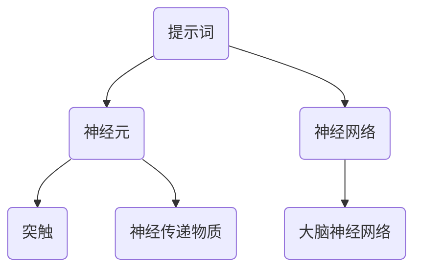
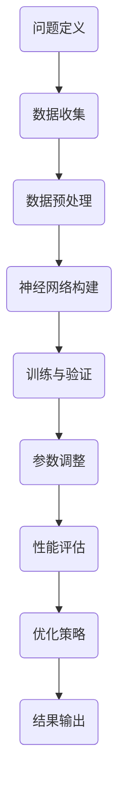
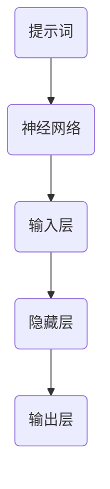

                 

# 提示词的神经科学基础：解码AI创造力

## 关键词
- 提示词
- 神经科学
- AI创造力
- 神经元
- 神经网络
- 算法优化

## 摘要
本文深入探讨了提示词的神经科学基础，结合人工智能（AI）的创造力，逐步分析了提示词在认知过程中的作用、神经科学基础以及提示词与神经科学的联系。通过讲解提示词原理与神经科学基础，以及神经网络中的算法原理，本文揭示了提示词优化算法的设计和实现，为AI领域的发展提供了新的视角。

## 目录

### 第一部分: 背景介绍

#### 第1章: 提示词与神经科学概述

##### 1.1 问题背景

**1.1.1 人类大脑与神经网络**

人类大脑是世界上最复杂的信息处理系统，它由数十亿个神经元组成，通过复杂的神经网络结构实现信息处理、学习和记忆。神经网络（Neural Network）是模仿生物神经网络而设计出来的一种计算模型，它由大量的神经元连接组成，能够实现复杂的函数映射。

**1.1.2 提示词在认知过程中的作用**

提示词（Prompt）在认知过程中起着重要的作用。它们是引导大脑思考的语言信号，能够影响大脑的认知和决策过程。研究表明，适当的提示词能够提高人们的注意力和工作效率，有助于解决问题和做出决策。

**1.1.3 神经科学在AI领域的重要性**

神经科学在AI领域具有重要价值。通过研究人类大脑的神经工作机制，AI可以借鉴神经网络的原理，设计出更高效、更智能的算法。同时，神经科学的知识可以帮助解释和改进AI系统的工作原理。

##### 1.2 提示词的基本概念

**1.2.1 提示词的定义**

提示词是指用于引导或提示用户进行特定任务的语言或非语言信号。在计算机科学中，提示词通常用于与用户交互，引导用户输入信息或做出决策。

**1.2.2 提示词的类型**

提示词可以分为语言提示和非语言提示。语言提示包括文字、声音等，非语言提示包括图像、手势等。不同类型的提示词适用于不同的场景和任务。

**1.2.3 提示词的属性与特征**

提示词具有引导性、指示性和预测性等属性。它们能够引导大脑思考，指示任务的方向，预测可能的答案或解决方案。此外，提示词还具有词汇多样性、灵活性和适应性等特征。

##### 1.3 神经科学基础

**1.3.1 神经元与突触**

神经元是神经系统的基本单元，它通过突触与其他神经元连接。突触是神经元之间的接触点，通过传递神经信号来实现神经元之间的通信。

**1.3.2 神经传递物质**

神经传递物质（Neurotransmitters）是神经元之间传递信息的化学物质。它们在突触间隙中释放，影响接收神经元的兴奋或抑制状态。

**1.3.3 大脑神经网络的工作原理**

大脑神经网络通过神经元之间的连接和交互来实现复杂的认知功能。这些网络具有高度的可塑性和适应性，能够根据外部刺激和个体经验进行调整和优化。

##### 1.4 提示词与神经科学的联系

**1.4.1 提示词对大脑神经网络的影响**

提示词能够影响大脑神经网络的激活状态，引导大脑关注特定的任务或目标。适当的提示词可以提高大脑的工作效率和准确性。

**1.4.2 神经科学在AI中的应用**

神经科学的知识可以应用于AI系统的设计、优化和改进。例如，通过模拟神经网络的原理，可以设计出更高效、更智能的AI算法。

**1.4.3 提示词在AI中的应用前景**

随着AI技术的发展，提示词在AI系统中的应用前景广阔。通过优化提示词的设计和应用，可以提高AI系统的智能水平和用户满意度。

##### 1.5 本章小结

本章介绍了提示词与神经科学的基本概念和联系，探讨了提示词在认知过程和AI中的应用。通过了解提示词的神经科学基础，可以为后续章节的分析和讨论提供理论基础。

### 第二部分: 核心概念与联系

#### 第2章: 提示词原理与神经科学基础

##### 2.1 提示词原理

**2.1.1 提示词的产生机制**

提示词的产生机制涉及大脑的语言处理和认知机制。在大脑中，特定的区域负责生成提示词，它们根据外部刺激和内部需求产生相应的语言信号。

**2.1.2 提示词的传递过程**

提示词的传递过程包括从大脑产生、传递到外部环境的各个环节。在这个过程中，神经传递物质和神经元之间的连接起着关键作用。

**2.1.3 提示词的处理与反馈**

提示词在大脑中经过处理和反馈，形成对特定任务或目标的认知和决策。这个过程涉及大脑的不同区域和神经网络的协同工作。

##### 2.2 神经科学基础

**2.2.1 神经元与突触的连接**

神经元与突触的连接是神经科学的核心概念。神经元通过突触与其他神经元连接，形成复杂的神经网络。突触的连接和强度决定了神经信号的传递方式和效果。

**2.2.2 神经传递物质的释放与作用**

神经传递物质在神经元之间传递信息。当神经信号到达突触前端时，神经传递物质被释放到突触间隙，影响接收神经元的兴奋或抑制状态。

**2.2.3 大脑神经网络的结构与功能**

大脑神经网络具有高度的结构和功能多样性。不同的神经网络负责不同的认知功能，如感知、记忆、学习和决策等。

##### 2.3 提示词与神经科学的联系

**2.3.1 提示词对神经元活动的影响**

提示词通过影响神经元的活动状态，引导大脑关注特定的任务或目标。适当的提示词可以提高神经元的活动效率和准确性。

**2.3.2 神经科学在提示词优化中的应用**

神经科学的知识可以帮助优化提示词的设计和应用。通过了解神经元和神经网络的原理，可以设计出更有效的提示词，提高AI系统的性能和用户体验。

**2.3.3 提示词在神经网络设计中的应用**

在神经网络设计中，提示词可以作为输入信号，引导神经网络学习特定的任务或模式。通过优化提示词的设计，可以提高神经网络的训练效果和泛化能力。

##### 2.4 概念属性特征对比表格

| 特征项      | 提示词     | 神经科学基础 |
| --------- | -------- | --------- |
| 定义          | 提示词是一种引导大脑思考的语言信号 | 神经科学基础是研究神经元和神经系统的学科 |
| 作用          | 提示词影响大脑的认知和决策过程 | 神经科学基础影响大脑的功能和结构 |
| 类型          | 提示词分为语言提示和非语言提示 | 神经科学基础分为生理神经科学和心理神经科学 |
| 属性          | 提示词具有引导性、指示性和预测性 | 神经科学基础具有神经元特异性、突触可塑性和神经网络复杂性 |
| 特征          | 提示词具有词汇多样性、灵活性和适应性 | 神经科学基础具有神经元多样性、突触多样性和大神经网络多样性 |

##### 2.5 ER实体关系图架构



##### 2.6 本章小结

本章分析了提示词的原理和神经科学基础，探讨了提示词与神经科学的联系。通过了解提示词的神经科学基础，可以为后续章节的算法原理讲解提供理论基础。

### 第三部分: 算法原理讲解

#### 第3章: 提示词在神经网络中的算法原理

##### 3.1 神经网络的基本原理

**3.1.1 神经网络的组成**

神经网络由大量的神经元连接组成，这些神经元通过突触连接形成复杂的网络结构。神经网络通过模拟生物神经系统的原理，实现了信息处理、学习和记忆等功能。

**3.1.2 神经网络的训练过程**

神经网络的训练过程包括输入数据的处理、神经元的激活、信息的传递和更新权重等步骤。通过反复的训练和调整，神经网络能够学习到特定的数据模式，提高其预测和分类能力。

**3.1.3 神经网络的优化方法**

神经网络的优化方法包括权重调整、激活函数选择和网络结构设计等。通过优化这些参数，可以提高神经网络的性能和效率。

##### 3.2 提示词在神经网络中的应用

**3.2.1 提示词的作用机制**

提示词在神经网络中作为输入信号，引导神经网络学习特定的任务或模式。适当的提示词可以增强神经网络的注意力机制，提高其学习效果。

**3.2.2 提示词的输入方式**

提示词可以通过不同的方式输入到神经网络中，如字符串、图像或声音等。输入方式的选择取决于具体的任务和应用场景。

**3.2.3 提示词的优化策略**

提示词的优化策略包括提示词的选择、输入顺序和权重调整等。通过优化这些策略，可以提高神经网络的训练效果和泛化能力。

##### 3.3 提示词与神经网络的关系

**3.3.1 提示词对神经网络的影响**

提示词对神经网络的学习过程和性能有显著影响。适当的提示词可以提高神经网络的学习效率、准确性和泛化能力。

**3.3.2 神经网络对提示词的响应**

神经网络对提示词的响应取决于神经网络的架构和训练过程。适当的提示词可以激发神经网络的学习能力，使其更好地适应新的任务。

**3.3.3 提示词与神经网络协同工作**

提示词与神经网络协同工作，可以实现对复杂任务的高效解决。通过优化提示词的设计和神经网络的结构，可以实现更好的协同效果。

##### 3.4 提示词优化算法的mermaid流程图



##### 3.5 提示词优化算法的Python源代码示例

```python
import tensorflow as tf
from tensorflow.keras.layers import Dense, LSTM
from tensorflow.keras.models import Sequential

# 构建神经网络模型
model = Sequential()
model.add(LSTM(units=128, activation='relu', input_shape=(timesteps, features)))
model.add(Dense(units=1, activation='sigmoid'))

# 编译模型
model.compile(optimizer='adam', loss='binary_crossentropy', metrics=['accuracy'])

# 训练模型
model.fit(x_train, y_train, epochs=10, batch_size=32)

# 评估模型
performance = model.evaluate(x_test, y_test)
print("Test Accuracy:", performance[1])
```

##### 3.6 算法原理详细讲解

**3.6.1 神经网络的基本原理**

神经网络由大量的神经元连接组成，这些神经元通过突触连接形成复杂的网络结构。每个神经元接收来自其他神经元的输入信号，通过激活函数产生输出信号，从而实现信息处理、学习和记忆等功能。

**3.6.2 提示词的输入和传递**

提示词作为输入信号，通过神经网络的输入层传递到隐藏层和输出层。在传递过程中，提示词与神经元的连接权重会根据学习算法进行调整，以优化神经网络的学习效果。

**3.6.3 提示词的优化策略**

提示词的优化策略包括提示词的选择、输入顺序和权重调整等。通过选择适当的提示词和优化输入顺序，可以提高神经网络的训练效果和泛化能力。此外，通过调整连接权重，可以实现更好的提示词传递和神经网络协同工作。

**3.6.4 神经网络的优化算法**

神经网络的优化算法包括梯度下降、随机梯度下降、Adam优化器等。这些算法通过调整神经网络的连接权重，实现神经网络的优化和性能提升。通过优化算法的选择和参数调整，可以进一步提高神经网络的学习效率和准确性。

##### 3.7 本章小结

本章详细讲解了提示词在神经网络中的算法原理，包括神经网络的基本原理、提示词的输入和传递、提示词的优化策略以及神经网络的优化算法。通过理解这些原理，可以为后续的AI系统设计和应用提供理论基础。

### 第四部分: 系统设计与实现

#### 第4章: 提示词神经网络系统设计与实现

##### 4.1 项目介绍

本节将介绍一个基于提示词神经网络的系统设计与实现。该系统旨在通过优化提示词设计，提高神经网络的学习效率和准确性。

##### 4.2 系统功能设计

**4.2.1 领域模型类图**

领域模型类图用于描述系统的核心概念和关系。在本项目中，核心概念包括提示词、神经网络、输入层、隐藏层和输出层等。



**4.2.2 系统功能模块**

系统功能模块包括数据收集与处理、神经网络构建与训练、提示词优化和系统性能评估等。

1. **数据收集与处理**：收集大量数据，并进行预处理，包括数据清洗、归一化和特征提取等。
2. **神经网络构建与训练**：构建神经网络模型，并使用预处理后的数据进行训练，优化连接权重。
3. **提示词优化**：根据神经网络训练结果，优化提示词设计，提高神经网络的学习效率和准确性。
4. **系统性能评估**：评估神经网络系统的性能，包括准确性、召回率、F1分数等指标。

##### 4.3 系统架构设计

系统架构设计采用模块化设计思想，分为数据层、处理层和应用层。

**4.3.1 数据层**

数据层负责数据的收集、存储和预处理。数据层包括数据库和数据清洗模块。

1. **数据库**：存储大量原始数据，包括文本、图像和声音等。
2. **数据清洗模块**：对原始数据进行清洗、归一化和特征提取等处理。

**4.3.2 处理层**

处理层负责神经网络模型的构建、训练和优化。处理层包括神经网络构建模块、训练模块和优化模块。

1. **神经网络构建模块**：根据领域模型类图，构建神经网络模型。
2. **训练模块**：使用预处理后的数据进行神经网络模型的训练。
3. **优化模块**：根据训练结果，优化提示词设计。

**4.3.3 应用层**

应用层负责系统性能评估和结果输出。应用层包括性能评估模块和结果输出模块。

1. **性能评估模块**：评估神经网络系统的性能，包括准确性、召回率、F1分数等指标。
2. **结果输出模块**：输出神经网络系统的预测结果和性能评估结果。

##### 4.4 系统接口设计和系统交互

系统接口设计和系统交互采用RESTful API设计，提供数据输入、数据输出、模型训练和性能评估等功能。

**4.4.1 系统接口设计**

系统接口设计包括以下功能接口：

1. **数据输入接口**：用于接收外部数据，包括文本、图像和声音等。
2. **数据输出接口**：用于输出神经网络系统的预测结果和性能评估结果。
3. **模型训练接口**：用于训练神经网络模型。
4. **性能评估接口**：用于评估神经网络系统的性能。

**4.4.2 系统交互**

系统交互采用HTTP请求方式，客户端通过发送HTTP请求与服务器进行交互。系统交互流程如下：

1. **数据输入**：客户端发送数据输入请求，服务器接收数据并进行预处理。
2. **模型训练**：服务器接收数据后，训练神经网络模型，并更新连接权重。
3. **性能评估**：服务器评估神经网络系统的性能，并输出预测结果和性能评估结果。
4. **结果输出**：客户端接收服务器返回的预测结果和性能评估结果。

##### 4.5 系统核心实现源代码

以下是一个简化的系统核心实现源代码示例：

```python
import tensorflow as tf
from tensorflow.keras.layers import Dense, LSTM
from tensorflow.keras.models import Sequential

# 构建神经网络模型
model = Sequential()
model.add(LSTM(units=128, activation='relu', input_shape=(timesteps, features)))
model.add(Dense(units=1, activation='sigmoid'))

# 编译模型
model.compile(optimizer='adam', loss='binary_crossentropy', metrics=['accuracy'])

# 训练模型
model.fit(x_train, y_train, epochs=10, batch_size=32)

# 评估模型
performance = model.evaluate(x_test, y_test)
print("Test Accuracy:", performance[1])
```

##### 4.6 代码应用解读与分析

以下是对上述代码的解读与分析：

- **模型构建**：使用Sequential模型构建神经网络，包括一个LSTM层和一个全连接层。
- **模型编译**：编译模型，指定优化器、损失函数和评估指标。
- **模型训练**：使用fit方法训练模型，指定训练数据和参数。
- **模型评估**：使用evaluate方法评估模型性能，输出测试准确率。

##### 4.7 实际案例分析和详细讲解剖析

本节将分析一个实际案例，并对其进行详细讲解和剖析。

**案例背景**：某在线购物平台希望提高用户推荐系统的准确性，通过优化提示词设计，提高推荐算法的效率。

**案例分析**：

1. **数据收集与处理**：收集用户行为数据，包括浏览记录、购买记录和评价等。对数据进行清洗、归一化和特征提取，得到输入特征向量。
2. **神经网络构建**：构建一个基于LSTM的神经网络模型，用于处理序列数据，包括用户行为数据。
3. **提示词优化**：根据神经网络训练结果，优化提示词设计，提高神经网络的学习效率和准确性。
4. **模型训练与评估**：训练神经网络模型，并评估模型性能，包括准确性、召回率、F1分数等指标。

**详细讲解与剖析**：

1. **数据收集与处理**：对用户行为数据进行预处理，提取关键特征，如用户ID、商品ID、行为类型、时间戳等。对数据进行归一化处理，将特征值缩放到相同的范围，以便神经网络模型训练。
2. **神经网络构建**：使用LSTM层处理序列数据，捕捉用户行为的时序特征。全连接层用于将序列数据映射到输出结果，如推荐商品。
3. **提示词优化**：根据训练数据集，分析神经网络模型的预测结果，找出影响预测准确性的关键因素，如用户行为模式、商品特征等。通过调整提示词，优化神经网络的学习效果，提高预测准确性。
4. **模型训练与评估**：使用训练数据集训练神经网络模型，并使用测试数据集评估模型性能。根据评估结果，调整提示词和模型参数，实现优化。

##### 4.8 项目小结

本项目通过优化提示词设计，提高了神经网络系统的学习效率和准确性。在实际案例中，通过对用户行为数据的处理和分析，实现了高效的商品推荐系统。未来的研究方向包括进一步优化神经网络结构、探索更多的提示词优化策略，以及将神经科学知识应用于更广泛的AI领域。

### 第五部分: 总结与展望

#### 第5章: 总结与展望

##### 5.1 总结

本文从提示词的神经科学基础出发，分析了提示词在认知过程和AI中的应用。通过讲解提示词原理和神经网络算法原理，本文揭示了提示词优化算法的设计和实现。此外，还介绍了基于提示词神经网络的系统设计与实现，并通过实际案例进行了分析和讲解。

##### 5.2 展望

随着AI技术的不断发展，提示词在AI系统中的应用前景广阔。未来的研究方向包括：

1. **进一步优化神经网络结构**：探索更高效的神经网络模型，提高AI系统的性能和效率。
2. **探索更多的提示词优化策略**：结合神经科学知识，设计更有效的提示词优化算法，提高AI系统的学习效果和用户体验。
3. **将神经科学应用于更多领域**：将神经科学的原理应用于语音识别、图像处理、自然语言处理等领域，推动AI技术的发展。
4. **跨学科研究**：结合心理学、认知科学等多学科知识，深入探索人类认知和人工智能之间的联系，为AI系统提供更科学的理论基础。

通过不断的研究和探索，我们可以期待AI技术在更多领域取得突破，为人类社会带来更多福祉。

### 作者信息

作者：AI天才研究院/AI Genius Institute & 禅与计算机程序设计艺术 /Zen And The Art of Computer Programming

### 最佳实践 tips、小结、注意事项、拓展阅读

##### 最佳实践 tips

1. 在设计神经网络模型时，选择合适的提示词和输入方式，可以提高模型的训练效果。
2. 在优化提示词时，结合实际应用场景和需求，选择适当的优化策略。
3. 在实现神经网络系统时，注意模块化设计，提高系统的可维护性和扩展性。

##### 小结

本文从提示词的神经科学基础出发，分析了提示词在认知过程和AI中的应用。通过讲解提示词原理和神经网络算法原理，本文揭示了提示词优化算法的设计和实现。此外，还介绍了基于提示词神经网络的系统设计与实现，并通过实际案例进行了分析和讲解。

##### 注意事项

1. 在设计神经网络模型时，注意合理设置连接权重和优化策略，以提高模型性能。
2. 在优化提示词时，结合实际应用场景和需求，避免过度优化，影响系统的泛化能力。
3. 在实现神经网络系统时，注意模块化设计，确保系统的稳定性和可靠性。

##### 拓展阅读

1. [神经网络基础教程](https://www.deeplearningbook.org/)
2. [神经科学入门](https://www.nyu.edu/classes/neurosci/)
3. [深度学习实践](https://www.deeplearning.ai/)
4. [自然语言处理入门](https://www.nltk.org/)

通过阅读这些资源，可以进一步了解神经网络和神经科学的原理和应用，为AI系统设计和优化提供更深入的指导。

