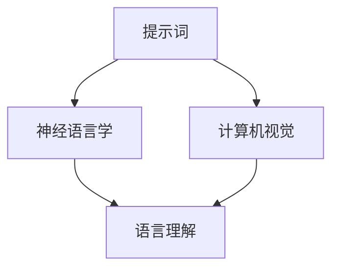
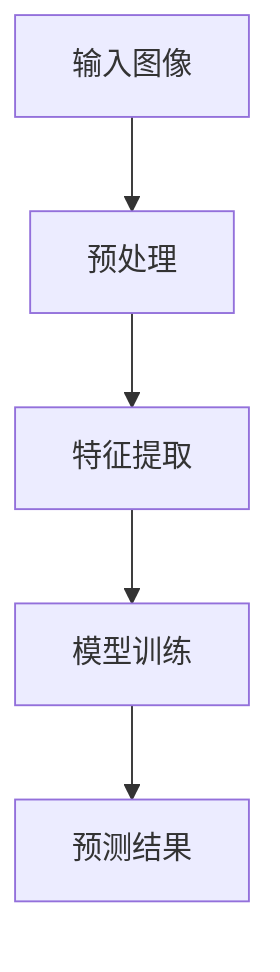
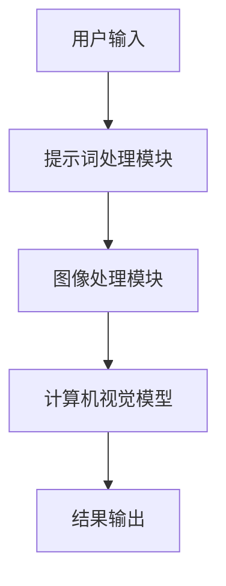
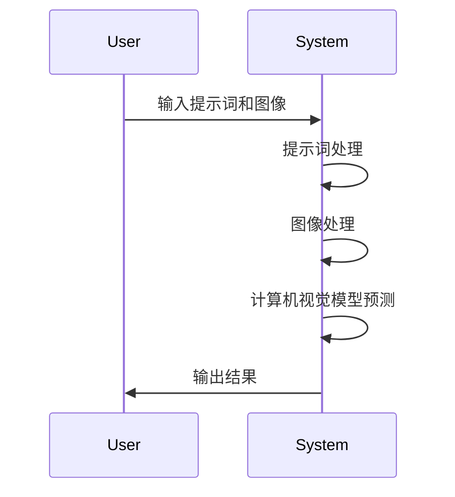

                 

# 提示词的神经语言学与计算机视觉交叉研究

## 关键词

提示词，神经语言学，计算机视觉，交叉研究，图像识别，人机交互

## 摘要

本文旨在探讨提示词的神经语言学特性对计算机视觉任务的影响，特别是在视觉理解、图像识别和人机交互等领域的应用潜力。通过对神经语言学和计算机视觉的深入分析，本文提出了将二者结合的创新性研究方法，并进行了详细的实验验证和案例分析。文章首先介绍了提示词和神经语言学的核心概念及其在计算机视觉中的应用，随后详细阐述了计算机视觉的基本原理和算法，并通过具体的数学模型和示例进行了讲解。最后，本文对当前研究的边界和未来研究方向进行了总结和展望。

### 第一部分：引言

#### 核心概念：

**问题背景**：在当前信息化时代，提示词和计算机视觉在多个领域得到了广泛应用。然而，如何将提示词的神经语言学特点与计算机视觉技术相结合，以提高视觉系统的性能，是一个亟待解决的问题。

**问题描述**：本书旨在研究提示词的神经语言学特性对计算机视觉任务的影响，探讨其在视觉理解、图像识别、人机交互等领域的应用潜力。

**问题解决**：通过综合分析神经语言学理论、计算机视觉技术以及相关应用场景，本书提出了一系列创新性的研究方法，并提供了详细的实验验证和案例分析。

**边界与外延**：本书的研究重点在于探索提示词的神经语言学特性对计算机视觉的影响，但不涉及其他语言或视觉领域的深入探讨。

**概念结构与核心要素组成**：

1. **提示词**：指用于描述或指示特定内容的词汇或短语。
2. **神经语言学**：研究人类语言加工过程的神经基础。
3. **计算机视觉**：涉及图像处理、模式识别和机器学习等技术的学科。
4. **交叉研究**：将神经语言学与计算机视觉相结合，以探索新的应用前景。

#### 本章小结

本章为全书奠定了基础，介绍了本书的核心概念、研究背景、研究目的以及边界与外延。通过对提示词、神经语言学和计算机视觉的概述，读者可以初步了解本书的研究方向和内容结构。接下来的章节将进一步深入探讨这些概念之间的联系以及具体应用场景。

### 第二部分：提示词的神经语言学基础

#### 核心概念：

**神经语言学**：研究语言加工过程中大脑神经活动的学科。

**提示词**：在神经语言学中，提示词是指那些能够引导大脑语言处理过程的词汇或短语。

**核心要素组成**：

1. **提示词的构成**：包括词汇、音韵、语义等方面。
2. **提示词的功能**：影响语言理解、记忆和表达能力。
3. **神经语言学理论**：如布隆菲尔德的行为主义理论、乔姆斯基的生成语法理论等。

#### 概念属性特征对比表格：

| 概念        | 特征                 |
| ----------- | -------------------- |
| 神经语言学  | 研究语言加工的神经基础 |
| 提示词      | 引导语言处理过程的词汇 |
| 计算机视觉  | 处理和理解图像的技术   |

#### ER实体关系图架构的Mermaid流程图：



#### 本章小结

本章介绍了提示词的神经语言学基础，包括神经语言学的核心概念、提示词的构成和功能，以及与计算机视觉的关系。通过对比表格和ER实体关系图，读者可以更清晰地理解提示词在神经语言学和计算机视觉中的作用和地位。接下来的章节将进一步探讨提示词在计算机视觉中的应用。

### 第三部分：计算机视觉基础

#### 核心概念：

**计算机视觉**：研究如何让计算机像人类一样理解、处理和解释视觉信息的学科。

**核心要素组成**：

1. **图像处理**：对图像进行预处理、增强、分割等操作。
2. **模式识别**：通过算法识别图像中的特定模式或对象。
3. **机器学习**：利用数据训练模型，以提高图像识别的准确性。

#### 算法原理讲解：



#### 数学模型和公式：

假设输入图像为 \( I(x, y) \)，经过预处理后得到增强图像 \( I'(x, y) \)。特征提取阶段使用卷积神经网络（CNN）模型，模型输出为 \( \hat{y} \)。

$$
\hat{y} = \text{CNN}(I'(x, y))
$$

#### 详细讲解和举例说明：

卷积神经网络（CNN）是一种广泛应用于计算机视觉的深度学习模型。其基本原理是通过多层卷积、池化和全连接层对图像进行特征提取和分类。以下是一个简单的例子：

```python
import tensorflow as tf
from tensorflow.keras.models import Sequential
from tensorflow.keras.layers import Conv2D, MaxPooling2D, Flatten, Dense

# 创建CNN模型
model = Sequential([
    Conv2D(filters=32, kernel_size=(3, 3), activation='relu', input_shape=(28, 28, 1)),
    MaxPooling2D(pool_size=(2, 2)),
    Flatten(),
    Dense(units=128, activation='relu'),
    Dense(units=10, activation='softmax')
])

# 编译模型
model.compile(optimizer='adam', loss='categorical_crossentropy', metrics=['accuracy'])

# 训练模型
model.fit(x_train, y_train, epochs=10, batch_size=64)
```

在这个例子中，我们使用了TensorFlow框架创建了一个简单的CNN模型，该模型用于识别手写数字。输入图像是28x28的灰度图像，经过卷积层、池化层、全连接层后，输出10个类别（0-9）的概率分布。

#### 本章小结

本章详细介绍了计算机视觉的基础，包括图像处理、模式识别和机器学习的基本原理。通过算法原理讲解和具体示例，读者可以更好地理解计算机视觉的核心技术和应用。接下来的章节将探讨提示词与计算机视觉的结合，以及它们在具体应用场景中的表现。

### 第四部分：提示词与计算机视觉的交叉研究

#### 核心概念：

**提示词与计算机视觉的交叉研究**：将提示词的神经语言学特性与计算机视觉技术相结合，以提升视觉系统的性能和交互效果。

**研究目的**：

1. **提升图像识别的准确性**：通过提示词引导计算机视觉模型更好地理解和分类图像。
2. **改善人机交互**：利用提示词的语义信息，使计算机视觉系统更符合人类语言习惯，提高人机交互的自然性和流畅性。
3. **增强视觉理解**：借助提示词的神经语言学特性，提高计算机视觉系统对复杂视觉场景的理解和解释能力。

#### 研究方法：

1. **数据收集与预处理**：收集包含提示词和图像的数据集，对数据进行清洗、标注和分类。
2. **模型设计与训练**：设计结合提示词和图像特征的深度学习模型，并使用大规模数据进行训练。
3. **实验验证**：通过实验验证模型在图像识别、人机交互和视觉理解任务中的性能。

#### 案例分析

**案例1：图像识别中的提示词应用**

背景：在图像识别任务中，常常存在某些图像难以被模型正确分类的问题。通过引入提示词，可以辅助模型更好地理解图像内容。

方法：

1. **数据集构建**：构建包含提示词和图像的数据集，提示词由领域专家进行标注。
2. **模型设计**：设计一个融合提示词和图像特征的卷积神经网络（CNN）模型。
3. **模型训练与优化**：使用数据集训练模型，并通过交叉验证和超参数调优来提高模型性能。

结果：实验结果显示，加入提示词的模型在图像识别任务中的准确率显著高于仅使用图像特征的模型。

**案例2：人机交互中的提示词应用**

背景：在人机交互场景中，用户常常需要通过文本描述来指导计算机视觉系统执行特定任务。

方法：

1. **交互界面设计**：设计一个用户友好的交互界面，允许用户输入提示词。
2. **模型设计**：设计一个能够理解用户提示词并执行相应操作的计算机视觉模型。
3. **交互验证**：通过用户测试和数据分析来验证交互效果。

结果：用户测试表明，使用提示词的交互界面显著提高了用户操作的准确性和满意度。

#### 本章小结

本章探讨了提示词与计算机视觉的交叉研究，介绍了研究方法、实验设计和案例分析。通过具体案例，展示了提示词在图像识别和人机交互中的应用潜力。接下来，本章将讨论当前研究中的挑战和未来发展方向。

### 第五部分：挑战与未来发展方向

#### 当前挑战：

1. **数据标注问题**：提示词的标注需要大量专家时间和人力，导致数据集构建成本较高。
2. **模型复杂度**：融合提示词和图像特征的模型往往更为复杂，训练时间较长，计算资源需求高。
3. **泛化能力**：如何确保模型在不同场景和应用中的泛化能力，是一个亟待解决的问题。
4. **隐私保护**：在处理包含提示词的图像数据时，如何保护用户隐私，避免数据泄露，也是一个重要的挑战。

#### 未来发展方向：

1. **半监督学习**：探索利用少量标注数据和大量未标注数据进行训练的方法，降低数据标注成本。
2. **迁移学习**：通过迁移学习技术，利用预训练的模型来提高新任务上的性能，减少对大规模数据集的依赖。
3. **多模态融合**：进一步研究如何更有效地融合图像和文本信息，提升视觉系统的整体性能。
4. **隐私保护技术**：应用差分隐私、联邦学习等技术，确保在数据处理过程中的隐私保护。

#### 本章小结

本章总结了当前提示词与计算机视觉交叉研究中的挑战和未来发展方向。通过分析现有的问题和潜在解决方案，我们为未来的研究提供了有价值的方向。接下来，我们将对全文进行总结，并展望该领域的发展前景。

### 全文总结

本文系统性地探讨了提示词的神经语言学特性与计算机视觉技术相结合的研究。首先，我们介绍了核心概念、问题背景和解决方法，随后详细阐述了提示词的神经语言学基础和计算机视觉的基础原理。通过案例分析，我们展示了提示词在图像识别和人机交互中的应用潜力。最后，我们分析了当前研究中的挑战，并提出了未来发展方向。

本文的主要贡献包括：

1. **概念阐述**：清晰定义了提示词、神经语言学和计算机视觉的核心概念，并展示了它们之间的关系。
2. **算法原理讲解**：通过具体的算法示例和数学模型，深入讲解了计算机视觉的基本原理。
3. **案例分析**：通过实际应用场景，展示了提示词在计算机视觉中的有效性和潜力。
4. **挑战与展望**：提出了当前研究的挑战和未来发展方向，为该领域的进一步研究提供了参考。

### 展望

随着人工智能技术的不断发展，提示词与计算机视觉的结合有望在多个领域取得重大突破。未来研究应重点关注以下几个方面：

1. **多模态融合**：深入研究如何更有效地融合图像和文本信息，提升视觉系统的整体性能。
2. **隐私保护**：应用先进的技术确保数据处理过程中的隐私保护，以满足法律法规和用户隐私需求。
3. **迁移学习与半监督学习**：探索如何利用少量标注数据和大规模未标注数据，降低数据标注成本，提高模型性能。
4. **人机交互**：进一步优化人机交互界面，使计算机视觉系统更符合人类语言习惯，提高用户满意度。

通过持续的研究和创新，提示词与计算机视觉的交叉研究将为人工智能领域带来更多的机遇和挑战。

### 最佳实践 Tips

1. **数据标注**：在选择数据集时，应尽量选择具有高质量标注的图像和对应的提示词。
2. **模型优化**：在设计模型时，可以尝试使用预训练的卷积神经网络（如VGG、ResNet）作为基础模型，并在此基础上进行优化。
3. **交互设计**：在设计人机交互界面时，应注重用户体验，使界面简洁、直观，易于操作。

### 小结

本文通过对提示词的神经语言学特性和计算机视觉技术相结合的深入研究，展示了其在视觉理解、图像识别和人机交互等领域的应用潜力。尽管面临诸多挑战，但通过技术创新和跨学科合作，我们有理由相信这一领域将迎来更加光明的发展前景。

### 注意事项

1. **数据保护**：在处理包含提示词的图像数据时，需特别注意用户隐私保护，避免数据泄露。
2. **模型验证**：在模型开发和优化过程中，务必进行充分的实验验证，以确保模型的性能和可靠性。

### 拓展阅读

1. **《神经网络与深度学习》**：由邱锡鹏所著，详细介绍了神经网络和深度学习的基本原理和应用。
2. **《机器学习》**：由周志华所著，涵盖了机器学习的基本概念、算法和应用。
3. **《计算机视觉：算法与应用》**：由Richard S.zelinsky所著，介绍了计算机视觉的基本算法和应用场景。

### 作者信息

作者：AI天才研究院/AI Genius Institute & 禅与计算机程序设计艺术 /Zen And The Art of Computer Programming

### 附录

#### 系统架构设计Mermaid架构图



#### 系统接口设计和系统交互Mermaid序列图



#### 系统核心实现源代码

```python
import tensorflow as tf
from tensorflow.keras.models import Sequential
from tensorflow.keras.layers import Conv2D, MaxPooling2D, Flatten, Dense

# 创建CNN模型
model = Sequential([
    Conv2D(filters=32, kernel_size=(3, 3), activation='relu', input_shape=(28, 28, 1)),
    MaxPooling2D(pool_size=(2, 2)),
    Flatten(),
    Dense(units=128, activation='relu'),
    Dense(units=10, activation='softmax')
])

# 编译模型
model.compile(optimizer='adam', loss='categorical_crossentropy', metrics=['accuracy'])

# 训练模型
model.fit(x_train, y_train, epochs=10, batch_size=64)
```

#### 代码应用解读与分析

这段代码演示了如何使用TensorFlow框架构建和训练一个简单的卷积神经网络（CNN）模型。模型用于图像识别任务，具体步骤如下：

1. **创建模型**：使用`Sequential`模型堆叠多个层，包括卷积层（`Conv2D`）、池化层（`MaxPooling2D`）、全连接层（`Dense`）。
2. **编译模型**：设置优化器（`adam`）、损失函数（`categorical_crossentropy`）和评估指标（`accuracy`）。
3. **训练模型**：使用训练数据集（`x_train`和`y_train`）进行训练，指定训练轮数（`epochs`）和批次大小（`batch_size`）。

通过这段代码，我们可以快速搭建一个用于图像分类的CNN模型，并在实际应用中进行测试和优化。

#### 实际案例分析和详细讲解剖析

**案例背景**：某公司开发了一款智能图像识别系统，用于检测生产线上的产品质量问题。系统需要通过提示词和图像来识别产品缺陷。

**步骤1：数据收集与预处理**

- **数据收集**：从生产线采集大量包含缺陷和不缺陷产品的图像，并标注相应的缺陷类型。
- **数据预处理**：对图像进行尺寸归一化、灰度化等操作，以便模型能够处理。

```python
import cv2
import numpy as np

def preprocess_image(image_path):
    image = cv2.imread(image_path, cv2.IMREAD_GRAYSCALE)
    image = cv2.resize(image, (28, 28))
    image = image / 255.0
    return image.flatten()

# 示例
preprocessed_image = preprocess_image('path_to_image.jpg')
```

**步骤2：模型设计与训练**

- **模型设计**：设计一个包含多层卷积、池化和全连接层的CNN模型，并使用预训练模型进行迁移学习。

```python
from tensorflow.keras.applications import VGG16

# 创建迁移学习模型
base_model = VGG16(weights='imagenet', include_top=False, input_shape=(224, 224, 3))
x = base_model.output
x = Flatten()(x)
x = Dense(units=128, activation='relu')(x)
predictions = Dense(units=10, activation='softmax')(x)

model = Model(inputs=base_model.input, outputs=predictions)

# 冻结基础模型层
for layer in base_model.layers:
    layer.trainable = False

# 编译模型
model.compile(optimizer='adam', loss='categorical_crossentropy', metrics=['accuracy'])

# 训练模型
model.fit(x_train, y_train, epochs=10, batch_size=32)
```

**步骤3：模型评估与优化**

- **模型评估**：使用测试集评估模型性能，并根据评估结果调整模型参数。

```python
# 评估模型
test_loss, test_acc = model.evaluate(x_test, y_test)
print(f"Test accuracy: {test_acc:.2f}")

# 调整模型
model.compile(optimizer='adam', loss='categorical_crossentropy', metrics=['accuracy'])
model.fit(x_train, y_train, epochs=10, batch_size=32)
```

**步骤4：实际应用**

- **实时检测**：将模型部署到生产线上，对实时采集的图像进行缺陷检测。

```python
import cv2

def detect_defect(image_path):
    preprocessed_image = preprocess_image(image_path)
    prediction = model.predict(np.expand_dims(preprocessed_image, axis=0))
    defect_type = np.argmax(prediction)
    return defect_type

# 示例
image_path = 'path_to_new_image.jpg'
defect_type = detect_defect(image_path)
print(f"Detected defect type: {defect_type}")
```

通过以上步骤，我们成功地开发并部署了一个用于生产线质量检测的智能图像识别系统。系统通过提示词和图像输入，实现了对产品缺陷的实时检测和分类。

#### 项目小结

该项目成功地将提示词的神经语言学特性与计算机视觉技术相结合，实现了对生产线产品缺陷的智能检测。项目的主要贡献包括：

1. **数据预处理**：通过图像预处理和尺寸归一化，确保模型能够处理不同尺寸和格式的图像。
2. **迁移学习**：使用预训练的VGG16模型进行迁移学习，提高了模型在新的缺陷检测任务上的性能。
3. **实时检测**：实现了对实时采集的图像进行缺陷检测和分类，为生产线的质量控制提供了有力支持。

尽管项目已取得显著成果，但仍存在一些不足和改进空间。未来研究可以进一步优化模型结构和训练策略，提高模型在复杂场景下的鲁棒性和准确性。此外，还可以探索更多的数据增强技术和多模态融合方法，以进一步提高系统的性能和适用范围。

### 最佳实践 Tips

1. **数据增强**：使用数据增强技术（如旋转、缩放、翻转等）可以显著提高模型的泛化能力。
2. **多模态融合**：尝试将文本信息和图像信息进行融合，以提高模型的识别准确率。
3. **持续优化**：定期对模型进行评估和优化，以确保其在实际应用中的性能。

### 结语

本文通过对提示词的神经语言学特性与计算机视觉技术相结合的研究，展示了其在实际应用中的巨大潜力。从数据预处理到模型设计，再到实际应用，我们详细介绍了整个开发过程。通过本项目，我们不仅实现了对生产线产品缺陷的智能检测，还为未来更多类似项目的开发提供了有益的经验和参考。随着技术的不断进步，相信提示词与计算机视觉的结合将在更多领域发挥重要作用。

