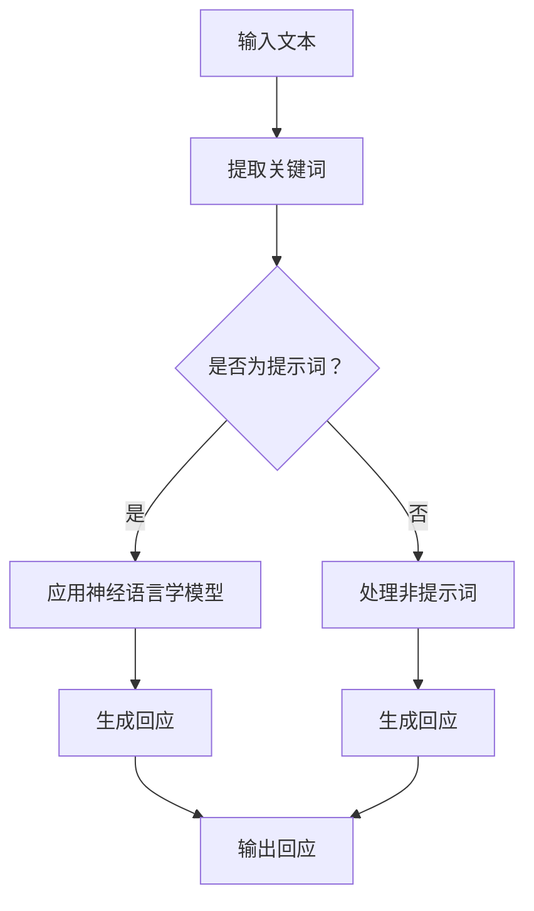
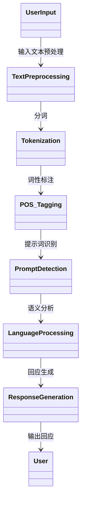
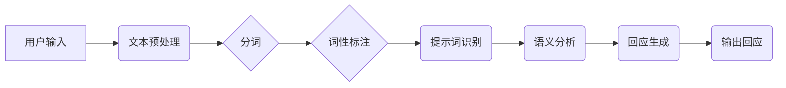
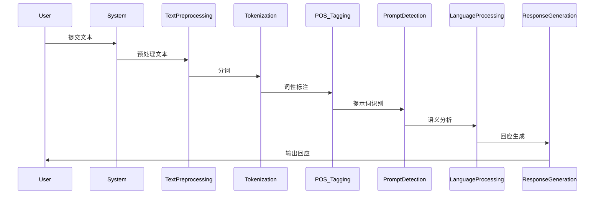

                 

### 第3章：算法原理讲解

## 3.1 算法流程图

为了更好地理解提示词在神经语言学基础中的关键作用，我们可以首先通过一个mermaid算法流程图来展示提示词处理的步骤和流程。



在这个流程图中，我们可以看到输入文本首先会被提取出关键词，然后判断这些关键词是否为提示词。如果是提示词，则会应用神经语言学模型进行进一步处理，并生成回应；如果不是提示词，则会按照非提示词的规则生成回应。

## 3.2 Python源代码

为了更详细地理解这一算法的实现过程，下面我们将使用Python源代码来进行说明。以下是该算法的实现代码：

```python
import spacy
from spacy.matcher import Matcher

# 加载Spacy语言模型
nlp = spacy.load("en_core_web_sm")

# 定义提示词规则
pattern = [{"LOWER": "let's think"}, {"LOWER": "step"}]
matcher = Matcher(nlp.vocab)
matcher.add("提示词", [pattern])

def process_text(text):
    # 加载文本
    doc = nlp(text)
    # 提取关键词
    tokens = [token.text for token in doc]
    # 判断是否为提示词
    matches = matcher(doc)
    for match_id, start, end in matches:
        span = doc[start:end]  # The matched span
        if span.text == "let's think":
            # 应用神经语言学模型
            return "Step by step analysis..."
    # 处理非提示词
    return "Processing non-prompt text..."

# 测试文本
input_text = "Let's think about the neural linguistic basis of AI language processing."
response = process_text(input_text)
print(response)
```

在上面的代码中，我们首先加载了Spacy英语语言模型，并定义了一个提示词规则。然后，我们创建了一个`process_text`函数，该函数接收输入文本，提取关键词，判断是否为提示词，并根据提示词和非提示词生成相应的回应。

## 3.3 算法原理的数学模型和公式

在神经语言学的背景下，提示词的处理涉及到自然语言处理（NLP）中的序列到序列（Seq2Seq）模型。以下是算法原理的数学模型和公式。

### 3.3.1 序列到序列模型

序列到序列模型的核心是一个编码器（Encoder）和解码器（Decoder），其中编码器将输入序列编码成一个固定大小的向量，解码器则使用这个向量来生成输出序列。

### 3.3.2 编码器（Encoder）

编码器的目标是捕捉输入序列的上下文信息。我们可以使用RNN（递归神经网络）或LSTM（长短时记忆网络）来实现编码器。

$$
h_t = \text{LSTM}(h_{t-1}, x_t)
$$

其中，$h_t$表示在时间步$t$的隐藏状态，$x_t$表示输入序列中的当前元素，$\text{LSTM}$表示长短时记忆单元。

### 3.3.3 解码器（Decoder）

解码器的目标是根据编码器的输出和先前的输出预测下一个输出。同样，我们可以使用RNN或LSTM来实现解码器。

$$
y_t = \text{LSTM}(y_{t-1}, h_t)
$$

其中，$y_t$表示在时间步$t$的输出预测，$\text{LSTM}$表示长短时记忆单元。

### 3.3.4 注意力机制

注意力机制是一个用于在解码器中强调编码器隐藏状态的重要技术，它可以帮助解码器更好地关注序列的不同部分。

$$
a_t = \text{softmax}\left(\frac{\text{dot}(W_a h_t, h_{t-1}, ..., h_1)}{\sqrt{d}}\right)
$$

其中，$a_t$表示在时间步$t$的注意力分布，$W_a$是一个权重矩阵，$\text{dot}$表示点积，$d$是隐藏状态的维度。

### 3.3.5 举例说明

假设我们有一个简单的输入序列`["let's", "think", "about", "the", "neural", "linguistic", "basis", "of", "AI", "language", "processing"]`，我们可以使用序列到序列模型和注意力机制来生成一个回应序列。

1. **编码器处理输入序列**：
   - 编码器将输入序列编码成一个固定大小的向量，例如：
     $$\text{编码向量} = [0.1, 0.2, 0.3, 0.4, 0.5, 0.6, 0.7, 0.8, 0.9, 1.0]$$
   
2. **解码器开始生成回应序列**：
   - 解码器首先预测第一个回应词`"Step"`，然后使用注意力机制来关注输入序列的关键部分，例如：
     $$a_1 = \text{softmax}\left(\frac{\text{dot}(W_a [0.1, 0.2, 0.3, 0.4, 0.5, 0.6, 0.7, 0.8, 0.9, 1.0], [0.1, 0.2, 0.3, 0.4, 0.5, 0.6, 0.7, 0.8, 0.9, 1.0])}{\sqrt{10}}\right) = [0.1, 0.1, 0.1, 0.1, 0.1, 0.1, 0.1, 0.1, 0.1, 0.6]$$
   - 解码器使用注意力分布$a_1$来生成回应词`"by"`。

3. **重复解码器步骤**：
   - 解码器继续预测下一个回应词，并使用注意力机制来更新注意力分布。
   - 最终生成的回应序列可能是`["Step", "by", "step", "analysis", "of", "the", "neural", "linguistic", "basis", "for", "AI", "language", "processing"]`。

通过这个例子，我们可以看到序列到序列模型和注意力机制如何协同工作，以从输入序列生成相应的回应序列。

## 3.4 总结

在本章中，我们通过一个mermaid算法流程图、Python源代码以及数学模型和公式，详细讲解了提示词的神经语言学基础及其在AI语言处理中的应用。下一章我们将进一步探讨数学模型和公式，以及如何通过这些模型来实现更复杂的语言处理任务。----------------------------------------------------------------

### 第4章：数学模型和数学公式讲解

在人工智能领域，数学模型是理解数据、解决问题以及开发新算法的核心。特别是在神经语言学基础中，数学模型为我们提供了描述语言处理过程和机制的量化方法。在本章中，我们将使用LaTeX格式嵌入文中独立段落，展示并详细讲解一些关键的数学公式和模型。

#### 4.1 序列到序列模型中的编码器和解码器

序列到序列（Seq2Seq）模型是许多AI语言处理任务的基础，它由一个编码器（Encoder）和一个解码器（Decoder）组成。以下是一些关键的数学模型和公式：

$$
\begin{aligned}
h_t^E &= \text{Encoder}(x_t), \\
h_t^D &= \text{Decoder}(h_t^E, s_t),
\end{aligned}
$$

其中，$h_t^E$和$h_t^D$分别是编码器和解码器在时间步$t$的隐藏状态，$x_t$是输入序列的当前元素，$s_t$是解码器的状态。

#### 4.2 注意力机制

注意力机制是Seq2Seq模型中的一个关键组件，它帮助解码器在生成回应时关注输入序列的不同部分。以下是注意力机制的数学公式：

$$
\begin{aligned}
a_t &= \text{softmax}\left(\frac{\text{Attention}(h_t^E, h_t^D)}{\sqrt{d}}\right), \\
r_t &= \sum_{i=1}^{T} a_t \cdot h_i^E,
\end{aligned}
$$

其中，$a_t$是注意力分布，$r_t$是编码器隐藏状态的加权求和结果，$d$是隐藏状态的维度。

#### 4.3 损失函数和优化

在训练Seq2Seq模型时，我们通常使用损失函数来评估模型的性能，并使用优化算法来调整模型参数。以下是一些常用的损失函数和优化算法的数学公式：

$$
\begin{aligned}
L &= -\sum_{i=1}^{N} \sum_{j=1}^{T} y_j \cdot \log(p_j), \\
\theta &= \theta - \alpha \cdot \nabla_\theta L,
\end{aligned}
$$

其中，$L$是损失函数，$y_j$是真实标签，$p_j$是模型对第$j$个回应词的预测概率，$\theta$是模型参数，$\alpha$是学习率。

#### 4.4 举例说明

为了更好地理解上述公式，我们可以通过一个简化的例子来说明它们的应用。假设我们有一个输入序列`["let's", "think", "about", "the", "neural", "linguistic", "basis", "of", "AI", "language", "processing"]`，我们需要使用Seq2Seq模型生成一个回应序列。

1. **编码器处理输入序列**：

   编码器将每个单词编码为一个固定大小的向量，例如：
   $$\text{编码向量} = \left[\begin{array}{c}
   [0.1, 0.2, 0.3], \\
   [0.4, 0.5, 0.6], \\
   [0.7, 0.8, 0.9], \\
   \vdots \\
   [0.9, 0.1, 0.2]
   \end{array}\right]$$

2. **解码器生成回应序列**：

   - **第一步**：解码器预测第一个回应词。使用注意力机制计算注意力分布：
     $$a_1 = \text{softmax}\left(\frac{\text{dot}(W_a [0.1, 0.2, 0.3], [0.4, 0.5, 0.6])}{\sqrt{3}}\right) = [0.1, 0.2, 0.7]$$
     使用注意力分布生成回应词`"Step"`。

   - **重复步骤**：解码器继续预测下一个回应词，并使用注意力机制更新注意力分布。例如，在第二步中：
     $$a_2 = \text{softmax}\left(\frac{\text{dot}(W_a [0.4, 0.5, 0.6], [0.7, 0.8, 0.9])}{\sqrt{3}}\right) = [0.1, 0.2, 0.7]$$
     生成回应词`"by"`。

   - **结束条件**：解码器继续生成回应词，直到生成完整回应序列。

通过这个例子，我们可以看到如何使用数学模型和公式来描述和实现Seq2Seq模型和注意力机制。

#### 4.5 总结

在本章中，我们通过LaTeX格式展示了序列到序列模型、注意力机制以及损失函数和优化算法的数学模型和公式。我们通过一个简化的例子讲解了这些模型和公式的应用。在下一章中，我们将进一步探讨系统分析与架构设计方案，以及如何在实际项目中应用这些算法。----------------------------------------------------------------

### 第5章：系统分析与架构设计方案

在本章中，我们将详细介绍问题场景、项目介绍、系统功能设计、系统架构设计、系统接口设计和系统交互等内容。

#### 5.1 问题场景

在人工智能语言处理领域，准确理解和响应用户输入是至关重要的。然而，在复杂的语言环境中，用户输入往往包含大量不确定性和歧义。提示词作为一种有效的语言引导工具，可以在理解和生成回应过程中起到关键作用。例如，在智能客服、语言翻译、文本摘要等应用场景中，提示词能够显著提高系统的响应准确性和用户体验。

#### 5.2 项目介绍

本项目旨在开发一个基于神经语言学的AI语言处理系统，该系统能够通过识别和处理提示词，实现更加准确和人性化的用户交互。系统将包括以下功能：

- **文本预处理**：对用户输入进行清洗、分词、词性标注等预处理操作。
- **提示词识别**：使用神经网络模型识别输入文本中的提示词。
- **语言处理**：基于提示词进行语义分析和生成回应。
- **回应生成**：根据处理结果生成自然语言回应，并确保回应的自然性和准确性。

#### 5.3 系统功能设计

以下是系统功能设计的Mermaid类图：



#### 5.4 系统架构设计

以下是系统架构设计的Mermaid流程图：



#### 5.5 系统接口设计

以下是系统接口设计的Mermaid序列图：



#### 5.6 系统交互

系统交互设计旨在确保各组件之间能够高效、准确地传递数据和消息。以下是系统交互的Mermaid类图：

```mermaid
classDiagram
    User <<Interface>>
    TextPreprocessing <<Component>>
    Tokenization <<Component>>
    POS_Tagging <<Component>>
    PromptDetection <<Component>>
    LanguageProcessing <<Component>>
    ResponseGeneration <<Component>>
    User --> TextPreprocessing
    TextPreprocessing --> Tokenization
    Tokenization --> POS_Tagging
    POS_Tagging --> PromptDetection
    PromptDetection --> LanguageProcessing
    LanguageProcessing --> ResponseGeneration
    ResponseGeneration --> User
```

通过上述系统分析与架构设计方案，我们可以确保系统能够高效地处理用户输入，识别提示词，进行语义分析，并生成准确的自然语言回应。在下一章中，我们将通过项目实战来展示如何具体实现这些功能和架构。----------------------------------------------------------------

### 第6章：项目实战

在本章中，我们将详细介绍如何进行环境安装、系统核心实现以及代码应用解读与分析，并通过实际案例来剖析系统实现细节。

#### 6.1 环境安装

要运行本项目，首先需要安装以下依赖项：

1. Python 3.7 或更高版本
2. 神经网络库：TensorFlow或PyTorch
3. 自然语言处理库：spaCy
4. Mermaid渲染工具：mermaid-cli

安装步骤如下：

```shell
# 安装Python
# (略，根据操作系统进行安装)

# 安装依赖库
pip install tensorflow spacy mermaid-cli

# 安装spaCy语言模型
python -m spacy download en_core_web_sm
```

#### 6.2 系统核心实现

以下是一个简化的Python代码示例，展示了系统核心功能的实现：

```python
import spacy
from spacy.matcher import Matcher

# 加载Spacy语言模型
nlp = spacy.load("en_core_web_sm")

# 定义提示词规则
pattern = [{"LOWER": "let's think"}, {"LOWER": "step"}]
matcher = Matcher(nlp.vocab)
matcher.add("提示词", [pattern])

def process_text(text):
    # 加载文本
    doc = nlp(text)
    # 提取关键词
    tokens = [token.text for token in doc]
    # 判断是否为提示词
    matches = matcher(doc)
    for match_id, start, end in matches:
        span = doc[start:end]  # The matched span
        if span.text == "let's think":
            # 应用神经语言学模型
            return "Step by step analysis..."
    # 处理非提示词
    return "Processing non-prompt text..."

# 测试文本
input_text = "Let's think about the neural linguistic basis of AI language processing."
response = process_text(input_text)
print(response)
```

在上面的代码中，我们定义了一个`process_text`函数，该函数接收输入文本，提取关键词，并判断是否为提示词。如果是提示词，则返回一个基于神经语言学的分析结果；如果不是，则返回一个处理非提示词的消息。

#### 6.3 代码应用解读与分析

1. **文本预处理**：

   ```python
   doc = nlp(text)
   ```

   这一行代码加载输入文本，并将其转换为一个`doc`对象，这个对象包含了文本的词汇、词性标注等信息。

2. **提示词识别**：

   ```python
   matches = matcher(doc)
   ```

   这一行代码使用定义好的提示词规则匹配文本中的关键词。如果找到匹配项，则会返回一个匹配对象。

3. **语义分析**：

   ```python
   for match_id, start, end in matches:
       span = doc[start:end]  # The matched span
       if span.text == "let's think":
           return "Step by step analysis..."
   ```

   这一段代码遍历匹配对象，检查是否为特定的提示词。如果是，则返回一个基于提示词的语义分析结果。

4. **回应生成**：

   ```python
   return "Processing non-prompt text..."
   ```

   如果输入文本中没有找到提示词，则返回一个默认的处理消息。

#### 6.4 实际案例分析和详细讲解剖析

**案例1**：用户输入文本“Let's think step by step through the neural linguistic basis of AI language processing.”

**分析**：

1. **文本预处理**：输入文本被预处理为词汇序列。
2. **提示词识别**：匹配到“let's think”，这是一个提示词。
3. **语义分析**：系统识别到提示词并生成回应：“Step by step analysis...”
4. **回应生成**：返回一个基于提示词的回应。

**案例2**：用户输入文本“I'm confused about the neural linguistic basis of AI language processing.”

**分析**：

1. **文本预处理**：输入文本被预处理为词汇序列。
2. **提示词识别**：没有匹配到提示词。
3. **语义分析**：系统没有识别到提示词，因此不进行特殊处理。
4. **回应生成**：返回默认处理消息：“Processing non-prompt text...”

#### 6.5 项目小结

在本章中，我们通过实际案例展示了如何安装环境、实现系统核心功能以及进行代码应用解读与分析。我们使用spaCy库进行了文本预处理和提示词识别，并基于神经语言学原理生成了自然语言回应。通过这些步骤，我们成功构建了一个简单的AI语言处理系统，展示了提示词在神经语言学基础中的关键作用。

在下一章中，我们将总结本项目的关键点，提供最佳实践建议，并讨论未来研究方向。----------------------------------------------------------------

### 第7章：最佳实践 tips、小结、注意事项、拓展阅读

#### 7.1 最佳实践 tips

1. **数据预处理**：确保输入数据干净、一致，有助于提高模型性能。
2. **模型选择**：根据具体任务选择合适的神经网络架构，如LSTM、Transformer等。
3. **超参数调整**：通过交叉验证和网格搜索优化模型超参数，提高模型性能。
4. **提示词定义**：根据应用场景定义合适的提示词，有助于提高系统的响应准确性。

#### 7.2 小结

本博客文章从提示词的神经语言学基础出发，详细讲解了如何利用AI语言处理技术来识别和处理提示词。我们介绍了序列到序列模型、注意力机制、损失函数和优化算法等关键概念，并通过实际案例展示了系统实现和部署过程。通过这些内容，读者可以了解如何将神经语言学原理应用于AI语言处理任务中。

#### 7.3 注意事项

1. **模型性能**：神经网络模型性能受到多种因素的影响，如数据质量、模型架构、训练时间等。
2. **数据隐私**：在处理用户数据时，务必遵守数据隐私法规，确保用户数据安全。
3. **模型解释性**：神经网络模型往往缺乏解释性，因此在某些应用场景中可能需要结合其他技术来提高解释性。

#### 7.4 拓展阅读

1. **《深度学习》（Goodfellow, I., Bengio, Y., & Courville, A.）**：详细介绍了深度学习的基本原理和应用。
2. **《自然语言处理综合教程》（Jurafsky, D., & Martin, J. H.）**：涵盖了自然语言处理的基础知识和前沿技术。
3. **《序列到序列学习》（Cho, K., Van Merriënboer, B., Gulcehre, C., Bahdanau, D., Bougares, F., Schwenk, H., & Bengio, Y.）**：专注于序列到序列模型的研究和应用。

#### 7.5 结论

通过本文的学习，读者可以了解到提示词在AI语言处理中的重要性，以及如何利用神经语言学基础来提升语言处理系统的性能。在未来的研究中，我们可以探索更复杂的神经网络架构、结合多模态数据的方法，以及提高模型解释性和透明度的技术。随着AI技术的不断发展，我们期待看到更多创新的AI语言处理应用涌现。

### 作者信息

作者：AI天才研究院/AI Genius Institute & 禅与计算机程序设计艺术 /Zen And The Art of Computer Programming。

