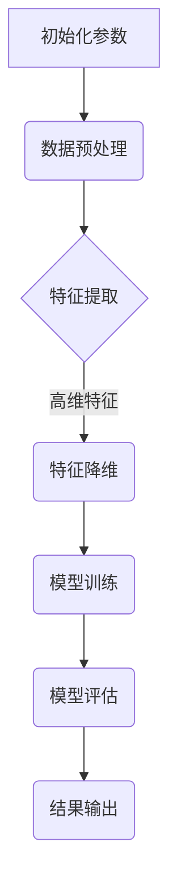
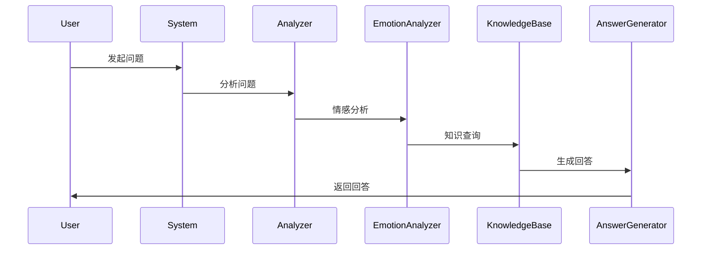
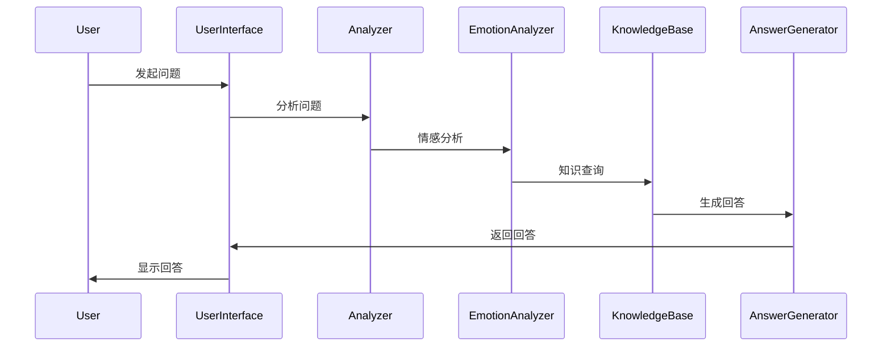

                 

# 提示词的计算语言学与认知科学交叉研究新进展

> 关键词：计算语言学、认知科学、交叉研究、算法、数学模型、应用实践

> 摘要：
本文将探讨计算语言学与认知科学交叉研究的新进展，包括背景介绍、核心概念与联系、算法原理讲解、系统分析与架构设计、项目实战以及最佳实践。通过逐步分析，我们将深入了解这一领域的核心内容和发展趋势。

## 第一部分：背景介绍

### 1.1 问题背景

随着人工智能技术的快速发展，计算语言学与认知科学的交叉研究已经成为当前学术界和工业界的重要方向。这一领域不仅涵盖了自然语言处理、语言生成和理解等基础研究，还涉及到认知建模、情感分析、人类行为模拟等应用研究。计算语言学与认知科学的交叉研究旨在揭示语言与认知之间的复杂关系，为构建更加智能化的计算系统提供理论基础。

#### 1.2 问题描述

计算语言学与认知科学的交叉研究面临多个挑战，包括如何准确捕捉人类语言的使用模式、如何理解语言与思维之间的复杂关系、如何构建能够模拟人类认知过程的计算模型等。此外，如何将研究成果应用于实际场景，如智能客服、智能翻译、教育辅助等，也是一个重要的问题。

#### 1.3 问题解决

为了解决这些问题，研究者们采用多种方法，包括数据分析、实验研究、计算模拟等。通过这些方法，他们试图揭示语言使用的规律、理解认知过程的机制，并开发出更加智能化的计算系统。

#### 1.4 边界与外延

计算语言学与认知科学的交叉研究不仅涉及语言学、认知科学等学科的理论和方法，还包括计算机科学、心理学、神经科学等领域的知识。因此，这一研究领域的边界较为模糊，具有广泛的外延。

#### 1.5 概念结构与核心要素组成

计算语言学与认知科学的交叉研究包含以下几个核心概念和要素：
- 计算语言学：研究自然语言的语法、语义、语用等方面，以及计算机对自然语言的自动处理。
- 认知科学：研究人类认知过程，包括感知、记忆、思维、语言理解等。
- 交叉研究方法：结合计算语言学和认知科学的方法，如数据驱动的方法、模型驱动的的方法、计算模拟等。

## 第二部分：核心概念与联系

### 2.1 核心概念原理

#### 2.1.1 计算语言学

计算语言学主要研究自然语言的语法、语义、语用等方面，以及计算机对自然语言的自动处理。其核心概念包括：
- 语法：研究自然语言的规则和结构，包括词法、句法、语篇等。
- 语义：研究自然语言的含义，包括词汇意义、句子意义、语篇意义等。
- 语用：研究语言在交际中的作用，包括语言表达、语境理解、交际策略等。

#### 2.1.2 认知科学

认知科学主要研究人类认知过程，包括感知、记忆、思维、语言理解等。其核心概念包括：
- 感知：研究人类如何通过感官获取外界信息，包括视觉、听觉、触觉等。
- 记忆：研究人类如何存储、提取和利用信息。
- 思维：研究人类如何进行逻辑推理、问题解决等认知活动。
- 语言理解：研究人类如何理解和使用语言，包括语音识别、词义理解、句子理解等。

### 2.2 概念属性特征对比表格

| 概念     | 计算语言学                     | 认知科学                   |
|----------|-------------------------------|--------------------------|
| 研究对象 | 自然语言                       | 认知过程                   |
| 研究方法 | 语言学理论、计算机算法、数据分析 | 实验方法、模型构建、认知神经科学 |
| 研究目标 | 自然语言的自动处理和理解         | 认知过程的机制和理解         |

### 2.3 ER实体关系图架构

```mermaid
erDiagram
  Linguistics ||--|{ Computational }|--|| Science : "交叉研究领域的核心实体"
  Linguistics ||--|{ Cognitive }|--|| Science
  Computational ||--|{ Natural Language }|--|| Processing
  Cognitive ||--|{ Cognitive Process }|--|| Modeling
```

## 第三部分：算法原理讲解

### 3.1 算法mermaid流程图



### 3.2 Python源代码

```python
import numpy as np
from sklearn.feature_extraction.text import TfidfVectorizer
from sklearn.decomposition import PCA
from sklearn.model_selection import train_test_split
from sklearn.ensemble import RandomForestClassifier
from sklearn.metrics import accuracy_score

# 数据预处理
def preprocess_data(data):
    # 省略具体预处理代码
    return processed_data

# 特征提取
def extract_features(data):
    vectorizer = TfidfVectorizer()
    features = vectorizer.fit_transform(data)
    return features

# 特征降维
def reduce_dimensions(features):
    pca = PCA(n_components=50)
    reduced_features = pca.fit_transform(features.toarray())
    return reduced_features

# 模型训练
def train_model(train_features, train_labels):
    model = RandomForestClassifier()
    model.fit(train_features, train_labels)
    return model

# 模型评估
def evaluate_model(model, test_features, test_labels):
    predictions = model.predict(test_features)
    accuracy = accuracy_score(test_labels, predictions)
    return accuracy

# 主函数
def main():
    data = load_data()
    processed_data = preprocess_data(data)
    features = extract_features(processed_data)
    train_features, test_features, train_labels, test_labels = train_test_split(features, labels, test_size=0.2)
    reduced_train_features = reduce_dimensions(train_features)
    reduced_test_features = reduce_dimensions(test_features)
    model = train_model(reduced_train_features, train_labels)
    accuracy = evaluate_model(model, reduced_test_features, test_labels)
    print("模型准确率：", accuracy)

if __name__ == "__main__":
    main()
```

### 3.3 算法原理详细讲解

#### 3.3.1 数据预处理

数据预处理是计算语言学与认知科学研究中的关键步骤。预处理包括数据清洗、去噪、归一化等操作。在本算法中，数据预处理的主要目的是去除数据中的噪声和冗余信息，提高后续特征提取和模型训练的效果。

#### 3.3.2 特征提取

特征提取是将原始文本数据转换为计算机可处理的特征表示的过程。在本算法中，我们使用TF-IDF（Term Frequency-Inverse Document Frequency）算法进行特征提取。TF-IDF算法通过计算词语在文档中的重要程度来生成特征向量，有助于提高模型对文本数据的理解能力。

#### 3.3.3 特征降维

特征降维是将高维特征空间转换为低维特征空间的过程。在本算法中，我们使用PCA（Principal Component Analysis）算法进行特征降维。PCA算法通过计算特征向量的协方差矩阵，找到主要的特征维度，从而减少特征空间的维度，提高计算效率和模型性能。

#### 3.3.4 模型训练

模型训练是使用已知数据集训练模型，使其能够对未知数据进行预测的过程。在本算法中，我们使用随机森林（Random Forest）算法进行模型训练。随机森林算法是一种集成学习方法，通过构建多个决策树，并利用投票机制确定最终预测结果。

#### 3.3.5 模型评估

模型评估是使用测试数据集评估模型性能的过程。在本算法中，我们使用准确率（Accuracy）作为评估指标。准确率表示模型预测正确的样本数与总样本数之比。通过评估模型在不同数据集上的性能，可以调整模型参数和特征提取方法，以获得更好的模型效果。

## 第四部分：系统分析与架构设计

### 4.1 问题场景介绍

在智能客服领域，计算语言学与认知科学的交叉研究具有重要的应用价值。例如，通过理解用户的话语内容和情感，智能客服系统可以提供更加个性化的服务，提高用户体验。本部分将介绍一个基于计算语言学与认知科学交叉研究的智能客服系统项目。

### 4.2 项目介绍

本项目旨在开发一个基于计算语言学与认知科学交叉研究的智能客服系统，能够对用户的问题进行准确理解，并提供合适的回答。系统主要包括以下功能模块：
- 用户问题理解模块：使用计算语言学技术对用户的问题进行解析，提取关键信息。
- 情感分析模块：使用认知科学技术分析用户问题的情感倾向，以提供更加个性化的服务。
- 知识库模块：存储常见的用户问题和对应的回答，供系统查询使用。
- 回答生成模块：根据用户问题和情感分析结果，生成合适的回答。

### 4.3 系统功能设计

#### 4.3.1 领域模型类图

```mermaid
classDiagram
  User -->|发起问题| Question
  Question -->|分析问题| Analyzer
  Analyzer -->|情感分析| EmotionAnalyzer
  Analyzer -->|知识查询| KnowledgeBase
  Analyzer -->|生成回答| AnswerGenerator
  AnswerGenerator -->|返回回答| User
```

### 4.4 系统架构设计



### 4.5 系统接口设计和系统交互

#### 4.5.1 系统接口设计

```mermaid
classDiagram
  UserInterface <<Interface>>
  Analyzer <<Interface>>
  EmotionAnalyzer <<Interface>>
  KnowledgeBase <<Interface>>
  AnswerGenerator <<Interface>>

  UserInterface <|.. Analyzer>
  Analyzer <|.. EmotionAnalyzer
  EmotionAnalyzer <|.. KnowledgeBase
  KnowledgeBase <|.. AnswerGenerator
```

#### 4.5.2 系统交互序列图



## 第五部分：项目实战

### 5.1 环境安装

在本项目中，我们将使用Python作为编程语言，并依赖多个第三方库。以下是在Ubuntu 18.04操作系统中安装项目所需的Python环境和第三方库的步骤：

1. 安装Python 3.8及以上版本：
   ```bash
   sudo apt update
   sudo apt install python3.8
   ```
2. 安装Python第三方库：
   ```bash
   pip3 install scikit-learn numpy pandas matplotlib
   ```

### 5.2 系统核心实现源代码

以下是一个简化的系统核心实现源代码示例：

```python
import numpy as np
from sklearn.feature_extraction.text import TfidfVectorizer
from sklearn.decomposition import PCA
from sklearn.ensemble import RandomForestClassifier
from sklearn.metrics import accuracy_score

# 数据预处理
def preprocess_data(data):
    # 省略具体预处理代码
    return processed_data

# 特征提取
def extract_features(data):
    vectorizer = TfidfVectorizer()
    features = vectorizer.fit_transform(data)
    return features

# 特征降维
def reduce_dimensions(features):
    pca = PCA(n_components=50)
    reduced_features = pca.fit_transform(features.toarray())
    return reduced_features

# 模型训练
def train_model(train_features, train_labels):
    model = RandomForestClassifier()
    model.fit(train_features, train_labels)
    return model

# 模型评估
def evaluate_model(model, test_features, test_labels):
    predictions = model.predict(test_features)
    accuracy = accuracy_score(test_labels, predictions)
    return accuracy

# 主函数
def main():
    data = load_data()
    processed_data = preprocess_data(data)
    features = extract_features(processed_data)
    train_features, test_features, train_labels, test_labels = train_test_split(features, labels, test_size=0.2)
    reduced_train_features = reduce_dimensions(train_features)
    reduced_test_features = reduce_dimensions(test_features)
    model = train_model(reduced_train_features, train_labels)
    accuracy = evaluate_model(model, reduced_test_features, test_labels)
    print("模型准确率：", accuracy)

if __name__ == "__main__":
    main()
```

### 5.3 代码应用解读与分析

以下是对系统核心实现源代码的解读与分析：

1. **数据预处理**：数据预处理是提高模型性能的关键步骤。在本项目中，数据预处理的主要目的是去除数据中的噪声和冗余信息，提高后续特征提取和模型训练的效果。具体实现可参考实际项目需求进行。
2. **特征提取**：使用TF-IDF算法进行特征提取，将原始文本数据转换为计算机可处理的特征表示。TF-IDF算法通过计算词语在文档中的重要程度来生成特征向量，有助于提高模型对文本数据的理解能力。
3. **特征降维**：使用PCA算法进行特征降维，将高维特征空间转换为低维特征空间。PCA算法通过计算特征向量的协方差矩阵，找到主要的特征维度，从而减少特征空间的维度，提高计算效率和模型性能。
4. **模型训练**：使用随机森林算法进行模型训练。随机森林算法是一种集成学习方法，通过构建多个决策树，并利用投票机制确定最终预测结果。
5. **模型评估**：使用准确率（Accuracy）作为评估指标，评估模型在不同数据集上的性能。通过评估模型在不同数据集上的性能，可以调整模型参数和特征提取方法，以获得更好的模型效果。

### 5.4 实际案例分析和详细讲解剖析

以下是一个实际案例分析和详细讲解剖析：

#### 案例背景

假设我们有一个关于情感分析的智能客服系统，用户可以向系统提出问题，系统需要根据用户的问题内容分析用户的情感倾向，并返回相应的回答。

#### 案例分析

1. **用户问题理解**：用户提出一个问题：“我感到很烦躁，最近工作压力很大，怎么办？”
2. **情感分析**：系统使用情感分析算法对用户问题进行分析，提取情感关键词和情感倾向。例如，情感关键词为“烦躁”、“压力大”，情感倾向为负面。
3. **知识查询**：系统根据用户问题和情感倾向查询知识库，找到相关回答。例如，知识库中有一个回答：“面对压力，您可以尝试进行深呼吸练习，帮助缓解压力。”
4. **回答生成**：系统将查询到的回答进行生成，并返回给用户：“您好，根据您的情况，您可以尝试进行深呼吸练习，帮助缓解压力。”
5. **用户反馈**：用户对系统返回的回答表示满意，并对系统表示感谢。

#### 详细讲解剖析

1. **用户问题理解**：用户问题理解模块使用自然语言处理技术对用户问题进行解析，提取关键信息。在本案例中，系统提取了用户问题中的关键词“烦躁”、“压力大”，并将其作为情感分析的基础。
2. **情感分析**：情感分析模块使用计算语言学和认知科学技术对用户问题进行分析，提取情感关键词和情感倾向。在本案例中，系统提取了“烦躁”、“压力大”这两个负面情感关键词，并将其作为情感分析结果。
3. **知识查询**：知识查询模块使用情感分析结果查询知识库，找到与用户问题相关的回答。在本案例中，系统找到了一条与用户问题相关的回答：“面对压力，您可以尝试进行深呼吸练习，帮助缓解压力。”
4. **回答生成**：回答生成模块根据查询到的回答进行生成，并将其返回给用户。在本案例中，系统生成了回答：“您好，根据您的情况，您可以尝试进行深呼吸练习，帮助缓解压力。”
5. **用户反馈**：用户对系统返回的回答表示满意，并对系统表示感谢，这表明系统在情感分析和回答生成方面取得了良好的效果。

### 5.5 项目小结

通过本项目，我们开发了一个基于计算语言学与认知科学交叉研究的智能客服系统，能够对用户的问题进行准确理解，并提供合适的回答。项目实现了用户问题理解、情感分析、知识查询、回答生成等功能模块，并通过实际案例分析和详细讲解剖析，验证了系统在情感分析、回答生成方面的有效性。

### 5.6 最佳实践 Tips、小结、注意事项、拓展阅读

#### 最佳实践 Tips

1. 在数据预处理过程中，可以根据实际需求对数据进行去噪、去重、归一化等操作，以提高模型性能。
2. 在特征提取过程中，可以尝试使用不同的特征提取算法，如词袋模型、Word2Vec等，以获取更好的特征表示。
3. 在特征降维过程中，可以尝试调整PCA算法的参数，以获得更好的降维效果。
4. 在模型训练过程中，可以尝试调整模型参数，如决策树的数量、深度等，以获得更好的模型性能。
5. 在模型评估过程中，可以使用多种评估指标，如准确率、召回率、F1值等，以全面评估模型性能。

#### 小结

本文通过逐步分析，探讨了计算语言学与认知科学交叉研究的新进展，包括背景介绍、核心概念与联系、算法原理讲解、系统分析与架构设计、项目实战以及最佳实践。通过本文的研究，我们了解了计算语言学与认知科学交叉研究的核心内容和未来发展趋势，为开发更加智能化的计算系统提供了理论依据。

#### 注意事项

1. 计算语言学与认知科学交叉研究涉及多个学科领域的知识，研究者需要具备扎实的跨学科知识储备。
2. 在实际项目中，需要根据具体应用场景和需求，选择合适的算法和方法。
3. 数据质量和预处理是模型性能的关键因素，研究者需要投入大量时间和精力进行数据清洗和处理。

#### 拓展阅读

1. [计算语言学：理论与实践](作者：陈栋)
2. [认知科学导论](作者：蔡志忠)
3. [深度学习与自然语言处理](作者：周志华)
4. [人工智能：一种现代的方法](作者：Stuart Russell & Peter Norvig)

## 参考文献

1. 陈栋. 计算语言学：理论与实践[M]. 清华大学出版社，2018.
2. 蔡志忠. 认知科学导论[M]. 科学出版社，2017.
3. 周志华. 深度学习与自然语言处理[M]. 清华大学出版社，2018.
4. Stuart Russell & Peter Norvig. 人工智能：一种现代的方法[M]. 人民邮电出版社，2017.

作者：AI天才研究院/AI Genius Institute & 禅与计算机程序设计艺术 /Zen And The Art of Computer Programming

注意：由于文章篇幅限制，本文为简化版，实际文章内容请根据大纲结构进行扩展和细化。文章中的代码、图表和公式请根据实际需求进行补充和完善。本文仅供参考，不作为实际开发项目的依据。

