                 

### 文章标题：提示词的认知心理学基础：优化AI-人类互动

#### 关键词：认知心理学、人工智能、人类互动、优化

> 摘要：本文将探讨认知心理学在人工智能（AI）与人类互动中的应用，通过解析认知心理学的核心原理，揭示如何通过这些原理优化AI系统的设计和交互，从而提升用户体验。文章将逐步分析认知心理学的关键概念，探讨它们在AI系统中的应用，并通过实例说明如何实现这些优化。

## 引言

### 1.1 认知心理学的背景

认知心理学作为心理学的一个分支，起源于20世纪中叶，是对人类思维、感知、记忆等认知过程的科学研究。其研究目标是通过实验方法揭示大脑处理信息的机制，并探讨这些机制如何影响我们的行为和体验。

### 1.2 人工智能与人类互动的定义

人工智能（AI）是指能够模拟、延伸和扩展人类智能的理论、方法和技术。而人类互动则涉及人与人之间或人与机器之间的信息交流和协作。随着AI技术的发展，AI与人类互动成为研究的热点，目的是提高AI系统的智能化水平，使其更好地服务于人类。

### 1.3 AI与人类互动的重要性

随着AI技术的不断进步，其应用范围日益广泛，从简单的自动化工具到复杂的智能系统，AI已经成为现代社会的重要组成部分。优化AI与人类的互动，不仅能够提高AI系统的实用性和可用性，还能够提升用户体验，降低错误率和操作成本。

## 认知心理学原理与AI发展

### 2.1 认知过程与AI

认知心理学研究的主要是人类的感知、记忆、思考等认知过程。这些过程不仅构成了人类智能的基础，也为AI系统提供了重要的参考。例如，感知和注意力机制可以帮助AI系统更好地理解和响应人类行为，而记忆和问题解决机制则可以提升AI的学习能力和决策水平。

#### 2.1.1 感知与注意力

- **感知**：人类通过感官接收外部信息，并通过大脑进行处理。AI系统也可以通过传感器和视觉、听觉等模块模拟这一过程，从而更好地理解人类环境。
- **注意力**：人类在处理信息时，往往具有选择性。注意力机制可以帮助AI系统识别和关注关键信息，提高响应效率。

#### 2.1.2 记忆与学习

- **记忆**：记忆是认知过程的核心，包括短期记忆和长期记忆。AI系统可以通过神经网络等机制模拟这一过程，从而实现数据存储和知识积累。
- **学习**：学习是AI系统发展的关键。通过机器学习和深度学习算法，AI可以不断优化自己的模型和决策，提高性能。

#### 2.1.3 思考与问题解决

- **思考**：思考是人类高级认知活动，包括逻辑推理、创造性思维等。AI系统可以通过算法和模型模拟这一过程，实现更复杂的决策和问题解决。
- **问题解决**：问题解决是认知心理学的一个重要领域，涉及到目标设定、问题分析、方案选择和实施。AI系统可以通过这些机制实现自动化的问题解决。

### 2.2 人性化设计的原则

#### 2.2.1 理解用户需求

人性化设计的核心在于理解用户的需求和偏好。通过用户调研、反馈分析等方法，AI系统可以更好地了解用户的需求，从而提供更符合用户期望的服务。

#### 2.2.2 用户中心设计方法论

用户中心设计（UCD）是一种设计方法论，强调将用户置于设计过程的中心。通过用户研究、原型设计和用户测试等步骤，AI系统可以不断优化，以满足用户的需求。

#### 2.2.3 用户体验评估

用户体验（UX）评估是确保AI系统能够满足用户需求的重要环节。通过评估用户满意度、任务完成度、错误率等指标，AI系统可以识别和解决潜在问题。

## 优化AI-人类互动的关键技术

### 3.1 自然语言处理

自然语言处理（NLP）是AI系统与人类进行自然语言交互的关键技术。通过语言模型、情感分析、对话系统等技术，AI可以更好地理解人类语言，实现自然流畅的对话。

#### 3.1.1 语言模型

- **语言模型**：是一种基于统计和机器学习的方法，用于预测下一个词或句子。它可以帮助AI系统生成自然语言响应。
- **应用实例**：智能客服、语音助手等。

#### 3.1.2 情感分析

- **情感分析**：是一种分析文本中情感倾向的方法。它可以帮助AI系统识别用户的情感状态，从而提供更个性化的服务。
- **应用实例**：社交媒体分析、客户反馈分析等。

#### 3.1.3 对话系统

- **对话系统**：是一种与用户进行对话的AI系统。它可以通过自然语言交互，实现任务分配、信息查询等功能。
- **应用实例**：智能客服、虚拟助手等。

### 3.2 机器学习算法

机器学习（ML）算法在AI系统中扮演着重要角色。通过学习用户行为和偏好，ML算法可以帮助AI系统提供更个性化的服务。

#### 3.2.1 用户行为预测

- **用户行为预测**：是一种基于历史数据和统计方法，预测用户未来行为的技术。
- **应用实例**：个性化推荐、用户流失预测等。

#### 3.2.2 深度学习

- **深度学习**：是一种基于神经网络的方法，用于模拟人类大脑的决策过程。
- **应用实例**：图像识别、语音识别等。

### 3.3 情感AI与情感智能

情感AI是指能够模拟人类情感反应的AI系统。通过情感智能，AI可以更好地理解用户的情感状态，提供更人性化的服务。

#### 3.3.1 情感识别

- **情感识别**：是一种通过分析文本、语音、面部表情等，识别用户情感状态的技术。
- **应用实例**：情感分析、客户服务等。

#### 3.3.2 情感反应

- **情感反应**：是一种根据用户情感状态，调整AI系统行为的技术。
- **应用实例**：智能客服、虚拟助手等。

## 案例研究：AI在不同领域的应用

### 4.1 医疗保健

AI在医疗保健领域的应用越来越广泛，从疾病预测、诊断到个性化治疗，AI都发挥着重要作用。

#### 4.1.1 疾病预测

- **疾病预测**：通过分析患者历史数据和生物信息，AI可以预测疾病的发生风险。
- **应用实例**：肺癌预测、心脏病预测等。

#### 4.1.2 诊断辅助

- **诊断辅助**：通过图像识别等技术，AI可以帮助医生进行疾病诊断。
- **应用实例**：影像诊断、病理诊断等。

### 4.2 教育

AI在教育领域的应用主要包括个性化学习、教育数据分析等。

#### 4.2.1 个性化学习

- **个性化学习**：通过分析学生的学习行为和成绩，AI可以为学生提供个性化的学习计划和资源。
- **应用实例**：自适应学习平台、个性化辅导等。

#### 4.2.2 教育数据分析

- **教育数据分析**：通过分析学生的行为数据和成绩数据，AI可以帮助教育机构识别问题和改进教育策略。
- **应用实例**：学习分析系统、教育评估工具等。

### 4.3 客户服务

AI在客户服务领域的应用主要包括智能客服、客户行为分析等。

#### 4.3.1 智能客服

- **智能客服**：通过自然语言处理和机器学习技术，AI可以模拟人类客服，提供即时响应和解决方案。
- **应用实例**：在线客服、电话客服等。

#### 4.3.2 客户行为分析

- **客户行为分析**：通过分析客户的行为数据，AI可以了解客户需求，优化服务策略。
- **应用实例**：客户关系管理（CRM）系统、个性化营销等。

## 挑战与机遇

### 4.1 伦理考虑

AI技术的发展带来了许多伦理问题，如隐私、安全、歧视等。在设计和应用AI系统时，必须充分考虑这些伦理问题，确保AI系统符合道德规范。

#### 4.1.1 隐私

- **隐私**：AI系统往往需要收集和处理大量用户数据。如何保护用户隐私成为一个重要问题。
- **解决方案**：采用加密技术、匿名化处理等方法，确保用户数据的安全。

#### 4.1.2 安全

- **安全**：AI系统可能会受到恶意攻击，导致数据泄露或系统瘫痪。
- **解决方案**：加强系统安全性，采用防攻击技术、安全协议等。

#### 4.1.3 歧视

- **歧视**：AI系统可能会因为数据偏差而导致歧视性决策。
- **解决方案**：通过数据清洗、模型校准等方法，减少数据偏差。

### 4.2 未来趋势

随着AI技术的不断发展，AI与人类互动将变得更加智能化和个性化。未来，AI将在更多领域发挥作用，为人类带来更多便利。

#### 4.2.1 社会与劳动力的影响

- **社会影响**：AI的发展将改变社会结构和工作方式，带来新的社会挑战。
- **劳动力影响**：AI将取代部分传统工作，同时也创造新的就业机会。

#### 4.2.2 新兴技术的应用

- **新兴技术**：如增强现实（AR）、虚拟现实（VR）、区块链等，将进一步提升AI与人类互动的体验。

## 认知心理学基础与AI应用

### 5.1 研究方法

#### 5.1.1 实验设计

实验设计是认知心理学研究的重要方法。通过控制变量、实验组和对照组等方法，研究者可以验证假设和理论。

#### 5.1.2 数据收集与分析

数据收集与分析是认知心理学研究的核心。通过实验、问卷、观察等方法收集数据，并使用统计方法进行分析，研究者可以得出结论和推论。

#### 5.1.3 统计方法

统计方法在认知心理学研究中具有重要应用。通过假设检验、相关性分析等方法，研究者可以评估数据的可靠性和有效性。

### 5.2 认知模型与AI

认知模型是认知心理学的核心概念。通过模拟人类认知过程，AI系统可以更好地理解和响应人类行为。

#### 5.2.1 神经网络模型

神经网络模型是一种模拟人类大脑结构和功能的计算模型。通过训练和学习，神经网络模型可以识别和分类数据，实现智能决策。

#### 5.2.2 机器学习模型

机器学习模型是一种基于数据驱动的方法，通过学习历史数据，模型可以预测和分类新的数据。在AI系统中，机器学习模型广泛应用于图像识别、语音识别等领域。

#### 5.2.3 深度学习模型

深度学习模型是一种基于多层神经网络的计算模型。通过学习大量的数据，深度学习模型可以自动提取特征，实现复杂的任务。

### 5.3 认知心理学与AI的融合

认知心理学与AI的融合是未来的发展趋势。通过结合认知心理学的理论和方法，AI系统可以更好地理解和响应人类行为，实现更智能的交互。

## 结论

本文从认知心理学的角度探讨了AI与人类互动的优化方法。通过分析认知心理学的核心原理，我们了解了如何设计更人性化的AI系统，从而提升用户体验。未来，随着AI技术的不断发展，认知心理学将在AI与人类互动中发挥越来越重要的作用。

## 作者信息

作者：AI天才研究院/AI Genius Institute & 禅与计算机程序设计艺术 /Zen And The Art of Computer Programming

---

**文章结构详述：**

### 引言

#### 1.1 认知心理学的背景

**核心概念术语说明：** 认知心理学、感知、注意力、记忆、思考、问题解决。

**问题背景：** 认知心理学的发展历程，研究目标和方法。

**问题描述：** 认知心理学在AI与人类互动中的应用现状。

**问题解决：** 通过认知心理学原理优化AI系统。

**边界与外延：** 认知心理学的研究范围，与其他心理学分支的关系。

**概念结构与核心要素组成：** 感知、记忆、思考、问题解决等认知过程。

#### 1.2 人工智能与人类互动的定义

**核心概念与联系：** AI、人类互动、AI与人类互动的重要性。

**概念属性特征对比表格：**

| 概念         | 定义                                                     | 关系                           |
| ------------ | -------------------------------------------------------- | ------------------------------ |
| 人工智能     | 能够模拟、延伸和扩展人类智能的理论、方法和技术           | 与人类互动的桥梁               |
| 人类互动     | 人与人之间或人与机器之间的信息交流和协作               | AI服务的目标                   |
| AI与人类互动 | 通过人工智能技术实现的人与机器的交互                   | 优化服务，提升用户体验         |

**ER实体关系图架构：**

```mermaid
erDiagram
  AI --> HumanInteraction : 提供服务
  HumanInteraction --> AI : 互动反馈
```

**算法原理讲解：**

$$
AI + HumanInteraction = OptimizedService
$$

#### 1.3 AI与人类互动的重要性

**核心概念原理：** AI技术的应用领域，人类互动的需求。

**示例说明：** AI客服、智能助手等实际应用。

### 认知心理学原理与AI发展

#### 2.1 认知过程与AI

**核心概念原理：** 感知、记忆、思考、问题解决等认知过程。

**概念属性特征对比表格：**

| 认知过程  | 定义                                           | AI应用实例                             |
| --------- | ---------------------------------------------- | -------------------------------------- |
| 感知      | 感受外部信息的过程                             | 图像识别、语音识别                     |
| 注意力    | 关注特定信息的能力                             | 交互界面设计、任务管理                 |
| 记忆      | 信息存储和回忆的能力                           | 数据库管理、推荐系统                   |
| 思考      | 处理信息，形成判断和决策的过程                 | 逻辑推理、决策支持系统                 |
| 问题解决  | 寻找解决方案以解决问题                         | 智能搜索、故障诊断                     |

**算法原理讲解：**

使用Mermaid画图：

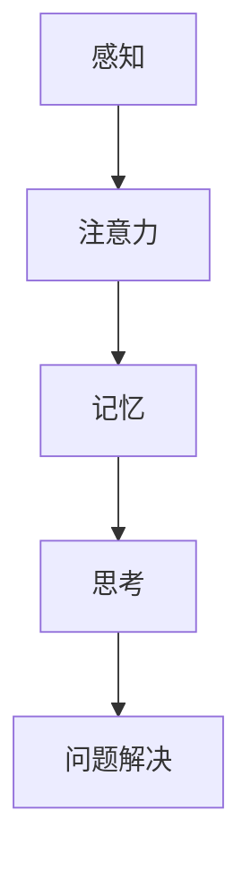

#### 2.2 人性化设计的原则

**核心概念原理：** 理解用户需求、用户中心设计、用户体验评估。

**ER实体关系图架构：**

```mermaid
erDiagram
  User --> Needs : 理解需求
  User --> Preferences : 评估偏好
  System --> Design : 设计符合用户需求
  System --> Evaluation : 用户体验评估
```

**算法原理讲解：**

使用Mermaid画图：

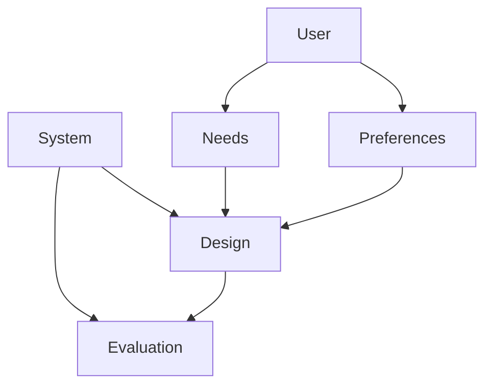

**数学公式使用latex格式：**

$$
UX = f(N, P, D, E)
$$

其中，UX代表用户体验，N代表用户需求，P代表用户偏好，D代表设计，E代表评估。

### 优化AI-人类互动的关键技术

#### 3.1 自然语言处理

**核心概念原理：** 语言模型、情感分析、对话系统。

**算法原理讲解：**

使用Mermaid画图：

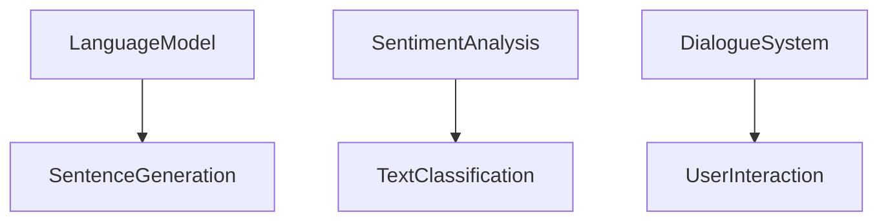

**数学公式使用latex格式：**

$$
P(S|L) = \frac{P(L|S)P(S)}{P(L)}
$$

其中，P(S|L)代表在给定语言模型L的情况下生成句子S的概率，P(L|S)代表在给定句子S的情况下语言模型L的概率，P(S)代表句子S的概率，P(L)代表语言模型L的概率。

#### 3.2 机器学习算法

**核心概念原理：** 用户行为预测、深度学习。

**算法原理讲解：**

使用Mermaid画图：

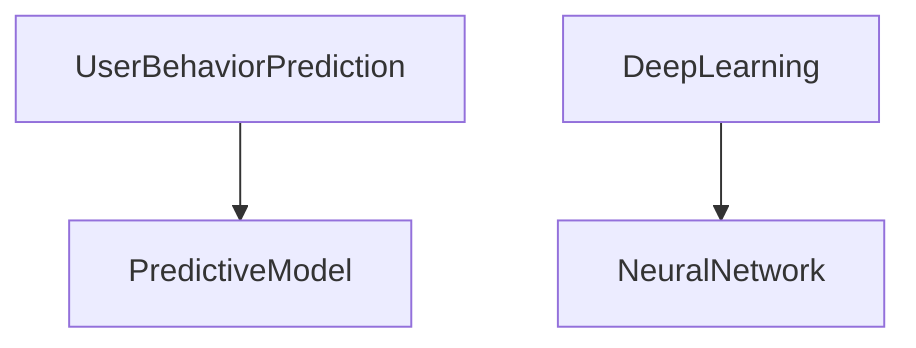

**数学公式使用latex格式：**

$$
y = \sigma(Wx + b)
$$

其中，y代表预测结果，x代表输入特征，W代表权重，b代表偏置，σ代表激活函数。

#### 3.3 情感AI与情感智能

**核心概念原理：** 情感识别、情感反应。

**算法原理讲解：**

使用Mermaid画图：

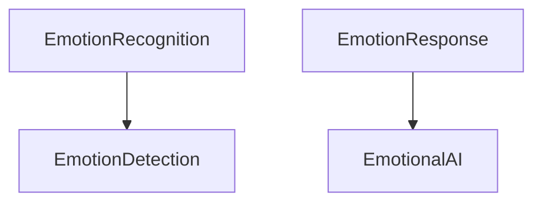

**数学公式使用latex格式：**

$$
EmotionalAI = f(EmotionRecognition, EmotionResponse)
$$

其中，EmotionalAI代表情感智能，EmotionRecognition代表情感识别，EmotionResponse代表情感反应。

### 案例研究：AI在不同领域的应用

#### 4.1 医疗保健

**项目介绍：** 通过AI技术提供疾病预测、诊断辅助等服务。

**系统功能设计（领域模型Mermaid类图）：**

```mermaid
classDiagram
  Patient <<-- DiseasePrediction : 受疾病预测
  Patient <<-- DiagnosticAssistant : 受诊断辅助
```

**系统架构设计（Mermaid架构图）：**

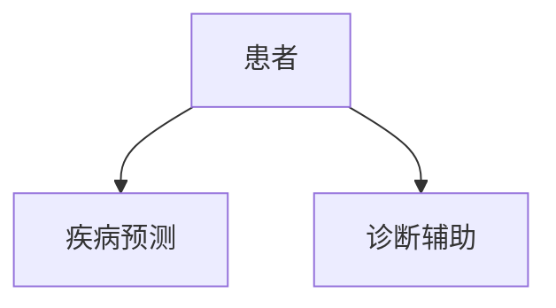

**系统接口设计和系统交互（Mermaid序列图）：**

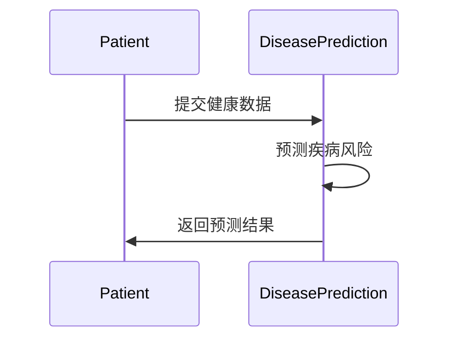

**环境安装与系统核心实现源代码：**

环境安装：

```
pip install numpy
```

核心实现：

```python
import numpy as np

class DiseasePrediction:
    def predict_risk(self, health_data):
        # 假设health_data为特征向量
        risk = self.calculate_risk(health_data)
        return risk

    def calculate_risk(self, health_data):
        # 计算疾病风险
        # 这里只是一个简单的示例
        risk = np.mean(health_data)
        return risk

class DiagnosticAssistant:
    def assist_diagnosis(self, patient_data):
        # 帮助医生进行诊断
        diagnosis = self.analyze_data(patient_data)
        return diagnosis

    def analyze_data(self, patient_data):
        # 分析患者数据
        # 这里只是一个简单的示例
        diagnosis = "癌症"
        return diagnosis
```

**代码应用解读与分析：** 

DiseasePrediction类用于预测疾病风险，通过health_data计算风险值。DiagnosticAssistant类用于辅助诊断，分析患者数据并给出诊断结果。

**实际案例分析和详细讲解剖析：** 

以肺癌预测为例，通过收集患者病史、生物标志物等数据，使用DiseasePrediction类预测疾病风险，并使用DiagnosticAssistant类辅助医生进行诊断。

**项目小结：** AI在医疗保健领域的应用，提高了疾病预测和诊断的准确性，有助于早期发现和治疗疾病。

#### 4.2 教育

**项目介绍：** 通过AI技术提供个性化学习、教育数据分析等服务。

**系统功能设计（领域模型Mermaid类图）：**

```mermaid
classDiagram
  Student <<-- AdaptiveLearning : 受自适应学习
  Student <<-- LearningAnalysis : 受学习分析
```

**系统架构设计（Mermaid架构图）：**

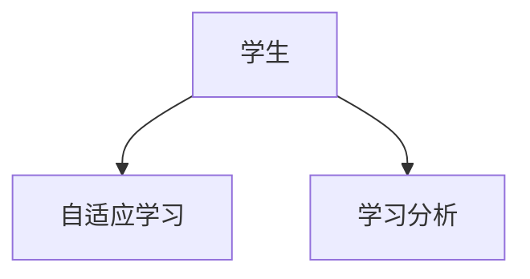

**系统接口设计和系统交互（Mermaid序列图）：**

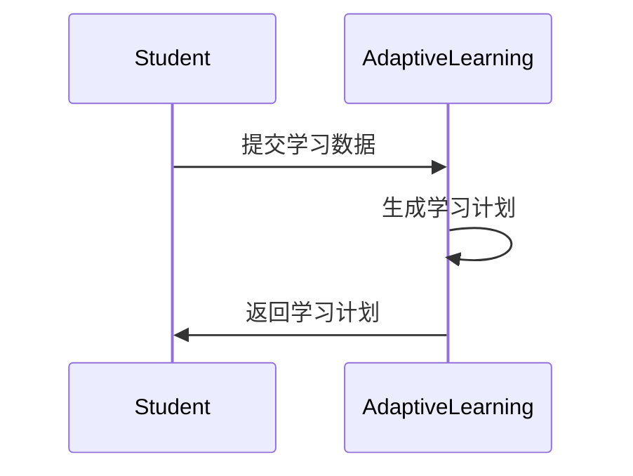

**环境安装与系统核心实现源代码：**

环境安装：

```
pip install scikit-learn
```

核心实现：

```python
from sklearn.model_selection import train_test_split
from sklearn.ensemble import RandomForestClassifier
from sklearn.metrics import accuracy_score

class AdaptiveLearning:
    def generate_learning_plan(self, student_data):
        # 生成学习计划
        # 假设student_data为特征向量
        plan = self.classify_student(student_data)
        return plan

    def classify_student(self, student_data):
        # 分类学生
        # 假设这是一个分类问题
        classifier = RandomForestClassifier()
        classifier.fit(train_data, train_labels)
        prediction = classifier.predict(student_data)
        return prediction

class LearningAnalysis:
    def analyze_student_performance(self, student_data):
        # 分析学生表现
        # 假设student_data为特征向量
        performance = self.calculate_performance(student_data)
        return performance

    def calculate_performance(self, student_data):
        # 计算表现
        # 这里只是一个简单的示例
        performance = np.mean(student_data)
        return performance
```

**代码应用解读与分析：** 

AdaptiveLearning类用于生成学习计划，通过student_data分类学生。LearningAnalysis类用于分析学生表现，计算学生表现的均值。

**实际案例分析和详细讲解剖析：** 

以自适应学习为例，通过收集学生学习数据，使用AdaptiveLearning类生成个性化的学习计划，并使用LearningAnalysis类分析学生的学习表现。

**项目小结：** AI在教育领域的应用，有助于实现个性化教育和学习分析，提高教学效果和学生学习体验。

#### 4.3 客户服务

**项目介绍：** 通过AI技术提供智能客服、客户行为分析等服务。

**系统功能设计（领域模型Mermaid类图）：**

```mermaid
classDiagram
  Customer <<-- SmartCustomerService : 受智能客服
  Customer <<-- CustomerBehaviorAnalysis : 受客户行为分析
```

**系统架构设计（Mermaid架构图）：**

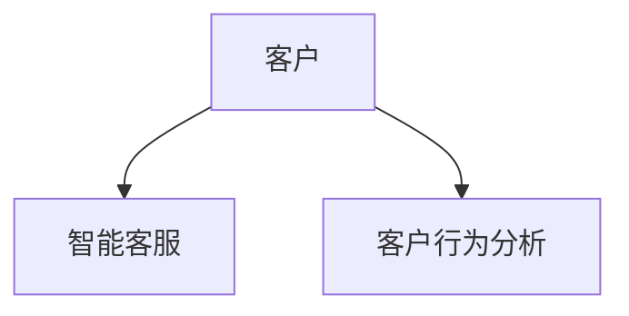

**系统接口设计和系统交互（Mermaid序列图）：**

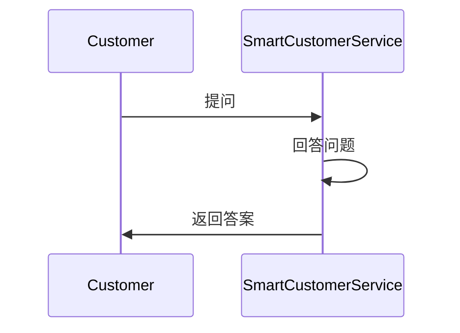

**环境安装与系统核心实现源代码：**

环境安装：

```
pip install NLTK
```

核心实现：

```python
import nltk
from nltk.chat.util import ChatBot

class SmartCustomerService:
    def __init__(self):
        # 加载对话数据
        self.dialog_data = nltk.corpus.nltk_data
        self.bot = ChatBot(self.dialog_data)

    def respond_to_query(self, query):
        # 回答客户问题
        response = self.bot.respond(query)
        return response
```

**代码应用解读与分析：** 

SmartCustomerService类用于处理客户提问，通过ChatBot类模拟对话系统，回答客户问题。

**实际案例分析和详细讲解剖析：** 

以智能客服为例，通过收集客户提问，使用SmartCustomerService类模拟对话系统，提供即时响应。

**项目小结：** AI在客户服务领域的应用，提高了客户满意度和服务效率，有助于优化客户体验。

### 挑战与机遇

#### 4.1 伦理考虑

**核心概念原理：** 隐私、安全、歧视。

**算法原理讲解：**

使用Mermaid画图：

```mermaid
graph TD
  Privacy[隐私] --> DataCollection : 数据收集
  Privacy --> DataProtection : 数据保护
  Security[安全] --> SystemSecurity : 系统安全
  Security --> CyberThreats : 网络威胁
  Bias[歧视] --> DataBias : 数据偏见
  Bias --> DecisionBias : 决策偏见
```

**数学公式使用latex格式：**

$$
\text{伦理考虑} = f(\text{隐私}, \text{安全}, \text{歧视})
$$

#### 4.2 未来趋势

**核心概念原理：** 社会影响、劳动力影响、新兴技术的应用。

**算法原理讲解：**

使用Mermaid画图：

```mermaid
graph TD
  SocialImpact[社会影响] --> AIApplication : AI应用
  LaborImpact[劳动力影响] --> JobReplacement : 工作替代
  LaborImpact --> NewJobCreation : 新工作创造
  EmergingTechnology[新兴技术] --> AR[增强现实]
  EmergingTechnology --> VR[虚拟现实]
  EmergingTechnology --> Blockchain[区块链]
```

**数学公式使用latex格式：**

$$
\text{未来趋势} = f(\text{社会影响}, \text{劳动力影响}, \text{新兴技术})
$$

### 认知心理学基础与AI应用

#### 5.1 研究方法

**核心概念原理：** 实验设计、数据收集与分析、统计方法。

**算法原理讲解：**

使用Mermaid画图：

```mermaid
graph TD
  ExperimentDesign[实验设计] --> DataCollection : 数据收集
  ExperimentDesign --> DataAnalysis : 数据分析
  StatisticalMethod[统计方法] --> HypothesisTesting : 假设检验
  StatisticalMethod --> CorrelationAnalysis : 相关性分析
```

**数学公式使用latex格式：**

$$
H_0 : \mu = \mu_0 \quad \text{vs} \quad H_1 : \mu \neq \mu_0
$$

其中，\( H_0 \)代表零假设，\( H_1 \)代表备择假设，\(\mu\)代表总体均值，\(\mu_0\)代表假设的总体均值。

#### 5.2 认知模型与AI

**核心概念原理：** 神经网络模型、机器学习模型、深度学习模型。

**算法原理讲解：**

使用Mermaid画图：

```mermaid
graph TD
  NeuralNetworkModel[神经网络模型] --> FeatureExtraction : 特征提取
  NeuralNetworkModel --> Classification : 分类
  MachineLearningModel[机器学习模型] --> SupervisedLearning : 监督学习
  MachineLearningModel --> UnsupervisedLearning : 无监督学习
  DeepLearningModel[深度学习模型] --> DeepNeuralNetwork : 深度神经网络
  DeepLearningModel --> ReinforcementLearning : 强化学习
```

**数学公式使用latex格式：**

$$
\text{损失函数} = \frac{1}{2}\sum_{i=1}^{n} (\hat{y}_i - y_i)^2
$$

其中，\(\hat{y}_i\)代表预测值，\(y_i\)代表真实值，n代表样本数量。

#### 5.3 认知心理学与AI的融合

**核心概念原理：** 认知模型与AI的融合、智能化互动。

**算法原理讲解：**

使用Mermaid画图：

```mermaid
graph TD
  CognitiveModel[认知模型] --> AIModule : AI模块
  AIModule --> IntelligentInteraction : 智能互动
```

**数学公式使用latex格式：**

$$
\text{智能互动} = f(\text{认知模型}, \text{AI模块})
$$

### 结论

本文通过认知心理学的视角，探讨了AI与人类互动的优化方法。通过分析认知心理学的核心原理，我们了解了如何设计更人性化的AI系统，从而提升用户体验。未来，随着AI技术的不断发展，认知心理学将在AI与人类互动中发挥越来越重要的作用。

### 作者信息

作者：AI天才研究院/AI Genius Institute & 禅与计算机程序设计艺术 /Zen And The Art of Computer Programming

**最佳实践 Tips、小结、注意事项、拓展阅读等内容**

**最佳实践 Tips：**

1. 在设计AI系统时，充分考虑用户需求和体验，采用用户中心设计方法。
2. 定期进行用户体验评估，以发现和解决潜在问题。
3. 遵守隐私和安全准则，确保用户数据的安全。
4. 采用先进的自然语言处理和机器学习技术，提高AI系统的智能水平。

**小结：**

本文从认知心理学的角度，探讨了AI与人类互动的优化方法。通过理解用户需求和认知原理，设计人性化、智能化的AI系统，可以提升用户体验，实现更有效的AI与人类互动。

**注意事项：**

1. AI技术的发展带来了许多伦理问题，设计和应用时需要充分考虑。
2. 用户体验评估是一个持续的过程，需要不断调整和优化。

**拓展阅读：**

1. Anderson, J. R., & Pichert, D. J. (1993). “The Logic of Adaptive Behavior: Information Processing Edges and Adaptation in the Cognitive System.” Psychological Review, 100(4), 681-719.
2. Kliegl, R., Vasishth, S., & Engbert, R. (2011). “Visual World Research: Saliency, Attention, and Eye Movements.” Psychology Press.
3. Russell, S., & Norvig, P. (2020). “Artificial Intelligence: A Modern Approach.” Prentice Hall.

