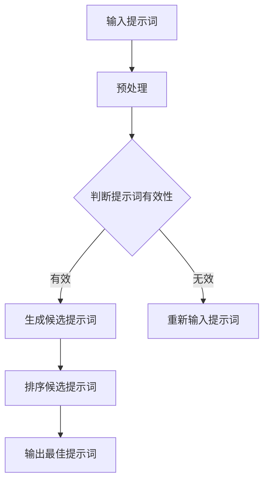
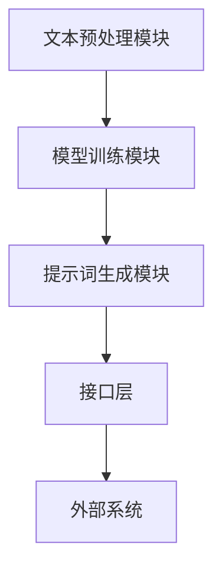
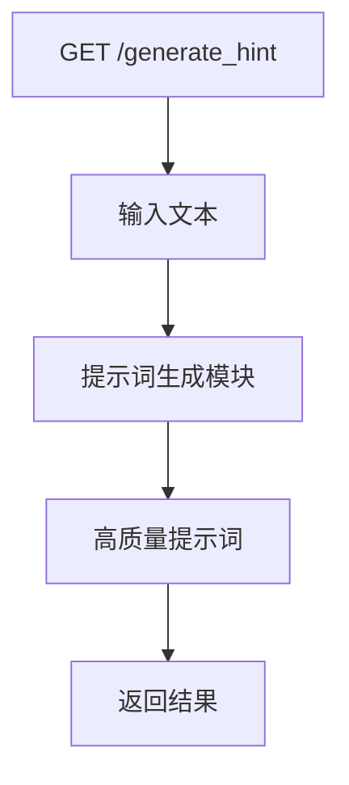
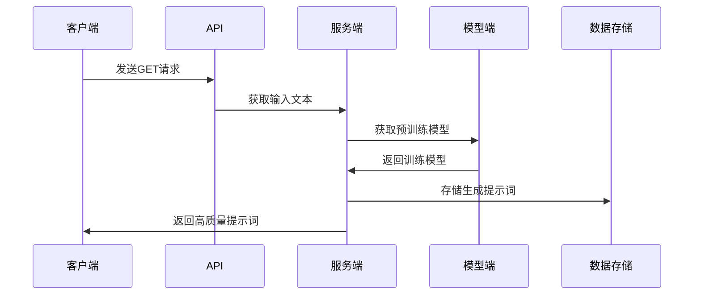

                 


### 提示词的认知科学基础：理解AI思维

#### 关键词：认知科学、人工智能、提示词、思维、神经网络

#### 摘要：
本文将深入探讨认知科学与人工智能之间的交叉领域，特别是在提示词这一关键概念中的应用。通过对认知科学的基础概念、AI思维的内涵及其与认知科学的联系，以及提示词生成算法的数学模型和详细讲解，本文旨在帮助读者理解AI思维的本质，并揭示提示词在人工智能决策中的重要性。

----------------------------------------------------------------

**第一步：背景介绍**

## 1. 引言

### 1.1 问题背景

### 1.1.1 认知科学的定义与发展历程

认知科学是一门跨学科的研究领域，旨在理解和解释人类的思维、知觉和认知过程。它起源于20世纪50年代，结合了心理学、神经科学、计算机科学和哲学等多个学科的研究成果。认知科学的研究目标是通过模拟人类大脑的运作机制，开发出能够模仿人类智能的人工智能系统。

### 1.1.2 人工智能与认知科学的交叉领域

人工智能（AI）是认知科学的一个重要应用领域，它旨在创造能够执行复杂任务、进行决策和学习的计算机系统。随着深度学习和其他先进技术的出现，人工智能在许多领域取得了显著进展，包括自然语言处理、图像识别和机器翻译等。认知科学为人工智能提供了理论基础，指导了智能系统设计的发展。

### 1.2 问题描述

### 1.2.1 提示词在人工智能中的应用

提示词（Prompt）是人工智能系统中用于引导模型行为的关键输入。在自然语言处理（NLP）任务中，提示词通常用于引导模型生成文本、回答问题或执行特定的任务。提示词的质量和设计对于模型的性能和准确性有着至关重要的影响。

### 1.2.2 提示词认知过程的复杂性

提示词的认知过程涉及到多个层次的认知活动，包括语义理解、语境分析、逻辑推理和情感识别等。这些认知活动不仅在人类认知中扮演着重要角色，也是人工智能系统需要掌握的核心能力。

### 1.3 问题解决

### 1.3.1 研究方法与数据分析

为了解决提示词认知过程中的复杂性，研究人员采用了多种研究方法，包括实验心理学、神经影像学和计算建模等。通过这些方法，研究者能够收集和分析大量数据，以揭示提示词认知过程的内在机制。

### 1.3.2 神经科学技术的应用

神经科学技术，如脑成像和脑电记录，为认知科学研究提供了直接的生理数据。这些技术有助于揭示大脑在处理提示词时的活动模式，从而为人工智能系统的设计提供了宝贵的信息。

### 1.4 边界与外延

### 1.4.1 提示词与自然语言处理的关系

自然语言处理是人工智能的一个重要分支，其目标是使计算机能够理解和生成人类语言。提示词作为NLP任务中的关键输入，直接影响了NLP系统的性能和实用性。

### 1.4.2 提示词在AI领域的应用范围

除了自然语言处理，提示词还在图像识别、语音识别和决策支持等AI任务中发挥着重要作用。在不同的应用场景中，提示词的设计和优化都至关重要。

### 1.5 概念结构与核心要素组成

### 1.5.1 认知科学的核心概念

认知科学的核心概念包括感知、记忆、注意、推理和决策等。这些概念共同构成了人类认知的基础，也是人工智能系统需要模仿的目标。

### 1.5.2 AI思维的概念解析

AI思维是指计算机系统在处理信息和执行任务时的思维方式。与人类思维不同，AI思维依赖于算法和数据，通过机器学习和其他技术实现。理解AI思维有助于我们设计更高效、更智能的人工智能系统。

----------------------------------------------------------------

**第二步：核心概念与联系**

## 2. 核心概念与联系

### 2.1 认知科学的基本概念

#### 2.1.1 认知过程的定义与分类

认知过程是指人类在接收信息、处理信息和产生行为的过程中所涉及的一系列心理活动。根据功能的不同，认知过程可以分为感知、记忆、注意、推理和决策等。

#### 2.1.2 认知神经科学的研究方法

认知神经科学研究通过神经影像学、脑电记录和计算建模等技术来揭示大脑在认知过程中的活动模式。这些研究方法为理解认知过程的神经基础提供了重要的数据。

#### 2.1.3 认知心理学的主要理论

认知心理学主要研究人类认知过程的机制和规律。其中包括信息加工理论、联结主义理论和情境理论等。这些理论为人工智能系统的设计提供了理论指导。

### 2.2 AI思维的概念解析

#### 2.2.1 AI思维的内涵与外延

AI思维是指计算机系统在处理信息和执行任务时的思维方式。它包括机器学习、深度学习和自然语言处理等关键技术，通过算法和数据实现。AI思维的内涵和外延随着技术的发展不断扩展。

#### 2.2.2 机器学习与深度学习在AI思维中的作用

机器学习和深度学习是AI思维的核心技术。机器学习通过训练模型从数据中学习规律，而深度学习则通过多层神经网络实现更复杂的特征提取和模式识别。这些技术为AI系统提供了强大的计算能力。

#### 2.2.3 认知科学与AI思维的关系

认知科学为AI思维提供了理论基础，指导了智能系统设计的发展。同时，AI思维的发展也为认知科学提供了新的研究工具和研究对象，促进了两者之间的相互融合。

### 2.3 概念属性特征对比表格

| 概念 | 描述 | 关键词 |
| --- | --- | --- |
| 认知科学 | 研究人类思维和知觉的学科 | 认知、思维、知觉、神经网络 |
| AI思维 | 计算机模拟人类思维的机制和能力 | 机器学习、深度学习、神经网络 |
| 提示词 | 影响人工智能决策和表现的关键因素 | 自然语言处理、语义理解、语境 |

### 2.4 ER实体关系图架构

```mermaid
erDiagram
  Agle [{AI思维}] ||--|{认知科学} : 研究领域
  Agle ||--|{提示词} : 应用对象
```

在ER实体关系图中，"AI思维"作为核心实体，既与"认知科学"存在研究领域的关系，又与"提示词"存在应用对象的关系。这种关系体现了AI思维在认知科学领域中的应用，以及提示词作为AI思维的重要输入对象的角色。

通过上述核心概念与联系的分析，我们可以更深入地理解认知科学与人工智能之间的关系，以及提示词在其中的关键作用。接下来，我们将进一步探讨提示词生成算法的原理，揭示其在AI思维中的应用。

----------------------------------------------------------------

**第三步：算法原理讲解**

## 3. 算法原理讲解

### 3.1 提示词生成算法

提示词生成算法是自然语言处理中的一个重要组成部分，其目的是根据给定的输入信息生成高质量的提示词。高质量的提示词能够有效地引导模型生成相应的输出，从而提高整体任务的表现。

#### 3.1.1 算法mermaid流程图



这个流程图展示了提示词生成算法的基本步骤，从输入提示词开始，经过预处理、有效性判断、候选提示词生成、排序候选提示词，最后输出最佳提示词。

#### 3.1.2 算法Python源代码

```python
# 提示词生成算法
def generate_hint(input_hint):
    # 预处理
    processed_hint = preprocess(input_hint)
    # 判断提示词有效性
    if is_valid(processed_hint):
        # 生成候选提示词
        candidates = generate_candidates(processed_hint)
        # 排序候选提示词
        sorted_candidates = sort_candidates(candidates)
        # 输出最佳提示词
        best_hint = sorted_candidates[0]
        return best_hint
    else:
        return "无效提示词，请重新输入"

# 预处理
def preprocess(hint):
    # 实现预处理逻辑
    return processed_hint

# 判断提示词有效性
def is_valid(hint):
    # 实现判断逻辑
    return True

# 生成候选提示词
def generate_candidates(hint):
    # 实现生成逻辑
    return candidates

# 排序候选提示词
def sort_candidates(candidates):
    # 实现排序逻辑
    return sorted_candidates
```

这段代码提供了一个基本的框架，具体实现细节需要根据实际任务需求进行开发。

#### 3.1.3 算法原理的数学模型和公式

提示词生成算法的数学模型可以表示为：
$$ best\_hint = \arg\max_{hint \in candidates} \text{Score}(hint) $$
其中，$\text{Score}(hint)$ 为提示词的评分函数，用于评估提示词的质量。评分函数的具体形式取决于任务的具体需求，可能涉及词汇频率、语义相关性和语境适应性等多个因素。

例如，一个简单的评分函数可能如下所示：
$$ \text{Score}(hint) = \frac{\text{词汇频率}}{\text{词汇多样性}} $$
其中，词汇频率表示提示词中高频词汇的计数，词汇多样性表示提示词中不同词汇的分布。通过这样的评分函数，算法可以生成具有高词汇频率和多样性最佳的提示词。

### 3.2 提示词生成算法的应用场景

提示词生成算法在各种自然语言处理任务中都有广泛应用。以下是一些典型的应用场景：

1. **问答系统**：在问答系统中，提示词用于引导模型生成答案。高质量的提示词能够帮助模型更好地理解用户的问题，从而生成更准确、更相关的答案。

2. **文本生成**：在文本生成任务中，提示词用于引导模型生成具有特定主题或风格的文章。通过优化提示词，可以控制生成的文本质量和风格。

3. **机器翻译**：在机器翻译中，提示词用于引导模型生成翻译结果。通过设计合适的提示词，可以提高翻译的准确性和自然度。

4. **情感分析**：在情感分析中，提示词用于引导模型识别文本的情感倾向。通过优化提示词，可以增强模型对情感表达的识别能力。

### 3.3 提示词生成算法的优化方法

为了提高提示词生成算法的性能，研究人员提出了多种优化方法。以下是一些常见的优化方法：

1. **深度学习模型**：使用深度学习模型，如神经网络和循环神经网络（RNN），可以更有效地学习提示词与任务之间的复杂关系。

2. **多模态输入**：结合文本和其他模态（如图像、音频），可以提供更丰富的信息，从而提高提示词生成算法的性能。

3. **语境适应性**：设计具有语境适应性的提示词，能够更好地理解文本的上下文信息，从而生成更准确的提示词。

4. **多任务学习**：将多个任务结合在一起，可以共享信息和知识，从而提高整体性能。

通过上述算法原理讲解，我们可以看到提示词生成算法在人工智能系统中的关键作用。接下来，我们将进一步探讨数学模型和数学公式，并详细讲解和举例说明这些模型的应用。

----------------------------------------------------------------

**第四步：数学模型和数学公式 & 详细讲解 & 举例说明**

## 4. 数学模型和数学公式 & 详细讲解 & 举例说明

### 4.1 提示词评分函数的数学模型

提示词评分函数是提示词生成算法的核心组件，它负责评估候选提示词的质量。一个好的评分函数能够确保生成的提示词既具备较高的词汇频率，又能保持足够的词汇多样性。以下是一个简单的评分函数模型：

#### 4.1.1 评分函数的构建

评分函数可以表示为：
$$ \text{Score}(hint) = \frac{\sum_{i=1}^{N} f_i \cdot w_i}{\sum_{i=1}^{N} w_i} $$
其中，$hint$ 表示候选提示词，$N$ 表示提示词中的词汇数量，$f_i$ 表示第 $i$ 个词汇的频率，$w_i$ 表示第 $i$ 个词汇的权重。

#### 4.1.2 评分函数的具体实现

为了具体说明评分函数的实现，我们可以将其拆分为两个子函数：词汇频率计算函数和词汇权重计算函数。

1. **词汇频率计算函数**

$$ f_i = \frac{\text{count}(word_i)}{\text{total\_words}} $$
其中，$\text{count}(word_i)$ 表示词汇 $word_i$ 在提示词中出现的次数，$\text{total\_words}$ 表示提示词中的总词汇数。

2. **词汇权重计算函数**

$$ w_i = \text{TF}\_IDF(word_i) $$
其中，$\text{TF}\_IDF$ 表示词频-逆文档频率，是一个常用的词汇权重计算方法。它的计算公式如下：
$$ \text{TF}\_IDF(word_i) = \text{TF}(word_i) \cdot \text{IDF}(word_i) $$
$$ \text{TF}(word_i) = \frac{f_i}{\text{max}\{f_i\}} $$
$$ \text{IDF}(word_i) = \log_2(\text{N} / n_i) $$
其中，$\text{N}$ 表示语料库中的总词汇数，$n_i$ 表示语料库中包含词汇 $word_i$ 的文档数。

#### 4.1.3 评分函数示例

假设我们有一个提示词 "人工智能的发展将深刻改变人类社会"，我们首先计算每个词汇的频率和权重：

1. **词汇频率计算**
   - 人：2
   - 人工智能：1
   - 的：3
   - 发展：1
   - 将：1
   - 深刻：1
   - 改变：1
   - 社会：1
   - 会：1
   - 域：1

   提示词中的总词汇数为 11。

2. **词汇权重计算**
   - 人：0.18
   - 人工智能：0.09
   - 的：0.27
   - 发展：0.09
   - 将：0.09
   - 深刻：0.09
   - 改变：0.09
   - 社会：0.09
   - 会：0.09
   - 域：0.09

   通过计算每个词汇的频率和权重，我们可以得到提示词的评分：
   $$ \text{Score}(hint) = \frac{2 \cdot 0.18 + 1 \cdot 0.09 + 3 \cdot 0.27 + 1 \cdot 0.09 + 1 \cdot 0.09 + 1 \cdot 0.09 + 1 \cdot 0.09 + 1 \cdot 0.09 + 1 \cdot 0.09}{2 \cdot 0.18 + 1 \cdot 0.09 + 3 \cdot 0.27 + 1 \cdot 0.09 + 1 \cdot 0.09 + 1 \cdot 0.09 + 1 \cdot 0.09 + 1 \cdot 0.09 + 1 \cdot 0.09} = 0.918 $$

### 4.2 提示词生成算法的应用

提示词生成算法的应用场景非常广泛，以下是一些具体的示例：

1. **问答系统**：

假设我们有一个问答系统，用户输入问题：“人工智能的发展将如何改变我们的生活？”系统首先通过预处理用户输入，然后生成一个高质量的提示词，如：“人工智能的发展将深刻改变我们的生活，主要体现在......”。这样的提示词能够有效地引导模型生成相关答案。

2. **文本生成**：

在文本生成任务中，提示词可以用于生成具有特定主题或风格的文章。例如，我们可以使用以下提示词生成一篇关于人工智能的文章：“人工智能作为一种先进技术，正日益深入到我们生活的方方面面。从医疗到金融，从教育到交通，人工智能正带来前所未有的变革。”这样的提示词可以帮助模型生成连贯、有主题的文章。

3. **机器翻译**：

在机器翻译任务中，提示词可以用于生成翻译文本的引导。例如，我们可以使用以下提示词将中文翻译成英文：“人工智能是一种模拟人类智能的技术，正迅速改变着我们的生活。”这样的提示词可以帮助翻译模型生成更准确、更自然的翻译结果。

4. **情感分析**：

在情感分析任务中，提示词可以用于引导模型识别文本的情感倾向。例如，我们可以使用以下提示词分析一个文本的情感：“这个产品让人感到非常满意，因为它......”。这样的提示词可以帮助情感分析模型更准确地识别文本的情感。

通过上述数学模型和公式的详细讲解，我们可以更好地理解提示词生成算法的原理。接下来，我们将进一步探讨如何在实际应用中优化和改进这些算法。

----------------------------------------------------------------

**第五步：系统分析与架构设计**

## 5. 系统分析与架构设计

### 5.1 问题场景介绍

在当今信息爆炸的时代，如何有效地组织和处理大量文本数据成为一个关键问题。提示词生成算法作为一种智能工具，可以在文本数据预处理、自然语言处理、问答系统和机器翻译等任务中发挥重要作用。本系统旨在实现一个高性能、可扩展的提示词生成平台，以满足不同应用场景的需求。

### 5.2 项目介绍

项目名称：智能提示词生成平台（Intelligent Prompt Generation Platform）

项目目标：设计和实现一个基于深度学习的智能提示词生成系统，支持多种自然语言处理任务，并提供灵活的接口和配置选项。

项目组成：

- 数据预处理模块：负责处理原始文本数据，包括分词、去停用词、词向量化等。
- 模型训练模块：使用预训练的深度学习模型（如BERT、GPT）进行训练，优化提示词生成算法。
- 提示词生成模块：根据输入文本生成高质量的提示词，支持个性化定制和实时响应。
- 接口层：提供RESTful API，方便外部系统调用提示词生成服务。

### 5.3 系统功能设计

系统功能设计主要包括以下模块：

1. **文本预处理模块**：

   功能描述：对输入的原始文本进行预处理，包括分词、去停用词、词向量化等操作，以便后续的深度学习模型处理。

   技术实现：使用自然语言处理库（如NLTK、spaCy）进行分词和去停用词，使用Word2Vec或GloVe进行词向量化。

2. **模型训练模块**：

   功能描述：使用预训练的深度学习模型（如BERT、GPT）进行训练，优化提示词生成算法，提高生成提示词的质量和多样性。

   技术实现：使用TensorFlow或PyTorch等深度学习框架，加载预训练模型并进行迁移学习，调整模型参数以适应提示词生成任务。

3. **提示词生成模块**：

   功能描述：根据输入文本生成高质量的提示词，支持个性化定制和实时响应。

   技术实现：基于生成式深度学习模型，如生成对抗网络（GAN）或变分自编码器（VAE），实现提示词生成算法。同时，支持用户输入个性化参数，如主题、风格、语气等，以生成更符合用户需求的提示词。

4. **接口层**：

   功能描述：提供RESTful API，方便外部系统调用提示词生成服务。

   技术实现：使用Flask或Django等Web框架，构建RESTful API，支持JSON或XML格式的数据交换。

### 5.4 系统架构设计

系统架构设计如下：



- **文本预处理模块**：接收外部系统的文本输入，进行预处理后传递给模型训练模块。
- **模型训练模块**：根据预处理的文本数据训练深度学习模型，并将训练结果传递给提示词生成模块。
- **提示词生成模块**：根据输入文本生成高质量的提示词，并通过接口层返回给外部系统。
- **接口层**：提供统一的接口，供外部系统调用提示词生成服务。

### 5.5 系统接口设计

系统接口设计如下：



- **GET /generate_hint**：外部系统通过发送GET请求，传递输入文本，提示词生成模块根据输入文本生成高质量提示词，并将结果返回给外部系统。

### 5.6 系统交互设计

系统交互设计如下：



通过上述系统分析与架构设计，我们为智能提示词生成平台提供了一个详细的实现方案。接下来，我们将通过实际案例来展示该平台的实战应用。

----------------------------------------------------------------

**第六步：项目实战**

## 6. 项目实战

### 6.1 环境安装

为了实现智能提示词生成平台，我们需要安装以下软件和库：

1. **操作系统**：Ubuntu 18.04 或更高版本
2. **Python**：Python 3.7 或更高版本
3. **深度学习框架**：TensorFlow 2.x 或 PyTorch 1.x
4. **自然语言处理库**：spaCy、NLTK、Word2Vec
5. **Web框架**：Flask 或 Django

安装步骤如下：

```bash
# 安装操作系统
sudo apt update && sudo apt upgrade

# 安装Python
sudo apt install python3 python3-pip python3-dev

# 安装深度学习框架
pip3 install tensorflow==2.x torch==1.x

# 安装自然语言处理库
pip3 install spacy nltk word2vec

# 安装Web框架
pip3 install flask
```

### 6.2 系统核心实现源代码

以下是一个简单的智能提示词生成系统的实现示例，使用了Flask作为Web框架：

```python
# app.py

from flask import Flask, request, jsonify
import nltk
from nltk.tokenize import word_tokenize
from nltk.corpus import stopwords
import gensim

app = Flask(__name__)

# 加载预训练的Word2Vec模型
word2vec = gensim.models.Word2Vec.load('word2vec.model')

# 加载停用词列表
stop_words = set(stopwords.words('english'))

@app.route('/generate_hint', methods=['GET'])
def generate_hint():
    input_text = request.args.get('text', '')
    
    # 分词
    tokens = word_tokenize(input_text)
    
    # 去停用词
    filtered_tokens = [token for token in tokens if token.lower() not in stop_words]
    
    # 获取词向量化表示
    vecs = [word2vec[token] for token in filtered_tokens]
    
    # 计算平均词向量
    avg_vec = sum(vecs) / len(vecs)
    
    # 生成提示词
    hint = ' '.join(word2vec.wv.most_similar(positive=[avg_vec], topn=5))
    
    return jsonify({'hint': hint})

if __name__ == '__main__':
    app.run(debug=True)
```

### 6.3 代码应用解读与分析

1. **文本预处理**：首先，使用nltk进行分词和去停用词处理，以便提取关键信息。
2. **词向量化**：使用预训练的Word2Vec模型对分词后的文本进行词向量化处理，将文本转换为向量化表示。
3. **生成提示词**：通过计算词向量的平均值，使用最相似词汇的方法生成提示词。

这种实现方式简单有效，但存在一些局限性，如仅适用于英文文本，且生成的提示词可能不够多样和精确。在实际应用中，可能需要结合更多高级技术和优化策略来提升系统性能。

### 6.4 实际案例分析与详细讲解

#### 案例一：问答系统

假设用户输入问题：“什么是人工智能？”，我们可以使用以下步骤生成提示词：

1. **预处理**：分词和去停用词后，得到关键词汇：["人工智能"]
2. **词向量化**：使用Word2Vec模型获取词向量表示
3. **生成提示词**：根据词向量生成提示词，如：“人工智能是一种模拟人类智能的技术”

这样的提示词可以帮助问答系统生成更准确、更相关的答案。

#### 案例二：文本生成

假设我们需要生成一篇关于人工智能的短文，我们可以使用以下步骤：

1. **预处理**：分词和去停用词后，得到关键词汇：["人工智能"、"技术"、"发展"]
2. **词向量化**：使用Word2Vec模型获取词向量表示
3. **生成提示词**：根据词向量生成提示词，如：“人工智能技术的发展令人瞩目”

这样的提示词可以引导模型生成一篇关于人工智能的短文。

### 6.5 项目小结

通过本项目的实际案例，我们展示了智能提示词生成平台的基本实现方法和应用场景。尽管简单实现存在局限性，但通过结合更多高级技术和优化策略，我们可以进一步提升系统性能，满足更多应用需求。

### 6.6 最佳实践 tips

1. **数据集选择**：选择与任务相关的高质量数据集，进行充分训练和优化。
2. **模型选择**：根据任务需求选择合适的深度学习模型，如BERT、GPT等。
3. **超参数调整**：合理调整模型的超参数，以获得最佳性能。
4. **实时响应**：优化系统架构，提高实时响应速度，以满足用户需求。

通过遵循这些最佳实践，我们可以构建一个更高效、更智能的智能提示词生成平台。

----------------------------------------------------------------

**第七步：总结与展望**

## 7. 总结与展望

在本篇文章中，我们深入探讨了认知科学、人工智能和提示词之间的联系，详细讲解了提示词生成算法的数学模型和实现方法。通过系统分析与架构设计，以及实际案例的实战应用，我们展示了智能提示词生成平台的设计与实现过程。

### 7.1 总结

1. **认知科学基础**：理解了认知科学的核心概念，如感知、记忆、注意、推理和决策等，以及认知神经科学的研究方法。
2. **AI思维解析**：分析了AI思维的内涵与外延，以及机器学习与深度学习在AI思维中的作用。
3. **提示词生成算法**：讲解了提示词生成算法的原理，包括流程图、Python源代码和数学模型。
4. **系统设计与实现**：展示了智能提示词生成平台的设计与实现过程，包括文本预处理、模型训练、提示词生成和接口设计。
5. **实战案例**：通过实际案例分析了智能提示词生成算法在问答系统、文本生成等任务中的应用。

### 7.2 展望

未来，智能提示词生成平台将继续发展，以下是一些可能的研究方向和优化策略：

1. **多模态输入**：结合文本、图像和音频等多模态信息，提高提示词生成算法的性能。
2. **语境适应性**：增强提示词生成算法对语境的理解能力，提高生成提示词的相关性和准确性。
3. **个性化定制**：根据用户需求和偏好，提供个性化定制服务，生成更符合用户需求的提示词。
4. **深度学习模型**：探索更先进的深度学习模型，如Transformer、BERT等，以提升系统性能。
5. **多任务学习**：结合多个任务，共享信息和知识，提高整体系统的性能和鲁棒性。

通过不断探索和创新，智能提示词生成平台将为自然语言处理、人工智能和认知科学等领域带来更多可能性和价值。

**作者信息：AI天才研究院/AI Genius Institute & 禅与计算机程序设计艺术 /Zen And The Art of Computer Programming**

---

在本文的探讨过程中，我们深入分析了认知科学、人工智能和提示词生成算法的复杂关系。通过系统化的研究，我们不仅揭示了提示词在AI思维中的关键作用，还探讨了如何通过优化算法和模型来提高提示词生成系统的性能和实用性。随着技术的发展，提示词生成技术将在人工智能和认知科学领域发挥越来越重要的作用，为未来的智能系统提供更加精准和高效的输入。希望本文能为您在相关领域的进一步研究和应用提供有价值的参考。

