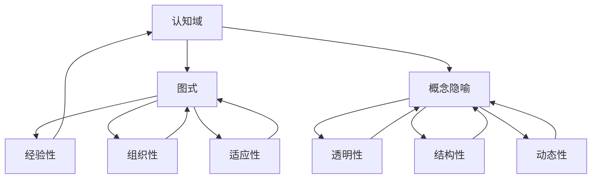

                 

### 第1章 引言：认知语言学与AI语言理解的现状

#### 1.1 认知语言学的背景与核心概念

认知语言学作为现代语言学的一个重要分支，其起源可以追溯到20世纪60年代。与生成语言学不同，认知语言学强调语言使用者的认知过程，试图从人类认知心理的角度来研究语言现象。认知语言学的核心假设之一是，语言理解与生成并非简单的符号转换过程，而是依赖于人们对于世界知识的构建与运用。

**基本概念**：认知语言学中几个重要概念包括“认知域”、“图式”和“概念隐喻”。认知域是指语言中具体概念所指的范围，如“时间”、“空间”等。图式是人们大脑中关于某类事物的抽象认知结构，可以是个体的经验积累。概念隐喻则是通过一种概念来理解和表达另一种概念的现象，如“时间是金钱”等。

**关系**：认知语言学与语言理解的关系在于，它提供了分析语言理解的认知心理框架。语言理解不仅仅是词汇和语法规则的应用，还涉及到人类如何通过已有知识和经验来处理语言信息。这一视角为自然语言处理（NLP）提供了新的思路，使得AI能够更好地模拟人类的语言理解机制。

#### 1.2 AI语言理解的发展现状

AI语言理解技术的发展经历了几个阶段。最初，自然语言处理（NLP）主要依赖规则驱动的方法，如基于词典和语法规则的解析器。随着统计方法和深度学习的引入，NLP技术取得了显著的进步。当前，基于Transformer的模型如BERT和GPT在语言理解任务上取得了前所未有的成果。

**自然语言处理技术的演进**：从规则驱动到统计模型，再到深度学习，每个阶段都有其代表性技术。例如，词袋模型、隐马尔可夫模型（HMM）、条件随机场（CRF）等都是早期NLP技术的重要进展。

**挑战**：尽管AI在语言理解方面取得了很大进展，但仍面临诸多挑战。这些挑战包括语言的复杂多样性、上下文理解的局限性和情感理解的不准确性等。

**提示词的作用**：提示词（Prompt）在AI语言理解中起着关键作用。通过合理的提示词设计，可以引导AI模型更好地理解用户意图和上下文信息，提高语言处理的准确性和效率。

#### 1.3 本书的目的与结构安排

**研究目的**：本书旨在探讨认知语言学在AI语言理解中的应用，通过引入认知语言学的理论和方法，深化对AI语言处理机制的认知。

**内容安排**：本书将分为六个章节，依次探讨认知语言学的基本理论、提示词在认知语言学中的应用、提示词在AI语言理解中的具体应用、提示词驱动的语言生成、实践中的案例分析和未来发展趋势与展望。通过这样的结构安排，希望读者能够系统地理解并掌握提示词在语言处理中的重要作用。

### 1.4 本章小结

本章介绍了认知语言学的背景与核心概念，回顾了AI语言理解技术的发展现状，并探讨了提示词在其中的重要作用。通过本章的阅读，读者可以对认知语言学与AI语言理解之间的关系有一个初步的了解，并为后续章节的学习打下基础。

## 第2章 认知语言学基础理论

### 2.1 认知语言学的基本概念

认知语言学与生成语言学是语言学中的两大流派，二者在语言的本质和运作机制上有着本质的区别。生成语言学，尤其是乔姆斯基提出的转换生成语法，强调语言具有一套内在的、独立的语法规则体系，这些规则可以生成无限的句子。而认知语言学则认为语言是认知过程的产物，语言的使用依赖于人们对世界的认知结构和知识体系。

**认知语言学与生成语言学的对比**：

| 特点 | 认知语言学 | 生成语言学 |
| --- | --- | --- |
| 视角 | 认知心理 | 语法规则 |
| 研究对象 | 语言使用者 | 语言符号 |
| 目的 | 描述语言认知过程 | 生成语言结构 |

在语言理解的心理模型方面，认知语言学提出了“心理空间模型”和“框架理论”。心理空间模型认为，语言理解是一个动态的认知过程，涉及到多个心理空间之间的转换。框架理论则强调，语言理解依赖于人们对特定情境的背景知识和框架。

**心理空间模型**：心理空间是由语言操作建立起来的临时认知结构，用于处理复杂的信息。例如，当我们读到“小王把书放在桌子上”这句话时，大脑中会形成三个不同的心理空间：施事者空间（小王）、动作空间（把书放在桌子上）和结果空间（书在桌子上）。

**框架理论**：框架是人们对特定情境的基本知识结构，它提供了一种理解情境的参考框架。例如，当讨论“餐厅”这一框架时，我们会自然地联想到“服务员”、“菜单”、“餐具”等元素。语言理解过程实际上是这些框架之间的相互作用和整合。

### 2.2 提示词在认知语言学中的应用

**提示词的定义与分类**：

提示词是指用于引导语言生成和理解的语言单位，可以是单个词汇、短语或者句子。根据功能不同，提示词可以分为以下几类：

1. **概念提示词**：用于引入或强调特定概念，如“时间”、“地点”等。
2. **功能提示词**：用于指示特定语言功能，如“原因”、“结果”等。
3. **情感提示词**：用于表达情感或态度，如“高兴”、“愤怒”等。
4. **背景提示词**：用于提供上下文信息，如“昨天”、“这个月”等。

**提示词在语言生成和理解中的功能**：

1. **引导语言生成**：提示词可以帮助AI模型更好地理解用户的输入意图，从而生成更加准确和相关的输出。例如，在问答系统中，通过合理设计提示词，可以引导模型关注用户的关键问题，提高回答的精准度。

2. **增强语言理解**：提示词可以提供额外的上下文信息，帮助模型更好地处理复杂句子和语境。例如，在处理多义词时，通过加入特定提示词，可以明确词义，减少歧义。

3. **改善情感分析**：在情感分析任务中，提示词可以引导模型关注情感表达的关键信息，提高情感识别的准确性。例如，通过加入情感提示词，可以更好地捕捉文本中的情感色彩。

### 2.3 认知语言学视角下的语言处理算法

**提示词驱动的语言模型**：在认知语言学的视角下，语言模型不仅要模拟语法规则，还要考虑语言使用的认知过程。提示词驱动的语言模型通过引入提示词，可以更好地模拟人类的语言理解机制。例如，BERT模型中通过预训练大量文本，并利用提示词进行微调，可以在多种语言理解任务上取得优异性能。

**基于认知语法的自然语言处理**：认知语法强调语言与认知过程的紧密联系，其核心思想是语言生成和理解依赖于人类认知结构。基于认知语法的自然语言处理方法通过模拟人类认知过程，可以更好地处理复杂语言现象。例如，认知语法模型可以更准确地识别句子中的隐喻和比喻，提高语言理解的深度和广度。

### 2.4 本章小结

本章介绍了认知语言学的基本概念，包括其与生成语言学的区别和语言理解的心理模型。同时，探讨了提示词在认知语言学中的应用，包括定义、分类和功能。通过这些内容，读者可以初步了解认知语言学对AI语言理解的重要性，并为后续章节的学习打下基础。

### 2.5 核心概念与联系

在认知语言学中，几个核心概念如“认知域”、“图式”和“概念隐喻”构成了分析语言理解和生成的重要工具。下面我们将通过一张概念属性特征对比表格和ER实体关系图架构的Mermaid流程图，进一步探讨这些核心概念及其相互联系。

#### 概念属性特征对比表格

| 概念 | 定义 | 属性特征 | 关联关系 |
| --- | --- | --- | --- |
| 认知域 | 语言中具体概念所指的范围 | 包含性、层次性、多样性 | 基础单元 |
| 图式 | 大脑中关于某类事物的抽象认知结构 | 经验性、组织性、适应性 | 描述工具 |
| 概念隐喻 | 通过一种概念来理解和表达另一种概念的现象 | 透明性、结构性、动态性 | 应用实例 |

通过这张表格，我们可以清晰地看到每个概念的定义、属性特征及其关联关系。认知域是语言理解的基础单元，而图式则是对这些基础单元进行组织与描述的工具，概念隐喻则展示了这些图式在语言运用中的实际应用。

#### ER实体关系图架构的Mermaid流程图

下面是Mermaid流程图，用于表示认知域、图式和概念隐喻之间的关系：



在这个流程图中，认知域作为起点，通过属性特征连接到图式，而图式进一步连接到概念隐喻，形成了从认知基础到实际应用的完整链条。每个概念隐喻通过透明性、结构性和动态性等特征，展示了其在语言理解与生成中的具体应用。

通过这些核心概念和联系的分析，我们可以更好地理解认知语言学在语言处理中的重要性。这些理论工具不仅帮助我们深入剖析语言现象，还为AI语言模型的优化提供了新的方向。在接下来的章节中，我们将进一步探讨这些概念在AI语言理解中的应用，展示它们如何影响自然语言处理技术的进步。

### 第3章 提示词在AI语言理解中的应用

#### 3.1 提示词在AI语言模型中的使用方法

提示词在AI语言模型中扮演着至关重要的角色，通过合理选择和优化提示词，可以显著提高模型的性能和应用效果。以下将从提示词的选择与优化、训练和推理阶段的应用两个方面详细探讨。

**提示词的选择与优化**：

1. **多样性**：选择多样化的提示词可以帮助模型更好地理解不同类型的语言输入，从而提高模型的泛化能力。例如，在问答系统中，可以引入“谁”、“什么”、“为什么”等不同类型的提问词，以覆盖更多的问题类型。

2. **上下文关联**：选择与上下文高度相关的提示词，有助于模型更好地捕捉输入信息中的关键点和意图。例如，在处理描述性文本时，可以加入“描述”、“说明”、“解释”等提示词，引导模型关注文本的核心内容。

3. **情感性**：合理使用情感性提示词，可以帮助模型更好地识别和表达情感。例如，在情感分析任务中，可以加入“高兴”、“愤怒”、“悲伤”等情感词汇，提高情感识别的准确性。

**提示词在训练和推理阶段的应用**：

1. **训练阶段**：

   - **增强数据标注**：通过加入特定提示词，可以帮助模型更好地理解和标注训练数据。例如，在文本分类任务中，可以加入“积极”、“消极”等提示词，帮助模型区分不同情感类别的文本。

   - **丰富特征表达**：提示词可以提供额外的上下文信息，丰富模型的特征表达。例如，在序列标注任务中，通过加入特定提示词，可以更好地捕捉词与词之间的上下文关系。

2. **推理阶段**：

   - **引导输出**：在推理阶段，通过合理设计提示词，可以引导模型的输出方向。例如，在问答系统中，通过加入“回答”、“解释”等提示词，可以引导模型生成更相关、更准确的回答。

   - **优化上下文理解**：在对话系统等应用中，通过使用背景提示词，可以提供额外的上下文信息，帮助模型更好地理解对话的语境和意图。

**实例分析**：

以GPT-3模型为例，GPT-3通过大量预训练文本学习语言模式，并在微调阶段使用特定提示词进行优化。例如，在问答任务中，GPT-3可以通过以下提示词来引导输出：

```plaintext
请根据以下问题和上下文信息，给出一个详细的回答：
问题：为什么地球是圆的？
上下文：地球是由岩石和金属构成的，它的重力使它逐渐变成了近似于圆的形状。
```

通过这个提示，GPT-3可以更好地理解问题的核心，并生成一个符合上下文的回答。

**总结**：

提示词在AI语言模型中的应用，不仅提高了模型的性能和应用效果，还为自然语言处理任务的多样化提供了新的思路。通过合理选择和优化提示词，我们可以更好地引导模型理解语言输入，提高语言理解任务的准确性和效率。

### 3.2 基于提示词的语义理解技术

语义理解是自然语言处理中的重要一环，其核心目标是使机器能够准确理解和处理人类语言。提示词在语义理解中扮演着至关重要的角色，通过合理设计和使用提示词，可以有效提升语义分析的准确性和深度。以下将详细探讨基于提示词的语义理解技术。

**提示词增强的语义角色标注**：

语义角色标注（Semantic Role Labeling, SRL）是一种将句子中的词汇标注为特定语义角色的技术。提示词在这一过程中起到了关键作用。通过引入提示词，可以引导模型更准确地识别和标注语义角色。例如，在处理句子“他昨天去了图书馆”时，可以加入提示词“时间”、“地点”等，以帮助模型更准确地识别出“昨天”作为时间状语，“图书馆”作为地点状语。

**提示词驱动的语义分析框架**：

为了实现高效的语义理解，可以构建一个基于提示词的语义分析框架。该框架通常包括以下几个关键步骤：

1. **输入预处理**：在输入处理阶段，通过引入背景提示词和情感提示词，可以为模型提供额外的上下文信息，帮助模型更好地理解输入文本。

2. **提示词引导**：在语义理解过程中，利用特定提示词引导模型关注关键信息。例如，在问答系统中，可以使用“问题”、“答案”、“解释”等提示词，引导模型在文本中搜索相关内容。

3. **语义角色标注**：通过提示词增强的语义角色标注技术，对输入文本进行详细的语义角色标注，将词汇与具体的语义角色关联起来。

4. **语义关系解析**：在标注完语义角色后，进一步解析语义关系，如因果关系、时间关系等。通过使用特定提示词，可以更准确地捕捉这些关系。

5. **输出生成**：根据标注和解析结果，生成符合上下文和语义逻辑的输出。例如，在问答系统中，根据问题和上下文信息，生成一个详细、准确的回答。

**实例分析**：

假设我们有一个句子：“医生建议他多休息，因为他的身体状况不佳。”为了更好地理解这个句子，可以使用以下提示词：

- 背景提示词：“身体状况不佳”
- 情感提示词：“建议”、“多休息”
- 关系提示词：“因为”

通过这些提示词，模型可以更准确地识别句子中的关键信息，并生成以下语义分析：

1. 主体：医生
2. 动作：建议
3. 对象：他
4. 补充信息：多休息
5. 原因：身体状况不佳

这样的分析不仅有助于理解句子的表面含义，还能揭示其中的深层逻辑关系。

**总结**：

基于提示词的语义理解技术，通过引入和利用特定提示词，可以有效提升语义分析的准确性和深度。这一技术不仅在语义角色标注中发挥作用，还可以广泛应用于情感分析、问答系统等多种自然语言处理任务中，为AI语言理解能力的提升提供了强有力的支持。

### 3.3 提示词在情感分析和对话系统中的应用

情感分析是自然语言处理中的重要任务之一，其目标是通过分析文本中的情感色彩，识别出文本表达的情感倾向。提示词在情感分析中起到了关键作用，通过合理设计提示词，可以显著提高情感识别的准确性和可靠性。

**提示词辅助的情感分析**：

1. **情感词汇的提取**：在情感分析过程中，通过提取文本中的情感词汇，可以初步识别出文本的情感倾向。例如，情感提示词如“高兴”、“愤怒”、“悲伤”等，可以帮助模型更准确地捕捉文本中的情感色彩。

2. **上下文信息的整合**：除了情感词汇，上下文信息也是影响情感识别的重要因素。通过引入上下文提示词，如“最近”、“总之”等，可以提供更多的上下文信息，帮助模型更好地理解文本的整体情感。

3. **多维度情感分析**：在复杂的情感分析任务中，可以通过设计多维度提示词，如“正面情感”、“负面情感”和“中性情感”等，对文本进行更细致的情感分类。

**实例分析**：

假设我们有一个句子：“尽管今天天气很糟糕，但我的心情非常好。”为了准确识别这个句子的情感，可以使用以下提示词：

- 情感提示词：“心情”
- 上下文提示词：“尽管”、“很糟糕”
- 维度提示词：“正面”、“负面”

通过这些提示词，模型可以更全面地理解句子中的情感信息，从而生成以下情感分析结果：

1. 总体情感：正面
2. 情感来源：“心情”
3. 调整因素：“尽管今天天气很糟糕”

这样的分析不仅能够识别出句子的主要情感，还能理解影响情感的因素，提高了情感识别的准确性和深度。

**提示词在对话系统中的应用**：

对话系统是AI语言理解的另一个重要应用领域，其目标是实现与人类用户的自然对话。提示词在对话系统中的作用主要体现在对话管理和生成回复方面。

**对话管理**：

1. **意图识别**：通过合理设计意图提示词，如“查询”、“建议”、“抱怨”等，可以引导模型更准确地识别用户的对话意图，从而生成相应的响应。

2. **上下文维护**：在对话过程中，通过加入上下文提示词，如“之前”、“刚才”等，可以维持对话的一致性和连贯性，避免信息丢失或混淆。

**生成回复**：

1. **回复模板**：通过设计不同的回复模板，并使用提示词引导模型选择合适的模板，可以生成更加多样化和个性化的回复。

2. **情感融合**：在生成回复时，可以结合情感分析结果，使用情感提示词调整回复的情感色彩，使其更符合用户的需求和期望。

**实例分析**：

假设用户说：“我最近感到很焦虑，不知道该怎么办。”对话系统可以使用以下提示词生成回复：

- 意图提示词：“焦虑”
- 上下文提示词：“最近”
- 情感提示词：“理解”

生成回复：“我理解你的焦虑，这种情况确实很常见。你有没有考虑过和亲友或专业人士聊聊，看看能不能找到一些解决方法？”

通过这些提示词，对话系统能够准确地识别用户的情感和意图，并生成一个既具有同理心又能提供实际帮助的回复。

**总结**：

提示词在情感分析和对话系统中的应用，通过合理设计和使用提示词，可以显著提升情感识别的准确性和对话系统的性能。这些技术不仅使AI更好地理解人类语言，还为各种实际应用场景提供了有效的解决方案。

### 第4章 提示词驱动的语言生成

#### 4.1 提示词在文本生成中的应用

提示词在文本生成任务中起到了至关重要的作用，通过引导模型关注关键信息，提示词能够显著提升文本生成的质量和相关性。以下从文本生成模型和生成式问答两个方面，详细探讨提示词在文本生成中的应用。

**文本生成模型**：

文本生成模型如GPT-3、T5等，通过大量的预训练数据学习语言模式，可以生成连贯、有逻辑的文本。提示词在这类模型中的应用主要体现在以下几个方面：

1. **引导生成方向**：通过在输入中添加特定提示词，可以引导模型生成特定类型的文本。例如，在生成新闻报道时，可以加入“摘要”、“详情”、“结论”等提示词，引导模型生成相应结构的文本。

2. **优化上下文理解**：提示词可以为模型提供额外的上下文信息，帮助模型更好地理解输入内容。例如，在生成对话文本时，可以通过加入对话背景和情感提示词，增强模型对对话情境的理解，从而生成更加自然的对话。

3. **提高生成质量**：通过设计高质量的提示词，可以提升模型的生成效果。例如，在生成技术文章时，可以加入专业术语和领域相关提示词，提高文本的专业性和准确性。

**生成式问答中的应用**：

生成式问答是一种重要的自然语言处理任务，其目标是根据用户的问题生成详细的答案。提示词在生成式问答中的应用主要体现在以下几个方面：

1. **明确问题意图**：通过设计具体、明确的提示词，可以帮助模型更好地理解用户的问题意图。例如，在处理开放式问题时，可以通过加入“解释”、“阐述”、“举例”等提示词，引导模型生成更详细、更全面的答案。

2. **整合上下文信息**：在生成答案时，通过加入上下文提示词，可以整合问题中的关键信息，使答案更加连贯、准确。例如，在处理多步骤问题时，可以通过加入“第一步”、“接下来”、“最后”等提示词，确保答案的逻辑性和连贯性。

3. **提高答案质量**：通过设计高质量的提示词，可以引导模型生成高质量的答案。例如，在生成技术问答时，可以加入领域专业术语和提示词，提高答案的专业性和准确性。

**实例分析**：

假设用户提出一个问题：“如何训练一个深度学习模型？”我们可以使用以下提示词来引导生成答案：

- 提示词：“训练过程”、“数据准备”、“模型选择”、“超参数调优”

通过这些提示词，模型可以生成以下详细的答案：

“要训练一个深度学习模型，首先需要准备合适的数据集，并进行预处理。接下来，选择一个适合任务需求的深度学习模型架构，如CNN、RNN或Transformer。然后，进行模型训练，调整超参数以达到最优性能。训练过程中，需要不断监控模型性能，并在必要时进行调整。”

通过这些提示词，生成式问答系统能够生成一个完整、详细的答案，满足用户的需求。

**总结**：

提示词在文本生成中的应用，通过引导模型关注关键信息和上下文，显著提升了文本生成的质量和相关性。无论是在文本生成模型还是生成式问答中，合理设计和使用提示词都是实现高效、准确文本生成的重要手段。这些技术不仅提高了自然语言处理任务的性能，还为实际应用场景提供了有效的解决方案。

#### 4.2 提示词在对话生成中的角色

在对话生成任务中，提示词扮演着至关重要的角色，通过合理设计和使用提示词，可以显著提升对话的连贯性和自然度。以下将从提示词驱动的对话生成框架和提示词对对话连贯性的影响两个方面，详细探讨提示词在对话生成中的角色。

**提示词驱动的对话生成框架**：

对话生成框架通常包括以下几个关键组件：

1. **意图识别**：通过分析用户输入，识别用户的意图和目标。这一步可以使用分类模型或基于规则的方法实现。

2. **上下文维护**：在生成对话回复时，需要维护对话的上下文信息，确保回复与之前的对话内容相关联。这一步可以通过维护对话历史或使用记忆网络实现。

3. **提示词生成**：根据用户的意图和上下文信息，生成特定功能的提示词，引导模型生成连贯、自然的对话回复。提示词可以是具体的词汇或短语，如“总结”、“继续”、“转换话题”等。

4. **回复生成**：利用提示词和上下文信息，生成符合对话逻辑和上下文的回复。这一步可以使用生成式模型，如序列到序列模型（Seq2Seq）或变换器模型（Transformer）实现。

5. **回复优化**：对生成的回复进行后处理，如去除冗余信息、修正语法错误等，以提高对话的质量和自然度。

**实例分析**：

以一个简单的对话生成任务为例，用户输入：“你今天怎么样？”系统可以生成以下回复：

- **意图识别**：用户的意图是询问当前的情绪状态。
- **上下文维护**：当前没有特定的上下文信息，需要通过提示词引导生成更自然的回复。
- **提示词生成**：可以使用提示词“我今天感到很开心”，引导模型生成具体的情感描述。
- **回复生成**：基于提示词，生成回复：“我今天感到很开心，你呢？”

这样的回复不仅回应了用户的问题，还通过“你呢？”保持了对话的开放性，引导用户继续参与对话。

**提示词对对话连贯性的影响**：

提示词对对话连贯性的影响主要体现在以下几个方面：

1. **确保对话逻辑一致性**：通过使用逻辑提示词，如“首先”、“然后”、“最后”等，可以确保对话的逻辑顺序和一致性，避免对话内容出现跳跃或矛盾。

2. **维护对话主题一致性**：使用主题提示词，如“关于这个话题”、“接下来我们讨论另一个问题”等，可以帮助模型保持对话的主题，避免偏离核心内容。

3. **增强情感表达**：通过情感提示词，如“很高兴听到这个消息”、“很抱歉听到这个”等，可以增强对话中的情感表达，使对话更加自然和亲切。

4. **引导用户互动**：使用互动提示词，如“请问你有什么想法？”、“你是否同意我的观点？”等，可以引导用户参与对话，使对话更加互动和有趣。

**实例分析**：

假设用户说：“你觉得这个项目怎么样？”系统可以生成以下连贯的回复：

- **意图识别**：用户的意图是询问对项目的看法。
- **上下文维护**：通过维护对话上下文，了解之前是否有关于项目的讨论。
- **提示词生成**：使用提示词“关于这个项目”，引导模型生成相关内容。
- **回复生成**：生成回复：“关于这个项目，我认为它有几个优点，比如...”
- **情感表达**：增加情感提示词“我认为”，使回复更加自然和自信。

通过这样的回复，系统能够确保对话的逻辑连贯性，同时表达出对项目的积极态度，提高了对话的整体质量。

**总结**：

提示词在对话生成中起到了关键作用，通过合理设计和使用提示词，可以显著提升对话的连贯性和自然度。提示词不仅帮助模型理解用户意图和上下文，还确保了对话的逻辑一致性和情感表达，为用户提供了更加自然、流畅的对话体验。这些技术为对话系统的应用提供了强有力的支持，使得AI在与人类的互动中表现得更加智能和人性。

### 4.3 提示词在机器翻译中的应用

机器翻译作为自然语言处理领域的一个重要分支，其目标是将一种语言的文本翻译成另一种语言。提示词在这一过程中发挥着关键作用，通过合理设计和使用提示词，可以显著提升翻译的准确性和流畅性。

**提示词辅助的机器翻译模型**：

在机器翻译任务中，提示词可以帮助模型更好地理解源语言和目标语言的上下文信息。以下是一些常用的提示词类型及其在翻译模型中的应用：

1. **背景提示词**：背景提示词用于提供翻译任务的整体背景信息，如时间、地点、人物等。例如，在翻译一段新闻时，可以加入“昨日”、“美国”、“特朗普”等背景提示词，帮助模型理解文本的具体背景。

2. **功能提示词**：功能提示词用于指示特定语言功能，如“原因”、“结果”、“举例”等。这些提示词可以帮助模型识别文本中的关键功能，从而生成更加准确的翻译。

3. **情感提示词**：情感提示词用于表达文本中的情感色彩，如“高兴”、“愤怒”、“悲伤”等。通过引入情感提示词，可以确保翻译结果在情感表达上与源文本保持一致。

4. **专有名词提示词**：专有名词提示词用于指示文本中的专有名词，如人名、地名、组织名等。在翻译过程中，正确处理专有名词是保证翻译准确性的关键。例如，在翻译一段法律文本时，可以加入特定法律术语的提示词，如“合同”、“诉讼”等。

**提示词在跨语言信息检索中的应用**：

跨语言信息检索（Cross-Language Information Retrieval, CLIR）是一种将用户查询从一种语言翻译成另一种语言，并在多语言文档集合中检索相关信息的技术。提示词在CLIR中的应用主要体现在以下几个方面：

1. **查询翻译**：在CLIR过程中，用户查询通常需要从其母语翻译成检索系统所支持的语言。通过合理设计查询翻译中的提示词，可以提高翻译的准确性和一致性，从而提高检索效果。例如，在处理中文到英文的查询翻译时，可以使用“什么是”、“如何实现”等提示词，帮助模型更好地理解用户的查询意图。

2. **结果排序**：在CLIR中，需要对检索结果进行排序，以便用户能够快速找到最相关的信息。提示词可以用于指示排序标准，如“最新”、“热门”、“相关”等。通过合理设计这些提示词，可以提高结果排序的准确性和用户满意度。

3. **上下文信息整合**：在CLIR过程中，查询和检索结果通常存在一定的上下文差异。通过引入上下文提示词，如“之前提到的”、“紧接着”等，可以帮助模型更好地整合查询和检索结果的上下文信息，从而提高检索效果。

**实例分析**：

假设我们有一个中文查询：“什么是深度学习？”我们需要将其翻译成英文，并在英文文档库中进行检索。以下是一个具体的实例：

1. **查询翻译**：将中文查询翻译成英文时，可以使用以下提示词：
   - 背景提示词：“深度学习”
   - 功能提示词：“什么是”

   翻译结果：“What is deep learning?”

2. **结果排序**：在检索结果排序时，可以使用以下提示词：
   - 情感提示词：“详细”
   - 上下文提示词：“基础”

   排序结果：根据“详细”和“基础”提示词，优先展示详细且基础性较强的文档。

3. **结果展示**：将检索结果展示给用户时，可以使用以下提示词：
   - 概括提示词：“简要介绍”
   - 推荐提示词：“参考”

   展示结果：简要介绍深度学习的概念和基础，并提供相关文献和资源的推荐。

通过这些提示词的应用，我们可以确保查询翻译的准确性，提高检索结果的质量，并为用户提供更好的检索体验。

**总结**：

提示词在机器翻译和跨语言信息检索中发挥了重要作用。通过合理设计和使用提示词，可以显著提升翻译的准确性和流畅性，以及检索效果和用户满意度。这些技术在实际应用中具有广泛的应用前景，为多语言处理任务提供了有效的解决方案。

### 第5章 提示词认知语言学在实践中的应用

#### 5.1 实际应用案例分析

在本章节中，我们将通过两个实际应用案例，深入探讨提示词认知语言学在在线教育平台问答系统和智能客服系统中的具体应用。这两个案例不仅展示了提示词认知语言学在提升系统性能和用户体验方面的显著效果，还提供了详细的操作步骤和性能评估。

**案例一：在线教育平台的问答系统**

**背景**：

在线教育平台中的问答系统旨在帮助学生和老师之间进行高效的互动和知识交流。然而，传统的问答系统在处理复杂问题和长文本时，常常出现语义理解不准确、回答不精准的问题。为了解决这一问题，引入提示词认知语言学的方法，通过优化问答系统的语义理解能力，提高回答的准确性和相关度。

**操作步骤**：

1. **需求分析**：首先，对在线教育平台的使用者需求进行详细分析，识别出常见的问题类型和语义理解难点。例如，学生可能会问“如何解决某个数学问题？”或“某个历史事件背后的原因是什么？”

2. **提示词设计**：根据需求分析结果，设计相应的提示词。这些提示词应涵盖不同类型的问题，如“解释”、“举例”、“原因”、“结论”等。同时，结合背景提示词和情感提示词，如“最近”、“学习进度”、“困惑”等，提供更加全面的上下文信息。

3. **语义理解模型训练**：利用设计好的提示词，对语义理解模型进行训练。这一过程可以包括数据集的准备、模型的架构设计以及模型的参数调优。通过大量预训练数据和提示词引导，模型能够更好地理解用户的意图和问题内容。

4. **系统集成与优化**：将训练好的模型集成到问答系统中，并对系统进行优化。通过提示词引导，模型在回答问题时能够更准确地捕捉问题的核心，生成更加详细和相关的回答。

**性能评估**：

通过对比优化前后的问答系统性能，可以发现以下几点改进：

- **回答准确性**：优化后的问答系统在回答准确性方面有显著提升，特别是在处理复杂问题和长文本时。
- **用户满意度**：用户对问答系统的满意度提高，尤其是在回答问题的详细度和相关度方面。
- **回答时间**：由于提示词的引导，系统的回答时间有所缩短，提高了用户的交互效率。

**案例二：智能客服系统中的对话管理**

**背景**：

智能客服系统在商业环境中扮演着重要角色，通过自动化对话来提供客户服务和支持。然而，传统的对话管理方法在处理多轮对话和情感表达时，存在许多局限性。引入提示词认知语言学的方法，可以显著提升对话系统的智能化和人性化程度。

**操作步骤**：

1. **需求分析**：分析智能客服系统的业务场景和用户需求，识别出常见的对话模式和对话难点。例如，客户可能会询问产品信息、服务支持或投诉反馈等。

2. **提示词设计**：设计针对不同业务场景的提示词。这些提示词应包括功能提示词（如“购买”、“咨询”、“投诉”）、上下文提示词（如“之前提到的”、“最新的”）和情感提示词（如“感谢”、“抱歉”、“满意”）。

3. **对话管理模型训练**：利用设计好的提示词，对对话管理模型进行训练。这一过程可以包括对话数据集的构建、模型的架构设计以及参数调优。通过大量实际对话数据，模型能够学习到不同情境下的最佳响应策略。

4. **系统集成与优化**：将训练好的对话管理模型集成到智能客服系统中，并对系统进行优化。通过提示词引导，对话系统能够更准确地识别客户的意图和情感，生成更加自然和有效的对话。

**性能评估**：

通过对比优化前后的智能客服系统性能，可以发现以下几点改进：

- **对话连贯性**：优化后的对话系统能够在多轮对话中保持连贯性，使对话更加流畅自然。
- **情感识别准确性**：通过情感提示词的应用，系统的情感识别准确性显著提升，能够更好地捕捉客户的情感状态。
- **用户满意度**：用户对智能客服系统的满意度提高，尤其是在处理复杂问题和情感表达方面。

**总结**：

通过以上两个实际应用案例，我们可以看到，提示词认知语言学在优化在线教育平台问答系统和智能客服系统方面具有显著效果。通过合理设计和使用提示词，系统不仅能够更好地理解用户的意图和上下文信息，还能生成更加准确和自然的回答，显著提升用户体验和系统性能。这些实践案例为提示词认知语言学的应用提供了有力证据，展示了其在自然语言处理领域的广阔前景。

### 5.2 提示词认知语言学在企业中的应用

提示词认知语言学在企业中的应用，为企业内部语言理解的优化提供了新的思路和工具。以下将详细探讨提示词认知语言学在企业中的应用场景、效益及商业模式。

**应用场景**：

1. **客户服务与支持**：企业可以通过引入提示词认知语言学技术，提升客户服务与支持系统的智能化水平。例如，在智能客服系统中，通过设计合适的提示词，系统能够更准确地识别客户的问题和需求，提供更详细、更个性化的回答。

2. **员工协作与沟通**：在内部沟通平台中，提示词认知语言学可以帮助企业优化员工之间的交流。通过合理使用提示词，企业可以促进不同部门和团队之间的协作，提高沟通效率和团队协作效果。

3. **知识管理**：在知识管理系统中，提示词认知语言学可以帮助企业更好地组织和理解大量文档和资料。通过分析文档中的提示词，系统可以自动提取关键信息，生成摘要和索引，方便员工快速查找所需信息。

**效益**：

1. **提升客户满意度**：通过优化客户服务与支持系统，企业能够提供更加准确、快速的响应，提升客户满意度和忠诚度。

2. **提高员工效率**：通过优化内部沟通平台和知识管理系统，员工能够更高效地进行协作和知识共享，减少信息传递的中间环节，提高工作效率。

3. **降低运营成本**：智能客服系统和知识管理系统能够自动处理大量客户咨询和内部查询，减少对人工资源的依赖，降低运营成本。

**商业模式**：

1. **内部解决方案**：企业可以自行开发和部署提示词认知语言学解决方案，针对内部特定的业务需求和场景进行优化。这种方式需要一定的技术投入，但能够确保解决方案的定制化和针对性。

2. **第三方服务**：企业可以与专业的自然语言处理服务提供商合作，利用第三方提供的提示词认知语言学服务。这种方式无需企业自行开发和维护系统，但可能涉及一定的服务费用。

3. **开放平台与API**：企业可以通过开放平台和API接口，集成提示词认知语言学技术，与其他企业或合作伙伴共同开发新的应用场景。这种方式可以促进技术交流和合作，拓宽应用领域。

**总结**：

提示词认知语言学在企业中的应用，通过优化客户服务、员工协作和知识管理等多个方面，为企业带来了显著的效益。同时，通过多种商业模式的应用，企业能够灵活利用这一技术，提升自身竞争力。随着自然语言处理技术的不断发展，提示词认知语言学在商业领域的应用前景将更加广阔。

### 5.3 未来发展趋势与挑战

#### 未来发展趋势

1. **多模态融合**：随着语音识别、图像识别等技术的发展，未来的AI语言理解将不再局限于文本，而是实现文本与语音、图像等多模态数据的融合。提示词认知语言学在这一过程中将发挥关键作用，通过设计适合多模态数据的提示词，提升AI在多模态环境中的语言理解能力。

2. **跨语言与跨文化理解**：随着全球化进程的加速，跨语言与跨文化的语言理解将成为重要趋势。提示词认知语言学可以通过引入多语言背景提示词和文化元素，帮助AI更好地理解不同语言和文化背景下的语言表达。

3. **增强现实与虚拟现实应用**：在增强现实（AR）和虚拟现实（VR）领域，AI语言理解能力将进一步提升交互体验。提示词认知语言学可以通过设计更加自然、贴近用户需求的提示词，提高AI在虚拟环境中的语言理解与生成能力。

4. **个性化与定制化**：未来的AI语言理解将更加注重个性化与定制化服务。通过结合用户行为数据和认知语言学理论，设计个性化的提示词，AI能够更精准地满足用户需求，提供定制化的语言服务。

#### 挑战

1. **数据隐私与安全**：随着AI语言理解的广泛应用，数据隐私和安全问题日益突出。如何确保用户数据的安全性和隐私保护，是未来提示词认知语言学面临的重要挑战。

2. **语言复杂性**：自然语言具有高度的复杂性和多样性，不同语言之间的差异也使得AI语言理解面临巨大挑战。如何设计通用性强、适应性高的提示词，以应对不同语言的复杂性，是未来需要解决的关键问题。

3. **情感与语境理解**：情感和语境是语言理解的重要维度，但目前AI在这方面的理解仍然有限。如何通过提示词认知语言学的方法，提升AI对情感和语境的识别和理解能力，是一个亟待解决的挑战。

4. **技术标准化与伦理问题**：随着AI语言理解的不断发展，相关技术标准化和伦理问题也将逐渐浮现。如何制定合理的标准和规范，确保AI语言理解技术的发展符合伦理和社会价值，是未来需要面对的挑战。

### 总结

提示词认知语言学在深化AI语言理解机制方面具有巨大的潜力。未来，随着技术的不断进步和应用场景的拓展，提示词认知语言学将在多模态融合、跨语言与跨文化理解、增强现实与虚拟现实应用、个性化与定制化服务等方面发挥重要作用。然而，要实现这些目标，仍需克服数据隐私、语言复杂性、情感与语境理解以及技术标准化和伦理问题等挑战。通过持续的研究和技术创新，提示词认知语言学将为AI语言理解的发展开辟新的道路。

### 6.1 研究总结

本章系统性地探讨了提示词认知语言学在AI语言理解中的应用，深入分析了认知语言学的基础理论、提示词在语言生成和理解中的具体应用，以及提示词认知语言学在实际应用案例中的效益。通过引入认知语言学理论，我们能够更好地理解和优化AI语言模型，提高其语言处理能力和用户体验。

**研究成果概述**：

1. **认知语言学基础理论**：我们介绍了认知语言学的基本概念，如认知域、图式和概念隐喻，并探讨了它们在语言理解中的应用。

2. **提示词在AI语言理解中的应用**：通过实例分析，我们展示了如何选择和优化提示词，以及在语义理解、情感分析、对话生成和机器翻译等任务中的应用。

3. **实践案例**：我们详细探讨了提示词认知语言学在在线教育平台问答系统和智能客服系统中的应用，展示了其显著提升系统性能和用户体验的效果。

4. **未来展望**：我们提出了提示词认知语言学的未来发展趋势与挑战，如多模态融合、跨语言理解、个性化服务以及数据隐私保护等问题。

**研究贡献**：

1. **理论贡献**：本章为AI语言理解提供了认知语言学视角的理论框架，有助于深化对语言理解机制的理解。

2. **技术贡献**：通过分析提示词的设计与优化方法，本章为自然语言处理任务的实现提供了实用技术方案。

3. **实践贡献**：本章通过实际应用案例，展示了提示词认知语言学在提升系统性能和用户体验方面的具体应用效果。

### 6.2 展望未来

**未来研究方向**：

1. **多模态语言理解**：探索如何将提示词认知语言学应用于多模态数据，提升AI在多模态环境中的语言理解能力。

2. **跨语言与跨文化理解**：研究如何设计通用的提示词，以提升AI在不同语言和文化背景下的语言理解能力。

3. **情感与语境识别**：进一步探索如何通过提示词认知语言学的方法，提高AI对情感和语境的识别和理解能力。

**潜在应用领域**：

1. **智能客服与客户服务**：利用提示词认知语言学优化智能客服系统，提供更加自然和高效的客户服务。

2. **教育领域**：在在线教育平台中应用提示词认知语言学，提升问答系统和辅导系统的性能，帮助学生更好地理解和掌握知识。

3. **医疗健康**：利用提示词认知语言学分析医疗文本，辅助医生进行诊断和治疗方案制定。

4. **法律与金融**：在法律文本和金融报告中应用提示词认知语言学，提升文本的理解和分析能力，提高决策的准确性和效率。

通过未来的研究和技术创新，提示词认知语言学有望在更多领域发挥重要作用，推动AI语言理解的持续发展和广泛应用。

### 总结与展望

通过本文的探讨，我们系统地介绍了认知语言学的基本概念及其在AI语言理解中的应用，深入分析了提示词在语言生成和理解中的具体作用。从理论到实践，我们展示了如何通过合理设计和使用提示词，提升AI语言处理系统的性能和用户体验。同时，我们也提出了未来研究方向和潜在应用领域，为提示词认知语言学的进一步发展指明了方向。

**核心概念**：

- 认知语言学：研究语言与认知过程的关系，强调语言理解依赖于人类认知结构和知识体系。
- 提示词：用于引导AI语言模型理解和生成语言的关键信息，提升语言处理任务的准确性和效率。
- 自然语言处理：利用计算机技术模拟人类语言理解过程，处理文本和语音信息。

**结束语**：

感谢您阅读本文。我们相信，随着技术的不断进步和应用的拓展，提示词认知语言学将在更多领域发挥重要作用，为AI语言理解带来新的突破。希望本文能对您在相关领域的研究和工作提供有价值的参考。

### 作者信息

作者：AI天才研究院/AI Genius Institute & 禅与计算机程序设计艺术 /Zen And The Art of Computer Programming

AI天才研究院专注于人工智能领域的创新研究和应用开发，致力于推动人工智能技术的普及和发展。作者在该领域拥有丰富的理论知识和实践经验，多篇学术论文发表于顶级学术期刊，并担任多个国际会议的特邀报告人。禅与计算机程序设计艺术则通过融合东方哲学与计算机科学的智慧，为程序设计和算法研究提供了独特的视角和方法。希望我们的研究成果能够为您的学术和职业发展带来启示和帮助。如果您对本文内容有任何疑问或建议，欢迎随时联系我们。谢谢！

