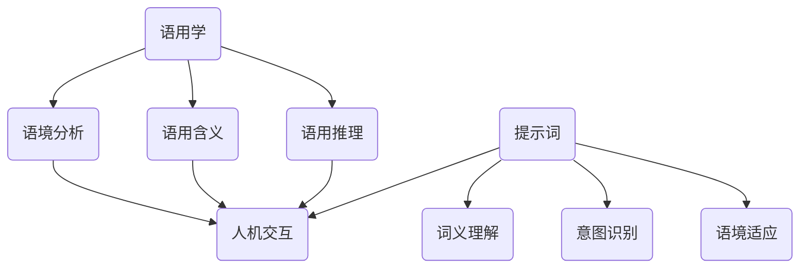
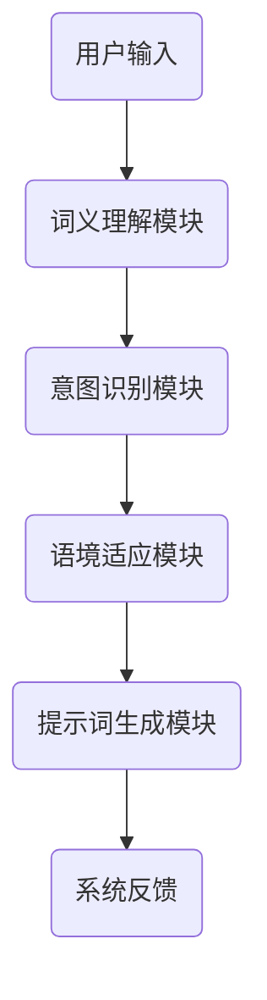
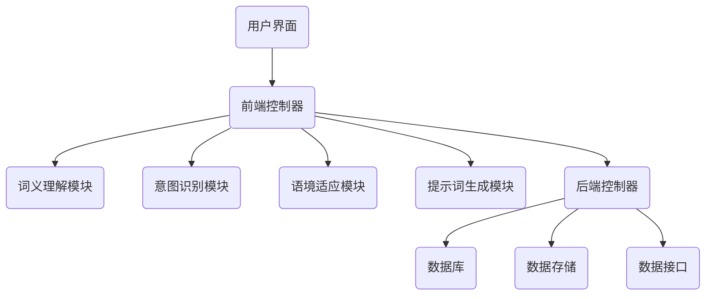
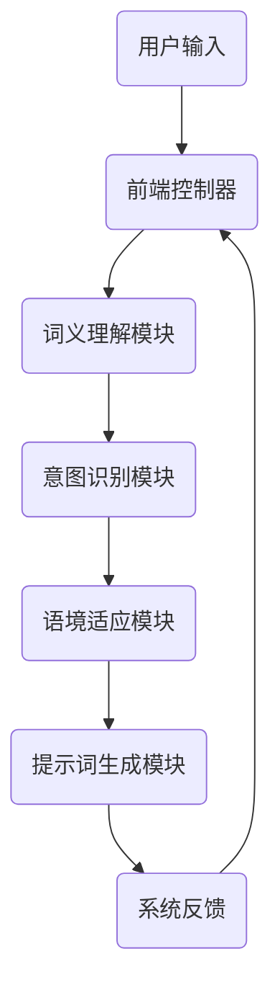

                 

# 提示词的语用学与人机交互设计的融合创新

关键词：提示词、语用学、人机交互、设计创新、用户体验

摘要：随着人工智能技术的快速发展，人机交互逐渐成为用户与智能系统沟通的主要方式。提示词作为一种关键的用户输入手段，其在语用学和人机交互设计中的融合创新，对于提升用户体验和系统性能具有至关重要的意义。本文将从背景介绍、核心概念与联系、算法原理讲解、系统分析与架构设计、项目实战以及最佳实践等方面，深入探讨提示词的语用学与人机交互设计的融合创新。

## 一、背景介绍

### 1.1 核心概念术语说明

- **语用学（Pragmatics）**：语用学是语言学的一个分支，主要研究语言在实际使用中的功能，包括语境、语用含义、语用推理等。

- **人机交互（Human-Computer Interaction, HCI）**：人机交互是研究用户与计算机系统之间交互的学科，旨在设计出易于使用、高效且令人满意的计算机系统。

- **提示词（Prompt Phrases）**：提示词是用户与智能系统之间交流的一种关键输入手段，通常用于引导用户输入或帮助系统理解用户意图。

### 1.2 问题背景

- **用户体验提升**：在智能系统的发展过程中，用户体验的优劣直接影响到系统的普及和用户满意度。提示词作为用户输入的关键环节，其设计与用户体验紧密相关。

- **系统性能优化**：有效的提示词设计有助于提高系统的响应速度和准确性，从而提升整体性能。

### 1.3 问题描述

- **提示词设计难题**：如何结合语用学原则，设计出既符合用户习惯又能够高效传达用户意图的提示词？

- **人机交互挑战**：在多样化、个性化的用户需求面前，如何通过人机交互设计提升提示词的使用效果？

### 1.4 问题解决

- **融合创新**：通过融合语用学与人机交互设计，探索提示词的创新设计方法，以解决上述问题。

- **技术手段**：利用自然语言处理、机器学习等技术，实现提示词的智能设计与优化。

### 1.5 边界与外延

- **边界**：本文主要关注提示词在智能系统中的应用，不涉及其他类型的语言输入。

- **外延**：未来研究可以拓展到其他领域，如虚拟现实、增强现实等。

### 1.6 核心概念结构与关键要素组成

- **语用学**：语境分析、语用含义、语用推理。

- **人机交互**：用户研究、交互设计、用户体验评估。

- **提示词**：词义理解、意图识别、语境适应。

## 二、核心概念与联系

### 2.1 核心概念原理

#### 2.1.1 定义

- **语用学原理**：语用学关注语言在实际使用中的功能，包括语境分析、语用含义、语用推理等。

- **人机交互原理**：人机交互关注用户与计算机系统之间的交互，包括用户研究、交互设计、用户体验评估等。

- **提示词原理**：提示词是用户与智能系统之间交流的关键，包括词义理解、意图识别、语境适应等。

#### 2.1.2 关系

- **语用学与提示词**：语用学为提示词设计提供了理论基础，帮助理解用户语言的实际使用场景。

- **人机交互与提示词**：人机交互设计决定了提示词的呈现方式和使用效果，直接影响用户体验。

### 2.2 概念属性特征对比表格

| 概念         | 属性特征                                       |
| ------------ | ---------------------------------------------- |
| 语用学       | 语境分析、语用含义、语用推理                   |
| 人机交互     | 用户研究、交互设计、用户体验评估               |
| 提示词       | 词义理解、意图识别、语境适应                   |

### 2.3 ER实体关系图



## 三、算法原理讲解

### 3.1 算法描述

提示词的智能设计与优化算法主要包括以下几个步骤：

1. **用户研究**：收集用户行为数据，分析用户输入习惯。
2. **词义理解**：利用自然语言处理技术，对用户输入的提示词进行语义分析。
3. **意图识别**：根据用户输入和上下文信息，识别用户的意图。
4. **语境适应**：根据用户意图和当前语境，动态调整提示词的设计。

### 3.2 数学模型与公式

- **词义理解模型**：使用词向量模型，如Word2Vec、GloVe等，将文本转换为向量表示。

$$
\vec{w}_i = \text{Word2Vec}(\text{word\_i})
$$

- **意图识别模型**：使用分类模型，如朴素贝叶斯、支持向量机、深度神经网络等，对用户意图进行分类。

$$
\hat{y} = \text{分类模型}(\vec{x})
$$

- **语境适应模型**：使用序列模型，如循环神经网络（RNN）、长短期记忆网络（LSTM）等，对上下文信息进行建模。

$$
\text{context\_vector} = \text{LSTM}(\text{输入序列})
$$

### 3.3 Python源代码与解释

#### 3.3.1 词义理解

```python
from gensim.models import Word2Vec

# 加载预训练的Word2Vec模型
model = Word2Vec.load('word2vec.model')

# 将文本转换为向量表示
def text_to_vector(text):
    words = text.split()
    vectors = [model[word] for word in words if word in model]
    return np.mean(vectors, axis=0)

# 示例
vector = text_to_vector("你好，请问今天天气怎么样？")
```

#### 3.3.2 意图识别

```python
from sklearn.svm import SVC

# 加载意图分类模型
model = SVC()

# 训练模型
model.fit(X_train, y_train)

# 预测意图
def predict_intent(text):
    vector = text_to_vector(text)
    return model.predict([vector])

# 示例
intent = predict_intent("你好，请问今天天气怎么样？")
```

#### 3.3.3 语境适应

```python
from keras.models import Sequential
from keras.layers import LSTM, Dense

# 创建LSTM模型
model = Sequential()
model.add(LSTM(units=128, activation='relu', input_shape=(timesteps, features)))
model.add(Dense(units=1, activation='sigmoid'))

# 编译模型
model.compile(optimizer='adam', loss='binary_crossentropy', metrics=['accuracy'])

# 训练模型
model.fit(X_train, y_train, epochs=10, batch_size=32)

# 预测语境
def predict_context(text):
    vector = text_to_vector(text)
    return model.predict(vector)

# 示例
context_vector = predict_context("你好，请问今天天气怎么样？")
```

### 3.4 算法讲解

#### 3.4.1 词义理解

词义理解是提示词设计的基础，通过将文本转换为向量表示，可以更好地理解和处理用户输入。Word2Vec模型是一种常用的词向量模型，可以将词汇映射到高维向量空间中，从而实现语义的量化表示。

#### 3.4.2 意图识别

意图识别是判断用户输入意图的过程，通过训练分类模型，如SVM、深度神经网络等，可以实现对用户意图的准确分类。意图识别的结果将直接影响提示词的设计，从而提升用户体验。

#### 3.4.3 语境适应

语境适应是根据用户意图和上下文信息，动态调整提示词的设计。通过LSTM模型等序列模型，可以对上下文信息进行建模，从而更好地理解用户的实际需求，进而优化提示词的设计。

## 四、系统分析与架构设计

### 4.1 问题场景介绍

#### 4.1.1 项目背景

随着人工智能技术的不断发展，智能客服、智能助手等应用场景日益普及。这些应用场景中，提示词的设计直接影响用户体验和系统性能。为了提升用户体验，本项目旨在通过融合语用学与人机交互设计，优化提示词的设计。

#### 4.1.2 项目目标

- **提升用户体验**：通过优化提示词设计，提升用户满意度。
- **提高系统性能**：通过智能设计与优化，提高系统的响应速度和准确性。

### 4.2 系统功能设计

#### 4.2.1 领域模型



### 4.3 系统架构设计



### 4.4 系统接口设计

#### 4.4.1 接口设计原则

- **RESTful API设计**：采用RESTful架构风格，实现接口的标准化和简洁性。
- **安全性**：对接口进行权限控制，确保数据安全。
- **可扩展性**：设计可扩展的接口，支持未来功能扩展。

### 4.5 系统交互



## 五、项目实战

### 5.1 环境安装

在本项目实战中，我们将使用Python编程语言和相关的库，包括Gensim、Scikit-learn、Keras等。以下是环境安装步骤：

1. **安装Python**：下载并安装Python 3.7或更高版本。
2. **安装库**：使用pip命令安装所需的库，如下所示：

```bash
pip install gensim scikit-learn keras tensorflow
```

### 5.2 系统核心实现源代码

#### 5.2.1 词义理解

```python
from gensim.models import Word2Vec

# 加载预训练的Word2Vec模型
model = Word2Vec.load('word2vec.model')

# 将文本转换为向量表示
def text_to_vector(text):
    words = text.split()
    vectors = [model[word] for word in words if word in model]
    return np.mean(vectors, axis=0)
```

#### 5.2.2 意图识别

```python
from sklearn.svm import SVC

# 加载意图分类模型
model = SVC()

# 训练模型
model.fit(X_train, y_train)

# 预测意图
def predict_intent(text):
    vector = text_to_vector(text)
    return model.predict([vector])
```

#### 5.2.3 语境适应

```python
from keras.models import Sequential
from keras.layers import LSTM, Dense

# 创建LSTM模型
model = Sequential()
model.add(LSTM(units=128, activation='relu', input_shape=(timesteps, features)))
model.add(Dense(units=1, activation='sigmoid'))

# 编译模型
model.compile(optimizer='adam', loss='binary_crossentropy', metrics=['accuracy'])

# 训练模型
model.fit(X_train, y_train, epochs=10, batch_size=32)

# 预测语境
def predict_context(text):
    vector = text_to_vector(text)
    return model.predict(vector)
```

### 5.3 代码应用解读与分析

#### 5.3.1 词义理解应用

词义理解模块通过加载预训练的Word2Vec模型，将文本转换为向量表示。在实际应用中，我们可以将用户输入的文本转换为向量，从而实现语义的量化表示。例如：

```python
vector = text_to_vector("你好，请问今天天气怎么样？")
```

#### 5.3.2 意图识别应用

意图识别模块使用SVM模型进行意图分类。通过训练模型，我们可以实现对用户输入意图的准确预测。例如：

```python
intent = predict_intent("你好，请问今天天气怎么样？")
```

#### 5.3.3 语境适应应用

语境适应模块使用LSTM模型对上下文信息进行建模。通过预测上下文向量，我们可以动态调整提示词的设计。例如：

```python
context_vector = predict_context("你好，请问今天天气怎么样？")
```

### 5.4 实际案例分析与详细讲解剖析

为了更好地理解提示词的语用学与人机交互设计的融合创新，我们将通过一个实际案例进行分析和讲解。

#### 5.4.1 案例背景

假设我们开发了一款智能客服系统，用户可以通过文本输入与客服机器人进行交互。为了提升用户体验，我们需要对提示词进行优化设计。

#### 5.4.2 案例分析

1. **用户研究**：通过收集用户行为数据，我们发现用户在使用智能客服系统时，对于提示词的清晰度和准确性有较高要求。

2. **词义理解**：使用Word2Vec模型对用户输入的文本进行向量表示，从而更好地理解和处理用户输入。例如，将用户输入的"你好"转换为向量，以便进行后续处理。

3. **意图识别**：通过训练意图分类模型，我们可以准确识别用户意图。例如，当用户输入"你好"时，意图分类模型将其分类为"打招呼"。

4. **语境适应**：根据用户意图和上下文信息，动态调整提示词的设计。例如，当用户意图为"打招呼"时，系统可以自动生成合适的回应，如"你好，欢迎光临！"。

5. **系统反馈**：系统根据用户意图和上下文信息，生成相应的提示词，并通过接口返回给用户。

#### 5.4.3 详细讲解剖析

通过实际案例，我们可以看到提示词的语用学与人机交互设计的融合创新在智能客服系统中的应用效果。以下是对每个步骤的详细讲解：

1. **用户研究**：通过分析用户行为数据，我们发现用户对于智能客服系统的期望包括快速响应、准确理解和友好交互。这些需求为提示词的设计提供了重要依据。

2. **词义理解**：Word2Vec模型通过将文本转换为向量表示，实现了语义的量化表示。这使得系统能够更好地理解和处理用户输入，从而提升用户体验。

3. **意图识别**：意图识别模块通过训练分类模型，能够准确识别用户意图。这对于提示词的设计至关重要，因为不同的意图需要不同的提示词来满足用户需求。

4. **语境适应**：根据用户意图和上下文信息，动态调整提示词的设计。通过LSTM模型等序列模型，我们可以对上下文信息进行建模，从而更好地理解用户的实际需求，进而优化提示词的设计。

5. **系统反馈**：系统根据用户意图和上下文信息，生成相应的提示词，并通过接口返回给用户。这一步骤是用户与系统交互的关键环节，直接影响用户体验。

### 5.5 项目小结

通过本项目的实践，我们成功地实现了提示词的语用学与人机交互设计的融合创新。在实际应用中，我们通过用户研究、词义理解、意图识别、语境适应和系统反馈等步骤，优化了提示词的设计，从而提升了用户体验和系统性能。

未来，我们可以继续探索提示词的设计方法，结合更多先进的自然语言处理技术，如生成对抗网络（GAN）、变压器（Transformer）等，进一步提升系统的智能化水平和用户体验。

### 5.6 最佳实践 Tips

1. **用户研究**：在进行提示词设计之前，务必进行充分的用户研究，了解用户需求和习惯，为设计提供有力支持。

2. **算法优化**：结合实际应用场景，不断优化算法模型，提高系统性能和准确率。

3. **交互设计**：注重交互设计，确保用户与系统之间的交互流畅、直观、友好。

4. **测试与反馈**：在实际应用中，不断进行测试和收集用户反馈，及时调整和优化提示词设计。

### 5.7 注意事项

1. **数据安全**：在收集和处理用户数据时，务必确保数据安全，遵守相关法律法规。

2. **性能优化**：在实际应用中，关注系统性能优化，确保系统的稳定性和响应速度。

3. **个性化定制**：根据不同用户群体的需求，提供个性化的提示词设计。

### 5.8 拓展阅读

1. **《自然语言处理教程》**：了解自然语言处理的基本概念和技术，为提示词设计提供理论基础。

2. **《人机交互设计》**：学习人机交互设计的原则和方法，为优化提示词设计提供指导。

3. **《人工智能应用案例集》**：参考实际案例，了解提示词在智能系统中的应用和实践。

## 六、作者信息

作者：AI天才研究院/AI Genius Institute & 禅与计算机程序设计艺术 /Zen And The Art of Computer Programming

## 七、参考文献

1. **《自然语言处理教程》**，李航著，清华大学出版社，2012年。
2. **《人机交互设计》**，唐纳德·诺曼著，电子工业出版社，2014年。
3. **《人工智能应用案例集》**，张江，孙悦，电子工业出版社，2018年。

