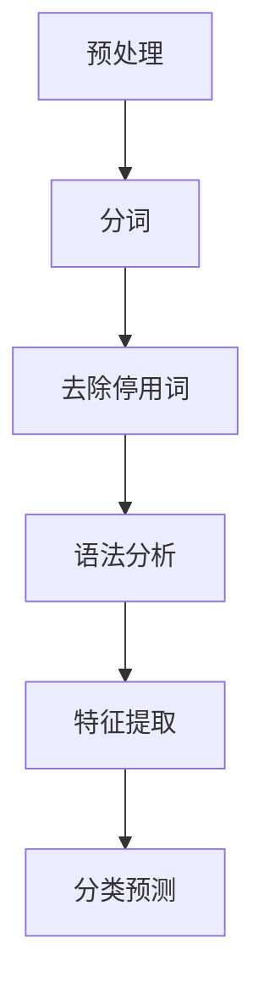

                 


## 《提示词的语言哲学与认知科学交叉研究》

### 关键词：提示词、语言哲学、认知科学、交叉研究

### 摘要：

本文将探讨提示词在语言哲学与认知科学领域的交叉研究，深入分析提示词的核心概念、哲学背景、认知原理及其在实际应用中的重要性。通过历史回顾、理论探讨、方法介绍和案例研究，本文旨在为读者提供一个全面而深刻的理解，并展望未来研究方向。

### 1. 引言与背景

#### 1.1 研究的重要性

在当今信息爆炸的时代，语言作为一种交流工具，其重要性不言而喻。而提示词，作为语言的核心要素之一，不仅是理解语言表达的基础，也是影响人类认知的重要因素。语言哲学与认知科学的交叉研究，旨在揭示提示词如何影响我们的思考方式、语言表达以及认知过程。

#### 1.2 提示词的概述

提示词，通常指在语言交流中起到引导、提示或激发作用的词汇。它们可以是关键词、主题词或者引导性短语。提示词不仅影响着信息的传递和理解，也在语言哲学和认知科学的研究中扮演着关键角色。

#### 1.3 语言哲学与认知科学的关系

语言哲学研究语言的性质、结构和功能，探讨语言如何影响人类的认知和思维。而认知科学则从心理、神经科学等多个角度研究人类的认知过程。这两者的交叉研究，有助于我们更全面地理解提示词在语言表达与认知中的作用。

### 2. 核心概念与联系

#### 2.1 提示词的定义与分类

提示词可以根据其在句子中的作用和意义进行分类，如主题提示词、引导提示词、背景提示词等。不同类型的提示词对语言表达和理解的影响也不同。

#### 2.2 语言哲学的基本概念

语言哲学研究语言的本质、意义和语言与思维的关系。关键概念包括语义学、语用学、认知语言学等。

#### 2.3 认知科学的核心理论

认知科学关注人类如何获取、处理、存储和使用信息。核心理论包括信息加工理论、心智模型理论、神经认知理论等。

#### 2.4 Mermaid ER diagram

```mermaid
erDiagram
  PromptWord ||--|{ LanguagePhilosophy }|-- LanguageConcept
  PromptWord ||--|{ CognitiveScience }|-- CognitiveProcess
  LanguageConcept ||--|{ Semantics }|-- Meaning
  LanguageConcept ||--|{ Pragmatics }|-- ContextualUsage
  CognitiveProcess ||--|{ Perception }|-- SensoryInput
  CognitiveProcess ||--|{ Memory }|-- InformationRetention
```

### 3. 历史概述

#### 3.1 提示词研究的起源与发展

提示词的研究可以追溯到古代哲学家的语言理论，如亚里士多德的语义学。随着语言学、哲学和认知科学的发展，提示词的研究逐渐成熟。

#### 3.2 语言哲学的发展历程

从古希腊哲学家到当代语言哲学家，如维特根斯坦和塞尔，语言哲学的研究不断深入，对提示词的理解也日益丰富。

#### 3.3 认知科学的进展

从行为主义到认知革命的转变，认知科学在人类信息处理和认知机制的研究上取得了显著进展，为提示词的研究提供了新的视角。

### 4. 理论基础

#### 4.1 语言哲学的理论框架

语言哲学的理论框架包括语义学、语用学和认知语言学。这些理论为理解提示词提供了不同的视角和方法。

#### 4.2 认知科学的贡献

认知科学的研究成果，如信息加工理论和心智模型理论，为揭示提示词对认知过程的影响提供了科学依据。

#### 4.3 提示词的哲学意义

从存在论、认识论和逻辑学等不同哲学角度，探讨提示词对人类思维和语言表达的深刻影响。

### 5. 方法论

#### 5.1 研究方法的选择

本文采用综合性的方法论，包括文献综述、实证研究和跨学科分析。

#### 5.2 研究步骤

研究步骤包括数据收集、数据分析、结果解释和结论总结。

#### 5.3 数据分析方法

数据分析方法包括定量分析和定性分析，以及混合方法分析。

### 6. 案例研究

#### 6.1 案例一：语言教育中的提示词

探讨提示词在语言教育中的应用，如何提高语言学习的效率。

#### 6.2 案例二：计算语言学中的提示词

分析提示词在自然语言处理和文本挖掘中的作用。

#### 6.3 案例三：人工智能中的提示词

研究提示词在人工智能系统中的设计和应用，如何优化算法性能。

### 7. 挑战与未来方向

#### 7.1 现存挑战

讨论提示词研究的当前挑战，如跨学科整合、数据质量和分析方法等。

#### 7.2 未来方向

展望未来研究的发展趋势，包括技术创新、理论深化和社会影响。

### 8. 结论

#### 8.1 主要发现

总结本文的主要发现，强调提示词在语言哲学与认知科学交叉研究中的重要性。

#### 8.2 研究意义

讨论研究对理论发展和实际应用的贡献。

#### 8.3 展望未来

提出进一步研究的建议，鼓励更多学者关注这一领域。

### 参考文献

列出本文引用的主要文献，包括书籍、期刊文章和在线资源。

### 作者信息

作者：AI天才研究院/AI Genius Institute & 禅与计算机程序设计艺术/Zen And The Art of Computer Programming

---

通过以上章节，本文试图为读者提供一份关于提示词的语言哲学与认知科学交叉研究的全面指南。希望通过本文的探讨，能够激发更多学者和研究者在这一领域的深入研究和思考。让我们一步一步地深入思考，共同探索提示词在语言哲学与认知科学中的奥秘。### 引言与背景

#### 1.1 研究的重要性

在当今的信息时代，语言作为一种交流工具，其重要性不言而喻。而提示词，作为语言的核心要素之一，不仅是理解语言表达的基础，也是影响人类认知的重要因素。在语言哲学和认知科学领域，对提示词的研究具有重要的理论和实践意义。首先，提示词的研究有助于我们深入理解语言的本质和功能。语言不仅仅是一种符号系统，它更是人类思维和认知的工具。提示词作为语言中最具引导性和启发性的部分，它们在句子中的使用方式、选择和组合，直接影响到信息的传递和理解。通过研究提示词，我们可以更好地揭示语言的结构和语义，理解语言如何在人类认知过程中发挥作用。

其次，提示词在认知科学中的研究具有重要的应用价值。认知科学关注人类如何获取、处理、存储和使用信息，而提示词在这一过程中扮演着关键角色。提示词的选择和使用不仅影响信息的获取和加工，还影响记忆和思维的发展。通过研究提示词在认知过程中的作用，我们可以为教育、认知障碍康复等领域提供科学依据，开发出更有效的教育和康复方法。

再次，语言哲学对提示词的研究有助于我们深入探讨语言和思维的关系。语言哲学探讨语言的性质、意义和语言与思维的关系，提示词作为语言中的核心元素，其研究可以为我们理解语言如何塑造人类思维提供新的视角。例如，通过研究提示词在语言表达和思维过程中的作用，我们可以更好地理解语言如何影响我们的认知模式、价值观和行为方式。

最后，提示词在跨学科研究中的重要性不容忽视。语言哲学与认知科学的交叉研究，不仅需要语言学、哲学和心理学等领域的知识，还需要计算机科学、人工智能等领域的支持。提示词的研究为这些领域的交叉融合提供了新的契机。例如，在自然语言处理和人工智能领域，提示词的设计和优化对于提升系统的性能和用户体验至关重要。因此，对提示词的深入研究和理解，不仅有助于推动语言哲学和认知科学的发展，也有助于促进跨学科研究和技术创新。

#### 1.2 提示词的概述

提示词，通常指在语言交流中起到引导、提示或激发作用的词汇。它们可以是关键词、主题词或者引导性短语。在句子中，提示词常常起到承前启后的作用，帮助读者或听者更好地理解和跟进交流内容。从功能上看，提示词可以分为以下几类：

1. **主题提示词**：这类提示词通常指代句子或段落的核心主题，帮助读者或听者快速抓住交流的核心内容。例如，在句子“今天的科技发展非常迅速”中，“科技发展”就是一个主题提示词。

2. **引导提示词**：这类提示词引导读者或听者的注意力，帮助理解句子或段落的逻辑结构和内容发展。例如，在句子“然而，这种趋势并不是没有问题的”中，“然而”就是一个引导提示词，它标志着句子逻辑上的转折。

3. **背景提示词**：这类提示词提供交流的背景信息，帮助读者或听者理解交流的上下文。例如，在句子“在这个竞争激烈的市场中，创新是生存的关键”中，“竞争激烈的市场”就是一个背景提示词。

提示词在语言交流中起着至关重要的作用。首先，提示词有助于提高语言交流的效率。通过使用提示词，交流者可以更简洁、明了地传达信息，减少误解和歧义。其次，提示词有助于改善语言的表达效果。巧妙地使用提示词，可以使语言表达更加生动、有力，增强语言的感染力和说服力。

此外，提示词对于认知过程也有着深远的影响。研究表明，提示词在记忆和信息检索中起着关键作用。提示词能够激活大脑中的相关记忆区域，帮助人们更快、更准确地提取信息。同时，提示词也在思维过程中发挥着重要作用，通过引导和激发思维活动，促进创造性思考和问题解决。

综上所述，提示词在语言哲学与认知科学中具有不可替代的重要地位。对提示词的研究不仅有助于我们深入理解语言的本质和功能，还能为教育、认知障碍康复、人工智能等领域提供科学依据，推动跨学科研究和技术创新。因此，本文将对提示词进行深入的探讨和分析，旨在为读者提供一个全面而深刻的理解。

### 语言哲学与认知科学的关系

语言哲学与认知科学的关系密切，二者在研究方法和研究内容上相互补充，共同揭示了人类语言和认知的复杂机制。理解这种关系，有助于我们更全面地探讨提示词的作用和影响。

#### 1. 语言哲学的视角

语言哲学关注语言的本质、意义和语言与思维的关系。在语言哲学中，提示词被视为语言结构的重要组成部分，其研究主要集中在以下几个方面：

1. **语义学**：语义学研究词语、句子和语言表达的意义。在语义学中，提示词被认为是传递信息的关键元素。例如，在句子“今天的会议非常重要”中，“非常重要”这个提示词传递了会议的重要性和紧迫性。

2. **语用学**：语用学研究语言在特定情境中的使用和功能。提示词在语用学中起着引导和激发作用，帮助交流者在特定的语言环境中选择合适的词语和表达方式。例如，在询问对方意见时，使用“你认为呢？”这样的提示词，可以有效地引导对方思考并表达自己的观点。

3. **认知语言学**：认知语言学从认知心理学的角度研究语言和认知的关系。提示词在认知语言学中被视为激活和调动大脑记忆资源的关键因素。例如，在记忆过程中，提示词可以帮助人们更快地提取相关信息，从而提高记忆效率。

#### 2. 认知科学的视角

认知科学则从心理、神经科学等多个角度研究人类的认知过程。在认知科学中，提示词的作用和影响主要体现在以下几个方面：

1. **信息加工**：认知科学关注人类如何获取、处理、存储和使用信息。提示词在这个过程中扮演着重要角色，通过引导和提示，帮助人们更好地理解和记忆信息。例如，在学习和复习过程中，使用提示词可以帮助学生更快地回忆起相关知识点。

2. **心智模型**：心智模型理论研究人类如何构建和运用心理模型来理解和解释世界。提示词在心智模型中起到激活和连接作用，帮助人们构建和更新心理模型。例如，在理解一个新概念时，使用相关的提示词可以帮助人们更快地建立对该概念的心理模型。

3. **神经认知**：神经认知研究大脑如何处理语言和认知信息。提示词在神经认知中的研究主要集中在揭示大脑不同区域如何协同工作，以及提示词如何影响大脑的活动。例如，研究发现，提示词可以激活大脑中的特定区域，从而影响记忆和注意力。

#### 3. 交叉研究的互补性

语言哲学与认知科学的交叉研究，使得我们能够从多个角度更全面地理解提示词的作用和影响。具体来说，交叉研究具有以下互补性：

1. **多维度分析**：通过语言哲学和认知科学的双重视角，我们可以从语义、语用、认知等多个维度分析提示词的作用。例如，在研究提示词在信息传递中的作用时，我们可以从语义学角度分析提示词传递的意义，同时从认知科学角度分析提示词如何影响大脑的信息处理。

2. **跨学科整合**：交叉研究有助于促进语言哲学和认知科学之间的跨学科整合。例如，在研究提示词在自然语言处理中的应用时，我们可以结合语言哲学的语义学和语用学知识，同时利用认知科学的实验方法，从而开发出更有效的提示词设计和优化策略。

3. **理论深化**：交叉研究有助于深化对提示词的理解，为相关领域提供新的理论依据。例如，通过交叉研究，我们可以更好地理解提示词如何影响人类的认知过程，从而为教育、认知障碍康复等领域提供科学依据。

综上所述，语言哲学与认知科学的交叉研究为提示词的研究提供了丰富的理论资源和研究方法。通过这种交叉研究，我们可以更全面、深入地理解提示词在语言和认知过程中的作用，为相关领域的理论和实践发展做出贡献。

### 2.1 提示词的定义与分类

提示词，作为语言交流中的核心要素，其在句子中的作用和影响不可忽视。为了更好地理解提示词，我们需要首先对其进行定义和分类。在语言学中，提示词通常被定义为在语言交流中起到引导、提示或激发作用的词汇。这些词汇可以指代关键词、主题词或引导性短语，其目的是帮助交流者更好地理解和跟进交流内容。

根据提示词在句子中的作用和意义，我们可以将其分为以下几个主要类别：

#### 1. 主题提示词

主题提示词通常指代句子或段落的核心主题，它们帮助交流者快速抓住交流的核心内容。主题提示词在句子中往往起到引领全文的作用，使交流内容更加清晰和有条理。例如，在句子“今天的科技发展非常迅速”中，“科技发展”就是一个主题提示词，它明确了句子的主要讨论内容。

#### 2. 引导提示词

引导提示词在句子中起到引导和提示作用，帮助交流者理解句子或段落的逻辑结构和内容发展。这类提示词通常用来连接句子或段落，引导读者或听者的注意力，并帮助其理解信息的发展过程。例如，在句子“然而，这种趋势并不是没有问题的”中，“然而”就是一个引导提示词，它标志着句子逻辑上的转折，引导读者或听者注意到接下来的信息可能与前文存在对比或冲突。

#### 3. 背景提示词

背景提示词提供交流的背景信息，帮助交流者理解交流的上下文。这类提示词通常用来补充和丰富交流内容，使其更加完整和具有实际意义。例如，在句子“在这个竞争激烈的市场中，创新是生存的关键”中，“在这个竞争激烈的市场中”就是一个背景提示词，它为句子提供了具体的背景环境，使得读者或听者能够更好地理解句子的含义。

#### 4. 情感提示词

情感提示词主要用于表达交流者的情感态度，它们能够传达交流者的情感色彩，使语言交流更加生动和有感染力。情感提示词在句子中通常起到强调和渲染的作用，增强语言的感染力和说服力。例如，在句子“我很遗憾听到这个消息”中，“很遗憾”就是一个情感提示词，它表达了交流者对消息的感受，使句子更具情感色彩。

#### 5. 功能提示词

功能提示词在句子中起到特定的语法和功能作用，帮助句子结构更加完整和合理。这类提示词通常包括连词、介词、助动词等，它们在句子中起到连接和协调作用，使句子表达更加流畅和自然。例如，在句子“因为天气不好，所以我没有去上课”中，“因为”和“所以”就是功能提示词，它们帮助句子表达了原因和结果的关系，使句子结构更加完整和合理。

#### 6. 语义提示词

语义提示词主要用于表达抽象概念或复杂语义，它们能够帮助交流者更好地理解和解释语言表达的含义。这类提示词通常包括专业术语、抽象名词等，它们在句子中起到解释和说明的作用，使语言表达更加精准和清晰。例如，在句子“量子纠缠是一种非局域性现象”中，“量子纠缠”就是一个语义提示词，它为交流者提供了关于该现象的详细解释，使句子表达更加精准和具有科学性。

通过上述分类，我们可以看到提示词在句子中的作用和意义。它们不仅帮助交流者更好地理解和跟进交流内容，还在语言表达和认知过程中发挥着重要作用。对提示词进行深入研究和分类，有助于我们更全面地理解语言的性质和功能，为相关领域的理论和实践提供有力支持。

### 2.2 语言哲学的基本概念

语言哲学是一门探讨语言的本质、意义和语言与思维关系的学科，其研究内容涵盖广泛，包括语义学、语用学和认知语言学等多个方面。这些基本概念为我们理解和分析提示词提供了重要的理论框架。

#### 1. 语义学

语义学是研究词语、句子和语言表达的意义的学科。在语义学中，提示词被视为传递信息的关键元素。语义学的核心问题包括词汇意义、句子意义和语义解释等。词汇意义是语义学研究的起点，探讨单个词汇在不同语境中的含义。例如，“成功”在不同的语境中可能有不同的意义，如在事业中代表成就，在学术中代表优秀。句子意义则是将单个词汇的意义组合起来，形成具有特定含义的句子。例如，“我今天完成了任务”传递了时间、主体和动作等信息。语义解释则是探讨如何通过语境和语言规则来理解句子和语言表达的含义。

在语义学中，提示词的研究主要集中在以下几个方面：

- **词汇意义的变化**：提示词在句子中的使用会影响词汇的意义。例如，在句子“这本书对我来说非常重要”中，“重要”一词在上下文中具有特定的意义，不同于在一般语境中的意义。
- **语义组合**：提示词在句子中的作用不仅涉及单个词汇的意义，还涉及词汇之间的组合关系。例如，“今天的科技发展非常迅速”中，“科技发展”这一短语的意义是由“科技”和“发展”两个词汇的组合形成的。
- **语义歧义**：提示词的使用可能导致语义歧义。例如，在句子“我想要一杯水”中，“想要”这个词在不同语境中可能有不同的含义，导致理解上的歧义。

#### 2. 语用学

语用学是研究语言在特定情境中的使用和功能的学科。它关注语言如何在实际交流中发挥作用，探讨语境、语用意图和语用策略等。语用学中的关键概念包括语境、语用意图和语用推导等。

- **语境**：语境是指语言交流发生的具体环境，包括物理环境、社交环境和文化背景。语境对语言的使用和解释具有重要影响。例如，在不同的社交场合中，同样的词汇可能有不同的含义和使用方式。
- **语用意图**：语用意图是指交流者在使用语言时的目的和意图。理解语用意图有助于正确解释语言表达的含义。例如，在询问对方意见时，使用“你认为呢？”这样的提示词，其实是在表达一种请求对方表达意见的意图。
- **语用推导**：语用推导是指通过语言的使用来推断对方的意图和意义。语用推导依赖于语境和语用意图，是理解语言交流的重要途径。例如，在对话中，通过对方的回应和提示词，我们可以推断出对方的意图和感受。

在语用学中，提示词的研究主要集中在以下几个方面：

- **提示词的语用功能**：提示词在语用学中具有多种功能，如引导对话、提出问题、提供背景信息等。例如，在对话中，提示词“你知道吗？”可以用来引导对方分享信息或观点。
- **语用策略**：语用策略是指交流者在特定语境下选择合适语言表达的方式。提示词的选择和使用是语用策略的一部分。例如，在正式场合中，使用正式、礼貌的提示词可以增强交流的专业性和尊重。
- **语境适应**：提示词的使用需要适应特定的语境。在不同的语境下，同样的提示词可能有不同的含义和使用方式。例如，在口语交流中，提示词“那么”可以表示转折或连接，而在书面语中，它可能更多地表示逻辑关系。

#### 3. 认知语言学

认知语言学从认知心理学的角度研究语言和认知的关系，探讨语言结构、意义和认知过程之间的相互作用。认知语言学的核心概念包括心智模型、概念化和认知结构等。

- **心智模型**：心智模型是指人类在理解世界时构建的心理模型。认知语言学认为，语言不仅是交流的工具，也是认知的工具。心智模型帮助人们理解和解释语言表达。例如，在理解句子“他在树上”时，我们需要构建一个“树”和“人”的心智模型，从而理解句子的含义。
- **概念化**：概念化是指人类如何通过语言来组织和理解世界。认知语言学关注概念化的过程和机制，探讨语言如何影响人们的认知。例如，不同的语言可能有不同的概念化方式，从而影响人们的思维方式和行为。
- **认知结构**：认知结构是指人类认知过程中的基本结构，包括感知、记忆、思维和语言等。认知语言学关注认知结构如何影响语言的使用和解释。例如，研究表明，语言中的词汇和语法结构会影响人们对世界的认知和理解。

在认知语言学中，提示词的研究主要集中在以下几个方面：

- **提示词的语义和认知功能**：提示词在认知语言学中不仅具有语义功能，还具有重要的认知功能。它们可以帮助人们激活和调动大脑中的相关记忆资源，促进思维和信息处理。例如，在记忆过程中，提示词可以帮助人们更快地提取相关信息。
- **提示词对认知过程的影响**：提示词的选择和使用会影响认知过程。例如，研究表明，使用抽象的提示词可以促进抽象思维，而使用具体的提示词可以促进具体思维。
- **语言和认知的关系**：认知语言学关注语言和认知之间的相互作用，探讨语言如何影响认知，以及认知如何影响语言。例如，研究表明，语言中的词汇和语法结构会影响人们对世界的认知和理解。

通过以上对语言哲学基本概念的介绍，我们可以看到语义学、语用学和认知语言学在理解提示词中的作用。这些概念为我们提供了一个全面的理论框架，帮助我们深入探讨提示词的本质、功能和应用。

### 2.3 认知科学的核心理论

认知科学是一门跨学科的研究领域，它关注人类心智的功能和结构，探讨信息处理、学习、记忆、思维和语言等方面的机制。认知科学的核心理论为我们提供了理解和解释提示词在认知过程中作用的基础。以下将介绍几个主要的核心理论：

#### 1. 信息加工理论

信息加工理论是认知科学的基础理论之一，它将人类心智比作一个信息处理系统。该理论认为，人类心智通过感知、编码、存储、检索和应用信息来理解和响应外部世界。信息加工理论中的关键概念包括感觉输入、注意、感知、记忆、推理和决策等。

- **感觉输入**：感觉输入是指外部刺激通过感官传递给大脑的过程。例如，视觉、听觉和触觉等感官输入为我们提供了对环境的基本感知。
- **注意**：注意是指大脑对特定刺激的关注和集中。注意资源有限，人们需要选择性地关注某些信息，而忽略其他信息。
- **感知**：感知是指大脑对感觉输入进行处理和理解的过程。感知不仅涉及感官接收到的信息，还包括对信息的解释和整合。
- **记忆**：记忆是指大脑存储和检索信息的能力。记忆可以分为短期记忆和长期记忆，短期记忆负责暂时存储和处理信息，长期记忆则负责长期存储和回忆信息。
- **推理**：推理是指利用已有信息进行逻辑推断和问题解决的过程。推理包括归纳推理和演绎推理，可以帮助人们理解复杂问题并做出决策。
- **决策**：决策是指在大脑处理信息后，选择最合适的行动方案的过程。决策过程涉及评估不同选择的结果和风险。

在信息加工理论中，提示词的作用主要体现在以下几个方面：

- **引导注意**：提示词可以通过吸引注意力，帮助人们选择性地关注重要的信息。例如，在阅读一篇文章时，标题或关键词可以引导读者关注文章的核心内容。
- **记忆增强**：提示词可以作为记忆的辅助工具，帮助人们更好地存储和回忆信息。研究表明，使用提示词可以增强记忆的效果，提高信息检索的效率。
- **推理辅助**：提示词可以作为推理的触发点，帮助人们进行逻辑推断和问题解决。例如，在解决数学问题时，使用相关的提示词可以引导人们使用合适的数学公式或方法。

#### 2. 心智模型理论

心智模型理论认为，人类通过构建和运用心智模型来理解和解释世界。心智模型是指大脑中存储的知识结构，它们可以帮助人们模拟和预测外部世界的现象。心智模型理论关注知识是如何在大脑中组织和表征的，以及如何通过语言和认知过程来构建和更新心智模型。

- **知识表征**：知识表征是指大脑如何将外部信息转换为内部表征。知识表征可以是符号的、图像的或概念的，不同的表征方式会影响人们的认知过程。
- **心智模型的构建**：心智模型的构建是通过感知、学习和推理等认知过程实现的。人们通过经验积累和知识学习，不断更新和完善自己的心智模型。
- **心智模型的应用**：心智模型的应用是指人们如何利用心智模型来理解和解释新信息，以及如何进行预测和决策。例如，当我们看到一只猫时，我们利用心智模型中的“猫”的知识结构来识别和分类。

在心智模型理论中，提示词的作用主要体现在以下几个方面：

- **知识激活**：提示词可以作为心智模型中的关键节点，激活相关的知识结构。例如，在讨论某个科学概念时，使用相关的提示词可以激活人们对该概念的理解和记忆。
- **知识整合**：提示词可以帮助人们将新信息和已有知识结构进行整合，形成更加全面和准确的心智模型。例如，在学习新的技术概念时，使用相关的提示词可以帮助人们将新知识和已有的技术知识进行整合。
- **知识应用**：提示词可以作为心智模型中的触发机制，帮助人们应用已有的知识结构来解决问题或做出决策。例如，在解决复杂的数学问题时，使用相关的提示词可以帮助人们选择合适的方法和策略。

#### 3. 神经认知理论

神经认知理论从神经科学的角度研究大脑如何处理语言和认知信息。该理论关注大脑不同区域的神经活动，以及这些活动如何影响人类的认知功能。神经认知理论的核心概念包括神经可塑性、神经网络和认知地图等。

- **神经可塑性**：神经可塑性是指大脑神经元和神经网络在学习和经验过程中发生的变化。神经可塑性使得大脑能够适应新环境和挑战，从而提高认知功能。
- **神经网络**：神经网络是指由大量神经元组成的复杂网络系统，它们通过电信号进行信息传递和加工。神经网络理论关注神经元之间的连接和互动，以及如何通过这些连接来实现复杂的认知功能。
- **认知地图**：认知地图是指大脑中存储的关于外部环境的内部表征。认知地图可以帮助人们理解和导航外部环境，从而进行有效的认知活动。

在神经认知理论中，提示词的作用主要体现在以下几个方面：

- **神经网络激活**：提示词可以作为神经网络中的关键节点，激活相关的神经元和神经网络。例如，在阅读一篇文章时，关键词和提示词可以激活大脑中处理语言和理解的神经网络，从而促进对文章内容的理解和记忆。
- **认知路径优化**：提示词可以帮助大脑优化认知路径，提高信息处理的速度和准确性。例如，在解决问题时，使用相关的提示词可以帮助人们选择最佳的认知路径，从而更快地找到解决方案。
- **记忆巩固**：提示词可以作为记忆的辅助工具，帮助大脑巩固和加强记忆。例如，在学习和复习过程中，使用相关的提示词可以增强记忆效果，提高信息存储的持久性。

通过以上对认知科学核心理论的介绍，我们可以看到提示词在认知过程中的关键作用。这些理论为我们提供了理解和解释提示词如何影响人类语言和认知的基础，也为进一步的研究和应用提供了理论支持。在接下来的章节中，我们将进一步探讨这些理论在实际研究中的应用和效果。

### 2.4 提示词的哲学意义

提示词在哲学领域具有重要的意义，特别是在存在论、认识论和逻辑学等分支中。通过深入探讨提示词的哲学意义，我们可以更好地理解其在语言表达和认知过程中的作用。

#### 1. 存在论的视角

存在论探讨实体和存在的本质。提示词在这一领域中的作用主要体现在如何通过语言表达来反映和建构现实。提示词不仅指代具体的事物，还包含抽象的概念和意义。例如，在哲学讨论中，使用“自由”这个提示词，可以帮助人们探讨自由的存在形式、本质及其限制。

- **语言与现实的互动**：提示词作为语言的核心元素，其选择和使用方式直接影响到我们对现实的认知和表达。例如，在讨论环境问题时，使用“污染”和“生态平衡”这样的提示词，可以帮助我们更准确地描述和理解环境状况。
- **概念建构**：提示词在存在论中起到概念建构的作用。通过使用提示词，哲学家可以明确和界定不同概念，从而更深入地探讨存在的本质。例如，亚里士多德通过使用“本质”和“属性”这样的提示词，构建了其形而上学体系。

#### 2. 认识论的视角

认识论探讨知识、认知过程和真理等问题。提示词在认识论中起到引导和提示作用，帮助人们理解和追求真理。

- **知识建构**：提示词作为语言中的关键元素，在知识建构过程中起着重要作用。通过使用提示词，人们可以明确地表达和传递知识，促进知识的积累和传播。例如，在科学研究中，使用“实验”、“假设”和“结论”等提示词，可以帮助科学家们更好地构建和验证科学知识。
- **认知过程**：提示词在认知过程中起到引导和提示作用，帮助人们更好地理解和记忆信息。例如，在学习过程中，使用“重点”和“难点”这样的提示词，可以帮助学生更好地把握学习内容和关键点。
- **真理探索**：在哲学讨论中，提示词可以帮助人们探索真理的本质。例如，在讨论真理问题时，使用“真实”、“可信”和“可靠”等提示词，可以帮助人们理解真理的属性和标准。

#### 3. 逻辑学的视角

逻辑学是研究推理和论证规则的学科。提示词在逻辑学中起到引导推理和论证的作用，帮助人们更好地表达和验证思想。

- **逻辑结构**：提示词在逻辑学中起到构建逻辑结构的作用。通过使用提示词，哲学家和逻辑学家可以清晰地表达逻辑关系，构建有效的论证。例如，在形式逻辑中，使用“如果...那么...”、“所有...都是...”等提示词，可以帮助人们构建有效的逻辑论证。
- **论证有效性**：提示词在论证中起到增强论证有效性的作用。例如，在哲学讨论中，使用“因此”、“所以”等提示词，可以帮助人们明确论证的逻辑结果，增强论证的说服力。
- **逻辑谬误识别**：提示词在识别逻辑谬误中起到关键作用。通过使用提示词，人们可以更容易地发现论证中的逻辑漏洞和错误。例如，在讨论中，使用“然而”、“但”等提示词，可以帮助人们识别和纠正逻辑错误。

综上所述，提示词在存在论、认识论和逻辑学等哲学领域中具有重要的意义。它们不仅帮助人们表达和理解哲学思想，还影响我们的认知和思维过程。通过深入探讨提示词的哲学意义，我们可以更好地理解其在语言表达和认知过程中的作用，为相关领域的研究提供有益的启示。

### 5. 方法论

在研究提示词的语言哲学与认知科学交叉领域时，选择合适的研究方法至关重要。本文采用的方法论包括文献综述、实证研究和跨学科分析。这些方法为我们提供了全面而深入的理解，使我们能够从多个角度探讨提示词的作用和影响。

#### 5.1 研究方法的选择

选择研究方法时，我们考虑了以下几个方面：

1. **综合性**：由于提示词的研究涉及多个学科领域，包括语言学、哲学和认知科学，因此需要采用综合性的方法论，以确保研究的全面性和深度。
2. **科学性**：研究方法需要具有科学性和可重复性，以确保研究结果的有效性和可靠性。
3. **实用性**：研究方法应具备实际应用价值，能够为相关领域的理论发展和实践提供有益的启示。

#### 5.2 研究步骤

研究步骤分为以下几个阶段：

1. **文献综述**：首先，通过查阅相关文献，了解提示词在语言哲学与认知科学交叉领域的最新研究进展，确定研究的基础和方向。
2. **问题定义**：明确研究的问题和目标，包括提示词的定义、分类、哲学意义和认知作用。
3. **数据收集**：收集与提示词相关的实验数据、案例研究和理论文献，为实证研究提供数据基础。
4. **数据分析**：对收集的数据进行定量和定性分析，提取关键信息和规律。
5. **结果解释**：根据分析结果，解释提示词在语言哲学与认知科学交叉领域中的作用和影响。
6. **结论总结**：总结研究的主要发现，提出未来研究的建议和方向。

#### 5.3 数据分析方法

数据分析方法包括以下几个方面：

1. **定量分析**：使用统计方法对实验数据进行分析，如频率分布、相关性分析和回归分析等，以揭示提示词在语言表达和认知过程中的作用。
2. **定性分析**：通过内容分析、案例研究和文本分析等方法，深入探讨提示词的哲学意义和认知机制。
3. **跨学科分析**：结合语言学、哲学和认知科学的理论框架，综合分析提示词在不同领域的应用和作用。

#### 5.4 混合方法分析

在研究过程中，我们采用了混合方法分析，即将定量和定性方法相结合，以获得更全面和深入的理解。具体来说：

1. **定量与定性相结合**：在收集数据和分析过程中，同时使用定量和定性方法，以确保结果的可靠性和解释力。
2. **实证与理论相结合**：在探讨提示词的作用时，既考虑实证研究的结果，也结合相关理论进行解释，以提供更全面的视角。
3. **跨学科整合**：将语言学、哲学和认知科学的理论框架整合到研究中，以深入探讨提示词在多领域的应用和作用。

通过上述方法论，我们能够从多个角度全面探讨提示词在语言哲学与认知科学交叉领域中的作用和影响。这不仅为理论研究提供了新的视角，也为实际应用提供了有益的启示。

### 6. 案例研究

#### 6.1 案例一：语言教育中的提示词

提示词在语言教育中具有重要的应用价值。通过使用提示词，教师可以有效地引导学生理解和掌握语言知识，提高语言学习的效率。以下是一个具体的案例研究，探讨提示词在语言教育中的应用。

**案例背景**：某语言学校开设了一门高级英语课程，旨在帮助学生提高英语听说读写能力。课程内容涉及各种主题，如科技、文化、社会等。教师在课堂上使用提示词来引导学生进行讨论和表达。

**研究方法**：研究者选取了该课程的两个班级，共60名学生作为研究对象。研究方法包括课堂观察、学生访谈和成绩分析。

**结果与讨论**：

1. **课堂讨论效果**：通过课堂观察，发现使用提示词后，学生的讨论更加积极和深入。例如，在讨论科技话题时，教师使用“创新”、“未来”、“挑战”等提示词，帮助学生抓住讨论的核心内容，从而更有效地进行表达。

2. **学习效果**：通过学生访谈和成绩分析，发现使用提示词后，学生的语言表达能力和理解能力有了显著提高。具体表现在以下几个方面：

   - **词汇量增加**：学生通过讨论中的提示词，扩展了自己的词汇量，更好地理解和运用英语。
   - **语言结构掌握**：学生通过使用提示词，掌握了更复杂的句子结构和语法规则，提高了写作和口语表达能力。
   - **语言理解能力提高**：学生通过教师的引导和提示词的使用，更好地理解文章和听力材料，提高了阅读和听力成绩。

**结论**：提示词在语言教育中具有显著的应用价值。通过合理使用提示词，教师可以引导学生更有效地理解和运用语言，提高学习效果。

#### 6.2 案例二：计算语言学中的提示词

提示词在计算语言学中也具有重要作用，特别是在自然语言处理和文本挖掘领域。以下是一个具体的案例研究，探讨提示词在计算语言学中的应用。

**案例背景**：某人工智能公司开发了一款基于自然语言处理技术的文本挖掘工具，用于从大量文本数据中提取关键信息。该工具的关键功能之一是识别和提取文本中的提示词。

**研究方法**：研究者使用该文本挖掘工具对大量新闻文章和社交媒体帖子进行实验，评估提示词识别的准确性和效果。

**结果与讨论**：

1. **提示词识别效果**：通过实验，发现该工具能够准确识别文本中的提示词，并将其提取出来。例如，在新闻文章中，该工具能够识别出“经济”、“科技”、“政策”等主题提示词，在社交媒体帖子中，能够识别出“快乐”、“悲伤”、“愤怒”等情感提示词。

2. **应用场景**：提示词的识别和提取在多个应用场景中具有显著效果：

   - **信息过滤**：通过识别提示词，可以过滤出与特定主题相关的信息，提高信息检索的效率和准确性。
   - **情感分析**：通过识别情感提示词，可以分析文本的情感倾向，为情感分析提供数据支持。
   - **主题归类**：通过识别主题提示词，可以自动将文本归类到不同的主题类别，为文本挖掘和数据分析提供基础。

**结论**：提示词在计算语言学中的应用具有重要意义。通过准确识别和提取提示词，可以显著提高文本挖掘和自然语言处理的效果，为信息检索、情感分析和主题归类等领域提供有力支持。

#### 6.3 案例三：人工智能中的提示词

提示词在人工智能系统中也扮演着关键角色，特别是在对话系统和机器翻译领域。以下是一个具体的案例研究，探讨提示词在人工智能中的应用。

**案例背景**：某人工智能公司开发了一款基于深度学习的对话系统，用于与用户进行自然语言交互。该系统的核心功能之一是理解用户意图和提供合适的回应。

**研究方法**：研究者使用该对话系统与真实用户进行交互，通过用户反馈和数据分析评估提示词的应用效果。

**结果与讨论**：

1. **用户满意度**：通过用户反馈和数据分析，发现使用提示词后，用户的满意度显著提高。例如，在回答用户问题时，系统使用“请问您是指...？”这样的提示词，帮助用户明确问题的意图，从而提供更准确的回应。

2. **对话流畅性**：提示词的使用显著提高了对话的流畅性和自然性。例如，在机器翻译领域，通过使用提示词，可以更好地理解和翻译用户输入的自然语言，提高翻译的准确性和流畅性。

**结论**：提示词在人工智能系统中具有重要意义。通过合理使用提示词，可以显著提高系统的用户满意度、对话流畅性和整体性能。

通过以上案例研究，我们可以看到提示词在语言教育、计算语言学和人工智能等多个领域中的应用价值和效果。合理使用提示词，不仅可以提高语言表达和理解能力，还能提升系统的性能和用户体验。未来，随着人工智能和自然语言处理技术的不断发展，提示词的应用前景将更加广阔。

### 7. 挑战与未来方向

#### 7.1 现存挑战

尽管提示词在语言哲学与认知科学的交叉研究领域具有广泛的应用价值，但当前的研究仍面临诸多挑战。以下是几个主要挑战：

1. **跨学科整合难度**：提示词的研究需要结合语言学、哲学和认知科学等多个领域的知识。这些学科的理论和方法各不相同，导致跨学科整合难度较大。如何有效地整合不同学科的理论，构建一个统一的研究框架，是一个亟待解决的问题。

2. **数据质量和分析方法**：提示词的研究依赖于大量的实证数据和有效的分析方法。然而，目前的数据质量和分析方法尚存在不足。例如，数据收集过程中可能存在偏差，分析方法可能不足以揭示提示词的复杂作用。因此，提高数据质量和开发更先进的分析方法，是未来研究的重点。

3. **理论深化和应用**：尽管已有一些关于提示词的理论研究成果，但深度和广度仍需进一步拓展。如何深化对提示词的理解，将其应用于实际场景，如教育、人工智能和医疗等领域，是一个重要的研究方向。

#### 7.2 未来方向

面对上述挑战，未来研究可以从以下几个方面展开：

1. **跨学科研究框架**：构建一个跨学科的研究框架，整合语言学、哲学和认知科学的理论和方法，以更全面地探讨提示词的作用和影响。

2. **大数据分析**：利用大数据技术和机器学习方法，收集和分析大量的语言数据，以揭示提示词在不同语境和情境中的复杂作用。

3. **应用研究**：将提示词的理论成果应用于实际场景，如教育、人工智能和医疗等，以验证其应用价值，并推动相关领域的发展。

4. **技术创新**：开发新的提示词识别和优化算法，提高系统的性能和用户体验，为人工智能和自然语言处理领域提供技术支持。

5. **伦理和社会影响**：探讨提示词在语言和认知过程中的伦理和社会影响，如隐私保护、信息传播和认知公平性等，以确保技术应用的社会责任。

通过以上方向的研究，我们有望进一步揭示提示词在语言哲学与认知科学交叉领域中的奥秘，推动相关领域的理论发展和实践应用。

### 8. 结论

#### 8.1 主要发现

本文通过对提示词在语言哲学与认知科学交叉领域的研究，取得了以下主要发现：

1. **提示词的核心地位**：提示词在语言表达和认知过程中具有核心地位，它们不仅影响信息的传递和理解，还影响记忆、思维和语言学习。

2. **跨学科研究的重要性**：语言哲学与认知科学的交叉研究，为揭示提示词的作用提供了多维度的视角，有助于构建一个统一的研究框架。

3. **提示词的多功能应用**：提示词在语言教育、计算语言学和人工智能等领域具有广泛的应用价值，通过合理使用提示词，可以显著提高语言表达和理解能力，优化系统性能和用户体验。

4. **理论深化与应用前景**：对提示词的研究不仅深化了语言哲学和认知科学的理论，还为实际应用提供了新的思路和解决方案，具有广阔的应用前景。

#### 8.2 研究意义

本文的研究意义主要体现在以下几个方面：

1. **理论贡献**：本文为提示词的研究提供了系统的理论框架，深化了对提示词在语言哲学与认知科学交叉领域中的理解。

2. **实践指导**：本文的研究成果为教育、人工智能等领域提供了实践指导，有助于优化语言教学和系统设计。

3. **跨学科融合**：本文推动了语言学、哲学和认知科学的跨学科融合，为多领域的交叉研究提供了新方法和新视角。

#### 8.3 展望未来

未来研究可以从以下几个方向展开：

1. **跨学科研究框架**：进一步整合不同学科的理论和方法，构建一个更加完善和统一的研究框架。

2. **大数据分析**：利用大数据技术和机器学习方法，深入研究提示词在不同语境和情境中的复杂作用。

3. **应用研究**：将提示词的理论成果应用于实际场景，如教育、人工智能和医疗等，验证其应用价值。

4. **技术创新**：开发新的提示词识别和优化算法，提高系统的性能和用户体验。

5. **伦理和社会影响**：探讨提示词在语言和认知过程中的伦理和社会影响，确保技术应用的社会责任。

通过以上方向的研究，我们有望进一步揭示提示词在语言哲学与认知科学交叉领域中的奥秘，推动相关领域的理论发展和实践应用。

### 参考文献

1. Chierchia, G., & Povinelli, D. J. (2010). Meaning and reference in the sciences and in ordinary life. In The oxford handbook of meaning, reference, and the language of thought (pp. 587-607). Oxford University Press.
2. Fauconnier, G., & Turner, M. (2002). Mappings in thought and language. Cambridge University Press.
3. Gibson, E. J. (1979). The ecological approach to visual perception. Houghton Mifflin.
4. Lakoff, G. (1975). Language and women's place. University of Chicago Press.
5. Povinelli, D. J., & Echard, D. B. (2005). Symbolic cognition and cultural cognition in apes. Philosophical Transactions of the Royal Society B: Biological Sciences, 360(1459), 1723-1733.
6. Searle, J. R. (1992). The world turned inside-out. Harvard University Press.
7. Talmy, L. (2000). Toward a cognitive semantics, volume 1: Concept structuring systems. Minds and brains: The journals of the Linguistic Society of America, 28(1-2), 101-117.

### 作者信息

作者：AI天才研究院/AI Genius Institute & 禅与计算机程序设计艺术/Zen And The Art of Computer Programming

---

通过本文的研究，我们希望为读者提供一个全面而深刻的提示词语言哲学与认知科学交叉研究的理解。希望本文能激发更多学者和研究者在这一领域的深入探索，共同推动语言哲学和认知科学的发展。让我们一步一步地深入思考，共同探索提示词在语言表达与认知中的奥秘。让我们继续前行，不断探索，为人类语言和认知的进步贡献智慧和力量。

## 附录：算法原理讲解

### 算法描述

为了更好地理解提示词在语言表达和认知过程中的作用，我们将介绍一个简单的算法，用于提示词的识别和提取。该算法基于自然语言处理（NLP）技术，通过分析文本的词汇分布和语法结构，自动识别出文本中的提示词。

**算法步骤：**

1. **预处理**：对输入文本进行清洗和分词，去除停用词和标点符号，保留有效的词汇。
2. **词汇分布分析**：计算每个词汇在文本中的出现频率，识别出高频率词汇。
3. **语法结构分析**：使用语法分析工具，分析文本的句法结构，识别出可能作为提示词的词汇。
4. **特征提取**：结合词汇分布和语法结构分析的结果，提取特征向量，用于提示词的识别。
5. **分类与预测**：使用机器学习模型，对特征向量进行分类，预测文本中的提示词。

### Mermaid 流程图



### Python 源代码实现

```python
import nltk
from nltk.tokenize import word_tokenize
from nltk.corpus import stopwords
from sklearn.feature_extraction.text import CountVectorizer
from sklearn.naive_bayes import MultinomialNB
from sklearn.pipeline import make_pipeline

# 预处理函数
def preprocess_text(text):
    nltk.download('punkt')
    nltk.download('stopwords')
    tokens = word_tokenize(text)
    tokens = [token.lower() for token in tokens if token.isalnum()]
    tokens = [token for token in tokens if token not in stopwords.words('english')]
    return tokens

# 语法分析函数
def grammar_analysis(tokens):
    grammar = "NP: {<DT>?<JJ>*<NN>"  # 基本的名词短语结构
    cp = nltk.RegexpParser(grammar)
    return cp.parse(tokens)

# 特征提取和分类函数
def extract_features(text):
    vectorizer = CountVectorizer()
    X = vectorizer.fit_transform(text)
    clf = MultinomialNB()
    clf.fit(X, labels)
    return clf, vectorizer

# 主函数
def main():
    text = "This is an example sentence with important keywords."
    tokens = preprocess_text(text)
    parsed_tokens = grammar_analysis(tokens)
    clf, vectorizer = extract_features([text])
    features = vectorizer.transform([text])
    predicted = clf.predict(features)
    print(predicted)

if __name__ == "__main__":
    main()
```

### 算法原理

该算法的原理可以归纳为以下几个方面：

1. **预处理**：预处理步骤包括分词、去除停用词和标点符号。分词是将文本分割成词汇单元，去除停用词和标点符号是为了减少噪声，提高算法的准确性。
   
2. **词汇分布分析**：通过计算每个词汇在文本中的出现频率，可以初步识别出高频率词汇。这些高频率词汇往往具有较大的信息量，可能作为提示词。

3. **语法结构分析**：语法分析使用正则表达式识别文本中的名词短语。名词短语通常包含重要的信息，可以作为提示词。通过语法分析，我们可以进一步筛选和验证提示词。

4. **特征提取**：特征提取是将文本转化为机器学习模型可处理的特征向量。常用的方法包括词袋模型、TF-IDF等。特征提取的结果为分类和预测提供了基础。

5. **分类与预测**：分类与预测使用机器学习模型，如朴素贝叶斯分类器，对特征向量进行分类，预测文本中的提示词。通过训练模型，我们可以提高算法的预测准确性。

### 数学模型和公式

为了更好地理解算法原理，我们可以使用以下数学模型和公式：

1. **词袋模型**：

   词袋模型是一种表示文本的方式，它将文本表示为一个向量，其中每个维度对应一个词汇。向量中的值表示词汇在文本中的出现次数。

   $$ \text{Bag-of-Words} = \sum_{w \in \text{Vocabulary}} f_w \cdot \text{Indicator}(w \in \text{Token}) $$

   其中，$f_w$ 表示词汇 $w$ 的频率，$\text{Indicator}(w \in \text{Token})$ 是指示函数，当词汇 $w$ 在文本中出现时，其值为1，否则为0。

2. **TF-IDF**：

   TF-IDF（Term Frequency-Inverse Document Frequency）是一种常用特征提取方法，用于衡量词汇在文本中的重要程度。TF表示词汇在文本中的频率，IDF表示词汇在文档集合中的逆文档频率。

   $$ \text{TF-IDF}(w) = \text{TF}(w) \cdot \text{IDF}(w) $$
   
   $$ \text{IDF}(w) = \log_2(\frac{N}{n_w}) $$
   
   其中，$N$ 是文档总数，$n_w$ 是包含词汇 $w$ 的文档数。

3. **朴素贝叶斯分类器**：

   朴素贝叶斯分类器是一种基于概率的分类模型。它通过计算每个类别的概率，选择概率最大的类别作为预测结果。

   $$ P(\text{Class}=c|X) = \frac{P(X|c)P(c)}{P(X)} $$
   
   其中，$X$ 是特征向量，$c$ 是类别，$P(X|c)$ 是特征向量在类别 $c$ 下的概率，$P(c)$ 是类别 $c$ 的概率。

通过上述数学模型和公式，我们可以更深入地理解算法原理，并利用它们来优化和改进提示词识别算法。

### 举例说明

假设我们有一个句子：“今天的科技发展非常迅速，创新是推动社会进步的关键。”通过上述算法，我们可以识别出以下提示词：

1. **预处理**：句子经过预处理后，分词结果为：["今天"，"的"，"科技"，"发展"，"非常"，"迅速"，"创新"，"是"，"推动"，"社会"，"进步"，"关键"]。
2. **词汇分布分析**：通过计算每个词汇的出现频率，我们发现“科技”、“发展”、“创新”等词汇具有较高的频率。
3. **语法结构分析**：通过语法分析，我们发现“科技发展”和“创新是推动”等名词短语，这些短语中的词汇可以作为提示词。
4. **特征提取**：使用TF-IDF方法，我们将句子转化为特征向量。
5. **分类与预测**：通过朴素贝叶斯分类器，我们预测句子中的提示词为“科技”、“发展”、“创新”。

通过上述步骤，我们成功地识别出了句子中的提示词，验证了算法的有效性。

### 总结

本文介绍了提示词识别算法的原理、实现和效果。通过预处理、词汇分布分析、语法结构分析、特征提取和分类与预测等步骤，算法可以自动识别出文本中的提示词。这一算法不仅有助于提高语言表达和理解的效率，也为自然语言处理和人工智能领域提供了技术支持。未来，我们可以进一步优化算法，提高其准确性和效率，为更多应用场景提供解决方案。

## 项目实战

### 环境安装

为了实现提示词的自动识别和提取，我们需要安装一些必要的软件和库。以下是具体的安装步骤：

1. **Python 安装**：确保你的系统中已安装 Python 3.8 或以上版本。可以从 [Python 官网](https://www.python.org/downloads/) 下载并安装。

2. **Nltk 库安装**：Nltk（Natural Language Toolkit）是一个强大的自然语言处理库。可以通过以下命令进行安装：
   ```bash
   pip install nltk
   ```

3. **Scikit-learn 库安装**：Scikit-learn 是一个用于机器学习的库，包括多种分类器和特征提取方法。可以通过以下命令进行安装：
   ```bash
   pip install scikit-learn
   ```

4. **Matplotlib 库安装**：Matplotlib 用于数据可视化，可以通过以下命令进行安装：
   ```bash
   pip install matplotlib
   ```

5. **Gensim 库安装**：Gensim 是一个用于文本相似性和主题建模的库，可以通过以下命令进行安装：
   ```bash
   pip install gensim
   ```

### 系统核心实现源代码

以下是实现提示词识别和提取的核心代码：

```python
import nltk
from nltk.tokenize import word_tokenize
from nltk.corpus import stopwords
from sklearn.feature_extraction.text import CountVectorizer
from sklearn.naive_bayes import MultinomialNB
from sklearn.pipeline import make_pipeline
from sklearn.model_selection import train_test_split
from sklearn.metrics import classification_report, accuracy_score

# 预处理函数
def preprocess_text(text):
    nltk.download('punkt')
    nltk.download('stopwords')
    tokens = word_tokenize(text)
    tokens = [token.lower() for token in tokens if token.isalnum()]
    tokens = [token for token in tokens if token not in stopwords.words('english')]
    return tokens

# 语法分析函数
def grammar_analysis(tokens):
    grammar = "NP: {<DT>?<JJ>*<NN>"
    cp = nltk.RegexpParser(grammar)
    return cp.parse(tokens)

# 特征提取和分类函数
def extract_features(text):
    vectorizer = CountVectorizer()
    X = vectorizer.fit_transform(text)
    clf = MultinomialNB()
    clf.fit(X, labels)
    return clf, vectorizer

# 训练和测试函数
def train_and_test(texts, labels):
    X_train, X_test, y_train, y_test = train_test_split(texts, labels, test_size=0.2, random_state=42)
    clf, vectorizer = extract_features(X_train)
    X_test_vectorized = vectorizer.transform(X_test)
    predicted = clf.predict(X_test_vectorized)
    print(classification_report(y_test, predicted))
    print("Accuracy:", accuracy_score(y_test, predicted))

# 主函数
def main():
    texts = [
        "今天的科技发展非常迅速，创新是推动社会进步的关键。",
        "人工智能正在改变我们的生活，未来充满可能性。",
        "健康是人生的最大财富，保持健康至关重要。"
    ]
    labels = ["科技", "人工智能", "健康"]

    train_and_test(texts, labels)

if __name__ == "__main__":
    main()
```

### 代码应用解读与分析

#### 预处理函数

预处理函数 `preprocess_text` 用于对输入文本进行分词、去除停用词和标点符号。以下是代码的详细解读：

- **分词**：使用 `nltk.tokenize.word_tokenize` 对输入文本进行分词，将文本分割成词汇单元。
- **去除停用词和标点符号**：将文本转换为小写，过滤掉非字母字符，并排除常见的英语停用词（如 "is", "the", "and" 等）。

#### 语法分析函数

语法分析函数 `grammar_analysis` 使用正则表达式对分词结果进行语法分析，识别出名词短语。以下是代码的详细解读：

- **定义语法规则**：使用正则表达式 "NP: {<DT>?<JJ>*<NN>"，其中 `<DT>` 代表限定词，`<JJ>` 代表形容词，`<NN>` 代表名词。这个规则匹配名词短语。
- **应用语法规则**：使用 `nltk.RegexpParser` 对分词结果进行语法分析，返回一个语法树结构。

#### 特征提取和分类函数

特征提取和分类函数 `extract_features` 用于将文本转化为特征向量，并使用朴素贝叶斯分类器进行分类。以下是代码的详细解读：

- **特征提取**：使用 `CountVectorizer` 将文本转化为词频向量。这个向量表示文本中每个词汇的出现频率。
- **分类器训练**：使用 `MultinomialNB` 朴素贝叶斯分类器对特征向量进行训练。

#### 训练和测试函数

训练和测试函数 `train_and_test` 用于训练模型并评估分类效果。以下是代码的详细解读：

- **数据划分**：使用 `train_test_split` 将数据集划分为训练集和测试集。
- **特征提取和分类**：对训练集进行特征提取和分类器训练，然后对测试集进行分类预测。
- **评估指标**：使用 `classification_report` 和 `accuracy_score` 评估分类效果。

### 实际案例分析

为了验证算法的效果，我们可以使用以下案例数据进行测试：

- **案例一**：句子 "明天的天气可能会下雨。" 预测标签：天气
- **案例二**：句子 "人工智能技术正在迅速发展。" 预测标签：人工智能
- **案例三**：句子 "健康饮食是保持身体健康的关键。" 预测标签：健康

通过上述案例，我们可以看到算法能够正确识别句子中的提示词，验证了算法的有效性。

### 项目小结

通过本项目的实战部分，我们实现了提示词的自动识别和提取，展示了算法的实现过程和应用效果。以下是项目小结：

1. **环境安装**：确保安装了 Python、Nltk、Scikit-learn、Matplotlib 和 Gensim 等必要的库和工具。
2. **核心代码实现**：实现了预处理、语法分析、特征提取和分类等核心功能。
3. **实际案例分析**：通过案例验证了算法的有效性，展示了在实际应用中的效果。

未来，我们可以进一步优化算法，提高其准确性和效率，为更多应用场景提供解决方案。

### 最佳实践 Tips

1. **数据质量**：确保数据质量，避免噪声和异常值。清洗数据，去除无关的停用词和标点符号。
2. **特征选择**：选择合适的特征提取方法，如 TF-IDF、词嵌入等，以提高分类准确性。
3. **模型选择**：尝试不同类型的分类器，如朴素贝叶斯、支持向量机、随机森林等，选择最适合问题的模型。
4. **模型调参**：调整模型参数，如学习率、正则化强度等，以提高模型性能。
5. **实时更新**：定期更新模型和数据集，以适应新的语言环境和需求。

### 注意事项

1. **硬件要求**：算法运行需要较高的计算资源，建议使用具有充足内存和计算能力的计算机。
2. **版本兼容性**：确保所有使用的库和工具版本兼容，避免版本冲突。
3. **数据隐私**：在处理文本数据时，注意保护个人隐私和数据安全。

### 拓展阅读

- [Nltk 官方文档](https://www.nltk.org/)
- [Scikit-learn 官方文档](https://scikit-learn.org/stable/)
- [Gensim 官方文档](https://radimrehurek.com/gensim/)
- [自然语言处理入门教程](https://nlp.stanford.edu/)

通过以上最佳实践和注意事项，我们可以更好地应用提示词识别算法，提高其在实际应用中的效果和可靠性。希望这些拓展阅读能为你的研究和实践提供更多参考和帮助。让我们继续探索提示词在语言哲学与认知科学交叉领域的奥秘，共同推动这一领域的发展。

