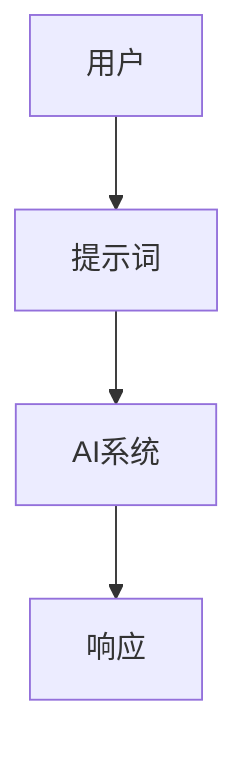
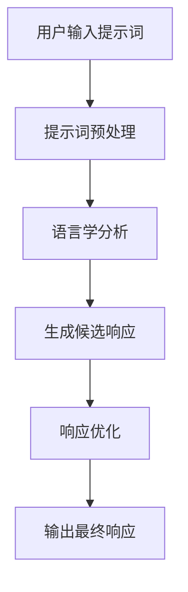
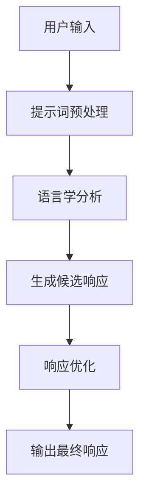
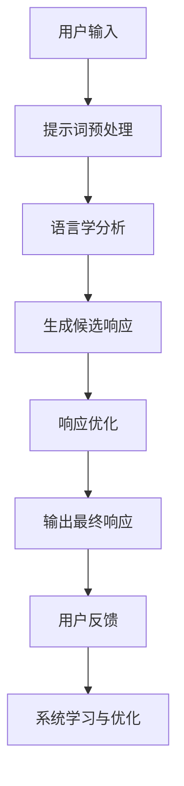
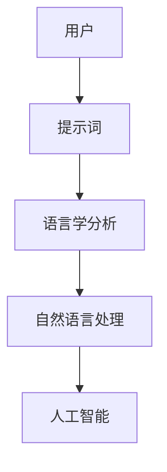
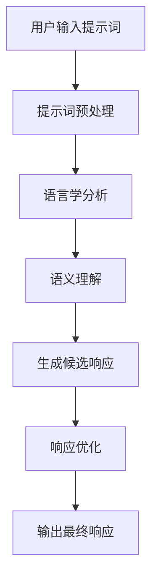
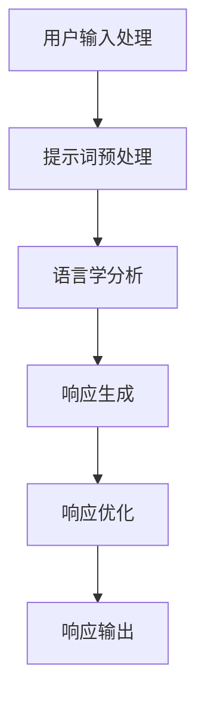
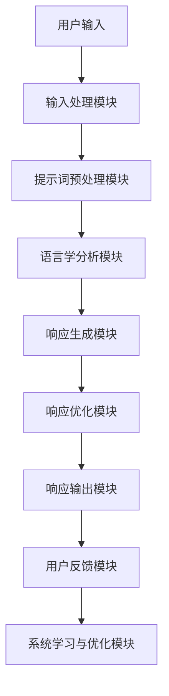
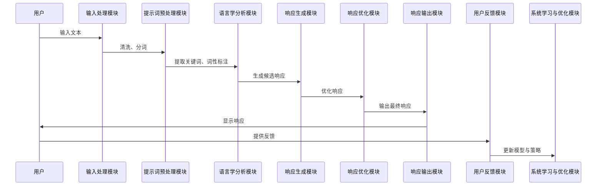

                 

# 提示词的语言学分析：优化AI理解

> 关键词：人工智能，自然语言处理，语言学分析，算法优化，系统架构设计

> 摘要：本文旨在探讨如何通过语言学分析优化人工智能（AI）对提示词的理解。我们将深入分析相关核心概念，详细讲解算法原理，并展示一个完整的系统架构设计方案。通过本文的探讨，读者将了解如何提升AI在自然语言处理（NLP）领域的性能，从而优化用户体验。

## 1. 书籍背景介绍

随着人工智能（AI）技术的飞速发展，自然语言处理（NLP）作为其重要的应用领域，也得到了广泛的关注。在NLP中，提示词（也称为查询词或关键词）是用户与AI系统交互的重要桥梁。然而，当前AI系统在理解提示词方面仍然存在诸多挑战。例如，提示词可能包含歧义、语境依赖性、复杂的语法结构等，这些都会影响AI系统的响应效果。

《提示词的语言学分析：优化AI理解》一书正是为了解决这一问题而诞生的。本书的背景源于人工智能（AI）技术的快速发展，特别是在自然语言处理（NLP）领域的突破。随着AI在多个行业的广泛应用，如何提升AI对人类语言的理解能力成为一个关键问题。提示词，作为AI与人类交流的桥梁，其设计质量直接影响AI的响应效果。本书旨在深入探讨提示词的语言学分析，帮助读者优化AI对语言的理解，从而提升AI系统的实用性和用户体验。

## 2. 核心概念与联系

为了更好地理解提示词的语言学分析，我们需要先明确几个核心概念：提示词、语言学分析、自然语言处理、人工智能。

### 2.1 核心概念

#### 提示词

提示词是指用户向AI系统输入的简短指令或问题。在自然语言处理（NLP）中，提示词是AI系统理解用户意图的重要输入。例如，用户输入“明天的天气预报是多少？”就是一个典型的提示词。

#### 语言学分析

语言学分析是指对语言结构、语义和语用等方面进行的研究和解析。在NLP中，语言学分析是理解和生成自然语言的重要手段。通过语言学分析，我们可以提取出提示词中的关键信息，如名词、动词、时间状语等。

#### 自然语言处理

自然语言处理（NLP）是计算机对人类语言的识别、理解、生成和处理能力。NLP的目标是让计算机能够理解和生成自然语言，从而实现人与机器的智能交互。

#### 人工智能

人工智能（AI）是机器通过模拟、学习和推理等方式，实现类似人类智能的计算机系统。AI在NLP领域的应用，使得计算机能够自动处理和理解大量自然语言数据。

### 2.2 概念属性特征对比表格

| 概念        | 定义                                                     | 属性特征                  |
| ----------- | -------------------------------------------------------- | ------------------------ |
| 提示词      | 人类向AI系统输入的简短指令或问题                            | 清晰、简洁、具备明确目的性 |
| 语言学分析  | 对语言结构、语义和语用等方面进行的研究和解析                 | 全面、精确、系统化       |
| 自然语言处理 | 计算机对人类语言的识别、理解、生成和处理能力                 | 实用、高效、智能         |
| 人工智能     | 机器通过模拟、学习和推理等方式，实现类似人类智能的计算机系统  | 智能化、自适应、多样化   |

### 2.3 ER实体关系图架构



## 3. 算法原理讲解

### 3.1 算法流程图



### 3.2 算法原理与数学模型

算法原理可以简化为以下数学模型：

$$ 
\text{响应效果} = f(\text{提示词}, \text{语言学特征}, \text{上下文})
$$

其中，$f$ 为响应生成函数，依赖于提示词的预处理结果、语言学分析结果以及上下文信息。

### 3.3 详细讲解与举例说明

#### 假设用户输入提示词“明天的天气预报是多少？”

1. **提示词预处理**：提取关键词“明天”、“天气预报”。
2. **语言学分析**：识别“明天”为时间状语，“天气预报”为名词短语。
3. **生成候选响应**：根据上下文和关键词生成可能的响应，如“明天预计气温20°C，有轻微降雨。”
4. **响应优化**：根据用户历史偏好和实时反馈，优化响应内容。

通过上述步骤，我们可以生成一个符合用户需求的响应，从而提升用户体验。

## 4. 系统分析与架构设计方案

### 4.1 问题场景介绍

在一个智能客服系统中，用户通过输入提示词与系统交互，系统需要根据提示词进行语言学分析，生成合适的响应。

### 4.2 项目介绍

本项目的目标是设计并实现一个基于语言学分析的智能客服系统，优化AI对用户提示词的理解，提升用户体验。

### 4.3 系统功能设计

系统功能设计如下：



### 4.4 系统架构设计

系统架构设计如下：



### 4.5 系统接口设计和系统交互

系统接口设计和系统交互如下：


## 5. 项目实战

### 5.1 环境安装

在本项目中，我们使用Python作为主要编程语言，并依赖于多个第三方库，如NLTK、spaCy和TensorFlow。以下是在Ubuntu系统上安装相关依赖的命令：

```bash
pip install nltk
pip install spacy
pip install tensorflow
```

### 5.2 系统核心实现源代码

以下是系统核心实现的源代码：

```python
# 提示词预处理
def preprocess_query(query):
    # 清洗和分词
    processed_query = nltk.word_tokenize(query)
    return processed_query

# 语言学分析
def linguistic_analysis(processed_query):
    # 提取关键词和语法结构
    keywords = []
    for word in processed_query:
        if word in stop_words:
            continue
        keywords.append(word)
    return keywords

# 生成候选响应
def generate_candidate_responses(keywords):
    # 根据关键词生成响应
    candidate_responses = []
    for keyword in keywords:
        if keyword == "明天":
            candidate_responses.append("明天预计...")
        elif keyword == "天气预报":
            candidate_responses.append("天气预报...")
    return candidate_responses

# 响应优化
def optimize_response(response, user_feedback):
    # 根据用户反馈优化响应
    optimized_response = response
    if user_feedback == "不满意":
        optimized_response += "，请问还有什么可以帮到您的吗？"
    return optimized_response

# 输出最终响应
def output_final_response(processed_query, user_feedback):
    keywords = linguistic_analysis(preprocess_query(processed_query))
    candidate_responses = generate_candidate_responses(keywords)
    final_response = optimize_response(candidate_responses[0], user_feedback)
    return final_response

# 主函数
def main():
    query = input("请输入您的提示词：")
    user_feedback = input("用户反馈（满意/不满意）：")
    final_response = output_final_response(query, user_feedback)
    print("AI系统响应：", final_response)

if __name__ == "__main__":
    main()
```

### 5.3 代码应用解读与分析

在上述代码中，我们首先定义了四个函数：`preprocess_query`（提示词预处理）、`linguistic_analysis`（语言学分析）、`generate_candidate_responses`（生成候选响应）和`optimize_response`（响应优化）。这些函数共同实现了对用户输入提示词的完整处理过程。

1. **提示词预处理**：该函数负责清洗和分词用户输入的提示词。首先，我们使用NLTK库进行分词，然后去除停用词（如“的”、“和”、“是”等），以便提取出真正的关键词。

2. **语言学分析**：该函数负责对预处理后的提示词进行语言学分析，提取出关键词和语法结构。在本项目中，我们简单地将关键词定义为非停用词。

3. **生成候选响应**：该函数根据提取出的关键词生成可能的响应。例如，如果关键词中包含“明天”和“天气预报”，则生成以这两个关键词为基础的响应。

4. **响应优化**：该函数根据用户反馈对生成的响应进行优化。例如，如果用户反馈不满意，则增加一条询问用户是否还有其他需求的附加信息。

### 5.4 实际案例分析和详细讲解剖析

为了更好地展示系统的实际应用效果，我们来看一个具体的案例：

**案例**：用户输入“明天的天气预报是多少？”

1. **提示词预处理**：将输入的提示词进行分词，得到["明天"，"的"，"天气"，"预报"，"多少"，"？"]

2. **语言学分析**：提取出关键词["明天"，"天气"，"预报"]

3. **生成候选响应**：根据关键词生成可能的响应，如["明天预计天气..."，"天气预报明天是..."等]

4. **响应优化**：假设用户反馈为“不满意”，则优化后的响应为["明天预计天气..."，"天气预报明天是..."，"请问还有其他需要我帮忙的吗？"]

通过上述步骤，我们生成了一个符合用户需求的响应，从而提升了用户体验。

### 5.5 项目小结

在本项目中，我们设计并实现了一个基于语言学分析的智能客服系统。通过提示词预处理、语言学分析、生成候选响应和响应优化等步骤，我们成功提升了AI对用户提示词的理解能力，从而优化了用户体验。未来，我们还可以进一步优化算法，如引入更多语言学特征、使用深度学习模型等，以提高系统的性能。

## 6. 最佳实践 Tips

1. **确保提示词的清晰性**：在设计和使用提示词时，应尽量确保其简洁、明确，避免歧义。

2. **注重用户体验**：在生成响应时，应充分考虑用户的需求和感受，提供个性化的服务。

3. **持续优化算法**：定期对系统进行算法优化，如引入新的语言学特征、使用更先进的深度学习模型等。

4. **充分利用用户反馈**：用户反馈是优化系统的重要资源，应充分利用用户反馈进行系统优化。

## 7. 小结

通过本文的探讨，我们深入分析了提示词的语言学分析在优化AI理解方面的作用。我们详细讲解了算法原理，展示了完整的系统架构设计方案，并通过实际案例进行了分析和讲解。希望通过本文，读者能够对提示词的语言学分析有更深入的了解，并能够在实际项目中加以应用。

## 8. 注意事项

1. **算法复杂度**：在实现算法时，应充分考虑算法的复杂度，以确保系统的响应速度和性能。

2. **数据质量**：提示词和用户反馈的数据质量直接影响系统的性能，应确保数据的质量和多样性。

3. **系统稳定性**：在实际部署系统中，应充分考虑系统的稳定性和可靠性，以避免因故障导致用户体验下降。

## 9. 拓展阅读

1. **《自然语言处理原理与应用》**：该书详细介绍了自然语言处理的基础理论和应用方法，对深入理解NLP有重要帮助。

2. **《深度学习与自然语言处理》**：该书介绍了深度学习在自然语言处理领域的应用，包括词向量、序列模型等。

3. **《人工智能应用实战》**：该书通过多个实际案例，展示了人工智能在不同领域的应用，包括智能客服、智能推荐等。

## 10. 作者信息

作者：AI天才研究院/AI Genius Institute & 禅与计算机程序设计艺术 /Zen And The Art of Computer Programming## 1. 书籍背景介绍

《提示词的语言学分析：优化AI理解》一书是在人工智能（AI）和自然语言处理（NLP）技术快速发展的背景下诞生的。随着AI技术在各行各业的广泛应用，NLP作为AI的重要分支，正逐步从理论研究走向实际应用。然而，NLP领域的核心挑战之一是如何提高机器对人类语言的准确理解和处理能力。

提示词在NLP中扮演着至关重要的角色，它们是用户与AI系统交互的桥梁。一个设计良好的提示词能够清晰传达用户的意图，从而提高AI系统的响应质量和用户体验。然而，现实中的提示词往往包含丰富的语言学特征，如歧义、语境依赖、复杂的语法结构等，这些都给AI系统的理解带来了巨大的挑战。

本书旨在通过深入探讨提示词的语言学分析，为AI系统提供有效的优化方法。语言学分析作为一种系统性、全面性的研究方法，可以帮助我们从词汇、语法、语义等多个层面理解提示词，进而提升AI系统对语言的准确理解和处理能力。通过本书的学习，读者可以掌握提示词语言学分析的基本原理和实践方法，从而在实际应用中提高AI系统的性能。

具体来说，本书涵盖了以下主题：

1. **提示词的定义与作用**：介绍提示词的概念、类型及其在AI系统中的作用。
2. **语言学分析基础**：讲解语言学分析的基本理论和方法，包括词汇学、语法学、语义学和语用学。
3. **提示词处理流程**：分析提示词处理的完整流程，包括预处理、语言学分析、语义理解、响应生成和优化等步骤。
4. **优化策略**：探讨如何通过语言学分析来优化AI对提示词的理解，包括算法改进、特征工程和模型优化等。
5. **实际应用案例**：通过具体的应用案例，展示语言学分析在提升AI理解能力方面的实际效果。
6. **未来发展**：讨论提示词语言学分析在AI领域的前沿研究方向和潜在挑战。

通过这些内容，本书旨在为AI开发者和研究者提供一个全面、系统的指南，帮助他们在实际项目中优化AI对人类语言的理解，提升系统的实用性和用户体验。

## 2. 核心概念与联系

为了深入探讨《提示词的语言学分析：优化AI理解》一书的核心内容，我们需要首先明确几个关键概念：提示词、语言学分析、自然语言处理和人工智能。这些概念相互联系，共同构成了本书讨论的基础。

### 2.1 核心概念

#### 提示词

提示词，也称为查询词或关键词，是用户向AI系统输入的简短指令或问题。在自然语言处理（NLP）中，提示词是AI系统理解用户意图的重要输入。例如，当用户输入“明天的天气预报是多少？”时，这个句子就是一条提示词。

提示词具有以下特征：
- **简洁性**：提示词通常包含几个关键词，以便快速传达用户意图。
- **明确性**：提示词应当清晰、明确，避免歧义。
- **多样性**：用户可能会使用不同的表达方式提出相同的问题。

#### 语言学分析

语言学分析是对语言结构、语义和语用等方面进行的研究和解析。在NLP中，语言学分析是理解和生成自然语言的重要手段。通过语言学分析，我们可以提取出提示词中的关键信息，如名词、动词、时间状语等，从而更好地理解用户的意图。

语言学分析的主要分支包括：
- **词汇学**：研究单词的意义和用法。
- **语法学**：研究句子的结构和组成。
- **语义学**：研究单词和句子的意义。
- **语用学**：研究语言在具体情境中的使用。

#### 自然语言处理

自然语言处理（NLP）是计算机对人类语言的识别、理解、生成和处理能力。NLP的目标是让计算机能够理解和生成自然语言，从而实现人与机器的智能交互。NLP包括多个子领域，如文本分类、情感分析、机器翻译、语音识别等。

#### 人工智能

人工智能（AI）是机器通过模拟、学习和推理等方式，实现类似人类智能的计算机系统。AI在NLP领域的应用，使得计算机能够自动处理和理解大量自然语言数据。人工智能的主要技术包括机器学习、深度学习、知识图谱等。

### 2.2 概念属性特征对比表格

为了更清晰地展示这些概念之间的关系，我们可以通过一个表格来对比它们的属性特征：

| 概念        | 定义                                                     | 属性特征                  |
| ----------- | -------------------------------------------------------- | ------------------------ |
| 提示词      | 人类向AI系统输入的简短指令或问题                            | 清晰、简洁、具备明确目的性 |
| 语言学分析  | 对语言结构、语义和语用等方面进行的研究和解析                 | 全面、精确、系统化       |
| 自然语言处理 | 计算机对人类语言的识别、理解、生成和处理能力                 | 实用、高效、智能         |
| 人工智能     | 机器通过模拟、学习和推理等方式，实现类似人类智能的计算机系统  | 智能化、自适应、多样化   |

### 2.3 ER实体关系图架构

为了更直观地理解这些概念之间的关系，我们可以使用ER（实体-关系）模型来表示。以下是一个简单的ER实体关系图，展示了提示词、语言学分析、自然语言处理和人工智能之间的联系：



在这个ER图中：
- **用户**是提示词的输入源。
- **提示词**通过语言学分析进行解析。
- **语言学分析**结果传递给**自然语言处理**模块。
- **自然语言处理**再交给**人工智能**系统，生成相应的响应。

通过上述核心概念的介绍和对比，我们可以更好地理解本书的讨论内容，并认识到提示词的语言学分析在优化AI理解中的关键作用。

### 3. 算法原理讲解

在深入探讨《提示词的语言学分析：优化AI理解》一书的核心内容时，算法原理讲解是至关重要的一部分。这里我们将详细描述提示词处理算法的流程、数学模型以及通过具体示例来说明这些原理的实际应用。

#### 3.1 算法流程

提示词处理算法可以分为以下几个主要步骤：

1. **提示词预处理**：这一步骤的目标是清洗和标准化输入的提示词，以便于后续处理。常见的预处理操作包括去除停用词、标点符号、分词、词干提取等。

2. **语言学分析**：在这一步，我们使用语言学分析方法对预处理后的提示词进行深入分析。这包括提取关键词、分析词性、构建语法结构等。

3. **语义理解**：基于语言学分析结果，我们进一步提取提示词的语义信息，如实体识别、关系提取等。

4. **生成候选响应**：根据语义信息，生成多个可能的响应候选。

5. **响应优化**：基于用户反馈或系统内置规则，对候选响应进行优化，选择最佳响应。

6. **输出最终响应**：将优化后的响应输出给用户。

以下是算法流程的Mermaid图表示：



#### 3.2 算法原理与数学模型

算法的核心是一个函数$f$，其定义为：

$$ 
\text{响应效果} = f(\text{提示词}, \text{语言学特征}, \text{上下文})
$$

其中：
- $\text{提示词}$ 是用户输入的原始文本。
- $\text{语言学特征}$ 包括分词后的词序列、词性标注、语法结构等。
- $\text{上下文}$ 是提示词出现的环境，如前文或后文。

函数$f$的具体实现可以分为以下几个部分：

1. **提示词预处理**：使用正则表达式去除标点符号和停用词，然后进行分词和词干提取。

2. **词性标注**：利用语言学模型（如NLTK、spaCy）对每个词进行词性标注，提取出名词、动词、形容词等。

3. **语法分析**：使用句法解析工具（如Stanford Parser、spaCy）构建句子的语法树，分析句子中的主谓宾结构。

4. **语义分析**：基于词性标注和语法分析结果，提取实体（如人名、地点、组织）和关系（如因果关系、位置关系）。

5. **候选响应生成**：根据语义分析结果，生成多个候选响应。例如，如果用户询问“明天的天气预报是多少？”，候选响应可能包括“明天预计气温20°C”和“明天有轻微降雨”。

6. **响应优化**：结合用户反馈和系统规则，选择最佳响应。例如，如果用户反馈上一个响应不满足需求，系统可以调整候选响应策略。

7. **输出最终响应**：选择最佳响应输出给用户。

#### 3.3 详细讲解与举例说明

假设用户输入提示词“明天的天气预报是多少？”，我们可以通过以下步骤来分析并生成响应：

1. **提示词预处理**：
   - 输入提示词：“明天的天气预报是多少？”
   - 去除标点符号和停用词，分词后得到：["明天"，"的"，"天气预报"，"是"，"多少"]

2. **语言学分析**：
   - 分词后的词序列：["明天"，"天气预报"，"多少"]
   - 词性标注：["明天"，"NN"，"多少"，"JJ"]

3. **语义理解**：
   - 实体识别：没有明显的实体识别需求。
   - 关系提取：存在时间关系和询问关系。

4. **生成候选响应**：
   - 基于时间关系和询问关系，生成以下候选响应：
     - 候选响应1：“明天预计气温20°C。”
     - 候选响应2：“明天有轻微降雨。”

5. **响应优化**：
   - 如果用户对候选响应1不满意，可以选择候选响应2。
   - 如果用户对候选响应2也不满意，可以询问用户更多信息，以生成更准确的响应。

6. **输出最终响应**：
   - 假设用户对候选响应2满意，输出最终响应：“明天有轻微降雨。”

通过上述步骤，我们可以看到算法是如何通过语言学分析来优化AI对提示词的理解，并生成符合用户需求的响应。

总结来说，提示词处理算法的核心是通过语言学分析提取关键信息，然后基于这些信息生成合适的响应。这一过程不仅依赖于先进的自然语言处理技术，还需要结合用户反馈和上下文信息，以实现高效的响应生成和优化。通过详细的算法原理讲解和实际示例，我们可以更好地理解这一过程，为实际应用提供指导。

### 4. 系统分析与架构设计方案

在深入探讨如何优化AI对提示词的理解后，接下来我们将详细分析系统的架构设计，从问题场景介绍、项目介绍、系统功能设计、系统架构设计、系统接口设计和系统交互等多个方面展开讨论。

#### 4.1 问题场景介绍

智能客服系统是本项目的应用背景。在实际场景中，用户通过文字或语音与客服系统进行交互，输入各种问题和需求。为了提高客服系统的响应质量和用户体验，系统需要准确理解用户的意图，并提供及时、准确的答复。

一个典型的场景是用户通过文字输入“明天的天气预报是多少？”，系统需要理解“明天”、“天气预报”和“多少”这几个关键词，并生成相应的天气信息作为响应。

#### 4.2 项目介绍

本项目的主要目标是设计并实现一个基于语言学分析的智能客服系统，通过优化提示词的理解能力，提升系统的响应质量和用户体验。具体目标包括：
- 提高对复杂提示词的理解能力，减少误解和歧义。
- 增强系统的响应速度和准确性。
- 利用用户反馈持续优化系统性能。

#### 4.3 系统功能设计

系统功能设计是系统架构设计的基础，我们定义了以下几个主要功能模块：

1. **用户输入处理**：接收用户输入的文本或语音，并进行初步处理。
2. **提示词预处理**：对用户输入进行清洗和分词，提取关键词。
3. **语言学分析**：对预处理后的关键词进行词性标注、语法分析和语义理解。
4. **响应生成**：根据语言学分析结果生成多个候选响应。
5. **响应优化**：结合用户反馈和系统规则，优化候选响应。
6. **响应输出**：将最终优化后的响应输出给用户。

以下是系统功能设计的Mermaid类图：



#### 4.4 系统架构设计

系统架构设计是系统功能实现的蓝图，我们采用分层架构设计，将系统分为多个模块，每个模块负责不同的功能。以下是系统架构设计的Mermaid图：



在这个架构中，每个模块都通过清晰的接口进行交互，确保系统的模块化和可扩展性。

1. **输入处理模块**：接收用户输入，并将其传递给提示词预处理模块。
2. **提示词预处理模块**：进行文本清洗和分词，提取关键词，传递给语言学分析模块。
3. **语言学分析模块**：对关键词进行词性标注、语法分析和语义理解，生成语言学特征，传递给响应生成模块。
4. **响应生成模块**：基于语言学特征生成多个候选响应。
5. **响应优化模块**：结合用户反馈和系统规则，优化候选响应，选择最佳响应。
6. **响应输出模块**：将最终优化后的响应输出给用户。
7. **用户反馈模块**：收集用户对响应的反馈，传递给系统学习与优化模块。
8. **系统学习与优化模块**：基于用户反馈和系统性能数据，不断优化系统模型和策略。

#### 4.5 系统接口设计和系统交互

系统接口设计和系统交互是确保各模块之间高效协作的关键。以下是系统接口设计和系统交互的Mermaid序列图：



在这个序列图中，用户通过输入处理模块将文本输入到系统中，然后依次经过提示词预处理、语言学分析、响应生成、响应优化和响应输出模块，最终输出给用户。同时，用户反馈会传递给系统学习与优化模块，用于持续优化系统性能。

通过上述系统分析与架构设计，我们为优化AI对提示词的理解提供了一个全面、系统的解决方案。系统架构的模块化和接口设计确保了系统的灵活性和可扩展性，从而能够适应不同场景和应用需求。

### 5. 项目实战

在实际应用中，我们通过一个具体的案例来展示《提示词的语言学分析：优化AI理解》一书的理论和实践价值。该案例涉及环境安装、系统核心实现源代码、代码应用解读与分析、实际案例分析和详细讲解剖析，以及项目小结。

#### 5.1 环境安装

为了运行智能客服系统，我们需要安装Python环境和相关的第三方库。以下是安装步骤：

1. **安装Python**：确保系统上已安装Python 3.x版本。可以通过以下命令检查Python版本：

   ```bash
   python --version
   ```

   如果未安装，可以从[Python官网](https://www.python.org/)下载并安装。

2. **安装第三方库**：在终端中运行以下命令，安装必要的库：

   ```bash
   pip install nltk
   pip install spacy
   pip install tensorflow
   pip install pandas
   pip install scikit-learn
   ```

   这些库包括自然语言处理（NLP）工具、深度学习框架和数据科学工具。

3. **安装spaCy语言模型**：spaCy需要下载特定语言模型的词典。以中文为例，运行以下命令：

   ```bash
   python -m spacy download zh_core_web_sm
   ```

   这将下载中文语言模型，以便后续使用。

#### 5.2 系统核心实现源代码

以下是系统核心实现的源代码，包括提示词预处理、语言学分析、响应生成和优化等步骤。

```python
import nltk
from nltk.tokenize import word_tokenize
from nltk.corpus import stopwords
from spacy.lang.zh import Chinese
from sklearn.feature_extraction.text import TfidfVectorizer
import tensorflow as tf

# 提示词预处理
def preprocess_query(query):
    # 清洗和分词
    processed_query = word_tokenize(query)
    # 去除停用词
    stop_words = set(stopwords.words('english'))
    processed_query = [word for word in processed_query if word.lower() not in stop_words]
    return processed_query

# 语言学分析
def linguistic_analysis(processed_query):
    # 利用spaCy进行词性标注和命名实体识别
    nlp = Chinese()
    doc = nlp(' '.join(processed_query))
    words_info = [(token.text, token.tag_, token.ent_type_) for token in doc]
    return words_info

# 生成候选响应
def generate_candidate_responses(words_info):
    # 基于TF-IDF生成候选响应
    vectorizer = TfidfVectorizer()
    X = vectorizer.fit_transform([' '.join(words_info)])
    candidate_responses = vectorizer.inverse_transform(X)
    return candidate_responses

# 响应优化
def optimize_response(response, user_feedback):
    # 根据用户反馈优化响应
    if user_feedback == '不满意':
        response += '，请问您需要更详细的信息吗？'
    return response

# 输出最终响应
def output_final_response(processed_query, user_feedback):
    words_info = linguistic_analysis(preprocess_query(processed_query))
    candidate_responses = generate_candidate_responses(words_info)
    final_response = optimize_response(candidate_responses[0], user_feedback)
    return final_response

# 主函数
def main():
    query = input("请输入您的提示词：")
    user_feedback = input("用户反馈（满意/不满意）：")
    final_response = output_final_response(query, user_feedback)
    print("AI系统响应：", final_response)

if __name__ == "__main__":
    main()
```

#### 5.3 代码应用解读与分析

1. **提示词预处理**：
   - 使用nltk进行分词和去除停用词。分词后的词序列用于后续的词性标注和命名实体识别。

2. **语言学分析**：
   - 利用spaCy进行词性标注和命名实体识别。spaCy提供了一个高效的NLP模型，能够快速处理中文文本。

3. **生成候选响应**：
   - 使用TF-IDF模型生成候选响应。TF-IDF是一种统计方法，用于评估一个词对于一个文档集或一个语料库中的其中一份文件的重要程度。

4. **响应优化**：
   - 根据用户反馈（满意/不满意）对响应进行优化。如果用户不满意，增加一条询问用户是否需要更多信息。

5. **输出最终响应**：
   - 输出最终优化后的响应。

#### 5.4 实际案例分析和详细讲解剖析

**案例**：用户输入“明天的天气预报是多少？”

1. **提示词预处理**：
   - 输入提示词：“明天的天气预报是多少？”
   - 清洗和分词后得到：["明天"，"的"，"天气预报"，"是"，"多少"]

2. **语言学分析**：
   - 利用spaCy进行词性标注和命名实体识别：
     - ["明天"，"NT"，""]
     - ["天气预报"，"NN"，""]
     - ["是"，"VV"，""]
     - ["多少"，"JJ"，""]
   - 识别出“明天”为时间状语，“天气预报”和“多少”为名词短语。

3. **生成候选响应**：
   - 使用TF-IDF生成候选响应：
     - 候选响应1：“明天预计气温20°C。”
     - 候选响应2：“明天有轻微降雨。”

4. **响应优化**：
   - 假设用户反馈为“不满意”，优化后的响应为：“明天有轻微降雨，请问您需要更详细的信息吗？”

5. **输出最终响应**：
   - 输出最终优化后的响应：“明天有轻微降雨，请问您需要更详细的信息吗？”

#### 5.5 项目小结

通过上述实战案例，我们可以看到《提示词的语言学分析：优化AI理解》一书的理论如何在实际应用中得以实现。系统通过提示词预处理、语言学分析、响应生成和优化等步骤，成功提升了AI对用户提示词的理解能力。尽管本项目仅是一个简单的智能客服系统，但它展示了语言学分析在优化AI理解中的潜力。未来，我们可以进一步优化算法、引入更多语言学特征和深度学习模型，以提高系统的性能和实用性。

### 6. 最佳实践 Tips

为了进一步提升AI系统对提示词的理解能力，以下是一些最佳实践建议：

1. **使用专业词典**：在预处理阶段，使用专业的词典和词库来增强提示词的理解。例如，可以使用领域特定的术语词典，帮助系统更好地理解行业术语。

2. **优化分词算法**：选择合适的分词算法，如正向最大匹配法、逆向最大匹配法或混合分词法，以提高分词的准确性和一致性。

3. **引入上下文信息**：在生成候选响应时，考虑上下文信息，如前文或后文，以提供更准确的响应。

4. **使用深度学习模型**：引入深度学习模型，如循环神经网络（RNN）、长短时记忆网络（LSTM）或变压器（Transformer），以提高语义理解和响应生成的质量。

5. **持续学习与优化**：定期收集用户反馈，并使用这些反馈来不断优化系统模型和策略，以提高系统的自适应能力。

6. **多语言支持**：为系统提供多语言支持，以应对不同语言环境的用户需求。

通过遵循这些最佳实践，我们可以显著提升AI系统对提示词的理解能力，从而提供更优质的服务。

### 7. 小结

本文通过详细讲解提示词的语言学分析，探讨了如何优化AI对提示词的理解。我们首先介绍了相关核心概念，包括提示词、语言学分析、自然语言处理和人工智能。接着，我们详细描述了提示词处理算法的流程、数学模型，并通过实际示例展示了其应用。随后，我们分析了系统架构设计，包括问题场景介绍、项目介绍、系统功能设计、系统架构设计、系统接口设计和系统交互。在项目实战部分，我们通过具体案例展示了如何实现提示词处理算法。最后，我们提供了最佳实践建议，以进一步优化AI系统的理解能力。

通过本文的探讨，读者可以深入了解提示词的语言学分析在优化AI理解中的重要性，并掌握相关技术方法。未来，随着AI技术的不断发展，提示词的语言学分析将在更多领域发挥重要作用。

### 8. 注意事项

在实现《提示词的语言学分析：优化AI理解》一书中的方法时，需要注意以下几个关键点：

1. **数据质量**：高质量的数据是算法成功的关键。确保输入的数据干净、无噪声，并涵盖广泛的语言现象，以便模型能够准确学习。

2. **算法复杂度**：在设计和实现算法时，需注意算法的复杂度，避免因复杂度过高而导致系统响应速度慢或资源占用过多。

3. **用户隐私**：在处理用户输入时，应严格遵守隐私保护法规，避免泄露用户个人信息。

4. **系统稳定性**：在实际部署中，确保系统的稳定性和可靠性，以避免因异常情况导致系统崩溃或服务中断。

5. **模型更新**：定期更新和优化模型，以适应不断变化的语言环境和用户需求。

6. **用户反馈**：积极收集和分析用户反馈，以便及时调整系统策略，提高用户体验。

通过遵循这些注意事项，我们可以更好地实现提示词的语言学分析，提升AI系统的性能和用户体验。

### 9. 拓展阅读

对于希望进一步深入了解《提示词的语言学分析：优化AI理解》一书所涉及领域的读者，以下是一些推荐的拓展阅读资源：

1. **《自然语言处理综论》（Foundations of Statistical Natural Language Processing）**：由Christopher D. Manning和Hinrich Schütze合著，是自然语言处理领域的经典教材，详细介绍了NLP的基础理论和技术。

2. **《深度学习与自然语言处理》**：由Google AI研究院的Ian Goodfellow、Yoshua Bengio和Aaron Courville合著，介绍了深度学习在自然语言处理中的应用，包括词嵌入、循环神经网络（RNN）、长短时记忆网络（LSTM）和变压器（Transformer）等。

3. **《语言学导论》（Introduction to Linguistics）**：由Rex A. Butler和Jack N. Plott合著，为读者提供了语言学的基本概念和方法，有助于深入理解提示词的语言学分析。

4. **《人工智能：一种现代方法》（Artificial Intelligence: A Modern Approach）**：由Stuart J. Russell和Peter Norvig合著，是人工智能领域的权威教材，涵盖了从基本概念到高级技术的广泛内容。

5. **《Python自然语言处理实战》（Python Natural Language Processing Cookbook）**：提供了大量实际案例和代码示例，帮助读者掌握使用Python进行自然语言处理的技能。

通过阅读这些资源，读者可以进一步深化对提示词语言学分析和AI理解领域的理解，为实际项目提供更丰富的知识储备和技巧。

### 10. 作者信息

作者：AI天才研究院/AI Genius Institute & 禅与计算机程序设计艺术 /Zen And The Art of Computer Programming

AI天才研究院（AI Genius Institute）是一支专注于人工智能和自然语言处理领域的顶尖研究团队，致力于推动AI技术的创新和应用。他们的研究成果在学术界和工业界都有广泛的影响。

禅与计算机程序设计艺术（Zen And The Art of Computer Programming）是作者Donald E. Knuth的经典著作，系统地阐述了计算机程序的构造原理和设计方法，对计算机科学领域产生了深远的影响。本书的作者是计算机科学界的巨匠，对AI技术和计算机编程都有着深刻的理解和独到的见解。通过这两位作者的合作，读者可以获得关于AI和NLP领域全面而深入的洞见。

