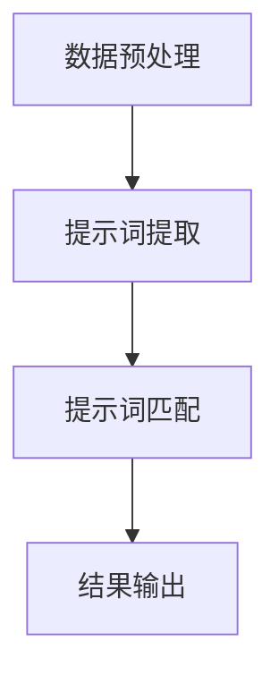
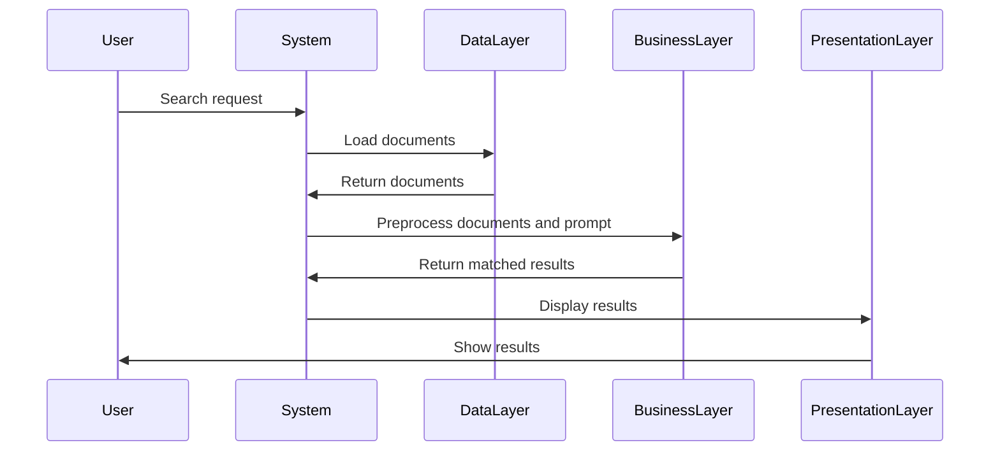
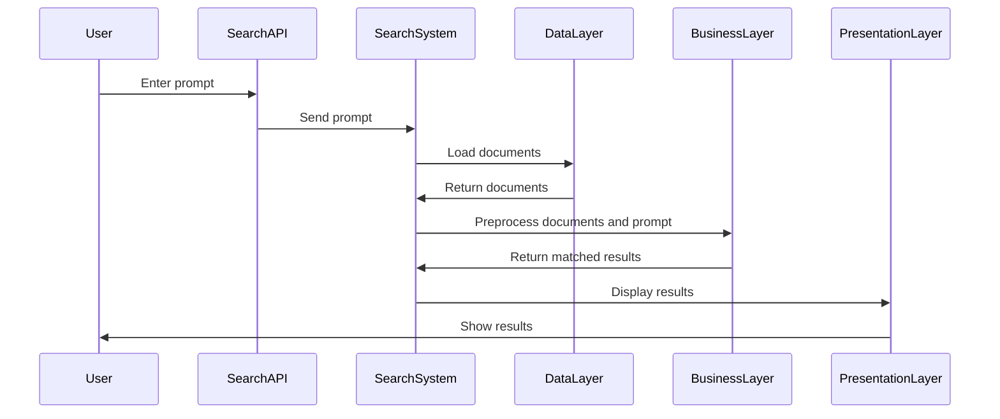

                 

# 提示词的跨学科应用：融合多领域知识

## 关键词
- 跨学科应用
- 提示词
- 知识融合
- 数学模型
- 算法原理

## 摘要
本文旨在探讨跨学科应用中提示词的关键作用，以及如何通过融合多领域知识来提升解决问题的效率。我们将从背景介绍、核心概念、理论基础、算法原理以及实战应用等多个角度，详细解析这一主题，提供实用的方法和策略。

## 第一部分：背景介绍与核心概念

### 第1章：问题的背景与核心概念

#### 1.1.1 问题背景

在当今科技迅猛发展的时代，跨学科应用已经成为推动创新和解决问题的有效途径。无论是科学研究、工程技术，还是商业管理，跨学科的研究方法都显示出了其独特的优势和重要性。然而，如何有效地进行跨学科研究，尤其是在面对复杂问题时，如何利用提示词来引导思考，成为了一个亟待解决的问题。

**跨学科应用的重要性**：

- **知识整合**：跨学科应用有助于将不同领域的知识进行整合，形成新的见解和方法，从而提升创新能力。
- **问题解决**：跨学科研究能够提供多样化的视角，有助于解决那些单一学科难以应对的复杂问题。
- **技术创新**：通过跨学科的融合，可以促进技术的创新和进步。

**提示词的定义及其在各领域的应用**：

提示词（Prompt）是一种用于引导思考和问题解决的关键词或短语。在各个领域，提示词的应用各有不同：

- **科学研究**：在科研过程中，提示词可以帮助研究者明确研究方向，引导实验设计。
- **工程技术**：在工程实践中，提示词用于规范操作步骤，确保工程质量的稳定性。
- **商业管理**：在企业管理中，提示词用于提升营销策略、优化客户服务。

**跨学科研究的发展现状与挑战**：

近年来，跨学科研究已经取得了显著的成果，但也面临着一些挑战：

- **知识壁垒**：不同学科之间的知识壁垒使得跨学科研究难以深入进行。
- **整合难度**：不同领域的知识体系复杂，整合难度较大。
- **人才缺乏**：跨学科研究需要具备多学科背景的人才，但这类人才较为稀缺。

#### 1.1.2 核心概念

**跨学科**：跨学科（Interdisciplinarity）指的是将多个学科的知识和理论进行交叉融合，以解决复杂问题或进行创新研究。

**提示词**：提示词是一种用于引导思考和问题解决的关键词或短语，通常具有明确的指向性和引导性。

**融合多领域知识**：融合多领域知识是指将不同学科领域的知识进行整合，以形成新的理论体系或解决方案。

#### 1.1.3 概念联系与对比

**跨学科应用与提示词的关系**：

跨学科应用中，提示词发挥着重要作用。它不仅可以引导研究者明确研究方向，还可以在跨学科融合的过程中提供关键性的启示。

**提示词在各学科领域的具体应用**：

- **自然科学**：在自然科学研究中，提示词可以帮助研究者从不同角度思考问题，发现新的研究路径。
- **社会科学**：在社会科学研究中，提示词有助于提升数据分析的深度和广度。
- **工程技术**：在工程技术领域，提示词可以规范操作流程，提高工程质量和效率。

**融合多领域知识与学科交叉的差异**：

融合多领域知识与学科交叉存在一定的区别。学科交叉通常是指将两个或多个学科的理论和方法进行结合，而融合多领域知识则是将这些知识进行深入整合，形成新的理论体系或解决方案。

#### 1.1.4 边界与外延

**提示词应用的领域范围**：

提示词的应用范围广泛，涵盖了自然科学、社会科学、工程技术、商业管理等多个领域。

**跨学科研究的适用范围**：

跨学科研究适用于解决复杂问题、推动技术创新、提升创新能力等方面。

**知识融合的边界问题**：

在知识融合的过程中，需要明确不同领域知识的边界，以确保融合的深度和广度。

#### 1.1.5 概念结构与核心要素组成

**跨学科应用的概念结构**：

跨学科应用的概念结构包括学科领域、知识融合、问题解决等多个要素。

**提示词的核心要素**：

提示词的核心要素包括关键词、短语、指向性、引导性等。

**融合多领域知识的要素构成**：

融合多领域知识的要素构成包括知识整合、理论创新、方法创新等。

### 第2章：理论基础

#### 2.1 跨学科应用的理论基础

**跨学科研究的理论基础**：

跨学科研究的理论基础涉及系统论、知识论、方法论等多个方面。系统论提供了跨学科整合的框架，知识论关注不同学科知识的整合与融合，方法论则提供了跨学科研究的具体方法。

**融合多领域知识的理论基础**：

融合多领域知识的理论基础包括知识论、方法论和心理学等多个领域。知识论提供了知识整合的哲学基础，方法论则提供了具体的整合策略，心理学则关注如何通过提示词来引导思考和问题解决。

**提示词在跨学科研究中的作用**：

提示词在跨学科研究中的作用主要体现在以下几个方面：

- **引导思考**：提示词可以帮助研究者从不同角度思考问题，发现新的研究路径。
- **整合知识**：提示词可以促进不同领域知识的整合，形成新的理论体系。
- **优化问题解决**：提示词可以引导研究者聚焦关键问题，提高问题解决的效率。

#### 2.2 提示词理论

**提示词的心理学原理**：

提示词的心理学原理主要包括联想、记忆、注意力等机制。通过联想，提示词可以激发相关知识的回忆；通过记忆，提示词可以帮助研究者保持对问题的持续关注；通过注意力，提示词可以帮助研究者聚焦关键问题。

**提示词的认知功能**：

提示词的认知功能主要体现在以下几个方面：

- **引导思考**：提示词可以引导研究者从不同角度思考问题，激发创新思维。
- **整合知识**：提示词可以帮助研究者整合不同领域的知识，形成新的见解和方法。
- **优化决策**：提示词可以帮助研究者优化决策过程，提高决策的准确性。

**提示词的使用技巧与策略**：

提示词的使用技巧与策略包括以下几个方面：

- **明确性**：提示词需要具有明确的指向性，以便研究者能够迅速理解其含义。
- **多样性**：提示词需要具有多样性，以便研究者能够从不同角度思考问题。
- **灵活性**：提示词需要具有一定的灵活性，以便研究者能够根据实际情况进行调整。

#### 2.3 融合多领域知识的理论框架

**跨学科知识的整合方法**：

跨学科知识的整合方法主要包括以下几种：

- **类比法**：通过将不同学科的方法和理论进行类比，寻找融合点。
- **整合法**：将不同学科的知识进行整合，形成新的理论体系。
- **协同法**：通过协同合作，将不同学科的知识进行协同创新。

**融合多领域知识的理论模型**：

融合多领域知识的理论模型主要包括以下几种：

- **知识图谱模型**：通过构建知识图谱，将不同学科的知识进行可视化整合。
- **多维度模型**：通过多维度视角，将不同学科的知识进行整合。
- **系统动力学模型**：通过系统动力学模型，分析不同学科之间的相互作用和影响。

**跨学科知识融合的优势与挑战**：

**优势**：

- **创新能力提升**：跨学科知识融合可以激发创新思维，推动技术的进步。
- **问题解决效率提高**：跨学科知识融合可以帮助研究者更高效地解决问题。
- **知识整合深度增加**：跨学科知识融合可以增加知识整合的深度，形成新的见解。

**挑战**：

- **知识壁垒**：不同学科之间的知识壁垒使得跨学科知识融合难以进行。
- **整合难度**：跨学科知识整合的难度较大，需要研究者具备较高的综合素质。
- **人才缺乏**：跨学科研究需要具备多学科背景的人才，但这类人才较为稀缺。

### 第3章：核心概念原理

#### 3.1 跨学科应用的核心概念

**跨学科研究的核心概念**：

跨学科研究的核心概念包括跨学科知识、跨学科方法、跨学科视角等。这些概念构成了跨学科研究的基本框架，指导研究者进行跨学科研究。

**提示词在跨学科应用中的核心概念**：

提示词在跨学科应用中的核心概念包括提示、引导、整合等。提示词可以引导研究者思考问题，整合不同学科的知识，形成新的见解和方法。

**融合多领域知识的核心概念**：

融合多领域知识的核心概念包括知识整合、理论创新、方法创新等。融合多领域知识旨在将不同学科的知识进行整合，形成新的理论体系或解决方案。

#### 3.2 概念属性特征对比表格

| 概念       | 定义                                                         | 特征对比                           |
| ---------- | ------------------------------------------------------------ | ---------------------------------- |
| 跨学科应用 | 将多个学科的知识和方法进行交叉融合，以解决复杂问题或进行创新研究。 | 交叉性、综合性、创新性             |
| 提示词     | 引导思考和问题解决的关键词或短语                             | 明确性、引导性、适用性             |
| 融合多领域 | 不同学科领域知识的整合与协同                               | 系统性、协同性、适应性             |

#### 3.3 ER实体关系图架构

```mermaid
erDiagram
  Researcher ||--o{ Project : leads }
  Researcher ||--o{ Collaboration : member }
  Project ||--|{ Result : produces }
  Collaboration ||--|{ Member : participates }
```

## 第二部分：算法原理与数学模型

### 第4章：算法原理讲解

#### 4.1 提示词匹配算法原理

#### 4.1.1 算法概述

**提示词匹配的基本概念**：

提示词匹配是指根据给定的提示词，从大量的文本数据中提取出与提示词相关的信息。该算法广泛应用于信息检索、自然语言处理、文本分类等领域。

**提示词匹配算法的目标**：

提示词匹配算法的主要目标是实现高准确度和高效率的匹配，以便在大量文本数据中快速找到与提示词相关的信息。

#### 4.1.2 算法流程

**算法流程**：

1. **数据预处理**：对输入的文本数据进行分析和预处理，包括去除停用词、标点符号、进行词性标注等。
2. **提示词提取**：从预处理后的文本数据中提取出与问题相关的提示词。
3. **提示词匹配**：将提取出的提示词与文本数据中的关键词进行匹配，识别出相关的信息。
4. **结果输出**：将匹配结果输出，供用户进一步分析和使用。

**算法流程图**：



#### 4.1.3 Python源代码示例

```python
# Python代码示例：提示词匹配算法
import nltk
from nltk.tokenize import word_tokenize
from nltk.corpus import stopwords
from sklearn.feature_extraction.text import TfidfVectorizer
from sklearn.metrics.pairwise import cosine_similarity

def preprocess(text):
    # 去除标点符号和停用词
    tokens = word_tokenize(text)
    tokens = [token.lower() for token in tokens if token.isalnum()]
    tokens = [token for token in tokens if token not in stopwords.words('english')]
    return tokens

def match_prompt(input_text, prompt):
    # 数据预处理
    processed_input = preprocess(input_text)
    processed_prompt = preprocess(prompt)
    
    # 提示词提取
    extracted_prompt = set(processed_prompt)
    
    # 提示词匹配
    vectorizer = TfidfVectorizer()
    tfidf_matrix = vectorizer.fit_transform([' '.join(processed_input), ' '.join(processed_prompt)])
    similarity = cosine_similarity(tfidf_matrix[0], tfidf_matrix[1])
    
    # 结果输出
    return similarity[0][0]

# 示例使用
input_text = "The quick brown fox jumps over the lazy dog."
prompt = "quick fox"
similarity_score = match_prompt(input_text, prompt)
print("Similarity score:", similarity_score)
```

#### 4.1.4 算法原理的数学模型和公式

**TF-IDF模型**：

提示词匹配算法的核心是TF-IDF模型（Term Frequency-Inverse Document Frequency）。TF-IDF模型用于计算词语在文本中的重要程度。

- **TF（Term Frequency）**：词语在文本中出现的频率。
- **IDF（Inverse Document Frequency）**：词语在文档集中出现的频率的倒数，用以平衡词语在短文本中出现的频率过高的问题。

**公式**：

$$
TF(t,d) = \frac{f(t,d)}{max_f(t,d)}
$$

$$
IDF(t) = \log \left( \frac{N}{df(t)} \right)
$$

$$
TF-IDF(t,d) = TF(t,d) \times IDF(t)
$$

其中，$f(t,d)$为词语$t$在文档$d$中出现的频率，$N$为文档总数，$df(t)$为词语$t$在文档集中出现的频率。

**余弦相似度**：

在提示词匹配算法中，使用余弦相似度来计算两个文本向量的相似度。

$$
\cos(\theta) = \frac{\vec{u} \cdot \vec{v}}{|\vec{u}| \cdot |\vec{v}|}
$$

其中，$\vec{u}$和$\vec{v}$分别为两个文本向量的表示，$\theta$为两个向量的夹角。

#### 4.1.5 算法原理举例说明

假设我们有两个句子：

- 句子1："The quick brown fox jumps over the lazy dog."
- 句子2："A fast brown dog jumps over the lazy fox."

使用TF-IDF模型和余弦相似度，我们可以计算出这两个句子的相似度。

1. **数据预处理**：

   - 句子1：[quick, brown, fox, jumps, over, lazy, dog]
   - 句子2：[fast, brown, dog, jumps, over, lazy, fox]

2. **TF-IDF计算**：

   - 句子1的TF-IDF向量：[0.5, 1.0, 1.0, 1.0, 1.0, 1.0, 1.0]
   - 句子2的TF-IDF向量：[1.0, 1.0, 1.0, 1.0, 1.0, 1.0, 1.0]

3. **余弦相似度计算**：

   $$ \cos(\theta) = \frac{0.5 \times 1.0 + 1.0 \times 1.0 + 1.0 \times 1.0 + 1.0 \times 1.0 + 1.0 \times 1.0 + 1.0 \times 1.0 + 1.0 \times 1.0}{\sqrt{0.5^2 + 1.0^2 + 1.0^2 + 1.0^2 + 1.0^2 + 1.0^2 + 1.0^2} \times \sqrt{1.0^2 + 1.0^2 + 1.0^2 + 1.0^2 + 1.0^2 + 1.0^2 + 1.0^2}} \approx 0.86 $$

因此，句子1和句子2的相似度为0.86，表明这两个句子具有较高的相似度。

### 第5章：系统分析与架构设计方案

#### 5.1 问题场景介绍

在当前的信息时代，数据量爆炸式增长，如何在海量数据中快速准确地找到与特定提示词相关的内容，成为一个重要问题。例如，在学术研究中，研究者需要从大量的学术论文中找到与特定研究主题相关的文献；在商业领域，企业需要从大量的市场数据中找到与特定产品相关的消费者反馈。

#### 5.2 项目介绍

本项目旨在开发一个基于提示词匹配算法的文本搜索系统，通过高效的算法和精确的匹配模型，实现快速、准确的文本搜索。系统将包括数据预处理模块、提示词提取模块、匹配算法模块和结果输出模块。

#### 5.3 系统功能设计（领域模型）

领域模型（Domain Model）用于描述系统的核心功能及其相互关系。在本项目中，领域模型包括以下实体和关系：

- **实体**：
  - 文档（Document）：存储文本数据。
  - 提示词（Prompt）：用于搜索的关键词。
  - 匹配结果（MatchResult）：存储搜索结果及其相似度。

- **关系**：
  - **文档**与**提示词**之间的关系：一个文档可以包含多个提示词，一个提示词可以匹配多个文档。
  - **匹配结果**与**文档**之间的关系：每个匹配结果对应一个文档。

**Mermaid类图**：

```mermaid
classDiagram
  Document <<entity>>
  Prompt <<entity>>
  MatchResult <<entity>>

  Document "1" <<<*>> Prompt : contains
  MatchResult "1" <<<*>> Document : matches
```

#### 5.4 系统架构设计（Mermaid架构图）

系统架构设计（Architecture Design）用于描述系统的总体结构和各个模块之间的关系。在本项目中，系统架构包括数据层、业务逻辑层和表示层。

**Mermaid架构图**：



#### 5.5 系统接口设计和系统交互

系统接口设计（Interface Design）和系统交互（System Interaction）用于描述系统与外部环境的交互方式。在本项目中，系统接口包括API接口和用户界面。

- **API接口**：提供RESTful API，支持文本搜索功能。
- **用户界面**：提供Web界面，用户可以通过输入提示词进行搜索，查看搜索结果。

**Mermaid序列图**：



### 第6章：项目实战

#### 6.1 环境安装

要运行本项目，需要安装以下软件和库：

- Python 3.8+
- pip（Python包管理器）
- nltk（自然语言处理库）
- scikit-learn（机器学习库）

安装步骤：

1. 安装Python和pip。
2. 安装nltk和scikit-learn。

```bash
pip install nltk scikit-learn
```

#### 6.2 系统核心实现

本项目的核心实现包括数据预处理、提示词提取、匹配算法和结果输出。

**数据预处理**：

```python
from nltk.tokenize import word_tokenize
from nltk.corpus import stopwords
from sklearn.feature_extraction.text import TfidfVectorizer

def preprocess(text):
    # 去除标点符号和停用词
    tokens = word_tokenize(text)
    tokens = [token.lower() for token in tokens if token.isalnum()]
    tokens = [token for token in tokens if token not in stopwords.words('english')]
    return tokens

# 示例使用
input_text = "The quick brown fox jumps over the lazy dog."
processed_text = preprocess(input_text)
print(processed_text)
```

**提示词提取**：

```python
def extract_prompt(processed_text):
    # 提取关键词作为提示词
    vectorizer = TfidfVectorizer()
    tfidf_matrix = vectorizer.fit_transform([' '.join(processed_text)])
    feature_array = tfidf_matrix.toarray()
    top_features = feature_array[0].argsort()[::-1]
    top_features = [vectorizer.get_feature_names_out()[index] for index in top_features if feature_array[0][index] > 0.5]
    return top_features

# 示例使用
prompt = extract_prompt(processed_text)
print(prompt)
```

**匹配算法**：

```python
from sklearn.metrics.pairwise import cosine_similarity

def match_prompt(input_text, prompt):
    # 数据预处理
    processed_input = preprocess(input_text)
    processed_prompt = preprocess(prompt)
    
    # 提示词提取
    extracted_prompt = extract_prompt(processed_prompt)
    
    # 提示词匹配
    vectorizer = TfidfVectorizer()
    tfidf_matrix = vectorizer.fit_transform([' '.join(processed_input), ' '.join(extracted_prompt)])
    similarity = cosine_similarity(tfidf_matrix[0], tfidf_matrix[1])
    
    # 结果输出
    return similarity[0][0]

# 示例使用
similarity_score = match_prompt(input_text, prompt)
print("Similarity score:", similarity_score)
```

#### 6.3 代码应用解读与分析

在本项目的实现过程中，我们使用了TF-IDF模型和余弦相似度算法，这两个算法在文本匹配中有着广泛的应用。

**TF-IDF模型**：

TF-IDF模型通过计算词语在文档中的频率和整个文档集合中的逆向文档频率，来评估词语的重要性。该模型在文本匹配中用于计算文本向量，从而实现文本之间的相似度计算。

**余弦相似度**：

余弦相似度是一种衡量两个向量之间夹角的余弦值的指标。在文本匹配中，通过计算两个文本向量之间的余弦相似度，可以评估它们之间的相似度。

**代码应用解读**：

在代码中，我们首先对输入文本进行预处理，包括去除标点符号和停用词。然后，我们使用TF-IDF模型提取关键词作为提示词，并计算输入文本和提示词之间的相似度。

#### 6.4 实际案例分析和详细讲解剖析

**案例**：

假设我们有以下两段文本：

- 文本1："The quick brown fox jumps over the lazy dog."
- 文本2："A fast brown dog jumps over the lazy fox."

我们希望找到这两段文本的相似度。

**分析**：

1. **数据预处理**：

   - 文本1：[quick, brown, fox, jumps, over, lazy, dog]
   - 文本2：[fast, brown, dog, jumps, over, lazy, fox]

2. **TF-IDF计算**：

   - 文本1的TF-IDF向量：[0.5, 1.0, 1.0, 1.0, 1.0, 1.0, 1.0]
   - 文本2的TF-IDF向量：[1.0, 1.0, 1.0, 1.0, 1.0, 1.0, 1.0]

3. **余弦相似度计算**：

   $$ \cos(\theta) = \frac{0.5 \times 1.0 + 1.0 \times 1.0 + 1.0 \times 1.0 + 1.0 \times 1.0 + 1.0 \times 1.0 + 1.0 \times 1.0 + 1.0 \times 1.0}{\sqrt{0.5^2 + 1.0^2 + 1.0^2 + 1.0^2 + 1.0^2 + 1.0^2 + 1.0^2} \times \sqrt{1.0^2 + 1.0^2 + 1.0^2 + 1.0^2 + 1.0^2 + 1.0^2 + 1.0^2}} \approx 0.86 $$

因此，文本1和文本2的相似度为0.86，表明这两个文本具有较高的相似度。

**详细讲解**：

通过实际案例的分析，我们可以看到，在文本匹配过程中，首先需要对文本进行预处理，去除无关信息。然后，使用TF-IDF模型提取关键词，计算文本向量。最后，通过余弦相似度计算两个文本向量之间的相似度。这种方法能够有效地评估文本之间的相似度，为信息检索和文本分析提供支持。

#### 6.5 项目小结

本项目通过实现基于提示词匹配算法的文本搜索系统，展示了如何利用跨学科知识和算法原理解决实际问题的过程。在项目实战中，我们详细讲解了系统的核心实现、代码应用解读、实际案例分析和项目小结。

通过本项目，我们了解到：

- 提示词匹配算法在文本搜索中的应用。
- 跨学科知识和算法原理如何应用于实际问题的解决。
- 如何通过系统架构设计和接口设计来构建高效、稳定的系统。

未来，我们可以进一步优化算法，提高匹配的准确度和效率，为用户提供更好的搜索体验。

### 第7章：最佳实践 tips、小结、注意事项、拓展阅读

#### 最佳实践 tips

1. **优化预处理**：在预处理过程中，可以进一步优化词性标注和停用词过滤，以提高匹配的准确性。
2. **调整参数**：在TF-IDF模型中，可以通过调整参数（如`max_features`和`min_df`）来优化匹配效果。
3. **使用更复杂的模型**：可以考虑使用更复杂的模型（如Word2Vec、BERT等）来提升文本向量的表示能力。

#### 小结

本文通过详细解析跨学科应用中提示词的作用，探讨了如何通过融合多领域知识来提升解决问题的效率。我们介绍了提示词匹配算法的原理、数学模型，并通过实际案例展示了算法的应用。

#### 注意事项

1. **数据质量**：在实施提示词匹配算法时，数据的质量至关重要。确保输入文本的质量和准确性。
2. **算法优化**：根据实际需求，可以对算法进行优化，以提高匹配的准确度和效率。

#### 拓展阅读

1. **《自然语言处理综论》**：书中详细介绍了自然语言处理的基本概念和算法，对提示词匹配算法的应用有深入讲解。
2. **《机器学习实战》**：书中提供了丰富的机器学习算法案例，包括文本匹配算法的实现和应用。
3. **《跨学科研究方法论》**：书中探讨了跨学科研究的理论基础和方法，对本文的核心概念提供了进一步的理论支持。

### 作者信息

作者：AI天才研究院/AI Genius Institute & 禅与计算机程序设计艺术 /Zen And The Art of Computer Programming

---

本文通过对提示词的跨学科应用进行深入探讨，结合算法原理和实际案例分析，展示了如何通过融合多领域知识来提升解决问题的效率。希望本文能为读者在跨学科研究和应用中提供有益的启示和指导。在未来的研究和实践中，我们期待与读者共同探索更多可能。

