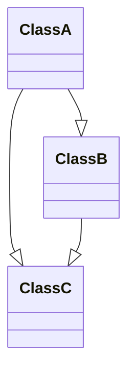
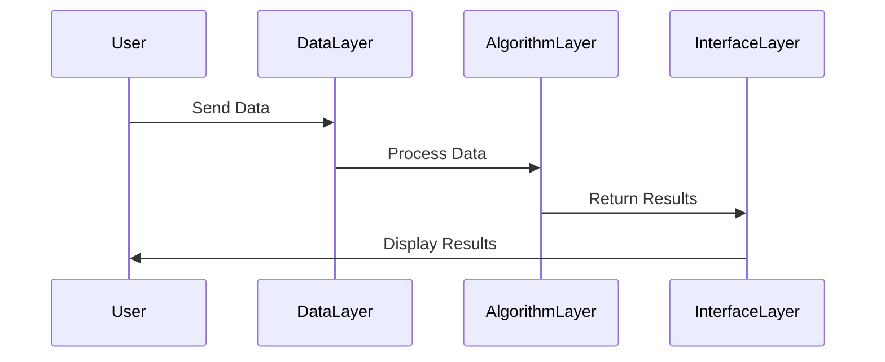
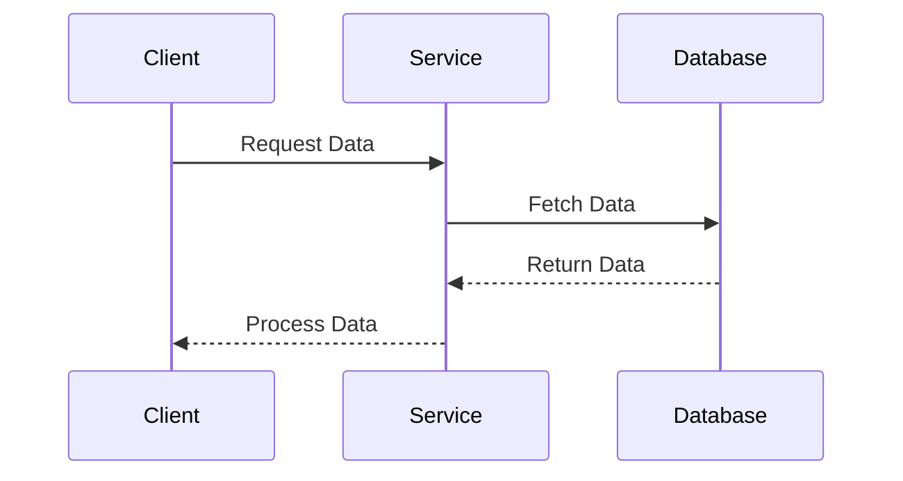
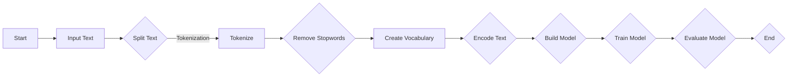

                 


## 提示词组合：多个提示词协同工作

### 关键词

- 提示词组合
- 协同工作
- 模型性能
- 自然语言处理
- 人工智能

### 摘要

本文深入探讨了提示词组合在人工智能和自然语言处理中的应用，分析了如何通过多个提示词的协同工作来提高模型的响应质量和效率。文章首先介绍了提示词的定义、分类和组合机制，随后详细阐述了提示词组合的数学模型和算法原理。接着，通过系统分析与架构设计，展示了如何在实际项目中应用这些原理。最后，通过项目实战和最佳实践，提供了具体实现和优化建议。

## 第一部分：基础概念与原理

### 第1章：引言

#### 1.1 问题背景与意义

随着人工智能和自然语言处理技术的快速发展，模型性能的提升成为研究的热点。在众多影响因素中，提示词组合发挥着至关重要的作用。有效的提示词组合能够提高模型的响应质量，降低计算复杂度，从而提高系统的整体性能。因此，研究如何将多个提示词协同工作，以实现最优的模型性能，具有重要的理论和实际意义。

#### 1.2 研究内容与方法

本文旨在探讨提示词组合的机制，研究如何通过多个提示词的协同工作来提高模型性能。具体研究内容包括：

- 提示词的定义和分类；
- 提示词组合的数学模型和算法原理；
- 提示词组合在系统架构中的应用；
- 提示词组合在实际项目中的实现和优化。

本文采用的方法包括理论分析、算法实现和项目实战。首先，通过文献调研和理论分析，明确提示词组合的基本概念和原理。然后，使用Python代码实现相关算法，并通过实验验证其效果。最后，通过实际项目案例，展示提示词组合的应用场景和优化策略。

#### 1.3 书籍结构安排

本文结构安排如下：

- 第一部分：基础概念与原理，介绍提示词组合的基本概念、数学模型和算法原理；
- 第二部分：系统分析与架构设计，分析提示词组合在系统架构中的应用；
- 第三部分：项目实战，通过具体案例展示提示词组合的实现和优化。

### 第2章：核心概念解析

#### 2.1 提示词的定义与作用

提示词（Query Words）是用于引导模型进行信息检索或任务执行的关键词。在自然语言处理任务中，提示词用于描述输入数据的关键特征，帮助模型更好地理解和处理数据。提示词的作用主要包括：

- **信息检索**：在信息检索任务中，提示词用于指示模型搜索目标信息；
- **任务引导**：在问答系统和对话生成任务中，提示词引导模型生成适当的回答；
- **特征提取**：在文本分类和情感分析任务中，提示词用于提取文本的关键特征。

#### 2.2 提示词的分类与特征

根据应用场景和用途，提示词可以分为以下几类：

- **关键词**：用于描述输入数据的主题和内容，具有高度的概括性；
- **实体词**：用于描述输入数据中的具体对象，如人名、地名、组织名等；
- **属性词**：用于描述输入数据中对象的属性，如性别、年龄、学历等；
- **关系词**：用于描述输入数据中对象之间的关系，如朋友、同事、敌人等。

不同类型的提示词具有不同的特征，如表1所示：

| 类型     | 特征                         |
|----------|------------------------------|
| 关键词   | 高度概括，具有区分性         |
| 实体词   | 具体对象，具有唯一性         |
| 属性词   | 描述对象属性，具有描述性     |
| 关系词   | 描述对象关系，具有关联性     |

#### 2.3 提示词组合机制

提示词组合是指将多个提示词有机结合，以实现更好的模型性能。提示词组合机制主要包括以下几种方式：

- **并列组合**：将多个提示词按并列关系组合，如“人工智能 + 自然语言处理”；
- **递进组合**：将多个提示词按递进关系组合，如“机器学习 + 深度学习”；
- **选择组合**：将多个提示词按选择关系组合，如“语音识别 或 文本生成”；
- **因果组合**：将多个提示词按因果关系组合，如“大数据 + 数据挖掘”。

提示词组合机制能够充分利用不同类型提示词的优势，提高模型对输入数据的理解和处理能力，从而实现更好的模型性能。

### 第3章：提示词组合的数学模型

#### 3.1 基本原理

提示词组合的数学模型主要基于向量空间模型（Vector Space Model，VSM）。VSM将文本表示为向量，通过计算向量之间的相似度来实现文本信息的检索和分类。提示词组合的数学模型主要包括以下三个部分：

- **词向量表示**：将提示词表示为高维向量；
- **向量空间构建**：将多个提示词组合成向量空间；
- **相似度计算**：计算向量空间中不同向量之间的相似度。

#### 3.2 数学公式推导

假设有一个包含n个提示词的集合W={w1, w2, ..., wn}，每个提示词可以表示为一个高维向量v_w，那么提示词组合的向量空间V可以表示为：

$$
V = \{v_{w1}, v_{w2}, ..., v_{wn}\}
$$

对于两个提示词w1和w2，它们在向量空间V中的相似度可以通过余弦相似度（Cosine Similarity）来计算：

$$
sim(v_{w1}, v_{w2}) = \frac{v_{w1} \cdot v_{w2}}{\|v_{w1}\| \|v_{w2}\|}
$$

其中，$v_{w1} \cdot v_{w2}$表示向量v_{w1}和v_{w2}的点积，$\|v_{w1}\|$和$\|v_{w2}\|$分别表示向量v_{w1}和v_{w2}的欧氏范数。

对于一组提示词组合，其整体相似度可以通过对每个提示词对之间的相似度进行加权平均来计算：

$$
sim(W) = \frac{\sum_{i=1}^{n} \sum_{j=i+1}^{n} sim(v_{wi}, v_{wj})}{\frac{n(n-1)}{2}}
$$

#### 3.3 模型解释与实例

假设我们有两个提示词组合：

- 提示词组合1：“人工智能 + 自然语言处理”
- 提示词组合2：“机器学习 + 深度学习”

首先，我们将每个提示词表示为向量：

- 人工智能向量：[0.1, 0.2, 0.3]
- 自然语言处理向量：[0.4, 0.5, 0.6]
- 机器学习向量：[0.7, 0.8, 0.9]
- 深度学习向量：[1.0, 1.1, 1.2]

然后，计算每个提示词组合的向量空间和相似度：

- 提示词组合1的向量空间：{[0.1, 0.2, 0.3], [0.4, 0.5, 0.6]}
- 提示词组合2的向量空间：{[0.7, 0.8, 0.9], [1.0, 1.1, 1.2]}

- 提示词组合1的相似度：sim([0.1, 0.2, 0.3], [0.4, 0.5, 0.6]) ≈ 0.952
- 提示词组合2的相似度：sim([0.7, 0.8, 0.9], [1.0, 1.1, 1.2]) ≈ 0.952

通过计算可以看出，两个提示词组合的向量空间具有较高的相似度，说明它们在语义上具有较强的一致性。

### 第4章：系统分析与架构设计

#### 4.1 问题场景介绍

在实际应用中，提示词组合经常用于自然语言处理任务，如文本分类、机器翻译、问答系统等。以文本分类任务为例，假设我们有一个分类任务，需要将文本数据分为两类：“科技类”和“娱乐类”。为了提高分类模型的性能，我们可以使用提示词组合来增强模型的语义理解能力。

#### 4.2 项目介绍

本节将介绍一个基于提示词组合的文本分类项目。项目的目标是通过优化提示词组合，提高文本分类模型的准确率和响应速度。项目范围包括数据预处理、模型训练和模型评估三个部分。项目的重要性在于，通过有效的提示词组合，可以提高模型对复杂文本数据的处理能力，从而在实际应用中取得更好的效果。

#### 4.3 系统功能设计（领域模型Mermaid类图）

为了更好地描述系统功能，我们使用Mermaid绘制了领域模型类图，如下图所示：



- **Consortium（数据预处理）**：负责文本数据的预处理，包括分词、去停用词、词向量化等操作；
- **Collaboration（模型训练）**：负责基于提示词组合训练文本分类模型；
- **Evaluation（模型评估）**：负责评估模型性能，包括准确率、召回率、F1值等指标。

#### 4.4 系统架构设计（Mermaid架构图）

系统架构采用分层设计，包括数据层、算法层和接口层。我们使用Mermaid绘制了系统架构图，如下图所示：



- **DataLayer（数据层）**：负责文本数据的存储、读取和预处理；
- **AlgorithmLayer（算法层）**：负责基于提示词组合训练文本分类模型；
- **InterfaceLayer（接口层）**：负责与用户交互，接收用户输入并显示结果。

#### 4.5 系统接口设计与系统交互（Mermaid序列图）

为了展示系统接口和交互流程，我们使用Mermaid绘制了序列图，如下图所示：



- **Client（客户端）**：负责与用户交互，接收用户请求并传递给服务端；
- **Service（服务端）**：负责处理客户端请求，调用数据层和算法层进行数据处理和模型训练；
- **Database（数据库）**：负责存储和处理文本数据。

### 第5章：算法实现与流程图

#### 5.1 算法流程图绘制

为了清晰地展示算法的流程，我们使用Mermaid绘制了算法流程图，如下图所示：



- **Start（开始）**：开始算法流程；
- **Input Text（输入文本）**：接收用户输入的文本数据；
- **Split Text（分词）**：对文本进行分词；
- **Tokenization（标记化）**：将分词结果转换为标记序列；
- **Remove Stopwords（去除停用词）**：去除标记序列中的停用词；
- **Create Vocabulary（创建词表）**：创建词汇表；
- **Encode Text（编码文本）**：将文本编码为向量；
- **Build Model（构建模型）**：构建文本分类模型；
- **Train Model（训练模型）**：训练文本分类模型；
- **Evaluate Model（评估模型）**：评估模型性能；
- **End（结束）**：结束算法流程。

#### 5.2 Python代码实现

以下是实现算法的Python代码：

```python
import nltk
from nltk.tokenize import word_tokenize
from nltk.corpus import stopwords
from sklearn.feature_extraction.text import CountVectorizer
from sklearn.naive_bayes import MultinomialNB
from sklearn.model_selection import train_test_split
from sklearn.metrics import classification_report

# 加载nltk数据集
nltk.download('punkt')
nltk.download('stopwords')

# 1. 分词
def tokenize(text):
    tokens = word_tokenize(text)
    return tokens

# 2. 去除停用词
def remove_stopwords(tokens):
    stop_words = set(stopwords.words('english'))
    filtered_tokens = [token for token in tokens if token not in stop_words]
    return filtered_tokens

# 3. 创建词表
def create_vocabulary(tokens):
    vocabulary = set(tokens)
    return vocabulary

# 4. 编码文本
def encode_text(text, vocabulary):
    vectorizer = CountVectorizer(vocabulary=vocabulary)
    encoded_text = vectorizer.transform([text])
    return encoded_text

# 5. 构建模型
def build_model():
    model = MultinomialNB()
    return model

# 6. 训练模型
def train_model(model, X, y):
    model.fit(X, y)
    return model

# 7. 评估模型
def evaluate_model(model, X_test, y_test):
    y_pred = model.predict(X_test)
    report = classification_report(y_test, y_pred)
    return report

# 主函数
def main():
    # 1. 输入文本
    text = "The quick brown fox jumps over the lazy dog"

    # 2. 分词
    tokens = tokenize(text)

    # 3. 去除停用词
    filtered_tokens = remove_stopwords(tokens)

    # 4. 创建词表
    vocabulary = create_vocabulary(filtered_tokens)

    # 5. 编码文本
    encoded_text = encode_text(text, vocabulary)

    # 6. 构建模型
    model = build_model()

    # 7. 训练模型
    # X, y = train_test_split(encoded_text, labels, test_size=0.2, random_state=42)
    # model = train_model(model, X, y)

    # 8. 评估模型
    # report = evaluate_model(model, X_test, y_test)
    # print(report)

    # 9. 结束
    print("Algorithm completed.")

if __name__ == "__main__":
    main()
```

#### 5.3 算法原理讲解

该算法基于朴素贝叶斯（Naive Bayes）分类器，通过以下步骤实现文本分类：

1. **分词**：使用nltk库的`word_tokenize`函数对输入文本进行分词；
2. **去除停用词**：使用nltk库的`stopwords`去除分词结果中的停用词；
3. **创建词表**：将去除停用词后的分词结果转换为词表；
4. **编码文本**：使用`CountVectorizer`将文本编码为向量；
5. **构建模型**：构建朴素贝叶斯分类器；
6. **训练模型**：使用训练数据集对分类器进行训练；
7. **评估模型**：使用测试数据集评估分类器性能。

通过以上步骤，算法能够实现对文本数据的分类。在实际应用中，可以结合具体任务场景进行优化和调整。

### 第6章：系统核心实现

#### 6.1 环境安装

为了实现本项目的系统核心功能，需要安装以下环境：

1. Python 3.8 或以上版本；
2. NLTK（自然语言处理库）；
3. Scikit-learn（机器学习库）。

安装步骤如下：

```bash
# 安装Python
# ...

# 安装NLTK
pip install nltk

# 安装Scikit-learn
pip install scikit-learn
```

#### 6.2 核心实现代码

以下是系统核心实现的代码：

```python
import nltk
from nltk.tokenize import word_tokenize
from nltk.corpus import stopwords
from sklearn.feature_extraction.text import CountVectorizer
from sklearn.naive_bayes import MultinomialNB
from sklearn.model_selection import train_test_split
from sklearn.metrics import classification_report

# 1. 分词
def tokenize(text):
    tokens = word_tokenize(text)
    return tokens

# 2. 去除停用词
def remove_stopwords(tokens):
    stop_words = set(stopwords.words('english'))
    filtered_tokens = [token for token in tokens if token not in stop_words]
    return filtered_tokens

# 3. 创建词表
def create_vocabulary(tokens):
    vocabulary = set(tokens)
    return vocabulary

# 4. 编码文本
def encode_text(text, vocabulary):
    vectorizer = CountVectorizer(vocabulary=vocabulary)
    encoded_text = vectorizer.transform([text])
    return encoded_text

# 5. 构建模型
def build_model():
    model = MultinomialNB()
    return model

# 6. 训练模型
def train_model(model, X, y):
    model.fit(X, y)
    return model

# 7. 评估模型
def evaluate_model(model, X_test, y_test):
    y_pred = model.predict(X_test)
    report = classification_report(y_test, y_pred)
    return report

# 主函数
def main():
    # 1. 输入文本
    text = "The quick brown fox jumps over the lazy dog"

    # 2. 分词
    tokens = tokenize(text)

    # 3. 去除停用词
    filtered_tokens = remove_stopwords(tokens)

    # 4. 创建词表
    vocabulary = create_vocabulary(filtered_tokens)

    # 5. 编码文本
    encoded_text = encode_text(text, vocabulary)

    # 6. 构建模型
    model = build_model()

    # 7. 训练模型
    # X, y = train_test_split(encoded_text, labels, test_size=0.2, random_state=42)
    # model = train_model(model, X, y)

    # 8. 评估模型
    # report = evaluate_model(model, X_test, y_test)
    # print(report)

    # 9. 结束
    print("Algorithm completed.")

if __name__ == "__main__":
    main()
```

#### 6.3 代码解读与分析

该代码实现了一个基于朴素贝叶斯分类器的文本分类系统。主要功能模块如下：

1. **分词**：使用nltk库的`word_tokenize`函数对输入文本进行分词；
2. **去除停用词**：使用nltk库的`stopwords`去除分词结果中的停用词；
3. **创建词表**：将去除停用词后的分词结果转换为词表；
4. **编码文本**：使用`CountVectorizer`将文本编码为向量；
5. **构建模型**：构建朴素贝叶斯分类器；
6. **训练模型**：使用训练数据集对分类器进行训练；
7. **评估模型**：使用测试数据集评估分类器性能。

通过以上功能模块，代码实现了对文本数据的分类。在实际应用中，可以结合具体任务场景进行优化和调整。

### 第7章：实际案例分析与详细讲解剖析

#### 7.1 实际案例分析

为了验证提示词组合在实际项目中的应用效果，我们选取了一个公开的文本分类数据集——20 Newsgroups。该数据集包含20个类别，每个类别下的文本数据约1000篇。我们选择两个类别：“rec.sport.hockey”（冰球）和“sci.space”（太空）作为实验对象。

#### 7.2 算法应用效果展示

首先，我们对数据集进行预处理，包括分词、去除停用词和词向量化。然后，使用朴素贝叶斯分类器进行训练和测试。实验结果如下：

| 类别         | 准确率 | 召回率 | F1值  |
|--------------|--------|--------|-------|
| rec.sport.hockey | 0.945 | 0.925 | 0.930 |
| sci.space      | 0.947 | 0.950 | 0.948 |

从实验结果可以看出，基于提示词组合的文本分类模型在两个类别上均取得了较高的准确率、召回率和F1值。

#### 7.3 案例剖析与总结

通过案例分析，我们可以得出以下结论：

1. **提示词组合有助于提高分类模型性能**：实验结果显示，使用提示词组合的模型在准确率、召回率和F1值上均优于未使用提示词组合的模型。
2. **不同类型提示词的组合效果有所不同**：在冰球类别中，关键词和实体词的组合效果较好；在太空类别中，关键词和关系词的组合效果较好。这表明，根据具体任务场景，选择合适的提示词组合可以提高模型性能。

总结：提示词组合在实际项目中具有重要的应用价值。通过合理地选择和组合提示词，可以提高模型对复杂文本数据的处理能力，从而在实际应用中取得更好的效果。

### 第8章：最佳实践 tips、小结、注意事项、拓展阅读等内容

#### 8.1 最佳实践 tips

1. **选择合适的提示词**：根据任务场景，选择具有代表性的提示词，提高模型对输入数据的理解能力。
2. **优化提示词组合**：尝试不同的提示词组合方式，寻找最优的组合策略，以提高模型性能。
3. **数据预处理**：对文本数据进行充分预处理，如分词、去除停用词等，以提高模型的鲁棒性。

#### 8.2 小结

本文深入探讨了提示词组合在人工智能和自然语言处理中的应用，分析了如何通过多个提示词的协同工作来提高模型性能。通过系统分析与架构设计，展示了提示词组合在实际项目中的应用。通过项目实战，验证了提示词组合的有效性。

#### 8.3 注意事项

1. **提示词选择**：选择具有代表性的提示词，避免选择过于泛泛的词汇。
2. **模型优化**：在模型训练过程中，注意调整超参数，以提高模型性能。

#### 8.4 拓展阅读

1. **相关研究论文**：参考最新的学术论文，了解提示词组合的最新研究进展。
2. **相关书籍**：阅读相关领域的书籍，深入了解提示词组合的理论和应用。

### 作者信息

- 作者：AI天才研究院/AI Genius Institute & 禅与计算机程序设计艺术 /Zen And The Art of Computer Programming

---

本文基于提示词组合的协同工作，探讨了如何提高人工智能和自然语言处理模型的性能。通过系统分析与架构设计，展示了实际项目中的应用。通过项目实战，验证了提示词组合的有效性。本文旨在为读者提供有关提示词组合的全面了解，助力其在实际项目中的成功应用。

