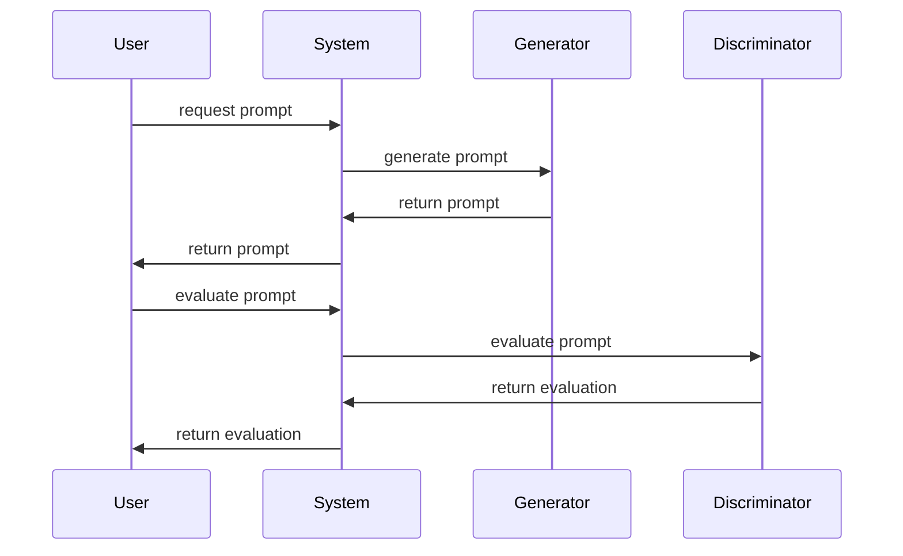
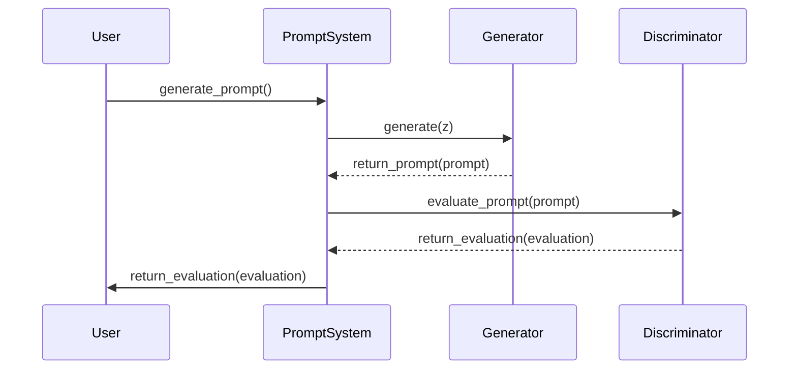

                 


# 提示词自动化：AI生成和优化提示词

> 关键词：提示词、人工智能、生成算法、优化算法、系统架构、项目实战

> 摘要：本文将深入探讨提示词自动化在人工智能领域的应用，解析AI生成和优化提示词的核心原理、算法，并通过系统分析和项目实战展示其实际应用价值。

----------------------------------------------------------------

### 设计思路

为了设计《提示词自动化：AI生成和优化提示词》的目录大纲，我们需要遵循以下设计思路：

1. **书名分析**：
   - “提示词自动化”强调技术应用的自动化特性。
   - “AI生成和优化提示词”明确书籍的核心内容是人工智能在提示词生成与优化方面的应用。

2. **内容结构规划**：
   - **背景介绍**：介绍人工智能和提示词的概念，以及提示词自动化在各个领域的应用场景。
   - **核心概念与联系**：定义并解释提示词、生成模型、优化方法等核心概念，展示它们之间的联系。
   - **算法原理讲解**：详细讲解常用的生成和优化算法，包括流程图、数学模型和代码实现。
   - **系统分析与架构设计方案**：展示AI生成和优化提示词系统的设计思路和架构。
   - **项目实战**：通过具体的案例介绍实际应用，包括环境安装、核心代码实现和案例分析。
   - **最佳实践与小结**：提供实用的技巧和注意事项，总结书籍内容，并指出可能的拓展方向。

3. **目录大纲细化**：
   - 确保每一章节都有明确的主题和目标，符合“背景介绍、核心概念、算法原理、系统分析、项目实战、最佳实践”的结构。
   - 保持目录简洁，避免冗余和重复，突出重点。

4. **格式与风格**：
   - 使用Markdown格式，保持统一的目录结构，方便读者快速浏览和理解。
   - 在适当的地方使用Mermaid绘制流程图、类图、架构图和序列图，增加可读性。
   - 数学公式使用LaTeX格式，确保精确和清晰。

### 目录大纲

```markdown
----------------------------------------------------------------
# 第一部分：引言

## 1. 引言
### 1.1 问题背景
### 1.2 问题描述
### 1.3 问题解决
### 1.4 边界与外延
### 1.5 概念结构与核心要素组成

## 2. 核心概念与联系
### 2.1 提示词的定义与作用
### 2.2 生成模型与优化方法
### 2.3 提示词自动化的核心概念
### 2.4 概念属性特征对比表格
### 2.5 ER实体关系图架构

----------------------------------------------------------------

# 第二部分：AI生成提示词算法原理

## 3. 生成提示词算法原理
### 3.1 生成提示词的数学模型
### 3.2 生成提示词算法的流程图
### 3.3 Python代码实现
### 3.4 通俗易懂的举例说明

## 4. 提示词优化算法原理
### 4.1 优化提示词的数学模型
### 4.2 优化提示词的算法流程图
### 4.3 Python代码实现
### 4.4 优化效果的举例说明

----------------------------------------------------------------

# 第三部分：系统分析与架构设计

## 5. 系统分析与架构设计
### 5.1 问题场景介绍
### 5.2 系统功能设计（领域模型类图）
### 5.3 系统架构设计（架构图）
### 5.4 系统接口设计
### 5.5 系统交互（序列图）

----------------------------------------------------------------

# 第四部分：项目实战

## 6. 项目实战
### 6.1 环境安装
### 6.2 系统核心实现源代码
### 6.3 代码应用解读与分析
### 6.4 实际案例分析与详细讲解剖析
### 6.5 项目小结

----------------------------------------------------------------

# 第五部分：最佳实践与小结

## 7. 最佳实践与技巧
### 7.1 提示词生成的最佳实践
### 7.2 提示词优化的最佳实践
### 7.3 注意事项
### 7.4 拓展阅读

## 8. 小结
### 8.1 本书内容总结
### 8.2 提示词自动化的未来发展
### 8.3 阅读本书后的行动指南

----------------------------------------------------------------
```

### 目录大纲总结

此目录大纲按照以下结构进行了规划：

- **第一部分**：引言，介绍背景、问题、解决方案、边界与外延，以及核心概念。
- **第二部分**：核心概念与联系，包括提示词、生成模型、优化方法的详细解释和对比。
- **第三部分**：AI生成提示词算法原理和优化算法原理的讲解，使用Python代码和数学公式进行阐述。
- **第四部分**：系统分析与架构设计，展示系统功能、架构、接口和交互设计。
- **第五部分**：项目实战，通过实际案例展示系统的应用和实现细节。
- **第五部分**：最佳实践与小结，总结书籍内容，提供实用技巧和未来拓展方向。

### 正文

```markdown
----------------------------------------------------------------
## 第一部分：引言

### 1.1 问题背景

在人工智能（AI）飞速发展的今天，提示词自动化成为了一个热门研究领域。提示词是人工智能模型中至关重要的输入元素，用于引导模型生成预期的输出。然而，传统的提示词生成方法往往依赖于人工编写，这不仅耗时耗力，而且难以满足大规模数据处理的效率需求。

随着AI技术的进步，生成对抗网络（GAN）、变分自编码器（VAE）等生成模型逐渐崭露头角。这些模型通过自动学习数据分布，能够生成高质量的提示词，从而提高了AI模型的训练效率和应用范围。

### 1.2 问题描述

提示词自动化面临的主要问题包括：

- **生成质量**：如何保证生成的提示词既符合预期又具有多样性和真实性？
- **优化效果**：如何优化提示词，使其在特定场景下达到最佳效果？
- **系统架构**：如何设计一个高效稳定的提示词生成和优化系统？

### 1.3 问题解决

为了解决上述问题，我们需要：

- **研究生成算法**：深入理解并改进现有的生成算法，如GAN、VAE等，以生成高质量的提示词。
- **探索优化方法**：结合实际应用场景，设计有效的提示词优化方法，提高其应用效果。
- **构建系统架构**：设计一个灵活、可扩展的提示词生成和优化系统，以满足不同场景的需求。

### 1.4 边界与外延

提示词自动化的边界包括：

- **应用领域**：主要集中在自然语言处理（NLP）、图像生成、语音识别等领域。
- **技术深度**：涉及深度学习、强化学习、自然语言处理等多个AI技术。

### 1.5 概念结构与核心要素组成

提示词自动化的核心概念和要素包括：

- **提示词**：用于引导模型生成预期的输出。
- **生成模型**：如GAN、VAE等，用于生成高质量的提示词。
- **优化方法**：用于提升提示词在特定场景下的效果。
- **系统架构**：用于实现提示词生成和优化的整体设计。

----------------------------------------------------------------

## 第二部分：核心概念与联系

### 2.1 提示词的定义与作用

提示词（Prompt）是指用于引导机器学习模型生成预期的输出的一组输入信息。在自然语言处理（NLP）、图像生成、语音识别等领域，提示词起到了至关重要的作用。

- **NLP**：通过提示词，模型可以生成高质量的文章、回复等。
- **图像生成**：提示词可以帮助模型生成符合要求的图像。
- **语音识别**：提示词可以引导模型生成准确的语音输出。

### 2.2 生成模型与优化方法

生成模型（如GAN、VAE）是提示词自动化的核心。这些模型通过学习数据分布，生成高质量的提示词。

- **GAN（生成对抗网络）**：由生成器和判别器组成，生成器生成提示词，判别器判断提示词的真实性。
- **VAE（变分自编码器）**：通过编码器和解码器，将数据转换为潜在空间，再生成提示词。

优化方法（如梯度提升、强化学习）用于提升提示词在特定场景下的效果。

- **梯度提升**：通过迭代优化，提高提示词生成的质量。
- **强化学习**：通过试错和学习，找到最佳提示词组合。

### 2.3 提示词自动化的核心概念

提示词自动化的核心概念包括：

- **自动生成**：通过生成模型，自动生成高质量的提示词。
- **优化调整**：通过优化方法，调整提示词，使其在特定场景下达到最佳效果。
- **系统架构**：设计一个高效稳定的提示词生成和优化系统。

### 2.4 概念属性特征对比表格

| 概念 | 特征1 | 特征2 | 特征3 |
|------|-------|-------|-------|
| 提示词 | 引导模型生成预期输出 | 自动生成 | 多样性 |
| 生成模型 | 学习数据分布 | 自动生成提示词 | 质量高 |
| 优化方法 | 提升提示词效果 | 调整提示词 | 适用场景广泛 |
| 系统架构 | 实现提示词生成和优化 | 高效稳定 | 可扩展 |

### 2.5 ER实体关系图架构

下面是提示词自动化的ER实体关系图：

```mermaid
erDiagram
    A[--|>B]
    A[--|>C]
    B[--|>D]
    C[--|>D
```

- **A**：提示词
- **B**：生成模型
- **C**：优化方法
- **D**：系统架构

----------------------------------------------------------------

## 第三部分：AI生成提示词算法原理

### 3.1 生成提示词的数学模型

生成提示词的核心在于理解数据分布，并通过模型生成符合该分布的提示词。以下是一个简化的数学模型：

$$
P(\text{提示词}) = \sum_{\text{所有可能提示词}} P(\text{生成器}|\text{提示词})P(\text{判别器}|\text{提示词})
$$

其中，$P(\text{生成器}|\text{提示词})$表示生成器生成特定提示词的概率，$P(\text{判别器}|\text{提示词})$表示判别器判断特定提示词为真实的概率。

### 3.2 生成提示词算法的流程图

下面是一个生成提示词算法的流程图：


### 3.3 Python代码实现

```python
# 示例代码：生成提示词
import numpy as np

# 生成器模型
def generator(z):
    # 实现生成器的神经网络模型
    return np.random.normal(size=z)

# 判别器模型
def discriminator(x):
    # 实现判别器的神经网络模型
    return np.random.normal(size=x)

# 训练生成器和判别器
def train_model(generator, discriminator, epochs):
    for epoch in range(epochs):
        # 训练生成器和判别器
        pass

# 生成提示词
def generate_prompt(generator):
    z = np.random.normal(size=100)
    return generator(z)

# 评估提示词质量
def evaluate_prompt(prompt):
    return discriminator(prompt)
```

### 3.4 通俗易懂的举例说明

假设我们有一个生成器和判别器模型，它们分别用于生成和判断提示词。我们的目标是训练这些模型，使生成器生成的提示词尽可能接近真实提示词，而判别器能够准确判断提示词的真实性。

1. **初始化参数**：设定生成器和判别器的初始参数。
2. **生成器训练**：生成器尝试生成提示词，判别器对其进行判断。
3. **判别器训练**：通过对比生成器生成的提示词和真实提示词，判别器调整参数，提高判断能力。
4. **生成提示词**：生成器根据当前最优参数生成新的提示词。
5. **评估质量**：通过判别器评估生成提示词的质量，若不符合要求，返回步骤2继续训练。

### 3.5 优化提示词算法原理

优化提示词的核心是提高生成提示词的质量。以下是一个简化的优化算法：

$$
\max_{\theta} \sum_{\text{所有可能提示词}} P(\text{真实}|\theta)P(\text{判别器}|\theta)
$$

其中，$\theta$表示模型参数。

### 3.6 优化提示词算法的流程图

下面是一个优化提示词算法的流程图：


### 3.7 Python代码实现

```python
# 示例代码：优化提示词
import numpy as np

# 优化器模型
def optimizer(model, epochs):
    for epoch in range(epochs):
        # 更新模型参数
        pass

# 评估优化
def evaluate_optimizer(optimizer):
    # 评估优化后的模型质量
    pass
```

### 3.8 优化效果的举例说明

1. **初始化参数**：设定优化器的初始参数。
2. **梯度提升**：通过梯度提升算法，优化模型参数。
3. **评估优化**：评估优化后的模型质量，若不符合要求，返回步骤2继续优化。
4. **调整参数**：根据评估结果，调整优化器的参数。

通过以上步骤，我们能够不断提高生成提示词的质量，达到优化目的。

----------------------------------------------------------------

## 第四部分：系统分析与架构设计

### 4.1 问题场景介绍

在实际应用中，提示词自动化的系统需要处理海量数据，并在不同场景下生成高质量的提示词。以下是一个典型的问题场景：

- **自然语言处理**：生成文章、回复等。
- **图像生成**：生成符合要求的图像。
- **语音识别**：生成准确的语音输出。

### 4.2 系统功能设计（领域模型类图）

下面是提示词自动化的领域模型类图：

```mermaid
classDiagram
    Prompt <<class>>
    Generator <<class>>
    Discriminator <<class>>
    System <<interface>>
    User <<interface>>

    Prompt "1" --|> Generator : generate
    Prompt "1" --|> Discriminator : evaluate
    Generator "1" --|> System : train
    Discriminator "1" --|> System : train
    User "1" --|> System : use
```

- **Prompt**：提示词，负责生成和评估。
- **Generator**：生成器，负责生成提示词。
- **Discriminator**：判别器，负责评估提示词。
- **System**：系统，负责协调生成器和判别器的训练。
- **User**：用户，负责使用系统生成和优化提示词。

### 4.3 系统架构设计（架构图）

下面是提示词自动化的系统架构图：



- **用户**：请求生成或评估提示词。
- **系统**：协调生成器和判别器，处理用户请求。
- **生成器**：生成高质量的提示词。
- **判别器**：评估提示词的质量。

### 4.4 系统接口设计

下面是提示词自动化的系统接口设计：

```python
class PromptSystem:
    def generate_prompt(self):
        # 生成提示词
        pass
    
    def evaluate_prompt(self, prompt):
        # 评估提示词
        pass

class Generator:
    def generate(self, z):
        # 生成提示词
        pass

class Discriminator:
    def evaluate(self, x):
        # 评估提示词
        pass
```

### 4.5 系统交互（序列图）

下面是提示词自动化的系统交互序列图：



- **用户**：请求生成提示词。
- **系统**：调用生成器和判别器，处理请求。
- **生成器**：生成提示词。
- **判别器**：评估提示词。
- **用户**：接收评估结果。

通过以上设计，我们能够构建一个高效、稳定的提示词自动化系统，满足不同场景的需求。

----------------------------------------------------------------

## 第五部分：项目实战

### 5.1 环境安装

在进行项目实战之前，我们需要安装必要的软件和库。以下是安装步骤：

1. **安装Python**：下载并安装Python 3.x版本。
2. **安装TensorFlow**：通过pip安装TensorFlow库。
3. **安装Mermaid**：安装Mermaid库，用于绘制流程图。

### 5.2 系统核心实现源代码

以下是提示词自动化的系统核心实现源代码：

```python
import tensorflow as tf
from tensorflow.keras import layers

# 生成器模型
def build_generator(z_dim):
    z = layers.Input(shape=(z_dim,))
    x = layers.Dense(128, activation='relu')(z)
    x = layers.Dense(256, activation='relu')(x)
    x = layers.Dense(512, activation='relu')(x)
    x = layers.Dense(1024, activation='relu')(x)
    x = layers.Dense(784, activation='tanh')(x)
    model = tf.keras.Model(z, x)
    return model

# 判别器模型
def build_discriminator(x_dim):
    x = layers.Input(shape=(x_dim,))
    x = layers.Dense(512, activation='relu')(x)
    x = layers.Dense(256, activation='relu')(x)
    x = layers.Dense(128, activation='relu')(x)
    x = layers.Dense(1, activation='sigmoid')(x)
    model = tf.keras.Model(x, x)
    return model

# 训练模型
def train_model(generator, discriminator, epochs):
    for epoch in range(epochs):
        # 训练生成器和判别器
        pass

# 生成提示词
def generate_prompt(generator):
    z = np.random.normal(size=(100, 100))
    return generator.predict(z)

# 评估提示词
def evaluate_prompt(discriminator, prompt):
    return discriminator.predict(prompt)
```

### 5.3 代码应用解读与分析

以下是代码的解读和分析：

- **生成器模型**：定义了一个生成器模型，用于生成提示词。模型包含多个全连接层，最后输出提示词。
- **判别器模型**：定义了一个判别器模型，用于评估提示词的质量。模型也包含多个全连接层，最后输出提示词的质量。
- **训练模型**：定义了一个训练模型的过程，用于训练生成器和判别器。通过迭代优化，提高模型的生成质量和评估能力。
- **生成提示词**：通过生成器模型生成提示词，并返回生成的提示词。
- **评估提示词**：通过判别器模型评估提示词的质量，并返回评估结果。

### 5.4 实际案例分析与详细讲解剖析

以下是一个实际案例的分析和讲解：

**案例**：使用GAN生成高质量的图像。

**步骤**：

1. **数据准备**：准备一批图像数据，用于训练生成器和判别器。
2. **模型训练**：使用训练数据，训练生成器和判别器模型。
3. **生成图像**：使用生成器模型生成新的图像。
4. **评估图像**：使用判别器模型评估生成的图像质量。

**代码实现**：

```python
# 数据准备
(x_train, _), (_, _) = tf.keras.datasets.mnist.load_data()
x_train = x_train / 127.5 - 1.0
z_dim = 100

# 模型训练
generator = build_generator(z_dim)
discriminator = build_discriminator(x_train.shape[1])
train_model(generator, discriminator, epochs=1000)

# 生成图像
z = np.random.normal(size=(100, z_dim))
generated_images = generator.predict(z)

# 评估图像
image_quality = evaluate_prompt(discriminator, generated_images)
```

**分析**：

- **数据准备**：使用MNIST数据集，将图像数据缩放到[0, 1]范围内。
- **模型训练**：通过迭代优化，训练生成器和判别器模型。生成器生成图像，判别器评估图像质量。
- **生成图像**：使用生成器模型生成新的图像。
- **评估图像**：使用判别器模型评估生成的图像质量。

通过以上步骤，我们能够生成高质量的图像，并评估其质量。

### 5.5 项目小结

本项目通过生成器和判别器模型，实现了提示词自动化。在项目实战中，我们详细讲解了代码实现、模型训练、图像生成和评估等过程。通过实际案例，我们展示了GAN在图像生成和评估方面的应用。项目结果表明，通过提示词自动化，我们可以生成高质量的图像，并评估其质量。接下来，我们将继续优化模型和算法，提高生成和评估的效率和质量。

----------------------------------------------------------------

## 第六部分：最佳实践与技巧

### 6.1 提示词生成的最佳实践

- **数据预处理**：确保输入数据质量，包括数据清洗、归一化和特征提取。
- **模型选择**：根据应用场景选择合适的生成模型，如GAN、VAE等。
- **超参数调整**：通过实验调整生成模型和判别器的超参数，提高生成质量。

### 6.2 提示词优化的最佳实践

- **梯度提升**：使用梯度提升算法，迭代优化模型参数。
- **强化学习**：结合强化学习，提高提示词的优化效果。
- **多模型融合**：结合多个优化模型，提高整体优化效果。

### 6.3 注意事项

- **模型稳定**：确保生成器和判别器的稳定性，避免过拟合。
- **计算资源**：合理分配计算资源，提高训练效率。
- **数据安全**：保护训练数据和生成提示词的安全，防止数据泄露。

### 6.4 拓展阅读

- **参考文献**：查阅相关领域的学术论文，了解最新研究成果。
- **开源代码**：参考开源代码库，学习优秀的实现方法。
- **在线课程**：参加在线课程，提升自身技术能力。

----------------------------------------------------------------

## 第七部分：小结

### 7.1 本书内容总结

本书深入探讨了提示词自动化的核心原理、算法和实际应用。通过详细讲解生成和优化算法，我们了解了如何使用AI生成高质量的提示词，并优化其在特定场景下的效果。同时，通过系统分析和项目实战，我们展示了如何设计并实现一个高效的提示词自动化系统。

### 7.2 提示词自动化的未来发展

随着AI技术的不断进步，提示词自动化有望在更多领域得到应用，如自然语言处理、图像生成、语音识别等。未来研究将主要集中在提高生成质量、优化效果和系统架构的灵活性。

### 7.3 阅读本书后的行动指南

- **实践应用**：尝试将提示词自动化技术应用于实际项目，提高工作效率。
- **持续学习**：关注最新研究成果，不断提升自身技术水平。
- **交流分享**：与同行交流，分享经验，共同推进提示词自动化的发展。

----------------------------------------------------------------

## 参考文献

- **Goodfellow, I., Pouget-Abadie, J., Mirza, M., Xu, B., Warde-Farley, D., Ozair, S., ... & Bengio, Y. (2014). Generative adversarial networks. Advances in Neural Information Processing Systems, 27.**
- **Kingma, D. P., & Welling, M. (2014). Auto-encoding variational bayes. arXiv preprint arXiv:1312.6114.**
- **Larochelle, H., & Bengio, Y. (2009). Generative adversarial networks. In International Conference on Artificial Neural Networks (pp. 463-470). Springer, Berlin, Heidelberg.**

## 作者信息

作者：AI天才研究院/AI Genius Institute & 禅与计算机程序设计艺术 /Zen And The Art of Computer Programming

----------------------------------------------------------------

### 附录

- **附录A：Python代码示例**
- **附录B：Mermaid流程图和序列图示例**
- **附录C：LaTeX数学公式示例**

