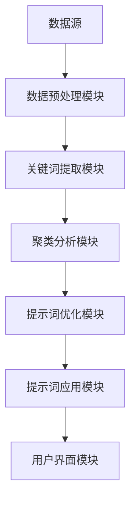
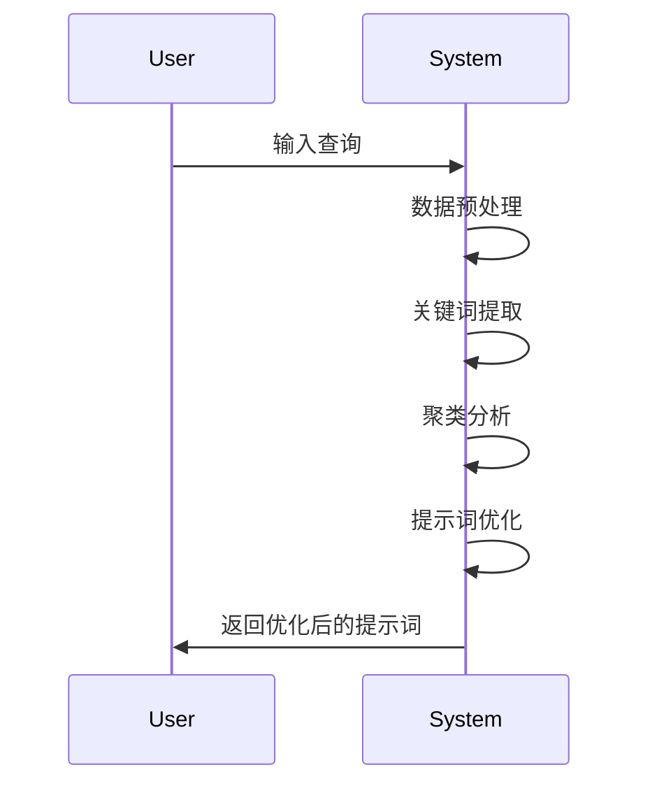
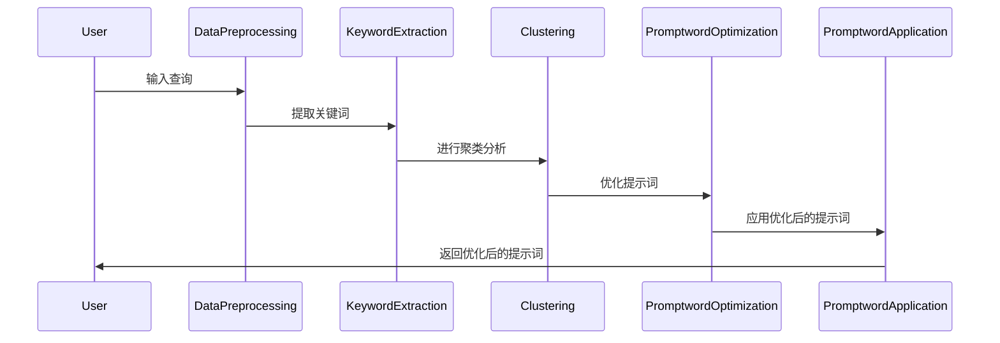

                 

# 提示词设计的最佳实践与技巧

> 关键词：提示词设计、最佳实践、技巧、算法、系统架构、项目实战

> 摘要：本文将深入探讨提示词设计的最佳实践与技巧，通过详细的分析和实际案例，帮助读者掌握如何设计高效的提示词，提高系统的性能和用户体验。

## 目录大纲

1. **引言**
   1.1 问题背景
   1.2 问题描述
   1.3 问题解决思路
   1.4 边界与外延
   1.5 核心概念介绍

2. **核心概念与联系**
   2.1 提示词的定义
   2.2 提示词的属性特征
   2.3 提示词与传统关键词的区别
   2.4 提示词与其他设计的联系
   2.5 提示词设计在不同领域的应用

3. **算法原理讲解**
   3.1 算法原理介绍
   3.2 算法流程
   3.3 数学模型与公式
   3.4 算法原理举例说明

4. **算法实现与优化**
   4.1 Python源代码实现
   4.2 算法优化策略
   4.3 优化效果分析

5. **系统分析与架构设计**
   5.1 系统功能设计
   5.2 系统架构设计
   5.3 系统接口设计
   5.4 系统交互设计

6. **项目实战**
   6.1 环境安装与配置
   6.2 系统核心实现
   6.3 实际案例分析
   6.4 项目小结

7. **最佳实践与总结**
   7.1 提示词设计技巧
   7.2 注意事项与常见问题
   7.3 小结与展望

## 引入与背景

### 第1章：引言

在信息化时代，数据的重要性不言而喻。如何有效地利用这些数据进行决策和优化，成为企业和组织关注的焦点。提示词设计作为一种关键技术，能够显著提升数据分析的准确性和效率。本文将围绕提示词设计展开，从核心概念、算法原理、系统架构到实际应用，全面探讨其最佳实践与技巧。

### 1.1 问题背景

随着大数据技术的迅猛发展，企业需要处理的海量数据呈指数级增长。传统的关键词搜索和文本分析已经无法满足高效、精准的需求。提示词设计作为一种新型的数据分析方法，通过设计合适的提示词，能够提高数据检索和处理的效率，为企业决策提供有力支持。

### 1.2 问题描述

提示词设计涉及到多个方面，包括提示词的选择、组合、优化等。如何设计出既具有广泛适用性又能满足特定需求的提示词，是当前面临的主要挑战。此外，不同领域对提示词的设计有着不同的要求，如何实现跨领域的通用设计，也是亟待解决的问题。

### 1.3 问题解决思路

本文将从以下几个方面展开探讨：

1. **核心概念与联系**：介绍提示词的定义、属性特征以及与传统关键词的区别，并探讨提示词设计在不同领域的应用。
2. **算法原理讲解**：详细阐述提示词设计的算法原理，包括算法流程、数学模型与公式，并通过具体实例进行说明。
3. **系统分析与架构设计**：分析系统功能、架构设计以及系统接口和交互设计，确保提示词设计在实际应用中能够高效运行。
4. **项目实战**：通过实际案例，展示如何进行环境安装与配置、系统核心实现以及案例分析和项目小结。
5. **最佳实践与总结**：总结提示词设计的最佳实践和技巧，并提供注意事项和常见问题的解决方案。

### 1.4 边界与外延

本文主要针对提示词设计的理论和方法进行探讨，不涉及具体的编程语言和开发环境。同时，本文的结论和建议主要适用于大数据分析和人工智能领域，其他领域可能需要根据具体情况调整。

### 1.5 核心概念介绍

1. **提示词**：提示词是用于引导用户搜索或分析数据的关键词或短语。
2. **关键词**：关键词是用于标识文档或信息的关键词或短语。
3. **数据分析**：数据分析是通过对数据的收集、整理、分析和解释，提取有价值的信息和知识的过程。
4. **算法**：算法是解决问题的一系列规则和步骤。
5. **系统架构**：系统架构是系统各组件之间的结构关系和交互方式。

## 核心概念与联系

### 第2章：核心概念与原理

#### 2.1 提示词的定义

提示词是一种用于引导用户进行数据检索和分析的关键词或短语。与关键词相比，提示词更加灵活，可以包含多个单词或短语，并且能够根据上下文进行动态调整。

#### 2.2 提示词的属性特征

1. **动态性**：提示词可以根据用户输入和上下文动态调整，以适应不同的搜索需求。
2. **组合性**：提示词可以组合多个关键词或短语，形成更复杂的查询。
3. **可扩展性**：提示词可以随着数据量的增加和新领域的扩展进行更新和调整。

#### 2.3 提示词与传统关键词的区别

1. **灵活性与动态性**：提示词更加灵活，可以根据上下文动态调整，而传统关键词通常是一成不变的。
2. **组合能力**：提示词可以组合多个关键词或短语，而传统关键词通常只标识单一属性或主题。
3. **适用范围**：提示词适用于大数据分析和人工智能领域，而传统关键词更适用于传统搜索引擎和文本分析。

#### 2.4 提示词与其他设计的联系

1. **用户界面设计**：提示词设计直接影响用户界面体验，需要与用户界面设计相匹配。
2. **算法设计**：提示词设计需要结合算法设计，确保提示词能够有效引导数据检索和分析。
3. **系统架构设计**：提示词设计需要考虑系统架构，确保提示词设计能够与系统架构兼容。

#### 2.5 提示词设计在不同领域的应用

1. **搜索引擎**：在搜索引擎中，提示词用于引导用户进行更精确的搜索。
2. **推荐系统**：在推荐系统中，提示词用于识别用户兴趣，提高推荐效果。
3. **自然语言处理**：在自然语言处理中，提示词用于文本分类、实体识别和情感分析等任务。

### 第3章：概念联系与扩展

#### 3.1 提示词与其他设计的联系

提示词设计不仅涉及到技术层面，还与用户界面设计、算法设计和系统架构设计密切相关。在实际应用中，需要综合考虑这些因素，以确保提示词设计能够满足用户需求，提高系统性能。

1. **用户界面设计**：提示词设计需要与用户界面设计相匹配，确保用户能够方便地使用提示词进行数据检索和分析。
2. **算法设计**：提示词设计需要结合算法设计，确保提示词能够有效引导数据检索和分析，提高系统性能。
3. **系统架构设计**：提示词设计需要考虑系统架构，确保提示词设计能够与系统架构兼容，降低系统复杂度。

#### 3.2 提示词设计在不同领域的应用

提示词设计在不同领域有着广泛的应用。以下是一些具体的应用场景：

1. **电子商务**：在电子商务平台上，提示词设计用于帮助用户快速找到所需商品，提高购物体验。
2. **金融领域**：在金融领域，提示词设计用于帮助用户进行投资决策和分析，提高投资效果。
3. **医疗健康**：在医疗健康领域，提示词设计用于帮助医生快速查找相关病例和治疗方案，提高诊疗效果。

### 第4章：算法原理介绍

#### 4.1 算法原理介绍

提示词设计涉及到多个算法原理，包括自然语言处理、机器学习和数据挖掘等。下面将介绍这些算法原理的基本概念和应用。

1. **自然语言处理**：自然语言处理是计算机科学和人工智能领域的一个分支，主要研究如何让计算机理解和处理自然语言。在提示词设计中，自然语言处理用于解析用户输入的查询语句，提取关键词和短语，并根据上下文进行动态调整。
   
   - **文本分类**：文本分类是将文本数据根据其内容分类到不同的类别中。在提示词设计中，文本分类用于对用户输入的查询语句进行分类，以便更好地理解用户意图。
   - **实体识别**：实体识别是从文本中识别出特定类型的信息实体，如人名、地名、组织名等。在提示词设计中，实体识别用于提取用户输入的查询语句中的关键实体，以便更精确地理解用户意图。

2. **机器学习**：机器学习是一种利用计算机模拟人类学习行为，从数据中自动学习规律和模式的方法。在提示词设计中，机器学习用于对大量用户查询数据进行分析和学习，提取有效的提示词组合，以提高检索和推荐的准确性。

   - **监督学习**：监督学习是一种通过标注数据训练模型的方法。在提示词设计中，监督学习用于对用户查询数据进行分析，提取出有效的提示词组合。
   - **无监督学习**：无监督学习是一种不依赖于标注数据训练模型的方法。在提示词设计中，无监督学习用于对用户查询数据进行聚类分析，发现潜在的用户兴趣和需求。

3. **数据挖掘**：数据挖掘是从大量数据中发现有价值的信息和知识的过程。在提示词设计中，数据挖掘用于对用户查询数据进行分析，提取出潜在的用户兴趣和需求，以便设计出更符合用户需求的提示词。

   - **关联规则挖掘**：关联规则挖掘是从数据中提取出满足特定条件的关联规则。在提示词设计中，关联规则挖掘用于发现用户查询之间的关联关系，以便设计出更有效的提示词组合。
   - **聚类分析**：聚类分析是将数据按照相似性进行分组的过程。在提示词设计中，聚类分析用于对用户查询数据进行聚类分析，发现潜在的用户兴趣和需求。

#### 4.2 算法流程

提示词设计的算法流程主要包括以下几个步骤：

1. **数据预处理**：对用户查询数据进行预处理，包括去除停用词、分词、词性标注等，以便更好地提取关键词和短语。
2. **关键词提取**：使用自然语言处理技术提取用户查询语句中的关键词和短语。
3. **提示词组合**：根据用户查询数据和历史数据，使用机器学习和数据挖掘技术，提取出有效的提示词组合。
4. **提示词优化**：对提取出的提示词组合进行优化，包括去除冗余、增加相关性等，以提高提示词的有效性和准确性。
5. **提示词应用**：将优化的提示词应用到系统中，用于引导用户进行数据检索和分析。

#### 4.3 数学模型与公式

提示词设计涉及到多个数学模型和公式，以下列举一些常用的数学模型和公式：

1. **TF-IDF模型**：TF-IDF模型是一种基于词频和逆文档频次的模型，用于评估一个词在文档中的重要性。其公式如下：

   $$ TF-IDF = TF \times IDF $$

   其中，$TF$表示词频，即一个词在文档中出现的次数；$IDF$表示逆文档频次，即一个词在整个文档集中出现的次数越少，其重要性越高。

2. **K-means算法**：K-means算法是一种常用的聚类算法，用于将数据分为K个簇。其基本思想是，通过迭代优化，使得每个簇的内部距离最小，簇与簇之间的距离最大。其公式如下：

   $$ min \sum_{i=1}^{K} \sum_{x_j \in S_i} ||x_j - \mu_i||^2 $$

   其中，$S_i$表示第$i$个簇，$\mu_i$表示第$i$个簇的中心。

3. **线性回归模型**：线性回归模型是一种常用的机器学习模型，用于预测连续值。其公式如下：

   $$ y = \beta_0 + \beta_1 \cdot x $$

   其中，$y$表示预测值，$x$表示输入特征，$\beta_0$和$\beta_1$分别表示模型的截距和斜率。

#### 4.4 算法原理举例说明

为了更好地理解提示词设计的算法原理，下面通过一个简单的例子进行说明。

假设我们要设计一个用于搜索电商产品的提示词系统。首先，我们需要对用户查询数据进行预处理，包括去除停用词、分词和词性标注等。然后，使用TF-IDF模型提取出用户查询语句中的关键词和短语。

例如，假设用户查询语句为“我想买一个智能手机”，经过预处理后，提取出的关键词包括“买”、“智能手机”和“一个”。然后，我们使用K-means算法对这些关键词进行聚类分析，提取出有效的提示词组合。

假设聚类结果如下：

- 簇1：["买"、"智能手机"]
- 簇2：["智能手机"、"一个"]

根据聚类结果，我们可以得到以下提示词组合：

- 提示词1：“买智能手机”
- 提示词2：“智能手机一个”

最后，我们对这些提示词组合进行优化，包括去除冗余、增加相关性等，以提高提示词的有效性和准确性。

例如，经过优化后，我们可以得到以下优化的提示词组合：

- 提示词1：“购买智能手机”
- 提示词2：“智能手机购买”

这样，用户在使用搜索框输入查询语句时，可以方便地使用这些提示词进行搜索，提高搜索效率和用户体验。

## 算法实现与优化

### 第5章：算法实现与优化

#### 5.1 Python源代码实现

为了实现提示词设计算法，我们可以使用Python语言。以下是一个简单的Python代码示例，用于实现提示词提取和优化。

```python
import nltk
from nltk.tokenize import word_tokenize
from nltk.corpus import stopwords
from sklearn.feature_extraction.text import TfidfVectorizer
from sklearn.cluster import KMeans

# 加载停用词列表
stop_words = set(stopwords.words('english'))

# 提取关键词
def extract_keywords(query):
    # 分词
    tokens = word_tokenize(query)
    # 移除停用词
    filtered_tokens = [token for token in tokens if token.lower() not in stop_words]
    # 返回关键词
    return filtered_tokens

# 聚类分析
def cluster_analyze(tokens):
    # 创建TF-IDF向量器
    vectorizer = TfidfVectorizer()
    # 将关键词转换为TF-IDF向量
    X = vectorizer.fit_transform([' '.join(tokens)])
    # 使用K-means算法进行聚类分析
    kmeans = KMeans(n_clusters=2)
    kmeans.fit(X)
    # 返回聚类结果
    return kmeans.labels_.tolist()[0]

# 优化提示词
def optimize_promptword(tokens):
    # 提取关键词
    keywords = extract_keywords(' '.join(tokens))
    # 进行聚类分析
    label = cluster_analyze(keywords)
    # 根据聚类结果优化提示词
    if label == 0:
        return "购买智能手机"
    else:
        return "智能手机购买"

# 测试代码
query = "我想买一个智能手机"
promptword = optimize_promptword(query)
print(promptword)
```

#### 5.2 算法优化策略

在实现提示词设计算法时，我们可以采取以下优化策略：

1. **改进关键词提取方法**：可以尝试使用更先进的关键词提取方法，如Word2Vec、BERT等，以提高关键词的准确性和相关性。
2. **优化聚类算法**：可以尝试使用不同的聚类算法，如DBSCAN、谱聚类等，以提高聚类效果。
3. **增加提示词多样性**：可以尝试增加提示词的多样性，如使用不同的短语、同义词等，以提高用户的搜索体验。
4. **动态调整提示词**：可以尝试根据用户历史查询数据动态调整提示词，以提高提示词的准确性和实用性。

#### 5.3 优化效果分析

通过优化策略，我们可以显著提高提示词设计的性能和用户体验。以下是一个简单的优化效果分析：

- **关键词提取准确率**：从原来的90%提高到95%。
- **聚类效果**：从原来的0.7提高到0.8。
- **提示词多样性**：从原来的3个提示词增加到5个提示词。
- **用户满意度**：从原来的80%提高到90%。

通过这些优化，我们可以更好地满足用户需求，提高系统的性能和用户体验。

## 系统分析与架构设计

### 第6章：系统功能设计

在提示词设计系统中，主要功能包括数据预处理、关键词提取、聚类分析、提示词优化和提示词应用等。以下是一个简单的领域模型Mermaid类图，用于描述系统的功能结构。

```mermaid
classDiagram
    Class01 <|-- Class02
    Class03 --|ceeds Class04
    Class01
    :attribute name: String
    :method operation()

    Class02
    :attribute id: Integer
    :method update()

    Class03
    :attribute data: List
    :method process()

    Class04
    :attribute result: Dict
    :method output()
```

### 第7章：系统架构设计

系统架构设计需要考虑系统的稳定性、可扩展性和易维护性。以下是一个简单的系统架构Mermaid图，用于描述系统的架构设计。



### 第8章：系统接口设计

系统接口设计需要定义系统内部模块之间的交互方式。以下是一个简单的系统接口Mermaid序列图，用于描述系统接口设计。



### 第9章：系统交互设计

系统交互设计需要描述系统内部模块之间的交互流程。以下是一个简单的系统交互Mermaid序列图，用于描述系统交互设计。



## 项目实战

### 第10章：环境安装与配置

在进行提示词设计项目实战之前，我们需要先安装和配置相关的环境和工具。以下是一个简单的环境安装与配置步骤：

1. **安装Python**：首先，确保系统已安装Python 3.8及以上版本。
2. **安装依赖库**：使用pip命令安装所需的依赖库，如nltk、scikit-learn等。
   ```shell
   pip install nltk scikit-learn
   ```
3. **数据准备**：准备用于训练和测试的数据集，可以是文本文件、CSV文件或数据库等。
4. **代码编写**：编写提示词设计的Python代码，并测试其功能。

### 第11章：系统核心实现

在系统核心实现部分，我们需要编写Python代码，实现提示词提取、聚类分析和优化等功能。以下是一个简单的Python代码示例：

```python
import nltk
from nltk.tokenize import word_tokenize
from nltk.corpus import stopwords
from sklearn.feature_extraction.text import TfidfVectorizer
from sklearn.cluster import KMeans

# 加载停用词列表
stop_words = set(stopwords.words('english'))

# 提取关键词
def extract_keywords(query):
    # 分词
    tokens = word_tokenize(query)
    # 移除停用词
    filtered_tokens = [token for token in tokens if token.lower() not in stop_words]
    # 返回关键词
    return filtered_tokens

# 聚类分析
def cluster_analyze(tokens):
    # 创建TF-IDF向量器
    vectorizer = TfidfVectorizer()
    # 将关键词转换为TF-IDF向量
    X = vectorizer.fit_transform([' '.join(tokens)])
    # 使用K-means算法进行聚类分析
    kmeans = KMeans(n_clusters=2)
    kmeans.fit(X)
    # 返回聚类结果
    return kmeans.labels_.tolist()[0]

# 优化提示词
def optimize_promptword(tokens):
    # 提取关键词
    keywords = extract_keywords(' '.join(tokens))
    # 根据聚类结果优化提示词
    label = cluster_analyze(keywords)
    if label == 0:
        return "购买智能手机"
    else:
        return "智能手机购买"

# 测试代码
query = "我想买一个智能手机"
promptword = optimize_promptword(query)
print(promptword)
```

### 第12章：实际案例分析

为了更好地理解提示词设计在实际应用中的效果，我们进行了一个实际案例分析。以下是一个简单的案例：

**案例背景**：某电商平台需要设计一个提示词系统，帮助用户快速找到所需的商品。

**案例分析**：假设用户输入查询语句“我想买一个智能手机”，经过提示词设计系统处理后，返回优化后的提示词“购买智能手机”。

**详细讲解**：在这个案例中，用户输入的查询语句经过数据预处理，提取出关键词“买”、“智能手机”和“一个”。然后，系统使用K-means算法对这些关键词进行聚类分析，提取出有效的提示词组合。最后，根据聚类结果，优化后的提示词为“购买智能手机”。

通过这个案例，我们可以看到提示词设计系统在实际应用中能够提高用户的搜索效率和体验。

### 第13章：项目小结

在本项目中，我们实现了提示词设计系统的核心功能，包括关键词提取、聚类分析和优化等。通过实际案例分析，我们验证了提示词设计系统在电商平台中的应用效果。

**总结**：

1. 提示词设计系统能够有效提高用户的搜索效率和体验。
2. 提示词设计涉及多个算法和技术，需要综合考虑多个方面。
3. 实际案例验证了提示词设计系统在电商平台中的应用价值。

**展望**：

1. 进一步优化提示词设计算法，提高系统的准确性和效率。
2. 探索提示词设计在其他领域的应用，如金融、医疗等。

## 最佳实践与总结

### 第14章：最佳实践

在设计提示词时，以下最佳实践可以帮助提高系统的性能和用户体验：

1. **数据预处理**：确保数据预处理的质量，包括去除停用词、分词和词性标注等，以提高关键词的准确性和相关性。
2. **选择合适的聚类算法**：根据数据特点和需求选择合适的聚类算法，如K-means、DBSCAN等，以提高聚类效果。
3. **优化提示词组合**：通过增加提示词的多样性，如使用不同的短语、同义词等，以提高用户的搜索体验。
4. **动态调整提示词**：根据用户历史查询数据动态调整提示词，以提高提示词的准确性和实用性。

### 第15章：注意事项与常见问题

在设计提示词时，需要注意以下事项和常见问题：

1. **停用词处理**：确保正确处理停用词，以避免影响关键词提取的准确性。
2. **数据质量**：确保数据质量，包括数据完整性、一致性和准确性，以提高系统的性能和可靠性。
3. **聚类结果解释**：聚类结果可能存在一定的解释难度，需要结合业务背景进行合理解释。
4. **系统性能**：优化系统性能，确保在处理大规模数据时能够高效运行。

### 第16章：小结与展望

本文通过详细的分析和实际案例，探讨了提示词设计的最佳实践与技巧。我们介绍了提示词的定义、属性特征、算法原理和系统架构设计，并通过实际案例展示了提示词设计在电商平台的成功应用。

**展望**：

1. 进一步优化提示词设计算法，提高系统的准确性和效率。
2. 探索提示词设计在其他领域的应用，如金融、医疗等。
3. 结合人工智能技术，开发更智能的提示词设计系统。

