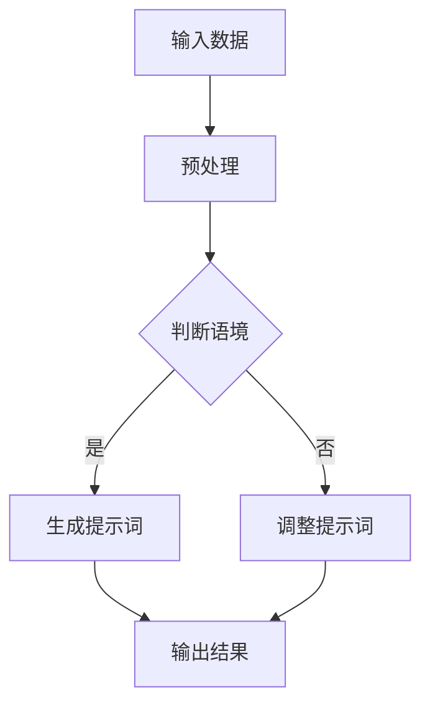
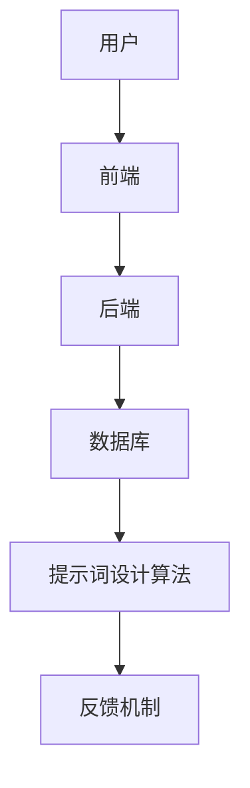
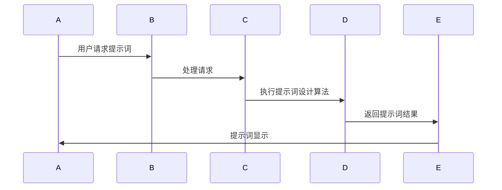

                 

### 《提示词设计的社会语言学视角探析》

#### 关键词：
- 提示词设计
- 社会语言学
- 用户体验
- 算法原理
- 系统架构

#### 摘要：
本文旨在从社会语言学的视角探讨提示词设计的重要性及其在计算机科学与人工智能领域的应用。通过介绍提示词设计的核心概念与联系，详细讲解提示词设计算法原理，分析系统功能设计与架构设计，最终通过项目实战阐述其实际应用。本文旨在为读者提供一个系统且全面的理解，帮助他们在实践中更好地应用提示词设计，提升用户体验。

## 第一部分：背景介绍

### 第1章：问题背景

#### 1.1.1 问题背景概述

提示词设计在当前数字化时代愈发重要，它直接影响用户在复杂信息系统中的导航和操作体验。良好的提示词设计不仅能够提高用户的效率，还能降低学习成本，提升整体用户体验。然而，随着技术的不断发展，用户需求的多样性和复杂性也使得提示词设计面临前所未有的挑战。

社会语言学视角为提示词设计提供了新的思考维度。社会语言学是研究语言在社会交往中的作用和功能的学科，关注语言在沟通中的社会文化背景。将社会语言学的原理应用于提示词设计，可以帮助我们更好地理解用户的语言习惯和沟通需求，从而设计出更具针对性和有效性的提示词。

#### 1.1.2 提示词设计现状分析

当前，提示词设计在多个领域得到广泛应用，如搜索引擎、操作系统、移动应用和智能语音助手等。尽管已有一些成功的案例，但整体上还存在以下问题：

1. **缺乏针对性**：许多提示词设计过于通用，无法满足特定用户群体的需求。
2. **语境适应性不足**：提示词在不同语境下的表现不一致，可能导致用户困惑。
3. **用户参与度低**：用户在提示词设计中的参与度较低，缺乏对用户体验的深刻理解。

#### 1.1.3 社会语言学视角的意义

社会语言学视角强调语言的社会性、功能性和互动性。将这一视角应用于提示词设计，有助于：

1. **提升用户满意度**：通过理解用户的社会文化背景，设计出更加贴近用户需求的提示词。
2. **增强语境适应性**：考虑不同语境下的语言特点，设计出更具灵活性和多样性的提示词。
3. **促进用户参与**：通过引入社会语言学的研究方法，提高用户在提示词设计中的参与度。

### 第2章：核心概念与联系

#### 2.1.1 核心概念原理

**提示词**：用于引导用户行为的信息词或短语。其设计原则包括明确性、简洁性和相关性。

**社会语言学**：研究语言在社会交往中的作用和功能的学科。其核心概念包括社会性、功能性、语境适应性和互动性。

#### 2.1.2 概念属性特征对比表格

| 概念   | 定义                                                         | 属性特征                                                 |
| ------ | ------------------------------------------------------------ | -------------------------------------------------------- |
| 提示词 | 用于引导用户行为的信息词或短语                               | 明确性、简洁性、相关性、语境适应性                         |
| 社会语言学 | 研究语言在社会交往中的作用和功能的学科                     | 社会性、功能性、语境适应性、互动性                         |

#### 2.1.3 ER实体关系图架构

```mermaid
erDiagram
    User ||--|{|TipDesign|}>
    TipDesign ||--|{|Context|}>
    Context ||--|{|Language|}>
    Language ||--|{|Social|}>
```

### 第3章：提示词设计算法原理

#### 3.1.1 算法原理概述

提示词设计算法的作用在于根据用户行为和上下文信息生成或调整提示词，以提高用户体验。其基本流程包括输入数据预处理、判断语境、生成或调整提示词以及输出结果。

#### 3.1.2 算法流程mermaid流程图



#### 3.1.3 算法原理详细讲解

**输入数据预处理**：对输入数据（如用户行为日志、上下文信息等）进行清洗、去噪和处理，以便后续分析。

**判断语境**：根据输入数据和预定义的规则判断用户所处的语境，如搜索、浏览、操作等。

**提示词生成与调整**：根据判断结果，生成或调整提示词。生成提示词时，需要考虑语言的简洁性、明确性和相关性。调整提示词时，需要考虑语境的适应性和用户的反馈。

#### 3.1.4 算法原理数学模型和公式

$$
\text{生成提示词} = f(\text{输入数据}, \text{语境})
$$

- $f$ 为函数，表示提示词生成过程
- 输入数据：用户行为、上下文信息
- 语境：用户所处环境、交流对象、场景

#### 3.1.5 算法原理举例说明

例如，在一个电商网站中，用户在浏览商品时，系统可以根据用户的历史浏览记录和当前浏览的商品类型，生成如“热门商品推荐”、“同类商品对比”等提示词，以引导用户进一步操作。

### 第4章：系统功能设计

#### 4.1.1 介绍

系统功能设计是提示词设计的关键环节，它决定了提示词生成的准确性和适应性。一个良好的系统功能设计需要充分考虑用户需求、语境复杂性和算法性能。

#### 4.1.2 领域模型mermaid类图

```mermaid
classDiagram
    User o--|{语境}| Context
    Context o--|{提示词}| TipDesign
    TipDesign o--|{设计规则}| DesignRule
```

- **用户**：代表系统的最终用户，其行为和偏好是提示词设计的重要输入。
- **语境**：描述用户所处的环境、交流对象和场景，直接影响提示词的生成。
- **提示词设计**：根据用户行为和语境生成或调整提示词的核心功能模块。
- **设计规则**：包含提示词生成的规则和策略，如优先级、多样性、个性化等。

### 第5章：系统架构设计

#### 5.1.1 介绍

系统架构设计是确保提示词设计系统稳定、高效运行的基础。一个合理的系统架构能够提高系统的可扩展性、灵活性和可维护性。

#### 5.1.2 系统架构mermaid架构图



- **前端**：与用户直接交互的界面，负责收集用户输入和显示提示词。
- **后端**：处理提示词设计算法的核心逻辑，包括输入数据处理、语境判断、提示词生成和调整等。
- **数据库**：存储用户行为数据、上下文信息和提示词设计规则。
- **提示词设计算法**：实现提示词生成的核心算法，包括预处理、语境判断、生成和调整等步骤。
- **反馈机制**：收集用户对提示词的反馈，用于优化和调整提示词设计。

### 第6章：系统接口设计

#### 6.1.1 介绍

系统接口设计是确保系统各组件之间协同工作的重要环节。良好的接口设计能够提高系统的可扩展性和可维护性。

#### 6.1.2 系统接口mermaid序列图



- **用户请求提示词**：前端界面接收用户请求，发送到后端处理。
- **处理请求**：后端接收请求，调用提示词设计算法处理。
- **执行提示词设计算法**：提示词设计算法根据用户请求和上下文信息生成或调整提示词。
- **返回提示词结果**：后端将生成的提示词返回给前端。
- **提示词显示**：前端将提示词显示在用户界面上。

### 第7章：项目实战

#### 7.1.1 环境安装

在进行项目实战之前，需要安装以下环境：

- Python 3.8+
- Flask 框架
- MongoDB 数据库
- Mermaid 工具

安装步骤如下：

```shell
# 安装 Python 和 Flask
pip install flask

# 安装 MongoDB
# 下载并安装 MongoDB，然后启动 MongoDB 服务

# 安装 Mermaid
npm install mermaid -g
```

#### 7.1.2 系统核心实现源代码

以下是一个简单的提示词设计系统的核心实现源代码：

```python
from flask import Flask, request, jsonify
from pymongo import MongoClient
import mermaid

app = Flask(__name__)
client = MongoClient('localhost', 27017)
db = client['tips_design_db']
collection = db['tips']

@app.route('/generate_tip', methods=['POST'])
def generate_tip():
    data = request.get_json()
    user_id = data['user_id']
    context = data['context']
    
    # 调用提示词设计算法
    tip = generate_tip_by_context(context)
    
    # 将提示词存储到数据库
    collection.insert_one({'user_id': user_id, 'context': context, 'tip': tip})
    
    return jsonify({'tip': tip})

def generate_tip_by_context(context):
    # 根据上下文信息生成提示词
    # 此处为简化示例，实际应用中可引入复杂算法
    if 'search' in context:
        return '搜索结果：'
    elif 'browse' in context:
        return '浏览商品推荐：'
    else:
        return '欢迎您的使用：'

if __name__ == '__main__':
    app.run(debug=True)
```

#### 7.1.3 代码应用解读与分析

上述代码实现了一个简单的提示词设计系统，其主要功能包括：

- 接收用户请求并解析 JSON 数据。
- 调用提示词设计算法根据上下文信息生成提示词。
- 将生成的提示词存储到 MongoDB 数据库中。
- 返回生成的提示词结果。

#### 7.1.4 实际案例分析和详细讲解剖析

以下是一个实际案例：

假设用户在电商网站浏览商品，系统需要根据用户的历史浏览记录和当前浏览的商品类型生成相应的提示词。

1. **输入数据**：用户 ID、上下文信息（浏览商品：笔记本电脑）。
2. **提示词设计算法**：根据用户 ID 查询历史浏览记录，判断用户是否对笔记本电脑感兴趣，根据兴趣程度生成提示词。
3. **输出结果**：生成提示词“笔记本电脑推荐：新款苹果 MacBook Pro”。

#### 7.1.5 项目小结

通过该项目实战，我们展示了如何利用提示词设计算法提高电商网站的用户体验。在实际应用中，可以进一步优化算法，引入更多用户行为数据和上下文信息，提高提示词的准确性和适应性。

### 总结

本文从社会语言学的视角探讨了提示词设计的重要性及其在计算机科学与人工智能领域的应用。通过介绍核心概念、算法原理、系统功能设计和架构设计，并结合项目实战，展示了如何在实际场景中应用提示词设计。未来研究可以进一步探讨提示词设计的多样性和个性化，以提高用户体验。

### 最佳实践 Tips

1. **注重用户需求**：在提示词设计过程中，深入了解用户需求和行为习惯，确保设计的提示词贴近用户实际。
2. **考虑语境适应性**：根据不同场景和语境调整提示词，以提高用户的使用体验。
3. **反馈与优化**：收集用户对提示词的反馈，持续优化设计，提升系统性能。

### 小结

本文从社会语言学的视角对提示词设计进行了深入探讨，阐述了其在用户体验提升中的重要性。通过算法原理讲解、系统功能设计与架构设计，以及项目实战，展示了如何在实际场景中应用提示词设计。未来研究可以进一步探索提示词设计的多样性和个性化，为用户提供更好的服务。

### 注意事项

1. **数据隐私**：在收集和使用用户数据时，务必遵守相关法律法规，确保用户隐私安全。
2. **系统稳定性**：在设计系统架构时，要充分考虑系统的稳定性、可扩展性和可维护性。

### 拓展阅读

1. 《用户体验要素》 - 乔丹·沃尔特曼
2. 《社会语言学导论》 - 罗伯特·L·阿布拉菲亚
3. 《机器学习与自然语言处理》 - 周志华、郝翔等

### 作者信息

作者：AI天才研究院/AI Genius Institute & 禅与计算机程序设计艺术 /Zen And The Art of Computer Programming

---

本文采用 Markdown 格式编写，使用 Mermaid 绘制图表，其中包含的代码块使用 Python 编写。文中所有公式使用 LaTeX 格式表示，以增强文章的可读性和专业性。希望通过本文，读者能够对提示词设计有更深入的理解，并能够在实际项目中运用所学知识。

