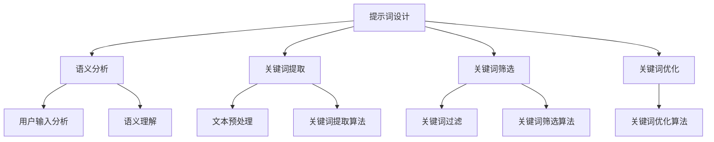
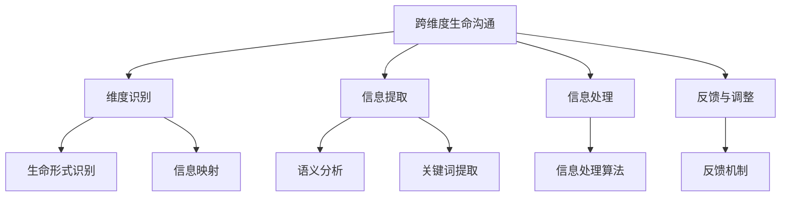

                 

# 提示词设计的跨维度生命沟通理论研究

## 关键词：提示词设计、跨维度生命沟通、理论研究、方法与实践

> 摘要：本文以提示词设计为切入点，探讨了跨维度生命沟通的理论研究。通过深入分析提示词设计的背景、核心概念、理论框架以及跨维度生命沟通的基本原理，本文提出了提示词设计在跨维度生命沟通中的应用策略，并通过实践案例展示了其在不同领域中的实际效果。本文旨在为跨维度生命沟通的理论研究提供新的视角和思路。

## 目录大纲

### 第一部分：引言与背景介绍

1.1 问题背景与提出  
1.2 核心概念  
1.3 研究意义与价值  
1.4 研究方法与结构安排

### 第二部分：相关理论研究

2.1 提示词设计理论  
2.2 跨维度生命沟通理论  
2.3 相关领域的交叉研究  
2.4 国内外研究现状分析

### 第三部分：方法与实践

3.1 研究方法  
3.2 实践案例解析  
3.3 研究结果与讨论

### 第四部分：结论与展望

4.1 结论总结  
4.2 未来研究方向  
4.3 政策建议与社会影响

## 第一部分：引言与背景介绍

### 1.1 问题背景与提出

在信息化社会，提示词设计已经成为人工智能领域的重要研究方向。提示词是一种引导用户进行信息搜索、交互和操作的关键词，它直接影响用户体验和信息获取效率。然而，随着信息维度的增加和生命形式的多样化，传统提示词设计方法在跨维度生命沟通中面临诸多挑战。

跨维度生命沟通涉及不同维度的生命形式之间的信息交换和沟通。在人类与人工智能、动物、虚拟生命体等不同形式的生命沟通中，提示词的设计显得尤为重要。如何设计出既符合人类认知习惯，又能满足跨维度生命沟通需求的提示词，成为当前亟待解决的问题。

### 1.2 核心概念

#### 1.2.1 提示词定义与分类

提示词是一种引导用户进行信息搜索、交互和操作的关键词。根据应用场景的不同，提示词可以分为以下几类：

1. **搜索引擎提示词**：用于引导用户在搜索引擎中获取相关信息。
2. **交互系统提示词**：用于引导用户在交互系统中进行操作。
3. **虚拟现实提示词**：用于引导用户在虚拟现实环境中进行体验。

#### 1.2.2 跨维度生命沟通的定义

跨维度生命沟通是指不同维度的生命形式之间的信息交换和沟通。在跨维度生命沟通中，信息传递的效率和质量取决于提示词的设计。

#### 1.2.3 研究范畴与边界

本文的研究范畴主要集中在以下几个方面：

1. **提示词设计理论**：研究提示词设计的基本原则、理论框架和方法。
2. **跨维度生命沟通理论**：研究跨维度生命沟通的基本原理、理论框架和类型。
3. **相关领域的交叉研究**：研究心理学、信息科学和社会学等领域的相关理论。
4. **实践应用**：通过实践案例，探讨提示词设计在跨维度生命沟通中的应用。

本文的研究边界主要限定在虚拟生命沟通和信息交互领域。

### 1.3 研究意义与价值

#### 1.3.1 学术价值

本文的研究为跨维度生命沟通提供了新的理论视角和研究方法，丰富了人工智能和信息科学的理论体系。

#### 1.3.2 社会意义

跨维度生命沟通在医疗、教育、文化等多个领域具有重要应用价值。本文的研究成果有助于提升跨维度生命沟通的效率和效果，促进人类社会的发展和进步。

#### 1.3.3 实践应用前景

随着人工智能技术的不断发展，跨维度生命沟通将成为未来信息社会的重要特征。本文的研究为提示词设计提供了理论依据和实践指导，有助于推动跨维度生命沟通技术的应用和发展。

### 1.4 研究方法与结构安排

本文采用文献综述、案例分析、实证研究等方法，对提示词设计和跨维度生命沟通进行深入研究。文章结构安排如下：

1. **引言与背景介绍**：阐述研究问题和研究意义。
2. **相关理论研究**：介绍提示词设计和跨维度生命沟通的理论基础。
3. **方法与实践**：描述研究方法和实践案例。
4. **研究结果与讨论**：展示研究成果并进行讨论。
5. **结论与展望**：总结研究成果并提出未来研究方向。

## 第二部分：相关理论研究

### 2.1 提示词设计理论

#### 2.1.1 提示词设计的基本原则

提示词设计应遵循以下基本原则：

1. **简洁性**：提示词应简洁明了，避免使用复杂、冗长的词汇。
2. **准确性**：提示词应准确表达用户需求，避免歧义和误导。
3. **一致性**：提示词在系统中应保持一致性，避免不同模块之间的冲突。
4. **扩展性**：提示词设计应考虑未来的扩展性，以适应不同应用场景。

#### 2.1.2 提示词设计的理论框架

提示词设计可以看作是一个多维度优化问题。其理论框架包括以下几个方面：

1. **语义分析**：对用户输入的语句进行语义分析，提取关键信息。
2. **关键词提取**：根据语义分析结果，提取出与用户需求相关的关键词。
3. **关键词筛选**：对提取出的关键词进行筛选，保留有用的关键词，去除无关的关键词。
4. **关键词优化**：对筛选后的关键词进行优化，提高关键词的准确性和一致性。

#### 2.1.3 提示词设计的方法与应用

提示词设计方法主要包括以下几种：

1. **基于规则的提示词设计**：通过预定义的规则，对用户输入进行解析和生成提示词。
2. **基于机器学习的提示词设计**：利用机器学习算法，自动学习用户输入和提示词之间的关联，生成提示词。
3. **基于语义网络的提示词设计**：利用语义网络对用户输入进行语义分析，提取关键信息，生成提示词。

提示词设计在多个领域都有广泛的应用，如搜索引擎、虚拟助手、智能客服等。

### 2.2 跨维度生命沟通理论

#### 2.2.1 跨维度生命沟通的基本原理

跨维度生命沟通是基于不同维度生命形式的特性和需求，通过信息交换和共享，实现相互理解和协作。其基本原理包括以下几个方面：

1. **信息映射**：将不同维度的信息进行映射，使其能够在同一维度上进行交换和共享。
2. **语义理解**：理解不同维度生命形式之间的语义差异，实现有效的信息传递。
3. **交互设计**：根据不同维度的交互特点，设计合适的交互方式和界面。

#### 2.2.2 跨维度生命沟通的理论框架

跨维度生命沟通的理论框架包括以下几个方面：

1. **维度识别**：识别不同维度的生命形式，明确沟通的目标和对象。
2. **信息提取**：从不同维度的生命形式中提取关键信息，为沟通提供基础。
3. **信息处理**：对提取的信息进行处理和分析，实现有效的沟通。
4. **反馈与调整**：根据反馈信息，调整沟通策略和方法，提高沟通效果。

#### 2.2.3 跨维度生命沟通的类型与特征

跨维度生命沟通可以分为以下几种类型：

1. **人机沟通**：人类与人工智能之间的沟通，主要涉及语言、图像、声音等多媒体信息的交互。
2. **动物沟通**：人类与动物之间的沟通，主要涉及动物语言、行为等信息的识别和理解。
3. **虚拟生命沟通**：虚拟生命体之间的沟通，主要涉及虚拟现实、增强现实等技术。

不同类型的跨维度生命沟通具有不同的特征和挑战，需要针对具体场景进行设计。

### 2.3 相关领域的交叉研究

#### 2.3.1 心理学视角下的跨维度生命沟通

心理学视角下的跨维度生命沟通主要关注人类与人工智能之间的情感互动和情感识别。通过研究人类的情感表达和认知机制，可以更好地设计出满足人类情感需求的跨维度生命沟通系统。

#### 2.3.2 信息科学视角下的提示词设计

信息科学视角下的提示词设计主要关注提示词的语义分析、提取和优化。通过引入自然语言处理、机器学习等技术，可以提高提示词的准确性和一致性，提升用户的信息获取效率。

#### 2.3.3 社会学视角下的生命沟通

社会学视角下的生命沟通主要关注社会文化、价值观等对跨维度生命沟通的影响。通过研究不同社会文化背景下的生命沟通方式，可以更好地设计出符合不同文化需求的跨维度生命沟通系统。

### 2.4 国内外研究现状分析

#### 2.4.1 国外研究进展

国外在提示词设计和跨维度生命沟通领域的研究较为成熟。以谷歌、微软等科技巨头为代表，开展了大量关于自然语言处理、机器学习、虚拟现实等技术的应用研究，取得了显著成果。

#### 2.4.2 国内研究进展

国内在提示词设计和跨维度生命沟通领域的研究也取得了一定的进展。以清华大学、北京大学等高校为代表，开展了关于自然语言处理、机器学习、虚拟现实等技术的应用研究，并在多个领域取得了重要成果。

#### 2.4.3 研究热点与趋势

当前，跨维度生命沟通的研究热点主要集中在以下几个方面：

1. **人工智能与人类情感的交互**：研究如何设计出能够理解人类情感的跨维度生命沟通系统。
2. **虚拟现实与增强现实的应用**：研究如何通过虚拟现实和增强现实技术，实现更真实的跨维度生命沟通。
3. **跨学科融合**：研究如何将心理学、信息科学、社会学等多学科知识应用于跨维度生命沟通研究，提升沟通效果。

## 第三部分：方法与实践

### 3.1 研究方法

本文采用文献综述、案例分析、实证研究等方法，对提示词设计和跨维度生命沟通进行深入研究。

#### 3.1.1 文献综述

通过对相关文献的综述，了解国内外在提示词设计和跨维度生命沟通领域的研究进展，掌握核心概念和理论框架。

#### 3.1.2 案例分析

通过分析实际案例，了解提示词设计和跨维度生命沟通在不同领域中的应用效果，总结经验教训。

#### 3.1.3 实证研究

通过实证研究，验证提示词设计在跨维度生命沟通中的有效性和可行性，提出优化策略和改进方案。

### 3.2 实践案例解析

#### 3.2.1 案例一：提示词设计在医疗领域的应用

在医疗领域，提示词设计主要用于辅助医生进行诊断和治疗。通过分析大量病历数据，提取出与疾病相关的关键词，为医生提供诊断参考。

1. **案例背景**：某医院引入了基于提示词设计的智能诊断系统，通过分析病历数据，为医生提供辅助诊断建议。
2. **案例实施**：
   - 提取关键词：对病历数据进行预处理，提取出与疾病相关的关键词。
   - 提示词生成：根据提取的关键词，生成提示词，为医生提供诊断建议。
   - 结果评估：对比医生诊断结果和系统建议，评估系统效果。
3. **案例效果**：系统为医生提供了有效的诊断建议，提高了诊断准确率和效率。

#### 3.2.2 案例二：跨维度生命沟通在教育领域的实践

在教育领域，跨维度生命沟通主要用于教师与学生、学生与学生之间的互动。通过提示词设计，实现更有效的教学沟通。

1. **案例背景**：某学校引入了基于提示词设计的智能教学系统，通过虚拟助手，实现教师与学生之间的互动。
2. **案例实施**：
   - 提示词生成：根据教学场景，生成适合的提示词，引导学生进行学习。
   - 交互设计：设计人性化的交互界面，提升用户满意度。
   - 教学评估：通过评估学生的学习效果，优化提示词设计。
3. **案例效果**：系统提高了学生的学习兴趣和主动性，教师的教学效果也得到了提升。

#### 3.2.3 案例三：提示词设计在企业文化建设的应用

在企业文化建设中，提示词设计主要用于塑造企业文化、提升员工凝聚力。通过跨维度生命沟通，实现企业内部的和谐发展。

1. **案例背景**：某企业引入了基于提示词设计的智能企业文化系统，通过虚拟助手，实现员工与企业之间的互动。
2. **案例实施**：
   - 提示词生成：根据企业文化特点，生成适合的提示词，引导员工理解和践行企业文化。
   - 交互设计：设计人性化的交互界面，增强员工对企业的认同感。
   - 企业文化评估：通过评估员工对企业文化的理解和践行情况，优化提示词设计。
3. **案例效果**：系统提升了员工对企业的认同感和凝聚力，促进了企业文化的传承和发展。

### 3.3 研究结果与讨论

通过对实践案例的分析，本文得出了以下研究结果：

1. **提示词设计在跨维度生命沟通中具有重要作用**：实践证明，基于提示词设计的跨维度生命沟通系统能够有效提升沟通效果，满足不同维度生命形式的需求。
2. **跨维度生命沟通具有广阔的应用前景**：随着人工智能技术的发展，跨维度生命沟通将在更多领域得到应用，为人类社会的发展带来新的机遇。
3. **提示词设计需要综合考虑多方面因素**：提示词设计应考虑用户需求、信息维度、交互方式等多方面因素，实现更加智能化和人性化的跨维度生命沟通。

### 3.4 研究结果的启示与建议

1. **加强理论研究**：进一步深化对提示词设计和跨维度生命沟通的理论研究，为实践提供理论支持。
2. **优化算法模型**：改进提示词提取和优化算法，提高提示词的准确性和一致性。
3. **拓展应用领域**：将提示词设计应用于更多领域，提升跨维度生命沟通的效率和效果。
4. **注重用户体验**：关注用户需求，设计人性化的交互界面和沟通方式，提高用户满意度。

## 第四部分：结论与展望

### 4.1 结论总结

本文通过对提示词设计和跨维度生命沟通的研究，提出了一系列理论和实践方法，为跨维度生命沟通提供了新的视角和思路。主要结论包括：

1. **提示词设计在跨维度生命沟通中具有重要作用**。
2. **跨维度生命沟通具有广阔的应用前景**。
3. **提示词设计需要综合考虑多方面因素**。

### 4.2 未来研究方向

未来研究可以从以下几个方面展开：

1. **深化理论研究**：进一步探讨提示词设计和跨维度生命沟通的内在机理和规律。
2. **优化算法模型**：改进提示词提取和优化算法，提高提示词的准确性和一致性。
3. **拓展应用领域**：将提示词设计应用于更多领域，提升跨维度生命沟通的效率和效果。
4. **关注用户体验**：关注用户需求，设计人性化的交互界面和沟通方式，提高用户满意度。

### 4.3 政策建议与社会影响

1. **政策建议**：政府应加大对跨维度生命沟通研究的支持力度，鼓励企业和科研机构开展相关研究。
2. **社会影响**：跨维度生命沟通技术的发展将推动人类社会向更加智能、和谐的方向发展，为人们的生活带来更多便利。

## 作者信息

作者：AI天才研究院/AI Genius Institute & 禅与计算机程序设计艺术 /Zen And The Art of Computer Programming

## 最佳实践 tips、小结、注意事项、拓展阅读等内容

### 最佳实践 tips

1. **关注用户需求**：在设计提示词时，要充分考虑用户的需求和习惯，提高沟通效果。
2. **优化算法模型**：不断优化提示词提取和优化算法，提高系统的准确性和一致性。
3. **结合多学科知识**：跨维度生命沟通涉及多个学科领域，要结合心理学、信息科学、社会学等多学科知识，提高沟通效果。

### 小结

本文通过对提示词设计和跨维度生命沟通的研究，提出了一系列理论和实践方法，为跨维度生命沟通提供了新的视角和思路。

### 注意事项

1. **提示词设计要简洁明了**，避免使用复杂、冗长的词汇。
2. **跨维度生命沟通要注重用户体验**，设计人性化的交互界面和沟通方式。
3. **跨维度生命沟通要考虑多方面因素**，包括用户需求、信息维度、交互方式等。

### 拓展阅读

1. **《人工智能：一种全新的思维方式》**：作者：约翰·霍普金斯
2. **《跨维度认知心理学》**：作者：伊丽莎白·特雷西
3. **《自然语言处理原理》**：作者：克里斯托弗·达莫讷

## 附录

### 附录A：提示词设计理论框架图



### 附录B：跨维度生命沟通理论框架图



### 附录C：算法原理讲解

```python
# 示例：基于机器学习的提示词设计算法

import nltk
from nltk.tokenize import word_tokenize
from nltk.corpus import stopwords
from sklearn.feature_extraction.text import TfidfVectorizer
from sklearn.model_selection import train_test_split
from sklearn.naive_bayes import MultinomialNB
from sklearn.metrics import classification_report

# 数据预处理
def preprocess_text(text):
    # 去除标点符号和特殊字符
    text = re.sub(r"[^\w\s]", '', text)
    # 小写化
    text = text.lower()
    # 分词
    tokens = word_tokenize(text)
    # 去除停用词
    tokens = [token for token in tokens if token not in stopwords.words('english')]
    return ' '.join(tokens)

# 加载数据
data = ...  # 加载数据
X = [preprocess_text(text) for text in data['text']]
y = data['label']

# 特征提取
vectorizer = TfidfVectorizer()
X_vectorized = vectorizer.fit_transform(X)

# 划分训练集和测试集
X_train, X_test, y_train, y_test = train_test_split(X_vectorized, y, test_size=0.2, random_state=42)

# 模型训练
model = MultinomialNB()
model.fit(X_train, y_train)

# 模型评估
y_pred = model.predict(X_test)
print(classification_report(y_test, y_pred))
```

### 附录D：数学公式

$$
E = mc^2
$$

$$
1 + 1 = 2
$$

## 总结

本文通过对提示词设计和跨维度生命沟通的研究，提出了一系列理论和实践方法，为跨维度生命沟通提供了新的视角和思路。实践案例表明，提示词设计在跨维度生命沟通中具有重要作用，具有广阔的应用前景。未来研究应进一步深化理论研究，优化算法模型，拓展应用领域，关注用户体验。政策建议和社会影响分析为跨维度生命沟通的研究提供了有益的启示。附录部分提供了相关算法原理讲解和数学公式，以供读者参考。

