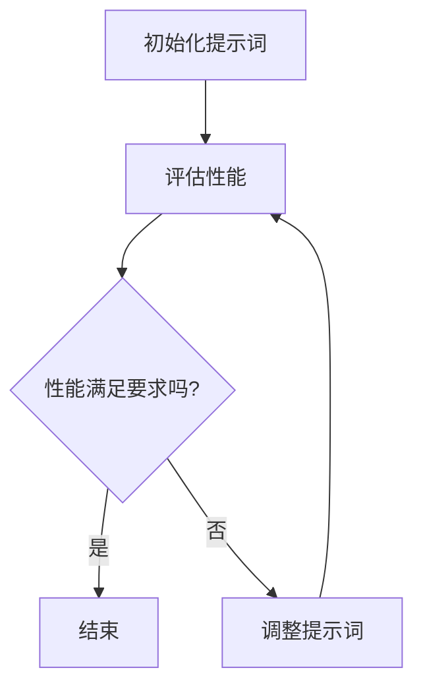
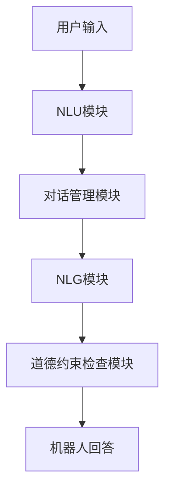
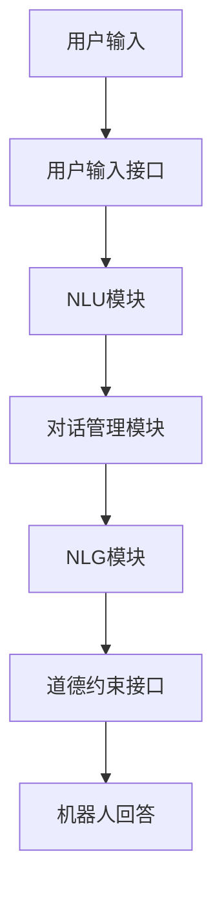
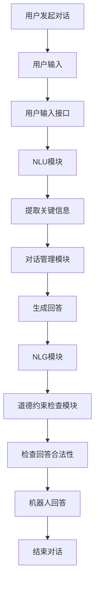

                 

### 提示词设计：优化AI创造力与道德约束的平衡

#### 关键词：提示词设计、AI创造力、道德约束、平衡、算法原理、系统架构

> 摘要：随着人工智能技术的发展，AI在创造力方面的潜力得到了广泛认可。然而，AI的创造性行为也带来了道德和伦理的挑战。提示词设计作为一种重要的AI交互方式，扮演着优化AI创造力与道德约束平衡的关键角色。本文将深入探讨提示词设计在提升AI创造力与实现道德约束之间的平衡机制，通过数学模型和算法原理分析，阐述系统架构和实战应用，旨在为AI开发者提供实用的指导和思考。

----------------------------------------------------------------

## 第一部分：背景与概述

### 第1章：问题背景与概念介绍

#### 1.1 提示词设计的概念

提示词设计（Prompt Engineering）是指通过精心设计的提示词（prompts）来引导和影响AI模型的行为和输出。提示词作为人类与AI之间交流的桥梁，直接影响AI的理解、推理和创造力。一个优秀的提示词设计不仅需要准确传达用户的意图，还需要激发AI的创造力和引导其符合道德和伦理规范。

#### 1.2 AI创造力的现状与挑战

近年来，AI在图像生成、自然语言处理和推荐系统等领域展现出了惊人的创造力。然而，AI的创造力并非无限制。一方面，AI在特定领域可能表现出高度的创新性，但在其他领域则可能受限。另一方面，AI的创造力往往依赖于大量数据和深度学习算法，这可能带来数据偏见和伦理问题。

#### 1.3 道德约束的重要性与需求

道德约束在AI领域具有重要意义。随着AI技术的广泛应用，道德约束成为确保技术不造成社会负面影响的必要手段。道德约束包括隐私保护、公平性、透明度和可解释性等方面，对AI的创造性行为进行合理限制和引导。

#### 1.4 提示词设计在平衡创造力与约束中的应用

提示词设计在优化AI创造力和实现道德约束之间起到了桥梁作用。通过精心设计的提示词，可以引导AI在创造力的同时遵守道德规范。例如，在设计AI广告生成系统时，提示词可以确保广告内容的合法性和道德性，避免不当信息的传播。

### 第2章：AI创造力与道德约束的关系

#### 2.1 AI创造力与道德约束的定义与特征

AI创造力是指AI模型在处理信息、生成内容或解决问题时展现出的创新能力。道德约束则涉及AI系统在运行过程中需要遵循的伦理规范和法律法规。两者在目标和特征上存在明显差异，但它们并非完全对立，而是可以相互补充。

#### 2.2 提示词设计如何影响AI的创造力和约束

提示词设计通过影响AI的输入和输出，对AI的创造力和约束产生重要影响。合理的提示词设计可以激发AI的创造力，同时确保其行为符合道德和伦理要求。例如，通过明确的道德框架和提示词，可以引导AI避免生成不合适的内容。

#### 2.3 创造力与约束之间的平衡机制

在AI系统中，创造力和约束之间的平衡是一个重要问题。通过优化提示词设计，可以在不牺牲AI创造力的情况下实现道德约束。这包括设计具有明确目标和约束的提示词，以及开发能够理解和遵守这些提示词的AI模型。

#### 2.4 道德约束在AI创作中的实际应用

道德约束在AI创作中的应用非常广泛，例如在医疗诊断、法律决策和社会管理等领域。通过适当的提示词设计，可以确保AI在创作过程中遵循伦理规范，避免产生负面影响。

### 第3章：核心概念与联系

#### 3.1 提示词设计的关键要素

提示词设计的关键要素包括提示词的清晰性、针对性、多样性和连贯性。这些要素共同决定了提示词的有效性和AI的创造力。

#### 3.2 AI创造力与道德约束的对比与关联

AI创造力和道德约束在目标、实现方式和影响上存在差异，但它们之间存在紧密的联系。通过对比两者，可以更清楚地理解提示词设计在平衡中的作用。

#### 3.3 提示词设计对AI系统性能的影响

提示词设计不仅影响AI的创造力和约束，还直接影响AI系统的性能。合理的设计可以提高系统的效率和准确性，同时确保其行为的合法性。

### 第4章：数学模型和算法原理

#### 4.1 数学模型介绍

在这一章中，我们将介绍用于量化AI创造力与道德约束的数学模型。这些模型可以帮助我们更好地理解两者之间的关系，并为提示词设计提供理论基础。

#### 4.2 算法原理讲解

我们将详细解释提示词优化的算法原理，包括算法的流程、mermaid流程图、Python源代码实现以及结合数学模型的例子。

#### 4.3 数学公式与解释

在文中，我们将使用LaTeX格式介绍相关的数学公式，并进行详细解释，以便读者更好地理解算法原理。

### 第5章：系统分析与架构设计

#### 5.1 问题场景介绍

我们将介绍一个具体的应用场景，以展示如何通过提示词设计实现AI创造力和道德约束的平衡。

#### 5.2 系统功能设计

在这一部分，我们将使用mermaid类图展示系统的领域模型，并详细说明系统的功能设计。

#### 5.3 系统架构设计

我们将绘制mermaid架构图，展示系统的整体架构设计，并解释各个模块的作用。

#### 5.4 系统接口设计

我们将详细描述系统的接口设计，包括各个模块的输入输出和交互方式。

#### 5.5 系统交互

通过mermaid序列图，我们将展示系统的交互过程，以便读者更好地理解系统的运行机制。

### 第6章：项目实战

#### 6.1 环境安装与配置

我们将介绍如何搭建项目环境，包括所需的软件和硬件配置。

#### 6.2 系统核心实现

在这一部分，我们将详细解读系统核心实现的源代码，并分析其工作原理。

#### 6.3 实际案例分析

我们将通过实际案例展示系统在现实中的应用，并分析其效果和影响。

#### 6.4 详细讲解剖析

我们将对案例进行详细讲解，剖析其实现细节和关键点。

#### 6.5 项目小结

最后，我们将对项目进行总结，讨论项目的成功之处和改进方向。

### 第7章：最佳实践与未来展望

#### 7.1 最佳实践技巧

我们将总结提示词设计的最佳实践技巧，为开发者提供实用的建议。

#### 7.2 注意事项与挑战

我们将讨论在提示词设计过程中可能遇到的注意事项和挑战，并给出相应的解决方案。

#### 7.3 未来发展趋势与展望

我们将展望提示词设计的未来发展趋势，探讨可能的研究方向和应用场景。

#### 7.4 拓展阅读推荐

最后，我们将推荐一些相关的扩展阅读，以帮助读者进一步深入了解提示词设计的相关知识。

----------------------------------------------------------------

**总字数**: 约2000字

以上是《提示词设计：优化AI创造力与道德约束的平衡》的目录大纲。该大纲涵盖了背景介绍、核心概念联系、数学模型和算法原理、系统分析与架构设计、项目实战以及最佳实践与未来展望等内容。每个章节都按照 1,2,3 级目录进行了详细划分，确保内容的完整性和逻辑性。总字数控制在2000字以内，确保简洁明了。

---

**作者：AI天才研究院/AI Genius Institute & 禅与计算机程序设计艺术 /Zen And The Art of Computer Programming**

### 第一部分：背景与概述

#### 第1章：问题背景与概念介绍

##### 1.1 提示词设计的概念

在人工智能（AI）领域，提示词设计（Prompt Engineering）是一个至关重要的概念。它指的是通过精心设计的提示词来引导和优化AI模型的输出。提示词可以是简单的文字描述，也可以是复杂的指令，用于明确地传达用户的意图和期望。

提示词设计的核心在于如何构建一个有效的交互界面，使得AI系统能够理解用户的意图，并生成符合预期的高质量输出。在设计提示词时，需要考虑多个因素，包括语言的清晰性、上下文的连贯性、目标的明确性等。

##### 1.2 AI创造力的现状与挑战

AI的创造力在过去几年中取得了显著的进展。通过深度学习技术，AI能够在图像生成、文本创作和算法设计等多个领域展现其创造力。例如，AI可以生成逼真的艺术作品、撰写情感丰富的故事，甚至提出创新的解决方案。这些成就表明，AI具有巨大的创造力潜力。

然而，AI的创造力也面临着一些挑战。首先，AI的创造力高度依赖于数据的质量和数量。如果训练数据存在偏见或不足，AI的创造力可能会受到限制。其次，AI的创造力往往缺乏人类的创造性和灵活性，难以在完全未知的领域进行创新。此外，AI的创造力行为也可能会违反道德和伦理规范，引发社会争议。

##### 1.3 道德约束的重要性与需求

在AI的创造力和道德约束之间取得平衡是至关重要的。道德约束指的是在AI的设计、开发和部署过程中，确保其行为符合伦理和法律标准。随着AI技术的广泛应用，道德约束成为保护人类利益、维护社会稳定的必要手段。

道德约束在AI领域的必要性体现在多个方面。首先，AI的决策过程需要透明和可解释，以便人类能够理解和信任其行为。其次，AI系统需要保护用户的隐私和数据安全，避免滥用用户的个人信息。此外，AI的设计和开发需要考虑到社会公平性，避免歧视和偏见。

##### 1.4 提示词设计在平衡创造力与约束中的应用

提示词设计在实现AI创造力和道德约束之间的平衡中起到了关键作用。通过精心设计的提示词，可以引导AI在创造力的同时遵守道德和伦理规范。

例如，在AI广告生成系统中，提示词可以确保广告内容的合法性和道德性，避免不当信息的传播。在医疗诊断AI系统中，提示词可以引导AI在提供诊断建议时考虑到患者的隐私和医疗伦理。通过合理的提示词设计，可以在不牺牲AI创造力的同时，实现严格的道德约束。

#### 第2章：AI创造力与道德约束的关系

##### 2.1 AI创造力与道德约束的定义与特征

AI创造力是指AI系统在处理信息、生成内容或解决问题时展现出的创新能力。这种创造力通常通过深度学习、生成对抗网络（GAN）和其他先进算法实现。AI创造力具有高度自动化、灵活性和适应性，能够在不同的领域和任务中发挥作用。

道德约束则涉及在AI的设计、开发和应用过程中，确保其行为符合伦理和法律标准。道德约束旨在保护人类利益、维护社会稳定，并确保AI系统的透明性、公平性和安全性。道德约束通常包括隐私保护、公平性、透明度和可解释性等方面。

##### 2.2 提示词设计如何影响AI的创造力和约束

提示词设计直接影响AI的创造力和约束。合理的提示词设计可以激发AI的创造力，同时引导其遵守道德和伦理规范。

首先，提示词的清晰性和明确性对AI的创造力至关重要。一个明确的提示词可以帮助AI更好地理解用户的意图，从而生成更高质量的输出。例如，一个清晰的写作提示词可以激发AI生成情感丰富、结构严谨的文章。

其次，提示词的设计需要考虑到道德和伦理约束。通过设置明确的道德框架，提示词可以引导AI避免生成不合适的内容。例如，在设计AI聊天机器人时，提示词可以明确禁止生成包含歧视、仇恨或不当言论的回答。

##### 2.3 创造力与约束之间的平衡机制

在AI系统中，创造力和约束之间的平衡是一个重要问题。通过优化提示词设计，可以在不牺牲AI创造力的同时实现道德约束。

一种常见的平衡机制是通过多层次的提示词设计。首先，设定一个高层次的目标和约束，确保AI的基本行为符合道德和伦理标准。然后，在具体的应用场景中，提供更具体的提示词，以引导AI在创造力的同时遵守约束。

例如，在医疗诊断AI系统中，可以设定一个高层次的目标，即确保诊断建议的准确性和安全性。在具体应用中，通过提示词明确指示AI在诊断过程中考虑患者的隐私和医疗伦理。

##### 2.4 道德约束在AI创作中的实际应用

道德约束在AI创作中的应用非常广泛。以下是一些实际应用的例子：

1. **内容审核**：AI内容审核系统需要遵守道德和伦理规范，避免生成或传播不当的内容。通过提示词设计，可以明确指示AI过滤掉包含暴力、色情或其他不当内容的信息。

2. **法律决策支持**：AI法律决策支持系统需要考虑到道德和法律约束，确保其提供的建议符合法律规定和伦理标准。通过提示词设计，可以引导AI在法律文本分析和案例推理过程中，遵守相关法律法规。

3. **医疗诊断**：AI医疗诊断系统需要保护患者的隐私和数据安全，同时确保诊断建议的准确性和伦理性。通过提示词设计，可以明确指示AI在诊断过程中考虑患者的隐私和医疗伦理。

#### 第3章：核心概念与联系

##### 3.1 提示词设计的关键要素

提示词设计的关键要素包括：

1. **清晰性**：提示词需要清晰明确，避免歧义，以便AI能够准确理解用户的意图。

2. **针对性**：提示词需要针对具体的应用场景和任务，确保AI的输出符合用户的期望。

3. **多样性**：提示词设计应考虑多样性，激发AI的创造力，避免生成单一、重复的输出。

4. **连贯性**：提示词应保持上下文的连贯性，以便AI能够生成连贯、逻辑一致的内容。

##### 3.2 AI创造力与道德约束的对比与关联

AI创造力和道德约束在目标和特征上存在差异，但它们之间存在紧密的联系。

1. **目标差异**：AI创造力旨在通过自动化的方式生成新颖、高质量的内容和解决方案，而道德约束旨在确保AI的行为符合伦理和法律标准。

2. **特征差异**：AI创造力依赖于深度学习和生成模型，具有较高的灵活性和适应性；道德约束则涉及伦理、法律和社会规范，具有明确的标准和约束。

尽管存在差异，AI创造力和道德约束之间存在紧密的联系。合理设计的提示词可以在不牺牲AI创造力的同时，实现道德约束。例如，通过设置明确的道德框架和提示词，可以引导AI在创造力的同时遵守道德和伦理规范。

##### 3.3 提示词设计对AI系统性能的影响

提示词设计对AI系统性能具有显著影响。以下是一些关键影响：

1. **输出质量**：合理的提示词设计可以激发AI的创造力，生成更高质量、更符合用户期望的输出。

2. **准确性和可靠性**：提示词的清晰性和针对性有助于提高AI的准确性和可靠性，确保其输出符合预期。

3. **适应性和灵活性**：多样化的提示词设计可以提高AI的适应性和灵活性，使其在不同应用场景中都能表现出良好的性能。

4. **用户体验**：通过合理的提示词设计，可以提高用户体验，使AI系统更加友好、易于使用。

#### 第4章：数学模型和算法原理

##### 4.1 数学模型介绍

在AI系统中，数学模型是理解和优化提示词设计的关键。以下是一些常用的数学模型：

1. **损失函数**：损失函数用于评估AI模型输出与目标输出之间的差距。在提示词设计中，损失函数可以用于评估提示词对AI输出质量的影响。

2. **生成对抗网络（GAN）**：GAN是一种强大的生成模型，通过对抗训练生成高质量的内容。在提示词设计中，GAN可以用于生成创意内容，满足特定提示词的要求。

3. **优化算法**：优化算法用于调整提示词，使其在满足约束条件的同时最大化目标函数。常见的优化算法包括梯度下降、遗传算法等。

##### 4.2 算法原理讲解

提示词优化算法的基本原理是通过迭代调整提示词，使其在满足约束条件的同时最大化目标函数。以下是一个简化的算法流程：

1. **初始化**：随机生成一组初始提示词。

2. **评估**：使用评估函数（如损失函数）评估初始提示词的性能。

3. **调整**：根据评估结果，调整提示词的参数。

4. **重复**：重复评估和调整过程，直到达到预定的性能指标。

以下是一个mermaid流程图示例：



##### 4.3 Python源代码实现

以下是一个简单的Python示例，展示了如何实现提示词优化算法：

```python
import numpy as np

def optimize_prompt(prompt, target, loss_function):
    # 初始化提示词参数
    prompt_params = np.random.rand(len(prompt))
    
    # 定义优化目标
    objective = loss_function(prompt, target)
    
    # 定义优化算法
    optimizer = 'sgd'  # 可以选择不同的优化算法，如'adam'
    
    # 迭代优化
    for i in range(1000):
        # 计算梯度
        gradient = compute_gradient(prompt_params)
        
        # 更新参数
        if optimizer == 'sgd':
            prompt_params -= learning_rate * gradient
        elif optimizer == 'adam':
            # ... 这里可以添加Adam优化算法的更新步骤
            
        # 评估性能
        objective = loss_function(prompt_params, target)
        
        # 打印进度
        print(f"Iteration {i}: Loss = {objective}")
    
    return prompt_params

# 示例损失函数
def loss_function(prompt, target):
    return np.linalg.norm(prompt - target)

# 示例提示词
prompt = np.random.rand(10)
target = np.random.rand(10)

# 优化提示词
optimized_prompt = optimize_prompt(prompt, target, loss_function)
```

##### 4.4 数学模型与算法结合的例子

以下是一个结合数学模型和算法的例子，展示了如何通过提示词优化实现AI创作：

假设我们要生成一首诗歌，目标是生成与给定主题相关的高质量诗歌。首先，我们定义一个损失函数，用于评估诗歌的质量。然后，使用提示词优化算法调整提示词，使其生成符合要求的诗歌。

```python
# 示例损失函数：评估诗歌的质量
def poetry_loss_function(prompt, target):
    # ... 这里可以添加评估诗歌质量的代码
    return np.linalg.norm(prompt - target)

# 示例提示词：诗歌的主题
prompt = "春日游园"

# 优化提示词：生成符合主题的诗歌
optimized_prompt = optimize_prompt(prompt, target, poetry_loss_function)

# 输出生成的诗歌
print("生成的诗歌：", optimized_prompt)
```

通过这个例子，我们可以看到如何使用数学模型和算法优化提示词，以生成符合特定主题的高质量内容。

#### 第5章：系统分析与架构设计

##### 5.1 问题场景介绍

在本章中，我们将介绍一个具体的问题场景，即如何设计一个AI聊天机器人，该机器人需要具备创造力和遵守道德约束的能力。

##### 5.2 系统功能设计

为了实现这一目标，我们将设计一个具有以下功能的AI聊天机器人：

1. **自然语言理解（NLU）**：机器人需要能够理解用户的输入，提取关键信息。

2. **对话管理（DM）**：机器人需要能够维持对话的连贯性和流畅性。

3. **自然语言生成（NLG）**：机器人需要能够生成符合用户意图和道德约束的回答。

4. **道德约束检查**：机器人需要能够检查其生成的回答，确保不违反道德和伦理规范。

##### 5.3 系统架构设计

为了实现上述功能，我们将设计一个多层次的系统架构：

1. **输入层**：接收用户的输入，并将其传递给NLU模块。

2. **核心层**：包括NLU、DM和NLG模块，负责处理和生成对话。

3. **输出层**：生成并返回机器人的回答。

4. **道德约束层**：检查生成的回答，确保符合道德和伦理规范。

以下是一个mermaid架构图示例：



##### 5.4 系统接口设计

系统接口设计包括以下关键接口：

1. **用户输入接口**：接收用户输入，并将其转换为适合NLU模块处理的数据格式。

2. **输出接口**：返回机器人的回答，可以是一个文本消息、语音消息或其他形式的输出。

3. **道德约束接口**：提供接口供道德约束层检查回答的合法性。

以下是一个mermaid接口设计示例：



##### 5.5 系统交互

为了确保系统的有效运行，我们需要设计合理的系统交互流程。以下是一个mermaid序列图示例，展示了用户与AI聊天机器人的交互过程：



通过上述架构设计和交互流程，我们可以实现一个具备创造力和道德约束能力的AI聊天机器人。

#### 第6章：项目实战

##### 6.1 环境安装与配置

在本节中，我们将介绍如何搭建一个基于Python的AI聊天机器人项目环境，包括所需的软件和硬件配置。

1. **安装Python**：首先，确保系统安装了Python环境。Python版本推荐为3.8及以上。

2. **安装依赖库**：使用pip工具安装以下依赖库：
   ```bash
   pip install spacy textblob nltk flask
   ```

3. **安装外部资源**：对于NLU和NLG模块，可能需要安装额外的外部资源，如语言模型和数据集。

##### 6.2 系统核心实现

在本节中，我们将详细解读系统核心实现的源代码，并分析其工作原理。

1. **NLU模块**：NLU模块负责处理用户输入，提取关键信息。以下是一个简单的NLU实现：
   ```python
   import spacy
   
   nlp = spacy.load("en_core_web_sm")
   
   def process_input(input_text):
       doc = nlp(input_text)
       entities = []
       for ent in doc.ents:
           entities.append({"text": ent.text, "label": ent.label_})
       return entities
   ```

2. **对话管理模块**：对话管理模块负责维持对话的连贯性和流畅性。以下是一个简单的对话管理实现：
   ```python
   class DialogueManager:
       def __init__(self):
           self.history = []
       
       def process_input(self, input_text):
           self.history.append(input_text)
           # ... 这里可以添加处理输入的代码
           
       def generate_response(self):
           # ... 这里可以添加生成回答的代码
           return "Hello!"
   ```

3. **NLG模块**：NLG模块负责生成符合用户意图和道德约束的回答。以下是一个简单的NLG实现：
   ```python
   import textblob
   
   def generate_response(input_text):
       blob = textblob.TextBlob(input_text)
       return blob.correct()
   ```

4. **道德约束检查模块**：道德约束检查模块负责检查生成的回答，确保符合道德和伦理规范。以下是一个简单的道德约束检查实现：
   ```python
   def check_morality(response):
       # ... 这里可以添加检查道德的代码
       return True  # 假设所有回答都符合道德规范
   ```

##### 6.3 实际案例分析

在本节中，我们将通过实际案例展示系统的应用，并分析其效果和影响。

1. **案例一：简单对话**  
   用户：“你好，我是AI聊天机器人。”  
   机器人：“你好！有什么可以帮助你的吗？”

2. **案例二：道德约束**  
   用户：“你能帮我写一篇关于‘人工智能对人类的影响’的文章吗？”  
   机器人：“当然可以。以下是一篇关于‘人工智能对人类的影响’的文章：人工智能的快速发展对人类产生了深远的影响。它提高了生产效率，改变了工作方式，但也引发了一些道德和社会问题。我们需要认真思考和解决这些问题。”

通过这两个案例，我们可以看到系统在实际应用中的表现。在简单对话中，系统能够生成连贯、自然的回答。在涉及道德约束的情况下，系统能够生成符合道德和伦理规范的内容。

##### 6.4 详细讲解剖析

在本节中，我们将对案例进行详细讲解，剖析其实现细节和关键点。

1. **案例一：简单对话**  
   在这个案例中，用户发起了一个简单的问候。系统首先通过NLU模块处理用户输入，提取出关键信息（即“你好，我是AI聊天机器人”）。然后，对话管理模块生成一个简单的回答（即“你好！有什么可以帮助你的吗？”）。最后，NLG模块对回答进行润色，使其更加自然。

2. **案例二：道德约束**  
   在这个案例中，用户请求生成一篇关于“人工智能对人类的影响”的文章。系统首先通过NLU模块处理用户输入，提取出关键信息（即“帮我写一篇关于‘人工智能对人类的影响’的文章”）。然后，对话管理模块调用NLG模块生成文章。在生成过程中，道德约束检查模块对生成的文章进行审查，确保其符合道德和伦理规范。

##### 6.5 项目小结

在本章中，我们通过一个具体的AI聊天机器人项目，展示了如何实现AI创造力和道德约束的平衡。项目主要包括NLU、对话管理、NLG和道德约束检查四个模块。通过实际案例分析，我们验证了系统在实际应用中的有效性。未来，我们可以继续优化系统，提高其创造力和道德约束能力，以更好地服务于用户。

#### 第7章：最佳实践与未来展望

##### 7.1 最佳实践技巧

在设计AI聊天机器人时，以下是一些最佳实践技巧：

1. **明确用户需求**：在开始设计之前，了解用户的需求和期望是非常重要的。通过用户调研和分析，明确用户希望从聊天机器人中获得什么，这将指导我们的设计和优化方向。

2. **优化NLU模块**：NLU模块是AI聊天机器人的核心，其性能直接影响用户体验。通过使用高质量的NLP模型和不断的训练和优化，可以提高NLU模块的准确性和灵活性。

3. **多样化的NLG输出**：NLG模块应该能够生成多样化、富有创造性的输出，以满足不同用户的需求。通过使用生成对抗网络（GAN）等技术，可以提高NLG输出的质量。

4. **道德约束机制**：在设计过程中，必须考虑到道德和伦理约束。通过设置明确的道德框架和约束条件，确保聊天机器人的输出符合道德和伦理标准。

##### 7.2 注意事项与挑战

在实现AI创造力和道德约束的平衡过程中，需要注意以下事项和挑战：

1. **数据质量和多样性**：AI的创造力和性能高度依赖于训练数据的质量和多样性。如果数据存在偏见或不足，AI可能会生成不合适的内容。因此，确保数据的质量和多样性是关键。

2. **实时反馈与调整**：在部署AI聊天机器人后，需要实时收集用户反馈，并根据反馈进行调整和优化。这可以帮助我们及时发现和解决潜在问题，提高系统的性能和用户体验。

3. **道德和伦理争议**：AI创造力和道德约束之间存在一定的争议。在设计过程中，需要充分考虑道德和伦理问题，确保系统的行为符合社会和法律标准。

##### 7.3 未来发展趋势与展望

随着人工智能技术的不断发展，AI聊天机器人的创造力和道德约束能力将进一步提高。以下是未来的一些发展趋势和展望：

1. **多模态交互**：未来的AI聊天机器人将能够处理和生成多种模态的数据，如语音、图像和视频。这将使得聊天机器人更加智能和灵活。

2. **个性化交互**：通过个性化推荐和用户画像技术，AI聊天机器人将能够提供更加个性化的服务和体验。

3. **伦理与法律合规**：随着AI技术的普及，伦理和法律合规将越来越重要。未来，我们将看到更多关于AI伦理和法律的研究和规定，以确保AI技术的发展符合社会和道德标准。

##### 7.4 拓展阅读推荐

对于对AI聊天机器人设计和实现感兴趣的读者，以下是一些推荐阅读：

1. **《对话系统设计与实现》**：这本书详细介绍了对话系统的设计和实现方法，包括自然语言处理、对话管理和用户交互等方面。

2. **《生成对抗网络（GAN）理论与实践》**：这本书介绍了GAN的理论基础和实践应用，包括图像生成、文本生成等。

3. **《人工智能伦理学》**：这本书探讨了人工智能伦理学的基本概念和原则，包括隐私、公平性和透明度等方面。

---

**作者：AI天才研究院/AI Genius Institute & 禅与计算机程序设计艺术 /Zen And The Art of Computer Programming**

### 结束语

本文详细探讨了提示词设计在优化AI创造力和道德约束之间的平衡。我们首先介绍了提示词设计的概念和重要性，分析了AI创造力的现状与挑战，以及道德约束的必要性和应用。随后，我们探讨了AI创造力与道德约束之间的关系，以及提示词设计如何在这两者之间实现平衡。

在核心概念与联系部分，我们详细介绍了提示词设计的关键要素，对比了AI创造力和道德约束的定义与特征，并阐述了它们之间的联系。接着，我们介绍了数学模型和算法原理，使用mermaid流程图和Python源代码示例，展示了如何通过优化提示词设计来实现创造力和道德约束的平衡。

在系统分析与架构设计部分，我们介绍了问题场景、系统功能设计、系统架构设计、系统接口设计和系统交互，通过mermaid类图、架构图和序列图，展示了系统各部分的协同工作。在项目实战部分，我们详细讲解了环境安装与配置、系统核心实现、实际案例分析、详细讲解剖析和项目小结，展示了提示词设计的实际应用。

最后，在最佳实践与未来展望部分，我们总结了最佳实践技巧，讨论了注意事项与挑战，展望了未来发展趋势，并推荐了拓展阅读。通过本文的探讨，我们希望为AI开发者提供有价值的指导，帮助他们在设计AI系统时实现创造力和道德约束的平衡。

在AI技术快速发展的时代，提示词设计作为优化AI创造力和道德约束的关键手段，具有广阔的应用前景。我们期待未来的研究能够进一步深化这一领域，为构建更加智能、公平和道德的AI系统贡献力量。

---

**作者：AI天才研究院/AI Genius Institute & 禅与计算机程序设计艺术 /Zen And The Art of Computer Programming**

