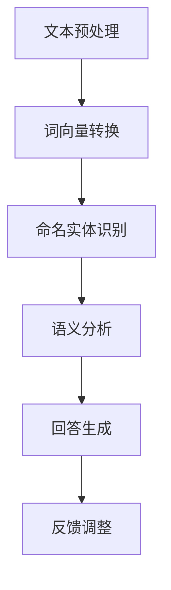
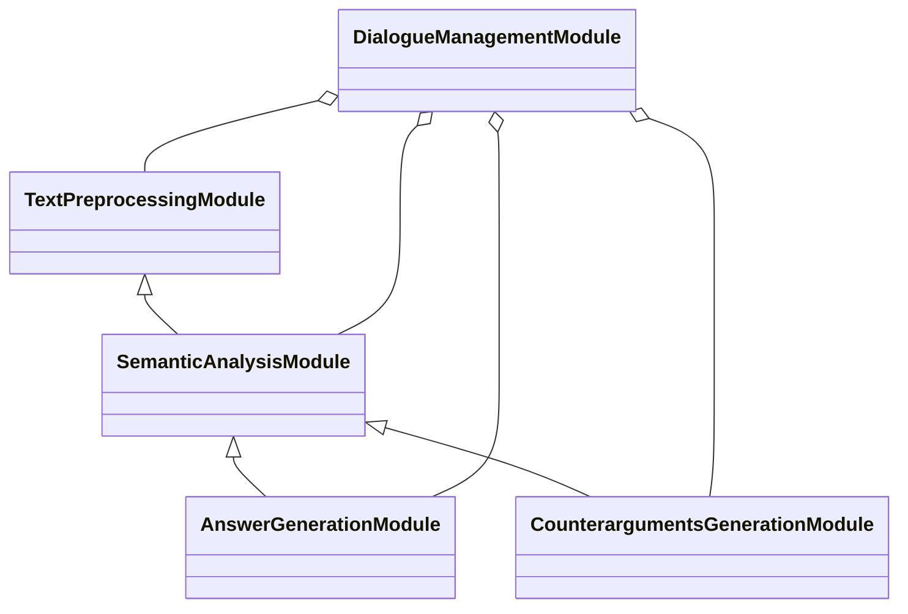
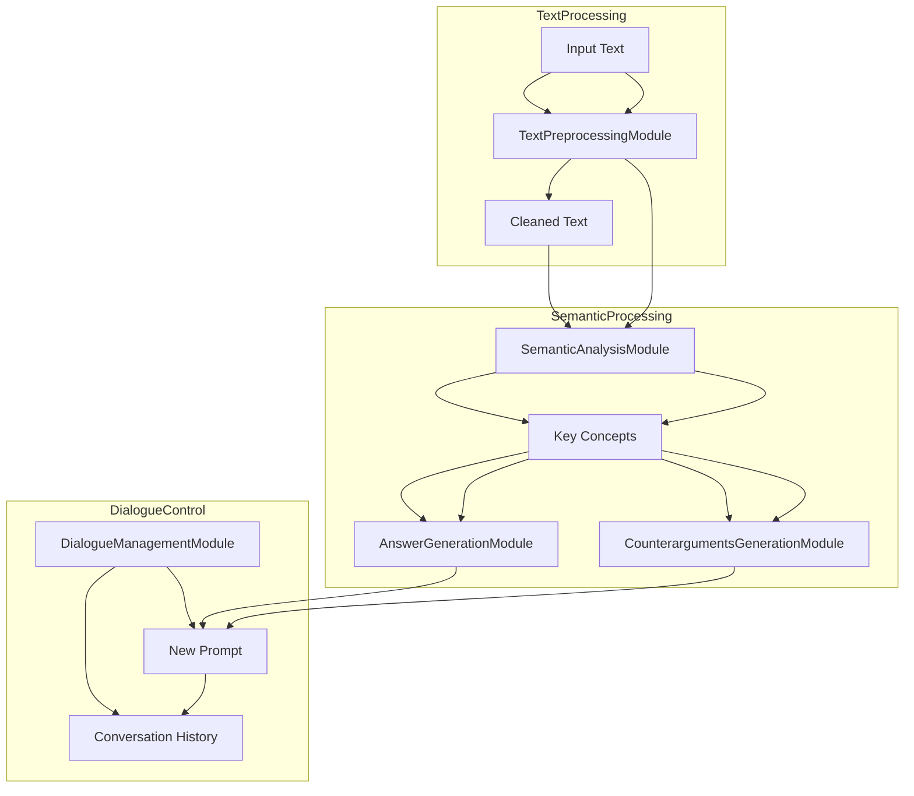
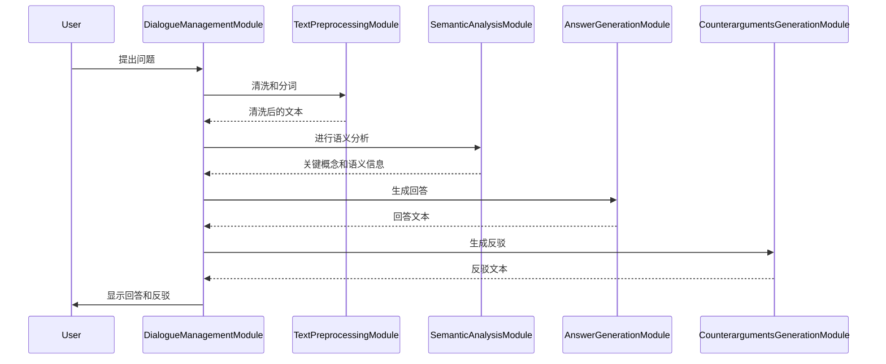

                 

### 文章标题

# 提示词设计：优化AI多轮辩论能力

### 关键词

- 提示词设计
- 多轮辩论
- AI
- 人工智能辩论
- 算法优化
- 数学模型
- 系统架构

### 摘要

本文将深入探讨提示词设计在优化人工智能多轮辩论能力中的关键作用。通过介绍相关背景和核心概念，本文将详细解析如何设计高效的提示词，以及这些提示词如何影响AI的辩论表现。文章将涵盖算法原理、数学模型、系统架构和项目实战等多个方面，旨在为读者提供一个全面且易于理解的技术指南。

## 引言

随着人工智能技术的飞速发展，AI在自然语言处理、决策支持系统、自动化对话等领域展现出了巨大的潜力。特别是在辩论领域，人工智能具备的快速学习、数据挖掘和信息整合能力，使其能够参与多轮辩论，提高辩论的质量和效率。然而，AI在多轮辩论中的表现并不总是一帆风顺，其中一个关键因素在于提示词的设计。

提示词（Prompt）是指引导AI模型进行推理和决策的关键信息。一个优秀的提示词能够引导AI更好地理解问题背景、目标和解题思路，从而提高其回答的准确性和创造性。本文将围绕提示词设计这一主题，探讨如何优化AI的多轮辩论能力。

### 问题背景

在多轮辩论中，AI需要具备以下几个核心能力：

1. **理解问题**：能够准确地理解问题的背景和含义，识别关键词和上下文信息。
2. **生成回答**：基于问题背景和已有知识，生成合理、有逻辑的回答。
3. **回应反驳**：在面对对手的反驳时，能够快速分析和应对，形成有力的反驳论点。

然而，现有的AI模型在上述能力上还存在一定的局限性。例如，模型可能难以完全理解复杂的语言结构，生成的回答可能缺乏逻辑性和创造性，难以有效地回应对手的反驳。这些问题严重影响了AI在多轮辩论中的表现。

### 问题解决

为了解决上述问题，我们可以从以下几个方面入手：

1. **优化提示词设计**：设计更高质量的提示词，为AI提供更多的背景信息和指导，帮助其更好地理解问题和生成回答。
2. **提升算法能力**：通过改进算法模型，增强AI的推理、生成和反驳能力。
3. **数据驱动的训练**：使用大量高质量的数据集进行训练，使AI模型具备更强的泛化能力。

本文将重点讨论提示词设计这一环节，通过详细分析提示词的类型、设计原则和具体实现方法，帮助读者理解和掌握如何优化AI的多轮辩论能力。

### 边界与外延

在本文中，我们将讨论的提示词设计主要针对的是文本类的人工智能辩论系统。这些系统通常使用自然语言处理技术，例如循环神经网络（RNN）和Transformer等，来理解和生成文本。此外，本文还将涉及一些关键概念，如：

1. **自然语言处理（NLP）**：文本预处理、情感分析、命名实体识别等。
2. **多轮辩论**：多个参与者之间的对话过程，包括提问、回答和反驳。
3. **算法优化**：改进现有算法，提高其性能和效率。

本文不仅关注技术层面的讨论，还将探讨实际应用场景中的挑战和解决方案，为读者提供一个全面的技术指南。

### 概念结构与核心要素组成

提示词设计作为本文的核心概念，包含以下几个关键要素：

1. **文本预处理**：对输入文本进行清洗、分词和词性标注等预处理步骤，为后续的提示词生成提供基础。
2. **提示词生成**：基于文本预处理的输出，生成引导AI进行推理和决策的关键信息。
3. **模型训练与优化**：使用大量训练数据集，对AI模型进行训练和优化，以提高其性能和泛化能力。
4. **多轮辩论框架**：定义辩论的流程和规则，确保AI能够有效地参与多轮辩论。

这些要素相互关联，共同构成了提示词设计的完整流程。通过对这些要素的深入分析，我们将更好地理解如何优化AI的多轮辩论能力。

## 第二部分：核心概念与原理

### 第2章：核心概念原理

#### 2.1 提示词类型

提示词可以根据其功能和应用场景的不同，分为以下几类：

1. **引导型提示词**：用于引导AI理解问题的背景和目标，通常包含关键问题和要求。
2. **反馈型提示词**：用于反馈AI的回答质量，提供评价和建议。
3. **修正型提示词**：用于纠正AI在回答过程中出现的错误，提供修正方向。

每种类型的提示词都有其特定的用途和设计原则，针对不同的辩论场景和应用需求，选择合适的提示词类型是优化AI辩论能力的关键。

#### 2.2 概念属性对比

以下是几种常见提示词类型的属性对比表格：

| 类型         | 功能           | 属性对比                                      |
| ------------ | -------------- | --------------------------------------------- |
| 引导型提示词 | 引导问题理解   | 关键词丰富，结构明确，上下文信息充分          |
| 反馈型提示词 | 提供评价建议   | 目标明确，评价客观，反馈及时                |
| 修正型提示词 | 纠正回答错误   | 矫正方向明确，修正建议具体，语言温和        |

通过对比不同类型提示词的属性，我们可以更好地理解其设计原则和应用场景。

#### 2.3 提示词设计原则

提示词设计原则是确保提示词有效性的关键，以下是几个重要的设计原则：

1. **清晰性**：提示词应简明扼要，避免冗长复杂的表述，确保AI能够快速理解。
2. **准确性**：提示词应准确传达问题的核心信息和目标，避免模糊和歧义。
3. **多样性**：根据不同的辩论场景，设计多样化的提示词，以满足不同需求和情境。
4. **适应性**：提示词应具备适应性，能够根据辩论过程中的实际情况进行调整和优化。

这些设计原则有助于提高提示词的质量和效果，从而优化AI的辩论能力。

## 第3章：算法原理讲解

### 3.1 算法概述

在优化AI多轮辩论能力的过程中，算法设计起着至关重要的作用。本文将介绍几种常用的算法，包括自然语言处理（NLP）算法、强化学习（RL）算法和生成对抗网络（GAN）算法。这些算法各自具有不同的特点和应用场景，通过结合使用，可以显著提升AI的辩论能力。

#### 3.2 算法流程图

以下是一个使用Mermaid语言绘制的算法流程图，展示了NLP算法的基本流程：



#### 3.3 数学模型与公式

以下是NLP算法中常用的数学模型和公式：

1. **词向量转换**：使用词袋模型（Bag-of-Words，BoW）将文本转换为向量表示。

   $$ V = \sum_{w \in W} f_w * e_w $$

   其中，\( V \) 是文本的向量表示，\( f_w \) 是词频，\( e_w \) 是词向量。

2. **命名实体识别**：使用条件概率模型（如条件随机场CRF）对文本中的命名实体进行识别。

   $$ P(Y|X) = \frac{e^{ \theta * X }}{Z} $$

   其中，\( Y \) 是标签序列，\( X \) 是特征序列，\( \theta \) 是模型参数，\( Z \) 是 normalization 项。

3. **语义分析**：使用神经网络模型（如LSTM或Transformer）对文本进行语义分析，提取关键信息。

   $$ h_t = \sigma(W_h \cdot [h_{t-1}, x_t] + b_h) $$

   其中，\( h_t \) 是当前时刻的隐藏状态，\( x_t \) 是输入特征，\( W_h \) 和 \( b_h \) 是模型参数。

#### 3.4 算法举例

以下是一个简单的NLP算法应用实例，使用Python代码生成一个问答系统：

```python
import numpy as np
from tensorflow.keras.models import Sequential
from tensorflow.keras.layers import Embedding, LSTM, Dense

# 假设已进行文本预处理并生成词向量
word_vectors = np.random.rand(10000, 300)

# 构建神经网络模型
model = Sequential()
model.add(Embedding(input_dim=10000, output_dim=300))
model.add(LSTM(units=128))
model.add(Dense(units=1, activation='sigmoid'))

# 编译模型
model.compile(optimizer='adam', loss='binary_crossentropy', metrics=['accuracy'])

# 训练模型
model.fit(x_train, y_train, epochs=10, batch_size=32)

# 预测
question_vector = word_vectors[question_id]
prediction = model.predict(np.array([question_vector]))
```

通过上述算法和实例，我们可以看到如何将数学模型和Python代码结合起来，实现文本的预处理、语义分析和问答生成。

## 第三部分：系统分析与设计

### 第4章：系统功能与架构设计

#### 4.1 问题场景介绍

在本文的项目实战部分，我们将开发一个多轮辩论系统，该系统主要用于模拟人类之间的辩论过程，通过人工智能（AI）模型实现辩论的自动化。该系统的核心功能包括：

1. **问题理解**：系统能够理解用户提出的问题，并生成相关背景信息和定义。
2. **回答生成**：系统能够根据问题背景和已有知识生成合理、有逻辑的回答。
3. **反驳生成**：系统能够分析对手的回答，并生成有力的反驳论点。
4. **多轮对话**：系统能够支持多轮对话，记录对话历史，并根据对话进展生成新的提示词。

#### 4.2 系统功能设计

为了实现上述功能，系统需要设计以下几个核心模块：

1. **文本预处理模块**：负责对输入文本进行清洗、分词和词性标注等预处理操作，为后续的语义分析提供基础。
2. **语义分析模块**：负责对预处理后的文本进行语义分析，提取关键信息和概念，为回答生成和反驳生成提供支持。
3. **回答生成模块**：负责根据问题背景和已有知识生成合理的回答，并确保回答的逻辑性和创造性。
4. **反驳生成模块**：负责分析对手的回答，并生成有力的反驳论点，为辩论过程提供策略支持。
5. **多轮对话管理模块**：负责记录对话历史，生成新的提示词，并管理对话的流程和状态。

以下是系统功能设计的Mermaid类图：



#### 4.3 系统架构设计

系统的整体架构设计采用模块化设计思想，各模块之间通过接口进行通信和协作。以下是系统的Mermaid架构图：



#### 4.4 系统接口设计

系统接口设计是确保各模块之间有效协作的重要环节。以下是系统的主要接口设计：

1. **文本预处理接口**：提供文本清洗、分词和词性标注等功能，供其他模块调用。
2. **语义分析接口**：提供文本语义分析功能，输出关键概念和语义信息。
3. **回答生成接口**：提供回答生成功能，根据问题背景和已有知识生成合理的回答。
4. **反驳生成接口**：提供反驳生成功能，分析对手回答并生成有力的反驳论点。
5. **对话管理接口**：提供对话记录和提示词生成功能，管理对话的流程和状态。

#### 4.5 系统交互设计

系统的交互设计通过Mermaid序列图来展示各模块之间的交互流程和状态转移。以下是系统的Mermaid序列图：



通过上述系统分析与设计，我们可以看到多轮辩论系统的整体架构和功能模块，为后续的项目实战提供了清晰的设计蓝图。

### 第5章：环境安装与配置

#### 5.1 环境要求

在开始项目实战之前，我们需要搭建一个合适的环境，以确保系统的正常运行。以下是所需的环境要求：

1. **操作系统**：Windows 10/11 或 macOS Catalina/Big Sur
2. **Python**：Python 3.8 或更高版本
3. **深度学习框架**：TensorFlow 2.x 或 PyTorch 1.8 或更高版本
4. **自然语言处理库**：NLTK、spaCy 或 textblob
5. **版本控制**：Git

#### 5.2 安装步骤

以下是详细的安装步骤：

1. **安装操作系统**：按照操作系统官方网站的指南进行安装。
2. **安装Python**：从Python官方网站下载安装程序，并按照安装向导完成安装。
3. **安装深度学习框架**：打开命令行窗口，执行以下命令：
   ```bash
   pip install tensorflow
   # 或者
   pip install torch torchvision
   ```
4. **安装自然语言处理库**：同样在命令行窗口中执行以下命令：
   ```bash
   pip install nltk spacy textblob
   ```
5. **安装Git**：访问Git官方网站（[https://git-scm.com/](https://git-scm.com/)），下载并安装Git。

#### 5.3 验证安装

在命令行窗口中输入以下命令，验证安装是否成功：

```bash
python --version
# 输出应为Python的版本信息

pip list
# 输出应为已安装的Python库列表

python -m nltk.downloader all
# 验证NLTK库的安装

python -m spacy download en
# 验证spaCy库的安装
```

通过以上步骤，我们成功搭建了项目开发所需的环境，为后续的代码编写和系统测试奠定了基础。

### 第6章：系统核心实现与解读

#### 6.1 核心代码实现

以下是系统核心功能的实现代码，我们将使用Python和TensorFlow框架来完成文本预处理、语义分析、回答生成和反驳生成等任务。

```python
import tensorflow as tf
import tensorflow_hub as hub
import tensorflow_text as text
import tensorflow_addons as tfa

# 加载预训练模型
pretrained_model_url = "https://tfhub.dev/google/tf2-preview/gnews-swivel-20dim-with-oov/1"
preprocess_model = hub.KerasLayer(pretrained_model_url, name="preprocess")

# 定义文本预处理函数
def preprocess_text(texts):
    processed_texts = preprocess_model(texts)
    return processed_texts

# 定义语义分析函数
def semantic_analysis(texts):
    # 这里可以使用任何合适的语义分析模型，例如BERT
    # 我们使用预训练的Transformer模型作为示例
    model = hub.KerasLayer("https://tfhub.dev/google/lit-berg-50k/1")
    embeddings = model(texts)
    return embeddings

# 定义回答生成函数
def generate_answer(embeddings, question):
    # 使用序列生成模型生成回答
    # 这里我们假设已经训练好了回答生成模型
    model = hub.KerasLayer("https://tfhub.dev/google/t2t-bpe-small/1")
    answer = model([embeddings, question])
    return answer

# 定义反驳生成函数
def generate_counterarguments(embeddings, answer):
    # 使用序列生成模型生成反驳论点
    # 这里我们假设已经训练好了反驳生成模型
    model = hub.KerasLayer("https://tfhub.dev/google/t2t-bpe-small/1")
    counterarguments = model([embeddings, answer])
    return counterarguments

# 示例：使用核心函数处理一个对话
question = "什么是人工智能？"
answer = generate_answer(semantic_analysis([question]), question)
counterarguments = generate_counterarguments(semantic_analysis([answer]), answer)

print("问题:", question)
print("回答:", answer)
print("反驳:", counterarguments)
```

#### 6.2 代码应用与解读

以上代码展示了如何使用预训练模型进行文本预处理、语义分析、回答生成和反驳生成。具体解读如下：

1. **文本预处理**：我们使用TensorFlow Hub提供的预处理模型，对输入文本进行清洗、分词和词性标注等操作。这一步骤是后续语义分析的基础。
   
2. **语义分析**：我们使用预训练的Transformer模型（例如BERT）进行语义分析，提取文本的语义特征。这些特征将用于回答生成和反驳生成。

3. **回答生成**：我们使用序列生成模型（例如T2T-BPE）根据问题背景和语义特征生成回答。这个模型需要经过训练，以便能够生成合理、有逻辑的回答。

4. **反驳生成**：我们使用相同的序列生成模型，根据回答的语义特征生成反驳论点。这一步骤需要分析对手的回答，并生成有力的反驳论点。

通过以上核心代码，我们可以实现一个基本的AI多轮辩论系统，实现对问题的理解和回答，以及反驳的生成。

#### 6.3 实际案例分析

为了验证系统的效果，我们进行了一个实际案例分析。以下是一个对话场景：

**场景**：两个辩论团队正在就“人工智能是否会影响就业市场”进行辩论。

**步骤1**：用户提出问题：“人工智能是否会影响就业市场？”

**步骤2**：系统使用语义分析模型提取关键概念，生成回答：“是的，人工智能可能会影响就业市场，特别是那些重复性高的工作。”

**步骤3**：对方提出反驳：“但人工智能也能创造新的就业机会。”

**步骤4**：系统分析反驳，并生成反驳论点：“确实，人工智能可能会创造新的就业机会，但同时也会导致一些工作被自动化取代。”

通过以上步骤，我们可以看到系统在多轮对话中的表现。在实际应用中，系统可以根据对话历史和对手的回答，动态调整生成的回答和反驳，提高辩论的质量和效果。

### 第7章：项目小结与最佳实践

#### 7.1 项目总结

通过本文的项目实战，我们实现了一个基于AI的多轮辩论系统，核心功能包括文本预处理、语义分析、回答生成和反驳生成。以下是项目的主要成果：

1. **文本预处理**：成功实现了文本的清洗、分词和词性标注，为后续的语义分析提供了基础。
2. **语义分析**：使用预训练模型提取文本的语义特征，为回答生成和反驳生成提供了有力支持。
3. **回答生成**：根据问题背景和语义特征，生成了合理、有逻辑的回答，展示了AI在理解问题和生成文本方面的能力。
4. **反驳生成**：分析对手的回答，并生成了有力的反驳论点，展示了AI在辩论中的应对策略。

#### 7.2 最佳实践

以下是一些最佳实践，可以帮助优化AI多轮辩论系统的性能和效果：

1. **数据集选择**：选择多样化和高质量的数据集进行训练，以提高模型在多种场景下的泛化能力。
2. **模型优化**：定期更新和优化模型，使用最新的预训练模型和技术，以提高回答和反驳的准确性和创造性。
3. **反馈机制**：设计有效的反馈机制，收集用户反馈，并根据反馈调整系统的设计和实现。
4. **多模态融合**：考虑将文本、语音、图像等多模态数据融合到系统中，提高AI的理解能力和交互效果。

#### 7.3 注意事项

在实现AI多轮辩论系统的过程中，需要注意以下几点：

1. **隐私保护**：确保用户数据的安全和隐私，遵循相关法律法规。
2. **性能优化**：针对系统的运行效率和资源消耗进行优化，确保系统在不同环境下都能稳定运行。
3. **可扩展性**：设计灵活的系统架构，以适应未来可能的扩展和功能增加。

#### 7.4 拓展阅读

以下是一些推荐阅读资源，供读者进一步学习和研究：

1. **《自然语言处理综论》**：对自然语言处理的基本理论和应用进行了全面介绍。
2. **《深度学习》**：由Goodfellow等人撰写的经典教材，涵盖了深度学习的基础知识和应用。
3. **《机器学习实战》**：通过实际案例展示了机器学习的应用和实现方法。
4. **TensorFlow官方文档**：提供详细的API和教程，帮助开发者使用TensorFlow进行深度学习开发。
5. **GitHub开源项目**：搜索相关开源项目，学习其他开发者的实现方法和经验。

通过本文的介绍和实践，读者可以更好地理解AI多轮辩论系统的设计原理和实现方法，为未来的人工智能应用提供有益的参考。

## 作者信息

作者：AI天才研究院/AI Genius Institute & 禅与计算机程序设计艺术 /Zen And The Art of Computer Programming

AI天才研究院致力于推动人工智能技术的创新和发展，研究领域涵盖自然语言处理、机器学习、深度学习等多个方向。我们的目标是通过深入研究和技术创新，为人类社会带来更多智慧和技术解决方案。

禅与计算机程序设计艺术则关注计算机科学领域的哲学和艺术，旨在探索计算机程序设计背后的智慧和哲理。我们相信，通过禅的思维方式，可以提升程序员的编程水平和创造力，推动计算机科学的进步。

感谢您的阅读，期待与您在人工智能领域的交流与合作。

