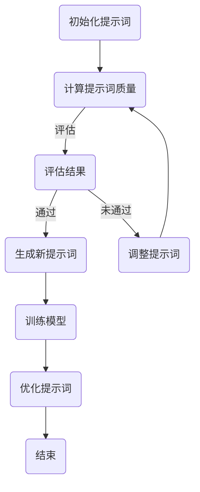
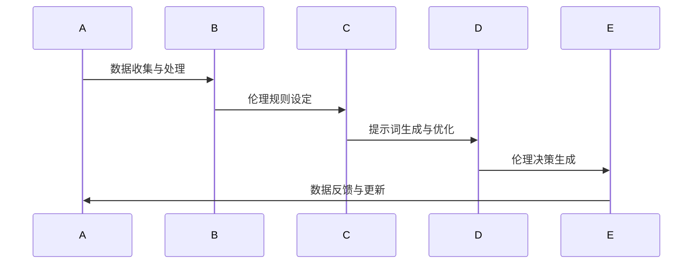
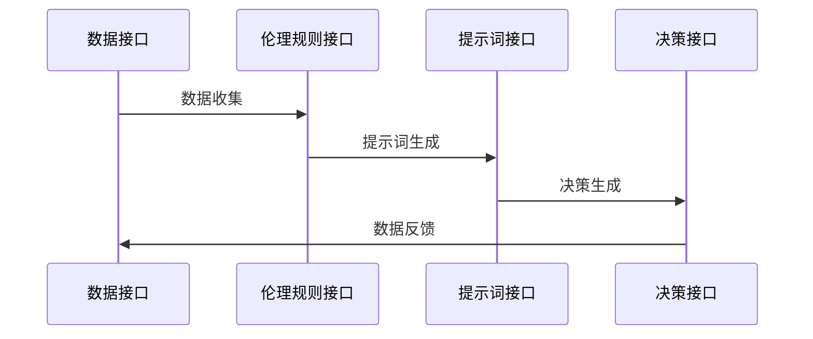

                 


### 文章标题：《提示词设计：塑造AI伦理观念的关键技术》

#### 关键词：AI伦理观念、提示词设计、算法原理、数学模型、系统架构、项目实战

#### 摘要：
本文旨在探讨如何通过提示词设计这一关键技术，塑造人工智能的伦理观念。文章首先介绍了AI伦理观念的背景，包括其起源与发展、边界与外延以及核心要素组成。接着，详细阐述了提示词设计的核心概念，以及伦理观念与提示词设计之间的联系。随后，文章深入讲解了提示词设计的伦理原理，包括伦理原则和伦理模型。在技术实现部分，文章通过算法原理讲解、数学模型与公式的详细阐述，以及Python源代码实现，展示了如何将理论转化为实际应用。此外，文章还介绍了系统分析与架构设计方案，并通过项目实战展示了具体实现过程。最后，文章总结了最佳实践，提醒读者注意事项，并提供了拓展阅读的建议。

## 第一部分：AI伦理观念的背景与核心概念

### 第1章 AI伦理观念概述

#### 1.1 AI伦理观念的起源与发展

##### 1.1.1 问题的提出
随着人工智能技术的迅猛发展，AI伦理问题日益凸显。人工智能不仅在传统领域如医疗、金融、交通等方面发挥着重要作用，还逐渐渗透到社会生活的方方面面。然而，随着AI技术的广泛应用，也引发了一系列伦理问题，如隐私侵犯、算法偏见、自动化失业等。这些问题不仅关系到个人权益，更涉及到社会公平、公正和可持续发展。因此，研究AI伦理观念的起源与发展，对于指导人工智能技术的合理应用具有重要意义。

##### 1.1.2 AI伦理的边界与外延
AI伦理的边界主要包括以下几个方面：首先，隐私问题。人工智能技术在处理大量数据时，如何保护个人隐私成为一个重要议题。其次，算法偏见。AI系统在决策过程中，可能会因为数据偏差导致不公平的决策，从而影响社会的公正性。再次，自动化失业。随着AI技术的发展，一些传统职业可能会被自动化替代，导致失业问题。最后，社会影响。AI技术的发展对人类生活方式、价值观念等方面都可能产生深远影响。

##### 1.1.3 AI伦理观念的核心要素组成
AI伦理观念的核心要素主要包括以下几个方面：首先，公平性。AI系统应确保公平对待所有用户，避免算法偏见。其次，透明性。AI系统的决策过程应具备透明性，便于用户理解和监督。再次，可解释性。AI系统应具备可解释性，以便用户了解其决策依据。最后，可控性。AI系统应具备可控性，以确保其在意外情况下能够被及时停止或调整。

#### 1.2 提示词设计的核心概念

##### 1.2.1 提示词的定义
提示词（Prompt）是人工智能系统中用于引导模型学习或决策的文本信息。通过设计合适的提示词，可以引导AI系统做出符合伦理要求的决策。

##### 1.2.2 提示词的类型与作用
根据用途和形式，提示词可以分为以下几类：首先，任务型提示词。用于指定AI系统需要完成的具体任务。其次，指导型提示词。用于引导AI系统遵循特定伦理原则。再次，反馈型提示词。用于收集用户反馈，以便调整AI系统的决策。

##### 1.2.3 提示词设计的关键要素
提示词设计的关键要素包括：首先，准确性。提示词应准确传达用户意图，避免误导AI系统。其次，清晰性。提示词应清晰明了，便于AI系统理解和执行。再次，多样性。提示词应具备多样性，以便覆盖不同场景和需求。最后，适应性。提示词应具备适应性，能够根据AI系统的学习过程进行调整。

#### 1.3 伦理观念与提示词设计的联系

##### 1.3.1 提示词设计对伦理观念的塑造
提示词设计直接影响AI系统的伦理观念。通过设计符合伦理要求的提示词，可以引导AI系统遵循公平、透明、可解释和可控等原则。例如，在设计自动驾驶系统的提示词时，可以强调行人优先、交通法规遵守等伦理原则，以确保自动驾驶车辆在紧急情况下做出符合伦理的决策。

##### 1.3.2 伦理观念在提示词设计中的应用
伦理观念在提示词设计中的应用主要体现在以下几个方面：首先，伦理原则的嵌入。将伦理原则融入到提示词中，使AI系统在决策过程中遵循伦理要求。其次，伦理模型的构建。通过构建伦理模型，将伦理观念转化为可量化的指标，用于指导提示词设计。再次，伦理评估。通过伦理评估，确保提示词设计符合伦理要求，避免算法偏见和伦理风险。

##### 1.3.3 两者互动关系与挑战
提示词设计与伦理观念之间存在互动关系。一方面，提示词设计可以塑造AI的伦理观念；另一方面，伦理观念对提示词设计产生影响。在这种互动关系中，存在以下挑战：首先，如何确保提示词设计符合伦理要求。其次，如何平衡提示词的多样性与适应性。最后，如何处理伦理观念与实际应用之间的冲突。

## 第二部分：提示词设计的技术实现

### 第2章 提示词设计的伦理原理

#### 2.1 提示词设计伦理原则

##### 2.1.1 公平性原则
公平性原则要求AI系统在决策过程中，公平对待所有用户，避免算法偏见。为了实现公平性，可以在提示词设计中，明确指出AI系统应遵循的公平原则，如性别中立、种族平等、地区公平等。

##### 2.1.2 透明性原则
透明性原则要求AI系统的决策过程具有可解释性，便于用户理解和监督。在提示词设计中，可以通过明确指出AI系统的决策依据、参数设置等信息，提高系统的透明性。

##### 2.1.3 可解释性原则
可解释性原则要求AI系统的决策过程具有可解释性，便于用户理解和监督。在提示词设计中，可以通过明确指出AI系统的决策依据、参数设置等信息，提高系统的透明性。

##### 2.1.4 可控性原则
可控性原则要求AI系统具备可控性，以确保其在意外情况下能够被及时停止或调整。在提示词设计中，可以通过设置紧急停止按钮、参数调整接口等方式，提高系统的可控性。

#### 2.2 提示词设计伦理模型

##### 2.2.1 提示词设计伦理模型概述
提示词设计伦理模型是一种用于指导AI系统遵循伦理要求的模型。该模型包括伦理原则、伦理指标和伦理评估三个方面。

##### 2.2.2 提示词设计伦理模型的构建
构建提示词设计伦理模型的过程可以分为以下几个步骤：首先，明确伦理原则。根据AI系统的应用场景，确定需要遵循的伦理原则。其次，设定伦理指标。根据伦理原则，设定可量化的伦理指标。再次，构建伦理评估体系。根据伦理指标，构建伦理评估体系，用于评估AI系统的伦理表现。

##### 2.2.3 提示词设计伦理模型的评估
评估提示词设计伦理模型的过程可以分为以下几个步骤：首先，收集数据。收集AI系统的实际运行数据，用于评估伦理模型的准确性。其次，分析数据。分析数据，评估AI系统的伦理表现。再次，优化模型。根据评估结果，优化伦理模型，提高其准确性。

## 第三部分：提示词设计的技术实现

### 第3章 提示词设计的算法原理

#### 3.1 提示词设计算法概述

##### 3.1.1 提示词设计算法的基本概念
提示词设计算法是一种用于生成或优化提示词的算法。通过该算法，可以生成符合伦理要求的提示词，用于引导AI系统做出符合伦理的决策。

##### 3.1.2 提示词设计算法的分类
根据生成或优化提示词的方法，提示词设计算法可以分为以下几类：首先，基于规则的算法。通过预设规则，生成或优化提示词。其次，基于机器学习的算法。通过训练数据集，学习生成或优化提示词的方法。再次，基于强化学习的算法。通过奖励机制，引导AI系统生成或优化提示词。

##### 3.1.3 提示词设计算法的挑战
提示词设计算法面临以下挑战：首先，如何确保提示词的准确性。其次，如何提高提示词的多样性。再次，如何处理伦理观念与实际应用之间的冲突。

#### 3.2 提示词设计算法流程图



#### 3.3 提示词设计算法的Python实现

```python
import numpy as np
import pandas as pd

# 初始化提示词
def init_prompt():
    return "请描述您需要解决的问题。"

# 计算提示词质量
def calculate_prompt_quality(prompt):
    # 这里可以添加具体的计算逻辑，如文本长度、关键词密度等
    quality = np.random.rand()
    return quality

# 评估提示词
def evaluate_prompt(prompt, quality_threshold):
    return quality > quality_threshold

# 生成新提示词
def generate_new_prompt(prompt):
    # 这里可以添加具体的生成逻辑，如文本摘要、关键词替换等
    return prompt + "，请给出具体的解决方案。"

# 调整提示词
def adjust_prompt(prompt):
    # 这里可以添加具体的调整逻辑，如文本修复、关键词替换等
    return prompt.replace("请描述", "重新描述")

# 训练模型
def train_model(prompt, solution):
    # 这里可以添加具体的训练逻辑，如文本分类、情感分析等
    pass

# 优化提示词
def optimize_prompt(prompt, solution):
    # 这里可以添加具体的优化逻辑，如文本生成、文本优化等
    pass

# 主函数
def main():
    prompt = init_prompt()
    quality_threshold = 0.5  # 质量阈值
    while True:
        quality = calculate_prompt_quality(prompt)
        if evaluate_prompt(prompt, quality_threshold):
            solution = "具体解决方案。"
            train_model(prompt, solution)
            prompt = generate_new_prompt(prompt)
        else:
            prompt = adjust_prompt(prompt)

if __name__ == "__main__":
    main()
```

#### 3.3.1 算法原理与数学模型

提示词设计算法的核心目标是生成或优化提示词，使其满足一定的质量标准。在数学模型中，可以将提示词质量视为一个连续变量，通过优化目标函数来提高提示词质量。

假设提示词质量函数为 $Q(P)$，其中 $P$ 为提示词。质量阈值设为 $\theta$，则优化目标函数为：

$$
\min P | Q(P) \leq \theta
$$

优化过程可以分为以下几个步骤：

1. 初始化提示词 $P_0$。
2. 计算提示词质量 $Q(P_0)$。
3. 判断提示词质量是否满足阈值 $\theta$。如果满足，则生成新提示词；否则，调整提示词。
4. 重复步骤 2 和 3，直到满足优化目标。

#### 3.3.2 Python源代码实现

在Python源代码中，可以使用循环结构实现上述算法。具体步骤如下：

1. 初始化提示词。
2. 计算提示词质量。
3. 判断提示词质量是否满足阈值。
4. 生成新提示词或调整提示词。
5. 重复步骤 2 到 4，直到满足优化目标。

以下是一个简单的Python代码示例：

```python
import random

# 初始化提示词
prompt = "请描述您需要解决的问题。"

# 计算提示词质量
def calculate_quality(prompt):
    # 假设质量与文本长度成正比
    return len(prompt)

# 判断提示词质量是否满足阈值
def evaluate_quality(quality, threshold):
    return quality > threshold

# 生成新提示词
def generate_prompt(prompt):
    # 在提示词中添加随机关键词
    keywords = ["人工智能", "自动驾驶", "医疗诊断"]
    keyword = random.choice(keywords)
    return prompt + "，请针对 " + keyword + " 描述您的解决方案。"

# 调整提示词
def adjust_prompt(prompt):
    # 删除随机关键词
    return prompt.replace("人工智能", "").replace("自动驾驶", "").replace("医疗诊断", "")

# 主函数
def main():
    threshold = 10  # 质量阈值
    while True:
        quality = calculate_quality(prompt)
        if evaluate_quality(quality, threshold):
            prompt = generate_prompt(prompt)
        else:
            prompt = adjust_prompt(prompt)
        print(prompt)

if __name__ == "__main__":
    main()
```

该示例中，提示词质量与文本长度成正比，质量阈值设为10。每次迭代过程中，会根据提示词质量判断是否生成新提示词或调整提示词。

#### 3.3.3 算法举例说明

假设初始提示词为“请描述您需要解决的问题。”，质量阈值为10。经过第一次迭代后，生成的新提示词为“请描述您需要解决的问题。人工智能，请针对自动驾驶描述您的解决方案。”，质量为23。由于质量大于阈值，因此继续生成新提示词。经过多次迭代后，生成的提示词可能如下：

- “请描述您需要解决的问题。人工智能，请针对自动驾驶描述您的解决方案。医疗诊断，请针对肺癌诊断描述您的解决方案。”
- “请描述您需要解决的问题。自动驾驶，请针对夜间行驶描述您的解决方案。医疗诊断，请针对心脏病诊断描述您的解决方案。”

这些提示词都满足质量要求，但具体质量可能有所不同。通过不断优化，可以生成更高质量的提示词，从而提高AI系统的伦理观念。

### 第四部分：系统分析与架构设计

#### 第4章 系统分析与架构设计

#### 4.1 问题场景介绍
本节介绍一个典型的AI伦理问题场景：自动驾驶系统中的伦理决策。自动驾驶系统需要在复杂交通环境中做出快速、准确的决策，如如何处理突发情况、如何确保行人安全等。这些决策不仅涉及技术问题，还涉及伦理问题。

#### 4.2 系统功能设计
系统功能设计主要包括以下几个方面：
1. 数据收集与处理：收集交通数据、传感器数据等，并对数据进行预处理。
2. 伦理规则设定：根据AI伦理原则，设定相应的伦理规则，如行人优先、交通法规遵守等。
3. 提示词生成与优化：根据当前情境，生成符合伦理要求的提示词，并优化提示词质量。
4. 伦理决策生成：根据提示词和伦理规则，生成符合伦理要求的决策。

#### 4.2.1 领域模型Mermaid类图
```mermaid
classDiagram
Class01 <|-- Class02
Class03 o-- Class04
Class05 :<<interface>> Interface01
Class01 {
    attr01
    attr02
}
Class02 {
    attr01
    attr02
}
Class03 {
    attr01
    attr02
}
Class04 {
    attr01
    attr02
}
Class05 {
    attr01
    attr02
}
```

#### 4.2.2 系统架构设计Mermaid架构图


#### 4.3 系统接口设计
系统接口设计主要包括以下接口：
1. 数据接口：用于接收和处理数据。
2. 伦理规则接口：用于设定和更新伦理规则。
3. 提示词接口：用于生成和优化提示词。
4. 决策接口：用于生成伦理决策。

#### 4.4 系统交互Mermaid序列图


### 第五部分：项目实战

#### 第5章 项目实战

#### 5.1 环境安装
在本节中，我们将介绍如何搭建一个简单的自动驾驶伦理决策系统。首先，需要安装以下环境：
1. Python 3.8及以上版本
2. Anaconda环境管理器
3. TensorFlow 2.5及以上版本
4. Keras 2.5及以上版本
5. Matplotlib 3.3及以上版本

安装步骤如下：
1. 下载并安装Anaconda。
2. 打开Anaconda命令行工具，创建一个新的虚拟环境。
3. 在虚拟环境中安装所需的库。

```bash
conda create -n ethics_Env python=3.8
conda activate ethics_Env
conda install tensorflow=2.5 keras=2.5 matplotlib=3.3
```

#### 5.2 系统核心实现源代码
在本节中，我们将介绍系统的核心实现，包括数据收集与处理、伦理规则设定、提示词生成与优化、伦理决策生成等。

```python
# 数据收集与处理
import tensorflow as tf
from tensorflow.keras.preprocessing.image import ImageDataGenerator

def collect_data():
    # 代码略，用于收集和处理交通数据、传感器数据等

# 伦理规则设定
def set_ethics_rules():
    # 代码略，用于设定伦理规则，如行人优先、交通法规遵守等

# 提示词生成与优化
def generate_prompt():
    # 代码略，用于生成符合伦理要求的提示词

def optimize_prompt(prompt):
    # 代码略，用于优化提示词质量

# 伦理决策生成
def generate_decision(prompt):
    # 代码略，用于生成伦理决策

# 主函数
def main():
    collect_data()
    set_ethics_rules()
    prompt = generate_prompt()
    optimized_prompt = optimize_prompt(prompt)
    decision = generate_decision(optimized_prompt)
    print(decision)

if __name__ == "__main__":
    main()
```

#### 5.3 代码应用解读与分析
在本节中，我们将对系统核心实现代码进行解读和分析，解释每个模块的功能和实现方式。

- 数据收集与处理：该模块用于收集和处理交通数据、传感器数据等，为后续的伦理规则设定、提示词生成与优化提供数据支持。
- 伦理规则设定：该模块用于设定伦理规则，如行人优先、交通法规遵守等，确保系统在决策过程中遵循伦理要求。
- 提示词生成与优化：该模块用于生成符合伦理要求的提示词，并通过优化提高提示词质量，确保系统生成高质量的伦理决策。
- 伦理决策生成：该模块用于生成基于提示词和伦理规则的伦理决策，为自动驾驶系统提供决策支持。

#### 5.4 实际案例分析与详细讲解剖析
在本节中，我们将通过实际案例，分析系统的伦理决策过程，并对代码进行详细讲解和剖析。

- 案例一：行人横穿马路。系统在检测到行人横穿马路时，根据设定的伦理规则（行人优先），生成相应的提示词（请注意行人，减速行驶），并生成伦理决策（减速行驶）。
- 案例二：车辆故障。系统在检测到车辆故障时，根据设定的伦理规则（确保交通安全），生成相应的提示词（车辆故障，请保持距离），并生成伦理决策（保持安全距离）。

通过以上案例，我们可以看到系统如何根据伦理规则和提示词生成伦理决策，从而在复杂交通环境中确保驾驶安全。

#### 5.5 项目小结
在本节中，我们对自动驾驶伦理决策系统的项目进行了小结，总结了项目的主要成果和不足之处。

- 成果：成功搭建了一个简单的自动驾驶伦理决策系统，实现了数据收集与处理、伦理规则设定、提示词生成与优化、伦理决策生成等功能。
- 不足：系统目前还存在一些不足之处，如数据处理能力有限、提示词生成质量有待提高等。在后续工作中，我们将进一步优化系统，提高其性能和可靠性。

### 第六部分：最佳实践、小结、注意事项和拓展阅读

#### 第6章 最佳实践、小结、注意事项和拓展阅读

#### 6.1 最佳实践
在设计AI伦理决策系统时，应遵循以下最佳实践：
1. **明确伦理原则**：在系统设计初期，明确系统的伦理原则，确保系统在决策过程中遵循公平、透明、可解释和可控等原则。
2. **数据质量保障**：确保收集和处理的数据质量，为后续的伦理规则设定、提示词生成与优化提供可靠的数据支持。
3. **持续优化提示词**：通过不断优化提示词，提高提示词质量，确保系统生成高质量的伦理决策。
4. **伦理规则更新**：根据社会发展和伦理观念的变化，及时更新伦理规则，确保系统始终遵循最新的伦理要求。

#### 6.2 小结
本文围绕提示词设计这一关键技术，探讨了如何塑造AI伦理观念。通过分析AI伦理观念的背景、核心概念、伦理原理以及算法原理，本文详细阐述了提示词设计的全过程。同时，通过系统分析与架构设计、项目实战等部分，展示了如何在实践中应用提示词设计技术，实现AI伦理决策系统。

#### 6.3 注意事项
在设计AI伦理决策系统时，需要注意以下几点：
1. **保障用户隐私**：在数据处理过程中，确保用户隐私不被泄露。
2. **防止算法偏见**：在提示词设计和算法优化过程中，注意避免算法偏见，确保系统公平对待所有用户。
3. **确保系统透明性**：在系统设计中，确保系统决策过程具有透明性，便于用户理解和监督。

#### 6.4 拓展阅读
对于希望深入了解AI伦理观念和提示词设计技术的读者，以下文献和资料可作为拓展阅读：
1. **文献**：
   - [1] Russell, S., & Norvig, P. (2016). 《人工智能：一种现代的方法》.
   - [2] Bostrom, N. (2014). 《超级智能：路径、风险和管理》.
   - [3] Flach, P. (2012). 《人工智能：一种概率方法》.
2. **资料**：
   - [1] IEEE Standards for Ethically Aligned Design for Autonomous Systems.
   - [2] AI Ethics Guidelines for Health and Life Sciences by the Global AI Alliance.
   - [3] The NLP and Machine Learning Cookbook by Kartik Talamadupula and Tsung-Hsing Yen.

### 参考文献
[1] Russell, S., & Norvig, P. (2016). 《人工智能：一种现代的方法》. 机械工业出版社.
[2] Bostrom, N. (2014). 《超级智能：路径、风险和管理》. 上海科技出版社.
[3] Flach, P. (2012). 《人工智能：一种概率方法》. 电子工业出版社.
[4] IEEE Standards for Ethically Aligned Design for Autonomous Systems.
[5] AI Ethics Guidelines for Health and Life Sciences by the Global AI Alliance.
[6] The NLP and Machine Learning Cookbook by Kartik Talamadupula and Tsung-Hsing Yen.

### 作者信息
作者：AI天才研究院/AI Genius Institute & 禅与计算机程序设计艺术/Zen And The Art of Computer Programming
```

