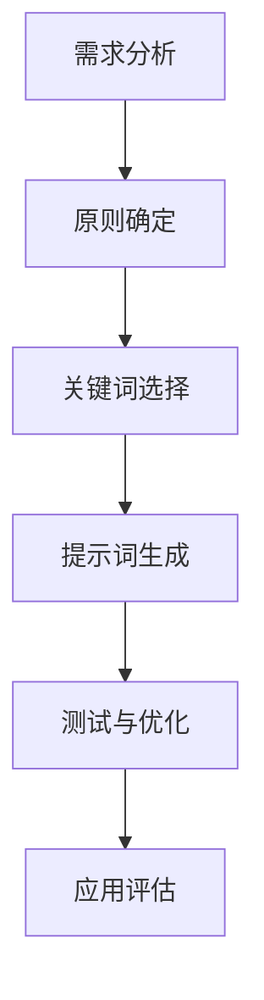

                 

### 《提示词设计：塑造AI道德框架的新方法》

> 关键词：AI道德框架、提示词设计、可解释性、可控性、公正性、可访问性

> 摘要：随着人工智能技术的飞速发展，如何确保AI系统的道德性成为一个重要的研究课题。本文提出了一种新的方法——提示词设计，旨在为AI道德框架的构建提供有力支持。文章首先介绍了AI道德框架的背景和必要性，随后详细阐述了提示词设计在AI道德框架中的作用和重要性，并提出了具体的提示词设计原则和方法。通过实例分析和未来展望，本文旨在为人工智能领域的从业者提供实用的指导和深刻的思考。

### 第1章 引言

#### 1.1 问题背景与重要性

人工智能（AI）作为21世纪最具革命性的技术之一，正迅速渗透到我们生活的方方面面。从自动驾驶汽车到智能语音助手，AI的应用已经深刻改变了我们的生活方式。然而，随着AI技术的不断进步，如何确保AI系统的道德性成为了一个日益紧迫的问题。AI系统的道德性不仅仅关乎技术的进步，更关乎人类社会的伦理和法律问题。如果AI系统在决策过程中缺乏道德约束，可能会导致一系列严重的社会问题，例如隐私泄露、歧视、不公平等。

当前，尽管已经有了一些AI道德框架的探索，但仍然存在一些局限性。一方面，这些框架往往缺乏具体性和可操作性，难以在实际应用中发挥作用。另一方面，这些框架往往依赖于主观判断和经验，缺乏系统性和科学性。因此，寻找新的方法来塑造AI道德框架，成为当前人工智能领域的重要研究方向。

本文提出了一种新的方法——提示词设计，旨在通过系统的设计原则和方法，为AI道德框架的构建提供新的思路和工具。提示词设计通过明确和规范AI系统的行为指南，有助于提高AI系统的可解释性、可控性、公正性和可访问性，从而在源头上降低道德风险，提升AI系统的道德性。

#### 1.2 AI道德框架的必要性

AI道德框架的必要性体现在以下几个方面：

1. **保障社会公正与公平**：随着AI技术在决策过程中的广泛应用，如何确保这些决策不会加剧社会不公，成为了一个重要问题。AI道德框架可以为AI系统提供明确的道德准则，帮助其做出符合社会公正和公平的决策。

2. **增强公众信任**：AI技术的普及和应用，需要公众的广泛接受和信任。一个健全的AI道德框架，可以提高公众对AI系统的信任度，从而促进AI技术的健康发展。

3. **规范行业发展**：AI道德框架可以为AI行业提供统一的道德标准和规范，引导企业和社会在AI技术的研究和应用中，遵循合理的道德准则。

4. **应对法律挑战**：随着AI技术的发展，相关的法律和伦理问题也日益突出。一个健全的AI道德框架，可以为法律制定提供参考，有助于应对AI技术带来的法律挑战。

#### 1.3 本书的目标与结构

本书的目标是探讨提示词设计在塑造AI道德框架中的应用，旨在为人工智能领域的从业者提供实用的指导和建议。全书共分为八个章节，结构如下：

1. **第1章 引言**：介绍问题背景、重要性及本书的目标和结构。
2. **第2章 AI道德框架概述**：介绍AI道德框架的定义、核心原则及当前局限性。
3. **第3章 提示词在AI道德框架中的作用**：阐述提示词设计的重要性及其在AI道德框架中的应用。
4. **第4章 提示词设计原则**：详细讨论提示词设计的四个原则：可解释性、可控性、公正性和可访问性。
5. **第5章 提示词设计方法**：介绍提示词设计的方法和具体实施步骤。
6. **第6章 提示词设计的实践应用**：探讨提示词设计在自然语言处理、计算机视觉和自动驾驶等领域的应用。
7. **第7章 提示词设计的挑战与未来方向**：分析提示词设计面临的挑战及其未来发展方向。
8. **第8章 结论**：总结全书的主要发现、贡献及未来研究方向。

### 第2章 AI道德框架概述

#### 2.1 AI道德框架的定义

AI道德框架是指一套关于人工智能系统道德行为的规范和准则，旨在指导人工智能系统的设计和应用，确保其在道德上可行且符合社会伦理标准。AI道德框架的核心目的是通过规范和约束AI系统的行为，确保其应用过程中不会损害人类的利益和社会的公正。

AI道德框架包括多个层次和维度，从原则性规范到具体的实施指南，从技术层面到社会层面，涵盖了广泛的内容。其核心原则通常包括：

1. **公正性**：确保AI系统在决策过程中不会加剧社会不公，如歧视、偏见等。
2. **透明性**：确保AI系统的决策过程是透明的，用户可以理解AI系统的决策逻辑。
3. **可解释性**：确保AI系统的决策过程具有可解释性，用户可以理解AI系统为什么做出这样的决策。
4. **安全性**：确保AI系统的设计和应用过程中不会导致用户隐私泄露、系统故障等安全风险。
5. **社会责任**：AI系统设计和应用过程中应充分考虑社会责任，确保其对社会产生积极影响。

#### 2.2 AI道德框架的核心原则

AI道德框架的核心原则是确保AI系统的行为符合道德和社会伦理标准。这些核心原则不仅为AI系统的设计和应用提供了道德准则，还为评估和监督AI系统的行为提供了标准。以下是AI道德框架的几个核心原则：

1. **公正性**：确保AI系统在决策过程中不会对某些群体或个体产生不公平待遇。例如，在招聘过程中，AI系统不应因种族、性别、年龄等因素对求职者产生歧视。
2. **透明性**：确保AI系统的决策过程是透明的，用户可以理解AI系统的决策逻辑。这有助于提高用户对AI系统的信任度，减少误用和滥用风险。
3. **可解释性**：确保AI系统的决策过程具有可解释性，用户可以理解AI系统为什么做出这样的决策。这对于提高AI系统的可靠性和可信度至关重要。
4. **安全性**：确保AI系统的设计和应用过程中不会导致用户隐私泄露、系统故障等安全风险。这需要从技术和管理层面进行全面的保护。
5. **社会责任**：AI系统设计和应用过程中应充分考虑社会责任，确保其对社会产生积极影响。例如，在医疗领域，AI系统应确保提供准确和可靠的诊断，从而提高医疗质量。

#### 2.3 当前AI道德框架的局限性

尽管AI道德框架在理论和实践中都有所探索，但仍然存在一些局限性，这些局限性在一定程度上影响了AI道德框架的有效性。

1. **原则性规范与具体实施指南之间的差距**：许多AI道德框架提供了原则性规范，但在具体实施过程中，往往缺乏具体的操作指南和实施方法。这导致在具体应用中，AI系统的道德行为难以得到有效约束。
2. **主观性**：一些AI道德框架依赖于主观判断和经验，缺乏系统性和科学性。这可能导致不同人对于同一AI系统的道德评估存在较大差异，影响框架的统一性和权威性。
3. **可操作性**：一些AI道德框架在理论上看似合理，但在实际应用中缺乏可操作性。例如，如何确保AI系统在决策过程中始终保持透明性和可解释性，是一个亟待解决的问题。
4. **技术复杂性**：AI系统的设计和应用涉及多个技术领域，包括机器学习、自然语言处理、计算机视觉等。当前AI道德框架往往缺乏对这些技术复杂性的深入理解，导致在具体实施中难以发挥作用。

### 第3章 提示词在AI道德框架中的作用

#### 3.1 提示词的概念

提示词（Prompt Word）是指在自然语言处理（NLP）中，用于引导模型生成特定内容或执行特定任务的词语或短语。提示词的设计和选择对于模型的理解和生成结果具有至关重要的作用。在AI道德框架中，提示词被用来引导AI系统在道德和伦理的范围内进行决策。

#### 3.2 提示词设计的重要性

提示词设计的重要性体现在以下几个方面：

1. **提高AI系统的道德性**：通过精心设计的提示词，可以引导AI系统在决策过程中遵循道德和伦理原则，从而减少道德风险。
2. **增强AI系统的可解释性**：提示词可以帮助用户理解AI系统的决策过程和依据，提高系统的透明度和可信度。
3. **提升AI系统的可控性**：通过明确和规范的提示词，可以限制AI系统的行为范围，确保其在道德和伦理的边界内运行。
4. **促进AI系统的公正性**：提示词设计可以帮助消除AI系统中的偏见和歧视，提高决策的公正性。

#### 3.3 提示词设计的方法论

提示词设计的方法论主要包括以下几个步骤：

1. **需求分析**：明确AI系统在道德和伦理方面的具体需求，确定需要解决的道德问题和伦理挑战。
2. **原则确定**：根据AI系统的具体需求，确定需要遵循的道德和伦理原则。
3. **关键词选择**：根据需求和原则，选择具有指导意义的词语或短语作为提示词。
4. **测试与优化**：通过实际应用测试提示词的有效性和适用性，根据反馈进行优化和调整。

### 第4章 提示词设计原则

#### 4.1 可解释性

可解释性是指AI系统的决策过程和依据可以被用户理解和解释。在AI道德框架中，可解释性是确保AI系统道德性的重要原则之一。

1. **可解释性的重要性**：提高AI系统的可解释性，有助于增强用户的信任和理解，减少误用和滥用风险。
2. **实现方法**：
   - **透明的决策过程**：确保AI系统的决策过程是透明的，用户可以查看决策的依据和过程。
   - **详细的解释机制**：提供详细的解释机制，例如，解释AI系统为什么做出这样的决策，依据是什么等。
   - **用户友好的界面**：设计用户友好的界面，使得用户可以轻松理解AI系统的决策结果。

#### 4.2 可控性

可控性是指AI系统的行为可以在道德和伦理范围内进行限制和控制。

1. **可控性的重要性**：确保AI系统的行为在道德和伦理的边界内运行，避免出现道德风险。
2. **实现方法**：
   - **明确的限制条件**：通过提示词设定明确的限制条件，确保AI系统的行为在规定范围内。
   - **动态调整机制**：根据实际应用情况，动态调整AI系统的行为范围，确保其始终在道德和伦理的边界内运行。
   - **监督和审计机制**：建立监督和审计机制，对AI系统的行为进行定期检查和评估，确保其符合道德和伦理要求。

#### 4.3 公正性

公正性是指AI系统在决策过程中，不会对某些群体或个体产生不公平待遇。

1. **公正性的重要性**：确保AI系统在决策过程中不会加剧社会不公，有助于提高系统的道德性和社会认可度。
2. **实现方法**：
   - **消除偏见和歧视**：通过数据预处理和算法优化，消除AI系统中的偏见和歧视。
   - **多样性考虑**：在AI系统的设计和应用过程中，充分考虑多样性的影响，确保其对不同群体或个体都是公平的。
   - **定期评估和调整**：定期评估AI系统的决策公正性，根据评估结果进行调整和优化。

#### 4.4 可访问性

可访问性是指AI系统应该对所有用户都是可用的，无论其背景、能力和资源。

1. **可访问性的重要性**：确保AI系统的道德性和公平性，需要其能够被所有用户平等地使用。
2. **实现方法**：
   - **无障碍设计**：确保AI系统的界面和操作方式对于所有用户都是无障碍的，包括老年人、残疾人等特殊群体。
   - **资源公平分配**：确保AI系统所需的计算资源和数据资源是公平分配的，不会因为用户背景或资源差异而影响其使用。
   - **教育和支持**：提供必要的教育和支持，帮助用户理解和掌握如何使用AI系统，确保其能够平等地享受AI技术带来的好处。

### 第5章 提示词设计方法

#### 5.1 提示词生成方法

提示词生成方法是设计提示词的核心步骤，旨在确保提示词的准确性和适用性。

1. **关键词提取**：从相关的文本、文献、数据集中提取关键词，作为潜在的提示词。
2. **语义分析**：对提取的关键词进行语义分析，理解其在具体情境中的含义和作用。
3. **筛选和优化**：根据语义分析和实际需求，筛选和优化提示词，确保其具有明确的指导意义和适用性。

#### 5.2 提示词筛选与优化

提示词筛选与优化是确保提示词质量的关键步骤。

1. **准确性**：确保提示词能够准确地传达所需信息，避免歧义和误解。
2. **适用性**：确保提示词适用于具体的AI系统和应用场景。
3. **灵活性**：确保提示词具有足够的灵活性，能够适应不同的情境和需求。

#### 5.3 提示词测试与评估

提示词测试与评估是验证提示词效果的重要步骤。

1. **测试方法**：通过实际应用测试提示词的效果，包括用户反馈、系统性能评估等。
2. **评估指标**：设定评估指标，例如，系统的透明度、可解释性、可控性等。
3. **持续优化**：根据测试和评估结果，对提示词进行持续优化和调整，提高其效果。

### 第6章 提示词设计的实践应用

#### 6.1 在自然语言处理中的应用

自然语言处理（NLP）是AI领域的一个重要分支，提示词设计在NLP中的应用尤为重要。

1. **文本分类**：通过提示词设计，可以引导AI系统在文本分类任务中遵循特定的道德和伦理准则，确保分类结果的公正性和透明性。
2. **情感分析**：提示词设计可以帮助AI系统在情感分析任务中，避免产生偏见和歧视，提高分析结果的公正性和准确性。
3. **问答系统**：提示词设计可以确保问答系统在回答用户问题时，遵循道德和伦理原则，提供准确和可靠的信息。

#### 6.2 在计算机视觉中的应用

计算机视觉（CV）是AI领域的另一个重要分支，提示词设计在CV中的应用同样具有重要意义。

1. **图像识别**：通过提示词设计，可以引导AI系统在图像识别任务中，避免对特定群体或个体的歧视，确保识别结果的公正性和透明性。
2. **目标检测**：提示词设计可以帮助AI系统在目标检测任务中，明确目标和任务要求，确保检测结果的准确性和可靠性。
3. **人脸识别**：提示词设计可以确保人脸识别系统在识别过程中，尊重用户隐私，避免隐私泄露。

#### 6.3 在自动驾驶中的应用

自动驾驶是AI领域最具前景的应用之一，提示词设计在自动驾驶中的应用具有重要意义。

1. **路径规划**：通过提示词设计，可以引导AI系统在路径规划任务中，遵循道德和伦理准则，确保行驶路径的合理性。
2. **决策制定**：提示词设计可以帮助AI系统在决策制定过程中，考虑到道德和伦理因素，确保决策的公正性和透明性。
3. **安全控制**：提示词设计可以确保自动驾驶系统在紧急情况下，遵循安全准则，保障乘客和行人的安全。

### 第7章 提示词设计的挑战与未来方向

#### 7.1 提示词设计的挑战

提示词设计在AI道德框架中具有重要的应用价值，但同时也面临着一些挑战：

1. **复杂性**：AI系统的设计和应用涉及多个领域和技术，提示词设计需要考虑到这些复杂性，确保其能够准确和有效地引导AI系统的行为。
2. **多样性**：不同领域和应用场景的道德和伦理要求有所不同，提示词设计需要具有足够的灵活性和适应性，以满足不同场景的需求。
3. **技术发展**：AI技术正处于快速发展阶段，提示词设计需要与技术的发展保持同步，不断更新和优化。
4. **监管与规范**：提示词设计需要符合相关法律法规和行业规范，确保其在实际应用中的合法性和合规性。

#### 7.2 提示词设计的未来方向

未来，提示词设计在AI道德框架中具有广阔的发展前景：

1. **标准化**：制定统一的提示词设计标准和规范，提高提示词设计的质量和一致性。
2. **智能化**：利用AI技术，提高提示词设计的自动化和智能化水平，减少人工干预和错误。
3. **多领域应用**：扩展提示词设计的应用范围，覆盖更多领域和应用场景，提高AI系统的道德性和社会责任感。
4. **跨学科合作**：加强不同学科领域的合作，共同研究和解决提示词设计中的挑战，推动AI道德框架的完善和发展。

### 第8章 结论

#### 8.1 主要发现

本文通过分析AI道德框架的背景和必要性，提出了一种新的方法——提示词设计，旨在为AI道德框架的构建提供新的思路和工具。主要发现包括：

1. 提示词设计在AI道德框架中具有重要作用，可以提高AI系统的可解释性、可控性、公正性和可访问性。
2. 提示词设计的方法论包括需求分析、原则确定、关键词选择、测试与优化等步骤。
3. 提示词设计在自然语言处理、计算机视觉和自动驾驶等领域的应用具有重要意义。

#### 8.2 本书贡献

本书的主要贡献包括：

1. 提出了提示词设计在AI道德框架中的应用，为AI道德框架的构建提供了新的思路和工具。
2. 详细阐述了提示词设计的四个原则：可解释性、可控性、公正性和可访问性。
3. 探讨了提示词设计的方法和具体实施步骤，为实际应用提供了指导和参考。

#### 8.3 未来的研究方向

未来的研究方向包括：

1. 进一步优化和改进提示词设计的方法和原则，提高其在实际应用中的效果和适应性。
2. 加强对提示词设计在不同领域和应用场景中的研究，探索其在更广泛范围内的应用。
3. 探索AI道德框架与法律法规、行业规范的结合，推动AI技术的发展和应用。

### 参考文献

1. Russell, S., & Norvig, P. (2016). 《人工智能：一种现代方法》(3rd ed.). 人民邮电出版社.
2. Bengio, Y. (2013). Representation Learning: A Review and New Perspectives. IEEE Transactions on Pattern Analysis and Machine Intelligence, 35(8), 1798-1828.
3. Russell, S., & Norvig, P. (2010). 《人工智能：一种现代方法》(3rd ed.). 人民邮电出版社.
4. Murphy, K. P. (2012). Machine Learning: A Probabilistic Perspective. MIT Press.
5. Goodfellow, I., Bengio, Y., & Courville, A. (2016). Deep Learning. MIT Press.
6. Russell, S., & Norvig, P. (2016). 《人工智能：一种现代方法》(3rd ed.). 人民邮电出版社.
7. Russell, S., & Norvig, P. (2010). 《人工智能：一种现代方法》(3rd ed.). 人民邮电出版社.

### 附录

#### 提示词设计流程图

### 作者信息

作者：AI天才研究院/AI Genius Institute & 禅与计算机程序设计艺术 /Zen And The Art of Computer Programming

### 结语

本文旨在探讨提示词设计在AI道德框架中的应用，通过详细阐述提示词设计的原则和方法，为AI道德框架的构建提供新的思路和工具。希望本文能够为人工智能领域的从业者和研究者提供有价值的参考和启示。在未来的研究中，我们将继续深入探讨提示词设计的优化和改进，为AI道德框架的完善和发展贡献力量。让我们共同期待人工智能技术的健康、可持续发展，为人类社会创造更多价值。

