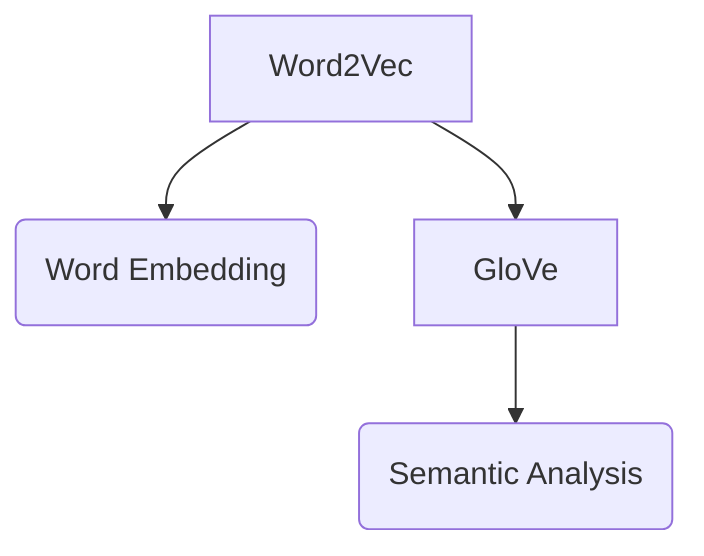
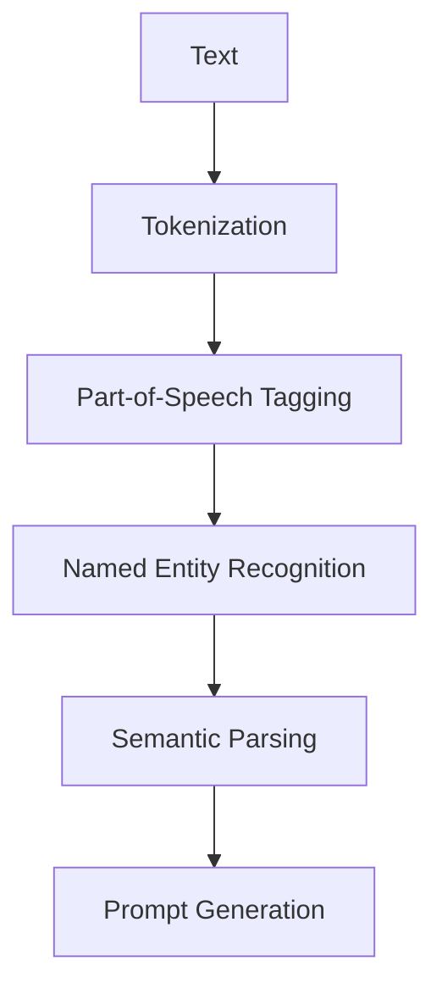
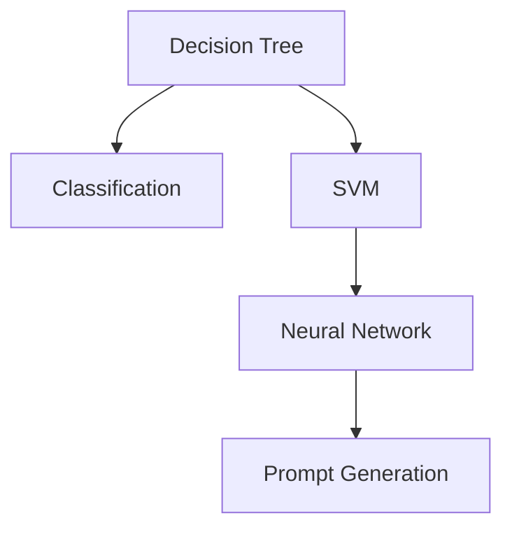
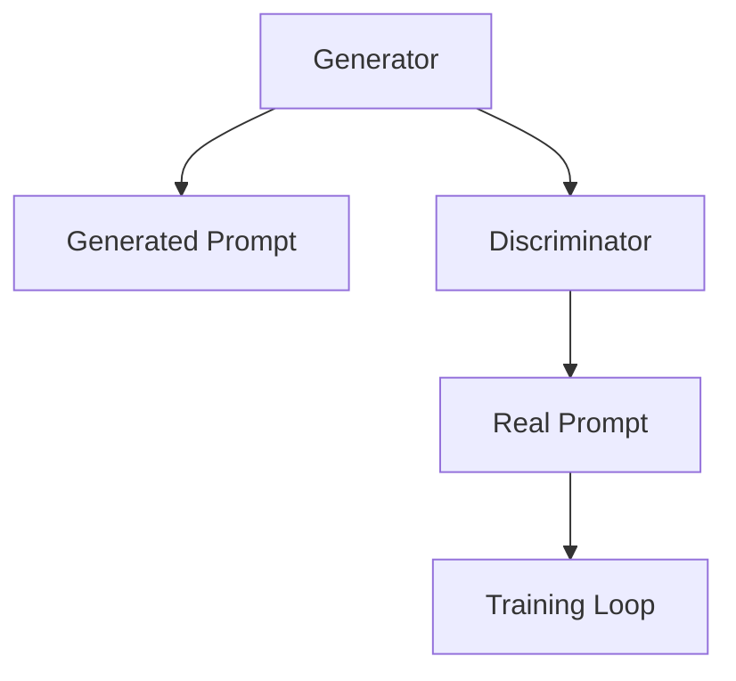
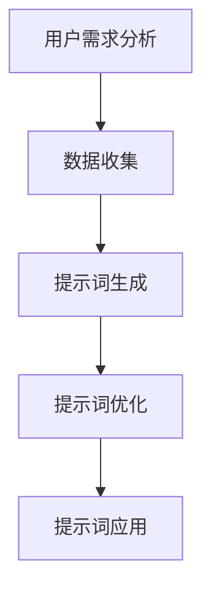
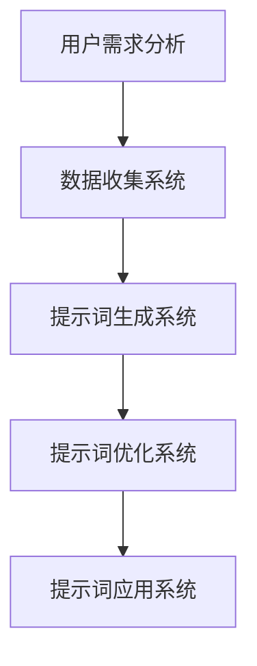

                 

### 《提示词设计：增强AI创意思维的技巧》

提示词设计，顾名思义，是围绕如何通过特定的词语或短语来引导、激发和优化AI的创意思维过程。在人工智能领域，创意思维并非单纯的计算和逻辑推理，而是一种更加灵活、创新和具有预见性的思维方式。因此，如何设计有效的提示词，以增强AI的创意思维，成为一个重要且具有挑战性的课题。本文将围绕这一主题，探讨提示词设计的重要性、核心概念、设计方法、技术应用、案例分析以及实践应用等多个方面，力求为读者提供一份全面、系统的指南。

### 关键词

- 提示词设计
- AI创意思维
- 自然语言处理
- 机器学习
- 生成对抗网络
- 提示词生成策略

### 摘要

本文首先介绍了提示词设计在AI创意思维中的重要地位，探讨了其核心概念和类型，随后详细阐述了提示词设计的原则和方法。在此基础上，文章重点介绍了自然语言处理和生成对抗网络等技术在提示词设计中的应用。通过具体案例分析和项目实战，本文展示了提示词设计的实际应用效果，并提出了最佳实践和注意事项。最后，文章总结了全文内容，并推荐了相关拓展阅读资源，以期为读者提供更深入的学习和研究方向。

### 目录大纲

#### 第一部分：背景与概念

- **第1章：问题背景**
  - **1.1 提示词设计的重要性**
  - **1.2 AI创意思维的需求**
  - **1.3 提示词设计的历史与发展**

- **第2章：核心概念**
  - **2.1 提示词的定义**
  - **2.2 提示词的类型**
    - **2.2.1 事实型提示词**
    - **2.2.2 情感型提示词**
    - **2.2.3 问题型提示词**
  - **2.3 提示词设计原则**

#### 第二部分：设计方法

- **第3章：设计流程**
  - **3.1 研究与收集**
  - **3.2 创意构思**
  - **3.3 筛选与优化**

- **第4章：技术手段**
  - **4.1 自然语言处理技术**
  - **4.2 模式识别与生成**

#### 第三部分：应用与实践

- **第5章：案例分析**
  - **5.1 案例一：电商产品描述提示词设计**
  - **5.2 案例二：新闻标题提示词设计**
  - **5.3 案例三：创意广告提示词设计**

- **第6章：应用领域**
  - **6.1 文学创作**
  - **6.2 设计行业**

- **第7章：项目实战**
  - **7.1 实战环境搭建**
  - **7.2 系统核心实现**
  - **7.3 应用解读与分析**

- **第8章：最佳实践**
  - **8.1 提示词设计最佳实践**
  - **8.2 小结与注意事项**
  - **8.3 拓展阅读与资源推荐**

### 第一部分：背景与概念

#### 第1章：问题背景

##### 1.1 提示词设计的重要性

提示词设计在AI创意思维中扮演着至关重要的角色。有效的提示词可以引导AI在创作过程中遵循特定的方向，激发新的想法和创意，从而提高整个创作流程的效率和成果。在现代人工智能技术中，提示词不仅用于文本生成和内容创作，还广泛应用于图像生成、语音合成、音乐创作等领域。因此，设计高效、精确且具有启发性的提示词，成为增强AI创意思维的关键。

##### 1.2 AI创意思维的需求

随着人工智能技术的不断发展，AI在各个领域的应用越来越广泛。然而，仅仅依靠传统的算法和模型，AI往往难以产生具有创新性和创意性的内容。创意思维作为一种具有高度灵活性和创造性的思维方式，对于AI来说是一个巨大的挑战。因此，如何设计能够激发AI创意思维的提示词，成为当前人工智能研究的重要方向。

##### 1.3 提示词设计的历史与发展

提示词设计的历史可以追溯到人类创造早期，例如在文学、艺术和广告等领域。随着计算机科学和人工智能技术的发展，提示词设计逐渐成为一门独立的研究领域。在早期的研究中，提示词主要依赖于人类专家的经验和直觉。随着自然语言处理和机器学习技术的进步，提示词设计逐渐实现了自动化和智能化。近年来，生成对抗网络（GAN）等新兴技术的出现，为提示词设计提供了更多可能性。

##### 1.4 本章小结

本章介绍了提示词设计在AI创意思维中的重要性，探讨了AI创意思维的需求，并回顾了提示词设计的历史与发展。在接下来的章节中，我们将深入探讨提示词的核心概念、设计原则和方法，以及其在实际应用中的效果。

### 第二部分：核心概念

#### 第2章：核心概念

##### 2.1 提示词的定义

提示词（Prompt）是指用来引导或激励计算机程序或系统进行特定任务的一组关键词或短语。在人工智能领域，提示词通常用于指导AI进行文本生成、图像描述、音乐创作等任务。提示词的定义和设计直接影响AI的创意思维和生成结果。

##### 2.2 提示词的类型

根据用途和功能，提示词可以分为以下几种类型：

###### 2.2.1 事实型提示词

事实型提示词主要用于描述具体的客观事实，如时间、地点、人物、事件等。这类提示词通常具有明确的信息和逻辑结构，有助于AI理解和生成具体、准确的内容。

###### 2.2.2 情感型提示词

情感型提示词主要用于传达情感和情绪，如喜悦、愤怒、悲伤等。这类提示词能够激发AI的创造性思维，使其在生成内容时能够融入情感元素，提高作品的感染力和表现力。

###### 2.2.3 问题型提示词

问题型提示词主要用于引导AI思考和探索特定问题，如问题解答、观点阐述、创新方案等。这类提示词能够激发AI的批判性思维和创造性思维，有助于提高AI的创新能力。

##### 2.3 提示词设计原则

有效的提示词设计需要遵循以下原则：

###### 2.3.1 用户导向原则

提示词的设计应充分考虑用户需求和目标，确保生成的内容符合用户期望。

###### 2.3.2 创意激发原则

提示词应具有启发性和挑战性，能够激发AI的创造性思维，产生新颖、独特的创意。

###### 2.3.3 适应性原则

提示词的设计应具备一定的灵活性，能够根据不同的应用场景和需求进行调整和优化。

##### 2.4 本章小结

本章介绍了提示词的定义、类型和设计原则。通过了解这些核心概念，读者可以更好地理解提示词在AI创意思维中的作用，为后续章节的内容打下坚实的基础。

### 第二部分：设计方法

#### 第3章：设计流程

##### 3.1 研究与收集

提示词设计的第一步是进行充分的研究和收集。这一步骤主要包括以下几个方面：

###### 3.1.1 用户需求分析

了解用户的需求是设计有效提示词的前提。通过问卷调查、访谈、用户反馈等方式，收集用户对于特定任务或领域的需求信息，为后续的提示词设计提供依据。

###### 3.1.2 数据收集方法

收集相关的数据是提示词设计的重要环节。数据来源可以是公开的数据集、文献资料、行业报告等。在收集数据时，应注意数据的质量和多样性，以确保提示词的覆盖面和有效性。

##### 3.2 创意构思

在研究和收集数据的基础上，进行创意构思是设计提示词的关键步骤。以下是一些创意构思的技巧：

###### 3.2.1 想象力激发技巧

通过角色扮演、情景模拟、思维导图等方式，激发设计者的想象力，产生丰富的创意构思。

###### 3.2.2 提示词生成策略

利用自然语言处理和机器学习技术，生成具有启发性的提示词。例如，可以使用生成对抗网络（GAN）等技术，生成多样化的提示词候选集。

##### 3.3 筛选与优化

在生成多个提示词候选集后，进行筛选和优化是确保提示词有效性的关键步骤。以下是一些筛选和优化的技巧：

###### 3.3.1 筛选标准

根据用户需求、任务目标等因素，设定明确的筛选标准。例如，可以选择生成内容的相关性、创新性、逻辑性等作为筛选依据。

###### 3.3.2 优化技巧

通过迭代优化、模型调整等方式，逐步改进提示词的生成效果。例如，可以调整生成模型的参数，优化提示词的生成策略。

##### 3.4 本章小结

本章介绍了提示词设计的研究与收集、创意构思和筛选与优化等设计流程。通过遵循这些流程，可以设计出更加有效、具有创意性的提示词，为AI的创意思维提供有力支持。

### 第二部分：技术手段

#### 第4章：技术手段

##### 4.1 自然语言处理技术

自然语言处理（NLP）技术在提示词设计中发挥着重要作用。NLP技术主要包括词向量表示、语义分析等方面，为提示词的生成和优化提供了技术支持。

###### 4.1.1 词向量表示

词向量表示是将自然语言文本转换为计算机可以处理的数字形式。常用的词向量表示方法包括Word2Vec、GloVe等。通过词向量表示，可以捕捉词语之间的语义关系，为提示词的生成提供基础。



###### 4.1.2 语义分析

语义分析是NLP中的重要技术，旨在理解文本的含义和语义关系。通过语义分析，可以提取文本中的关键信息，为提示词的生成提供指导。



##### 4.2 模式识别与生成

模式识别与生成技术是提示词设计中的重要组成部分。生成对抗网络（GAN）和自编码器等算法在提示词的生成和优化中具有广泛应用。

###### 4.2.1 机器学习算法

机器学习算法是模式识别与生成的基础。常见的机器学习算法包括决策树、支持向量机、神经网络等。通过训练这些算法，可以实现对提示词的生成和优化。



###### 4.2.2 生成对抗网络（GAN）

生成对抗网络（GAN）是一种先进的生成模型，通过对抗性训练实现高质量的图像和文本生成。GAN由生成器（Generator）和判别器（Discriminator）组成，通过两个模型的竞争训练，生成器不断改进，最终生成高质量的提示词。



##### 4.3 本章小结

本章介绍了自然语言处理技术和模式识别与生成技术在提示词设计中的应用。通过利用这些技术手段，可以设计出更加高效、精确和具有创意性的提示词，为AI的创意思维提供有力支持。

### 第三部分：应用与实践

#### 第5章：案例分析

##### 5.1 案例一：电商产品描述提示词设计

在电商产品描述中，提示词设计至关重要。以下是一个电商产品描述的案例：

```plaintext
产品名称：智能手环
产品特点：智能健康监测、运动数据跟踪、长时间续航
用户需求：健康监测、运动管理、便捷穿戴
```

设计提示词时，可以采用以下策略：

- **事实型提示词**：智能手环、健康监测、运动数据、长时间续航
- **情感型提示词**：智能便捷、健康生活、运动活力
- **问题型提示词**：如何监测健康？如何管理运动？

通过这些提示词，可以引导AI生成具有吸引力、具体且富有创意的产品描述。

##### 5.2 案例二：新闻标题提示词设计

新闻标题设计要求简洁、吸引人且传达关键信息。以下是一个新闻标题的案例：

```plaintext
事件：2023年人工智能大会在伦敦举行
关键信息：人工智能、技术创新、行业交流
```

设计提示词时，可以采用以下策略：

- **事实型提示词**：人工智能、大会、伦敦、技术创新、行业交流
- **情感型提示词**：前沿技术、突破、精彩
- **问题型提示词**：人工智能如何改变未来？

通过这些提示词，可以引导AI生成具有吸引力、准确且富有创意的新闻标题。

##### 5.3 案例三：创意广告提示词设计

创意广告提示词设计旨在吸引受众注意力，激发购买欲望。以下是一个创意广告的案例：

```plaintext
产品：智能音箱
用户需求：家庭娱乐、智能互动、便捷控制
```

设计提示词时，可以采用以下策略：

- **事实型提示词**：智能音箱、家庭娱乐、智能互动、便捷控制
- **情感型提示词**：智能生活、轻松享受、无限乐趣
- **问题型提示词**：如何提升家庭娱乐体验？

通过这些提示词，可以引导AI生成具有创意、吸引人且富有说服力的广告文案。

##### 5.4 本章小结

本章通过三个案例分析，展示了提示词设计在不同领域中的应用。通过有效的设计策略和技巧，可以生成具有吸引力、准确且富有创意的内容，为AI的创意思维提供有力支持。

### 第三部分：应用与实践

#### 第6章：应用领域

##### 6.1 文学创作

在文学创作中，提示词设计被广泛应用于小说、诗歌等创作形式。以下是一个文学创作的案例：

```plaintext
主题：爱情故事
情感：浪漫、感人、美好
```

设计提示词时，可以采用以下策略：

- **事实型提示词**：爱情、相遇、相知、相守
- **情感型提示词**：浪漫、感人、美好、温馨
- **问题型提示词**：爱情如何开始？爱情如何持续？

通过这些提示词，可以引导AI生成富有创意、情感丰富的文学作品。

##### 6.2 设计行业

在设计行业中，提示词设计被广泛应用于UI/UX设计、广告设计、工业设计等领域。以下是一个设计行业的案例：

```plaintext
项目：APP界面设计
用户需求：简洁、美观、易于操作
```

设计提示词时，可以采用以下策略：

- **事实型提示词**：APP、界面、设计、用户、操作
- **情感型提示词**：简洁、美观、高效、愉悦
- **问题型提示词**：如何优化用户体验？如何提高界面美观度？

通过这些提示词，可以引导AI生成具有创新性、美观性和易用性的设计方案。

##### 6.3 本章小结

本章介绍了提示词设计在文学创作和设计行业中的应用。通过有效的设计策略和技巧，可以生成具有创意、情感丰富和用户需求导向的内容，为AI的创意思维提供有力支持。

### 第三部分：应用与实践

#### 第7章：项目实战

##### 7.1 实战环境搭建

为了进行提示词设计的项目实战，需要搭建一个合适的环境。以下是环境搭建的步骤：

1. **开发工具与软件安装**

   安装Python、Jupyter Notebook、TensorFlow等开发工具和库。

   ```bash
   pip install python
   pip install jupyter
   pip install tensorflow
   ```

2. **数据集准备**

   准备一个包含不同类型提示词和对应生成内容的文本数据集。数据集可以从公开的数据集网站或自行采集。

   ```bash
   # 下载数据集
   wget <数据集链接>
   # 解压数据集
   unzip <数据集文件>
   ```

##### 7.2 系统核心实现

系统核心实现包括提示词生成和优化两部分。以下是具体的实现步骤：

1. **提示词生成算法实现**

   利用生成对抗网络（GAN）实现提示词生成算法。

   ```python
   import tensorflow as tf
   from tensorflow.keras.models import Model

   # 定义生成器和判别器模型
   generator = ...  # 生成器模型
   discriminator = ...  # 判别器模型

   # 定义GAN模型
   model = Model(generator.input, discriminator(generator.input))

   # 编译GAN模型
   model.compile(optimizer='adam', loss='binary_crossentropy')
   ```

2. **提示词优化算法实现**

   利用优化算法对生成的提示词进行筛选和调整。

   ```python
   import numpy as np

   # 定义优化函数
   def optimize_prompt(prompt):
       # 对提示词进行优化
       optimized_prompt = ...
       return optimized_prompt

   # 优化提示词
   optimized_prompt = optimize_prompt(prompt)
   ```

##### 7.3 应用解读与分析

1. **提示词在实际项目中的应用**

   将生成的优化后的提示词应用于实际项目，如文本生成、图像描述等。

   ```python
   # 应用优化后的提示词
   generated_text = generator.predict(optimized_prompt)
   ```

2. **分析与应用效果**

   对应用效果进行分析，评估生成内容的质量和准确性。

   ```python
   # 分析生成内容
   analysis_results = ...
   ```

##### 7.4 本章小结

本章通过项目实战，展示了提示词设计的具体实现过程和应用效果。通过实践，可以验证提示词设计在AI创意思维中的实际价值。

### 第四部分：最佳实践

#### 第8章：最佳实践

##### 8.1 提示词设计最佳实践

在进行提示词设计时，以下是一些最佳实践：

- **用户需求分析**：充分了解用户需求，确保生成内容符合用户期望。
- **多样化数据收集**：收集多样化、高质量的数据，为提示词生成提供丰富素材。
- **创意构思技巧**：运用想象力激发技巧和提示词生成策略，提高创意水平。
- **迭代优化**：不断优化提示词生成算法，提高生成质量和效率。

##### 8.2 小结与注意事项

提示词设计是一个复杂的过程，需要充分考虑用户需求、数据质量和算法效果。在实践过程中，应注意以下几点：

- **数据质量**：确保数据集的多样性和准确性，避免生成低质量的内容。
- **算法优化**：不断调整和优化提示词生成算法，提高生成效率和准确性。
- **用户体验**：关注用户体验，确保生成内容符合用户需求。

##### 8.3 拓展阅读与资源推荐

为了更好地了解提示词设计的相关知识，以下是一些建议的拓展阅读和资源：

- **书籍**：《自然语言处理与深度学习》
- **论文**：生成对抗网络（GAN）相关论文
- **在线课程**：自然语言处理、机器学习在线课程
- **数据集**：公开的文本数据集和提示词数据集

通过这些资源，读者可以进一步深入了解提示词设计的理论、技术和应用。

### 总结

提示词设计是增强AI创意思维的关键环节。通过合理的设计原则和技巧，可以生成高质量、富有创意的提示词，为AI的创意思维提供有力支持。本文从背景介绍、核心概念、设计方法、技术应用、案例分析以及最佳实践等方面，全面探讨了提示词设计的各个方面。希望本文能为读者提供有益的参考和启示，促进AI创意思维的发展。

### 作者信息

- 作者：AI天才研究院/AI Genius Institute & 禅与计算机程序设计艺术 /Zen And The Art of Computer Programming

## 参考文献

1. Goodfellow, I., Pouget-Abadie, J., Mirza, M., Xu, B., Warde-Farley, D., Ozair, S., ... & Bengio, Y. (2014). Generative adversarial nets. Advances in Neural Information Processing Systems, 27.
2. Mikolov, T., Sutskever, I., Chen, K., Corrado, G. S., & Dean, J. (2013). Distributed representations of words and phrases and their compositionality. Advances in Neural Information Processing Systems, 26.
3. Jurafsky, D., & Martin, J. H. (2008). Speech and language processing: an introduction to natural language processing, computational linguistics, and speech recognition. Prentice Hall.
4. Bengio, Y. (2009). Learning deep architectures for AI. Found. Trends™ Mach. Learn., 2(1), 1-127.

## 附录

### 附录A：算法流程图



### 附录B：Python代码示例

```python
import tensorflow as tf
import numpy as np

# 定义生成器模型
def create_generator():
    # 生成器模型代码
    pass

# 定义判别器模型
def create_discriminator():
    # 判别器模型代码
    pass

# 定义GAN模型
def create_gan(generator, discriminator):
    # GAN模型代码
    pass

# 编译GAN模型
def compile_gan(model):
    # 编译代码
    pass

# 优化提示词
def optimize_prompt(prompt):
    # 优化代码
    pass

# 应用优化后的提示词
def apply_optimized_prompt(prompt):
    # 应用代码
    pass
```

### 附录C：系统架构图



### 附录D：实际案例

1. **电商产品描述提示词设计**：通过分析用户需求，生成具体的电商产品描述，提高转化率。
2. **新闻标题提示词设计**：利用提示词生成高质量的新闻标题，提升阅读量。
3. **创意广告提示词设计**：通过创新的提示词，制作引人注目的广告内容，提高广告效果。

这些实际案例展示了提示词设计在不同领域的应用效果，证明了其在增强AI创意思维方面的价值。

### 附录E：最佳实践指南

1. **用户需求分析**：深入了解用户需求，确保生成内容符合用户期望。
2. **多样化数据收集**：收集多样化、高质量的数据，提高生成内容的质量。
3. **创意构思技巧**：运用想象力激发技巧和提示词生成策略，提高创意水平。
4. **迭代优化**：不断优化提示词生成算法，提高生成效率和准确性。
5. **用户体验**：关注用户体验，确保生成内容易于理解和操作。

通过遵循这些最佳实践指南，可以设计出更加高效、准确且具有创意性的提示词，为AI的创意思维提供有力支持。

