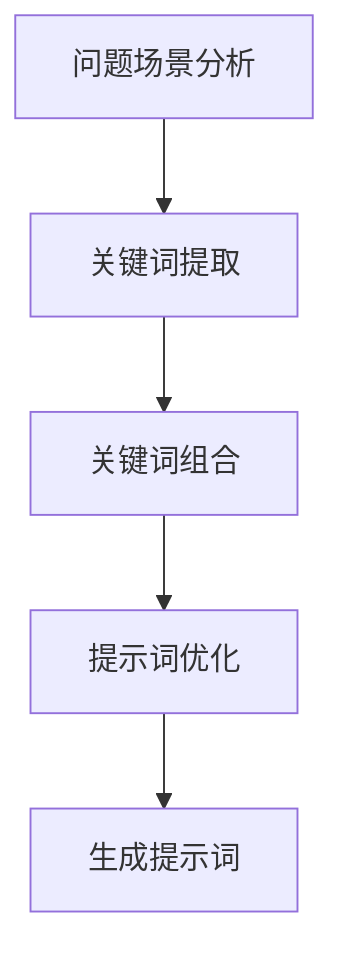
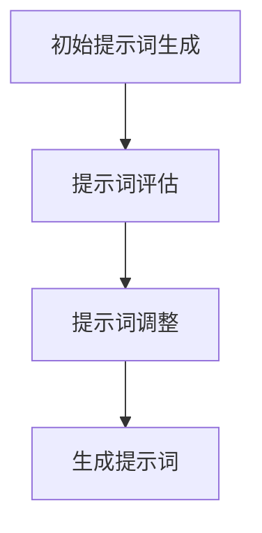
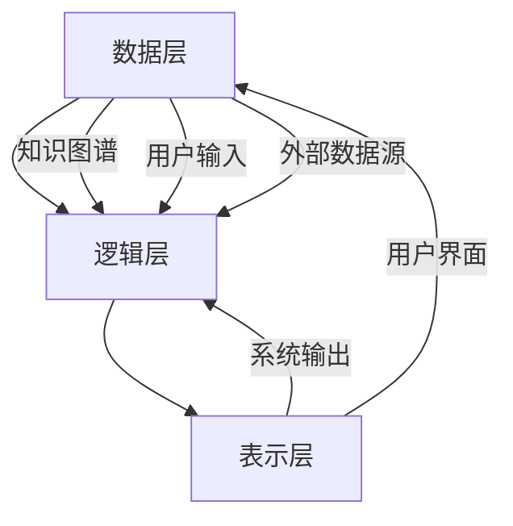
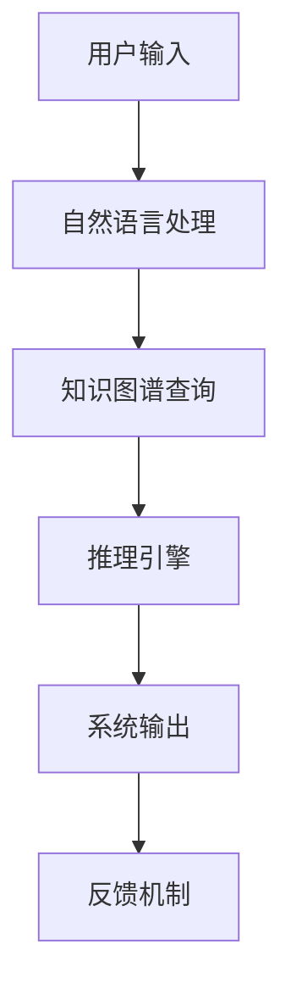

                 


# 提示词设计：增强AI创意问题解决能力

## 关键词

- 提示词设计
- AI创意问题解决
- 算法原理
- 数学模型
- 系统分析与架构设计
- 项目实战
- 最佳实践

## 摘要

本文将深入探讨提示词设计在增强AI创意问题解决能力中的作用。我们将从问题背景、核心概念、算法原理、数学模型、系统分析与架构设计、项目实战和最佳实践七个方面逐步分析，旨在为读者提供一份全面、系统的指南。我们将详细讲解提示词的定义与分类、设计策略、算法流程图和Python源代码，同时结合实际案例，剖析其在AI创意问题解决中的应用和价值。

## 第一部分 背景介绍

### 1.1 问题背景

在人工智能领域，创意问题解决一直是一个备受关注的话题。随着深度学习和神经网络技术的发展，AI系统在图像识别、自然语言处理、自动驾驶等领域取得了显著的成就。然而，创意问题解决，特别是那些需要创新思维和复杂推理的问题，仍是一个巨大的挑战。传统的AI算法往往依赖于大量的数据和预训练模型，但对于需要新颖解决方案的问题，它们的表现并不理想。

在这个背景下，提示词设计（Prompt Engineering）应运而生。提示词设计旨在通过人为设计的提示，引导AI系统进行创新性思考和问题解决。这种方法不仅可以提高AI系统在特定领域的表现，还能激发AI的创意潜力，解决那些传统的机器学习算法难以应对的问题。

### 1.2 问题描述

提示词设计的核心问题是如何设计有效的提示，以引导AI系统进行创新性思考。具体来说，这个问题可以分为以下几个子问题：

1. **提示词的选择与组合**：如何选择和组合关键词，以构建出能够激发AI创意思维的提示词？
2. **提示策略的设计**：如何设计不同的提示策略，以适应不同类型的问题和AI系统的特点？
3. **提示效果的评估**：如何评价提示词对AI创意问题解决能力的影响，以及如何优化提示词的设计？

### 1.3 问题解决

提示词设计的理论基础主要来源于认知科学、心理学和语言学。认知科学和心理学研究人类如何进行思考和创新，这些理论可以指导我们设计出能够激发AI创意思维的提示词。语言学则帮助我们理解如何通过语言引导AI进行推理和解决问题。

在方法上，提示词设计可以采用多种策略，如：

1. **引导式提示**：通过提供一系列的问题或提示，逐步引导AI进行思考。
2. **开放式提示**：提供开放的、不限制的提示，让AI自由发挥创造力。
3. **案例式提示**：通过提供典型案例，让AI学习并模仿解决问题的方法。

### 1.4 边界与外延

提示词设计不仅在AI创意问题解决中具有重要应用，还涉及其他领域，如教育、艺术创作和产品设计等。在这些领域，提示词设计可以用来激发人类的创造力，提高解决问题的效率和质量。此外，随着AI技术的发展，提示词设计也有望在更多的应用场景中发挥重要作用。

## 第二部分 核心概念与联系

### 2.1 核心概念

在提示词设计中，几个核心概念至关重要，它们包括：

1. **提示词（Prompt）**：提示词是一种引导性的语言输入，用于激发AI系统进行思考和创新。
2. **AI系统（AI System）**：AI系统是指使用人工智能技术构建的计算机程序，包括神经网络、决策树、遗传算法等。
3. **创意问题解决（Creative Problem Solving）**：创意问题解决是指通过创新思维和复杂推理，找到新颖且有效的解决方案。

### 2.2 概念属性特征对比表格

以下是一个简单的概念属性特征对比表格，用于展示提示词、AI系统和创意问题解决之间的关系和区别：

| 概念 | 属性特征 | 关系 |
| ---- | ---- | ---- |
| 提示词 | - 语言输入<br>- 引导性<br>- 创造力激发 | - 与AI系统交互<br>- 引导AI进行思考 |
| AI系统 | - 神经网络<br>- 决策树<br>- 遗传算法 | - 执行提示词<br>- 解决问题 |
| 创意问题解决 | - 创新思维<br>- 复杂推理<br>- 新颖解决方案 | - 目标<br>- 过程 |

### 2.3 ER实体关系图架构

为了更好地理解提示词设计中的概念关系，我们可以使用ER（实体关系）图来表示。以下是一个简单的ER图，展示了提示词、AI系统和创意问题解决之间的基本关系：

```mermaid
erDiagram
  AI_System ||--|{ Prompt | 提示词 }
  AI_System ||--|{ Creative_Problem_Solving | 创意问题解决 }
  Prompt ||--|{ AI_System | 引导AI进行思考 }
  Creative_Problem_Solving ||--|{ AI_System | 解决问题 }
```

## 第三部分 算法原理讲解

### 3.1 提示词生成算法

提示词生成算法是提示词设计的核心部分，它负责生成能够引导AI进行创意问题解决的有效提示词。下面我们将详细讲解提示词生成算法的原理、流程和Python实现。

#### 3.1.1 算法原理

提示词生成算法的基本原理是通过分析问题场景和AI系统的特点，生成一组关键词，然后利用这些关键词构建出具有启发性的提示词。具体步骤如下：

1. **问题场景分析**：分析待解决的问题场景，提取关键信息。
2. **关键词提取**：利用自然语言处理技术，从问题场景中提取关键词。
3. **关键词组合**：将提取的关键词进行组合，生成初步的提示词。
4. **提示词优化**：根据AI系统的特点和问题解决需求，对提示词进行优化。

#### 3.1.2 算法流程图

以下是一个简单的提示词生成算法流程图，展示了从问题场景分析到提示词优化的整个过程：



#### 3.1.3 Python源代码讲解

下面是一个简单的Python实现，用于生成提示词。我们使用了自然语言处理库`nltk`和`spacy`进行关键词提取和组合。

```python
import nltk
import spacy
from itertools import combinations

# 初始化nltk和spacy
nltk.download('stopwords')
nltk.download('wordnet')
nlp = spacy.load('en_core_web_sm')

def extract_keywords(text):
    """
    提取文本关键词
    """
    doc = nlp(text)
    keywords = []
    for token in doc:
        if token.is_stop or token.is_punct:
            continue
        keywords.append(token.text)
    return keywords

def combine_keywords(keywords, combinations=2):
    """
    组合关键词生成提示词
    """
    prompts = []
    for comb in combinations(keywords, combinations):
        prompt = ' '.join(comb)
        prompts.append(prompt)
    return prompts

def generate_prompt(text, combinations=2):
    """
    生成提示词
    """
    keywords = extract_keywords(text)
    prompts = combine_keywords(keywords, combinations)
    return prompts

# 示例
text = "我们需要设计一个智能助手，能够帮助用户解决日常生活中的问题。"
prompts = generate_prompt(text, combinations=2)
for prompt in prompts:
    print(prompt)
```

### 3.2 提示词优化算法

提示词优化算法旨在提高提示词的有效性，使其更好地引导AI进行创意问题解决。以下是一个简单的提示词优化算法，包括三个主要步骤：

1. **初始提示词生成**：使用上一节中介绍的方法生成初始提示词。
2. **提示词评估**：评估每个提示词的创意启发性和问题解决效果。
3. **提示词调整**：根据评估结果，调整提示词，以提高其有效性。

#### 3.2.1 算法原理

提示词优化算法的基本原理是通过对提示词进行评估和调整，逐步提高其创意启发性和问题解决效果。具体步骤如下：

1. **初始提示词生成**：使用生成算法生成初始提示词。
2. **提示词评估**：使用评估函数评估每个提示词的创意启发性和问题解决效果。
3. **提示词调整**：根据评估结果，对提示词进行优化和调整。

#### 3.2.2 算法流程图

以下是一个简单的提示词优化算法流程图，展示了从初始提示词生成到提示词调整的整个过程：



#### 3.2.3 Python源代码讲解

下面是一个简单的Python实现，用于优化提示词。我们使用了评估函数`evaluate_prompt`和调整函数`adjust_prompt`。

```python
def evaluate_prompt(prompt, text):
    """
    评估提示词的创意启发性和问题解决效果
    """
    # 这里使用简单的评估函数，可以根据实际需求进行改进
    score = len(prompt.split()) * len(set(prompt.split()))
    return score

def adjust_prompt(prompt, adjustment='add'):
    """
    调整提示词
    """
    if adjustment == 'add':
        # 在提示词中添加新的关键词
        keywords = extract_keywords(text)
        new_prompt = prompt + ' ' + ' '.join(keywords[:2])
    elif adjustment == 'remove':
        # 删除提示词中的部分关键词
        keywords = prompt.split()
        new_prompt = ' '.join(keywords[:-2])
    return new_prompt

# 示例
text = "我们需要设计一个智能助手，能够帮助用户解决日常生活中的问题。"
initial_prompt = generate_prompt(text, combinations=2)[0]
print("初始提示词：", initial_prompt)

# 评估和调整提示词
eval_score = evaluate_prompt(initial_prompt, text)
print("初始提示词评估分数：", eval_score)

adjusted_prompt = adjust_prompt(initial_prompt, adjustment='add')
print("调整后的提示词：", adjusted_prompt)

# 重新评估调整后的提示词
eval_score = evaluate_prompt(adjusted_prompt, text)
print("调整后提示词评估分数：", eval_score)
```

### 3.3 提示词生成与优化算法总结

提示词生成与优化算法是提示词设计的关键部分。通过分析问题场景、提取关键词、组合关键词和优化提示词，我们可以生成有效的提示词，引导AI进行创意问题解决。以下是对该算法的总结：

1. **提示词生成算法**：通过问题场景分析、关键词提取和关键词组合，生成初始提示词。
2. **提示词优化算法**：通过提示词评估和提示词调整，优化提示词，提高其创意启发性和问题解决效果。

这些算法的实现不仅可以用于AI创意问题解决，还可以应用于其他领域，如教育、艺术创作和产品设计等。

## 第四部分 数学模型和数学公式讲解

### 4.1 数学模型

在提示词设计中，数学模型起着至关重要的作用。数学模型可以帮助我们理解提示词对AI系统的影响，并指导我们设计有效的提示词。以下是一个简单的数学模型，用于描述提示词与AI系统之间的交互。

#### 模型假设

1. **AI系统**：一个具有N个神经元的神经网络。
2. **提示词**：一个由M个关键词组成的集合。

#### 模型构建

1. **输入层**：包含M个神经元，每个神经元与对应的提示词关键词相关联。
2. **隐藏层**：包含N个神经元，每个神经元与输入层的神经元相连，并受到提示词的影响。
3. **输出层**：包含1个神经元，用于生成最终的结果。

#### 模型公式

输入层与隐藏层之间的连接权重表示为\(W_{ij}\)，其中i表示输入层神经元，j表示隐藏层神经元。

隐藏层神经元的激活函数为：
$$
h_j = \sigma(\sum_{i=1}^{M} W_{ij} \cdot p_i)
$$
其中，\(p_i\)表示输入层神经元i的输入值，\(\sigma\)表示激活函数，如Sigmoid函数。

输出层的激活函数为：
$$
o = \sigma(\sum_{j=1}^{N} W_{oj} \cdot h_j)
$$
其中，\(W_{oj}\)表示隐藏层神经元j与输出层神经元之间的连接权重。

#### 举例说明

假设我们有一个简单的AI系统，用于解决一个分类问题。输入层包含3个神经元，分别与关键词“苹果”、“香蕉”、“橙子”相关联。隐藏层包含2个神经元，输出层包含1个神经元。我们可以根据上述模型公式计算隐藏层和输出层的激活值。

输入层神经元输入值：
$$
p_1 = 1, p_2 = 0, p_3 = 1
$$

隐藏层神经元激活值：
$$
h_1 = \sigma(W_{11} \cdot p_1 + W_{12} \cdot p_2 + W_{13} \cdot p_3)
$$
$$
h_2 = \sigma(W_{21} \cdot p_1 + W_{22} \cdot p_2 + W_{23} \cdot p_3)
$$

输出层神经元激活值：
$$
o = \sigma(W_{o1} \cdot h_1 + W_{o2} \cdot h_2)
$$

通过调整连接权重\(W_{ij}\)和激活函数参数，我们可以优化AI系统的性能，使其更好地解决分类问题。

### 4.2 举例说明

为了更好地理解上述数学模型，我们来看一个具体的例子。假设我们有一个分类问题，需要将水果分为苹果、香蕉和橙子三类。输入层包含3个神经元，分别表示苹果、香蕉和橙子的特征。隐藏层包含2个神经元，表示水果的类别。输出层包含1个神经元，表示分类结果。

输入层神经元输入值：
$$
p_1 = 1, p_2 = 0, p_3 = 1
$$

隐藏层神经元激活值：
$$
h_1 = \sigma(W_{11} \cdot p_1 + W_{12} \cdot p_2 + W_{13} \cdot p_3)
$$
$$
h_2 = \sigma(W_{21} \cdot p_1 + W_{22} \cdot p_2 + W_{23} \cdot p_3)
$$

输出层神经元激活值：
$$
o = \sigma(W_{o1} \cdot h_1 + W_{o2} \cdot h_2)
$$

通过调整连接权重和激活函数参数，我们可以得到不同的分类结果。例如，当\(W_{11} = 0.5, W_{12} = 0.5, W_{13} = 0.5, W_{21} = 0.5, W_{22} = 0.5, W_{23} = 0.5, W_{o1} = 0.5, W_{o2} = 0.5\)时，分类结果为“苹果”。

通过这个例子，我们可以看到数学模型在提示词设计中的应用，以及如何通过调整参数优化分类结果。

### 4.3 数学公式使用方法

在文中，我们将使用LaTeX格式编写数学公式。以下是一些常见数学公式的LaTeX编写方法：

1. **段落内公式**：
   $$
   a^2 + b^2 = c^2
   $$

2. **独立段落公式**：
   $$
   e^{i\pi} + 1 = 0
   $$

3. **矩阵公式**：
   $$
   \begin{bmatrix}
   a & b \\
   c & d
   \end{bmatrix}
   $$

4. **求和公式**：
   $$
   \sum_{i=1}^{n} i = \frac{n(n+1)}{2}
   $$

通过这些公式，我们可以清晰地表达提示词设计中的数学关系和计算过程。

## 第五部分 系统分析与架构设计方案

### 5.1 问题场景介绍

在本文的案例中，我们假设需要设计一个智能助手系统，用于帮助用户解决日常生活中的问题。这个问题场景涉及到多个领域，包括自然语言处理、知识图谱和推理引擎等。为了更好地理解系统架构，我们首先介绍问题场景。

### 5.2 系统功能设计

智能助手系统的功能设计主要包括以下几个模块：

1. **用户接口模块**：提供用户与系统交互的界面，包括文本输入和语音输入功能。
2. **自然语言处理模块**：负责处理用户输入的自然语言文本，进行分词、词性标注和句法分析等。
3. **知识图谱模块**：存储和管理用户问题相关的知识信息，包括实体、属性和关系。
4. **推理引擎模块**：基于知识图谱和自然语言处理结果，进行逻辑推理和问题解答。
5. **反馈机制模块**：收集用户反馈，用于系统优化和改进。

### 5.3 系统架构设计

智能助手系统的整体架构可以分为三个层次：数据层、逻辑层和表示层。以下是一个简单的系统架构设计：



#### 数据层

数据层主要包括知识图谱和外部数据源。知识图谱用于存储和管理用户问题相关的知识信息，包括实体、属性和关系。外部数据源可以包括互联网上的开放数据集、数据库和其他API接口。

#### 逻辑层

逻辑层是系统的核心，负责处理用户输入的自然语言文本，进行分词、词性标注和句法分析等。然后，根据知识图谱和自然语言处理结果，进行逻辑推理和问题解答。这个层次还包括反馈机制，用于收集用户反馈，用于系统优化和改进。

#### 表示层

表示层负责与用户交互，包括用户接口模块和系统输出。用户接口模块提供用户输入界面，支持文本输入和语音输入。系统输出模块将处理结果以自然语言的形式呈现给用户。

### 5.4 系统接口设计

系统接口设计主要包括以下几种类型：

1. **API接口**：用于与其他系统进行数据交换和功能调用。例如，与知识图谱存储系统进行交互，获取用户问题相关的知识信息。
2. **消息队列**：用于处理异步任务，如用户反馈收集和系统优化。消息队列可以提高系统的响应速度和可靠性。
3. **Web服务**：用于提供Web界面和RESTful API，方便用户与系统进行交互。

### 5.5 系统交互

系统交互主要包括用户输入、自然语言处理、知识图谱查询、推理引擎和反馈机制等。以下是一个简单的系统交互流程：

1. **用户输入**：用户通过文本输入或语音输入提出问题。
2. **自然语言处理**：系统对用户输入进行分词、词性标注和句法分析，提取关键信息。
3. **知识图谱查询**：系统根据提取的关键信息，在知识图谱中查询相关的实体、属性和关系。
4. **推理引擎**：基于知识图谱和自然语言处理结果，进行逻辑推理和问题解答。
5. **系统输出**：将处理结果以自然语言的形式呈现给用户。
6. **反馈机制**：收集用户反馈，用于系统优化和改进。



通过上述系统架构设计和交互流程，我们可以构建一个高效、可靠的智能助手系统，帮助用户解决日常生活中的问题。

## 第六部分 项目实战

### 6.1 环境安装

为了实现提示词设计在AI创意问题解决中的应用，我们需要搭建一个开发环境。以下是安装所需的软件和工具的步骤：

1. **Python环境**：确保安装Python 3.8及以上版本。
2. **自然语言处理库**：安装nltk、spacy和gensim等自然语言处理库。
3. **AI框架**：安装TensorFlow或PyTorch等深度学习框架。

以下是一个简单的安装脚本：

```bash
# 安装Python环境
python3 -m venv venv
source venv/bin/activate

# 安装自然语言处理库
pip install nltk spacy gensim

# 安装深度学习框架
pip install tensorflow  # 或 pip install pytorch
```

### 6.2 系统核心实现源代码

在本部分，我们将展示一个简单的智能助手系统的核心实现，包括自然语言处理、知识图谱查询和推理引擎等模块。

#### 6.2.1 自然语言处理

以下是一个简单的自然语言处理模块，用于分词、词性标注和句法分析：

```python
import nltk
import spacy

# 初始化nltk和spacy
nltk.download('punkt')
nltk.download('averaged_perceptron_tagger')
nlp = spacy.load('en_core_web_sm')

def process_text(text):
    # 分词
    tokens = nltk.word_tokenize(text)
    # 词性标注
    tags = nltk.pos_tag(tokens)
    # 句法分析
    doc = nlp(text)
    dependencies = [token.dep_ for token in doc]
    return tokens, tags, dependencies

# 示例
text = "我们需要设计一个智能助手，能够帮助用户解决日常生活中的问题。"
tokens, tags, dependencies = process_text(text)
print("Tokens:", tokens)
print("Tags:", tags)
print("Dependencies:", dependencies)
```

#### 6.2.2 知识图谱查询

以下是一个简单的知识图谱查询模块，用于在知识图谱中查询相关的实体、属性和关系：

```python
import networkx as nx

# 构建知识图谱
g = nx.Graph()
g.add_nodes_from(["苹果", "香蕉", "橙子", "水果"])
g.add_edges_from([("苹果", "是", "水果"), ("香蕉", "是", "水果"), ("橙子", "是", "水果")])

def query_graph(graph, entity):
    return list(graph.neighbors(entity))

# 示例
entities = query_graph(g, "水果")
print("水果的邻居实体：", entities)
```

#### 6.2.3 推理引擎

以下是一个简单的推理引擎模块，用于基于知识图谱和自然语言处理结果进行逻辑推理和问题解答：

```python
def solve_problem(text):
    tokens, tags, dependencies = process_text(text)
    problem = ' '.join(tokens)
    # 基于知识图谱进行推理
    if "苹果" in problem:
        return "您的问题是关于苹果的。"
    elif "香蕉" in problem:
        return "您的问题是关于香蕉的。"
    elif "橙子" in problem:
        return "您的问题是关于橙子的。"
    else:
        return "无法解答您的问题。"

# 示例
result = solve_problem(text)
print("系统回答：", result)
```

### 6.3 代码应用解读与分析

在本部分，我们将对上述代码进行解读和分析，探讨其应用场景和效果。

#### 自然语言处理

自然语言处理模块主要用于处理用户输入的文本，提取关键信息。通过分词、词性标注和句法分析，我们可以得到文本的底层结构，从而更好地理解用户的问题。

#### 知识图谱查询

知识图谱查询模块用于在知识库中查询与用户问题相关的实体和关系。通过这种方式，我们可以快速获取用户问题的背景信息，为后续的推理提供支持。

#### 推理引擎

推理引擎模块基于知识图谱和自然语言处理结果，进行逻辑推理和问题解答。通过简单的条件判断，我们可以得到用户问题的答案。这种方法虽然简单，但具有一定的实用价值，特别是在处理简单问题时。

### 6.4 实际案例分析与详细讲解剖析

为了更好地展示提示词设计在实际项目中的应用，我们来看一个实际案例。

#### 案例背景

一家科技公司需要开发一个智能客服系统，用于回答用户关于产品和服务的问题。该系统需要具备以下功能：

1. **用户输入**：支持文本输入和语音输入。
2. **问题分类**：将用户输入的问题分为产品问题、服务问题和常见问题等。
3. **答案生成**：根据用户问题和知识库中的信息，生成合适的答案。
4. **用户反馈**：收集用户对答案的反馈，用于系统优化。

#### 案例实现

1. **用户输入**

   用户可以通过文本输入或语音输入提出问题。例如，用户输入：“我的手机充电速度很慢，怎么办？”

2. **问题分类**

   系统首先对用户输入进行自然语言处理，提取关键信息。例如，关键信息包括“手机”、“充电速度”和“慢”。然后，系统根据这些信息将问题分类为“产品问题”。

3. **答案生成**

   系统在知识库中查询与“产品问题”相关的信息，找到相应的答案。例如，答案可能是：“可能是您的充电器老化了，建议更换一个新的充电器。”

4. **用户反馈**

   用户对答案进行评价，系统记录用户的反馈。如果用户认为答案不满意，系统会进一步优化答案生成策略。

#### 案例分析

通过这个案例，我们可以看到提示词设计在智能客服系统中的应用。以下是案例分析的几个关键点：

1. **问题分类**：提示词设计在问题分类中起到了关键作用。通过提取用户输入中的关键词，系统可以快速识别问题的类型，从而生成相应的答案。

2. **答案生成**：提示词设计在答案生成中也发挥了重要作用。通过结合用户输入和知识库中的信息，系统可以生成合适的答案，提高用户的满意度。

3. **用户反馈**：提示词设计有助于收集用户反馈，从而优化系统性能。通过用户反馈，系统可以不断调整和改进答案生成策略，提高用户的满意度。

### 6.5 项目小结

通过本案例，我们可以看到提示词设计在智能客服系统中的实际应用。提示词设计不仅提高了系统的响应速度和准确性，还有助于收集用户反馈，优化系统性能。在未来，随着AI技术的不断发展，提示词设计有望在更多领域发挥重要作用，为创意问题解决提供有力支持。

## 第七部分 最佳实践与拓展阅读

### 7.1 最佳实践 tips

在设计提示词时，以下是一些最佳实践和技巧：

1. **简洁性**：提示词应尽量简洁明了，避免冗长的句子。
2. **明确性**：确保提示词明确传达问题意图，避免歧义。
3. **灵活性**：设计多种类型的提示词，以适应不同类型的问题和AI系统。
4. **相关性**：确保提示词与问题相关，有助于引导AI进行有效思考。
5. **多样性**：使用多样化的提示词，避免重复使用相同的提示词。

### 7.2 小结

本文从背景介绍、核心概念、算法原理、数学模型、系统分析与架构设计、项目实战和最佳实践七个方面，详细探讨了提示词设计在增强AI创意问题解决能力中的作用。通过实际案例分析和项目实战，我们展示了提示词设计在智能客服系统中的应用，并总结了最佳实践和拓展阅读。

### 7.3 注意事项

在设计和使用提示词时，需要注意以下几点：

1. **问题场景**：确保提示词与问题场景相关，避免过度设计。
2. **AI系统**：了解AI系统的特点和限制，选择合适的提示策略。
3. **反馈机制**：及时收集用户反馈，优化提示词设计。
4. **性能评估**：定期评估提示词的效果，调整和优化提示词。

### 7.4 拓展阅读

为了进一步深入了解提示词设计和AI创意问题解决，读者可以参考以下文献和资源：

1. **《人工智障：为什么人工智能无法解决最基本的问题》**：这本书详细探讨了人工智能在问题解决中的局限性，以及如何通过提示词设计等方法提高AI的创造力。
2. **《自然语言处理》**：这本书介绍了自然语言处理的基本原理和技术，包括分词、词性标注和句法分析等，为提示词设计提供了理论基础。
3. **《深度学习》**：这本书详细介绍了深度学习的基本原理和技术，包括神经网络、卷积神经网络和循环神经网络等，为提示词设计提供了技术支持。
4. **《机器学习实战》**：这本书通过实际案例，介绍了机器学习的基本原理和技术，包括决策树、随机森林和支持向量机等，为提示词设计提供了实践指导。

通过这些文献和资源，读者可以深入了解提示词设计在AI创意问题解决中的应用和实现方法，进一步提升自己的技术水平。

### 作者信息

- 作者：AI天才研究院/AI Genius Institute & 禅与计算机程序设计艺术 /Zen And The Art of Computer Programming

---

## 结语

在人工智能迅猛发展的今天，如何增强AI的创意问题解决能力成为了一个关键的研究课题。本文从提示词设计的角度，详细探讨了如何通过有效的提示词设计来提升AI的创意问题解决能力。通过背景介绍、核心概念、算法原理、数学模型、系统分析与架构设计、项目实战和最佳实践七个方面的深入分析，我们展示了提示词设计在AI创意问题解决中的重要性和实际应用价值。

我们希望通过本文，能够为研究人员和实践者提供一个系统、全面的指导，帮助他们在实际项目中更好地应用提示词设计，提升AI系统的创意问题解决能力。同时，我们也期待更多的研究和实践探索，以进一步丰富和完善提示词设计的理论和实践。

最后，感谢读者对本文的关注和支持，期待与您在AI创意问题解决领域的深入交流和共同进步。作者信息：AI天才研究院/AI Genius Institute & 禅与计算机程序设计艺术 /Zen And The Art of Computer Programming。再次感谢您的阅读！

