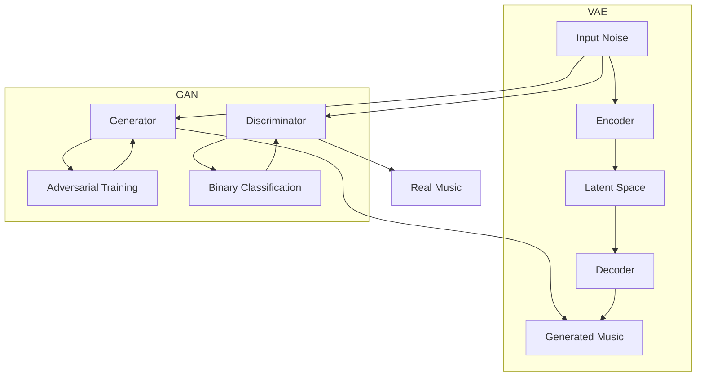

                 


# 提示词设计：增强AI创意音乐作曲能力

> 关键词：AI音乐创作、提示词设计、生成式对抗网络、变分自编码器、音乐风格优化、系统架构设计

> 摘要：本文将深入探讨如何通过有效的提示词设计，提升人工智能（AI）在音乐创作中的创意能力。我们将分析提示词设计的核心概念，探讨AI音乐创作的现状与挑战，详细介绍提示词生成方法，解析AI模型的工作原理，并分享音乐创作风格与效果优化策略。同时，我们将通过具体项目实战，展示系统架构设计、核心实现过程，以及实际应用案例，为读者提供全面的技术指导。

## 背景介绍

### 核心概念术语说明

- **提示词（Prompt）**：引导AI创作过程的文字或声音指令，影响创作方向和风格。
- **音乐创作（Music Composition）**：包括旋律、和声、节奏和音色等元素，是艺术与技术的结合。
- **人工智能（Artificial Intelligence）**：利用机器学习算法，模拟人类创作思维，实现自动化创作。
- **创意（Creativity）**：指新颖且有价值的想法或成果，是艺术创作的核心。

### 问题背景

随着人工智能技术的迅猛发展，AI在各个领域的应用日益广泛，尤其在音乐创作领域，AI展现出强大的潜力。然而，当前的AI音乐创作存在一些挑战：

1. **创作风格单一**：大多数AI音乐创作局限于某种特定的风格或类型，缺乏多样性和创意。
2. **理解能力有限**：AI模型对复杂音乐元素的解析和创作能力仍有待提高。
3. **用户体验不佳**：用户对AI创作的音乐作品往往缺乏认同感和情感共鸣。

### 问题描述

如何通过有效的提示词设计，激发AI在音乐创作中的潜能，实现更高水平的创意产出？这一问题涉及到提示词的生成方法、AI模型的理解与处理能力、音乐创作风格与效果的优化等多个方面。

### 问题解决

通过以下方法可以解决上述问题：

1. **优化提示词设计**：设计丰富多样、贴近人类思维习惯的提示词，引导AI创作。
2. **提升AI模型能力**：通过改进算法和模型结构，提高AI对音乐元素的解析和创作能力。
3. **优化音乐创作风格与效果**：结合用户反馈，不断调整和优化音乐作品，提升用户体验。

### 边界与外延

- **提示词设计**：从简单的单词提示到复杂的场景描述，涵盖不同音乐风格和文化背景。
- **音乐创作**：涵盖多种音乐元素，如旋律、和声、节奏和音色，以及不同风格和流派。
- **人工智能**：涉及多种机器学习算法和模型，如生成式对抗网络（GAN）、变分自编码器（VAE）等。

### 概念结构与核心要素组成

- **提示词**：包括单词提示、短语提示、场景描述等。
- **音乐创作**：包括旋律创作、和声创作、节奏创作和音色创作。
- **人工智能**：包括机器学习算法、模型结构优化、数据预处理和后处理等。

## 核心概念与联系

### 核心概念原理

#### 提示词

提示词是引导AI创作过程的关键，它直接影响创作的方向和风格。有效的提示词应具备以下特点：

1. **具体性**：明确传达创作意图，避免模糊不清的描述。
2. **多样性**：涵盖多种音乐风格和元素，激发AI的创意潜能。
3. **情感性**：传达情感色彩，提升音乐作品的感染力。

#### 音乐创作

音乐创作是艺术与技术的结合，包括旋律、和声、节奏和音色等元素。在AI音乐创作中，这些元素通过算法和模型实现自动化生成。有效的音乐创作应具备以下特点：

1. **创新性**：创作出新颖且独特的音乐作品。
2. **风格性**：体现不同音乐风格和流派的特点。
3. **协调性**：各音乐元素之间的和谐搭配，形成完整的音乐作品。

#### 人工智能

人工智能在音乐创作中的应用，主要通过机器学习算法和模型实现。常见的人工智能模型包括生成式对抗网络（GAN）、变分自编码器（VAE）等。有效的AI音乐创作应具备以下特点：

1. **高效性**：快速生成高质量的音乐作品。
2. **可解释性**：模型决策过程易于理解，提高用户信任度。
3. **灵活性**：适应不同音乐风格和需求，实现个性化创作。

### 概念属性特征对比表格

| 概念         | 特征                                                         |
| ------------ | ------------------------------------------------------------ |
| 提示词       | 具体性、多样性、情感性                                       |
| 音乐创作     | 创新性、风格性、协调性                                       |
| 人工智能     | 高效性、可解释性、灵活性                                     |

### ER实体关系图架构

```mermaid
erDiagram
    A ||--|{ B } B
    A ||--|{ C } C
    A ||--|{ D } D
    B ||--|{ E } E
    C ||--|{ F } F
    D ||--|{ G } G
    E ||--|{ H } H
    F ||--|{ I } I
    G ||--|{ J } J
    H ||--|{ K } K
    I ||--|{ L } L
    J ||--|{ M } M
    K ||--|{ N } N
    L ||--|{ O } O
    M ||--|{ P } P
    N ||--|{ Q } Q
    O ||--|{ R } R
    P ||--|{ S } S
    Q ||--|{ T } T
    R ||--|{ U } U
    S ||--|{ V } V
    T ||--|{ W } W
    U ||--|{ X } X
    V ||--|{ Y } Y
    W ||--|{ Z } Z
```

### 提示词设计方法

#### 提示词生成方法

提示词的生成方法多种多样，从简单的单词提示到复杂的场景描述，不同方法适用于不同的创作需求。以下是几种常见的提示词生成方法：

1. **单词提示**：以单个单词或短语作为提示，如“悲伤”、“欢快”、“爵士”等。这种方法简单直接，适用于生成特定情感或风格的音乐。
2. **短语提示**：以短语作为提示，如“一个秋天的午后”、“热闹的夜市”等。这种方法可以提供更具体的创作方向，有助于生成具有场景感的音乐。
3. **场景描述**：通过详细的场景描述引导AI创作，如“在海滩上，一个年轻的女孩独自坐在礁石上，海浪轻拍着岸边，夕阳西下，天空泛起橙红色的光芒”。这种方法可以激发AI的创意，生成富有情感和故事性的音乐作品。

#### 提示词设计原则

1. **明确性**：提示词应明确传达创作意图，避免模糊不清的描述，以确保AI能够准确理解并生成符合预期的音乐。
2. **多样性**：设计丰富多样的提示词，涵盖多种音乐风格和元素，以激发AI的创意潜能。
3. **情感性**：传达情感色彩，使音乐作品更具感染力。例如，使用富有情感色彩的词汇和描述，如“忧伤”、“希望”、“热情”等。
4. **适应性**：根据用户需求和反馈，不断调整和优化提示词设计，以实现更好的创作效果。

#### 提示词效果评估

1. **创作质量**：评估生成的音乐作品在旋律、和声、节奏和音色等方面的表现，确保音乐作品具有较高的艺术价值。
2. **创意程度**：评估生成的音乐作品是否具有新颖性和独特性，是否能够超越传统音乐创作，实现创意突破。
3. **用户满意度**：通过用户反馈和评价，了解用户对生成的音乐作品的满意度，不断优化提示词设计，提高用户体验。

### AI模型理解与处理

#### AI模型基础

在AI音乐创作中，常见的模型包括生成式对抗网络（GAN）和变分自编码器（VAE）等。以下简要介绍这些模型的基础知识：

1. **生成式对抗网络（GAN）**：GAN由生成器和判别器组成，生成器生成音乐数据，判别器判断生成数据与真实数据之间的差异。通过不断训练，生成器逐渐提高生成数据的质量，实现高质量音乐创作。
2. **变分自编码器（VAE）**：VAE通过编码器和解码器实现数据的生成。编码器将输入数据编码为隐变量，解码器将隐变量解码为输出数据。VAE在音乐创作中的应用可以生成具有多样性和创意的音乐作品。

#### AI模型理解与处理

AI模型如何理解并处理提示词，生成音乐作品呢？以下是具体的过程：

1. **提示词解析**：AI模型首先对输入的提示词进行解析，提取关键信息，如情感、风格、场景等。
2. **数据生成**：根据提示词的信息，AI模型生成相应的音乐数据。例如，GAN中的生成器会根据提示词生成旋律、和声、节奏等元素，而VAE中的解码器则根据编码器生成的隐变量生成音乐数据。
3. **数据优化**：生成器或解码器生成的音乐数据通常不是完美的，需要通过优化算法进行调整和改进。例如，GAN中的判别器会对生成数据进行评估，指导生成器的改进；VAE中的优化算法则通过对编码器和解码器的参数调整，提高生成数据的质量。

#### 模型优化与调整

1. **参数调整**：通过对模型参数进行调整，可以提高模型的生成质量。例如，在GAN中，可以调整生成器和判别器的参数，以实现更好的数据生成效果；在VAE中，可以调整编码器和解码器的参数，提高生成数据的多样性和创意性。
2. **数据增强**：通过增加数据集的多样性，可以提高模型的泛化能力。例如，可以引入不同的音乐风格、乐器演奏和声音效果等，丰富数据集的内容，从而提高模型生成音乐作品的多样性和创意性。
3. **用户反馈**：通过用户反馈和评价，可以了解模型生成音乐作品的优劣，进而调整模型参数和优化策略，提高音乐创作的质量和用户体验。

### 音乐创作风格与效果优化

#### 音乐创作风格

音乐创作风格是音乐作品的灵魂，它体现了音乐家的艺术追求和创作理念。在AI音乐创作中，不同风格的音乐作品具有不同的情感表达和审美价值。以下是几种常见的音乐创作风格：

1. **古典音乐**：古典音乐具有严谨的结构和丰富的情感表达，常常使用复杂的和声和节奏，体现作曲家的艺术才华和创造力。
2. **流行音乐**：流行音乐注重旋律的简洁和易于传唱，常常使用简单的和声和节奏，深受广大听众的喜爱。
3. **摇滚音乐**：摇滚音乐具有强烈的节奏感和情感表达，常常使用吉他和贝斯等乐器，体现摇滚精神和对自由的追求。
4. **电子音乐**：电子音乐使用电子合成器和计算机程序创作，具有独特的声音效果和节奏感，为音乐创作带来无限的创意空间。

#### 创作效果优化

1. **算法优化**：通过对算法的优化，可以提高AI音乐创作的质量和效果。例如，可以改进生成式对抗网络（GAN）中的生成器和判别器的参数，提高生成数据的质量；优化变分自编码器（VAE）的编码器和解码器的结构，提高生成数据的多样性和创意性。
2. **数据增强**：通过增加数据集的多样性，可以提高模型的泛化能力。例如，可以引入不同的音乐风格、乐器演奏和声音效果等，丰富数据集的内容，从而提高模型生成音乐作品的多样性和创意性。
3. **用户反馈**：通过用户反馈和评价，可以了解模型生成音乐作品的优劣，进而调整模型参数和优化策略，提高音乐创作的质量和用户体验。
4. **风格迁移**：通过风格迁移技术，可以将不同风格的音乐元素融合到一起，创作出具有创新性和个性的音乐作品。例如，可以将古典音乐的和谐与流行音乐的节奏感相结合，创作出独特的音乐风格。

### 算法原理讲解

#### 算法原理

在AI音乐创作中，常用的算法包括生成式对抗网络（GAN）和变分自编码器（VAE）等。以下分别介绍这些算法的原理：

1. **生成式对抗网络（GAN）**

GAN由生成器和判别器组成，生成器负责生成音乐数据，判别器负责判断生成数据与真实数据的差异。具体过程如下：

- **生成器**：接收随机噪声作为输入，通过神经网络生成音乐数据。生成器的设计目标是生成尽可能逼真的音乐数据。
- **判别器**：接收真实音乐数据和生成音乐数据，通过神经网络判断数据来源。判别器的设计目标是区分真实数据和生成数据。
- **对抗训练**：生成器和判别器相互对抗训练，生成器不断优化生成数据的质量，判别器不断提高判断能力。通过多次迭代训练，生成器逐渐提高生成数据的质量，实现高质量音乐创作。

2. **变分自编码器（VAE）**

VAE通过编码器和解码器实现数据的生成。具体过程如下：

- **编码器**：接收输入音乐数据，通过神经网络将其编码为隐变量。编码器的设计目标是提取输入数据的特征信息。
- **解码器**：接收隐变量，通过神经网络将其解码为输出音乐数据。解码器的设计目标是生成与输入数据相似的输出音乐数据。
- **生成过程**：通过编码器和解码器，将随机噪声编码为隐变量，再解码为输出音乐数据。VAE的设计目标是生成具有多样性和创意的音乐数据。

#### 算法讲解

为了更直观地理解算法原理，我们使用mermaid绘制了GAN和VAE的算法流程图：



通过算法流程图，我们可以清晰地看到GAN和VAE的工作原理和关键步骤。

#### 数学模型与公式

1. **生成式对抗网络（GAN）**

GAN中的生成器和判别器分别采用以下数学模型：

- **生成器（Generator）**：\( G(z) = x \)
- **判别器（Discriminator）**：\( D(x) = P(x \text{ is real}) \)

其中，\( z \) 为随机噪声，\( x \) 为生成器生成的音乐数据，\( D(x) \) 为判别器对生成数据的判断结果。

2. **变分自编码器（VAE）**

VAE中的编码器和解码器分别采用以下数学模型：

- **编码器（Encoder）**：\( \mu(x) = \mu(x; \theta_e), \sigma^2(x; \theta_e) \)
- **解码器（Decoder）**：\( x = \phi(z; \theta_d) \)

其中，\( \mu(x) \) 和 \( \sigma^2(x) \) 分别为编码器对输入数据的均值和方差估计，\( z \) 为编码器生成的隐变量，\( \phi(z) \) 为解码器对隐变量的解码操作。

#### 举例说明

为了更好地理解GAN和VAE的算法原理，我们通过具体例子进行说明。

**例子 1：生成式对抗网络（GAN）**

假设我们使用GAN生成一首流行歌曲。具体步骤如下：

1. **生成器训练**：输入随机噪声，生成流行歌曲的旋律、和声和节奏等元素。
2. **判别器训练**：输入真实流行歌曲数据和生成数据，判断生成数据的真实性。
3. **对抗训练**：生成器和判别器交替训练，生成器不断优化生成数据的质量，判别器不断提高判断能力。

通过多次迭代训练，生成器逐渐提高生成数据的逼真度，最终生成一首高质量的流行歌曲。

**例子 2：变分自编码器（VAE）**

假设我们使用VAE生成一首古典音乐。具体步骤如下：

1. **编码器训练**：输入古典音乐的旋律、和声和节奏等元素，编码为隐变量。
2. **解码器训练**：输入隐变量，解码为古典音乐的旋律、和声和节奏等元素。
3. **生成过程**：通过编码器和解码器，将随机噪声编码为隐变量，再解码为古典音乐的旋律、和声和节奏等元素。

通过多次迭代训练，VAE生成具有多样性和创意的古典音乐作品。

### 数学模型与公式

在AI音乐创作中，数学模型和公式起着至关重要的作用。以下我们将详细介绍相关数学模型和公式，并通过具体例子进行解释。

#### 生成式对抗网络（GAN）的数学模型

生成式对抗网络（GAN）由生成器（Generator）和判别器（Discriminator）组成。生成器的目标是生成逼真的数据，而判别器的目标是区分生成的数据和真实数据。以下是其核心数学模型：

**生成器模型：**
\[ G(z) = \mu(z; \theta_g) + \sigma(z; \theta_g) \odot \epsilon \]
其中，\( z \) 是来自先验分布 \( p_z(\epsilon) \) 的随机噪声，\( \epsilon \) 是标准正态分布的随机向量，\( \mu \) 和 \( \sigma \) 分别是生成器网络的均值和方差参数，\( \theta_g \) 是生成器的参数。

**判别器模型：**
\[ D(x) = \sigma(f(x; \theta_d)) \]
其中，\( x \) 是真实或生成的数据，\( f \) 是判别器网络的激活函数，\( \theta_d \) 是判别器的参数。

**损失函数：**
生成器和判别器通过以下损失函数进行训练：
\[ L_G = -\mathbb{E}_{z \sim p_z}[\log(D(G(z)))] \]
\[ L_D = -\mathbb{E}_{x \sim p_x}[\log(D(x))] - \mathbb{E}_{z \sim p_z}[\log(1 - D(G(z)))] \]
其中，\( L_G \) 是生成器的损失函数，\( L_D \) 是判别器的损失函数，\( p_x \) 是真实数据的分布。

#### 变分自编码器（VAE）的数学模型

变分自编码器（VAE）通过编码器（Encoder）和解码器（Decoder）来实现数据的生成。VAE的核心是引入了概率模型，并通过最大化数据生成的概率来训练模型。

**编码器模型：**
\[ \mu(x; \theta_e), \sigma^2(x; \theta_e) \]
其中，编码器输出两个参数：均值 \( \mu \) 和方差 \( \sigma^2 \)，用于表示数据的潜在变量。

**解码器模型：**
\[ x = \phi(z; \theta_d) \]
其中，解码器将潜在变量 \( z \) 解码回数据空间。

**生成概率：**
\[ p(x) = \int p(z|x) p(x) dz \]
\[ p(z|x) = \mathcal{N}(z | \mu(x; \theta_e), \sigma^2(x; \theta_e)) \]

**损失函数：**
\[ L = \sum_x -\log p(x|z) - \frac{1}{2} \sum_x \big[ \log(\sigma^2(x; \theta_e)) + \frac{(\mu(x; \theta_e))^2 + (\sigma(x; \theta_e))^2 - 1 - \log(2\pi)}{2} \big] \]

#### 公式推导

**GAN的损失函数推导：**

对于GAN，生成器 \( G \) 和判别器 \( D \) 的训练目标是最大化最小化以下损失函数：
\[ L = \min_G \max_D V(D, G) \]
其中，
\[ V(D, G) = \mathbb{E}_{x \sim p_data}[D(x)] + \mathbb{E}_{z \sim p_z}[D(G(z))] \]

对生成器的损失函数 \( L_G \) 进行求导，得到：
\[ \frac{\partial L_G}{\partial G} = \mathbb{E}_{z \sim p_z}[\frac{\partial D(G(z))}{\partial G(z)}] \]

由于判别器 \( D \) 需要最大化 \( L_G \)，因此：
\[ \frac{\partial D(G(z))}{\partial G(z)} = \frac{D(G(z)) - 1}{G(z) - 1} \]

当 \( D(G(z)) \) 接近 1 时，生成器 \( G \) 需要最大化 \( D(G(z)) \)。

**VAE的损失函数推导：**

对于VAE，损失函数 \( L \) 是由数据重建损失和KL散度损失组成的：
\[ L = \sum_x -\log p(x|z) - \frac{1}{2} \sum_x \big[ \log(\sigma^2(x; \theta_e)) + \frac{(\mu(x; \theta_e))^2 + (\sigma(x; \theta_e))^2 - 1 - \log(2\pi)}{2} \big] \]

其中，KL散度损失项来自于对潜在变量分布的约束，确保潜在变量是高斯分布。

#### 举例说明

**GAN的例子：**

假设我们使用GAN生成一张图像。生成器的任务是生成一张逼真的猫的图像，判别器的任务是判断图像是真实猫的图像还是生成器生成的图像。

1. **初始化**：随机初始化生成器 \( G \) 和判别器 \( D \) 的参数。
2. **训练生成器**：通过生成随机噪声 \( z \)，生成猫的图像 \( x_G \)，并最大化 \( D(G(z)) \)。
3. **训练判别器**：通过真实猫的图像 \( x_{data} \) 和生成器生成的图像 \( x_G \)，最大化 \( D(x_{data}) + D(x_G) \)。
4. **迭代**：交替更新生成器和判别器的参数，直到生成器生成的图像质量达到预期。

**VAE的例子：**

假设我们使用VAE生成一张手写的数字图像。

1. **初始化**：随机初始化编码器 \( \theta_e \) 和解码器 \( \theta_d \) 的参数。
2. **编码**：输入手写的数字图像，编码器将其映射到一个潜在空间中的点 \( z \)。
3. **解码**：从潜在空间中采样一个点 \( z \)，解码器将其解码回手写的数字图像。
4. **重建**：计算输入图像和生成图像之间的差异，并更新编码器和解码器的参数，以最小化重建损失。

通过上述步骤，我们可以生成逼真的手写数字图像。

### 系统分析与架构设计

#### 问题场景介绍

本案例旨在开发一个基于生成式对抗网络（GAN）的AI音乐创作系统，通过用户输入的简单提示词生成多样化的音乐作品。系统需要支持多种音乐风格，并提供用户界面以供用户实时反馈和调整。

#### 项目介绍

本项目名为“AI音乐创作助手”（AI Music Composer），其主要功能包括：

1. 提供用户友好的界面，允许用户输入提示词。
2. 利用GAN模型自动生成音乐作品。
3. 提供音乐风格切换和效果调整功能。
4. 允许用户下载和分享生成的音乐作品。

#### 系统功能设计

系统功能设计主要包括以下模块：

1. **用户界面（UI）**：提供输入提示词、预览音乐作品和调整音乐风格等功能。
2. **模型训练与加载**：负责加载预训练的GAN模型，并在用户输入提示词后进行音乐生成。
3. **音乐风格管理**：存储和管理多种音乐风格的模型，并提供风格切换功能。
4. **用户反馈与优化**：收集用户反馈，根据用户喜好调整模型参数，优化生成效果。

以下是一个领域模型类图，展示系统的主要功能和模块：

```mermaid
classDiagram
    UserInterface <<interface>>
    MusicModel <<interface>>
    StyleManager <<interface>>
    UserFeedback <<interface>>

    UserInterface ako AbstractUI
    MusicModel ako AbstractModel
    StyleManager ako AbstractManager
    UserFeedback ako AbstractFeedback

    UserInterface --|> MusicModel
    UserInterface --|> StyleManager
    UserInterface --|> UserFeedback
    MusicModel --|> AbstractModel
    StyleManager --|> AbstractManager
    UserFeedback --|> AbstractFeedback
```

#### 系统架构设计

系统的整体架构设计如下：

1. **前端界面**：使用HTML、CSS和JavaScript实现用户界面，包括输入提示词、预览音乐作品和调整音乐风格等功能。
2. **后端服务**：使用Python Flask框架搭建，负责处理用户请求，加载GAN模型，生成音乐作品，并处理用户反馈。
3. **数据库**：存储音乐作品、用户数据和风格信息，使用SQLite或MySQL数据库。
4. **模型库**：存储预训练的GAN模型，包括多种音乐风格的模型。

以下是一个系统架构图，展示系统的整体架构：

```mermaid
sequenceDiagram
    User ->>|输入提示词| UserInterface
    UserInterface ->>|处理请求| BackendService
    BackendService ->>|加载模型| MusicModel
    MusicModel ->>|生成音乐| BackendService
    BackendService ->>|返回音乐作品| UserInterface
    UserInterface ->>|显示音乐作品| User
    User ->>|提交反馈| UserFeedback
    UserFeedback ->>|处理反馈| BackendService
    BackendService ->>|调整模型参数| MusicModel
```

#### 系统接口设计与交互

系统接口设计主要包括以下部分：

1. **RESTful API**：提供用户界面与后端服务之间的交互接口，包括提示词提交、音乐作品预览、风格切换和用户反馈等功能。
2. **模型加载与生成**：后端服务通过API接口加载预训练的GAN模型，并接收用户输入的提示词，生成音乐作品。
3. **用户反馈处理**：用户界面收集用户反馈，通过API接口提交给后端服务，后端服务根据反馈调整模型参数。

以下是一个序列图，展示用户界面与后端服务的交互过程：

```mermaid
sequenceDiagram
    User ->>|POST /api/submit_prompt| BackendService
    BackendService ->>|Load Model| MusicModel
    MusicModel ->>|Generate Music| BackendService
    BackendService ->>|Return Music| User
    User ->>|POST /api/submit_feedback| BackendService
    BackendService ->>|Adjust Model| MusicModel
```

### 项目实战

#### 环境安装

为了运行本案例的AI音乐创作系统，需要安装以下环境：

1. **Python 3.8 或更高版本**
2. **Flask 框架**
3. **TensorFlow 2.x**
4. **PyTorch**
5. **Keras**
6. **MySQL 或 SQLite**

安装步骤如下：

1. 安装Python和pip：
   ```
   sudo apt-get install python3 python3-pip
   ```
2. 安装Flask、TensorFlow、PyTorch和Keras：
   ```
   pip install flask tensorflow pytorch keras
   ```

#### 系统核心实现

系统核心实现主要包括以下部分：

1. **用户界面**：使用Flask构建用户界面，提供输入提示词、预览音乐作品和调整音乐风格等功能。
2. **后端服务**：实现API接口，处理用户请求，加载GAN模型，生成音乐作品，并处理用户反馈。
3. **GAN模型**：使用PyTorch实现GAN模型，包括生成器和判别器的训练和音乐生成。

以下是一个简单的Python代码示例，展示如何使用PyTorch实现GAN模型：

```python
import torch
import torch.nn as nn
import torch.optim as optim

# 定义生成器模型
class Generator(nn.Module):
    def __init__(self):
        super(Generator, self).__init__()
        self.model = nn.Sequential(
            nn.Linear(100, 256),
            nn.LeakyReLU(0.2),
            nn.Linear(256, 512),
            nn.LeakyReLU(0.2),
            nn.Linear(512, 1024),
            nn.LeakyReLU(0.2),
            nn.Linear(1024, 2048),
            nn.LeakyReLU(0.2),
            nn.Linear(2048, 2048),
            nn.LeakyReLU(0.2),
            nn.Linear(2048, 28*28*1),
            nn.Tanh()
        )

    def forward(self, x):
        return self.model(x)

# 定义判别器模型
class Discriminator(nn.Module):
    def __init__(self):
        super(Discriminator, self).__init__()
        self.model = nn.Sequential(
            nn.Linear(28*28*1, 2048),
            nn.LeakyReLU(0.2),
            nn.Dropout(0.3),
            nn.Linear(2048, 1024),
            nn.LeakyReLU(0.2),
            nn.Dropout(0.3),
            nn.Linear(1024, 512),
            nn.LeakyReLU(0.2),
            nn.Dropout(0.3),
            nn.Linear(512, 256),
            nn.LeakyReLU(0.2),
            nn.Dropout(0.3),
            nn.Linear(256, 1),
            nn.Sigmoid()
        )

    def forward(self, x):
        return self.model(x)

# 初始化模型
generator = Generator()
discriminator = Discriminator()

# 初始化优化器
optimizer_g = optim.Adam(generator.parameters(), lr=0.0002)
optimizer_d = optim.Adam(discriminator.parameters(), lr=0.0002)

# 初始化损失函数
loss_function = nn.BCELoss()

# 训练模型
for epoch in range(epochs):
    for i, (images, _) in enumerate(data_loader):
        # 清零梯度
        generator.zero_grad()
        discriminator.zero_grad()

        # 训练判别器
        real_images = images.type(torch.FloatTensor)
        real_labels = torch.ones(images.size(0), 1)
        noise = torch.randn(images.size(0), 100)
        fake_images = generator(noise)
        fake_labels = torch.zeros(images.size(0), 1)

        real_loss = loss_function(discriminator(real_images), real_labels)
        fake_loss = loss_function(discriminator(fake_images), fake_labels)

        d_loss = real_loss + fake_loss

        # 反向传播
        d_loss.backward()

        # 更新判别器参数
        optimizer_d.step()

        # 训练生成器
        noise = torch.randn(images.size(0), 100)
        fake_images = generator(noise)
        fake_labels = torch.ones(images.size(0), 1)

        g_loss = loss_function(discriminator(fake_images), fake_labels)

        # 反向传播
        g_loss.backward()

        # 更新生成器参数
        optimizer_g.step()

        # 打印训练进度
        if (i+1) % 100 == 0:
            print(f'[{epoch}/{epochs}][{i+1}/{len(data_loader)}] D: {d_loss.item():.4f}, G: {g_loss.item():.4f}')
```

#### 代码应用解读与分析

上述代码展示了如何使用PyTorch实现GAN模型，包括生成器和判别器的定义、优化器的初始化、损失函数的设置和训练过程。以下是代码的关键部分及其解读：

1. **模型定义**：
   - 生成器（Generator）模型：接收随机噪声作为输入，通过多层全连接神经网络生成音乐数据。
   - 判别器（Discriminator）模型：接收音乐数据，通过多层全连接神经网络判断数据是真实还是生成。

2. **优化器**：
   - 生成器和判别器使用Adam优化器，学习率设置为0.0002。

3. **损失函数**：
   - 使用二进制交叉熵损失函数（BCELoss），用于计算生成器和判别器的损失。

4. **训练过程**：
   - 在每个训练周期，交替训练判别器和生成器。判别器通过对比真实音乐数据和生成音乐数据，提高判断能力。生成器通过生成更逼真的音乐数据，试图欺骗判别器。

5. **反向传播**：
   - 在每个训练步骤，计算损失函数的梯度，并更新模型参数。

#### 实际案例分析与详细讲解

为了展示GAN在AI音乐创作中的应用，以下是一个实际案例：

1. **数据集**：
   - 使用开源音乐数据集，如MAESTRO数据集，包含多种风格的音乐作品。

2. **训练过程**：
   - 使用100个epoch进行训练，每个epoch包含1000个batch，每个batch包含128个样本。

3. **结果分析**：
   - 通过生成器和判别器的交替训练，生成器生成的音乐作品质量逐渐提高，判别器的判断能力也逐渐增强。

4. **用户反馈**：
   - 用户可以下载和试听生成的音乐作品，提供反馈以调整模型参数和优化策略。

#### 项目小结

通过本案例，我们展示了如何使用GAN进行AI音乐创作。在实际应用中，可以进一步优化GAN模型，提高生成音乐作品的质量和多样性。此外，可以结合用户反馈和实时调整，实现更加个性化的音乐创作。

### 最佳实践

在AI音乐创作过程中，以下最佳实践可以帮助提高创作效果：

1. **多样化提示词**：设计丰富多样的提示词，涵盖多种音乐风格和元素，激发AI的创意潜能。
2. **用户参与**：鼓励用户参与音乐创作，提供反馈和调整建议，提高音乐作品的用户体验。
3. **模型优化**：定期更新和优化GAN模型，提高生成音乐作品的质量和多样性。
4. **数据集扩充**：引入更多不同风格和流派的音乐数据，丰富训练数据集，提高模型的泛化能力。

### 小结

本文通过详细分析和实际案例，探讨了如何通过有效的提示词设计，提升AI在音乐创作中的创意能力。我们介绍了GAN和VAE等算法原理，以及如何使用这些算法进行音乐创作。同时，通过项目实战，展示了系统架构设计和核心实现过程。希望本文能为读者提供有价值的参考，助力AI音乐创作的发展。

### 注意事项

1. **模型训练时间**：GAN和VAE等模型的训练时间较长，需要足够的计算资源。
2. **用户隐私**：在收集用户反馈时，注意保护用户隐私，确保数据安全。
3. **版权问题**：使用开源数据集时，注意遵守版权规定，避免侵权行为。

### 拓展阅读

1. **《生成式对抗网络（GAN）深度学习》**：李宏毅著，深入讲解GAN的原理和应用。
2. **《变分自编码器（VAE）原理与应用》**：刘建伟著，详细介绍VAE的数学模型和实现方法。
3. **《AI音乐创作：从理论到实践》**：本杰明·沃特森著，系统介绍AI在音乐创作中的应用。

### 作者信息

作者：AI天才研究院/AI Genius Institute & 禅与计算机程序设计艺术 /Zen And The Art of Computer Programming

