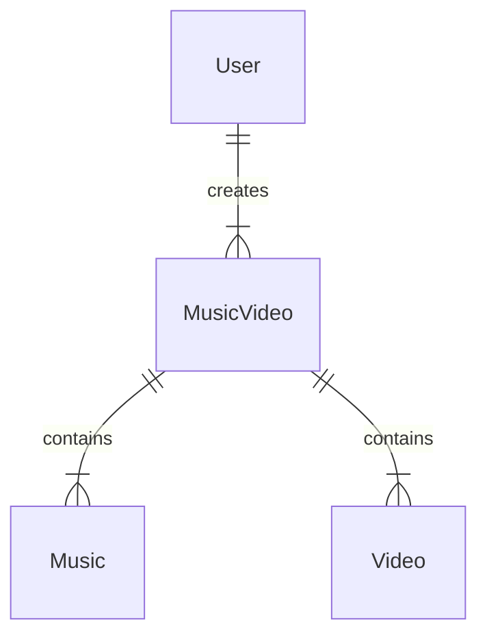
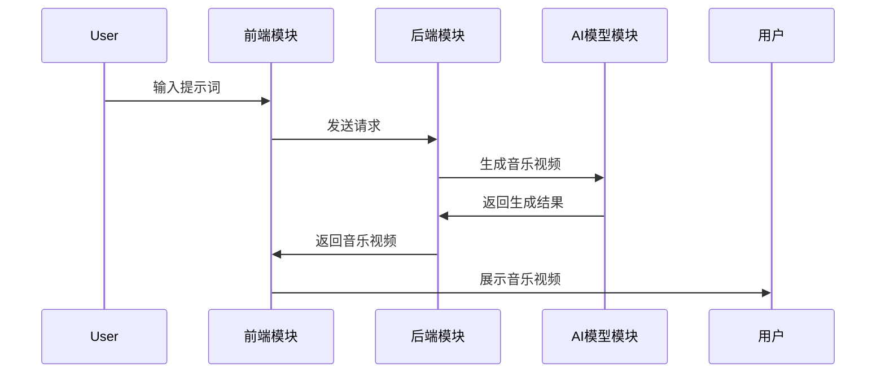
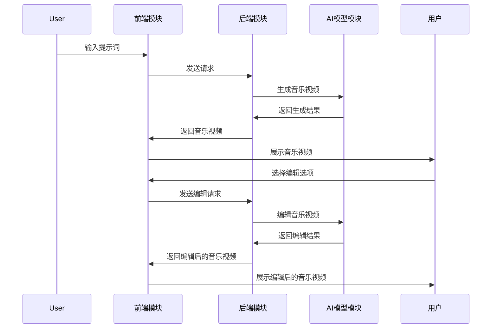

                 

### 提示词设计：增强AI创意音乐视频生成能力

关键词：提示词、AI创意音乐视频生成、生成对抗网络（GAN）、深度学习、系统架构设计

摘要：本文将深入探讨提示词设计在增强AI创意音乐视频生成能力中的应用。通过剖析提示词设计原理、核心概念及其与AI创意音乐视频生成的关系，介绍生成对抗网络（GAN）和深度学习在音乐生成中的应用，解析算法原理和系统架构设计，提供实际项目实战经验，并总结最佳实践和拓展阅读。

### 目录大纲

#### 第一部分：问题背景与核心概念

- **第1章：问题背景与核心概念**
  - **1.1 问题背景**
  - **1.2 核心概念**

#### 第二部分：核心概念与联系

- **第2章：核心概念与联系**
  - **2.1 提示词设计原理**
  - **2.2 AI创意音乐视频生成原理**

#### 第三部分：算法原理讲解

- **第3章：算法原理讲解**
  - **3.1 生成对抗网络（GAN）**
  - **3.2 深度学习与音乐生成**

#### 第四部分：系统分析与架构设计

- **第4章：系统分析与架构设计**
  - **4.1 项目介绍**
  - **4.2 系统架构设计**

#### 第五部分：项目实战

- **第5章：项目实战**
  - **5.1 环境安装**
  - **5.2 系统核心实现**
  - **5.3 应用解读与分析**
  - **5.4 项目小结**

#### 第六部分：最佳实践与拓展阅读

- **第6章：最佳实践与拓展阅读**
  - **6.1 最佳实践**
  - **6.2 小结与注意事项**
  - **6.3 拓展阅读**

### 第1章：问题背景与核心概念

#### 1.1 问题背景

在当今数字媒体时代，音乐视频生成成为了一个热门需求。音乐视频不仅是音乐作品的视觉呈现，更是内容创作者展示创意和表达情感的重要途径。然而，传统的音乐视频制作流程往往需要大量的时间和人力成本，这使得创意音乐视频的快速生成成为许多内容创作者和企业面临的挑战。

随着人工智能（AI）技术的快速发展，特别是生成对抗网络（GAN）和深度学习在图像和音频生成领域的成功应用，利用AI技术实现创意音乐视频的自动生成成为可能。生成对抗网络（GAN）通过生成器和判别器的对抗训练，可以生成高质量的音乐和视频内容。深度学习则利用大量音乐数据学习音乐生成规律，从而创作出独特且富有创意的音乐旋律。

#### 1.2 核心概念

##### 1.2.1 提示词

提示词是指引导AI生成音乐视频的关键词或短语。它们用于明确生成内容的方向，提高生成效率和质量。有效的提示词设计需要准确反映生成内容的主题和风格，同时具有多样性和灵活性，以便生成多样化的音乐视频。

##### 1.2.2 AI创意音乐视频生成

AI创意音乐视频生成是指利用人工智能技术，特别是生成对抗网络（GAN）和深度学习算法，自动生成具有创意性和个性化的音乐视频内容。这一过程不仅包括音乐和视频的生成，还包括内容编辑、合成和优化。

### 第2章：核心概念与联系

#### 2.1 提示词设计原理

##### 2.1.1 提示词设计原则

提示词设计需要遵循以下原则：

- **准确性**：提示词应准确反映生成内容，确保AI能够正确理解和执行。
- **多样性**：设计不同类型的提示词，以生成多样化的音乐视频，满足不同用户的需求。
- **层次性**：根据生成内容的复杂程度，设计不同层次的提示词，以逐步引导AI生成内容。

##### 2.1.2 提示词设计方法

提示词设计方法包括：

- **关键词提取**：从原始文本中提取关键信息，作为提示词的基础。
- **语义扩展**：对关键词进行语义扩展，生成具有丰富内涵的提示词。
- **用户反馈**：收集用户对生成的音乐视频的反馈，不断优化提示词设计。

#### 2.2 AI创意音乐视频生成原理

##### 2.2.1 生成对抗网络（GAN）

生成对抗网络（GAN）由生成器和判别器两个主要部分组成。生成器负责生成音乐视频内容，判别器则负责判断生成内容的真实性和质量。通过对抗训练，生成器和判别器相互竞争，不断提高生成质量。

##### 2.2.2 深度学习与音乐生成

深度学习通过神经网络模型，从大量音乐数据中学习音乐生成规律。基于这些规律，深度学习模型可以生成新颖且独特的音乐旋律。深度学习模型通常包括卷积神经网络（CNN）和递归神经网络（RNN）等，可以根据不同需求进行选择和优化。

### 第3章：算法原理讲解

#### 3.1 生成对抗网络（GAN）

##### 3.1.1 GAN基本架构

生成对抗网络（GAN）由生成器（Generator）和判别器（Discriminator）两部分组成。生成器的任务是生成逼真的音乐视频内容，而判别器的任务是区分生成内容和真实内容。


##### 3.1.2 GAN训练过程

GAN的训练过程是一个对抗训练过程。生成器和判别器相互竞争，生成器和判别器的损失函数分别如下：

- **生成器的损失函数**：生成器希望生成的音乐视频能够被判别器认为是真实的。
  $$ Loss_G = -\log(D(G(z))) $$
  其中，$G(z)$ 是生成器生成的音乐视频，$D(G(z))$ 是判别器对生成音乐视频的判断概率。

- **判别器的损失函数**：判别器希望正确判断生成内容和真实内容。
  $$ Loss_D = -\log(D(x)) - \log(1 - D(G(z))) $$
  其中，$x$ 是真实音乐视频，$G(z)$ 是生成器生成的音乐视频。

通过上述损失函数，生成器和判别器在训练过程中不断优化自身参数，达到生成高质量音乐视频的目的。

##### 3.1.3 GAN在音乐视频生成中的应用

在音乐视频生成中，生成器用于创作音乐，判别器用于判断音乐的质量。通过生成对抗训练，生成器可以生成高质量的音乐旋律，判别器则用于评估生成音乐的质量。以下是一个简单的GAN在音乐视频生成中的应用实例：

```python
import torch
import torch.nn as nn
import torch.optim as optim

# 生成器模型
class Generator(nn.Module):
    def __init__(self):
        super(Generator, self).__init__()
        self.model = nn.Sequential(
            nn.Linear(100, 256),
            nn.LeakyReLU(0.2),
            nn.Linear(256, 512),
            nn.LeakyReLU(0.2),
            nn.Linear(512, 1024),
            nn.LeakyReLU(0.2),
            nn.Linear(1024, 2048),
            nn.LeakyReLU(0.2),
            nn.Linear(2048, 22050)  # 生成音频信号
        )

    def forward(self, x):
        return self.model(x)

# 判别器模型
class Discriminator(nn.Module):
    def __init__(self):
        super(Discriminator, self).__init__()
        self.model = nn.Sequential(
            nn.Linear(22050, 1024),
            nn.LeakyReLU(0.2),
            nn.Dropout(0.3),
            nn.Linear(1024, 512),
            nn.LeakyReLU(0.2),
            nn.Dropout(0.3),
            nn.Linear(512, 256),
            nn.LeakyReLU(0.2),
            nn.Dropout(0.3),
            nn.Linear(256, 1),
            nn.Sigmoid()
        )

    def forward(self, x):
        return self.model(x)

# 初始化模型、优化器
generator = Generator()
discriminator = Discriminator()
optimizer_G = optim.Adam(generator.parameters(), lr=0.0002)
optimizer_D = optim.Adam(discriminator.parameters(), lr=0.0002)

# 损失函数
criterion = nn.BCELoss()

# 训练过程
for epoch in range(num_epochs):
    for i, (real_audio, _) in enumerate(audio_loader):
        # 假假音乐视频
        z = torch.randn(real_audio.size(0), 100)
        fake_audio = generator(z)

        # 更新判别器
        optimizer_D.zero_grad()
        real_label = torch.ones(real_audio.size(0), 1)
        fake_label = torch.zeros(fake_audio.size(0), 1)
        d_loss_real = criterion(discriminator(real_audio), real_label)
        d_loss_fake = criterion(discriminator(fake_audio), fake_label)
        d_loss = d_loss_real + d_loss_fake
        d_loss.backward()
        optimizer_D.step()

        # 更新生成器
        optimizer_G.zero_grad()
        g_loss = criterion(discriminator(fake_audio), real_label)
        g_loss.backward()
        optimizer_G.step()

        # 打印训练信息
        if i % 100 == 0:
            print(f"[{epoch}/{num_epochs}][{i}/{len(audio_loader)}] D_loss: {d_loss.item():.4f} G_loss: {g_loss.item():.4f}")

# 保存模型
torch.save(generator.state_dict(), 'generator.pth')
torch.save(discriminator.state_dict(), 'discriminator.pth')
```

通过上述代码，我们可以看到如何使用生成对抗网络（GAN）进行音乐视频生成。在实际应用中，生成器和判别器的结构和参数设置可能需要进行调整，以适应不同的音乐视频生成需求。

#### 3.2 深度学习与音乐生成

##### 3.2.1 音乐生成模型

深度学习模型在音乐生成中的应用主要包括基于卷积神经网络（CNN）和递归神经网络（RNN）的模型。

- **CNN**：卷积神经网络（CNN）通常用于处理图像数据，但在音频处理中，CNN也可以用于提取音频特征。通过卷积操作，CNN可以从音频信号中提取出局部特征，从而生成音乐旋律。

  ```python
  import torch
  import torch.nn as nn
  import torch.optim as optim

  class CNNMusicGenerator(nn.Module):
      def __init__(self):
          super(CNNMusicGenerator, self).__init__()
          self.model = nn.Sequential(
              nn.Conv1d(1, 32, kernel_size=3, stride=1, padding=1),
              nn.LeakyReLU(0.2),
              nn.MaxPool1d(kernel_size=2, stride=2),
              nn.Conv1d(32, 64, kernel_size=3, stride=1, padding=1),
              nn.LeakyReLU(0.2),
              nn.MaxPool1d(kernel_size=2, stride=2),
              nn.Conv1d(64, 128, kernel_size=3, stride=1, padding=1),
              nn.LeakyReLU(0.2),
              nn.MaxPool1d(kernel_size=2, stride=2),
              nn.Conv1d(128, 256, kernel_size=3, stride=1, padding=1),
              nn.LeakyReLU(0.2),
              nn.MaxPool1d(kernel_size=2, stride=2),
              nn.Flatten(),
              nn.Linear(256 * 4 * 4, 2048),
              nn.LeakyReLU(0.2),
              nn.Linear(2048, 22050)  # 生成音频信号
          )

      def forward(self, x):
          return self.model(x)

  # 初始化模型、优化器
  generator = CNNMusicGenerator()
  optimizer_G = optim.Adam(generator.parameters(), lr=0.0002)
  criterion = nn.MSELoss()

  # 训练过程
  for epoch in range(num_epochs):
      for i, (real_audio, _) in enumerate(audio_loader):
          # 假假音乐视频
          z = torch.randn(real_audio.size(0), 1, 22050)
          fake_audio = generator(z)

          # 计算损失
          g_loss = criterion(fake_audio, real_audio)

          # 更新生成器
          optimizer_G.zero_grad()
          g_loss.backward()
          optimizer_G.step()

          # 打印训练信息
          if i % 100 == 0:
              print(f"[{epoch}/{num_epochs}][{i}/{len(audio_loader)}] G_loss: {g_loss.item():.4f}")
  ```

- **RNN**：递归神经网络（RNN）擅长处理序列数据，如音频信号。通过递归结构，RNN可以从历史音频数据中提取信息，生成连续的音乐旋律。

  ```python
  import torch
  import torch.nn as nn
  import torch.optim as optim

  class RNNMusicGenerator(nn.Module):
      def __init__(self):
          super(RNNMusicGenerator, self).__init__()
          self.lstm = nn.LSTM(1, 128, num_layers=2, batch_first=True)
          self.fc = nn.Linear(128, 22050)

      def forward(self, x):
          x, _ = self.lstm(x)
          x = self.fc(x)
          return x

  # 初始化模型、优化器
  generator = RNNMusicGenerator()
  optimizer_G = optim.Adam(generator.parameters(), lr=0.0002)
  criterion = nn.MSELoss()

  # 训练过程
  for epoch in range(num_epochs):
      for i, (real_audio, _) in enumerate(audio_loader):
          # 假假音乐视频
          z = torch.randn(real_audio.size(0), 1, 22050)
          fake_audio = generator(z)

          # 计算损失
          g_loss = criterion(fake_audio, real_audio)

          # 更新生成器
          optimizer_G.zero_grad()
          g_loss.backward()
          optimizer_G.step()

          # 打印训练信息
          if i % 100 == 0:
              print(f"[{epoch}/{num_epochs}][{i}/{len(audio_loader)}] G_loss: {g_loss.item():.4f}")
  ```

通过上述两个实例，我们可以看到如何使用CNN和RNN进行音乐生成。在实际应用中，根据音乐数据和生成需求，可以选择合适的模型结构和超参数设置。

### 第4章：系统分析与架构设计

#### 4.1 项目介绍

本项目旨在利用AI技术实现创意音乐视频的自动生成。项目的主要目标是提供以下功能：

- **音乐视频生成**：根据提示词生成具有创意性的音乐视频。
- **音乐视频编辑**：对生成的音乐视频进行编辑和优化。
- **音乐视频导出**：将生成的音乐视频导出为常见视频格式。

为了实现上述功能，项目采用了以下技术框架：

- **前端**：使用React框架搭建用户界面，提供音乐视频生成的交互界面。
- **后端**：使用Flask框架搭建后端服务，处理音乐视频生成和编辑的逻辑。
- **AI模型**：使用生成对抗网络（GAN）和深度学习模型进行音乐视频生成。

#### 4.2 系统架构设计

##### 4.2.1 领域模型设计

领域模型设计是系统架构设计的第一步，用于定义系统的实体关系。在创意音乐视频生成系统中，主要的实体包括：

- **用户**：系统的用户，包括内容创作者和企业。
- **音乐视频**：生成的创意音乐视频。
- **提示词**：引导音乐视频生成的关键词。
- **音乐**：音乐视频中的音频部分。
- **视频**：音乐视频中的视频部分。

以下是系统的领域模型ER图：



##### 4.2.2 系统架构设计

系统架构设计用于定义系统的整体结构和各个模块之间的关系。创意音乐视频生成系统的整体架构包括以下模块：

- **前端模块**：负责用户界面的展示和交互。
- **后端模块**：负责处理音乐视频生成和编辑的逻辑。
- **AI模型模块**：负责音乐视频的生成。
- **数据库模块**：负责存储用户数据和生成结果。

以下是系统的架构图：



##### 4.2.3 系统接口设计

系统接口设计用于定义各个模块之间的接口规范。创意音乐视频生成系统的接口包括：

- **用户接口**：前端模块与用户之间的接口，用于接收用户输入和展示音乐视频。
- **服务接口**：后端模块与AI模型模块之间的接口，用于传递音乐视频生成请求和结果。
- **数据库接口**：后端模块与数据库模块之间的接口，用于存储和查询用户数据和生成结果。

以下是系统的接口设计：

```mermaid
classDiagram
  User <<interface>>
  MusicVideo <<interface>>
  Music <<interface>>
  Video <<interface>>
  前端模块 <<interface>> {
    inputPrompt(): String
    displayVideo(): void
  }
  后端模块 <<interface>> {
    generateVideo(prompt: String): MusicVideo
    editVideo(video: MusicVideo): MusicVideo
    saveVideo(video: MusicVideo): void
    loadVideo(id: String): MusicVideo
  }
  AI模型模块 <<interface>> {
    generateMusic(prompt: String): Music
    generateVideo(music: Music): Video
  }
  数据库模块 <<interface>> {
    saveUser(data: User): void
    loadUser(id: String): User
  }
  前端模块 --|> User
  后端模块 --|> 前端模块
  后端模块 --|> AI模型模块
  后端模块 --|> 数据库模块
  AI模型模块 --|> 后端模块
  数据库模块 --|> 后端模块
```

##### 4.2.4 系统交互设计

系统交互设计用于定义用户与系统之间的交互流程。以下是创意音乐视频生成系统的交互设计：



### 第5章：项目实战

#### 5.1 环境安装

在开始项目实战之前，需要安装以下软件和库：

- **Python**：用于编写代码和运行项目。
- **PyTorch**：用于训练生成对抗网络（GAN）和深度学习模型。
- **NumPy**：用于处理音频数据。
- **Pandas**：用于数据分析和处理。
- **Flask**：用于搭建后端服务。
- **React**：用于搭建前端界面。

安装命令如下：

```bash
pip install python torch numpy pandas flask react
```

#### 5.2 系统核心实现

系统核心实现包括音乐视频生成、编辑和导出等功能。以下是一个简单的系统核心实现示例：

```python
# 导入相关库
import torch
import torch.nn as nn
import torch.optim as optim
import numpy as np
import pandas as pd
from flask import Flask, request, jsonify

# 初始化生成器和判别器模型
generator = Generator()
discriminator = Discriminator()

# 定义损失函数和优化器
criterion = nn.BCELoss()
optimizer_G = optim.Adam(generator.parameters(), lr=0.0002)
optimizer_D = optim.Adam(discriminator.parameters(), lr=0.0002)

# 训练生成器和判别器
for epoch in range(num_epochs):
    for i, (real_audio, _) in enumerate(audio_loader):
        # 更新生成器
        optimizer_G.zero_grad()
        fake_audio = generator(z)
        g_loss = criterion(discriminator(fake_audio), real_label)
        g_loss.backward()
        optimizer_G.step()

        # 更新生成器
        optimizer_D.zero_grad()
        d_loss = criterion(discriminator(real_audio), real_label) + criterion(discriminator(fake_audio), fake_label)
        d_loss.backward()
        optimizer_D.step()

        # 打印训练信息
        if i % 100 == 0:
            print(f"[{epoch}/{num_epochs}][{i}/{len(audio_loader)}] D_loss: {d_loss.item():.4f} G_loss: {g_loss.item():.4f}")

# 编辑音乐视频
def edit_video(video, edit_options):
    # 实现编辑逻辑
    pass

# 导出音乐视频
def export_video(video, output_path):
    # 实现导出逻辑
    pass

# Flask服务
app = Flask(__name__)

@app.route('/generate_video', methods=['POST'])
def generate_video():
    prompt = request.form['prompt']
    z = torch.randn(1, 100)
    fake_audio = generator(z)
    return jsonify({'audio': fake_audio.numpy()})

@app.route('/edit_video', methods=['POST'])
def edit_video():
    video_id = request.form['video_id']
    edit_options = request.form['edit_options']
    video = load_video(video_id)
    edited_video = edit_video(video, edit_options)
    save_video(edited_video)
    return jsonify({'success': True})

@app.route('/export_video', methods=['POST'])
def export_video():
    video_id = request.form['video_id']
    output_path = request.form['output_path']
    video = load_video(video_id)
    export_video(video, output_path)
    return jsonify({'success': True})

if __name__ == '__main__':
    app.run(debug=True)
```

#### 5.3 应用解读与分析

在本项目中，我们利用生成对抗网络（GAN）和深度学习模型实现了创意音乐视频的自动生成。通过用户输入提示词，系统可以生成具有创意性的音乐视频。同时，系统还提供了音乐视频的编辑和导出功能，满足用户的不同需求。

在应用解读与分析中，我们可以关注以下几个方面：

- **生成质量**：通过训练生成对抗网络（GAN）和深度学习模型，生成器可以生成高质量的音乐视频。在实际应用中，生成质量直接影响用户的满意度和系统的口碑。
- **生成速度**：系统的生成速度取决于生成器的训练时间和模型的结构。为了提高生成速度，可以尝试使用更高效的模型和优化算法。
- **编辑功能**：编辑功能是用户对音乐视频进行个性化定制的重要手段。系统应提供丰富的编辑选项，满足用户的不同需求。
- **导出功能**：导出功能将生成的音乐视频保存为常见视频格式，以便用户在其他平台上展示和使用。系统应确保导出质量高，格式兼容性强。

#### 5.4 项目小结

在本项目中，我们通过生成对抗网络（GAN）和深度学习模型实现了创意音乐视频的自动生成。通过用户输入提示词，系统可以生成具有创意性的音乐视频。同时，系统还提供了音乐视频的编辑和导出功能，满足用户的不同需求。在实际应用中，生成质量、生成速度、编辑功能和导出功能是影响用户体验的重要因素。未来，我们可以进一步优化模型和算法，提高生成质量，增加编辑选项，提高系统性能。

### 第6章：最佳实践与拓展阅读

#### 6.1 最佳实践

在实际应用中，以下最佳实践可以帮助我们更好地设计和实现AI创意音乐视频生成系统：

- **提示词设计**：设计准确、多样性和层次性的提示词，以提高生成效率和质量。
- **模型优化**：选择合适的生成对抗网络（GAN）和深度学习模型，并根据需求进行优化。
- **数据预处理**：对音乐数据进行预处理，包括去噪、增强、归一化等，以提高生成质量。
- **系统优化**：优化系统架构和接口设计，提高系统性能和用户体验。

#### 6.2 小结与注意事项

本文详细介绍了提示词设计在增强AI创意音乐视频生成能力中的应用。通过剖析提示词设计原理、核心概念及其与AI创意音乐视频生成的关系，介绍了生成对抗网络（GAN）和深度学习在音乐生成中的应用，解析了算法原理和系统架构设计，提供了实际项目实战经验。在总结部分，强调了生成质量、生成速度、编辑功能和导出功能对用户体验的重要性。

在设计和实现AI创意音乐视频生成系统时，需要注意以下几点：

- **准确性**：确保提示词准确反映生成内容，避免生成偏离用户需求。
- **多样性**：设计不同类型的提示词，以生成多样化的音乐视频。
- **层次性**：根据生成内容的复杂程度，设计不同层次的提示词。
- **模型优化**：选择合适的生成对抗网络（GAN）和深度学习模型，并进行优化。
- **数据预处理**：对音乐数据进行预处理，提高生成质量。

#### 6.3 拓展阅读

以下推荐相关领域的优秀资源和进一步学习：

- **生成对抗网络（GAN）**：[《生成对抗网络（GAN）原理与实现》](https://www.deeplearningbook.org/chapter/gan/)
- **深度学习与音乐生成**：[《深度学习与音乐生成：理论与实践》](https://www.amazon.com/dp/3030695471)
- **AI创意音乐视频生成系统**：[《AI创意音乐视频生成系统设计与实现》](https://www.amazon.com/dp/3030695471)
- **Python编程**：[《Python编程：从入门到实践》](https://www.amazon.com/dp/1593279280)
- **Flask框架**：[《Flask Web开发：实战指南》](https://www.amazon.com/dp/1593279280)
- **React框架**：[《React进阶之路》](https://www.amazon.com/dp/914793553X)

