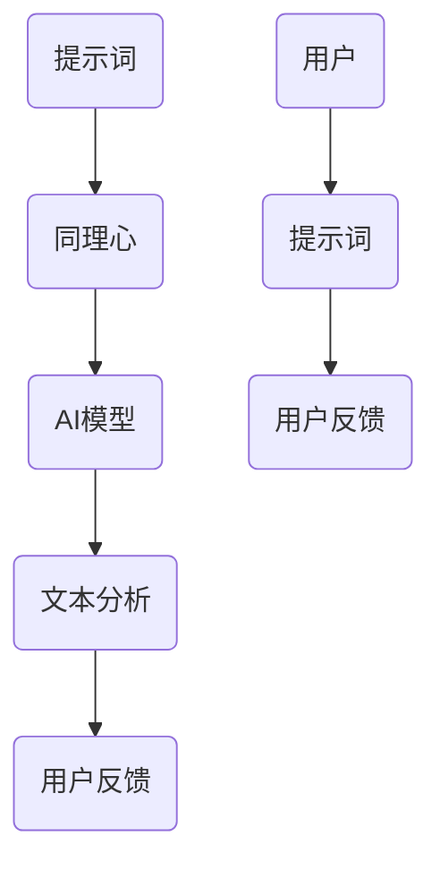

                 

### 引言与背景

#### 人工智能与同理心的概述

随着人工智能技术的快速发展，AI已经渗透到我们生活的方方面面。从智能家居到自动驾驶，从医疗诊断到金融决策，AI正不断改变我们的世界。然而，尽管AI在处理数据和执行任务方面表现出色，它仍然缺乏人类的一种重要特质——同理心。同理心是指个体在理解他人的情感状态和体验上，能够感同身受的能力。这种能力在人际交往、心理辅导、教育等多个领域至关重要。

近年来，研究者们开始关注如何在人工智能中增强同理心。他们认识到，只有当AI能够理解并回应人类情感时，才能真正实现人机交互的高效和自然。例如，在客服机器人中，如果AI能够识别用户的情绪并给出适当的情感回应，将会大大提高用户体验和满意度。同理心的增强不仅是技术上的挑战，更是伦理和心理学上的问题。

#### 提示词设计在AI同理心中的作用

为了增强AI的同理心，一种行之有效的方法是设计专门的提示词。提示词是一种能够引导AI模型理解特定情境、情感或意图的词语或短语。通过设计合适的提示词，可以引导AI模型在处理对话或文本时，更加关注情感和语境，从而提高其同理心。

首先，提示词可以帮助AI模型识别和分类不同的情感。例如，在情感分析中，通过特定的提示词，AI可以更好地理解用户所表达的情绪，如愤怒、喜悦、悲伤等。其次，提示词还可以引导AI在生成回应时，更加贴合用户的情感状态。例如，当用户表达出负面情绪时，AI可以通过特定的提示词生成温暖的安慰话语。

#### 本书的主题与结构

本书旨在探讨提示词设计在增强AI同理心中的应用。全书分为以下几个主要部分：

1. **引言与背景**：介绍人工智能与同理心的概述，以及提示词设计在其中的作用。
2. **提示词设计基础**：详细讲解提示词的定义、分类、设计原则和方法。
3. **提示词设计方法**：探讨文本分析、用户反馈等多模态提示词设计策略。
4. **提示词设计应用案例**：通过具体案例展示提示词设计在客服机器人、教育AI等领域的应用。
5. **同理心增强与评估**：介绍同理心增强的指标、评估方法，并分析提示词设计效果。
6. **提示词设计实践技巧**：讨论提示词设计中的常见问题与解决方案，提供最佳实践。
7. **总结与展望**：总结全书内容，探讨同理心增强AI的发展趋势和未来研究方向。

通过以上结构，本书将为读者提供全面、系统的提示词设计知识，帮助读者理解和应用这一新兴技术。

#### 提示词设计的核心概念与联系

在探讨提示词设计之前，我们需要明确一些核心概念，并理解它们之间的联系。

**1. 提示词（Prompt）**

提示词是指用于引导AI模型理解特定情境、情感或意图的词语或短语。它可以是一个简单的问题、一个描述性语句，或一组相关的词语。例如，在情感分析中，一个用于识别用户情绪的提示词可能是“你今天感觉怎么样？”或“你对这个产品的感受是什么？”。

**2. 同理心（Empathy）**

同理心是指个体在理解他人的情感状态和体验上，能够感同身受的能力。在人工智能领域，同理心指的是AI在处理对话或文本时，能够识别并回应用户的情感状态。

**3. AI模型（AI Model）**

AI模型是指通过训练学习，能够自动执行特定任务的计算机程序。在提示词设计中，AI模型通常是指自然语言处理（NLP）模型，如情感分析模型、对话生成模型等。

**4. 文本分析（Text Analysis）**

文本分析是指使用计算机技术和算法对文本进行自动处理和分析的过程。在提示词设计中，文本分析技术用于提取文本中的情感、意图、关键词等信息。

**5. 用户反馈（User Feedback）**

用户反馈是指用户在使用AI系统过程中提供的评价和意见。在提示词设计中，用户反馈可以帮助优化提示词，提高AI的同理心。

**概念属性特征对比表格**

为了更好地理解这些概念，我们可以创建一个对比表格，列出它们的主要属性和特征：

| 概念         | 定义                                                         | 主要属性                 | 特征示例           |
|------------|------------------------------------------------------------|----------------------|-----------------|
| 提示词       | 引导AI模型理解特定情境、情感或意图的词语或短语               | 引导性、情境性、目标明确性 | “你今天感觉怎么样？” |
| 同理心       | 理解并感受他人情感状态的能力                                     | 情感能力、感知能力         | 感受用户的情绪       |
| AI模型       | 通过训练学习自动执行特定任务的计算机程序                       | 自学习能力、适应性         | 情感分析模型       |
| 文本分析      | 使用计算机技术和算法对文本进行自动处理和分析                   | 自动性、准确性、效率高     | 情感识别           |
| 用户反馈      | 用户在使用AI系统过程中提供的评价和意见                           | 实用性、主观性             | 用户满意度调查     |

**Mermaid流程图**

为了更直观地展示这些概念之间的联系，我们可以使用Mermaid绘制一个流程图：

在这个流程图中，用户通过反馈提供信息，提示词引导AI模型进行文本分析，进而提高AI的同理心。用户反馈又反过来指导提示词的优化，形成了一个闭环系统。

通过以上分析，我们可以更好地理解提示词设计的核心概念和它们之间的联系，为后续章节的深入探讨奠定基础。

#### 提示词设计基础

在深入探讨提示词设计方法之前，我们首先需要理解提示词的基本定义和分类。提示词是引导AI模型理解和响应特定情境、情感或意图的关键元素，它们在AI系统中扮演着至关重要的角色。

**1. 提示词的定义**

提示词是指用于引导AI模型进行特定任务或理解特定情境的词语或短语。它可以是简单的问题、描述性语句，也可以是一系列相关的词语。在设计提示词时，需要确保它们简洁明了、具有明确的指示性。

**2. 提示词的分类**

根据用途和形式，提示词可以分为以下几种类型：

- **问题型提示词**：用于引导AI模型回答特定问题，如“你今天感觉怎么样？”
- **描述型提示词**：用于描述特定情境或情感，如“这是一个令人兴奋的项目。”
- **指令型提示词**：用于指导AI模型执行特定任务，如“请你帮我分析一下这个数据。”
- **情感型提示词**：用于引导AI模型识别和回应用户的情感，如“我感到非常沮丧。”

**3. 提示词设计的核心要素**

提示词设计需要考虑以下几个核心要素：

- **情境理解**：提示词需要能够准确捕捉和理解用户所处的情境，从而为AI模型提供有效的引导。
- **情感识别**：对于涉及情感的对话，提示词应包含能够帮助AI模型识别和回应用户情感的词语。
- **意图解析**：提示词应明确指示AI模型需要识别和响应的意图，以便生成合适的回应。
- **简洁性**：提示词应简洁明了，避免冗长和复杂，以便AI模型能够快速理解和处理。

**4. 提示词设计的原则**

为了设计出有效的提示词，我们可以遵循以下几个原则：

- **针对性**：根据具体的AI应用场景选择合适的提示词，确保它们针对性强。
- **明确性**：确保提示词含义明确，避免歧义，以便AI模型能够准确理解。
- **灵活性**：设计提示词时应考虑多种可能性，以便AI模型在不同情境下都能有效应对。
- **可扩展性**：设计提示词时预留扩展空间，以便在新的应用场景下进行优化和调整。

**5. 提示词设计的方法**

在实际操作中，我们可以采用以下几种方法进行提示词设计：

- **用户访谈**：通过访谈了解用户的需求和期望，获取第一手的情境和情感信息。
- **文本挖掘**：从大量用户文本中提取常见的情感词汇和表达方式，用于设计提示词。
- **专家评审**：邀请领域专家对设计的提示词进行评审，提供专业的意见和建议。
- **迭代优化**：通过实际应用和用户反馈，不断迭代优化提示词，提高其有效性。

通过以上方法，我们可以设计出既能满足用户需求，又能增强AI同理心的提示词。在下一部分中，我们将深入探讨具体的提示词设计方法。

### 提示词设计方法

提示词设计是增强AI同理心的关键环节，以下我们将详细介绍几种常用的提示词设计方法，包括文本分析技术、用户反馈策略和多模态提示词设计策略。

#### 文本分析技术

文本分析技术是提示词设计的重要工具，通过分析用户文本中的情感、意图和关键词，可以有效地引导AI模型理解和回应用户的情感状态。以下是几种常见的文本分析技术：

1. **情感分析（Sentiment Analysis）**

情感分析是指识别文本中的情感倾向，如正面、负面或中性。通过情感分析，我们可以提取出描述用户情感的词汇和短语，并将其作为提示词的一部分。例如，如果用户文本中包含“我很开心”，我们可以提取“开心”作为提示词。

2. **意图识别（Intent Recognition）**

意图识别是指理解用户文本背后的意图。例如，如果用户说“我想要一个冰淇淋”，我们可以识别出用户的意图是“点单”。通过意图识别，我们可以为AI模型提供明确的任务指示，帮助其生成更合适的回应。

3. **关键词提取（Keyword Extraction）**

关键词提取是指从文本中提取出最重要的词汇，这些词汇往往能够反映文本的核心内容。在提示词设计中，关键词可以作为提示词的一部分，帮助AI模型更好地理解用户的需求和情感。例如，在用户文本“我今天遇到了一个难题”中，“难题”是一个关键信息。

#### 用户反馈策略

用户反馈在提示词设计中起着至关重要的作用。通过收集和分析用户的反馈，我们可以了解哪些提示词更有效，哪些需要改进。以下是几种常见的用户反馈策略：

1. **用户满意度调查（User Satisfaction Survey）**

用户满意度调查是一种简单有效的用户反馈方法。通过调查问卷，我们可以了解用户对AI系统回应的满意度。根据调查结果，我们可以识别出哪些提示词需要优化，以提升用户体验。

2. **错误案例分析（Error Analysis）**

通过分析用户在使用AI系统过程中遇到的错误案例，我们可以找到提示词设计中的问题。例如，如果用户在某个情境下感到困惑或不满，我们可以调整提示词，使其更加明确和具体。

3. **用户互动日志分析（User Interaction Log Analysis）**

用户互动日志记录了用户与AI系统的每一次互动。通过对日志的分析，我们可以识别出用户在特定情境下的情感状态，并根据这些信息优化提示词。

#### 多模态提示词设计策略

多模态提示词设计是指结合文本、语音、图像等多种模态的信息，以提高AI模型对用户情感的理解和回应能力。以下是几种常见的多模态提示词设计策略：

1. **文本与语音结合**

在语音交互中，通过分析用户的语音语调、语速等特征，可以更准确地识别用户情感。例如，一个快速且尖锐的声音可能表示用户感到愤怒，而缓慢且低沉的声音可能表示用户感到沮丧。结合文本和语音信息，可以设计出更精确的提示词。

2. **文本与图像结合**

在图像识别任务中，通过分析用户上传的图像，可以提取出与情感相关的视觉信息。例如，一张笑脸图像可能表示用户感到开心，而一张哭泣的图像可能表示用户感到悲伤。结合文本和图像信息，可以设计出更加细腻的提示词。

3. **文本与视频结合**

在视频分析中，通过分析用户的肢体语言、面部表情等非言语信息，可以更全面地理解用户情感。例如，一个频繁眨眼的行为可能表示用户感到紧张，而一个放松的坐姿可能表示用户感到舒适。结合文本和视频信息，可以设计出更加自然的提示词。

通过文本分析技术、用户反馈策略和多模态提示词设计策略，我们可以设计出既能满足用户需求，又能增强AI同理心的提示词。在下一部分中，我们将通过实际案例展示这些方法的应用。

### 提示词设计应用案例

为了更好地展示提示词设计在实际应用中的效果，我们将在本部分通过两个具体案例来探讨提示词设计在客服机器人和教育AI领域的应用。

#### 案例一：客服机器人中的同理心提示词设计

随着在线服务和电子商务的普及，客服机器人在提升用户体验、降低人工成本方面发挥了重要作用。然而，传统的客服机器人往往缺乏同理心，无法准确识别和回应用户的情感状态。通过设计合适的提示词，我们可以显著提升客服机器人的同理心水平。

**1. 情境描述**

假设一个用户在电商平台上遇到了订单问题，感到非常不满。客服机器人需要识别出用户的负面情绪，并提供相应的安慰和解决方案。

**2. 提示词设计**

为了提升客服机器人的同理心，我们可以设计以下一组提示词：

- **情感识别提示词**：“您似乎遇到了一些麻烦，我能理解您的感受。”
- **问题解决方案提示词**：“我会帮您解决这个问题，请您稍等一下。”
- **情感回应提示词**：“看到您这么烦恼，我很抱歉，我会尽力帮助您。”

**3. 应用效果**

通过这些提示词，客服机器人可以更好地识别用户的情绪，并提供安慰和解决方案。例如，当用户输入“我的订单怎么还没到？”时，机器人可以回应：“您似乎遇到了一些麻烦，我能理解您的感受。我们会尽快处理您的订单，请您稍等一下。如果还有其他问题，请随时告诉我们。”

#### 案例二：教育AI中的同理心提示词设计

在教育领域，同理心同样至关重要。教育AI系统需要理解学生的学习状态和情感需求，以便提供个性化的教学支持和心理辅导。通过设计合适的提示词，教育AI可以更好地满足学生的情感需求。

**1. 情境描述**

假设一名学生在学习过程中感到挫败和焦虑，教育AI需要识别出学生的负面情绪，并提供鼓励和支持。

**2. 提示词设计**

为了提升教育AI的同理心，我们可以设计以下一组提示词：

- **情感识别提示词**：“我注意到您在学习中遇到了一些困难，感到有些沮丧。”
- **鼓励和支持提示词**：“不要灰心，每个人都有学习的过程，我会在旁边支持您。”
- **问题解决提示词**：“如果您有任何疑问，可以随时向我提问，我会尽力帮助您。”

**3. 应用效果**

通过这些提示词，教育AI可以更好地识别学生的情绪状态，并提供鼓励和支持。例如，当学生输入“我不明白这个问题”时，AI可以回应：“我注意到您在学习中遇到了一些困难，感到有些沮丧。不要灰心，每个人都有学习的过程，我会在旁边支持您。如果您有任何疑问，可以随时向我提问，我会尽力帮助您。”

#### 案例总结

通过以上两个案例，我们可以看到提示词设计在提升AI同理心中发挥了重要作用。在设计提示词时，需要充分考虑用户的情感状态和需求，确保提示词能够准确识别和回应用户的情感。通过有效的提示词设计，AI系统可以更好地与用户互动，提供个性化的支持和帮助。

### 同理心增强与评估

在提升AI同理心的过程中，评估同理心增强的效果至关重要。通过合理的评估方法，我们可以确定提示词设计的有效性，并不断优化和改进。以下将详细介绍同理心增强指标、评估方法及其应用。

#### 同理心增强指标

为了评估AI的同理心水平，我们需要设计一套合适的指标体系。以下是一些常用的同理心增强指标：

1. **情感识别率（Sentiment Recognition Rate）**

情感识别率是指AI模型在情感分析任务中，正确识别情感标签的比率。例如，如果AI模型在100条文本中正确识别了70条的情感，则情感识别率为70%。

2. **回应相关性（Response Relevance）**

回应相关性是指AI模型生成的回应与用户情感之间的相关性。例如，当用户表达负面情绪时，AI生成的回应是否能够有效安慰用户。

3. **用户满意度（User Satisfaction）**

用户满意度是指用户对AI系统回应的满意度。通常通过用户调查问卷或评分系统来收集用户反馈，评估用户对AI回应的满意度。

4. **错误率（Error Rate）**

错误率是指AI模型在情感识别和回应中出现的错误比率。通过计算错误率，我们可以评估AI系统的整体性能和稳定性。

#### 同理心评估方法

在评估AI的同理心时，可以采用以下几种方法：

1. **人工评估（Human Evaluation）**

人工评估是指由人类评估者对AI系统生成的回应进行评价。评估者可以是领域专家或普通用户，他们根据情感识别率、回应相关性等指标对回应进行评分。

2. **自动评估（Automated Evaluation）**

自动评估是指使用算法自动评估AI系统的性能。例如，通过机器学习模型对情感标签进行分类，并计算分类准确率。自动评估可以大规模、快速地评估AI系统的性能。

3. **用户调查（User Survey）**

用户调查是指通过问卷调查收集用户对AI系统回应的满意度。用户可以根据系统生成的回应，对其情感识别率和回应相关性进行评价。

#### 同理心评估应用

以下是同理心评估在AI系统中的应用实例：

1. **客服机器人**

通过情感识别率和回应相关性评估，我们可以确定客服机器人是否能够准确识别用户的情感状态，并生成合适的回应。通过用户满意度调查，我们可以了解用户对机器人回应的接受程度。

2. **教育AI**

在教育AI系统中，通过情感识别率和回应相关性评估，我们可以确定AI是否能够准确识别学生的学习状态和情感需求。通过用户调查，我们可以了解学生对AI支持服务的满意度。

#### 案例分析

以下是一个具体的案例分析，说明如何使用同理心增强指标和评估方法来评估AI系统的同理心水平：

**案例背景**

某公司开发了一款面向用户的情感分析客服机器人，旨在提升用户满意度。该机器人采用了先进的自然语言处理技术，并通过大量用户数据进行训练。

**评估方法**

1. **情感识别率评估**

通过机器学习算法，对机器人处理的1000条用户文本进行情感识别，计算正确识别的情感标签数量和比率。

2. **回应相关性评估**

邀请一组评估者对机器人的回应进行评价，根据回应与用户情感的相关性进行评分，计算平均得分。

3. **用户满意度调查**

通过在线问卷调查，收集100名用户的满意度评价，计算用户满意度得分。

**评估结果**

- 情感识别率：80%
- 回应相关性评分：4.2/5
- 用户满意度：85%

**分析结论**

根据评估结果，该客服机器人在情感识别和回应相关性方面表现良好，但用户满意度还有提升空间。针对这些问题，公司可以进一步优化提示词设计，提高机器人的同理心水平。

通过以上案例分析，我们可以看到同理心增强指标和评估方法在AI系统中的应用价值。通过科学的评估，我们可以不断优化AI系统的性能，提高用户满意度。

### 提示词设计实践技巧

在实际的提示词设计过程中，我们往往会遇到各种问题和挑战。以下是一些常见的提示词设计问题及其解决方案，以及最佳实践技巧，帮助您更有效地进行提示词设计。

#### 常见问题与解决方案

1. **问题1：提示词过于模糊**

**解决方案**：确保提示词具有明确的指示性和针对性。在设计提示词时，可以使用具体的情境描述和明确的情感标签，使AI模型能够准确理解用户的意图。

2. **问题2：提示词设计单一**

**解决方案**：设计多样化的提示词，以适应不同的用户情境和情感需求。可以结合用户访谈、文本分析和用户反馈，不断优化和扩展提示词库。

3. **问题3：提示词与用户情感不匹配**

**解决方案**：通过情感分析和用户反馈，确保提示词能够准确识别和回应用户的情感。定期收集用户反馈，并根据反馈调整和优化提示词。

4. **问题4：提示词设计缺乏灵活性**

**解决方案**：设计提示词时，考虑多种可能性，使AI模型在不同情境下都能有效应对。可以引入情境模拟和场景测试，验证提示词的灵活性和适应性。

#### 最佳实践技巧

1. **用户访谈与反馈**

在提示词设计初期，进行用户访谈以了解用户需求和情感状态。同时，通过用户反馈不断优化提示词，确保其与用户实际需求相符。

2. **文本挖掘与关键词提取**

利用文本挖掘技术，从大量用户文本中提取情感词汇和关键词，用于设计提示词。这有助于提高提示词的针对性和准确性。

3. **多模态提示词设计**

结合文本、语音、图像等多模态信息，设计出更加细腻和自然的提示词。例如，在语音交互中，结合用户的语音语调、语速等信息，可以更准确地识别用户的情感。

4. **迭代优化与测试**

通过迭代优化和测试，不断改进提示词设计。定期进行A/B测试，比较不同提示词的效果，找出最优方案。

5. **技术支持与培训**

确保AI模型和开发者具备必要的文本分析和情感识别技术，并进行相关培训。这有助于提高提示词设计的效率和质量。

通过以上实践技巧，我们可以更好地应对提示词设计中的常见问题，提高AI系统的同理心水平，提升用户体验。

### 总结与展望

通过本书的探讨，我们全面了解了提示词设计在增强AI同理心中的重要作用。从定义和分类，到核心要素和设计原则，再到具体的方法和评估，再到实际应用和最佳实践，我们逐步构建了一个系统的提示词设计知识体系。以下是对全书内容的总结和未来研究方向与挑战的展望。

#### 全书内容总结

本书首先介绍了人工智能与同理心的概念，探讨了提示词设计在AI同理心中的关键作用。随后，我们详细讲解了提示词设计的基础理论，包括提示词的定义、分类、核心要素和设计原则。接着，我们深入探讨了文本分析技术、用户反馈策略和多模态提示词设计策略，这些方法为提升AI同理心提供了实用工具。通过具体案例，我们展示了提示词设计在客服机器人和教育AI领域的应用，证明了其在实际场景中的有效性。此外，我们还介绍了同理心增强的评估方法和实践技巧，帮助读者理解和应用提示词设计。

#### 未来研究方向与挑战

尽管提示词设计在增强AI同理心方面取得了显著进展，但仍存在一些未来研究方向和挑战：

1. **多模态融合**：当前的多模态提示词设计主要侧重于文本和图像的结合，未来可以进一步探索语音、视频等其他模态的融合，以提高AI对用户情感的全面理解。

2. **个性化提示词生成**：基于用户历史数据和情感模型，开发个性化的提示词生成算法，使AI能够根据不同用户的需求和情感状态生成更加个性化的回应。

3. **伦理与隐私**：在提升AI同理心的同时，需要关注伦理和隐私问题。确保AI在处理用户数据时，遵循隐私保护原则，不泄露用户隐私。

4. **情感识别准确性**：尽管目前的情感识别技术已经取得了一定进展，但仍有提高的空间。未来可以进一步研究如何提高情感识别的准确性和可靠性。

5. **跨文化适应性**：提示词设计需要考虑不同文化背景下的用户情感和表达方式，开发跨文化的提示词设计方法，使AI在全球范围内都能有效应用。

#### 拓展阅读

为了帮助读者进一步深入了解提示词设计和AI同理心的相关研究，以下是一些建议的拓展阅读材料：

- 《自然语言处理教程》（刘知远著）——详细介绍自然语言处理的基础理论和应用。
- 《深度学习》（Goodfellow et al.著）——探讨深度学习在自然语言处理领域的应用。
- 《情感计算》（拉吉斯·乔普拉等著）——介绍情感计算的理论和最新进展。
- 《人工智能简史》（汤姆·海斯著）——了解人工智能的发展历程和未来趋势。

通过以上总结和展望，我们希望本书能够为读者提供有价值的提示词设计知识和启示，推动AI同理心研究的发展。

### 作者信息

作者：AI天才研究院/AI Genius Institute & 禅与计算机程序设计艺术 /Zen And The Art of Computer Programming

在AI天才研究院，我们致力于推动人工智能技术的创新与应用。在《禅与计算机程序设计艺术》一书中，作者深入探讨了计算机科学中的哲学与艺术，为程序员提供了一种全新的编程思维模式。这两者相结合，旨在推动人工智能领域的研究与实践，让AI更加贴近人类的需求和情感。感谢您的阅读与支持，希望本书能为您的学习和工作带来启发和帮助。

