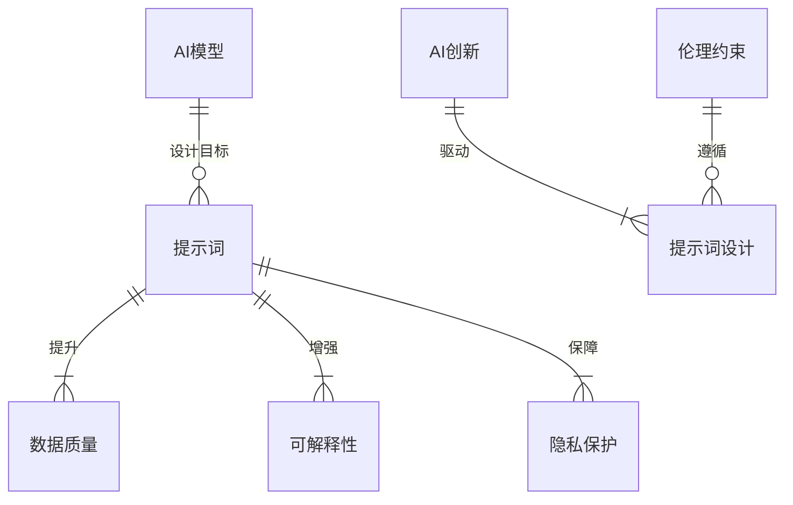
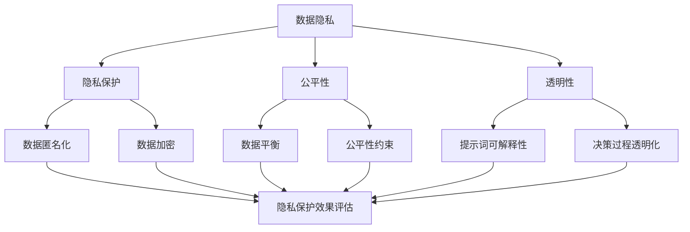

                 

### 第一部分：引言与背景介绍

#### 第1章：提示词设计——问题背景与核心要素

在当前人工智能迅猛发展的时代，技术进步的速度远超以往，而与之伴随的则是伦理问题的日益突出。在众多AI应用中，提示词设计（Prompt Design）扮演了至关重要的角色。提示词，作为与AI模型交互的桥梁，不仅能够直接影响模型的输出，还涉及到数据的质量、模型的可解释性以及安全性等多个方面。

**1.1 问题背景**

AI的快速发展带来了诸多创新，从自动驾驶、智能家居到医疗诊断，AI已经在多个领域展现了其强大的潜力。然而，随着AI技术的不断演进，伦理问题也逐渐显现。例如，AI系统可能产生歧视性决策、侵犯隐私，甚至可能导致道德风险。这些问题的根源在于AI模型的训练数据、模型设计以及与AI系统的交互——其中，提示词设计尤为关键。

**1.1.1 AI创新与伦理约束的冲突**

AI创新追求的是技术的无限可能，然而伦理约束却要求我们在技术开发的过程中必须遵循一定的道德和社会规范。这种冲突体现在以下几个方面：

1. **数据隐私**：AI系统需要大量数据来进行训练，但如何在保护用户隐私的前提下利用这些数据成为一大挑战。
2. **公平性**：AI模型在决策时可能因为训练数据的不公正导致偏见，如何确保模型的公平性是一个重要问题。
3. **透明性**：AI系统的决策过程往往是不透明的，如何提高其可解释性，使人们能够理解并信任AI系统，是AI伦理中的一个重要议题。

**1.1.2 提示词设计的意义与挑战**

提示词设计正是为了解决上述问题而提出的一种新策略。通过精心设计的提示词，我们可以：

1. **提高数据质量**：合理的提示词可以帮助AI模型从数据中提取更多有价值的信息，从而提高模型的性能。
2. **增强模型可解释性**：明确的提示词有助于理解AI模型的决策过程，提高模型的可解释性。
3. **保障数据安全**：通过控制提示词的内容和形式，可以减少数据泄露的风险。

然而，提示词设计也面临一系列挑战：

1. **复杂性问题**：设计有效的提示词需要深入理解AI模型的运作机制，这本身就是一个复杂的任务。
2. **多样性问题**：不同的应用场景需要不同类型的提示词，如何设计出既通用又适应特定场景的提示词是一个挑战。
3. **伦理约束问题**：提示词的设计需要在保证创新的同时，充分考虑伦理约束，避免因为提示词设计不当而引发的伦理问题。

**1.2 核心概念**

为了更好地理解提示词设计及其与AI创新和伦理约束的关系，我们需要明确几个核心概念：

**1.2.1 提示词的定义**

提示词（Prompt）是指在与AI系统交互时，提供给AI模型的一段文本或指令，用于引导模型进行特定任务。一个有效的提示词应该具备以下特点：

1. **清晰性**：提示词应明确传达用户的需求和目标，避免歧义。
2. **针对性**：提示词应针对特定的任务或应用场景进行设计。
3. **灵活性**：提示词应具有一定的灵活性，能够适应不同的情境。

**1.2.2 AI创新的边界**

AI创新是指通过改进算法、扩展应用场景、优化系统性能等手段，推动AI技术的不断发展。然而，AI创新并不是没有边界的。在创新的过程中，我们需要关注以下几个方面：

1. **技术可行性**：创新的技术方案必须在现实中具有可行性。
2. **经济可行性**：创新需要考虑成本和收益，确保其具有经济上的可行性。
3. **伦理可行性**：创新在技术上的可行性之外，还需要满足伦理和社会规范的要求。

**1.2.3 伦理约束的概念框架**

伦理约束是指在社会和道德规范下，对技术发展所施加的限制。伦理约束的概念框架包括以下几个方面：

1. **隐私保护**：在AI应用中，保护用户的隐私是至关重要的。我们需要设计出既能利用数据，又能保护隐私的提示词。
2. **公平性**：AI系统在决策时应该避免歧视和偏见，确保公平性。提示词设计在此过程中起到了关键作用。
3. **透明性**：提高AI系统的可解释性，使其决策过程透明化，有助于增强公众对AI系统的信任。

**1.3 概念联系与结构**

通过上述核心概念的介绍，我们可以看出，提示词设计、AI创新和伦理约束之间存在着紧密的联系：

1. **提示词设计与AI创新**：提示词设计是推动AI创新的重要手段，通过优化提示词，可以提升AI系统的性能和适用性。
2. **提示词设计与伦理约束**：提示词设计在遵循伦理约束的同时，也需要保证AI系统的创新性。
3. **提示词设计的ER图**：通过构建提示词设计的ER图，我们可以更清晰地了解各个核心概念之间的关系，如图所示：

通过上述ER图，我们可以看出，提示词设计不仅关系到AI系统的性能和用户体验，还直接影响到AI创新和伦理约束的实现。因此，在设计提示词时，我们需要综合考虑这些因素，找到平衡点，从而推动AI技术的可持续发展。

### 第2章：提示词设计的原理与特性

#### 2.1 提示词设计的原理

提示词设计是一门结合了人工智能、自然语言处理和用户研究的综合技术。其核心目标是通过设计有效的提示词，提升AI系统的性能和用户体验。提示词设计的原理可以从以下几个方面进行阐述。

**2.1.1 提示词的功能机制**

提示词的功能机制主要体现在以下几个方面：

1. **引导模型学习**：提示词为AI模型提供了明确的任务目标和指导，有助于模型更好地理解和学习任务内容。
2. **调整模型输出**：通过提示词，我们可以引导模型生成更符合预期的输出，例如在生成文本、图像或决策时提供明确的指导。
3. **优化数据利用**：合理的提示词设计可以帮助AI模型更有效地利用训练数据，提高模型的性能。

**2.1.2 提示词的设计原则**

为了设计出有效的提示词，我们需要遵循以下几个原则：

1. **清晰性**：提示词应明确传达任务目标和用户需求，避免产生歧义。例如，在生成文本的任务中，提示词应明确指定文本的主题、格式和风格。
2. **针对性**：提示词应针对具体的任务或应用场景进行设计，确保其在特定情境下能够发挥最佳效果。例如，在医疗诊断任务中，提示词应包含医学专业术语，帮助模型理解诊断需求。
3. **灵活性**：提示词应具有一定的灵活性，能够适应不同的任务和场景。例如，在对话系统设计中，提示词可以根据用户的反馈动态调整，以实现更自然的交互。
4. **可解释性**：提示词应易于理解和解释，有助于提高AI系统的可解释性和透明度。例如，在生成文本的任务中，提示词可以包含明确的指示，帮助用户理解文本生成的过程。

**2.2 提示词的特性**

提示词的特性决定了其在不同应用场景中的效果。以下是几个关键特性：

**2.2.1 提示词的灵活性**

提示词的灵活性是指其能够适应不同任务和场景的能力。灵活的提示词设计可以：

1. **适应变化的需求**：在任务需求发生变化时，灵活的提示词可以帮助模型快速适应，避免重新训练。
2. **优化用户体验**：灵活的提示词可以根据用户反馈动态调整，提高用户交互的满意度。

**2.2.2 提示词的适应性**

提示词的适应性是指其能够适用于不同类型的数据集和模型。具有良好适应性的提示词设计可以：

1. **提升模型性能**：通过适应不同类型的数据集，提示词可以帮助模型在更多场景下表现出色。
2. **降低训练成本**：适应性的提示词可以减少模型重新训练的需求，降低训练成本。

**2.2.3 提示词的可解释性**

提示词的可解释性是指其能够使AI系统的决策过程容易被理解和解释。具有高可解释性的提示词设计可以：

1. **增强用户信任**：用户能够理解AI系统的决策过程，从而增强对AI系统的信任。
2. **优化系统性能**：通过分析提示词的设计，可以发现和解决系统中的问题，进一步提高模型性能。

**2.3 提示词设计与AI创新的关系**

提示词设计在AI创新中扮演了关键角色，其关系可以从以下几个方面理解：

1. **推动技术进步**：有效的提示词设计可以推动AI技术的发展，通过优化模型性能和应用场景，实现更多的技术突破。
2. **促进产业应用**：良好的提示词设计有助于AI技术在不同产业中的应用，提高产业自动化和智能化的水平。
3. **增强用户体验**：通过优化提示词设计，可以提升用户与AI系统的交互体验，实现更自然和高效的交互。

**2.4 提示词设计与伦理约束的关系**

在AI发展的过程中，伦理约束是不可或缺的一环。提示词设计在遵循伦理约束方面具有重要作用：

1. **保障数据安全**：通过设计安全的提示词，可以减少数据泄露的风险，保护用户隐私。
2. **提高公平性**：合理的提示词设计有助于减少AI系统中的歧视和偏见，确保公平性。
3. **增强透明性**：通过设计可解释的提示词，可以提高AI系统的透明度，增强用户对AI系统的信任。

综上所述，提示词设计不仅是AI创新的重要手段，也是遵循伦理约束的必要条件。通过理解提示词设计的原理和特性，我们可以更好地实现AI技术的可持续发展，推动社会进步。

#### 第3章：提示词设计与伦理约束的关系

在AI发展的过程中，伦理约束是不可或缺的一环。伦理约束不仅关乎技术的社会影响，更涉及到技术的可持续性和合规性。而提示词设计，作为AI系统与人类交互的重要桥梁，其设计过程中必须充分考虑伦理约束。本章将探讨伦理约束对AI的影响、提示词设计中的伦理考虑，以及如何构建一个平衡创新与伦理的提示词设计决策框架。

**3.1 伦理约束对AI的影响**

伦理约束对AI的影响主要体现在以下几个方面：

1. **隐私保护**：在AI系统中，数据隐私是一个重要问题。AI模型需要大量数据进行训练，但如何在保护用户隐私的前提下利用这些数据，是一个挑战。提示词设计需要考虑如何最小化数据泄露的风险，例如通过匿名化、加密等技术手段。
   
2. **公平性**：AI模型在决策时可能因为训练数据的不公正导致偏见。这种偏见可能导致AI系统在特定群体中产生不公平的决策。例如，招聘系统中可能因为训练数据中的偏见而导致某些群体的就业机会减少。提示词设计应考虑如何减少模型中的偏见，确保公平性。

3. **透明性**：AI系统的决策过程往往是不透明的，这可能导致用户对AI系统的信任度下降。提示词设计应考虑如何提高AI系统的可解释性，使决策过程透明化。例如，通过设计可解释的提示词，帮助用户理解模型的决策逻辑。

**3.2 提示词设计中的伦理考虑**

提示词设计中的伦理考虑主要包括以下几个方面：

1. **数据伦理**：在设计提示词时，我们需要考虑如何合理利用数据，保护用户隐私。例如，在设计医疗诊断AI系统时，应确保患者的隐私得到保护，避免敏感信息泄露。

2. **公平性**：在AI模型训练过程中，提示词的设计应尽量减少偏见。例如，通过平衡训练数据集，避免因数据不均衡导致的模型偏见。同时，在提示词中应明确指定模型处理任务时的公平性要求。

3. **透明性**：提示词的设计应有助于提高AI系统的可解释性，使决策过程透明化。例如，在文本生成任务中，提示词可以包含明确的生成规则和指导，帮助用户理解文本生成的逻辑。

4. **责任归属**：在AI系统的设计和部署过程中，明确责任归属是非常重要的。提示词设计应考虑如何分配AI系统的责任，确保在出现问题时能够追溯责任。

**3.2.1 提示词设计的伦理挑战**

提示词设计面临以下伦理挑战：

1. **隐私保护与数据利用的平衡**：在保护用户隐私的同时，如何充分利用数据以提高AI系统的性能，是一个挑战。提示词设计需要找到平衡点，确保在利用数据的同时保护用户隐私。

2. **偏见消除**：如何在设计提示词时消除模型偏见，确保公平性，是一个重要挑战。提示词设计应考虑如何通过数据预处理和提示词调整，减少模型偏见。

3. **可解释性与透明性**：如何在确保AI系统透明性的同时，提高其可解释性，是一个挑战。提示词设计应通过设计可解释的提示词，帮助用户理解AI系统的决策逻辑。

**3.2.2 提示词伦理审查的方法**

为了确保提示词设计符合伦理要求，我们可以采用以下方法进行伦理审查：

1. **伦理审查委员会**：建立专门的伦理审查委员会，对提示词设计进行审查。审查委员会应由来自不同领域的专家组成，确保审查的全面性和客观性。

2. **伦理风险评估**：在提示词设计过程中，进行伦理风险评估，识别潜在的风险和挑战。例如，通过评估训练数据集的公平性，识别可能存在的偏见。

3. **用户反馈**：通过用户反馈，了解AI系统在实际应用中的表现，评估提示词设计的有效性。用户反馈可以帮助我们发现和解决提示词设计中的问题。

4. **持续监控**：提示词设计不是一次性的工作，而是一个持续的过程。我们需要对AI系统进行持续监控，确保其始终符合伦理要求。

**3.2.3 提示词设计的伦理决策框架**

为了在提示词设计中实现平衡创新与伦理，我们可以构建一个伦理决策框架，如图所示：

通过上述框架，我们可以系统地考虑提示词设计中的伦理问题，并找到平衡创新与伦理的解决方案。例如，在数据隐私方面，我们可以通过数据匿名化和数据加密来保护用户隐私，并通过隐私保护效果评估来确保隐私保护措施的有效性。

综上所述，提示词设计在遵循伦理约束方面具有重要作用。通过理解伦理约束对AI的影响，考虑提示词设计中的伦理挑战，并采用伦理审查方法和决策框架，我们可以实现提示词设计的可持续发展，推动AI技术的健康进步。

### 第4章：提示词设计策略

#### 4.1 创新驱动策略

在提示词设计中，创新驱动策略是推动AI技术进步的重要手段。这种策略强调通过不断探索和实验，寻找新的设计方法和思路，以提升AI系统的性能和适用性。以下是创新驱动策略的具体实施步骤：

**4.1.1 需求分析**

需求分析是创新驱动策略的第一步。我们需要明确用户的需求和期望，了解AI系统在特定场景下需要实现的功能。通过需求分析，我们可以确定设计提示词的目标和方向。具体步骤包括：

1. **用户调研**：通过问卷调查、访谈等方式，收集用户的需求和意见。了解用户在使用AI系统时遇到的问题和期望的功能。
2. **任务描述**：将用户的需求转化为具体的任务描述。明确任务的目标、输入和输出，为后续的提示词设计提供指导。
3. **场景模拟**：通过模拟实际应用场景，评估用户需求在实际应用中的可行性。例如，在医疗诊断系统中，模拟医生使用AI系统进行诊断的场景，确定需要提供的提示词类型和内容。

**4.1.2 情境模拟**

情境模拟是将需求分析的结果转化为实际应用场景的过程。通过情境模拟，我们可以验证提示词设计的有效性，并根据实际情况进行调整。具体步骤包括：

1. **构建模拟场景**：根据任务描述，构建一个或多个模拟场景，模拟用户与AI系统的交互过程。
2. **设计模拟提示词**：针对模拟场景，设计相应的提示词。提示词应明确、具体，能够引导AI模型实现特定任务。
3. **执行模拟测试**：在模拟场景中执行测试，观察AI模型的输出是否符合预期。通过测试，我们可以评估提示词设计的有效性，发现潜在问题。

**4.1.3 创新思维训练**

创新思维训练是提升提示词设计能力的重要手段。通过创新思维训练，设计师可以培养出更具创造力和灵活性的思维方式，从而设计出更有效的提示词。以下是几个常用的创新思维训练方法：

1. **头脑风暴**：通过小组讨论，集中集思广益，寻找新的设计思路。头脑风暴过程中，鼓励成员自由发表意见，不受限制地探索各种可能性。
2. **思维导图**：使用思维导图工具，将设计思路和想法可视化，有助于梳理和整理思路，发现新的创意。
3. **设计思维**：设计思维是一种以用户为中心的创新方法，强调通过理解用户需求、探索解决方案和不断迭代，实现创新设计。设计思维包括以下步骤：

   - **同理心**：深入了解用户的需求和痛点，建立对用户的深刻理解。
   - **定义问题**：将用户需求转化为具体问题，明确设计的目标。
   - **创意生成**：通过头脑风暴、思维导图等方式，寻找新的解决方案。
   - **原型设计**：将创意转化为原型，通过迭代和测试，不断优化设计。

**4.1.4 创新驱动策略的优势**

创新驱动策略在提示词设计中具有显著的优势：

1. **提高性能**：通过不断创新和优化，提示词设计可以显著提高AI系统的性能，实现更精准的预测和决策。
2. **增强适用性**：创新驱动策略有助于设计出更适用于不同场景和任务的提示词，提升AI系统的通用性。
3. **降低风险**：通过需求分析和情境模拟，我们可以提前发现和解决设计中的问题，降低项目风险。
4. **激发创造力**：创新驱动策略鼓励设计师不断探索新的设计方法和思路，激发创造力，提高设计质量。

**4.1.5 创新驱动策略的挑战**

尽管创新驱动策略具有许多优势，但在实际应用中仍面临一些挑战：

1. **资源限制**：创新需要时间和资源，项目团队可能面临时间紧张和资源不足的情况。
2. **技术限制**：某些创新想法可能受到现有技术和资源的限制，难以实现。
3. **市场需求**：创新驱动策略需要市场需求的支撑，如果市场需求不足，创新成果可能难以应用。

综上所述，创新驱动策略是提升提示词设计的重要手段。通过需求分析、情境模拟和创新思维训练，我们可以设计出更有效的提示词，推动AI技术的进步。

#### 4.2 伦理约束融入策略

在AI系统中，提示词设计不仅要追求技术上的创新和性能提升，还必须充分考虑伦理约束，确保系统的社会影响符合道德和法律的规范。将伦理约束融入提示词设计，是确保AI系统可持续发展和公众信任的关键。以下是几种常见的伦理约束融入策略。

**4.2.1 提示词伦理模型构建**

构建一个提示词伦理模型是融入伦理约束的第一步。这个模型将帮助我们在设计过程中系统化地考虑伦理问题。以下是构建提示词伦理模型的关键步骤：

1. **确定伦理原则**：根据相关伦理理论和法律规范，明确需要遵循的伦理原则。例如，隐私保护、公平性、透明性等。
2. **识别伦理问题**：分析AI系统在运行过程中可能遇到的伦理问题，例如数据隐私、偏见、决策透明度等。
3. **定义伦理指标**：为每个伦理问题定义可量化的指标，以便在设计过程中进行评估和监控。例如，隐私保护指标可以包括数据匿名化和加密技术的使用情况。
4. **构建伦理框架**：将伦理原则、伦理问题和伦理指标整合到一个统一的框架中，为提示词设计提供指导。

**4.2.2 伦理敏感度评估**

伦理敏感度评估是确保提示词设计符合伦理要求的重要环节。通过评估，我们可以发现设计中的潜在伦理风险，并及时采取措施进行优化。以下是伦理敏感度评估的关键步骤：

1. **确定评估标准**：根据提示词伦理模型，明确评估的标准和准则。这些标准应涵盖所有伦理原则和指标。
2. **设计评估工具**：开发或选择合适的评估工具，例如伦理评估问卷、伦理风险矩阵等。这些工具可以帮助我们系统地评估提示词设计的伦理问题。
3. **进行评估**：使用评估工具对提示词设计进行全面的伦理评估。评估过程中，应关注数据的隐私性、模型的公平性、决策过程的透明度等方面。
4. **记录评估结果**：将评估结果记录在案，作为后续优化和改进的依据。评估结果应包括每个伦理问题的具体发现和改进建议。

**4.2.3 伦理审查流程设计**

伦理审查流程是确保提示词设计符合伦理要求的重要机制。通过设计一个系统化的审查流程，我们可以确保每个设计阶段都经过伦理评估，从而减少伦理风险。以下是伦理审查流程设计的关键步骤：

1. **设立审查委员会**：建立一个由伦理学家、法律专家、行业代表等组成的多学科审查委员会。审查委员会负责对提示词设计进行伦理评估和审查。
2. **制定审查标准**：根据伦理原则和伦理敏感度评估结果，制定详细的审查标准。这些标准应涵盖从需求分析到最终测试的所有设计阶段。
3. **审查流程规划**：明确每个设计阶段的审查内容和流程。例如，在需求分析阶段，审查委员会应关注用户隐私和数据安全；在原型设计阶段，应评估模型的公平性和透明度。
4. **审查记录和反馈**：将审查过程和结果记录在案，并定期向相关利益相关者提供反馈。审查记录应包括评估结果、发现的问题和改进建议。
5. **审查结果应用**：将审查结果应用于设计优化和改进。对于发现的问题，应制定具体的改进计划，并在后续设计阶段进行验证和优化。

**4.2.4 伦理约束融入策略的优势**

将伦理约束融入提示词设计，具有以下优势：

1. **提升社会责任**：通过考虑伦理约束，AI系统将更加符合社会和道德规范，提升企业的社会责任感。
2. **增强公众信任**：透明的伦理审查流程和符合伦理标准的提示词设计，可以增强公众对AI系统的信任。
3. **降低法律风险**：遵循伦理要求和法律规范，可以减少因伦理和法律问题导致的法律风险。
4. **提高系统性能**：通过优化提示词设计中的伦理问题，可以提升AI系统的整体性能和可靠性。

**4.2.5 伦理约束融入策略的挑战**

尽管伦理约束融入策略具有明显优势，但在实际应用中也面临一些挑战：

1. **资源投入**：伦理审查和评估需要投入大量时间和资源，可能影响项目进度和成本。
2. **技术限制**：某些伦理问题可能难以通过技术手段解决，需要其他方法进行优化。
3. **市场压力**：在市场压力下，企业可能更倾向于追求短期利益，忽视伦理约束。

综上所述，将伦理约束融入提示词设计是确保AI系统可持续发展的重要策略。通过构建伦理模型、进行伦理敏感度评估和设计伦理审查流程，我们可以系统化地考虑伦理问题，提升AI系统的社会责任和公众信任。

### 第5章：提示词设计的实践

#### 5.1 实践案例分析

在提示词设计的实践中，有许多成功的案例可以为我们提供宝贵的经验。以下是两个具体的案例，分别来自AI助手和自动驾驶系统领域。

**5.1.1 案例一：AI助手中的提示词设计**

AI助手作为一种智能交互系统，广泛应用于客户服务、个人助理等领域。其核心在于通过自然语言处理技术，理解用户的需求并提供相应的帮助。以下是一个具体的案例：

**项目背景**：某公司开发了一款智能客服AI助手，用于替代人工客服，提高服务效率和用户体验。

**需求分析**：在需求分析阶段，项目团队进行了广泛的用户调研，收集了用户在客服过程中常见的问题和需求。通过分析，确定了AI助手需要具备的基本功能，如查询信息、解决常见问题、转接人工客服等。

**情境模拟**：项目团队构建了多个模拟场景，模拟用户与AI助手的交互过程。例如，用户询问产品价格、查询订单状态、请求技术支持等。这些模拟场景用于测试提示词设计的有效性。

**提示词设计**：

1. **欢迎提示词**：用于欢迎用户，引导用户开始交互。例如：“您好，欢迎来到我们的智能客服AI助手，我将竭诚为您服务，请问有什么可以帮助您的？”

2. **查询提示词**：用于引导用户查询相关信息。例如：“请问您需要查询什么信息？例如产品价格、订单状态等。”

3. **转接提示词**：当AI助手无法解答用户问题时，使用转接提示词引导用户转接人工客服。例如：“很抱歉，我无法回答您的问题。请稍等，我将为您转接人工客服。”

**测试与优化**：在测试阶段，项目团队对AI助手进行了多次测试，包括用户测试和内部评估。通过收集用户反馈和评估结果，发现了一些设计问题，如部分提示词过于复杂、部分交互流程不够流畅等。针对这些问题，项目团队对提示词进行了优化，提高了AI助手的性能和用户体验。

**结论**：通过这个案例，我们可以看到，合理的提示词设计在提升AI助手性能和用户体验方面起到了关键作用。在实践过程中，需求分析、情境模拟和测试与优化是确保提示词设计成功的重要因素。

**5.1.2 案例二：自动驾驶系统中的提示词设计**

自动驾驶系统是人工智能技术的典型应用之一，其核心在于通过传感器、计算机视觉和深度学习等技术，实现车辆的自主行驶。以下是一个具体的案例：

**项目背景**：某汽车制造商开发了一款自动驾驶汽车，旨在提高交通效率和安全性。

**需求分析**：在需求分析阶段，项目团队分析了自动驾驶汽车在不同场景下的需求，如城市道路、高速公路、停车等。通过分析，确定了自动驾驶汽车需要具备的基本功能，如路径规划、障碍物识别、行人检测、车辆控制等。

**情境模拟**：项目团队构建了多个模拟场景，模拟自动驾驶汽车在不同环境下的行驶情况。例如，在高速公路上行驶、在城市道路中遇到行人、在停车场中停车等。这些模拟场景用于测试提示词设计的有效性。

**提示词设计**：

1. **启动提示词**：用于启动自动驾驶系统，引导车辆进入自动驾驶模式。例如：“自动驾驶系统已启动，请您放心。”

2. **安全提示词**：用于提醒驾驶员和乘客注意安全，例如：“请确保安全带已系好，前方有行人，请注意减速。”

3. **异常处理提示词**：当自动驾驶系统遇到异常情况时，使用异常处理提示词提醒驾驶员和乘客。例如：“系统检测到前方有障碍物，正在减速，请保持镇定。”

**测试与优化**：在测试阶段，项目团队对自动驾驶汽车进行了多次测试，包括道路测试和模拟测试。通过收集测试数据和用户反馈，发现了一些设计问题，如部分提示词过于复杂、部分交互流程不够直观等。针对这些问题，项目团队对提示词进行了优化，提高了自动驾驶汽车的安全性和用户体验。

**结论**：通过这个案例，我们可以看到，合理的提示词设计在提升自动驾驶汽车的安全性和用户体验方面起到了关键作用。在实践过程中，需求分析、情境模拟和测试与优化是确保提示词设计成功的重要因素。

#### 5.2 提示词设计工具与方法

在提示词设计过程中，使用适当的工具和方法可以显著提高效率和质量。以下是几种常用的工具和方法：

**5.2.1 提示词设计工具**

1. **自然语言处理工具**：例如，Python的NLTK库、spaCy库等，用于文本处理和分词、词性标注等任务，帮助设计师生成高质量的提示词。

2. **语义分析工具**：例如，Word2Vec、BERT等，用于理解文本语义，帮助设计师生成与用户需求更匹配的提示词。

3. **生成对抗网络（GAN）**：用于生成多样化的提示词，通过训练GAN模型，可以生成符合特定主题或风格的提示词。

**5.2.2 提示词设计方法**

1. **情景模拟法**：通过构建模拟场景，模拟用户与AI系统的交互过程，设计出能够引导用户进行有效互动的提示词。

2. **用户访谈法**：通过访谈用户，了解他们的需求和期望，根据用户的反馈设计提示词。

3. **案例分析法**：分析成功和失败的提示词设计案例，总结经验教训，指导新的设计。

4. **迭代优化法**：通过不断迭代和优化，逐步改进提示词设计，提高其有效性和用户体验。

#### 5.3 提示词设计的实际操作流程

以下是提示词设计的实际操作流程，分为前期准备、实施步骤和优化与迭代三个阶段：

**5.3.1 前期准备**

1. **需求收集**：通过用户调研、访谈等方法，收集用户的需求和期望。

2. **技术评估**：评估现有技术和工具的可行性，确定可以使用的工具和方法。

3. **团队组建**：组建包括自然语言处理专家、用户研究员、产品设计人员等在内的跨学科团队。

**5.3.2 实施步骤**

1. **需求分析**：明确AI系统的目标和功能，确定需要完成的任务。

2. **情境模拟**：构建模拟场景，模拟用户与AI系统的交互过程，设计初步的提示词。

3. **初步测试**：在模拟场景中测试初步设计的提示词，收集用户反馈。

4. **优化设计**：根据用户反馈，对提示词进行优化和调整，确保其清晰、具体、灵活。

5. **全面测试**：在真实环境中进行测试，确保提示词在实际应用中的有效性。

**5.3.3 优化与迭代**

1. **用户反馈**：收集用户使用AI系统的反馈，分析用户行为和需求。

2. **数据监控**：监控系统的运行数据，评估提示词的效果和性能。

3. **持续优化**：根据用户反馈和监控数据，对提示词进行持续优化和调整。

4. **迭代更新**：定期更新提示词设计，确保其与用户需求和技术发展保持同步。

通过上述实际操作流程，我们可以系统地设计和优化提示词，提升AI系统的性能和用户体验。

### 第6章：提示词设计中的常见问题与解决方案

在提示词设计过程中，可能会遇到多种问题，这些问题的解决对于确保AI系统的有效性和用户满意度至关重要。以下将探讨提示词设计中的常见问题，并分析相应的解决方案。

#### 6.1 提示词模糊性处理

提示词模糊性是指提示词在表达上存在不明确、不具体或含糊不清的情况，这可能导致AI模型理解错误或产生不确定的输出。以下是处理提示词模糊性的几种方法：

**6.1.1 清晰化提示词**

1. **具体化指示**：通过提供具体的指示，使提示词更加明确。例如，将“请描述您的问题”修改为“请详细描述您的订单状态查询需求”。

2. **明确目标**：在提示词中明确指出任务的目标，帮助AI模型更好地理解用户的意图。例如，将“帮我整理文件”修改为“请根据文件类型将所有文件分类整理”。

**6.1.2 结构化提示词**

1. **使用结构化模板**：通过使用结构化的模板，确保提示词的一致性和明确性。例如，在查询系统中使用固定的格式：“请输入您想要查询的订单编号：______”。

2. **分层提示**：将复杂的任务分解为多个简单的子任务，逐步引导AI模型理解。例如，对于“请帮我写一封求职信”，可以分解为“介绍自己”、“描述应聘职位”和“表达求职意愿”。

**6.1.3 用户引导**

1. **交互提示**：在用户与AI系统交互过程中，提供实时反馈和提示，帮助用户明确需求。例如，在智能客服系统中，当用户输入模糊的查询时，系统可以提问：“您是想要查询订单状态还是产品价格？”

2. **用户教育**：通过用户教育，提高用户对AI系统的理解和操作能力。例如，在用户首次使用AI助手时，系统可以提供使用教程和常见问题的解答。

#### 6.2 提示词偏向性问题

提示词偏向性是指提示词在语义上可能包含某种倾向或偏见，这会影响AI模型的学习和输出。以下是解决提示词偏向性问题的几种方法：

**6.2.1 数据预处理**

1. **数据清洗**：在训练数据集的预处理阶段，删除或标记可能带有偏见的数据，例如性别歧视、种族歧视等。

2. **数据平衡**：通过调整数据集的比例，确保不同类别的数据分布均衡，减少偏见。例如，在招聘AI系统中，确保不同性别、种族的应聘者数据分布均衡。

**6.2.2 伦理审查**

1. **伦理审查委员会**：建立一个由伦理学家、法律专家和行业代表组成的伦理审查委员会，对提示词进行审查，确保其符合伦理和社会规范。

2. **伦理敏感度评估**：在设计提示词时，进行伦理敏感度评估，识别和纠正潜在的偏见。例如，使用伦理敏感度评估工具，分析提示词中的歧视性表述。

**6.2.3 模型训练**

1. **对抗性训练**：通过对抗性训练，增强模型对偏见和偏见的抵抗力。例如，在训练数据中加入对抗性样本，使模型能够学习到不同情境下的正确行为。

2. **多任务学习**：通过多任务学习，使模型在多个任务中学习，从而提高其对偏见和偏见的识别和纠正能力。

#### 6.3 提示词的隐私保护

提示词设计中的隐私保护是确保用户数据安全的重要环节。以下是几种常见的隐私保护方法：

**6.3.1 数据匿名化**

1. **去标识化**：通过去除或更改个人身份标识信息，使数据无法直接识别特定用户。

2. **伪匿名化**：通过添加噪声或混淆技术，使数据难以被反解，从而保护隐私。

**6.3.2 加密技术**

1. **数据加密**：对用户数据进行加密处理，确保数据在传输和存储过程中不被未授权访问。

2. **同态加密**：允许对加密数据直接进行计算，而不需要解密，从而在保护隐私的同时实现数据处理。

**6.3.3 访问控制**

1. **权限管理**：通过设置访问权限，确保只有授权用户能够访问敏感数据。

2. **访问日志**：记录用户访问数据的行为，以便在出现隐私泄露时进行追踪和调查。

通过上述解决方案，我们可以有效处理提示词设计中的模糊性、偏向性和隐私保护问题，提升AI系统的性能和用户信任度。

### 第7章：提示词设计的未来展望

随着人工智能技术的不断发展和应用场景的拓展，提示词设计在未来将面临许多新的机遇和挑战。本文将从未来发展趋势、社会责任以及研究与教育等方面进行探讨，为提示词设计的未来发展提供指导和建议。

#### 7.1 提示词设计的未来发展趋势

**7.1.1 AI技术的革新**

AI技术的快速发展将深刻影响提示词设计。例如，深度学习、强化学习等新算法的不断进步，将为提示词设计提供更强大的工具和方法。同时，自然语言处理技术的突破，如预训练模型（如GPT-3）的广泛应用，将使提示词设计更加智能化和个性化。

**7.1.2 伦理观念的变化**

随着社会对AI伦理问题的关注度不断提升，提示词设计中的伦理约束将变得更加重要。未来的提示词设计不仅需要关注技术性能，还需要在伦理层面进行深入思考。例如，如何在保障用户隐私的前提下设计有效的提示词，如何在设计中避免偏见和歧视等问题。

**7.1.3 多模态交互**

随着多模态交互技术的普及，提示词设计将不再局限于文本形式，还将涵盖语音、图像等多种形式。例如，在智能客服系统中，结合语音识别和自然语言理解技术的提示词设计，将大大提升用户体验。

**7.1.4 可解释性与透明性**

提升AI系统的可解释性和透明性是未来提示词设计的重要方向。通过设计更加直观和易于理解的提示词，用户可以更好地理解和信任AI系统，从而促进AI技术的广泛应用。

#### 7.2 提示词设计的社会责任

**7.2.1 提示词设计者的伦理责任**

提示词设计者在推动AI技术发展的同时，应承担起伦理责任。具体包括：

1. **确保用户隐私**：在设计提示词时，采取措施保护用户隐私，避免数据泄露。
2. **消除偏见与歧视**：通过合理设计，确保AI系统在决策过程中公平、公正，避免因数据偏见导致的歧视现象。
3. **提升可解释性**：设计可解释的提示词，使AI系统的决策过程透明化，提高用户对AI系统的信任。

**7.2.2 提示词设计的社会影响**

提示词设计不仅影响AI系统的性能和用户体验，还对社会产生深远影响。未来的提示词设计应考虑以下方面：

1. **促进公平与包容**：通过设计具有包容性和公平性的提示词，推动社会公平和包容。
2. **支持可持续发展**：在提示词设计中融入可持续发展的理念，例如通过优化能源消耗、减少资源浪费等。
3. **增强社会责任**：通过提示词设计，支持企业履行社会责任，推动社会进步。

#### 7.3 提示词设计的研究与教育

**7.3.1 研究前沿**

未来的提示词设计研究将聚焦于以下前沿领域：

1. **多模态提示词设计**：研究如何结合不同模态的信息，设计出更加智能和个性化的提示词。
2. **伦理敏感度评估**：开发更有效的伦理敏感度评估方法，确保提示词设计符合伦理要求。
3. **自适应提示词设计**：研究如何根据用户行为和需求，动态调整提示词，提高用户体验。

**7.3.2 教育体系中的提示词设计**

提示词设计作为人工智能领域的重要方向，应纳入高等教育和职业教育体系。具体措施包括：

1. **课程设置**：在计算机科学、人工智能等相关专业中，开设提示词设计课程，培养相关人才。
2. **实践项目**：通过实际的案例分析和项目实践，提高学生对提示词设计的理解和应用能力。
3. **跨学科合作**：鼓励不同学科领域的专家合作，开展提示词设计研究，推动技术创新。

**7.3.3 研究与教育的结合**

未来的研究应与教育紧密结合，推动以下方面的发展：

1. **持续更新知识体系**：根据最新技术发展和应用需求，不断更新教学内容和课程设置。
2. **促进产学研合作**：鼓励学术界、产业界和政府部门合作，共同推动提示词设计的研究与应用。
3. **开放资源共享**：通过开放资源，如开源代码、案例库等，促进全球范围内的提示词设计研究与合作。

总之，未来的提示词设计将在AI技术、伦理观念和社会责任等方面面临新的机遇和挑战。通过深入研究、创新教育和社会合作，我们可以推动提示词设计的发展，实现技术进步和社会进步的双重目标。

### 总结

在本文中，我们系统地探讨了提示词设计在AI创新和伦理约束中的重要性。从问题背景、核心概念、设计原理到实践策略，我们逐步分析了提示词设计在推动AI技术发展、保障数据安全和伦理合规方面的关键作用。通过案例分析和实际操作流程，我们展示了如何有效地设计和应用提示词，解决模糊性、偏向性和隐私保护等问题。

我们强调了提示词设计在社会责任和可持续发展中的重要性，并提出了未来研究的方向。未来的提示词设计将面临新的技术挑战和伦理问题，需要我们不断创新和优化。因此，我们呼吁学术界、产业界和政府部门的共同努力，推动提示词设计的健康发展，为人工智能技术的广泛应用和可持续发展贡献力量。

### 最佳实践 Tips、小结、注意事项、拓展阅读

**最佳实践 Tips**

1. **需求分析与用户调研**：在开始提示词设计之前，进行详细的需求分析和用户调研，确保设计符合实际应用场景。
2. **设计灵活的提示词**：根据不同应用场景，设计具有灵活性的提示词，能够适应各种变化和需求。
3. **多学科团队合作**：提示词设计涉及多个领域，如自然语言处理、用户研究、伦理学等，多学科团队合作有助于提高设计质量。
4. **持续迭代与优化**：提示词设计不是一次性工作，应持续进行迭代和优化，确保其始终符合最新需求和伦理要求。

**小结**

本文通过对提示词设计的全面探讨，揭示了其在AI创新和伦理约束中的关键作用。合理的提示词设计不仅能够提升AI系统的性能和用户体验，还能确保系统的可持续发展和社会责任。未来，随着AI技术的不断进步，提示词设计将面临更多挑战和机遇。

**注意事项**

1. **隐私保护**：在提示词设计中，必须严格遵循隐私保护原则，确保用户数据安全。
2. **公平性**：设计提示词时应注意避免偏见和歧视，确保系统决策的公平性。
3. **可解释性**：提示词设计应注重系统的可解释性，提高用户对AI系统的信任。

**拓展阅读**

1. **《人工智能伦理学》**：由迈克尔·J·托马塞洛（Michael J. Tonsetti）所著，详细探讨了人工智能技术中的伦理问题。
2. **《自然语言处理入门》**：由丹·布拉克曼（Dan Jurafsky）和詹姆斯·H·马丁（James H. Martin）所著，涵盖了自然语言处理的基础知识和应用。
3. **《AI与生活》**：由阿图·葛文德（Atul Gawande）所著，探讨了人工智能技术在医疗和日常生活中的应用及其伦理影响。

通过这些参考资料，读者可以进一步了解提示词设计及相关领域的最新进展和研究成果。作者：AI天才研究院/AI Genius Institute & 禅与计算机程序设计艺术 /Zen And The Art of Computer Programming。

