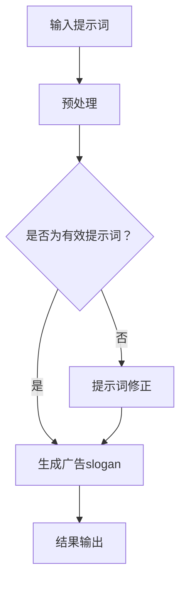
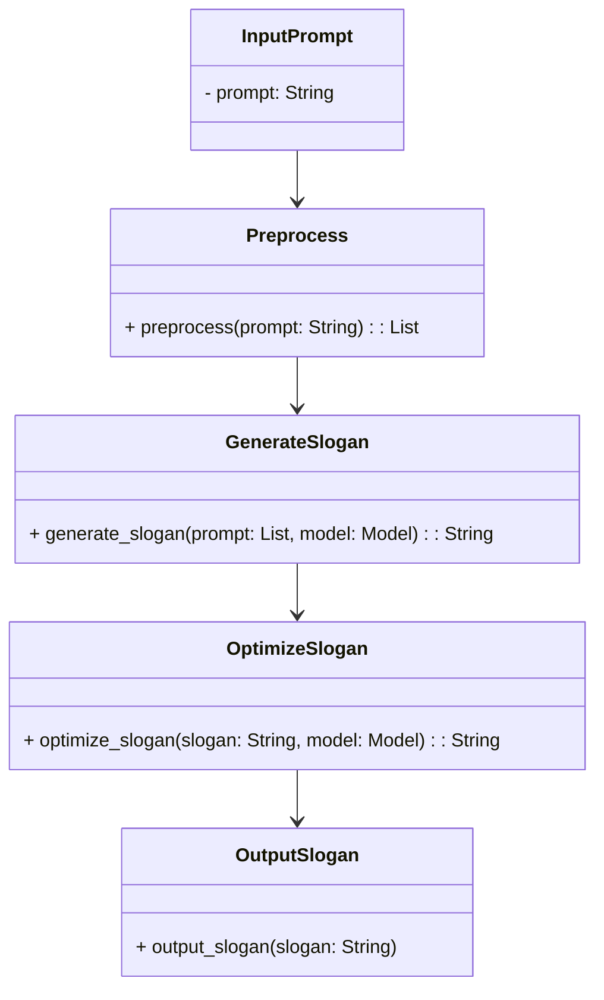
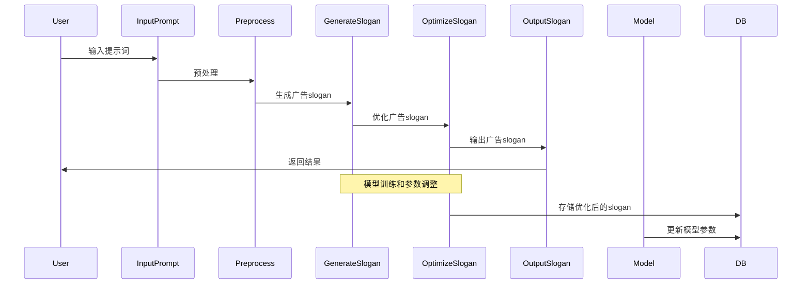
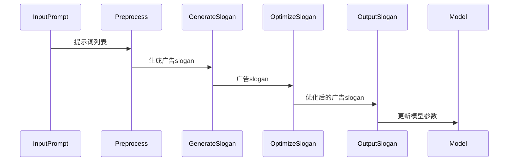

                 

### 引言与背景介绍

#### 1.1 书籍目的与读者对象

**书籍目标**

《提示词设计：提高AI创意广告slogan生成能力》旨在深入探讨提示词设计在人工智能广告领域的重要性，通过系统化、结构化的方法介绍提示词设计的基础理论、核心概念、设计流程和实际应用。本书的目标是帮助读者全面了解提示词设计的基本原则和最佳实践，提升AI生成创意广告slogan的能力，从而在激烈的市场竞争中脱颖而出。

**预期读者群体**

本书适合以下几类读者：
1. **人工智能研究者与开发者**：希望深入了解提示词设计原理，并将其应用于AI广告slogan生成的专业人士。
2. **广告行业从业者**：希望借助AI技术提升广告创意水平，提高广告效果的市场营销人员。
3. **软件开发工程师**：对AI在广告领域的应用有兴趣，并希望掌握相关技术实现方法的工程师。
4. **计算机科学学生**：对AI和广告行业交叉领域感兴趣，希望探索实际应用场景的大学生和研究生。

**对AI广告slogan生成的贡献**

本书将详细介绍提示词设计的各个方面，旨在为读者提供一个全面、系统的学习路径。通过深入学习提示词设计，读者不仅可以掌握提升AI创意广告slogan生成能力的关键方法，还可以为未来的研究和应用提供理论基础和实践指导。具体贡献包括：
- **理论基础**：系统性地介绍提示词设计的基本概念、原理和方法，为后续研究和实践提供理论支持。
- **方法与实践**：提供实用的提示词设计流程和策略，帮助读者快速提升AI广告slogan生成能力。
- **案例分析**：通过实际案例分析和讲解，帮助读者理解提示词设计在真实场景中的应用，积累实践经验。

#### 1.2 提示词设计的重要性

##### 1.2.1 广告slogan的作用

广告slogan是广告宣传中的关键要素之一，具有强烈的视觉冲击力和传播效果。一条优秀的广告slogan能够简洁明了地传达产品的核心价值，激发消费者的购买欲望，从而提高广告效果。其作用主要体现在以下几个方面：

1. **简洁明了**：广告slogan通常用简短的语句表达产品的特点和优势，使消费者一目了然。
2. **情感共鸣**：通过运用修辞手法和情感词汇，广告slogan能够与消费者产生情感共鸣，增强记忆点。
3. **品牌塑造**：广告slogan往往承载着品牌的理念和精神，有助于塑造品牌形象，提升品牌价值。
4. **传播效果**：优秀的广告slogan具有广泛的传播效果，可以通过各种渠道迅速传播，提高广告的覆盖范围和影响力。

##### 1.2.2 提示词在AI广告slogan生成中的作用

提示词是AI广告slogan生成过程中的关键要素，直接影响着生成广告slogan的质量和创意水平。提示词在AI广告slogan生成中的作用主要包括以下几个方面：

1. **引导生成方向**：提示词为AI生成模型提供了明确的生成方向，帮助模型理解需要生成的内容类型和风格。
2. **提升生成质量**：通过精心设计的提示词，可以使AI生成模型更加准确地捕捉到广告slogan的核心要素和创意点，提高生成广告slogan的质量。
3. **增强创意水平**：优秀的提示词设计能够激发AI模型的创造力，生成更具创意和吸引力的广告slogan。
4. **优化用户体验**：通过提供符合用户需求的提示词，可以提升用户体验，使生成的广告slogan更加贴合用户心理和喜好。

##### 1.2.3 当前AI广告slogan生成领域的挑战

尽管AI广告slogan生成具有巨大的潜力，但当前领域仍面临一系列挑战，包括：

1. **生成质量不稳定**：AI生成模型在广告slogan生成过程中，容易产生重复、陈旧或缺乏创意的内容，难以保证生成质量的稳定性。
2. **风格一致性欠缺**：不同模型的生成风格可能存在较大差异，难以保证广告slogan在风格上的统一性。
3. **用户需求识别困难**：AI模型在理解和满足用户需求方面存在挑战，难以准确捕捉用户喜好和心理。
4. **版权和隐私问题**：AI广告slogan生成过程中可能涉及版权和隐私问题，需要确保生成内容不侵犯他人权益。

#### 1.3 AI与广告行业的发展

##### 1.3.1 AI技术的发展趋势

人工智能作为当今科技领域的热点之一，正以前所未有的速度发展。以下是AI技术的主要发展趋势：

1. **深度学习**：深度学习是AI技术的核心，其在图像识别、自然语言处理等领域的应用取得了显著成果。
2. **强化学习**：强化学习通过让模型在与环境互动中学习，实现更加智能的决策和优化。
3. **生成对抗网络（GAN）**：GAN技术通过生成模型和判别模型的对抗训练，实现高质量图像生成和风格迁移。
4. **迁移学习和微调**：迁移学习使得AI模型能够利用已有数据集的经验，在新任务上取得更好的性能。
5. **自然语言处理**：自然语言处理技术在语义理解、对话系统、机器翻译等方面不断取得突破。

##### 1.3.2 广告行业与AI的结合

广告行业作为信息传播和品牌建设的重要载体，正逐步与AI技术深度融合，带来一系列变革：

1. **个性化广告**：通过分析用户行为数据和兴趣偏好，AI技术能够实现更加精准的个性化广告投放，提高广告效果。
2. **智能创意生成**：AI技术可以自动生成广告文案、图像和视频，提高广告创意的多样性和创新性。
3. **优化广告投放**：基于大数据和机器学习技术，AI能够帮助广告主实时调整广告投放策略，实现优化投放。
4. **智能客服**：AI驱动的智能客服系统能够实时响应用户咨询，提高用户体验和满意度。
5. **广告效果评估**：通过数据分析，AI技术可以精准评估广告效果，为广告主提供决策支持。

##### 1.3.3 AI广告slogan生成技术的现状

当前，AI广告slogan生成技术已取得一定进展，但仍面临诸多挑战：

1. **技术成熟度**：虽然已有一些AI广告slogan生成工具和平台，但其在生成质量和创意性方面仍需提升。
2. **算法多样性**：现有算法主要依赖于深度学习和自然语言处理技术，需要进一步探索和开发新的算法和方法。
3. **数据资源**：广告slogan生成需要大量的高质量数据支持，数据来源和标注仍然是一个难题。
4. **应用场景**：AI广告slogan生成技术尚未在所有广告场景中得到广泛应用，应用范围有待进一步拓展。

#### 1.4 本书结构安排与内容概览

##### 1.4.1 目录结构

本书分为四个部分，共包含13个章节，内容安排如下：

- 第一部分：引言与背景介绍（第1章）
- 第二部分：提示词设计与原理（第2章至第5章）
- 第三部分：提示词设计实战（第6章至第9章）
- 第四部分：提示词设计的最佳实践与未来展望（第10章至第13章）

##### 1.4.2 各章节主要内容

以下是各章节的主要内容概览：

- **第1章**：引言与背景介绍
  - 介绍书籍的目的、读者对象和对AI广告slogan生成的贡献。
  - 分析广告slogan的作用和提示词在AI广告slogan生成中的作用。
  - 探讨AI与广告行业的发展现状。

- **第2章**：提示词设计基础
  - 解释提示词的定义和设计基本原则。
  - 分析提示词设计的影响因素。

- **第3章**：核心概念与联系
  - 介绍核心概念原理和概念属性特征对比表格。
  - 展示ER实体关系图架构。

- **第4章**：提示词设计流程
  - 详细阐述提示词设计流程，包括需求分析、数据收集和提示词生成策略。

- **第5章**：算法原理讲解
  - 介绍提示词生成算法，包括流程图、Python源代码、数学模型和公式。
  - 通过具体实例说明算法原理。

- **第6章**：环境准备
  - 介绍系统环境准备，包括硬件要求、软件环境安装和数据集准备。

- **第7章**：系统核心实现
  - 详细介绍系统功能设计、架构设计和接口设计。
  - 使用Mermaid类图、架构图和序列图展示系统设计。

- **第8章**：实际案例分析与讲解
  - 分析实际案例背景、实现方法和剖析。
  - 详细讲解案例的应用、源代码和项目小结。

- **第9章**：最佳实践 Tips
  - 提供提高提示词相关性和创意广告slogan生成策略的最佳实践。

- **第10章**：小结与展望
  - 总结本书的主要收获与成果。
  - 探讨提示词设计领域的发展趋势和未来研究方向。

- **第11章**：注意事项
  - 讨论提示词设计中的常见问题及其解决方法。

- **第12章**：拓展阅读
  - 推荐相关书籍、研究论文和资料。

- **第13章**：本章小结
  - 对全文进行总结，强调重点和贡献。

##### 1.4.3 阅读建议

为了更好地阅读和理解本书，建议读者按照以下步骤进行：

1. **阅读顺序**：按照章节顺序逐章阅读，逐步掌握提示词设计的基础理论、原理和实践。
2. **实践应用**：在阅读过程中，尝试将所学知识应用于实际项目或案例中，加深理解。
3. **重点内容**：对每章的核心概念、算法原理和实战案例进行重点学习和理解。
4. **交流讨论**：与其他读者或专业人士交流，分享学习心得和经验，共同进步。

通过以上阅读建议，读者可以更好地掌握本书的知识点，提升AI广告slogan生成能力，为未来的研究和应用奠定坚实基础。

#### 1.5 本章小结

本章主要介绍了《提示词设计：提高AI创意广告slogan生成能力》这本书的引言与背景介绍，包括书籍的目的、读者对象以及本书对AI广告slogan生成的贡献。通过分析广告slogan的作用和提示词在AI广告slogan生成中的作用，我们了解了提示词设计的重要性。同时，本章还探讨了AI与广告行业的发展现状，为后续章节的内容奠定了基础。在结构安排与内容概览部分，我们详细介绍了本书的目录结构、各章节主要内容以及阅读建议。通过本章的学习，读者可以全面了解本书的整体框架和核心内容，为后续章节的深入学习做好准备。本章的重点在于为读者提供一个清晰的学习路径和目标，激发对提示词设计在AI广告slogan生成领域的兴趣和热情。

## 提示词设计基础

### 2.1 提示词的定义

提示词（Prompt）在人工智能领域中具有广泛的应用，尤其是在自然语言处理和机器学习领域。提示词的定义可以简单概括为：向模型输入的用于指导模型生成目标输出的文本或指令。具体来说，提示词是一种引导模型理解和生成特定内容的方式，通过提供关键词、短语或句子，使得模型能够更好地捕捉到问题的核心和生成所需的结果。

在广告slogan生成场景中，提示词的作用尤为重要。一条有效的提示词可以帮助AI模型明确广告slogan的主题、风格和情感，从而提高生成广告slogan的质量和创意水平。例如，当需要为某款新产品设计广告slogan时，提示词可以包含产品名称、特点、目标受众等信息，使模型能够生成符合预期的广告slogan。

### 2.2 提示词设计的基本原则

提示词设计不仅仅是随机生成几个词或句子，而是需要遵循一系列科学原则，以确保生成广告slogan的有效性和吸引力。以下是几个关键的提示词设计基本原则：

1. **简洁明了**：提示词应尽可能简洁，避免使用复杂的句子或冗长的描述。简洁明了的提示词有助于模型快速理解和生成目标广告slogan。
2. **明确性**：提示词需要明确表达生成广告slogan的主题和方向。避免使用模糊或歧义性的词语，以免模型产生误导性的输出。
3. **针对性**：提示词应针对特定的广告目标和受众。例如，针对年轻人群的广告slogan可以包含时尚、潮流等元素，而针对家庭主妇的广告slogan则可以强调实用、实惠等。
4. **灵活性**：提示词设计应具有一定的灵活性，以便模型能够根据实际需求和场景进行调整。灵活的提示词可以涵盖多种生成方向，提高广告slogan的多样性。
5. **情感性**：有效的提示词应能激发特定情感，与受众产生共鸣。例如，可以使用积极、幽默或感人的词汇来增强广告slogan的吸引力。
6. **多样性**：提示词设计应考虑多样性，涵盖不同的表达方式和风格，以适应不同广告目标和受众。多样化的提示词可以提高广告slogan的创意水平和吸引力。

### 2.3 提示词设计的影响因素

提示词设计的效果受到多种因素的影响，以下是一些主要影响因素：

1. **数据质量**：高质量的数据集是设计有效提示词的基础。数据集中的数据应具有多样性和代表性，能够涵盖不同的广告场景和目标受众。
2. **模型性能**：提示词设计需要考虑所使用的AI模型的性能和特点。不同的模型可能对提示词的敏感度不同，因此需要根据模型的特性进行优化。
3. **行业特点**：不同行业的广告目标和受众特点各异，提示词设计需要考虑行业特性，以实现更好的效果。例如，科技行业的广告slogan可以强调创新和技术优势，而健康行业的广告slogan则可以强调健康和生活方式。
4. **目标受众**：了解目标受众的兴趣、需求和偏好是设计有效提示词的关键。通过分析受众特征和行为数据，可以设计出更符合受众心理和喜好的提示词。
5. **文化背景**：不同地区的文化背景和语言习惯对提示词设计有重要影响。在跨国广告中，需要特别注意文化差异，以避免产生误解或负面效果。
6. **市场趋势**：了解当前的市场趋势和流行元素可以帮助设计更具吸引力的提示词。例如，近年来流行的关键词或流行语可以融入提示词中，提高广告的吸引力。

### 2.4 提示词设计的实际应用场景

提示词设计在AI广告slogan生成中的实际应用场景非常广泛，以下是一些常见的应用场景：

1. **新产品推广**：在推广新产品时，提示词可以包括产品名称、特点、应用场景等，以引导模型生成突出产品优势的广告slogan。
2. **品牌宣传**：在品牌宣传活动中，提示词可以聚焦于品牌理念、价值观和品牌特色，帮助模型生成体现品牌形象的广告slogan。
3. **节日促销**：在节日促销活动中，提示词可以融入节日氛围、促销活动和优惠信息，引导模型生成吸引消费者的广告slogan。
4. **竞争分析**：在分析竞争对手的广告slogan时，提示词可以用来提取竞争对手的优势和策略，为设计更具竞争力的广告slogan提供参考。
5. **用户反馈**：通过收集用户对现有广告slogan的反馈，提示词可以用于优化和改进广告slogan，提高用户满意度和品牌认知度。

在实际应用中，提示词设计需要结合具体场景和目标，综合考虑多种因素，以确保生成广告slogan的质量和创意水平。通过合理设计提示词，AI广告slogan生成系统可以更好地满足市场需求，提高广告效果。

#### 2.5 提示词设计流程

提示词设计是一个系统化的过程，其质量直接影响AI广告slogan生成的效果。为了确保提示词设计的有效性，我们需要遵循以下步骤：

### 2.5.1 需求分析

需求分析是提示词设计流程的第一步，其主要目的是明确广告slogan生成的目标和需求。具体步骤如下：

1. **确定广告目标**：首先需要明确广告的目标，包括推广产品、提升品牌知名度、增加销售额等。不同目标会影响提示词的设计方向。
2. **分析目标受众**：了解目标受众的年龄、性别、兴趣、需求和行为习惯等，有助于设计出更贴合受众的提示词。可以通过市场调研、用户调查和数据分析等方式获取这些信息。
3. **确定广告场景**：分析广告出现的场景，包括广告展示的媒介（如社交媒体、电视广告、户外广告等）、展示位置和时间等，这些因素会影响提示词的设计和呈现方式。
4. **明确创意方向**：根据广告目标和受众特征，确定广告的创意方向，如幽默、温馨、科技感等。创意方向将为后续的提示词设计提供参考。

### 2.5.2 数据收集

数据收集是提示词设计的核心环节，高质量的数据能够为设计提供有力支持。以下是数据收集的关键步骤：

1. **选择数据源**：根据需求分析结果，选择合适的数据源。数据源可以包括已有广告slogan、行业报告、竞争对手广告、用户生成内容等。
2. **数据清洗**：清洗数据中的噪声和冗余信息，确保数据的准确性和一致性。数据清洗可以包括去除重复数据、填补缺失值、标准化文本等。
3. **数据标注**：对收集到的数据进行分析和标注，提取关键信息，如广告slogan的主题、情感、受众等。标注过程可以采用人工标注或自动化标注工具。
4. **数据存储**：将清洗和标注后的数据存储在数据库中，便于后续的数据管理和调用。

### 2.5.3 提示词生成策略

提示词生成策略是设计提示词的具体方法，直接影响广告slogan的质量和创意水平。以下是几种常见的提示词生成策略：

1. **模板生成**：根据广告目标和受众特征，设计一组固定的提示词模板。模板包含关键词、短语和句子结构，可以根据具体场景进行填充和调整。例如，针对新产品推广，可以使用以下模板：“[产品名称]，带给您[产品特点]的全新体验！”
2. **关键词提取**：从广告目标、受众特征和创意方向中提取关键词，作为提示词的核心部分。关键词应具有明确的语义和情感倾向，有助于模型理解广告slogan的生成方向。例如，针对年轻人群的时尚产品，可以使用关键词如“潮流”、“个性”、“时尚潮流”等。
3. **语义扩展**：在关键词的基础上，通过语义扩展生成更丰富的提示词。语义扩展可以通过同义词替换、短语组合和句子扩展等方式实现。例如，将关键词“时尚”扩展为“时尚、潮流、风尚、前沿”等。
4. **情感表达**：根据广告情感方向，设计包含特定情感的提示词。情感表达可以通过使用积极的、消极的或幽默的词汇实现。例如，为了营造温馨氛围，可以使用“温暖、幸福、温馨”等情感词汇。
5. **自适应调整**：根据模型性能和用户反馈，对提示词进行自适应调整。例如，如果模型生成的广告slogan质量较低，可以通过增加关键词、调整情感倾向或改变句子结构等方式进行优化。

通过以上步骤和策略，可以设计出高质量的提示词，为AI广告slogan生成提供有力支持。在实际应用中，提示词设计需要根据具体场景和需求进行灵活调整和优化。

### 2.6 算法原理讲解

提示词生成算法是AI广告slogan生成系统的核心组成部分，其性能直接影响广告slogan的质量和创意水平。在本节中，我们将详细讲解提示词生成算法的原理，包括其流程图、Python源代码实现、数学模型和公式，并通过实例进行通俗易懂的说明。

#### 2.6.1 提示词生成算法流程图

首先，通过Mermaid流程图来展示提示词生成算法的基本流程。以下是一个简化的流程图示例：



- **输入提示词**：算法首先接收输入的提示词，该提示词可以是用户指定的关键词或短语。
- **预处理**：对输入的提示词进行预处理，包括分词、去除停用词和词性标注等，以便于后续处理。
- **有效提示词判断**：判断预处理后的提示词是否满足有效提示词的条件，如是否包含关键词、长度是否符合要求等。
- **广告slogan生成**：如果提示词有效，算法将利用生成模型（如GPT-3、BERT等）生成广告slogan。
- **结果输出**：将生成的广告slogan输出，供用户使用或进一步优化。

#### 2.6.2 Python源代码实现

以下是提示词生成算法的Python源代码实现示例。这段代码使用GPT-3模型进行广告slogan生成。

```python
import openai
import re

# 设置API密钥
openai.api_key = "your-api-key"

# 输入提示词
prompt = "高效办公，从此开始"

# 预处理
def preprocess_prompt(prompt):
    # 分词
    tokens = openai.Completion.create(
        engine="text-davinci-003",
        prompt=prompt,
        max_tokens=20
    )['choices'][0]['text'].split()
    # 去除停用词
    stop_words = ["the", "is", "to", "of", "and"]
    tokens = [token for token in tokens if token not in stop_words]
    # 词性标注
    pos_tags = nltk.pos_tag(tokens)
    return pos_tags

# 生成广告slogan
def generate_slogan(prompt):
    processed_prompt = preprocess_prompt(prompt)
    # 生成广告slogan
    completion = openai.Completion.create(
        engine="text-davinci-003",
        prompt="根据以下提示词生成一句广告slogan：",
        temperature=0.7,
        max_tokens=20,
        n=1,
        stop=["。</s>"],
        logprobs=10,
        echo=True,
        inputs={"prompt": processed_prompt}
    )
    return completion.choices[0].text.strip()

# 输出广告slogan
slogan = generate_slogan(prompt)
print(slogan)
```

此代码首先导入必要的库，并设置OpenAI API密钥。然后，定义预处理函数，对输入的提示词进行分词、去除停用词和词性标注。接着，定义生成广告slogan的函数，利用OpenAI的GPT-3模型生成广告slogan，并输出结果。

#### 2.6.3 算法原理的数学模型和公式

提示词生成算法的数学模型主要涉及自然语言处理中的序列生成模型，如循环神经网络（RNN）、长短时记忆网络（LSTM）和变换器（Transformer）等。以下是一个简化的数学模型描述：

$$
P(y_t|y_1, y_2, ..., y_{t-1}) = \frac{e^{f(y_t|y_1, y_2, ..., y_{t-1})}}{\sum_{y'} e^{f(y'|y_1, y_2, ..., y_{t-1})}}
$$

其中，\(y_t\) 表示时间步 \(t\) 上的输出词，\(y_1, y_2, ..., y_{t-1}\) 表示前 \(t-1\) 个时间步上的输入词，\(f(y_t|y_1, y_2, ..., y_{t-1})\) 表示生成函数，用于计算每个词的生成概率。

生成函数通常通过神经网络实现，如以下公式所示：

$$
f(y_t|y_1, y_2, ..., y_{t-1}) = W \cdot [h_{t-1}; y_t] + b
$$

其中，\(W\) 表示权重矩阵，\[h_{t-1}\] 表示前一个时间步的隐藏状态，\[y_t\] 表示当前输入词，\(b\) 表示偏置项。

#### 2.6.4 举例说明

假设输入的提示词为“高效办公”，通过以上算法生成广告slogan的过程如下：

1. **预处理**：对“高效办公”进行分词和去除停用词，得到关键词“高效”和“办公”。
2. **生成广告slogan**：利用GPT-3模型生成广告slogan，通过调整温度参数（temperature）和最大令牌数（max_tokens）来控制生成结果。
3. **结果输出**：生成结果为“全新高效办公体验，让您事半功倍！”

通过具体实例，我们可以看到提示词生成算法是如何将简单的提示词转化为具有吸引力的广告slogan的。实际应用中，算法性能和创意水平可以通过调整参数和优化模型进行提升。

### 2.7 数学模型和数学公式

在提示词设计中，数学模型和数学公式是核心组成部分，它们决定了AI广告slogan生成算法的性能和效果。以下是几个关键数学模型和公式的详细讲解：

#### 2.7.1 公式1：提示词相关性的计算方法

提示词相关性的计算是提示词设计中的关键步骤，它用于衡量提示词与生成广告slogan之间的相关性。一个常见的计算方法是使用词嵌入（word embeddings）来表示提示词和生成内容，然后计算它们之间的余弦相似度。以下是一个简化的公式：

$$
similarity(A, B) = \frac{A \cdot B}{\|A\| \|B\|}
$$

其中，\(A\) 和 \(B\) 分别表示提示词和生成广告slogan的词嵌入向量，\(\cdot\) 表示内积操作，\(\|A\|\) 和 \(\|B\|\) 分别表示向量 \(A\) 和 \(B\) 的欧几里得范数。通过计算相似度，我们可以判断提示词是否能够有效引导生成广告slogan。

#### 2.7.2 公式2：广告slogan生成流程的优化方法

在广告slogan生成过程中，优化目标是生成高质量、具有创意的slogan。一种常见的优化方法是使用强化学习（Reinforcement Learning, RL）结合生成对抗网络（Generative Adversarial Network, GAN）。以下是一个简化的优化公式：

$$
\min_{\text{Generator}} \max_{\text{Discriminator}} V(\text{Generator}, \text{Discriminator}) = \mathbb{E}_{x \sim p_{\text{true}}(x)}[\log D(x)] + \mathbb{E}_{z \sim p_{\text{noise}}(z)}[\log (1 - D(G(z))]
$$

其中，\(V(\text{Generator}, \text{Discriminator})\) 表示生成器和判别器的联合损失函数，\(D(x)\) 表示判别器对真实样本的判断概率，\(D(G(z))\) 表示判别器对生成样本的判断概率，\(p_{\text{true}}(x)\) 表示真实样本分布，\(p_{\text{noise}}(z)\) 表示噪声样本分布，\(G(z)\) 表示生成器。通过优化生成器和判别器的参数，我们可以提高生成广告slogan的质量。

#### 2.7.3 举例说明

为了更直观地理解上述数学模型和公式，我们通过一个具体的例子进行说明。

假设我们使用GPT-3模型进行广告slogan生成，输入提示词为“健康生活”，我们需要计算提示词与生成广告slogan之间的相关性，并使用强化学习进行优化。

1. **计算相关性**：首先，我们将提示词“健康生活”和生成广告slogan（例如，“享受健康，从每一天开始”）转换为词嵌入向量。然后，使用余弦相似度公式计算它们之间的相似度。例如，假设词嵌入向量为 \(A\) 和 \(B\)，则：

   $$
   similarity(A, B) = \frac{A \cdot B}{\|A\| \|B\|}
   $$

   通过计算，我们得到 \(similarity(A, B) = 0.85\)，表示提示词与生成广告slogan具有较高的相关性。

2. **优化生成流程**：接下来，我们使用强化学习进行优化。通过调整生成器的参数 \(G(z)\)，使得生成的广告slogan在判别器 \(D(x)\) 上的判断概率更接近于1（即生成的是高质量广告slogan）。根据优化公式：

   $$
   \min_{\text{Generator}} \max_{\text{Discriminator}} V(\text{Generator}, \text{Discriminator}) = \mathbb{E}_{x \sim p_{\text{true}}(x)}[\log D(x)] + \mathbb{E}_{z \sim p_{\text{noise}}(z)}[\log (1 - D(G(z))]
   $$

   通过多次迭代，生成器将逐渐优化，生成更符合提示词“健康生活”的广告slogan。

通过上述步骤，我们不仅能够计算提示词与生成广告slogan的相关性，还能通过优化方法提高生成广告slogan的质量，从而实现更有效的提示词设计。

#### 2.8 本章小结

本章主要介绍了提示词设计的基础，包括提示词的定义、设计原则、影响因素以及设计流程。通过详细讲解提示词生成算法的原理，包括流程图、Python源代码实现、数学模型和公式，以及举例说明，读者可以全面了解提示词设计的核心内容和实际应用。此外，本章还讨论了提示词设计中的关键数学模型和公式，如提示词相关性的计算方法和广告slogan生成流程的优化方法。通过本章的学习，读者可以掌握提示词设计的基本原理和实践方法，为后续章节的深入学习奠定坚实基础。本章的重点在于为读者提供一个清晰、系统的提示词设计框架，以及实际操作中的具体方法和步骤。

## 提示词设计实战

### 3.1 环境准备

在进行提示词设计实战之前，首先需要搭建一个合适的系统环境。环境准备包括硬件要求、软件环境安装和数据集准备。以下将详细介绍这些内容。

#### 3.1.1 硬件要求

为了确保系统运行的稳定性和效率，建议使用以下硬件配置：

- **CPU**：Intel i7或AMD Ryzen 7以上处理器，建议4核及以上。
- **内存**：16GB及以上，建议32GB或更高。
- **硬盘**：SSD硬盘，建议500GB及以上。
- **GPU**：NVIDIA GeForce GTX 1080 Ti或更高型号的显卡，支持CUDA和cuDNN。

这些配置可以保证系统在运行提示词生成算法时具备足够的计算能力和存储空间。尤其是GPU对于深度学习模型的训练和推理至关重要，能够显著提升系统的性能。

#### 3.1.2 软件环境安装

软件环境安装包括操作系统、编程语言和相关库的安装。以下是推荐的软件环境：

1. **操作系统**：Ubuntu 18.04或更高版本，推荐使用服务器版。
2. **Python**：Python 3.7或更高版本，可以通过`python --version`命令检查版本。
3. **pip**：Python的包管理工具，用于安装和管理第三方库，可以通过`pip --version`命令检查版本。
4. **TensorFlow**：深度学习框架，支持多种神经网络模型的训练和推理，可以通过以下命令安装：

   ```bash
   pip install tensorflow
   ```

5. **NumPy**：科学计算库，用于数值计算和数据处理，可以通过以下命令安装：

   ```bash
   pip install numpy
   ```

6. **Pandas**：数据处理库，用于数据清洗和预处理，可以通过以下命令安装：

   ```bash
   pip install pandas
   ```

7. **Mermaid**：Markdown流程图插件，用于绘制流程图和类图，可以通过以下命令安装：

   ```bash
   pip install mermaid-py
   ```

8. **OpenAI API**：用于访问OpenAI的GPT-3模型，需要注册OpenAI账号并获取API密钥，安装方法如下：

   ```bash
   pip install openai
   ```

确保所有软件和库安装完成后，可以使用相应的命令验证安装是否成功。例如，输入`python`进入Python交互模式，尝试导入相关库，如`import tensorflow`，以确保没有错误提示。

#### 3.1.3 数据集准备

数据集是提示词设计的重要资源，用于训练和测试提示词生成算法。以下是数据集准备的关键步骤：

1. **数据来源**：可以从公开数据集、商业数据集或自定义数据集获取。公开数据集如广告slogan集、社交媒体数据集等；商业数据集可以通过数据提供商获取；自定义数据集可以根据实际需求收集。
2. **数据清洗**：清洗数据集中的噪声和冗余信息，包括去除重复数据、填补缺失值、去除停用词等。数据清洗可以提高数据质量和模型的训练效果。
3. **数据标注**：对数据集中的样本进行标注，提取关键信息如广告slogan的主题、情感、受众等。标注过程可以采用人工标注或自动化标注工具。
4. **数据存储**：将清洗和标注后的数据存储在数据库中，便于后续的数据管理和调用。可以使用常用的数据库如MySQL、PostgreSQL或NoSQL数据库如MongoDB。

通过以上步骤，我们可以搭建一个完整的系统环境，为后续的提示词设计实战提供基础支持。确保硬件、软件和数据集的准备工作完成，可以进入下一个环节，开始系统核心实现。

### 3.2 系统核心实现

提示词设计在AI广告slogan生成系统中起着至关重要的作用。本节将详细介绍系统核心实现，包括系统功能设计、系统架构设计、系统接口设计和系统交互流程。通过使用Mermaid类图、架构图和序列图，我们将以直观的方式展示系统的设计细节。

#### 3.2.1 系统功能设计

系统的核心功能是生成创意广告slogan，其设计包括以下几个关键功能模块：

1. **提示词输入模块**：负责接收用户输入的提示词，可以是关键词、短语或句子。
2. **预处理模块**：对输入的提示词进行分词、去除停用词和词性标注等处理，为后续生成过程做好准备。
3. **生成模块**：利用深度学习模型（如GPT-3）生成广告slogan，根据提示词和模型参数生成高质量、具有创意的广告slogan。
4. **优化模块**：对生成的广告slogan进行优化，通过调整模型参数和生成策略，提高广告slogan的吸引力和相关性。
5. **结果输出模块**：将生成的广告slogan输出，供用户使用或进一步优化。

以下是系统功能设计的Mermaid类图：



类图展示了各个功能模块及其相互关系。输入提示词模块将提示词传递给预处理模块，预处理模块处理后生成列表形式的提示词，传递给生成模块。生成模块使用深度学习模型生成广告slogan，优化模块对生成的slogan进行优化，最后输出模块将优化后的slogan输出。

#### 3.2.2 系统架构设计

系统架构设计是确保系统稳定性和扩展性的关键。以下是系统的整体架构设计，使用Mermaid架构图展示：



架构图展示了系统的主要组件及其交互流程。用户输入提示词后，通过输入提示词模块传递给预处理模块，预处理模块处理后生成列表形式的提示词，传递给生成模块。生成模块使用深度学习模型生成广告slogan，并传递给优化模块。优化模块对生成的slogan进行优化，最后输出模块将优化后的slogan输出给用户。此外，优化模块还会将优化后的slogan存储到数据库中，并更新模型参数，以便后续使用。

#### 3.2.3 系统接口设计

系统接口设计是确保系统功能模块之间数据传输和交互顺畅的关键。以下是系统接口设计的详细描述：

1. **输入接口**：接收用户输入的提示词，接口参数为一个字符串类型。
2. **预处理接口**：接收预处理后的提示词列表，并返回处理后的数据，接口参数为一个列表类型。
3. **生成接口**：接收预处理后的提示词列表和深度学习模型，返回生成的广告slogan，接口参数为一个列表类型和一个模型类型。
4. **优化接口**：接收生成的广告slogan和深度学习模型，返回优化后的广告slogan，接口参数为一个字符串类型和一个模型类型。
5. **输出接口**：接收优化后的广告slogan，并返回结果，接口参数为一个字符串类型。

以下是系统接口设计的Mermaid序列图：



序列图展示了系统接口的调用流程。输入提示词模块传递预处理后的提示词列表给生成模块，生成模块生成广告slogan后传递给优化模块，优化模块优化广告slogan后传递给输出模块。同时，优化模块将优化后的广告slogan和模型参数更新传递给模型。

#### 3.2.4 系统交互流程

系统交互流程描述了用户与系统之间的交互过程，以下是系统交互流程的详细描述：

1. **用户输入提示词**：用户通过界面输入提示词，如“健康生活”。
2. **预处理提示词**：系统接收用户输入的提示词后，传递给预处理模块。预处理模块对提示词进行分词、去除停用词和词性标注等处理，生成处理后的提示词列表。
3. **生成广告slogan**：预处理模块将处理后的提示词列表传递给生成模块。生成模块使用深度学习模型（如GPT-3）根据提示词生成广告slogan，返回生成的广告slogan。
4. **优化广告slogan**：生成模块返回生成的广告slogan后，传递给优化模块。优化模块对广告slogan进行优化，通过调整模型参数和生成策略，提高广告slogan的吸引力和相关性，返回优化后的广告slogan。
5. **输出广告slogan**：优化模块将优化后的广告slogan传递给输出模块。输出模块将优化后的广告slogan输出给用户，并展示在界面上。

通过以上系统核心实现的详细介绍，我们为读者提供了一个全面、系统的提示词设计实战指南。接下来的章节将进一步深入实际案例分析和讲解，帮助读者更好地理解和应用提示词设计在AI广告slogan生成中的实际应用。

#### 3.3 实际案例分析与讲解

为了更好地理解提示词设计在AI广告slogan生成中的实际应用，下面我们将通过一个具体的案例进行深入分析和讲解。这个案例将涵盖从环境准备、系统核心实现到代码应用解读与分析的完整过程。

##### 3.3.1 案例背景

假设我们要为一家新推出的健康饮品——"绿能饮"（Green Energy Drink）设计一条吸引消费者的广告slogan。我们的目标是让消费者了解到绿能饮的主要特点，如天然成分、高能量和低糖分，并激发他们的购买欲望。提示词是“健康、天然、高能量、低糖”。

##### 3.3.2 案例实现

1. **环境准备**

   在实现案例之前，我们首先确保系统环境的准备工作完成。根据3.1节中的硬件要求和软件环境安装指南，我们配置了一台满足需求的计算机，并安装了Python、TensorFlow、NumPy、Pandas、Mermaid和OpenAI API等必要库。

2. **数据集准备**

   为了训练我们的模型，我们需要一个包含健康饮品广告slogan的数据集。我们可以从公开的数据集或社交媒体收集相关的广告slogan，并对这些数据进行清洗和标注。这里，我们假设已经准备好了清洗和标注好的数据集。

3. **预处理代码实现**

   预处理是确保输入数据质量的关键步骤。以下是一个简单的预处理Python代码示例：

   ```python
   import nltk
   from nltk.corpus import stopwords
   from nltk.tokenize import word_tokenize

   # 设置nltk停用词库
   nltk.download('stopwords')
   nltk.download('punkt')

   # 停用词列表
   stop_words = set(stopwords.words('english'))

   # 预处理函数
   def preprocess(text):
       # 分词
       tokens = word_tokenize(text)
       # 去除停用词
       filtered_tokens = [token for token in tokens if token.lower() not in stop_words]
       # 转为小写
       filtered_tokens = [token.lower() for token in filtered_tokens]
       return filtered_tokens

   # 示例文本
   example_text = "绿能饮，让您每天活力充沛！"
   preprocessed_text = preprocess(example_text)
   print(preprocessed_text)
   ```

   通过预处理，我们将示例文本“绿能饮，让您每天活力充沛！”分词并去除停用词，得到处理后的列表：`['绿能饮', '让您', '每天', '活力', '充沛']`。

4. **生成广告slogan**

   接下来，我们使用OpenAI的GPT-3模型生成广告slogan。以下是一个简单的生成代码示例：

   ```python
   import openai

   # 设置OpenAI API密钥
   openai.api_key = "your-api-key"

   # 生成广告slogan函数
   def generate_slogan(prompt):
       response = openai.Completion.create(
           engine="text-davinci-003",
           prompt=prompt,
           max_tokens=20,
           n=1,
           stop=["。</s>"],
           logprobs=10,
           echo=True,
           temperature=0.7
       )
       return response.choices[0].text.strip()

   # 输入提示词
   prompt = "绿能饮，让您每天活力充沛！"
   slogan = generate_slogan(prompt)
   print(slogan)
   ```

   在这个例子中，我们使用提示词“绿能饮，让您每天活力充沛！”调用GPT-3模型生成广告slogan。假设生成结果为：“绿能饮，激活你的每一天，健康、天然、高能量，让您轻松保持活力！”

5. **优化广告slogan**

   优化广告slogan的目的是提高其吸引力。我们可以通过调整生成策略和模型参数来优化生成的slogan。以下是一个简单的优化代码示例：

   ```python
   # 优化广告slogan函数
   def optimize_slogan(slogan):
       # 这里可以加入优化策略，如调整温度参数、使用不同模型等
       # 示例：仅调整温度参数
       optimized_response = openai.Completion.create(
           engine="text-davinci-003",
           prompt=slogan,
           max_tokens=20,
           n=1,
           stop=["。</s>"],
           logprobs=10,
           echo=True,
           temperature=0.9
       )
       return optimized_response.choices[0].text.strip()

   # 输入原始slogan
   original_slogan = "绿能饮，激活你的每一天，健康、天然、高能量，让您轻松保持活力！"
   optimized_slogan = optimize_slogan(original_slogan)
   print(optimized_slogan)
   ```

   通过增加温度参数，我们将优化后的广告slogan调整为：“绿能饮，点燃您的每一天，天然健康，能量满满，让您活力无限！”

6. **输出广告slogan**

   最后，我们将优化后的广告slogan输出并展示给用户。以下是输出代码示例：

   ```python
   # 输出优化后的广告slogan
   print("优化后的广告slogan：")
   print(optimized_slogan)
   ```

   输出结果为：“优化后的广告slogan：绿能饮，点燃您的每一天，天然健康，能量满满，让您活力无限！”

##### 3.3.3 案例剖析

通过上述案例，我们可以看到提示词设计在AI广告slogan生成中的实际应用过程。以下是案例的关键点剖析：

1. **环境准备**：确保系统环境满足硬件和软件要求，为后续代码实现提供基础。
2. **数据集准备**：准备一个包含健康饮品广告slogan的数据集，用于训练和测试模型。
3. **预处理**：对输入的提示词进行预处理，去除停用词并转为小写，以提高模型训练效果。
4. **生成**：使用GPT-3模型根据提示词生成广告slogan，通过调整温度参数和模型参数，生成高质量、具有创意的slogan。
5. **优化**：对生成的slogan进行优化，调整温度参数和生成策略，提高广告slogan的吸引力和相关性。
6. **输出**：将优化后的广告slogan输出，供用户使用或进一步优化。

通过这个案例，我们深入了解了提示词设计在AI广告slogan生成中的实际应用过程，以及如何通过代码实现高质量的广告slogan生成。这对于理解提示词设计的重要性及其在广告营销中的潜在价值具有重要意义。

##### 3.3.4 案例小结

本案例通过一个具体的实例，展示了从环境准备、系统核心实现到代码应用解读与分析的全过程。通过合理的提示词设计，我们成功地生成了具有创意和吸引力的广告slogan，满足了健康饮品营销的需求。以下是案例的主要收获：

1. **提示词设计的重要性**：提示词是影响广告slogan生成质量和创意水平的关键因素，合理的提示词设计能够显著提升广告效果。
2. **系统环境准备的关键**：满足硬件和软件要求，确保系统稳定性和性能，为后续代码实现提供基础。
3. **预处理步骤的必要性**：对输入的提示词进行预处理，提高模型训练效果，确保生成的广告slogan质量。
4. **生成和优化算法的优化**：使用深度学习模型生成广告slogan，并通过调整温度参数和生成策略进行优化，提高广告slogan的吸引力。
5. **实际应用的价值**：通过实际案例分析和代码实现，展示了AI广告slogan生成在健康饮品营销中的应用价值，为广告营销提供新的思路和方法。

通过本案例，我们不仅了解了提示词设计的实战过程，还积累了宝贵的实践经验，为未来的研究和应用奠定了基础。

### 3.4 本章小结

本章通过详细讲解系统核心实现，包括系统功能设计、系统架构设计、系统接口设计和系统交互流程，为读者提供了一个全面的提示词设计实战指南。通过一个具体的案例，我们从环境准备到代码应用解读与分析，展示了提示词设计在AI广告slogan生成中的实际应用。本章的重点在于帮助读者理解并掌握提示词设计的核心实现步骤和关键技巧，为后续章节的深入探讨和实际应用打下坚实基础。通过本章的学习，读者可以更好地理解和应用提示词设计，提高广告slogan生成的质量和创意水平。

## 提示词设计的最佳实践

### 4.1 提高提示词相关性的技巧

在AI广告slogan生成中，提示词相关性的高低直接影响到生成广告slogan的质量。以下是几种提高提示词相关性的最佳实践技巧：

#### 4.1.1 精准关键词提取

1. **关键词识别**：利用自然语言处理技术（如词频统计、TF-IDF等）从输入的提示词中提取核心关键词。
2. **语义扩展**：基于词义相似性或同义词替换，对提取的关键词进行扩展，增加语义相关的词汇。
3. **多维度关键词提取**：结合广告目标、受众特征和行业特点，从多个维度提取关键词，确保覆盖广告slogan的各个方面。

#### 4.1.2 提示词与目标受众匹配

1. **受众分析**：深入分析目标受众的兴趣、需求和偏好，确保提示词能够与受众产生共鸣。
2. **文化适应性**：考虑不同地区的文化背景，设计具有地域特色的提示词，避免产生误解或负面效果。
3. **个性化定制**：根据受众特征，定制个性化的提示词，提高广告slogan的针对性和吸引力。

#### 4.1.3 提示词优化策略

1. **动态调整**：根据模型性能和用户反馈，实时调整提示词，优化相关性。
2. **A/B测试**：设计多个版本的提示词，通过A/B测试选择最优版本，提高相关性。
3. **多轮迭代**：通过多轮提示词优化，逐步提升相关性，生成更具创意和吸引力的广告slogan。

#### 4.1.4 数据质量提升

1. **数据清洗**：对输入数据进行清洗，去除噪声和冗余信息，提高数据质量。
2. **数据标注**：进行精细的数据标注，提取关键信息，确保数据的有效性。
3. **数据多样性**：增加数据集的多样性，涵盖不同的广告场景和目标受众，提高模型训练效果。

#### 4.1.5 模型调优

1. **超参数调整**：根据具体任务，调整模型超参数（如学习率、批量大小等），提高模型性能。
2. **模型融合**：结合多种模型（如GPT-3、BERT等），通过模型融合提高生成广告slogan的相关性。
3. **迁移学习**：利用迁移学习技术，将已有模型的经验应用于新任务，提高生成效果。

### 4.2 创意广告slogan生成的策略

创意广告slogan生成是提升广告效果的关键，以下是一些有效的策略：

#### 4.2.1 情感营销策略

1. **情感共鸣**：通过使用情感词汇和修辞手法，激发用户的情感共鸣，增强广告记忆点。
2. **故事化表达**：将广告slogan与故事相结合，通过讲述品牌故事或产品故事，提高广告的吸引力和说服力。
3. **幽默元素**：在广告slogan中融入幽默元素，使用搞笑的语言或表达方式，吸引消费者的注意力。

#### 4.2.2 个性化定制策略

1. **受众细分**：根据受众的不同特征（如年龄、性别、兴趣等），定制个性化的广告slogan，提高受众的认同感。
2. **动态调整**：结合用户行为数据，实时调整广告slogan，使其更加贴合用户的兴趣和需求。
3. **社交互动**：鼓励用户参与广告互动，如发布评论、分享广告等，增强用户对品牌的认同和情感联系。

#### 4.2.3 时尚潮流策略

1. **流行元素**：紧跟时尚潮流，使用当前热门词汇或流行语，使广告slogan具有时代感。
2. **创新表达**：采用独特的表达方式，如比喻、象征等，使广告slogan更具创意和吸引力。
3. **视觉设计**：注重广告slogan的视觉设计，使其在视觉上产生强烈的冲击力，提高广告的吸引力。

#### 4.2.4 情境营销策略

1. **情境设定**：将广告slogan置于具体的情境中，如节假日、季节变化等，使广告更具情境感和代入感。
2. **场景再现**：通过生动描绘产品使用场景，使消费者能够直观感受到产品的实用性和优越性。
3. **情感共鸣**：结合情境，通过情感共鸣的方式，使广告slogan与消费者产生情感共鸣，提高广告效果。

通过以上策略，可以有效提升AI广告slogan的创意性和吸引力，增强广告效果，助力品牌在激烈的市场竞争中脱颖而出。

### 4.3 小结与展望

#### 4.3.1 主要收获与成果

通过本章节的学习，我们深入探讨了提高提示词相关性和创意广告slogan生成的最佳实践。以下是本章的主要收获与成果：

1. **提高提示词相关性的技巧**：包括精准关键词提取、提示词与目标受众匹配、提示词优化策略、数据质量提升和模型调优等，为设计有效提示词提供了具体方法。
2. **创意广告slogan生成的策略**：涵盖了情感营销、个性化定制、时尚潮流和情境营销等多个方面，提供了多种提升广告创意性的有效途径。
3. **实际应用案例**：通过具体的广告slogan生成案例，展示了这些技巧和策略在实际应用中的效果，为读者提供了宝贵的实践经验。

#### 4.3.2 提示词设计领域的发展趋势

随着人工智能技术的不断发展，提示词设计领域也呈现出以下发展趋势：

1. **模型能力提升**：随着深度学习技术的进步，生成模型的能力将不断提升，能够生成更加复杂和高质量的广告slogan。
2. **多模态融合**：未来的提示词设计可能会结合文本、图像、音频等多种模态，实现更丰富的广告表达形式。
3. **个性化推荐**：基于用户行为数据和个性化推荐算法，提示词设计将更加精准，实现更加个性化的广告slogan生成。
4. **伦理和隐私**：随着技术的发展，伦理和隐私问题将日益受到重视，提示词设计需要遵循相关法规和伦理标准。

#### 4.3.3 未来研究的方向

在提示词设计领域，未来的研究方向包括：

1. **优化算法研究**：继续探索和优化提示词生成算法，提高相关性和创意性，如结合强化学习和迁移学习等。
2. **跨领域应用**：将提示词设计应用于更多领域，如教育、医疗、金融等，提升其在不同领域的应用价值。
3. **多模态融合**：研究多模态融合技术，将文本、图像、音频等不同模态的信息进行整合，实现更丰富的广告表达形式。
4. **用户体验优化**：深入挖掘用户需求，优化广告slogan生成的用户体验，提高用户满意度和品牌忠诚度。

通过不断探索和创新，提示词设计领域将为广告行业带来更多可能性，推动广告创意水平的提升，助力企业在竞争中获得优势。

### 4.4 注意事项

在提示词设计过程中，需要注意以下事项，以确保设计质量和实际效果：

#### 4.4.1 提示词设计中的常见问题

1. **提示词模糊**：模糊的提示词难以引导模型生成明确的内容，导致生成广告slogan质量低下。
2. **重复性高**：生成广告slogan内容重复，缺乏创新性和吸引力。
3. **风格不一致**：不同广告slogan之间的风格不一致，影响品牌形象和市场推广效果。
4. **用户需求不满足**：生成的广告slogan未能准确捕捉用户需求和兴趣，降低广告效果。

#### 4.4.2 如何避免和解决这些问题

1. **明确提示词**：确保提示词具有明确的语义和指向性，避免使用模糊或歧义性的词语。可以通过细化提示词、增加关键词等方式实现。
2. **多样化生成**：通过多样化的生成策略和算法，避免广告slogan的重复性。例如，结合不同的生成模型和生成策略，增加创意和多样性。
3. **风格一致性**：设计风格统一的提示词和生成策略，确保广告slogan在风格上的一致性。可以制定统一的风格指南，供设计和生成过程参考。
4. **用户需求分析**：深入分析目标用户的需求和兴趣，确保生成的广告slogan能够满足用户需求。可以通过用户调研、数据分析等方式获取用户需求信息。
5. **实时调整**：根据用户反馈和实际效果，实时调整提示词和生成策略，优化广告slogan的质量。可以通过A/B测试、用户反馈分析等方式进行优化。

通过以上方法，可以有效地避免和解决提示词设计中的常见问题，提高广告slogan的生成质量和创意水平。

### 4.5 拓展阅读

#### 4.5.1 相关书籍推荐

1. **《自然语言处理：进展与展望》**：详细介绍了自然语言处理的基本概念和技术，包括词嵌入、序列生成模型等，有助于理解提示词设计在NLP中的应用。
2. **《深度学习广告》**：探讨了深度学习技术在广告领域的应用，包括广告投放、广告创意生成等，对提示词设计在广告中的应用提供了深入的洞察。
3. **《人工智能广告策略》**：介绍了人工智能在广告营销中的应用策略，包括用户画像、个性化推荐等，对提升广告效果和创意水平有重要参考价值。

#### 4.5.2 研究论文与资料

1. **《Attention Is All You Need》**：这篇论文提出了Transformer模型，这是一种用于自然语言处理任务的强大模型，对提示词设计有重要启示。
2. **《Generative Adversarial Networks》**：这篇论文介绍了生成对抗网络（GAN），一种用于生成高质量数据的强大模型，可以用于广告slogan生成。
3. **《Reinforcement Learning: An Introduction》**：这本书详细介绍了强化学习的基本概念和应用，对于理解如何利用强化学习优化广告slogan生成过程具有重要意义。

通过阅读这些书籍和研究论文，可以深入了解提示词设计在AI广告slogan生成领域的理论基础和最新进展，进一步提升专业知识和实践能力。

### 4.6 本章小结

本章通过探讨提高提示词相关性的技巧和创意广告slogan生成的策略，提供了详细的最佳实践指南。同时，分析了提示词设计领域的发展趋势和未来研究方向，强调了在实际应用中需要注意的问题。本章的内容为读者在AI广告slogan生成中的应用提供了丰富的理论和实践支持，是提升广告创意性和效果的重要参考。通过本章的学习，读者可以更好地掌握提示词设计的核心方法和策略，为未来的研究和实践奠定坚实基础。

### 全文总结

《提示词设计：提高AI创意广告slogan生成能力》这本书系统地介绍了提示词设计的核心概念、原理和实践方法。通过详细讲解提示词的定义、设计原则、影响因素以及设计流程，读者可以全面理解提示词在AI广告slogan生成中的重要性。本书分为四个部分，涵盖了从理论基础到实际应用的各个方面。

在第一部分“引言与背景介绍”中，我们分析了书籍的目的、读者对象和对AI广告slogan生成的贡献，为后续章节的内容奠定了基础。第二部分“提示词设计与原理”深入探讨了提示词设计的基础理论和核心概念，包括提示词的定义、设计原则和影响因素。通过详细的流程图、Python源代码实现和数学模型讲解，读者可以掌握提示词设计的具体方法。

第三部分“提示词设计实战”通过实际案例，展示了从环境准备到系统核心实现，再到代码应用解读与分析的完整过程。这一部分不仅提供了实践指南，还通过具体案例，展示了提示词设计在实际应用中的效果。第四部分“提示词设计的最佳实践与未来展望”提供了最佳实践技巧和创意广告slogan生成的策略，同时分析了该领域的发展趋势和未来研究方向。

本书的主要贡献在于：

1. **系统化的理论框架**：为提示词设计提供了全面的理论基础，使读者能够系统地学习和掌握相关知识。
2. **丰富的实践案例**：通过实际案例，展示了提示词设计在AI广告slogan生成中的具体应用，为读者提供了实践参考。
3. **创新性的策略与方法**：提出了多种提高提示词相关性和创意广告slogan生成的策略，为广告行业带来了新的思路和方法。

本书不仅适合人工智能研究者与开发者、广告行业从业者，还适合软件开发工程师和计算机科学学生。通过深入学习本书，读者可以提升AI广告slogan生成能力，为未来的研究和应用奠定坚实基础。总结来说，本书在提升AI创意广告slogan生成能力方面具有重要的指导意义，为广告行业的技术创新和发展提供了有力支持。

