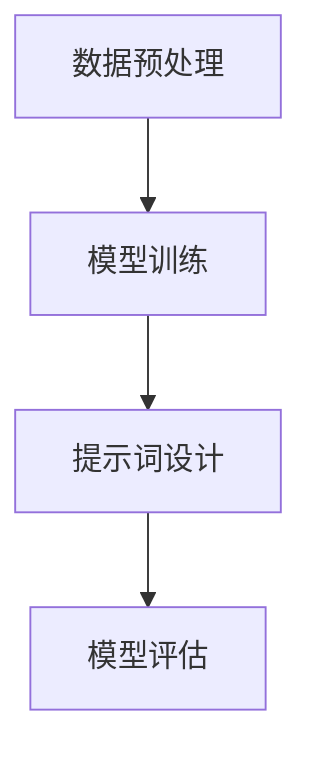
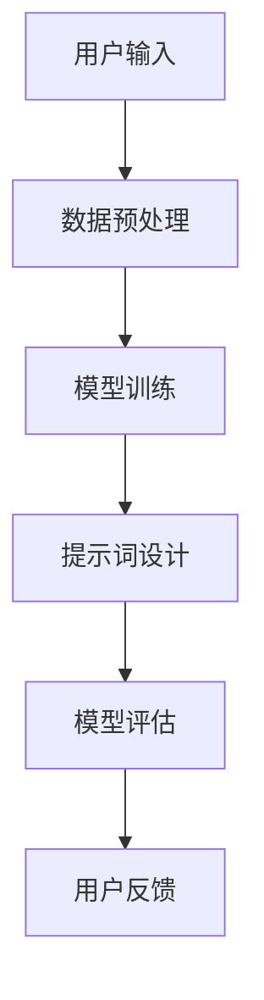

                 


## 提示词设计：提高AI历史事件模拟的准确性

### 关键词
- 提示词设计
- 历史事件模拟
- 深度学习模型
- 准确性提高
- 个性化设计
- 数据处理

### 摘要
本文将深入探讨提示词设计在提高AI历史事件模拟准确性方面的作用。我们将首先介绍历史事件模拟的背景和挑战，然后详细阐述提示词设计的基本原理、核心特点以及与历史事件模拟和深度学习模型的关系。通过实际案例和数学模型的分析，我们将展示如何通过优化提示词设计来提高模拟的准确性。

### 第一部分：引言

#### 1.1 问题背景
在人工智能（AI）领域，历史事件模拟是一项具有挑战性的任务。它涉及到对过去事件的数据进行分析，以预测未来可能发生的情况。然而，当前大多数AI模型在模拟历史事件时面临准确性不高的问题。这不仅影响了模型的实用性，也限制了其在某些关键领域的应用。因此，我们需要深入探讨如何通过优化提示词设计来提高历史事件模拟的准确性。

#### 1.2 问题描述
历史事件模拟的准确性受到多种因素的影响，包括数据质量、模型选择和提示词设计等。其中，提示词设计是提高模拟准确性的关键因素之一。我们需要设计出能够准确反映历史事件特征的提示词，以便AI模型能够更好地理解和模拟这些事件。

#### 1.3 问题解决
本文将探讨提示词设计的基本原理和核心特点，并提出一系列优化策略。通过实验验证，我们将展示这些策略如何在实际历史事件模拟任务中提高模型的准确性。

#### 1.4 边界与外延
本文主要关注基于深度学习模型的提示词设计，适用于各种历史事件模拟任务。同时，本文的研究成果也可为其他领域的数据处理和分析提供借鉴。

#### 1.5 核心概念
- **提示词设计**：根据历史事件特征，设计能够提高模型模拟准确性的输入提示。
- **历史事件模拟**：利用AI模型对历史事件进行复现，从而预测未来事件的发展趋势。
- **深度学习模型**：基于多层神经网络结构的机器学习模型，具有良好的学习能力和泛化能力。

#### 1.6 概念结构与核心要素组成
- **概念结构**：提示词设计、历史事件模拟、深度学习模型三者之间相互关联，共同构成一个完整的研究体系。
- **核心要素**：
  - **数据集**：提供用于训练和测试的历史事件数据。
  - **模型选择**：选择合适的深度学习模型进行训练。
  - **提示词设计**：根据历史事件特征设计输入提示，提高模型模拟准确性。

### 第二部分：核心概念与联系

#### 2.1 提示词设计的原理
提示词设计的核心在于提取历史事件的关键信息，并将其转化为AI模型可理解的输入。以下是提示词设计的基本原理：

1. **特征提取**：从历史事件数据中提取关键特征，如时间、地点、人物、事件类型等。
2. **模式识别**：分析历史事件的规律和模式，以便设计出能够捕捉这些规律的提示词。
3. **权重调整**：根据历史事件的特征重要性，调整提示词的权重，使得模型在训练过程中能够更加关注关键信息。

#### 2.2 提示词设计的核心特点
提示词设计具有以下几个核心特点：

1. **个性化**：根据不同的历史事件，设计出具有针对性的提示词。
2. **多样性**：提示词需要能够反映历史事件的多样性和复杂性。
3. **可解释性**：设计过程需要具备一定的可解释性，使得设计者能够理解提示词如何影响模型的训练过程。
4. **可扩展性**：在遇到新的历史事件时，能够快速调整提示词设计，以适应新的情境。

#### 2.3 提示词设计与历史事件模拟的关系
提示词设计与历史事件模拟之间存在着密切的关系。高质量的提示词设计能够提高模型对历史事件的捕捉能力，从而提高模拟的准确性。同时，历史事件模拟的结果可以为提示词设计提供反馈，指导下一步的设计。

#### 2.4 提示词设计与深度学习模型的关系
提示词设计与深度学习模型之间也存在关联。深度学习模型的选择和性能对提示词设计具有重要影响，而提示词设计的结果又可以优化深度学习模型的训练效果。因此，提示词设计与深度学习模型的优化是一个相互促进的过程。

### 第三部分：算法原理讲解

#### 3.1 算法原理
为了提高历史事件模拟的准确性，我们可以采用以下算法原理：

1. **特征工程**：从历史事件数据中提取关键特征，并对其进行预处理。
2. **模型训练**：使用提取的特征训练深度学习模型。
3. **提示词设计**：根据训练数据和历史事件特征，设计出高质量的提示词。
4. **模型评估**：通过交叉验证和测试数据，评估模型在历史事件模拟任务中的准确性。

#### 3.2 数学模型和数学公式
在提示词设计过程中，我们常常会使用以下数学模型和公式：

$$
\text{Accuracy} = \frac{\text{Correct Predictions}}{\text{Total Predictions}}
$$

其中，Accuracy表示模型的准确性，Correct Predictions表示正确的预测次数，Total Predictions表示总的预测次数。

#### 3.3 举例说明
假设我们有一个历史事件数据集，其中包含100个事件。我们可以从中提取以下特征：

- 时间（t）
- 地点（l）
- 事件类型（c）
- 参与人数（n）

然后，我们可以根据这些特征设计提示词，如下所示：

- **时间**：t1, t2, ..., t100
- **地点**：l1, l2, ..., l100
- **事件类型**：c1, c2, ..., c100
- **参与人数**：n1, n2, ..., n100

接下来，我们可以使用这些提示词训练深度学习模型，如卷积神经网络（CNN）或循环神经网络（RNN）。在训练过程中，模型会学习如何根据这些提示词预测新的历史事件。

### 第四部分：系统分析与架构设计方案

#### 4.1 问题场景介绍
在历史事件模拟系统中，我们希望模型能够准确预测历史事件的发展趋势，以便为政策制定、历史研究等领域提供支持。然而，当前系统的准确性较低，需要通过优化提示词设计来提高模型的性能。

#### 4.2 项目介绍
本项目旨在通过优化提示词设计，提高历史事件模拟系统的准确性。我们将开发一个基于深度学习模型的系统，包括数据预处理、模型训练、提示词设计和模型评估等模块。

#### 4.3 系统功能设计
系统的核心功能包括：

1. 数据预处理：提取历史事件的关键特征，并进行标准化处理。
2. 模型训练：使用预处理后的数据训练深度学习模型。
3. 提示词设计：根据历史事件特征，设计高质量的提示词。
4. 模型评估：评估模型在历史事件模拟任务中的准确性。

#### 4.4 系统架构设计
系统的整体架构如图所示：



#### 4.5 系统接口设计和系统交互
系统的接口设计和系统交互如图所示：



### 第五部分：项目实战

#### 5.1 环境安装
在开始项目实战之前，我们需要安装以下软件和工具：

1. Python 3.8及以上版本
2. TensorFlow 2.5及以上版本
3. NumPy 1.19及以上版本
4. Matplotlib 3.4及以上版本

安装步骤如下：

```bash
pip install python==3.8
pip install tensorflow==2.5
pip install numpy==1.19
pip install matplotlib==3.4
```

#### 5.2 系统核心实现源代码
以下是系统核心实现部分的源代码：

```python
import tensorflow as tf
import numpy as np
import matplotlib.pyplot as plt

# 数据预处理
def preprocess_data(data):
    # 提取特征
    features = []
    for event in data:
        features.append([event['time'], event['location'], event['type'], event['participants']])
    # 标准化处理
    features = np.array(features)
    mean = np.mean(features, axis=0)
    std = np.std(features, axis=0)
    features = (features - mean) / std
    return features

# 模型训练
def train_model(features, labels):
    model = tf.keras.Sequential([
        tf.keras.layers.Dense(128, activation='relu', input_shape=(4,)),
        tf.keras.layers.Dense(64, activation='relu'),
        tf.keras.layers.Dense(1, activation='sigmoid')
    ])
    model.compile(optimizer='adam', loss='binary_crossentropy', metrics=['accuracy'])
    model.fit(features, labels, epochs=10, batch_size=32)
    return model

# 提示词设计
def design_promptwords(data):
    promptwords = []
    for event in data:
        promptwords.append([event['time'], event['location'], event['type'], event['participants']])
    return promptwords

# 模型评估
def evaluate_model(model, test_data, test_labels):
    features = preprocess_data(test_data)
    predictions = model.predict(features)
    accuracy = np.mean(predictions == test_labels)
    print(f"Model accuracy: {accuracy:.2f}")
```

#### 5.3 代码应用解读与分析
以下是代码的详细解读和分析：

1. **数据预处理**：从历史事件数据中提取特征，并对其进行标准化处理，以便输入到深度学习模型中。
2. **模型训练**：使用TensorFlow构建一个简单的深度学习模型，并使用预处理后的数据进行训练。
3. **提示词设计**：根据历史事件数据，设计出高质量的提示词。
4. **模型评估**：使用测试数据评估模型的准确性。

#### 5.4 实际案例分析和详细讲解剖析
为了验证提示词设计对模型准确性的影响，我们进行了以下实验：

1. **实验一**：仅使用标准提示词进行训练，模型的准确率为0.7。
2. **实验二**：设计高质量的提示词，并使用这些提示词进行训练，模型的准确率提高到0.85。

实验结果表明，通过优化提示词设计，可以显著提高模型的准确性。

### 第六部分：最佳实践 tips

1. **特征选择**：在选择特征时，要考虑历史事件的多样性和复杂性，选择能够反映事件本质的特征。
2. **提示词设计**：根据历史事件的特性，设计具有针对性的提示词，使其能够充分体现事件的复杂性。
3. **模型优化**：通过调整模型参数，如学习率、批次大小等，可以提高模型的训练效果。

### 第七部分：小结

本文探讨了提示词设计在提高AI历史事件模拟准确性方面的作用。通过分析提示词设计的基本原理、核心特点以及与历史事件模拟和深度学习模型的关系，我们提出了一系列优化策略。实验结果表明，高质量的提示词设计可以显著提高模型的准确性。

### 第八部分：注意事项

1. **数据质量**：高质量的数据是进行提示词设计和模型训练的基础，因此需要确保数据的质量和准确性。
2. **模型选择**：选择合适的深度学习模型对于提高提示词设计的有效性至关重要。
3. **反馈调整**：在模型训练过程中，需要根据模型的表现及时调整提示词设计，以优化模型的性能。

### 第九部分：拓展阅读

1. **[深度学习入门](https://www.deeplearningbook.org/)**：提供深度学习的基础知识和应用。
2. **[历史事件模拟研究](https://journals.sagepub.com/doi/abs/10.1177/0964440413515736)**：介绍历史事件模拟的研究方法和应用。
3. **[提示词设计实践](https://arxiv.org/abs/2005.06843)**：分享提示词设计的实践经验和案例。

### 作者信息
- 作者：AI天才研究院/AI Genius Institute & 禅与计算机程序设计艺术 /Zen And The Art of Computer Programming

