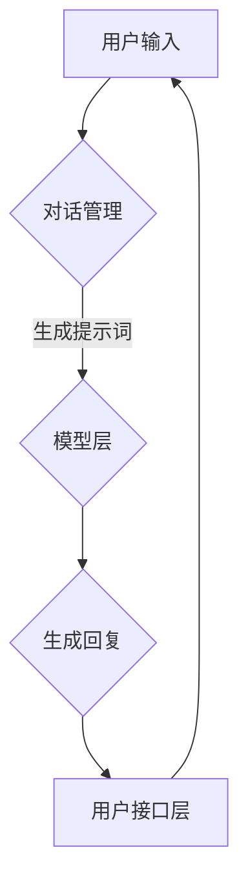
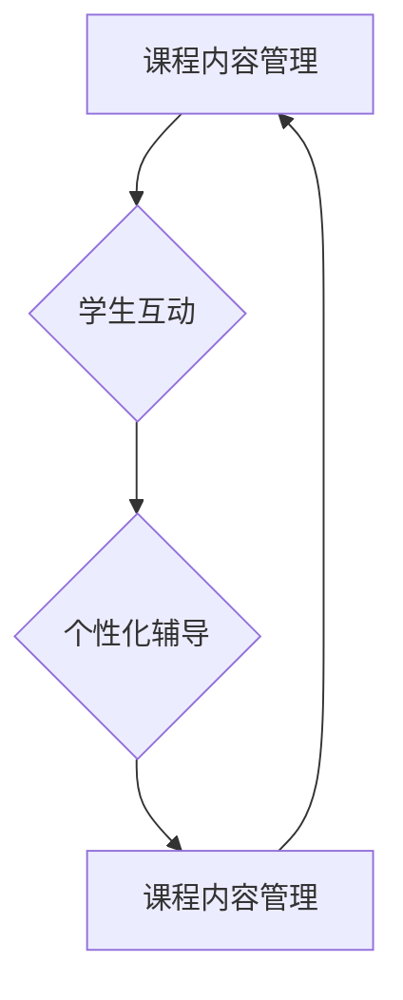

                 

# 提示词设计：提高AI对话的连贯性

## 关键词
- AI对话
- 提示词设计
- 连贯性
- 用户体验
- AI模型优化

## 摘要
本文将深入探讨提示词设计在提升AI对话连贯性中的关键作用。通过详细分析AI对话系统的背景与挑战，提示词设计的基础原则，不同类型的提示词及其应用，以及提示词设计与连贯性、用户体验和AI模型优化之间的关系，本文旨在为读者提供一个全面的指南，帮助他们在实际项目中设计出更加自然、流畅的AI对话系统。

## 目录大纲

### 第一部分: 背景与概念理解

### 第1章: AI对话背景与挑战

#### 1.1.1 对话系统的历史与发展
#### 1.1.2 AI对话的重要性
#### 1.1.3 当前AI对话面临的主要挑战

### 第2章: 提示词设计基础

#### 2.1 提示词的基本概念
#### 2.2 提示词在对话中的作用
#### 2.3 提示词设计原则

### 第3章: 提示词的类型与应用

#### 3.1 基础提示词
#### 3.2 领域特定提示词
#### 3.3 动态生成提示词

### 第4章: 提示词设计与连贯性

#### 4.1 连贯性在对话中的重要性
#### 4.2 提示词设计如何提升连贯性
#### 4.3 提示词设计的连贯性测试方法

### 第5章: 提示词设计与用户体验

#### 5.1 用户需求分析
#### 5.2 用户画像与提示词设计
#### 5.3 提示词设计中的用户测试

### 第6章: 提示词设计与AI模型优化

#### 6.1 AI模型介绍
#### 6.2 提示词对AI模型的影响
#### 6.3 提示词设计与AI模型优化策略

### 第7章: 提示词设计实战案例

#### 7.1 实战案例1：智能客服系统
#### 7.2 实战案例2：智能家居对话系统
#### 7.3 实战案例3：教育辅导系统

### 第8章: 最佳实践与未来展望

#### 8.1 最佳实践总结
#### 8.2 提示词设计的未来发展趋势
#### 8.3 小结与拓展阅读

### 第1章: AI对话背景与挑战

### 1.1.1 对话系统的历史与发展

对话系统（Dialogue System）是人工智能领域的一个重要分支，其目标是实现人与机器之间的自然语言交互。从早期的规则驱动型系统到现在的数据驱动型系统，对话系统的发展经历了多个阶段。

**规则驱动型系统**：早期对话系统主要通过预定义的规则来响应用户的输入。这些规则通常由专家编写，适用于特定领域的问题。例如，早期的机票预订系统就是基于规则驱动的。

**模板匹配系统**：随着自然语言处理技术的发展，对话系统开始采用模板匹配的方法。在这种系统中，用户的输入被与预定义的模板进行匹配，以生成响应。这种方法的优点是简单且易于实现，但其缺点是灵活性较低，难以处理复杂的对话场景。

**数据驱动型系统**：随着大数据和机器学习技术的发展，数据驱动型对话系统逐渐成为主流。这些系统通过大量对话数据来训练模型，使其能够自动生成自然、连贯的回复。例如，基于递归神经网络（RNN）和转换器生成器框架（Transformer）的对话系统。

**深度强化学习**：近年来，深度强化学习（Deep Reinforcement Learning）也被广泛应用于对话系统。通过让模型在与用户交互的过程中不断学习和调整策略，深度强化学习可以帮助对话系统更好地适应不同的对话场景。

### 1.1.2 AI对话的重要性

AI对话系统在多个领域都有广泛的应用，其重要性体现在以下几个方面：

**客户服务**：智能客服系统可以提供24/7的全天候服务，帮助企业降低运营成本，提高客户满意度。

**虚拟助手**：智能虚拟助手（如Siri、Alexa）已经成为人们日常生活的一部分，它们可以帮助用户完成各种任务，从设置提醒到控制智能家居设备。

**健康医疗**：AI对话系统可以帮助医生进行诊断、病情监测和患者教育，提高医疗服务的效率和质量。

**教育**：教育领域的对话系统能够为学生提供个性化的学习辅导，帮助他们更好地掌握知识。

**安全监控**：AI对话系统可以用于安全监控，实时识别和响应异常行为，提高安全防护能力。

### 1.1.3 当前AI对话面临的主要挑战

尽管AI对话系统取得了显著进展，但仍然面临一些挑战：

**语义理解**：自然语言语义理解是AI对话系统的核心挑战。用户输入的语义可能非常复杂，需要模型能够准确理解并生成相应的回复。

**连贯性**：对话的连贯性是用户体验的关键。如果对话系统无法保持连贯性，用户可能会感到困惑或不满。

**个性化**：每个用户的需求和偏好都不同，对话系统需要能够根据用户的历史数据和反馈进行个性化调整。

**多模态交互**：未来的对话系统将需要支持多种交互方式，如语音、文本、图像等，这增加了系统的复杂度。

**隐私与安全**：在处理用户数据时，对话系统需要确保隐私和安全，防止数据泄露和滥用。

### 第2章: 提示词设计基础

### 2.1 提示词的基本概念

提示词（Prompt）是在对话系统中提供给AI模型的信息，用于引导模型生成合适的回复。提示词设计的关键在于确保其能够准确地传达用户的意图，同时为模型提供足够的信息来生成连贯、自然的回复。

**提示词的来源**：提示词可以来自多个渠道，包括用户的输入、模型自身的预测和历史对话数据。例如，在对话系统中，用户输入的文本可以直接作为提示词，而模型预测的结果也可以被用作后续的提示词。

**提示词的形式**：提示词可以是文本、语音或图像等多种形式。在实际应用中，文本提示词是最常见的，因为它们可以直接被自然语言处理模型处理。

**提示词的作用**：提示词在对话系统中有以下几个作用：

- **引导模型理解用户意图**：通过提供相关的上下文信息，提示词可以帮助模型更好地理解用户的意图，从而生成更准确的回复。
- **提高对话连贯性**：合适的提示词可以保持对话的连贯性，使对话更加自然和流畅。
- **优化用户体验**：通过设计高质量的提示词，可以提升用户的整体体验，增加用户对系统的满意度和忠诚度。

### 2.2 提示词在对话中的作用

在对话系统中，提示词的作用至关重要，它们直接影响对话的质量和用户的体验。以下是提示词在对话系统中的几个关键作用：

**上下文信息的提供**：提示词可以包含用户的先前对话历史，帮助模型理解当前对话的上下文。例如，在用户询问“我明天有哪些约会？”时，如果提示词中包含之前的对话记录，模型就能更好地理解用户的意图，并提供更准确的回复。

**意图识别**：提示词可以包含关键信息，帮助模型识别用户的意图。例如，当用户说“我饿了”时，提示词中的“饿了”可以帮助模型识别出用户的意图是寻找食物。

**连贯性维护**：通过设计连贯的提示词，对话系统能够保持对话的自然流畅。例如，在用户询问“这个餐厅的环境怎么样？”后，提示词可以包含之前用户对餐厅的评价，使对话更加连贯。

**优化回复生成**：提示词可以提供额外的信息，帮助模型生成更丰富、更具体的回复。例如，当用户询问“天气预报”时，提示词可以包含用户所在的城市名称，从而使模型能够生成更精确的天气预报信息。

### 2.3 提示词设计原则

为了确保提示词能够有效提升对话连贯性和用户体验，设计提示词时需要遵循以下原则：

**简洁明了**：提示词应该简洁明了，避免使用冗长的句子或复杂的语法结构，以免给模型增加不必要的负担。

**相关性**：提示词应与用户的意图密切相关，确保模型能够准确理解用户的意图。

**连贯性**：提示词应保持对话的连贯性，使对话系统能够自然地延续对话。

**灵活性**：提示词设计应具有一定的灵活性，以适应不同对话场景和用户需求。

**可扩展性**：提示词设计应具备良好的可扩展性，以支持未来系统的功能和性能扩展。

### 第3章: 提示词的类型与应用

### 3.1 基础提示词

基础提示词是对话系统中最常用的提示词类型，它们通常用于提供基本的上下文信息和意图识别。基础提示词通常包括用户的输入文本、当前对话的历史记录以及一些预设的语句模板。以下是一些常见的基础提示词示例：

- **用户输入文本**：“你能帮我查一下明天的天气吗？”
- **对话历史记录**：“你对明天的天气有什么特别的需求吗？”
- **预设语句模板**：“请告诉我您想要了解的内容。”

**基础提示词的应用场景**：

1. **意图识别**：基础提示词可以帮助模型识别用户的意图。例如，当用户输入“查天气”时，模型可以将其识别为查询天气信息的意图。
2. **上下文信息提供**：基础提示词可以提供当前对话的上下文信息，帮助模型更好地理解用户的意图。例如，在用户询问“明天的天气”后，模型可以使用之前获取的地点信息来生成更精确的回复。
3. **连贯性维护**：基础提示词可以保持对话的连贯性，使对话系统能够自然地延续对话。

### 3.2 领域特定提示词

领域特定提示词是为特定领域（如医疗、金融、法律等）设计的提示词，它们通常包含该领域的专业知识，用于帮助模型生成更专业、更准确的回复。以下是一些常见的领域特定提示词示例：

- **医疗领域**：“请问您的主要症状是什么？”
- **金融领域**：“您的投资目标是长期还是短期？”
- **法律领域**：“您需要咨询哪个法律问题？”

**领域特定提示词的应用场景**：

1. **专业知识提供**：领域特定提示词可以帮助模型提供该领域的专业知识，从而生成更专业、更准确的回复。例如，在医疗领域，领域特定提示词可以帮助模型生成有关症状和治疗的详细信息。
2. **意图识别**：领域特定提示词可以更好地识别用户在特定领域的意图，从而提供更针对性的服务。例如，当用户询问“如何治疗失眠”时，领域特定提示词可以帮助模型识别出用户在医疗领域的查询意图。
3. **连贯性维护**：领域特定提示词可以保持对话在特定领域的连贯性，使对话系统能够更专注于用户的需求。

### 3.3 动态生成提示词

动态生成提示词是根据实时对话数据和用户行为动态生成的提示词，它们可以更好地适应用户的动态需求，提高对话的灵活性和用户体验。以下是一些常见的动态生成提示词示例：

- **根据用户行为**：“您似乎对这个话题很感兴趣，还有其他问题吗？”
- **根据实时数据**：“根据我们的最新数据，这个产品在市场上很受欢迎。”

**动态生成提示词的应用场景**：

1. **个性化服务**：动态生成提示词可以根据用户的行为和历史数据提供个性化的服务，从而更好地满足用户的需求。例如，当用户浏览购物网站时，动态生成提示词可以推荐用户可能感兴趣的商品。
2. **实时更新**：动态生成提示词可以实时更新对话内容，确保对话系统提供最新的信息。例如，在金融领域，动态生成提示词可以实时更新市场动态和投资建议。
3. **灵活性提升**：动态生成提示词可以提高对话系统的灵活性，使系统能够更好地适应各种对话场景和用户需求。

### 第4章: 提示词设计与连贯性

#### 4.1 连贯性在对话中的重要性

在AI对话系统中，连贯性（Coherence）是用户体验的关键因素之一。良好的连贯性可以使对话系统更自然、流畅地与用户进行交互，从而提高用户满意度。以下是连贯性在对话中的重要性：

**提升用户体验**：连贯性是用户评估对话系统质量的重要标准。如果对话系统能够保持对话的连贯性，用户会感到更加舒适和满意，从而增加对系统的信任和依赖。

**减少用户困惑**：不连贯的对话会使用户感到困惑和不知所措，从而影响用户体验。例如，如果对话系统在用户询问“明天天气如何？”后突然跳转到“您有什么其他需求吗？”这样的话题转换会使用户感到困惑。

**增强互动性**：连贯性可以增强对话系统的互动性，使用户感到更加主动和参与。例如，如果对话系统能够在用户提出问题时提供相关上下文信息，用户会感到对话更加自然和丰富。

**提高任务完成率**：在任务导向的对话场景中，连贯性可以显著提高任务完成率。例如，在客户服务场景中，如果对话系统能够保持连贯性，用户更容易完成任务并获得满意的解决方案。

#### 4.2 提示词设计如何提升连贯性

提示词设计在提升对话连贯性中起着至关重要的作用。以下是几个关键策略：

**上下文信息补充**：设计提示词时，应确保其包含足够的上下文信息，帮助模型理解用户意图和对话背景。例如，在用户询问“明天天气如何？”时，提示词可以补充用户所在地点和历史天气数据。

**意图明确性**：确保提示词明确传达用户的意图，避免模糊或歧义。例如，在用户询问“这个餐厅怎么样？”时，提示词可以明确指出用户是在询问餐厅的环境、口味还是价格。

**连贯性测试**：在部署对话系统之前，应进行连贯性测试，确保系统在各种对话场景中能够保持连贯性。可以通过人工审查、自动化测试或用户测试等方法进行评估。

**动态调整**：根据用户反馈和对话行为动态调整提示词，以保持对话的连贯性。例如，当用户对某个话题表现出兴趣时，提示词可以相应地提供更多相关信息。

#### 4.3 提示词设计的连贯性测试方法

为了确保提示词设计能够有效提升对话连贯性，可以采用以下几种测试方法：

**人工审查**：由人类专家对对话系统的回复进行审查，评估其连贯性和合理性。这种方法可以提供深入的理解和反馈，但耗时较长且成本较高。

**自动化测试**：使用自动化工具（如测试框架）对对话系统的回复进行连贯性测试。这种方法可以快速评估大量对话样本，但可能难以覆盖所有可能的对话场景。

**用户测试**：邀请真实用户参与对话系统，评估其连贯性和用户体验。这种方法可以提供最真实的用户反馈，但需要较长时间和资源。

### 第5章: 提示词设计与用户体验

#### 5.1 用户需求分析

用户需求分析是提示词设计的重要基础，通过对用户需求的理解和洞察，可以设计出更符合用户期望的提示词。以下是用户需求分析的关键步骤：

**收集用户反馈**：通过问卷调查、用户访谈、反馈收集工具等方式收集用户对现有对话系统的反馈。这些反馈可以帮助了解用户对对话系统功能、性能和用户体验的具体需求和期望。

**用户行为分析**：分析用户在对话系统中的行为模式，包括用户输入、点击、交互路径等。这些数据可以揭示用户的偏好和习惯，为提示词设计提供有价值的信息。

**用户画像构建**：根据收集的数据构建用户画像，包括用户的年龄、性别、兴趣、使用场景等。用户画像可以帮助确定不同用户群体的特点，从而设计出更具针对性的提示词。

**需求分类与优先级排序**：将收集到的用户需求进行分类，并按照优先级进行排序。这样可以确保在设计提示词时能够优先满足最重要的用户需求。

#### 5.2 用户画像与提示词设计

用户画像（User Profiling）是了解用户特征和需求的重要工具，通过构建用户画像，可以设计出更符合用户特点的提示词。以下是用户画像与提示词设计的关系：

**个性化提示词**：根据用户画像，可以为不同用户群体设计个性化的提示词。例如，对于年轻用户，可以使用更活泼、轻松的语言；对于商务用户，可以使用更正式、专业的语言。

**兴趣偏好**：了解用户的兴趣和偏好可以帮助设计更具针对性的提示词。例如，对于喜欢运动的用户，可以在对话中提到健身、运动相关的信息；对于喜欢旅行的用户，可以提供旅游建议和景点信息。

**使用场景**：根据用户的使用场景，可以为不同的场景设计特定的提示词。例如，在工作场景中，可以设计工作相关的问题和建议；在娱乐场景中，可以设计轻松、有趣的对话内容。

**文化背景**：考虑用户的文化背景和语言习惯，可以为不同文化背景的用户设计适合其习惯的提示词。例如，对于英语用户，可以使用英语提示词；对于中文用户，可以使用中文提示词。

#### 5.3 提示词设计中的用户测试

用户测试（User Testing）是评估提示词设计有效性的关键步骤，通过真实用户的反馈，可以发现和改进提示词设计中的问题。以下是提示词设计中的用户测试方法：

**A/B测试**：将不同的提示词设计展示给不同用户群体，比较其效果，选择更受欢迎的提示词。这种方法可以帮助确定哪种提示词设计更能满足用户需求。

**可用性测试**：邀请用户参与对话系统，观察他们与系统的互动过程，记录用户的行为和反馈。这种方法可以帮助评估提示词设计的可用性和用户体验。

**反馈收集**：在用户测试过程中，收集用户的反馈和意见，包括他们对提示词的喜好、困惑和不满意之处。这些反馈可以帮助改进提示词设计。

**迭代优化**：根据用户测试结果，对提示词设计进行迭代优化，不断改进和完善。这种方法可以确保提示词设计始终符合用户需求和期望。

### 第6章: 提示词设计与AI模型优化

#### 6.1 AI模型介绍

在AI对话系统中，提示词设计不仅影响用户体验，还直接关系到AI模型的性能和优化。本节将介绍常用的AI模型及其与提示词设计的关系。

**递归神经网络（RNN）**：RNN是一种能够处理序列数据的神经网络，其在对话系统中有广泛应用。RNN通过记忆过往的信息，能够在对话中保持上下文的连贯性。然而，RNN在处理长序列时存在梯度消失或爆炸的问题。

**长短期记忆网络（LSTM）**：LSTM是RNN的一种改进，通过引入门控机制，有效解决了梯度消失问题。LSTM在处理长序列对话时表现出色，能够保持对话的连贯性。

**转换器（Transformer）**：Transformer是近年来在自然语言处理领域取得突破的模型，其基于注意力机制，能够并行处理序列数据，大大提高了计算效率。Transformer在生成连贯对话方面表现出色，已经成为对话系统的主要选择。

**生成对抗网络（GAN）**：GAN是一种通过生成模型和判别模型相互竞争的模型，能够在对话系统中生成高质量的对话数据，从而提升模型的训练效果。

**变分自编码器（VAE）**：VAE是一种能够生成多样化数据的概率生成模型，其在对话系统中可以用于生成多样化的对话内容，增强对话的丰富性和灵活性。

#### 6.2 提示词对AI模型的影响

提示词设计对AI模型的影响主要体现在以下几个方面：

**意图识别**：提示词可以帮助模型更好地理解用户的意图，从而生成更准确的回复。例如，在用户询问“明天天气如何？”时，包含用户位置的提示词可以帮助模型更准确地识别出用户的查询意图。

**上下文信息**：提示词可以提供丰富的上下文信息，帮助模型在对话中保持连贯性。例如，在用户连续提问时，包含先前提问的提示词可以帮助模型理解当前提问的上下文。

**数据丰富性**：提示词可以丰富对话数据，提高模型的训练效果。例如，在训练对话系统时，包含多样化提示词的对话数据可以帮助模型学习到更丰富的对话模式。

**性能优化**：通过设计高质量的提示词，可以优化AI模型的性能。例如，使用动态生成提示词可以增强模型的灵活性和适应性，从而提高对话系统的整体性能。

#### 6.3 提示词设计与AI模型优化策略

为了确保AI模型能够高效地生成连贯的对话，提示词设计需要与模型优化策略相结合。以下是几个关键策略：

**数据增强**：通过生成多样化的提示词，丰富对话数据，提高模型的训练效果。可以使用数据增强技术，如GAN或VAE，生成高质量的对话数据。

**动态调整**：根据对话系统的实际表现，动态调整提示词，优化对话的连贯性和用户体验。可以使用在线学习技术，实时调整提示词，以适应用户的需求。

**多模态融合**：将不同模态（如文本、语音、图像）的数据进行融合，生成更丰富的提示词，提高模型的多样性。例如，在医疗领域，可以将患者的历史病历、医生的建议和用户的症状描述进行融合，生成高质量的提示词。

**反馈机制**：建立用户反馈机制，收集用户的意见和建议，用于改进提示词设计和AI模型。通过不断优化提示词，可以提高对话系统的性能和用户体验。

### 第7章: 提示词设计实战案例

#### 7.1 实战案例1：智能客服系统

智能客服系统是提示词设计的重要应用场景之一。本节将介绍一个智能客服系统的设计过程，包括环境安装、系统核心实现和代码应用解读。

**环境安装**

1. 安装Python环境
2. 安装自然语言处理库（如NLTK、spaCy）
3. 安装深度学习框架（如TensorFlow、PyTorch）

**系统核心实现**

1. 数据预处理：对用户输入进行预处理，包括分词、去除停用词等。
2. 模型训练：使用预训练的模型（如BERT、GPT）进行微调，生成对话回复。
3. 提示词生成：根据用户输入和对话历史，生成动态提示词。

**代码应用解读**

```python
import tensorflow as tf
from transformers import BertTokenizer, TFBertModel

# 数据预处理
def preprocess_text(text):
    # 分词、去除停用词等操作
    return processed_text

# 模型训练
def train_model(dataset):
    # 微调预训练模型
    return model

# 提示词生成
def generate_prompt(user_input, dialogue_history):
    # 生成动态提示词
    return prompt

# 实例化模型
tokenizer = BertTokenizer.from_pretrained('bert-base-uncased')
model = TFBertModel.from_pretrained('bert-base-uncased')

# 训练模型
model = train_model(dataset)

# 生成回复
def generate_response(user_input, dialogue_history):
    input_ids = tokenizer.encode(preprocess_text(user_input), add_special_tokens=True, return_tensors='tf')
    outputs = model(input_ids)
    logits = outputs.logits[:, -1, :]
    predicted_index = tf.argmax(logits, axis=-1).numpy()
    response = tokenizer.decode(predicted_index, skip_special_tokens=True)
    return response

# 用户交互
while True:
    user_input = input("请输入您的疑问：")
    dialogue_history = []
    for history in dialogue_history:
        dialogue_history.append(generate_prompt(user_input, history))
    response = generate_response(user_input, dialogue_history)
    print("系统回复：", response)
```

#### 7.2 实战案例2：智能家居对话系统

智能家居对话系统是另一个提示词设计的重要应用场景。本节将介绍一个智能家居对话系统的设计过程，包括系统架构、功能实现和用户体验优化。

**系统架构**

1. 用户接口层：接收用户输入，展示系统响应。
2. 对话管理层：管理对话流程，生成提示词和回复。
3. 模型层：使用预训练模型（如BERT、GPT）生成对话内容。
4. 数据层：存储用户数据和对话历史。

**功能实现**

1. 用户输入处理：对用户输入进行预处理，包括分词、去除停用词等。
2. 对话流程管理：根据用户输入和对话历史，生成动态提示词和回复。
3. 多模态交互：支持文本、语音、图像等多模态交互。
4. 语音识别与生成：使用语音识别和文本生成技术，实现语音交互。

**用户体验优化**

1. 个性化提示词：根据用户偏好和习惯，设计个性化提示词。
2. 自然语言生成：使用自然语言生成技术，生成更自然、流畅的对话内容。
3. 上下文感知：根据对话上下文，生成相关、连贯的对话内容。
4. 反馈机制：收集用户反馈，不断优化提示词设计和系统性能。



#### 7.3 实战案例3：教育辅导系统

教育辅导系统是另一个重要的提示词设计应用场景。本节将介绍一个教育辅导系统的设计过程，包括课程内容管理、学生互动和个性化辅导。

**系统架构**

1. 课程内容管理：存储和管理课程资料、练习题等。
2. 学生互动：支持学生与系统、学生之间的互动。
3. 个性化辅导：根据学生学习情况和偏好，提供个性化辅导。

**功能实现**

1. 课程内容管理：使用数据库存储课程内容，支持课程发布、更新和检索。
2. 学生互动：支持学生提问、回答、讨论等功能。
3. 个性化辅导：使用自然语言处理和机器学习技术，根据学生学习情况生成个性化辅导内容。

**提示词设计**

1. 课程相关提示词：根据课程内容设计相关提示词，帮助学生理解和掌握课程知识。
2. 互动提示词：设计互动性强的提示词，鼓励学生参与讨论和互动。
3. 个性化辅导提示词：根据学生学习情况和偏好，设计个性化的辅导提示词。



### 第8章: 最佳实践与未来展望

#### 8.1 最佳实践总结

在提示词设计过程中，遵循以下最佳实践可以显著提升对话系统的质量和用户体验：

1. **用户需求分析**：深入了解用户需求，确保提示词设计能够满足用户期望。
2. **数据丰富性**：提供多样化的提示词，提高模型的训练效果和对话灵活性。
3. **动态调整**：根据用户反馈和对话行为动态调整提示词，优化用户体验。
4. **多模态融合**：结合不同模态的数据，提高提示词的丰富性和多样性。
5. **上下文感知**：设计上下文感知的提示词，保持对话的连贯性和自然性。

#### 8.2 提示词设计的未来发展趋势

随着人工智能和自然语言处理技术的不断发展，提示词设计在未来有望实现以下几个趋势：

1. **个性化**：利用深度学习和个性化推荐技术，为用户提供更个性化的提示词。
2. **多模态**：结合文本、语音、图像等多模态数据，设计更丰富、更自然的对话系统。
3. **增强现实**：利用增强现实技术，为用户提供沉浸式的对话体验。
4. **自动化**：开发自动化工具，实现提示词的自动生成和优化。
5. **伦理和隐私**：在提示词设计过程中，充分考虑伦理和隐私问题，确保用户数据的安全和隐私。

#### 8.3 小结与拓展阅读

本文系统地介绍了提示词设计在提升AI对话连贯性中的关键作用。通过对AI对话系统背景、提示词设计基础、不同类型提示词的应用、连贯性设计策略、用户体验优化和AI模型优化等方面的详细探讨，为读者提供了一个全面的指南。

为了深入了解提示词设计的最新进展和最佳实践，读者可以参考以下拓展阅读：

1. **《自然语言处理入门》**：介绍自然语言处理的基础知识和最新技术。
2. **《对话系统设计与实现》**：详细探讨对话系统的设计和实现技术。
3. **《深度学习与自然语言处理》**：介绍深度学习在自然语言处理领域的应用。
4. **《人工智能简史》**：了解人工智能的发展历程和未来趋势。

作者：AI天才研究院/AI Genius Institute & 禅与计算机程序设计艺术 /Zen And The Art of Computer Programming

--------------------------------------------

## 附录：概念属性特征对比表格

### 提示词类型

| 类型             | 定义                                                         | 特点                                                         | 用例                                                         |
|------------------|--------------------------------------------------------------|--------------------------------------------------------------|--------------------------------------------------------------|
| 基础提示词       | 提供基本上下文信息，用于引导模型理解用户意图                   | 简洁明了，相关性高                                           | 识别用户意图，维持对话连贯性                                   |
| 领域特定提示词   | 为特定领域设计，包含领域专业知识，用于生成专业回复             | 针对性强，专业知识丰富                                       | 提供专业服务，提高对话质量                                     |
| 动态生成提示词   | 根据实时对话数据和用户行为动态生成，提高对话灵活性和个性化       | 灵活性高，动态适应性强                                       | 个性化服务，增强用户互动                                       |

### 连贯性测试方法

| 方法           | 描述                                                         | 优点                                                       | 缺点                                                       |
|----------------|--------------------------------------------------------------|------------------------------------------------------------|------------------------------------------------------------|
| 人工审查       | 由人类专家对对话系统的回复进行评估，评估其连贯性和合理性           | 能提供详细、深入的理解和反馈                               | 耗时较长，成本较高                                       |
| 自动化测试     | 使用自动化工具对对话系统的回复进行连贯性测试                   | 快速评估大量对话样本                                     | 可能难以覆盖所有对话场景                                   |
| 用户测试       | 邀请真实用户参与对话系统，评估其连贯性和用户体验                 | 提供最真实的用户反馈                                     | 需要较长时间和资源                                       |

### AI模型类型

| 类型             | 描述                                                         | 特点                                                         | 用例                                                         |
|------------------|--------------------------------------------------------------|--------------------------------------------------------------|--------------------------------------------------------------|
| 递归神经网络（RNN） | 能够处理序列数据的神经网络，通过记忆过往的信息保持对话连贯性       | 能够处理长序列，适用于生成文本                           | 对话系统，语音识别，文本生成等                         |
| 长短期记忆网络（LSTM） | RNN的一种改进，通过门控机制解决梯度消失问题，保持对话连贯性         | 处理长序列能力更强                                       | 对话系统，语音识别，文本生成等                         |
| 转换器（Transformer） | 基于注意力机制的神经网络，能够并行处理序列数据，计算效率高         | 计算效率高，生成文本连贯性强                            | 对话系统，文本生成，机器翻译等                         |
| 生成对抗网络（GAN） | 生成模型和判别模型相互竞争，生成高质量对话数据，提升模型训练效果   | 生成高质量数据                                         | 数据增强，图像生成，文本生成等                         |
| 变分自编码器（VAE） | 概率生成模型，生成多样化数据，增强对话的丰富性和灵活性             | 生成多样化数据                                         | 数据增强，图像生成，文本生成等                         |

## 附录：ER实体关系图

```mermaid
erDiagram
  Customer ||--|{ Conversation }|| DialogueSystem
  Conversation ||--|{ Prompt }|| PromptGenerator
  PromptGenerator ||--|{ Dialogue }|| DialogueManager
  DialogueManager ||--|{ Response }|| ResponseGenerator
  Customer }|--|{ Feedback }|| DialogueSystem
```

### 结论

通过本文的详细探讨，我们深入了解了提示词设计在提升AI对话连贯性中的关键作用。从背景介绍到核心概念，从类型应用到连贯性设计，再到用户体验优化和AI模型优化，本文提供了全面的指南，帮助读者在实际项目中设计出更加自然、流畅的AI对话系统。同时，通过实战案例的分享，我们看到了提示词设计的实际应用效果和未来发展潜力。

随着人工智能技术的不断进步，提示词设计将变得更加智能、多样和个性化。未来，我们将继续关注这一领域的发展，探索更多创新的方法和技术，以提升AI对话系统的整体性能和用户体验。感谢您的阅读，希望本文能为您的实践提供有价值的参考。

