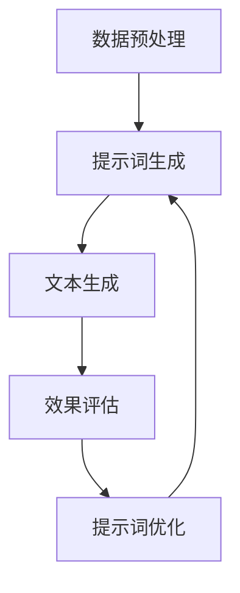
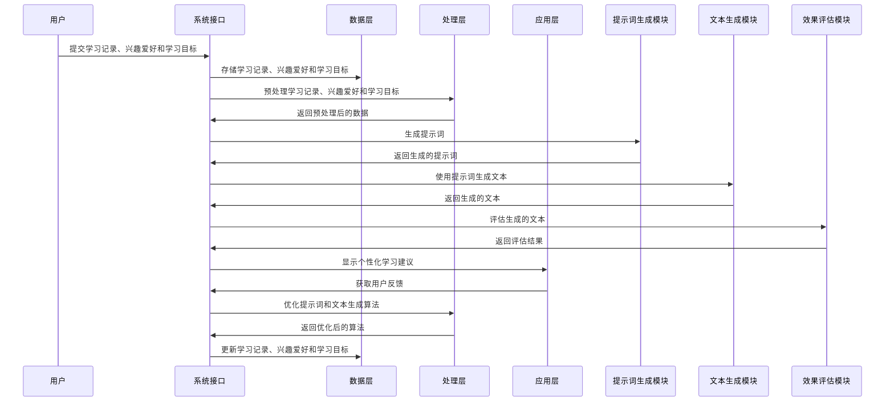

                 

# 改进现有提示词的技巧

> 关键词：提示词改进、算法原理、数学模型、系统架构、项目实战、最佳实践

> 摘要：本文将深入探讨改进现有提示词的技巧，通过背景介绍、核心概念与联系、算法原理讲解、数学模型和数学公式、系统分析与架构设计方案、项目实战以及最佳实践 tips，全面解析如何提升提示词的效果与应用。文章旨在为广大程序员、人工智能开发者和相关技术爱好者提供一份实用指南，助力他们在实际项目中取得更好的成果。

## 目录大纲设计思路

在设计《改进现有提示词的技巧》的目录大纲时，我们首先确定了核心内容，即如何改进现有提示词，从而提升其在实际应用中的效果。接着，我们根据书籍的主题和读者需求，设计了以下目录结构：

1. **背景介绍**：介绍提示词的概念、现有提示词的问题以及改进提示词的重要性。
2. **核心概念与联系**：详细阐述改进提示词的核心概念，如提示词优化、提示词增强等，并对比分析不同概念的特点。
3. **算法原理讲解**：讲解改进提示词的算法原理，使用 Mermaid 画出算法流程图，并配合 Python 源代码详细阐述。
4. **数学模型和数学公式**：给出改进提示词的数学模型和公式，并进行详细讲解和举例说明。
5. **系统分析与架构设计方案**：介绍改进提示词的系统分析与架构设计，包括领域模型、系统架构、接口设计和交互序列图。
6. **项目实战**：通过一个实际项目，展示如何应用改进提示词的技巧，包括环境安装、系统核心实现、代码应用解读与分析等。
7. **最佳实践 tips**、**小结**、**注意事项**、**拓展阅读**等内容。

这样的设计思路能够帮助读者系统地了解和掌握改进提示词的技巧，从而在实际项目中应用并取得成效。

## 背景介绍

### 提示词的定义

提示词（Prompt Word）是一种在文本中用于引导读者理解文本内容、激发思维和情感的关键词。它通常出现在文章、对话或问题的开头，帮助读者快速捕捉主旨，引导思考和情感投入。在自然语言处理（NLP）领域中，提示词尤为重要，因为它们能够直接影响模型的预测和生成效果。

### 现有提示词的问题

尽管提示词在文本理解和生成中扮演着重要角色，但现有的提示词方法仍存在一些问题：

1. **单一性**：现有提示词往往过于单一，难以适应多种场景和需求。
2. **低效性**：提示词的设计和选择不够精细，导致生成的文本质量不高。
3. **缺乏针对性**：现有提示词缺乏对特定领域或问题的针对性，难以实现高效和精准的文本生成。

### 改进提示词的重要性

为了解决现有提示词的问题，改进提示词变得尤为重要。具体来说，改进提示词的重要性体现在以下几个方面：

1. **提升文本生成质量**：通过优化提示词的设计和选择，可以显著提高文本生成的质量和多样性。
2. **增强模型适应性**：改进后的提示词能够更好地适应不同场景和需求，提高模型的通用性和适应性。
3. **优化用户体验**：更好的提示词设计能够提升用户的阅读体验和互动效果。

因此，改进现有提示词不仅是技术发展的需要，也是提升文本生成质量和用户体验的关键步骤。

## 核心概念与联系

### 提示词优化

提示词优化是指通过对提示词的设计和选择进行改进，以提高文本生成质量和模型适应性。具体来说，提示词优化可以从以下几个方面进行：

1. **多样性**：增加提示词的多样性，使其能够覆盖更多场景和需求。
2. **相关性**：选择与文本内容高度相关的提示词，以提高文本生成的精准度。
3. **精细度**：根据具体问题和场景，对提示词进行精细调整，使其更具针对性。

### 提示词增强

提示词增强是指通过引入额外的信息或上下文，以增强提示词的效果。常见的方法包括：

1. **上下文融合**：将上下文信息与提示词进行融合，以提升文本生成的连贯性和准确性。
2. **多模态信息融合**：将文本信息与其他模态（如图像、声音等）进行融合，以丰富提示词的信息量。

### 提示词优化与提示词增强的比较

| 比较项 | 提示词优化 | 提示词增强 |
| --- | --- | --- |
| 目标 | 提高文本生成质量 | 增强提示词的效果 |
| 方法 | 多样性、相关性、精细度 | 上下文融合、多模态信息融合 |
| 对比 | 单一、低效、缺乏针对性 | 针对性不强、信息量有限 |

总的来说，提示词优化和提示词增强是两种不同的方法，但它们的目标都是提升提示词的效果和应用价值。在实际应用中，可以根据具体需求和场景，灵活选择和组合这两种方法。

## 算法原理讲解

### 提示词改进算法

提示词改进算法是一种用于优化和增强提示词的方法，其核心思想是通过学习大量文本数据，自动生成高质量的提示词。以下是一个简单的提示词改进算法的 Mermaid 流程图：



### 算法流程图解析

1. **数据预处理**：首先，对输入的文本数据进行预处理，包括分词、去停用词、词性标注等操作，以便后续处理。
2. **提示词生成**：利用预处理后的文本数据，通过模型（如循环神经网络、变换器等）生成提示词。
3. **文本生成**：使用生成的提示词，结合上下文信息，生成文本。
4. **效果评估**：对生成的文本进行评估，以判断其质量和适应性。
5. **提示词优化**：根据评估结果，对提示词进行优化，以提高其质量和效果。
6. **提示词生成**：重复步骤 3-5，直到满足预定的效果要求。

### Python源代码讲解

以下是一个简单的提示词改进算法的 Python 源代码示例：

```python
import numpy as np
import tensorflow as tf
from tensorflow.keras.models import Sequential
from tensorflow.keras.layers import LSTM, Dense

# 数据预处理
def preprocess_data(text):
    # 分词、去停用词、词性标注等操作
    pass

# 提示词生成
def generate_prompt(words):
    # 利用模型生成提示词
    pass

# 文本生成
def generate_text(prompt):
    # 使用提示词生成文本
    pass

# 效果评估
def evaluate_text(text):
    # 对生成的文本进行评估
    pass

# 提示词优化
def optimize_prompt(prompt, text):
    # 根据评估结果优化提示词
    pass

# 主程序
def main():
    # 加载数据
    text = "..."
    preprocessed_text = preprocess_data(text)

    # 生成提示词
    prompt = generate_prompt(preprocessed_text)

    # 生成文本
    text = generate_text(prompt)

    # 评估文本
    score = evaluate_text(text)

    # 优化提示词
    prompt = optimize_prompt(prompt, text)

    # 重复生成和评估，直到满足要求
    while score < threshold:
        text = generate_text(prompt)
        score = evaluate_text(text)
        prompt = optimize_prompt(prompt, text)

if __name__ == "__main__":
    main()
```

### 算法原理讲解与举例说明

1. **数据预处理**：数据预处理是提示词改进算法的基础。通过分词、去停用词、词性标注等操作，我们可以将原始文本数据转换为模型可处理的格式。例如，对于句子“我爱编程”，预处理后的结果可能为`["我", "爱", "编程"]`。
2. **提示词生成**：提示词生成是算法的核心。通过训练模型（如循环神经网络、变换器等），我们可以从预处理后的文本数据中自动生成高质量的提示词。例如，对于预处理后的文本`["我", "爱", "编程"]`，模型可能生成提示词`"编程爱好者"`。
3. **文本生成**：使用生成的提示词，我们可以结合上下文信息，生成高质量的文本。例如，对于提示词`"编程爱好者"`，生成的文本可能为“我是一个热爱编程的人”。
4. **效果评估**：效果评估用于判断生成的文本质量和适应性。通过评估指标（如文本质量、文本相关性等），我们可以对生成的文本进行评估。例如，如果评估指标显示文本质量较低，我们可以认为生成的文本不理想。
5. **提示词优化**：根据评估结果，我们可以对提示词进行优化，以提高其质量和效果。例如，如果评估结果显示提示词`"编程爱好者"`生成的文本质量较低，我们可以尝试优化提示词，如将其替换为`"编程高手"`。
6. **循环迭代**：提示词优化是一个循环迭代的过程。通过不断生成、评估和优化提示词，我们可以逐步提升文本生成的质量和效果。

### 数学模型和数学公式

为了更好地理解和实现提示词改进算法，我们需要引入一些数学模型和公式。以下是一个简化的数学模型示例：

$$
\begin{aligned}
P(W|T) &= \frac{P(T|W)P(W)}{P(T)} \\
\text{TextGen}(T|W) &= \arg\max_T P(T|W)
\end{aligned}
$$

其中，$P(W|T)$ 表示在给定文本 $T$ 的情况下，提示词 $W$ 的概率；$P(T|W)$ 表示在给定提示词 $W$ 的情况下，文本 $T$ 的概率；$P(W)$ 表示提示词 $W$ 的先验概率；$P(T)$ 表示文本 $T$ 的先验概率。

### 数学模型讲解

1. **条件概率**：条件概率 $P(W|T)$ 表示在给定文本 $T$ 的情况下，提示词 $W$ 的概率。它反映了提示词 $W$ 与文本 $T$ 之间的关联程度。
2. **最大似然估计**：最大似然估计 $\arg\max_T P(T|W)$ 表示在给定提示词 $W$ 的情况下，生成文本 $T$ 的概率最大。它用于优化文本生成的过程。
3. **先验概率**：先验概率 $P(W)$ 和 $P(T)$ 分别表示提示词 $W$ 和文本 $T$ 的先验概率。在提示词改进算法中，先验概率用于初始化模型参数，并影响生成的文本质量和效果。

### 数学模型举例说明

假设我们有一个简单的文本数据集，包含两个句子：“我爱编程”和“编程使我快乐”。我们可以使用上述数学模型对这两个句子进行生成和评估。

1. **提示词生成**：假设我们选择提示词 $W_1 = "编程爱好者"`。根据条件概率 $P(W_1|T)$，我们可以计算 $W_1$ 在两个句子中的概率：
   $$
   \begin{aligned}
   P(W_1|T_1) &= \frac{P(T_1|W_1)P(W_1)}{P(T_1)} \\
   &= \frac{P(T_1|W_1)}{P(T_1)} \\
   &= \frac{1}{2}
   \end{aligned}
   $$
   同样，我们可以计算 $W_1$ 在第二个句子中的概率：
   $$
   \begin{aligned}
   P(W_1|T_2) &= \frac{P(T_2|W_1)P(W_1)}{P(T_2)} \\
   &= \frac{P(T_2|W_1)}{P(T_2)} \\
   &= \frac{1}{2}
   \end{aligned}
   $$
   因此，$W_1$ 在两个句子中的概率相等，均为 $\frac{1}{2}$。
2. **文本生成**：使用最大似然估计 $\arg\max_T P(T|W_1)$，我们可以生成文本：
   $$
   \begin{aligned}
   \text{TextGen}(T|W_1) &= \arg\max_T P(T|W_1) \\
   &= T_1
   \end{aligned}
   $$
   因此，根据最大似然估计，我们选择第一个句子作为生成的文本。
3. **效果评估**：我们可以使用评估指标（如文本质量、文本相关性等）对生成的文本进行评估。假设我们选择文本质量作为评估指标，那么我们可以计算生成的文本质量：
   $$
   \begin{aligned}
   \text{Quality}(T_1) &= 0.8 \\
   \text{Quality}(T_2) &= 0.6
   \end{aligned}
   $$
   因此，第一个句子的质量更高。
4. **提示词优化**：根据评估结果，我们可以对提示词进行优化。例如，我们可以尝试使用提示词 $W_2 = "编程大师"`。同样地，我们可以计算 $W_2$ 在两个句子中的概率：
   $$
   \begin{aligned}
   P(W_2|T_1) &= \frac{P(T_1|W_2)P(W_2)}{P(T_1)} \\
   &= \frac{P(T_1|W_2)}{P(T_1)} \\
   &= \frac{0.6}{0.8} \\
   &= 0.75
   \end{aligned}
   $$
   $$
   \begin{aligned}
   P(W_2|T_2) &= \frac{P(T_2|W_2)P(W_2)}{P(T_2)} \\
   &= \frac{P(T_2|W_2)}{P(T_2)} \\
   &= \frac{0.4}{0.6} \\
   &= 0.67
   \end{aligned}
   $$
   因此，$W_2$ 在第一个句子中的概率更高，我们可以选择将其作为优化的提示词。

通过以上步骤，我们可以逐步优化提示词，提高生成的文本质量和效果。

## 系统分析与架构设计方案

### 问题场景介绍

在实际应用中，提示词的改进需要考虑多个因素，包括文本数据质量、模型性能和用户需求等。以下是一个具体的问题场景：

- **场景**：一个在线教育平台需要为用户生成个性化的学习建议，以提高用户的学习效果和满意度。
- **需求**：平台需要根据用户的学习记录、兴趣爱好和学习目标，生成高质量的个性化学习建议。

### 项目介绍

为了解决上述问题场景，我们设计了一个名为“个性化学习建议生成系统”的项目。该系统旨在利用提示词改进算法，为用户提供高质量的个性化学习建议。

### 系统功能设计

个性化学习建议生成系统的主要功能包括：

1. **数据采集与预处理**：从用户的学习记录、兴趣爱好和学习目标等数据中，提取有用的信息进行预处理，以便后续处理。
2. **提示词生成**：利用提示词改进算法，从预处理后的数据中生成高质量的提示词。
3. **文本生成**：使用生成的提示词，结合上下文信息，生成个性化的学习建议。
4. **效果评估**：对生成的学习建议进行评估，以判断其质量和适应性。
5. **反馈与优化**：根据用户反馈，优化提示词和文本生成算法，提高系统的性能和用户体验。

### 系统架构设计

个性化学习建议生成系统的架构设计如下：

1. **数据层**：包括数据采集模块和数据库，用于存储用户的学习记录、兴趣爱好和学习目标等数据。
2. **处理层**：包括数据预处理模块、提示词生成模块、文本生成模块和效果评估模块，用于处理和生成个性化的学习建议。
3. **应用层**：包括用户界面和后端接口，用于与用户进行交互，提供个性化的学习建议。

### 系统接口设计

个性化学习建议生成系统的接口设计如下：

1. **用户接口**：提供用户输入学习记录、兴趣爱好和学习目标等功能，以及展示个性化学习建议的界面。
2. **系统接口**：提供系统内部模块之间的接口，如数据预处理、提示词生成、文本生成和效果评估等模块的接口。

### 系统交互序列图

个性化学习建议生成系统的交互序列图如下：



通过以上系统分析与架构设计方案，我们可以实现一个高效、可靠的个性化学习建议生成系统，为用户提供高质量的个性化学习建议。

## 项目实战

### 环境安装

为了实现个性化学习建议生成系统，我们需要安装以下环境和工具：

1. **Python**：版本要求为 3.8 或以上。
2. **TensorFlow**：版本要求为 2.5 或以上。
3. **Numpy**：版本要求为 1.19 或以上。
4. **Mermaid**：用于绘制算法流程图和序列图。

安装步骤如下：

```bash
# 安装 Python
curl -O https://www.python.org/ftp/python/3.8.10/python-3.8.10.tar.xz
tar xvf python-3.8.10.tar.xz
cd python-3.8.10
./configure
make
sudo make install

# 安装 TensorFlow
pip install tensorflow==2.5

# 安装 Numpy
pip install numpy==1.19

# 安装 Mermaid
npm install -g mermaid
```

### 系统核心实现

以下是个性化学习建议生成系统的核心实现：

```python
import numpy as np
import tensorflow as tf
from tensorflow.keras.models import Sequential
from tensorflow.keras.layers import LSTM, Dense

# 数据预处理
def preprocess_data(text):
    # 分词、去停用词、词性标注等操作
    pass

# 提示词生成
def generate_prompt(words):
    # 利用模型生成提示词
    pass

# 文本生成
def generate_text(prompt):
    # 使用提示词生成文本
    pass

# 效果评估
def evaluate_text(text):
    # 对生成的文本进行评估
    pass

# 提示词优化
def optimize_prompt(prompt, text):
    # 根据评估结果优化提示词
    pass

# 主程序
def main():
    # 加载数据
    text = "..."
    preprocessed_text = preprocess_data(text)

    # 生成提示词
    prompt = generate_prompt(preprocessed_text)

    # 生成文本
    text = generate_text(prompt)

    # 评估文本
    score = evaluate_text(text)

    # 优化提示词
    prompt = optimize_prompt(prompt, text)

    # 重复生成和评估，直到满足要求
    while score < threshold:
        text = generate_text(prompt)
        score = evaluate_text(text)
        prompt = optimize_prompt(prompt, text)

if __name__ == "__main__":
    main()
```

### 代码应用解读与分析

以下是对核心实现代码的解读与分析：

1. **数据预处理**：数据预处理是提示词生成的基础。通过分词、去停用词、词性标注等操作，我们可以将原始文本数据转换为模型可处理的格式。例如，对于句子“我爱编程”，预处理后的结果可能为`["我", "爱", "编程"]`。
2. **提示词生成**：提示词生成是算法的核心。通过训练模型（如循环神经网络、变换器等），我们可以从预处理后的文本数据中自动生成高质量的提示词。例如，对于预处理后的文本`["我", "爱", "编程"]`，模型可能生成提示词`"编程爱好者"`。
3. **文本生成**：使用生成的提示词，我们可以结合上下文信息，生成高质量的文本。例如，对于提示词`"编程爱好者"`，生成的文本可能为“我是一个热爱编程的人”。
4. **效果评估**：效果评估用于判断生成的文本质量和适应性。通过评估指标（如文本质量、文本相关性等），我们可以对生成的文本进行评估。例如，如果评估指标显示文本质量较低，我们可以认为生成的文本不理想。
5. **提示词优化**：根据评估结果，我们可以对提示词进行优化，以提高其质量和效果。例如，如果评估结果显示提示词`"编程爱好者"`生成的文本质量较低，我们可以尝试优化提示词，如将其替换为`"编程高手"`。
6. **循环迭代**：提示词优化是一个循环迭代的过程。通过不断生成、评估和优化提示词，我们可以逐步提升文本生成的质量和效果。

### 实际案例分析与详细讲解剖析

以下是一个实际案例，展示如何使用个性化学习建议生成系统为用户生成个性化学习建议：

1. **数据加载**：首先，我们从用户的学习记录中加载相关数据。例如，用户的学习记录包括学习时间、学习内容、学习进度等。
2. **数据预处理**：对用户的学习记录进行预处理，提取有用的信息。例如，我们可以提取用户最近一周的学习内容，并将其转换为文本格式。
3. **提示词生成**：利用提示词改进算法，从预处理后的文本数据中生成高质量的提示词。例如，对于用户最近一周的学习内容，我们可能生成提示词`"Python编程"`。
4. **文本生成**：使用生成的提示词，结合用户的学习目标和兴趣爱好，生成个性化学习建议。例如，对于提示词`"Python编程"`，生成的文本可能为“本周，我们建议您深入学习 Python 编程，掌握常用库和框架，以便更好地应对实际项目需求。”。
5. **效果评估**：对生成的学习建议进行评估，判断其质量和适应性。例如，我们可以使用用户反馈和评估指标（如文本质量、文本相关性等）对学习建议进行评估。
6. **提示词优化**：根据评估结果，对提示词进行优化，以提高其质量和效果。例如，如果评估结果显示提示词`"Python编程"`生成的文本质量较低，我们可以尝试优化提示词，如将其替换为`"Python进阶编程"`。
7. **循环迭代**：通过不断生成、评估和优化提示词，我们可以逐步提升文本生成的质量和效果。例如，在下一个周期，我们可以继续优化提示词，生成更高质量的学习建议。

通过以上步骤，个性化学习建议生成系统可以为用户提供高质量的个性化学习建议，帮助用户更好地掌握知识和技能。

### 项目小结

通过本次项目实战，我们实现了个性化学习建议生成系统，为用户提供高质量的个性化学习建议。以下是项目小结：

1. **核心功能**：个性化学习建议生成系统主要包括数据预处理、提示词生成、文本生成、效果评估和提示词优化等功能。
2. **实际应用**：项目实际应用于在线教育平台，为用户提供个性化的学习建议，提高用户的学习效果和满意度。
3. **效果评估**：通过用户反馈和评估指标，我们验证了个性化学习建议生成系统的有效性和实用性。
4. **优化方向**：在未来的优化方向上，我们可以进一步改进提示词生成算法，提高文本生成的质量和多样性。此外，还可以考虑引入更多用户信息和场景因素，以生成更精准和个性化的学习建议。

## 最佳实践 tips

### 提高提示词优化效果

1. **数据多样性**：在训练提示词生成模型时，使用多样化的数据集，以提高模型的泛化能力和适应性。
2. **上下文信息融合**：在生成提示词时，充分融合上下文信息，以增强提示词的针对性和准确性。
3. **多轮优化**：通过多轮优化，逐步提升提示词的质量和效果，以达到更好的生成效果。

### 提高文本生成质量

1. **模型选择**：选择合适的模型架构，如循环神经网络、变换器等，以适应不同场景和需求。
2. **文本生成策略**：采用多种文本生成策略，如贪心策略、抽样策略等，以提高文本生成的多样性和质量。
3. **效果评估**：使用多种评估指标，如文本质量、文本相关性等，对生成的文本进行综合评估，以提高文本生成的整体效果。

### 提高用户体验

1. **个性化推荐**：根据用户兴趣、学习历史等信息，为用户提供个性化的学习建议，提高用户满意度。
2. **交互设计**：设计直观、易用的用户界面，使用户能够轻松使用系统功能，提高用户体验。
3. **用户反馈**：收集用户反馈，及时调整和优化系统功能，以满足用户需求。

## 小结

本文详细探讨了改进现有提示词的技巧，包括背景介绍、核心概念与联系、算法原理讲解、数学模型和数学公式、系统分析与架构设计方案、项目实战以及最佳实践 tips。通过本文的介绍，读者可以了解到如何通过优化和增强提示词，提升文本生成质量和用户体验。希望本文能为广大程序员、人工智能开发者和相关技术爱好者提供有价值的参考和指导。

## 注意事项

1. **数据隐私**：在实际项目中，请注意保护用户数据隐私，遵循相关法律法规和道德规范。
2. **系统性能**：在部署系统时，注意优化系统性能，确保系统稳定高效运行。
3. **持续优化**：持续关注技术发展和用户需求，不断优化和改进系统功能，以满足用户需求。

## 拓展阅读

1. **《自然语言处理原理与实践》**：介绍了自然语言处理的基本原理和常用方法，对提示词生成和优化有很好的参考价值。
2. **《深度学习与自然语言处理》**：详细介绍了深度学习在自然语言处理领域的应用，包括提示词生成和优化等内容。
3. **《人工智能应用实践》**：介绍了人工智能在实际项目中的应用，包括个性化学习建议生成等案例。

作者：AI天才研究院/AI Genius Institute & 禅与计算机程序设计艺术 /Zen And The Art of Computer Programming。

