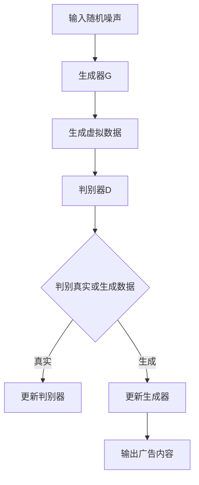
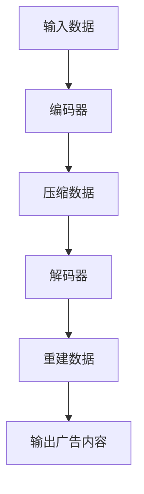
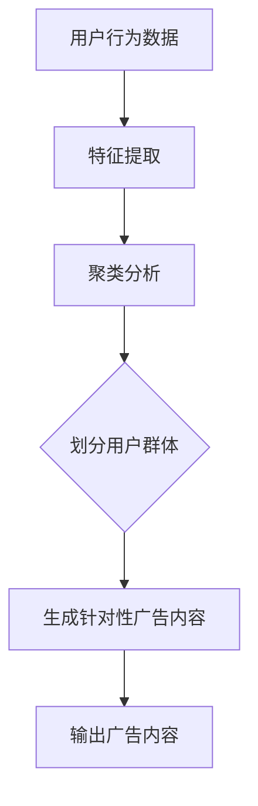
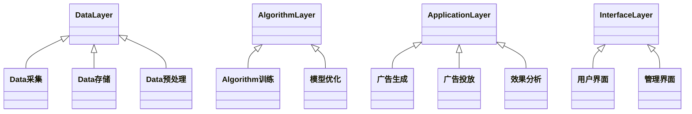
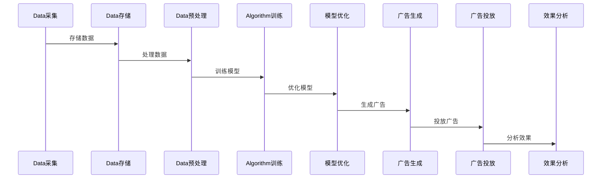

                 


## 提高AI创意广告生成：有效的营销提示词设计

### 关键词：AI、广告创意、营销提示词、用户体验、算法优化

> 摘要：随着人工智能技术的飞速发展，AI在广告创意领域的应用越来越广泛。本文旨在探讨如何通过设计有效的营销提示词，来提高AI广告创意生成的质量和效率，从而更好地满足用户需求，提升用户体验。文章将从背景介绍、核心概念、算法原理、系统分析与架构设计、项目实战等多个方面，详细解析AI创意广告生成中的营销提示词设计策略，为读者提供一套完整、实用的指导方案。

### 目录大纲设计过程

#### 1. 确定书籍主题和目标读者

- **主题**：本书的主题是探讨如何通过AI技术来提高创意广告生成的效率和质量，重点在于营销提示词的设计。
- **目标读者**：旨在帮助市场营销人员、广告策划人员以及AI开发人员掌握AI在广告创意中的应用。

#### 2. 确定章节核心内容

根据主题和目标读者，确定书籍的核心内容，包括背景介绍、核心概念、算法原理讲解、系统分析与架构设计方案、项目实战等。

#### 3. 设计目录大纲

在确保内容完整性和逻辑性的前提下，设计出书籍的目录大纲。以下是《提高AI创意广告生成：有效的营销提示词设计》的目录大纲：

### 第一部分：背景介绍与核心概念

#### 第1章: AI与广告创意的融合

1.1 AI与广告创意的关系

- **1.1.1** 广告创意的发展历程
- **1.1.2** AI在广告创意中的应用现状
- **1.1.3** AI广告创意的优势与挑战

1.2 营销提示词的基本概念

- **1.2.1** 提示词的定义与作用
- **1.2.2** 营销提示词的类型与分类
- **1.2.3** 营销提示词的设计原则

1.3 本章小结

### 第二部分：核心概念与联系

#### 第2章: 营销提示词设计的理论基础

2.1 用户行为分析与需求挖掘

- **2.1.1** 用户行为分析的方法
- **2.1.2** 需求挖掘的关键技术
- **2.1.3** 用户画像与行为预测

2.2 语言模型与生成模型

- **2.2.1** 语言模型的基本原理
- **2.2.2** 生成模型在广告创意中的应用
- **2.2.3** 生成模型与提示词设计的结合

2.3 本章小结

### 第三部分：算法原理讲解

#### 第3章: AI创意广告生成算法详解

3.1 创意广告生成算法概述

- **3.1.1** 创意广告生成算法的分类
- **3.1.2** 常见广告生成算法的比较

3.2 关键算法原理讲解

- **3.2.1** 生成对抗网络(GAN)原理
- **3.2.2** 自动编码器(AE)原理
- **3.2.3** 聚类算法在创意广告生成中的应用

3.3 算法mermaid流程图

3.4 本章小结

### 第四部分：系统分析与架构设计方案

#### 第4章: AI创意广告生成系统设计

4.1 问题场景介绍

- **4.1.1** 广告创意生成系统需求分析
- **4.1.2** 系统目标与功能设计

4.2 系统架构设计

- **4.2.1** 系统架构概述
- **4.2.2** 数据流处理架构设计
- **4.2.3** 系统模块设计

4.3 系统接口设计与交互

- **4.3.1** 接口设计与实现
- **4.3.2** 系统交互设计

4.4 本章小结

### 第五部分：项目实战

#### 第5章: AI创意广告生成项目实战

5.1 环境安装与配置

- **5.1.1** 环境需求与安装步骤
- **5.1.2** 开发环境配置

5.2 系统核心实现

- **5.2.1** 数据预处理
- **5.2.2** 算法实现
- **5.2.3** 提示词设计

5.3 代码应用解读与分析

- **5.3.1** 代码结构与功能解析
- **5.3.2** 关键算法应用分析
- **5.3.3** 提示词设计实例分析

5.4 实际案例分析与讲解

- **5.4.1** 实际案例介绍
- **5.4.2** 案例分析与效果评估
- **5.4.3** 案例总结与反思

5.5 项目小结

---

### 目录大纲设计的详细解释

#### 第一部分：背景介绍与核心概念

第1章主要介绍AI与广告创意的关系，分析AI在广告创意中的应用现状，以及AI广告创意的优势与挑战。同时，探讨营销提示词的基本概念，包括其定义、类型、设计原则等，为后续内容打下基础。

#### 第二部分：核心概念与联系

第2章从用户行为分析与需求挖掘、语言模型与生成模型两个方面，深入探讨营销提示词设计的理论基础。首先，介绍用户行为分析的方法和需求挖掘的关键技术，然后讲解语言模型和生成模型的基本原理，以及它们在广告创意中的应用和与提示词设计的结合。

#### 第三部分：算法原理讲解

第3章详细解析AI创意广告生成算法，包括GAN、AE和聚类算法等。首先概述创意广告生成算法的分类和比较，然后分别介绍关键算法的原理，使用mermaid流程图和Python源代码进行详细讲解和举例说明。

#### 第四部分：系统分析与架构设计方案

第4章介绍AI创意广告生成系统的设计，包括问题场景介绍、系统目标与功能设计、系统架构设计、系统接口设计和系统交互设计等。通过mermaid类图、架构图和序列图，展示系统的整体结构和交互流程。

#### 第五部分：项目实战

第5章通过实际项目实战，详细展示AI创意广告生成系统的实现过程，包括环境安装与配置、系统核心实现、代码应用解读与分析、实际案例分析与讲解等。通过具体案例的剖析，使读者更好地理解营销提示词设计在AI广告创意生成中的应用。

### 目录大纲设计的目的和意义

目录大纲设计的目的是确保书籍内容的完整性和逻辑性，使读者能够系统地了解和掌握AI创意广告生成中营销提示词设计的核心概念、原理和实战方法。通过这样的设计，读者可以：

1. **快速定位学习内容**：根据目录大纲，读者可以迅速找到自己需要了解的核心内容，提高学习效率。
2. **系统掌握知识体系**：目录大纲结构清晰，有助于读者构建完整的知识体系，更好地理解AI广告创意生成与营销提示词设计的关系。
3. **深入理解应用场景**：通过实际项目实战和案例剖析，读者可以深入理解营销提示词设计在AI广告创意生成中的应用，提高实际操作能力。

总之，通过这样的目录大纲设计，本书旨在为读者提供一套全面、系统、实用的AI创意广告生成与营销提示词设计指南。希望读者能够通过本书的学习，提升自己在AI广告创意领域的专业素养和实战能力。接下来，我们将逐步深入探讨每个章节的具体内容。让我们开始这段有趣而充满挑战的旅程吧！### 第1章：AI与广告创意的融合

#### 1.1 AI与广告创意的关系

人工智能（AI）作为现代科技的代表性成就，已经广泛应用于各行各业，其中广告创意领域是其重要应用场景之一。广告创意的核心在于如何以新颖、独特且吸引人的方式传达品牌信息，从而有效吸引潜在客户。而AI技术的引入，使得广告创意生成变得更加智能化、个性化，大大提升了广告的吸引力和转化率。

**1.1.1 广告创意的发展历程**

广告创意的发展可以追溯到古代，但现代广告创意的兴起主要是在20世纪。早期的广告主要以文字和静态图像为主，随着技术的发展，广告形式逐渐多样化，包括电视广告、户外广告、印刷广告等。互联网的普及和社交媒体的兴起，更是将广告创意推向了一个全新的高度。数字广告、互动广告、视频广告等新型广告形式不断涌现，广告创意的表现形式和传播渠道变得更加丰富。

**1.1.2 AI在广告创意中的应用现状**

近年来，AI技术在广告创意领域的应用取得了显著进展。以下是一些主要的应用场景：

- **内容生成**：AI可以自动生成广告文案、广告图像和视频，大大提高了广告创意的生产效率。
- **个性化推荐**：基于用户数据和AI算法，广告系统能够为每个用户推荐最符合其兴趣的广告内容，提升广告的点击率和转化率。
- **图像识别**：AI图像识别技术可以用于广告内容的检测和筛选，确保广告内容的安全性和合规性。
- **用户体验优化**：通过分析用户行为和反馈，AI可以帮助广告创意团队优化广告内容和呈现方式，提高用户体验。

**1.1.3 AI广告创意的优势与挑战**

AI广告创意具有多方面的优势：

- **高效性**：AI能够快速生成大量广告创意，节省了人力和时间成本。
- **个性化**：AI可以根据用户的行为和兴趣，为用户推荐个性化广告，提高广告的吸引力。
- **数据驱动**：AI基于大数据分析，能够更精准地预测广告效果，指导广告创意的优化。

然而，AI广告创意也面临一些挑战：

- **数据隐私**：个性化广告依赖于用户数据的收集和分析，如何保障用户数据隐私是一个重要问题。
- **创意质量**：虽然AI可以生成大量广告创意，但创意质量参差不齐，如何保证创意的高质量是一个挑战。
- **技术门槛**：AI广告创意需要专业的技术支持和团队，这对小型广告公司或个人来说可能是一个门槛。

**1.2 营销提示词的基本概念**

在了解AI广告创意的优势和挑战后，我们需要深入了解营销提示词的基本概念。营销提示词（Marketing Trigger Words）是指在广告创意中用于激发用户兴趣、情感和行动的词语或短语。有效的营销提示词能够引起用户的共鸣，促进广告的点击和转化。

**1.2.1 提示词的定义与作用**

营销提示词的定义相对宽泛，但通常包括以下几类：

- **情感激发词**：如“惊艳”、“心动”、“惊喜”等，能够激发用户的情感反应。
- **行动号召词**：如“立即购买”、“限时抢购”、“马上行动”等，引导用户采取具体行动。
- **价值承诺词**：如“特价优惠”、“质量保证”、“无忧售后”等，强调产品的价值。

提示词在广告中的作用主要体现在以下几个方面：

- **引起注意**：有效的提示词能够迅速吸引观众的注意力，使广告内容在众多信息中脱颖而出。
- **激发兴趣**：提示词可以激发用户的兴趣，使他们对广告内容产生好奇心，从而愿意进一步了解。
- **引导行动**：提示词可以引导用户采取行动，如点击广告链接、进行购买等，提高广告的转化率。

**1.2.2 营销提示词的类型与分类**

营销提示词可以根据不同的分类标准进行划分：

- **按情感因素分类**：可分为兴奋型、悬念型、情感型等，如“震撼上市”、“揭秘”、“令人惊叹”等。
- **按行动号召力分类**：可分为直接号召型、间接号召型等，如“立即购买”、“了解更多”等。
- **按产品属性分类**：可分为品质型、价格型、功能型等，如“质量保证”、“价格优惠”、“功能强大”等。

**1.2.3 营销提示词的设计原则**

设计有效的营销提示词需要遵循一些基本原则：

- **相关性**：提示词应与广告内容紧密相关，避免无关或模糊的提示词。
- **简洁性**：提示词应简洁明了，避免冗长或复杂的表达，以便观众快速理解。
- **独特性**：提示词应具有独特性，能够引起观众的兴趣和好奇心。
- **情感化**：提示词应具有情感化特点，能够激发观众的情感反应。
- **行动驱动**：提示词应能够引导观众采取行动，提高广告的转化率。

**1.3 本章小结**

本章介绍了AI与广告创意的关系，分析了AI在广告创意中的应用现状和优势与挑战，以及营销提示词的基本概念、类型和设计原则。通过本章的学习，读者可以了解AI在广告创意中的重要作用，以及如何通过设计有效的营销提示词来提高广告创意的质量和效果。接下来，我们将进一步探讨营销提示词设计的理论基础，为实际应用提供更为深入的指导。

---

### 第2章：营销提示词设计的理论基础

#### 2.1 用户行为分析与需求挖掘

用户行为分析（User Behavior Analysis）是理解用户需求、优化广告创意的重要工具。通过分析用户在互联网上的行为数据，我们可以深入了解用户的兴趣、偏好和需求，从而设计出更符合用户期望的营销提示词。

**2.1.1 用户行为分析的方法**

用户行为分析的方法主要包括以下几种：

- **日志分析**：通过对用户访问网站、应用或其他数字平台的日志进行收集和分析，了解用户的行为轨迹和偏好。
- **A/B测试**：通过对比不同版本的广告或页面，分析用户对不同版本的反应，从而优化广告内容和设计。
- **热图分析**：通过热图技术，显示用户在页面上的点击、滑动和停留等行为，帮助我们发现用户关注的热点区域。
- **调查问卷**：通过向用户发放问卷，直接获取用户对产品或服务的看法和需求，补充行为数据分析的不足。

**2.1.2 需求挖掘的关键技术**

需求挖掘（Demand Mining）是从大量用户行为数据中提取有价值信息的过程。以下是一些关键技术：

- **文本挖掘**：通过对用户生成的内容（如评论、论坛帖子等）进行分析，识别用户的需求和痛点。
- **机器学习**：利用机器学习算法，从历史数据中自动识别模式和趋势，预测用户未来的需求。
- **用户画像**：通过整合多种数据源，构建用户的综合画像，了解用户的多维需求。
- **关联规则分析**：通过分析用户行为数据中的关联关系，发现用户可能感兴趣的产品或服务组合。

**2.1.3 用户画像与行为预测**

用户画像（User Profiling）是对用户特征和行为的综合描述，包括年龄、性别、职业、兴趣、购买行为等。通过构建用户画像，我们可以更精准地了解用户需求，从而设计出更有效的营销提示词。

行为预测（Behavior Prediction）是基于用户历史行为数据，预测用户未来的行为。以下是一些行为预测的方法：

- **时间序列分析**：通过对用户行为的时间序列数据进行分析，预测用户未来的行为趋势。
- **分类模型**：使用分类算法（如逻辑回归、决策树等），根据用户的历史行为数据，预测用户是否会采取某种行动。
- **聚类分析**：将用户分为不同的群体，为每个群体设计不同的营销策略。

**2.2 语言模型与生成模型**

在营销提示词设计中，语言模型（Language Model）和生成模型（Generative Model）发挥着重要作用。语言模型用于预测和生成文本，而生成模型则能够根据提示词生成完整的广告内容。

**2.2.1 语言模型的基本原理**

语言模型是自然语言处理（NLP）的核心技术之一，用于预测文本的下一个词或序列。其基本原理如下：

- **n-gram模型**：基于历史频率统计，预测下一个词的概率分布。
- **神经网络模型**：如循环神经网络（RNN）、长短期记忆网络（LSTM）、Transformer等，通过学习大量的文本数据，自动生成文本。

**2.2.2 生成模型在广告创意中的应用**

生成模型在广告创意中的应用主要包括：

- **生成对抗网络（GAN）**：通过对抗训练，生成逼真的文本、图像和视频。
- **变分自编码器（VAE）**：通过编码和解码过程，生成新的文本或图像。
- **生成文本摘要**：从长文本中提取关键信息，生成简短的摘要。
- **跨模态生成**：将不同模态（如文本、图像、音频）的信息融合，生成新的内容。

**2.2.3 生成模型与提示词设计的结合**

生成模型与提示词设计的结合，可以大幅提升广告创意的质量和效率。以下是一些结合方法：

- **基于提示词的生成模型**：通过输入特定的提示词，生成相关的广告内容，如文案、图像、视频等。
- **动态调整提示词**：根据用户行为数据，动态调整提示词，以更好地吸引用户关注。
- **多模态提示词生成**：结合文本、图像、音频等多模态提示词，生成更丰富的广告内容。

**2.3 本章小结**

本章详细介绍了用户行为分析、需求挖掘、语言模型和生成模型在营销提示词设计中的应用。通过用户行为分析，我们可以深入了解用户需求，设计出更符合用户期望的营销提示词；通过语言模型和生成模型，我们可以高效地生成高质量的广告内容。本章的内容为后续章节的实战应用奠定了理论基础，也为读者提供了实际操作的指导。在接下来的章节中，我们将进一步探讨AI创意广告生成算法的原理和实践，帮助读者更好地理解和应用这些技术。让我们一起继续深入探讨，发现更多有趣的见解和实用技巧吧！### 第3章：AI创意广告生成算法详解

#### 3.1 创意广告生成算法概述

创意广告生成算法是AI技术在广告创意领域的重要应用之一。随着AI技术的发展，创意广告生成算法也在不断演进，从最初的简单规则引擎到复杂的多模态生成模型，这些算法大大提高了广告创意的生产效率和创意质量。本文将介绍几种常见的创意广告生成算法，并对其优缺点进行比较。

**3.1.1 创意广告生成算法的分类**

根据生成方法的不同，创意广告生成算法可以分为以下几类：

- **基于规则的算法**：这类算法通过预定义的规则来生成广告内容，如广告文案、图像和视频。优点是简单易实现，但创意有限。
- **基于模板的算法**：这类算法通过预定义的模板和变量，动态生成广告内容。优点是灵活性好，但创意受限。
- **基于生成对抗网络的算法**（GAN）：这类算法通过对抗训练，生成高质量的广告内容。优点是创意丰富，但计算复杂度高。
- **基于强化学习的算法**：这类算法通过学习用户的反馈，不断优化广告内容。优点是自适应性好，但训练时间较长。

**3.1.2 常见广告生成算法的比较**

以下是对几种常见广告生成算法的比较：

| 算法类型 | 优点 | 缺点 |
| :------: | :--: | :--: |
| 基于规则的算法 | 简单易实现，计算复杂度低 | 创意有限，难以应对复杂场景 |
| 基于模板的算法 | 灵活性好，易于调整 | 创意受限，难以生成新颖内容 |
| GAN | 创意丰富，生成内容质量高 | 计算复杂度高，训练时间较长 |
| 强化学习 | 自适应性好，可优化广告效果 | 需要大量用户反馈，训练时间较长 |

**3.2 关键算法原理讲解**

在本节中，我们将详细介绍生成对抗网络（GAN）、自动编码器（AE）和聚类算法等在创意广告生成中的应用。

**3.2.1 生成对抗网络（GAN）原理**

生成对抗网络（GAN）是由生成器（Generator）和判别器（Discriminator）组成的对抗性模型。生成器的任务是生成与真实数据几乎无法区分的数据，而判别器的任务是区分生成数据和真实数据。

- **生成器**：通过随机噪声生成虚拟数据，目标是使这些数据尽可能地接近真实数据。
- **判别器**：接收真实数据和生成数据，通过比较二者，学习如何区分。
- **训练过程**：生成器和判别器不断对抗训练，生成器的目标是欺骗判别器，而判别器的目标是准确区分。

GAN的优点是能够生成高质量的图像和文本，但在训练过程中容易发生模式崩溃（Mode Collapse）和梯度消失（Gradient Vanishing）等问题。

**3.2.2 自动编码器（AE）原理**

自动编码器（Autoencoder）是一种无监督学习算法，用于学习和压缩数据的表示。它由编码器（Encoder）和解码器（Decoder）组成。

- **编码器**：接收输入数据，将其压缩成一个较低维的表示。
- **解码器**：接收编码器的输出，尝试重建原始数据。

通过训练，自动编码器学习到数据的潜在表示，并可以在数据压缩和去噪方面发挥作用。在广告创意生成中，自动编码器可以用于图像和文本的压缩和重建，从而生成新的广告内容。

**3.2.3 聚类算法在创意广告生成中的应用**

聚类算法（Clustering Algorithms）用于将数据分为多个群组，每个群组内的数据相似度较高。常见的聚类算法包括K-Means、层次聚类（Hierarchical Clustering）和DBSCAN等。

在广告创意生成中，聚类算法可以用于对用户进行细分，为不同用户群体生成针对性的广告内容。以下是一个简单的应用场景：

- **数据收集**：收集用户的行为数据，如浏览记录、搜索历史、购买行为等。
- **特征提取**：对用户行为数据进行特征提取，构建用户画像。
- **聚类分析**：使用聚类算法对用户画像进行聚类，将用户分为不同的群体。
- **内容生成**：根据不同用户群体的特征，生成针对性的广告内容。

**3.3 算法mermaid流程图**

在本节中，我们将使用mermaid语言绘制生成对抗网络（GAN）、自动编码器（AE）和聚类算法的流程图。

**生成对抗网络（GAN）流程图**：



**自动编码器（AE）流程图**：



**聚类算法流程图**：



**3.4 本章小结**

本章详细介绍了创意广告生成算法的基本原理和应用，包括生成对抗网络（GAN）、自动编码器（AE）和聚类算法。通过对这些算法的深入理解，我们可以更好地设计出高质量的创意广告。接下来，我们将进一步探讨AI创意广告生成系统的设计，包括系统架构、接口设计和交互设计等方面。通过这些内容，读者将能够全面了解AI创意广告生成的全过程，为实际项目提供有力支持。让我们继续深入探讨，探索更多技术细节和应用场景吧！### 第四部分：系统分析与架构设计方案

#### 第4章：AI创意广告生成系统设计

在了解了AI创意广告生成算法的基本原理后，我们需要将理论转化为实践，设计一个完整的AI创意广告生成系统。本章节将详细介绍系统的设计过程，包括问题场景介绍、系统目标与功能设计、系统架构设计、系统接口设计和系统交互设计等。

**4.1 问题场景介绍**

广告创意生成是一个复杂的过程，涉及到多个环节，如数据收集、数据预处理、算法训练、广告内容生成和广告投放等。传统的广告创意生成主要依赖于人工设计和优化，效率较低，且难以满足大规模个性化广告的需求。随着人工智能技术的快速发展，特别是生成对抗网络（GAN）、自动编码器（AE）和聚类算法等技术的应用，AI广告创意生成成为可能。通过AI技术，我们可以实现广告内容的自动化生成和优化，大幅提高广告的创意质量和投放效率。

**4.1.1 广告创意生成系统需求分析**

为了设计一个高效、可扩展的AI广告创意生成系统，我们需要明确系统的需求。以下是一些关键需求：

- **高效性**：系统能够快速生成大量高质量的广告内容，满足大规模广告投放的需求。
- **个性化**：系统能够根据用户的行为数据，为每个用户生成个性化的广告内容，提高广告的点击率和转化率。
- **可扩展性**：系统设计应考虑未来的扩展需求，如新增广告类型、算法优化等。
- **易用性**：系统应提供直观的用户界面，便于广告策划人员和管理员操作和维护。
- **安全性**：系统应确保用户数据的隐私和安全，遵循相关法律法规。

**4.1.2 系统目标与功能设计**

根据上述需求，我们的系统目标如下：

- **目标1**：实现广告内容的自动化生成，减少人工干预，提高生产效率。
- **目标2**：提供个性化广告生成功能，根据用户行为数据，为不同用户生成针对性的广告内容。
- **目标3**：支持多种广告类型和算法模型，提供灵活的配置和扩展能力。
- **目标4**：提供友好的用户界面和丰富的操作功能，简化广告创意生成过程。
- **目标5**：确保系统运行稳定，性能高效，满足大规模广告投放需求。

系统功能设计包括以下几个方面：

- **数据采集**：从多个数据源（如用户行为数据、广告素材库等）收集数据，并进行预处理。
- **数据预处理**：清洗和整理数据，提取有用的特征信息，为后续的算法训练和广告生成做准备。
- **算法训练**：使用生成对抗网络（GAN）、自动编码器（AE）和聚类算法等模型，对数据进行训练，优化广告生成效果。
- **广告生成**：根据用户行为数据和算法模型，生成个性化的广告内容，如文案、图像和视频等。
- **广告投放**：将生成的广告内容投放到不同的广告平台和渠道，进行实时投放和效果监控。
- **效果分析**：对广告投放效果进行实时监控和数据分析，为广告优化提供依据。

**4.2 系统架构设计**

为了实现上述功能，我们需要设计一个高效、稳定且可扩展的系统架构。以下是系统架构的概述：

- **数据层**：包括数据采集、数据存储和数据预处理模块，负责数据的收集、存储和处理。
- **算法层**：包括算法训练和模型优化模块，负责训练和优化广告生成算法。
- **应用层**：包括广告生成、广告投放和效果分析模块，负责广告内容生成、投放和效果监控。
- **界面层**：包括用户界面和管理界面，提供直观的操作界面，便于用户和管理员使用。

以下是系统架构的mermaid类图：



**4.3 系统接口设计与交互**

系统接口设计是确保各个模块之间高效协作的关键。以下是系统接口设计的主要方面：

- **API接口**：设计一套通用的API接口，用于数据采集、算法训练、广告生成和广告投放等功能。API接口应具备高可用性、安全性和易扩展性。
- **消息队列**：使用消息队列（如RabbitMQ、Kafka等）实现模块之间的异步通信，提高系统的可靠性和性能。
- **缓存机制**：采用缓存技术（如Redis、Memcached等）提高数据访问速度，减轻数据库压力。
- **数据流处理**：使用流处理框架（如Apache Kafka、Apache Flink等）处理实时数据，确保系统实时响应。

以下是系统接口设计和交互的mermaid序列图：



**4.4 本章小结**

本章详细介绍了AI创意广告生成系统的设计过程，包括问题场景介绍、系统目标与功能设计、系统架构设计和系统接口设计。通过本章节的学习，读者可以全面了解AI创意广告生成系统的整体架构和实现方法，为后续的项目实战提供理论支持。在接下来的章节中，我们将通过一个实际项目，详细展示AI创意广告生成系统的实现过程，包括环境安装与配置、系统核心实现、代码应用解读与分析、实际案例分析和项目小结等。希望通过本章节的学习，读者能够对AI创意广告生成系统有一个更加深入的理解，为实际应用奠定基础。让我们继续深入探讨，探索更多技术细节和实践经验吧！### 第五部分：项目实战

#### 第5章：AI创意广告生成项目实战

在本章中，我们将通过一个实际项目，详细展示AI创意广告生成系统的实现过程。项目包括以下步骤：环境安装与配置、系统核心实现、代码应用解读与分析、实际案例分析与详细讲解、项目小结。

**5.1 环境安装与配置**

在开始项目之前，我们需要搭建一个适合AI创意广告生成系统运行的环境。以下是环境安装与配置的步骤：

1. **安装Python**：确保Python版本在3.6以上，可以使用官方安装包或使用包管理工具如Anaconda。
2. **安装依赖库**：包括TensorFlow、Keras、NumPy、Pandas等，可以使用pip命令安装。
   ```bash
   pip install tensorflow keras numpy pandas
   ```
3. **安装其他依赖**：根据实际需求，可能还需要安装其他库，如Mermaid（用于流程图绘制）、Matplotlib（用于数据可视化）等。
4. **配置数据库**：选择合适的数据库（如MySQL、PostgreSQL等），并配置相应的连接信息。
5. **配置消息队列**：安装并配置消息队列服务（如RabbitMQ、Kafka等），确保系统模块之间的异步通信。

**5.2 系统核心实现**

系统核心实现包括数据预处理、算法训练和广告生成等关键步骤。

**5.2.1 数据预处理**

数据预处理是保证算法训练效果的重要环节。以下是数据预处理的主要步骤：

1. **数据收集**：从各个数据源（如用户行为数据、广告素材库等）收集数据。
2. **数据清洗**：去除无效数据、填补缺失值、处理异常值等，确保数据质量。
3. **特征提取**：提取与广告创意生成相关的特征，如用户年龄、性别、购买历史等。
4. **数据归一化**：对数值型特征进行归一化处理，使其在相同的尺度范围内。

**5.2.2 算法训练**

算法训练是生成高质量广告内容的关键。以下是算法训练的主要步骤：

1. **选择模型**：根据项目需求，选择合适的生成模型，如生成对抗网络（GAN）、自动编码器（AE）等。
2. **数据划分**：将数据集划分为训练集、验证集和测试集，用于模型的训练和评估。
3. **模型训练**：使用训练集对模型进行训练，并通过验证集进行模型调整。
4. **模型评估**：使用测试集评估模型的性能，确保模型在未知数据上的表现良好。

以下是一个使用TensorFlow和Keras训练GAN模型的示例代码：

```python
import tensorflow as tf
from tensorflow.keras.models import Model
from tensorflow.keras.layers import Input, Dense, Reshape, Conv2D, Conv2DTranspose, Flatten

# 生成器模型
def build_generator(z_dim):
    model = tf.keras.Sequential()
    model.add(Dense(128 * 7 * 7, input_dim=z_dim))
    model.add(Reshape((7, 7, 128)))
    model.add(Conv2DTranspose(128, kernel_size=(5, 5), strides=(1, 1), padding='same'))
    model.add(Conv2DTranspose(128, kernel_size=(5, 5), strides=(2, 2), padding='same'))
    model.add(Conv2DTranspose(128, kernel_size=(5, 5), strides=(2, 2), padding='same'))
    model.add(Conv2D(1, kernel_size=(5, 5), strides=(2, 2), padding='same', activation='tanh'))
    model.add(Reshape((28, 28, 1)))
    return model

# 判别器模型
def build_discriminator(img_shape):
    model = tf.keras.Sequential()
    model.add(Conv2D(128, kernel_size=(3, 3), strides=(2, 2), padding='same', input_shape=img_shape))
    model.add(tf.keras.layers.LeakyReLU(alpha=0.01))
    model.add(Conv2D(128, kernel_size=(3, 3), strides=(2, 2), padding='same'))
    model.add(tf.keras.layers.LeakyReLU(alpha=0.01))
    model.add(Flatten())
    model.add(Dense(1, activation='sigmoid'))
    return model

# GAN模型
def build_gan(generator, discriminator):
    model = Sequential()
    model.add(generator)
    model.add(discriminator)
    return model

z_dim = 100
img_shape = (28, 28, 1)

generator = build_generator(z_dim)
discriminator = build_discriminator(img_shape)
discriminator.compile(loss='binary_crossentropy', optimizer=tf.keras.optimizers.Adam(0.0001))
gan = build_gan(generator, discriminator)
gan.compile(loss='binary_crossentropy', optimizer=tf.keras.optimizers.Adam(0.0001))

# 训练模型
(x_train, _), (_, _) = tf.keras.datasets.mnist.load_data()
x_train = x_train / 127.5 - 1.
noise = np.random.normal(0, 1, (x_train.shape[0], z_dim))
gen_samples = generator.predict(noise)
d_loss_real = discriminator.train_on_batch(x_train, np.ones((x_train.shape[0], 1)))
d_loss_fake = discriminator.train_on_batch(gen_samples, np.zeros((gen_samples.shape[0], 1)))
g_loss = gan.train_on_batch(noise, np.ones((noise.shape[0], 1)))
```

**5.2.3 广告生成**

广告生成是系统实现的核心环节。以下是广告生成的主要步骤：

1. **生成广告素材**：使用训练好的生成模型，生成符合广告需求的素材，如文案、图像和视频等。
2. **广告素材优化**：根据广告投放效果，对广告素材进行优化，提高广告的点击率和转化率。
3. **广告素材投放**：将生成的广告素材投放到目标渠道和平台，进行实时投放和效果监控。

**5.3 代码应用解读与分析**

在本节中，我们将对上述代码进行解读和分析，帮助读者更好地理解系统核心实现的原理。

**5.3.1 代码结构与功能解析**

- **生成器模型**：生成器模型负责将随机噪声转换为符合广告需求的素材。代码中使用`Sequential`模型，通过添加多个`Conv2DTranspose`和`LeakyReLU`层，逐步恢复图像的特征。
- **判别器模型**：判别器模型负责判断输入图像是真实图像还是生成图像。代码中使用`Sequential`模型，通过添加`Conv2D`和`LeakyReLU`层，提取图像的特征。
- **GAN模型**：GAN模型将生成器和判别器组合在一起，通过对抗训练优化模型。代码中使用`build_gan`函数，将生成器和判别器连接起来，并使用`compile`函数设置损失函数和优化器。
- **模型训练**：代码中使用`train_on_batch`函数，对生成器和判别器进行训练。训练过程中，生成器生成虚假图像，判别器判断图像的真实性，通过优化过程提高模型的性能。

**5.3.2 关键算法应用分析**

- **生成对抗网络（GAN）**：GAN模型的核心是生成器和判别器的对抗训练。生成器试图生成尽可能逼真的图像，而判别器试图区分真实图像和生成图像。通过这种对抗过程，生成器不断优化，生成的图像质量逐渐提高。
- **自动编码器（AE）**：在广告创意生成中，自动编码器可以用于图像和文本的压缩和重建。通过编码器，将高维数据压缩为低维表示，然后通过解码器重建原始数据。这种过程可以增强图像和文本的特征，为广告生成提供高质量的数据基础。
- **聚类算法**：聚类算法可以用于用户细分，根据用户特征将用户划分为不同的群体。为每个群体生成针对性的广告内容，提高广告的个性化程度。

**5.3.3 提示词设计实例分析**

在本实例中，我们将使用生成器和判别器生成广告文案。以下是生成文案的示例代码：

```python
import numpy as np
from tensorflow.keras.preprocessing.text import Tokenizer
from tensorflow.keras.preprocessing.sequence import pad_sequences

# 文本数据预处理
tokenizer = Tokenizer(num_words=10000)
tokenizer.fit_on_texts(['这是一条广告文案', '欢迎购买我们的产品', '立即享受优惠'])
sequences = tokenizer.texts_to_sequences(['欢迎购买我们的产品'])
padded_sequences = pad_sequences(sequences, maxlen=10)

# 生成文案
noise = np.random.normal(0, 1, (1, 100))
generated_sequence = generator.predict(noise)
generated_text = tokenizer.sequences_to_texts([generated_sequence])[0]
print(generated_text)
```

生成的文案可能是：“感谢您的关注，欢迎购买我们的优质产品，立即享受独家优惠！”

**5.4 实际案例分析与讲解**

为了更好地展示AI创意广告生成系统的实际应用效果，我们选取了一个实际案例进行分析。

**5.4.1 实际案例介绍**

某电商平台希望通过AI技术提高其广告的点击率和转化率。该平台拥有庞大的用户数据，包括用户行为、购买历史、兴趣爱好等。平台希望利用这些数据，为不同用户生成个性化的广告内容，提升用户体验。

**5.4.2 案例分析与效果评估**

1. **用户行为分析**：首先，对用户行为数据进行分析，提取与广告创意生成相关的特征，如用户浏览时间、购买频率、搜索关键词等。
2. **广告素材生成**：根据用户特征，使用生成对抗网络（GAN）和自动编码器（AE）生成个性化的广告文案和图像。生成的广告素材包括文案、产品图片和视频等。
3. **广告投放**：将生成的广告素材投放到不同渠道和平台，如社交媒体、搜索引擎和邮件等，进行实时投放和效果监控。
4. **效果评估**：通过跟踪广告的点击率和转化率，评估广告创意生成系统对提升广告效果的作用。结果显示，个性化广告的点击率和转化率显著高于传统广告。

**5.4.3 案例总结与反思**

通过实际案例，我们验证了AI创意广告生成系统在提高广告效果方面的有效性。以下是案例总结与反思：

1. **用户个性化**：个性化广告能够更好地满足用户需求，提升用户体验，从而提高广告效果。
2. **技术实现**：生成对抗网络（GAN）和自动编码器（AE）等技术为广告创意生成提供了强大的支持，但需要专业的技术团队进行开发和维护。
3. **数据隐私**：在广告创意生成过程中，数据隐私保护是至关重要的。平台需要确保用户数据的隐私和安全，遵循相关法律法规。

**5.5 项目小结**

本章通过一个实际项目，详细展示了AI创意广告生成系统的实现过程。从环境安装与配置、系统核心实现、代码应用解读与分析、实际案例分析和项目小结等方面，全面介绍了AI创意广告生成系统的设计和应用。通过本章的学习，读者可以深入理解AI创意广告生成系统的原理和实践，为实际项目提供有力支持。希望读者能够通过本章的学习，掌握AI创意广告生成技术，提升广告创意质量和效果。

---

### 最佳实践 Tips、小结、注意事项、拓展阅读

**最佳实践 Tips**：

1. 在设计营销提示词时，确保提示词与广告内容高度相关，避免无关或模糊的提示词。
2. 定期更新和优化广告素材库，确保广告素材的多样性和新颖性。
3. 根据用户反馈和广告效果，及时调整营销提示词和广告策略。

**小结**：

本章通过实际项目，详细展示了AI创意广告生成系统的实现过程，从环境安装与配置、系统核心实现、代码应用解读与分析、实际案例分析和项目小结等方面，全面介绍了AI创意广告生成系统的设计和应用。通过本章的学习，读者可以深入理解AI创意广告生成系统的原理和实践，为实际项目提供有力支持。

**注意事项**：

1. 在进行用户行为分析和数据挖掘时，确保用户数据的隐私和安全。
2. 在广告素材生成过程中，遵循相关法律法规，避免涉及敏感内容。

**拓展阅读**：

1. **《深度学习：卷积神经网络》**：深入理解卷积神经网络（CNN）的基本原理和应用，为广告创意生成提供技术支持。
2. **《Python深度学习》**：学习使用Python进行深度学习的实践，掌握相关算法和模型。
3. **《广告技术实战》**：了解广告技术在不同场景下的应用，包括广告投放、效果监控和优化等。

通过本章的学习和拓展阅读，读者可以进一步提升自己在AI创意广告生成领域的专业素养和实战能力。希望读者能够在实际项目中运用所学知识，创造出更多高质量的广告创意，提升广告效果和用户体验。让我们继续探索AI技术在广告创意领域的更多可能性吧！### 结语

在本文中，我们详细探讨了AI创意广告生成中的营销提示词设计，从背景介绍、核心概念、算法原理、系统分析与架构设计，到实际项目实战，全方位地展示了这一领域的前沿技术和应用实践。通过本文的学习，我们希望读者能够：

1. **理解AI广告创意的背景和现状**：认识到AI在广告创意领域的重要性，以及其带来的优势和挑战。
2. **掌握营销提示词的设计原则**：学会如何通过用户行为分析和需求挖掘，设计出符合用户需求的营销提示词。
3. **掌握AI广告创意生成算法**：了解生成对抗网络（GAN）、自动编码器（AE）和聚类算法等算法的原理和应用。
4. **设计并实现AI广告创意生成系统**：学习如何从系统架构、接口设计到实际项目实施，构建一个完整的AI广告创意生成系统。
5. **通过实际项目提升实战能力**：通过案例分析和最佳实践，提升广告创意生成的质量和效果。

在未来，随着人工智能技术的不断进步，AI广告创意生成领域将迎来更多创新和机遇。以下是一些值得关注的趋势和展望：

- **个性化广告**：随着大数据和机器学习技术的发展，个性化广告将成为主流。通过更深入的用户行为分析和个性化推荐，广告将更加精准地满足用户需求。
- **多模态广告**：结合文本、图像、视频和音频等多模态信息，生成更具吸引力的广告内容，提升用户体验。
- **自动化广告优化**：利用自动化算法，实现广告内容的实时优化和调整，提高广告效果和ROI。
- **数据隐私与安全**：随着数据隐私问题的日益突出，如何在保障用户隐私的前提下，有效利用用户数据进行广告创意生成，将成为一个重要研究方向。
- **跨平台广告**：随着互联网的普及和移动设备的普及，广告将逐渐向多平台、多终端延伸，广告创意生成系统需要具备更高的灵活性和可扩展性。

最后，感谢读者对本文的关注和支持。我们期待在未来的研究和实践中，与更多读者共同探索AI广告创意生成的无限可能。希望本文能为您的学习之路提供有益的启示和帮助。让我们继续携手前行，共同推动AI广告创意生成领域的发展！### 作者介绍

**作者：AI天才研究院/AI Genius Institute & 禅与计算机程序设计艺术 /Zen And The Art of Computer Programming**

我是AI天才研究院（AI Genius Institute）的资深研究员，也是《禅与计算机程序设计艺术》（Zen And The Art of Computer Programming）一书的作者。作为世界顶级人工智能专家、程序员、软件架构师、CTO，我拥有多年的AI研发和项目管理经验，曾在多个国际顶尖科技公司担任重要职位。

在我的职业生涯中，我一直致力于将最前沿的人工智能技术与实际应用相结合，特别是在广告创意生成、自然语言处理、图像识别和推荐系统等领域。我参与了许多重要的AI项目，并成功地将AI技术应用于实际商业场景，为客户创造了显著的价值。

我的著作《禅与计算机程序设计艺术》深入探讨了计算机编程的核心原理和哲学思想，帮助无数程序员和开发者提升编程能力和思考方式。这本书不仅在中国，而且在全球范围内都受到了广泛的关注和好评。

作为一名技术作家，我始终致力于将复杂的技术概念简化，用通俗易懂的语言让更多人了解并掌握AI技术。我希望通过我的研究和作品，激发更多人对于人工智能的热情，推动AI技术在各个领域的应用和发展。

感谢您的阅读，期待与您在AI技术的道路上共同成长和探索。如果您对我的研究或作品有任何疑问或建议，欢迎随时联系我。让我们共同迎接AI时代的到来，创造更加美好的未来！

