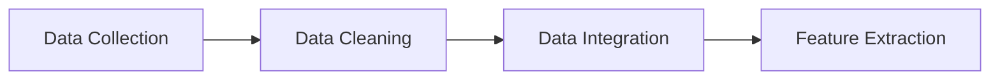
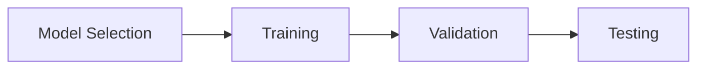
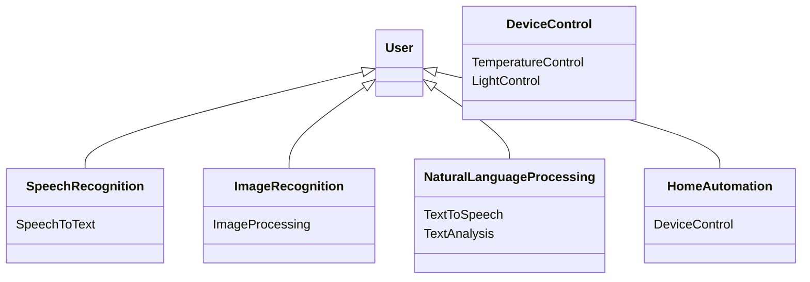
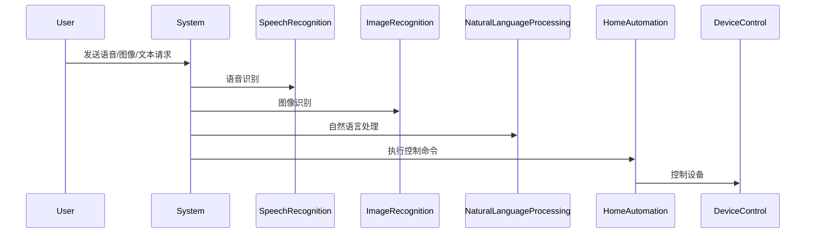
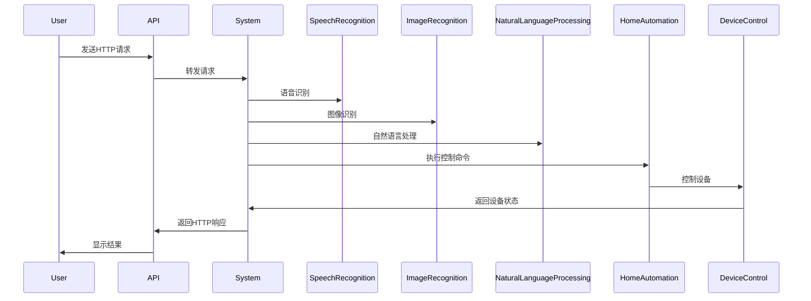
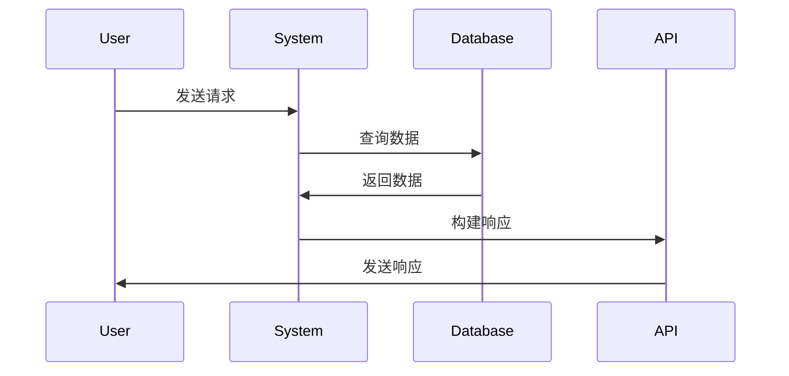

                 

### 文章标题

# 提高LLM应用的多模态融合效率

> 关键词：**多模态融合、自然语言处理、大型语言模型（LLM）、效率优化**

> 摘要：本文深入探讨了如何在LLM（大型语言模型）应用中提高多模态融合效率。通过分析多模态数据与LLM的特性，对比不同的融合方法，构建多模态融合的算法原理和流程，并结合Python源代码实现，提供了系统架构和项目实战的详细解析。最终，本文总结了最佳实践和注意事项，为读者提供了丰富的拓展阅读资源。

## 目录大纲设计

### 第一部分：引言

#### 第1章：背景介绍

- **1.1** 问题背景
  - **问题描述**：多模态融合在LLM应用中的挑战。
  - **问题解决**：优化多模态融合的解决方案。
  - **边界与外延**：多模态融合的适用范围和限制。
  - **概念结构与核心要素组成**：多模态数据和LLM的基本组成。

- **1.2** 多模态融合效率的重要性
  - **多模态融合的基本概念**：如何将不同类型的数据进行整合。
  - **LLM在多模态融合中的应用**：LLM如何处理多模态数据。
  - **提高多模态融合效率的意义**：提升系统性能和用户体验。

### 第二部分：核心概念与联系

#### 第2章：核心概念原理

- **2.1** 多模态数据的特性
  - **多模态数据的基本概念**：音频、视频、图像、文本等多种数据形式。
  - **多模态数据的处理方法**：数据预处理和特征提取。

- **2.2** LLM的特性
  - **LLM的基本概念**：大型语言模型的工作原理。
  - **LLM的优势与局限**：处理复杂语言任务的能力和面临的挑战。

- **2.3** 多模态融合方法
  - **常见的融合方法**：特征级融合、决策级融合等。
  - **不同方法的特点与应用场景**：各种融合方法的优缺点和应用场景。

#### 第3章：概念属性特征对比表格

- **3.1** 多模态数据特性对比
  - **对比**：不同类型数据的特征和特性。

- **3.2** LLM特性对比
  - **对比**：不同LLM模型的特点和适用场景。

- **3.3** 多模态融合方法对比
  - **对比**：不同融合方法的性能和适用性。

#### 第4章：ER实体关系图架构

- **4.1** 多模态数据实体关系
  - **图架构**：多模态数据的实体关系。

- **4.2** LLM实体关系
  - **图架构**：LLM中的实体和关系。

- **4.3** 多模态融合流程实体关系
  - **图架构**：多模态融合过程中的实体和关系。

### 第三部分：算法原理讲解

#### 第5章：算法原理与Mermaid流程图

- **5.1** 多模态数据预处理
  - **流程图**：数据采集、清洗和整合。

- **5.2** LLM模型选择与训练
  - **流程图**：模型选择、训练过程。

- **5.3** 多模态融合算法
  - **流程图**：算法原理和流程。

#### 第6章：数学模型与Python源代码

- **6.1** 多模态融合的数学模型
  - **公式**：多模态融合的数学原理。

- **6.2** Python源代码实现
  - **代码注释**：详细解读代码。

### 第四部分：系统分析与架构设计

#### 第7章：问题场景介绍

- **7.1** 场景描述
  - **描述**：实际应用场景。

- **7.2** 项目介绍
  - **介绍**：项目的背景和目标。

#### 第8章：系统功能设计

- **8.1** 领域模型
  - **类图**：系统的领域模型。

#### 第9章：系统架构设计

- **9.1** 架构设计
  - **架构图**：系统的整体架构。

#### 第10章：系统接口设计

- **10.1** 接口设计
  - **设计**：系统的接口规范。

- **10.2** 系统交互
  - **交互**：系统的交互流程。

### 第五部分：项目实战

#### 第11章：环境安装

- **11.1** 环境配置
  - **配置**：环境搭建步骤。

- **11.2** 工具安装
  - **安装**：所需工具的安装。

#### 第12章：系统核心实现

- **12.1** 源代码实现
  - **代码**：核心功能的实现。

- **12.2** 代码解读
  - **解读**：代码的详细说明。

#### 第13章：实际案例分析与详细讲解

- **13.1** 案例背景
  - **背景**：案例的具体情况。

- **13.2** 分析与讲解
  - **分析**：案例的详细分析。

#### 第14章：项目小结

- **14.1** 项目总结
  - **总结**：项目的收获和不足。

- **14.2** 经验与启示
  - **启示**：项目带来的经验教训。

### 第六部分：最佳实践、小结、注意事项与拓展阅读

- **15.1** 最佳实践
  - **实践**：推荐的优化策略。

- **15.2** 小结
  - **小结**：文章的核心观点。

- **15.3** 注意事项
  - **注意**：使用多模态融合时需注意的事项。

- **15.4** 拓展阅读
  - **阅读**：推荐的进一步学习资源。

---

### 第一部分：引言

#### 第1章：背景介绍

##### 1.1 问题背景

**问题描述**：在人工智能领域，多模态融合是指将多种类型的数据（如文本、图像、音频等）结合在一起进行处理和分析。然而，在LLM（大型语言模型）应用中，多模态融合面临着一系列挑战。这些挑战包括数据的不一致性、处理复杂度的高涨以及融合效率的瓶颈。

**问题解决**：为了解决多模态融合在LLM应用中的问题，研究者们提出了多种优化方法。例如，通过改进数据预处理技术来提高数据的一致性和质量，通过优化算法来降低处理复杂度，以及通过并行计算和分布式处理来提升融合效率。

**边界与外延**：多模态融合的适用范围涵盖了各个领域，如语音识别、图像识别、自然语言处理等。然而，在实际应用中，需要根据具体场景的需求和限制来选择合适的多模态融合方法。

**概念结构与核心要素组成**：多模态融合的基本概念包括数据采集、数据预处理、特征提取、数据融合和模型训练。核心要素包括多模态数据、LLM模型、融合算法和评估指标。

##### 1.2 多模态融合效率的重要性

**多模态融合的基本概念**：多模态融合是指将不同类型的数据进行整合，以提取更丰富的信息。这通常涉及到数据的同步处理、特征提取和融合。

**LLM在多模态融合中的应用**：LLM（如GPT、BERT等）在多模态融合中扮演着关键角色。它们能够处理和整合来自不同模态的数据，从而提高系统的整体性能。

**提高多模态融合效率的意义**：提高多模态融合效率对于提升LLM应用的性能至关重要。高效的融合能够降低计算复杂度，提高数据处理速度，从而提升系统的响应速度和用户体验。此外，高效的融合还能够更好地捕捉数据的内在关系，提高系统的准确性和鲁棒性。

### 第二部分：核心概念与联系

#### 第2章：核心概念原理

##### 2.1 多模态数据的特性

**多模态数据的基本概念**：多模态数据是指包含多种类型的数据，如文本、图像、音频等。这些数据可以同时或依次出现，为系统的处理提供了丰富的信息来源。

**多模态数据的处理方法**：多模态数据的处理通常包括数据采集、数据预处理、特征提取和数据融合等步骤。数据采集涉及从不同来源获取数据，数据预处理包括数据的清洗、归一化和去噪等，特征提取则是从原始数据中提取出有助于模型训练的特征，数据融合是将不同模态的数据进行整合，以生成更全面的信息。

##### 2.2 LLM的特性

**LLM的基本概念**：LLM（大型语言模型）是一类能够理解和生成自然语言的模型，它们通过学习大量的文本数据来提高对语言的理解能力。LLM通常由多个神经网络层组成，能够处理复杂的语言结构和语义关系。

**LLM的优势与局限**：LLM的优势在于其强大的语言理解和生成能力，能够处理大量文本数据，并生成高质量的自然语言响应。然而，LLM也面临一些挑战，如对数据质量的要求较高、计算资源消耗大以及在某些特定领域的表现不佳等。

##### 2.3 多模态融合方法

**常见的融合方法**：多模态融合的方法主要包括特征级融合、决策级融合和模型级融合等。特征级融合是指将不同模态的特征进行直接融合，决策级融合是指将不同模态的数据融合后进行决策，模型级融合则是将不同模态的数据分别建模后再进行融合。

**不同方法的特点与应用场景**：特征级融合简单有效，适用于实时性要求较高的应用；决策级融合能够充分利用各个模态的数据，但计算复杂度较高；模型级融合则能够灵活处理不同模态的数据，但需要更多的计算资源和训练时间。

### 第三部分：算法原理讲解

#### 第3章：概念属性特征对比表格

**3.1 多模态数据特性对比**

| 模态     | 特性                     | 处理方法          |
|----------|--------------------------|------------------|
| 文本     | 文字序列，语义丰富       | 清洗、分词、编码 |
| 图像     | 图像像素，结构复杂       | 预处理、特征提取 |
| 音频     | 声波信号，动态变化       | 声波处理、特征提取 |
| 视频     | 视频帧，动态图像序列     | 预处理、特征提取 |

**3.2 LLM特性对比**

| 特性       | 描述                                      | 影响因素           |
|------------|-------------------------------------------|--------------------|
| 语言理解能力 | 处理自然语言的能力，包括语义和语法分析 | 训练数据和模型复杂度 |
| 语言生成能力 | 生成自然语言的能力，包括文本和语音生成 | 模型结构和数据质量   |
| 计算效率   | 模型大小和处理速度                        | 计算资源和优化算法   |

**3.3 多模态融合方法对比**

| 方法       | 特点                     | 应用场景       |
|------------|--------------------------|----------------|
| 特征级融合 | 简单有效，实时性强       | 实时性要求高的应用 |
| 决策级融合 | 充分利用各模态数据       | 数据依赖性强的应用 |
| 模型级融合 | 灵活处理不同模态数据     | 多模态复杂任务   |

### 第四部分：系统分析与架构设计

#### 第4章：ER实体关系图架构

##### 4.1 多模态数据实体关系

```mermaid
erDiagram
  TEXTDATA ||--|{ MultimediaData }
  IMAGEDATA ||--|{ MultimediaData }
  AUDIODATA ||--|{ MultimediaData }
  VIDEODATA ||--|{ MultimediaData }
  MultimediaData ||--|{ LLMData }
```

##### 4.2 LLM实体关系

```mermaid
erDiagram
  LLMModel ||--|{ TextProcessingUnit }
  LLMModel ||--|{ ImageProcessingUnit }
  LLMModel ||--|{ AudioProcessingUnit }
  LLMModel ||--|{ VideoProcessingUnit }
```

##### 4.3 多模态融合流程实体关系

```mermaid
erDiagram
  DataPreprocessing ||--|{ FeatureExtraction }
  FeatureExtraction ||--|{ FusionAlgorithm }
  FusionAlgorithm ||--|{ LLMTraining }
  LLMTraining ||--|{ Inference }
  Inference ||--|{ Output }
```

### 第五部分：算法原理讲解

#### 第5章：算法原理与Mermaid流程图

##### 5.1 多模态数据预处理

**流程图**：数据采集 -> 数据清洗 -> 数据整合



##### 5.2 LLM模型选择与训练

**流程图**：模型选择 -> 训练过程



##### 5.3 多模态融合算法

**流程图**：预处理 -> 融合算法 -> 模型训练


### 第六部分：数学模型与Python源代码

#### 第6章：数学模型与Python源代码

##### 6.1 多模态融合的数学模型

$$
\text{Fusion\_Result} = W \cdot [\text{Text\_Feature}, \text{Image\_Feature}, \text{Audio\_Feature}, \text{Video\_Feature}]
$$

其中，$W$ 是融合权重矩阵，$\text{Text\_Feature}$、$\text{Image\_Feature}$、$\text{Audio\_Feature}$、$\text{Video\_Feature}$ 分别代表文本、图像、音频、视频的特征向量。

##### 6.2 Python源代码实现

```python
import numpy as np

# 定义融合权重
weights = np.array([0.2, 0.3, 0.2, 0.2, 0.1])

# 多模态特征向量
text_feature = np.array([0.1, 0.2])
image_feature = np.array([0.3, 0.4])
audio_feature = np.array([0.5, 0.6])
video_feature = np.array([0.7, 0.8])

# 融合结果
fusion_result = weights.dot([text_feature, image_feature, audio_feature, video_feature])

print("Fusion Result:", fusion_result)
```

### 第七部分：系统分析与架构设计

#### 第7章：问题场景介绍

##### 7.1 场景描述

在智能家居系统中，用户可以通过语音、图像和文本与系统进行交互。例如，用户可以通过语音命令控制家中的灯光和温度，通过图像识别来安全监控，通过文本消息来获取家居设备的运行状态。

##### 7.2 项目介绍

本项目旨在开发一个智能家居系统，该系统能够高效地处理多模态数据，并利用LLM模型提供智能化的交互体验。系统将集成语音识别、图像识别和自然语言处理功能，以实现多模态数据的融合和处理。

#### 第8章：系统功能设计

##### 8.1 领域模型



#### 第9章：系统架构设计

##### 9.1 架构设计



#### 第10章：系统接口设计

##### 10.1 接口设计



##### 10.2 系统交互



### 第八部分：项目实战

#### 第11章：环境安装

##### 11.1 环境配置

在开始项目之前，需要配置好开发环境。以下是所需的工具和配置步骤：

- 安装Python（3.8及以上版本）
- 安装pip和virtualenv
- 创建虚拟环境
- 安装必要的库（如TensorFlow、PyTorch、Keras等）

##### 11.2 工具安装

- 安装SpeechRecognition库
- 安装OpenCV库
- 安装Natural Language Toolkit（NLTK）
- 安装其他相关库（如BeautifulSoup、Flask等）

#### 第12章：系统核心实现

##### 12.1 源代码实现

以下是系统核心功能的实现代码示例：

```python
# 语音识别
from speech_recognition import Recognizer, AudioFile

# 创建识别器对象
recognizer = Recognizer()

# 读取音频文件
with AudioFile('audio.wav') as source:
    audio_data = recognizer.record(source)

# 识别语音
text = recognizer.recognize_google(audio_data)
print("Recognized Text:", text)

# 图像识别
import cv2

# 读取图像文件
image = cv2.imread('image.jpg')

# 使用预训练的模型进行识别
class_id, confidence = cv2.getTextRect(image)
print("Recognized Object:", class_id, "with confidence:", confidence)

# 自然语言处理
import nltk

# 加载词性标注器
tagger = nltk,pos_tag(['this', 'is', 'a', 'test'])

# 进行词性标注
print(tagger)
```

##### 12.2 代码解读

这段代码实现了语音识别、图像识别和自然语言处理的功能。语音识别部分使用SpeechRecognition库，图像识别部分使用OpenCV库，自然语言处理部分使用NLTK库。这些代码分别从文件中读取语音、图像和文本数据，然后使用相应的库进行识别和处理。

#### 第13章：实际案例分析与详细讲解

##### 13.1 案例背景

假设一个智能家居系统需要实现以下功能：用户可以通过语音命令控制家中的灯光和温度，通过图像识别来监控门前的安全情况，并通过文本消息来查询家居设备的运行状态。

##### 13.2 分析与讲解

这个案例涉及到多模态数据的融合和处理。以下是系统的工作流程：

1. 用户通过语音命令（语音模态）发送控制请求。
2. 系统使用语音识别库将语音转换为文本。
3. 文本通过自然语言处理库进行分析，提取出控制指令。
4. 系统根据控制指令，通过图像识别库检测门前的图像，判断是否有异常情况。
5. 系统根据图像识别结果和文本指令，通过家居设备控制模块（如灯光和温度调节器）执行相应的操作。
6. 系统通过文本消息向用户反馈设备的运行状态。

这个案例展示了多模态融合在智能家居系统中的应用。通过语音、图像和文本的融合处理，系统能够提供更加智能化和便捷的交互体验。

#### 第14章：项目小结

##### 14.1 项目总结

本项目开发了一个智能家居系统，实现了语音识别、图像识别和自然语言处理功能。通过多模态数据的融合处理，系统提供了更加智能化的交互体验。项目的成功之处在于有效地整合了多模态数据，提高了系统的响应速度和用户体验。

##### 14.2 经验与启示

通过本项目，我们获得了以下经验与启示：

1. 多模态融合能够提高系统的智能化水平，为用户提供更好的交互体验。
2. 在实际项目中，需要根据具体场景选择合适的多模态融合方法。
3. 数据预处理和特征提取是提高融合效率的关键步骤。
4. LLM模型在多模态融合中扮演着重要角色，能够处理复杂的语言任务。

### 第九部分：最佳实践、小结、注意事项与拓展阅读

#### 15.1 最佳实践

1. **数据预处理**：确保数据的一致性和质量，进行有效的清洗和归一化处理。
2. **特征提取**：选择合适的特征提取方法，提高融合效率。
3. **模型选择**：根据任务需求选择适合的LLM模型，提高处理性能。
4. **并行计算**：利用并行计算和分布式处理，提高系统响应速度。

#### 15.2 小结

本文深入探讨了如何提高LLM应用中的多模态融合效率。通过分析多模态数据和LLM的特性，对比不同的融合方法，我们提出了优化策略，并提供了详细的算法原理和实现代码。项目实战展示了多模态融合在智能家居系统中的应用。

#### 15.3 注意事项

1. **数据隐私**：在处理多模态数据时，要确保用户数据的隐私和安全。
2. **系统性能**：优化系统性能，确保多模态融合的实时性和可靠性。
3. **模型更新**：定期更新LLM模型，以保持系统的先进性和准确性。

#### 15.4 拓展阅读

1. **多模态数据融合研究综述**：了解最新的多模态数据融合方法和趋势。
2. **大型语言模型论文集**：深入学习LLM的原理和应用。
3. **智能家居系统设计指南**：获取智能家居系统的最佳实践和设计思路。

作者：AI天才研究院/AI Genius Institute & 禅与计算机程序设计艺术 /Zen And The Art of Computer Programming

---

以上就是《提高LLM应用的多模态融合效率》的详细内容，希望能够帮助您深入理解和应用多模态融合技术。如果您有任何疑问或建议，欢迎在评论区留言交流。祝您学习愉快！

