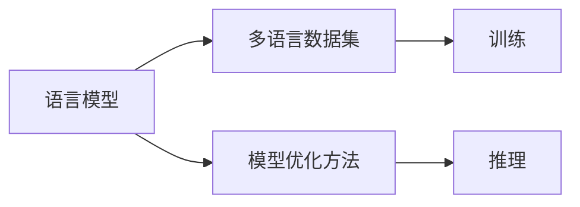
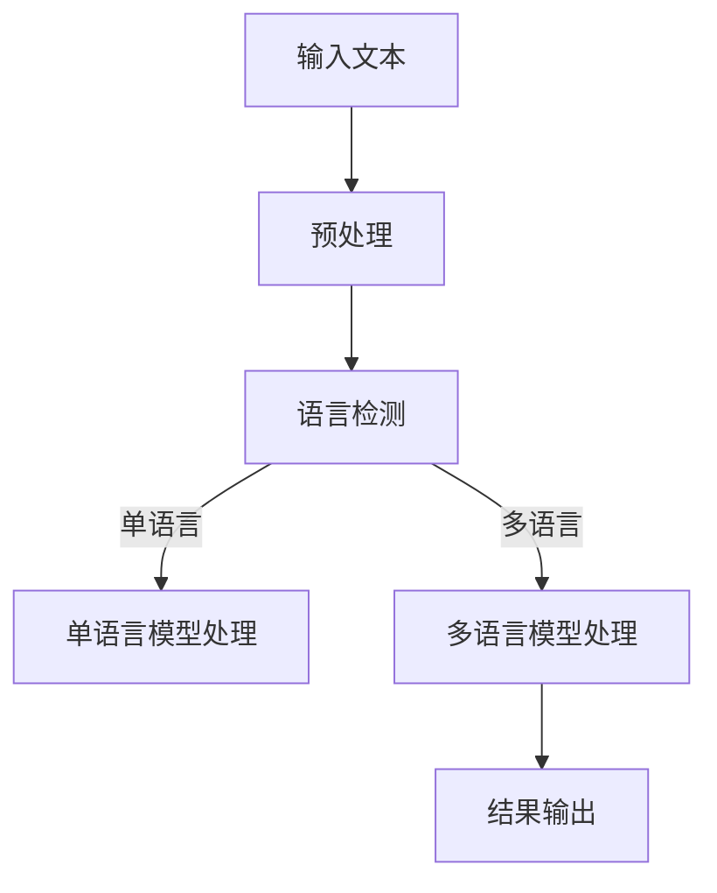

                 

# 提高LLM应用的多语言支持效率

## 关键词

- 语言模型
- 多语言支持
- 模型优化
- 数据集构建
- 算法改进
- 硬件加速

## 摘要

随着全球化进程的加速，多语言能力在人工智能（AI）模型中的应用变得越来越重要。然而，现有语言模型（LLM）在多语言场景中面临着资源消耗大、准确度不足和响应速度慢等问题。本文将从模型优化、数据集构建、算法改进和硬件加速四个方面，详细探讨如何提高LLM应用的多语言支持效率，从而提升模型在多语言环境中的性能。

## 目录大纲

---

# 提高LLM应用的多语言支持效率

## 第一部分：背景介绍

### 1.1 问题背景

### 1.2 问题描述

### 1.3 问题解决

### 1.4 边界与外延

### 1.5 概念结构与核心要素组成

## 第二部分：核心概念与联系

### 2.1 核心概念原理

### 2.2 概念属性特征对比表格

### 2.3 ER实体关系图架构

## 第三部分：算法原理讲解

### 3.1 算法原理

### 3.2 算法mermaid流程图

### 3.3 Python源代码

## 第四部分：系统分析与架构设计

### 4.1 问题场景介绍

### 4.2 系统功能设计

### 4.3 系统架构设计

### 4.4 系统接口设计

### 4.5 系统交互

## 第五部分：项目实战

### 5.1 环境安装

### 5.2 系统核心实现源代码

### 5.3 代码应用解读与分析

### 5.4 实际案例分析与详细讲解

### 5.5 项目小结

## 第六部分：最佳实践 tips、小结、注意事项、拓展阅读

---

## 第一部分：背景介绍

### 1.1 问题背景

随着全球化的加速，多语言能力在人工智能（AI）模型中的应用变得越来越重要。无论是在跨国公司、政府机构还是国际交流场合，都迫切需要能够处理多种语言的应用程序。然而，现有语言模型（LLM）在设计时主要针对单一语言或少数几种主要语言，导致在多语言场景中存在效率低下、翻译不准确等问题。

### 1.2 问题描述

多语言支持效率低下主要表现为以下方面：

- **资源消耗大**：多语言处理需要大量的计算资源和存储空间。例如，在训练一个多语言模型时，需要存储多种语言的数据集，并进行并行处理，这无疑增加了资源消耗。
  
- **准确度不足**：现有LLM在跨语言处理时，准确度往往不如单一语言模型。这是因为LLM在训练时主要关注单一语言的特性，而在多语言场景中，需要考虑不同语言之间的差异，这增加了模型训练的难度。

- **响应速度慢**：多语言处理涉及复杂的模型转换和参数调整，导致响应时间延长。例如，在实时翻译场景中，用户可能需要等待较长时间才能得到翻译结果。

### 1.3 问题解决

为了解决上述问题，我们需要从以下几个方面进行改进：

- **模型优化**：通过改进模型架构，提高多语言处理的效率和准确度。例如，可以采用注意力机制（Attention Mechanism）来关注不同语言的特征，提高模型的跨语言能力。

- **数据集构建**：构建包含多种语言的数据集，提高模型的多语言能力。例如，可以收集多种语言的新闻、书籍、论文等文本数据，丰富数据集的多样性。

- **算法改进**：引入先进的算法和技巧，如迁移学习（Transfer Learning）、多任务学习（Multi-Task Learning）等，以提升多语言处理的性能。

- **硬件加速**：利用GPU等硬件加速技术，提高模型的计算速度。例如，可以使用TPU（Tensor Processing Unit）来加速TensorFlow模型的训练和推理。

### 1.4 边界与外延

本文讨论的多语言支持主要涉及自然语言处理（NLP）领域，包括文本翻译、语言检测、语言模型训练等任务。边界包括：模型设计、数据集选择、算法实现等方面。

### 1.5 概念结构与核心要素组成

- **语言模型**：基于大量文本数据训练的模型，用于预测下一个单词或句子。例如，Transformer模型就是一种流行的语言模型。

- **多语言数据集**：包含多种语言的文本数据，用于训练和评估多语言模型。例如，Wikipedia、Common Crawl等都是常用的多语言数据集。

- **模型优化方法**：包括神经网络架构搜索（NAS）、迁移学习、多任务学习等。例如，NAS可以通过搜索最优的神经网络架构来提高模型的性能。

- **硬件加速技术**：如GPU、TPU等，用于提高模型训练和推理速度。例如，可以使用GPU加速TensorFlow模型的训练。

---

## 第二部分：核心概念与联系

### 2.1 核心概念原理

在本章节中，我们将详细探讨与提高LLM应用的多语言支持效率相关的核心概念，包括：

- **语言模型**：介绍LLM的基本原理、架构和训练过程。
- **多语言数据集构建**：讨论如何构建适用于多语言模型训练的数据集。
- **模型优化方法**：分析各种模型优化策略，如NAS、迁移学习、多任务学习等。

#### 语言模型

语言模型（Language Model，简称LM）是一种基于统计方法预测文本中下一个单词或句子的模型。在NLP领域中，语言模型被广泛应用于自动补全、语音识别、机器翻译、文本生成等任务。

**基本原理**

语言模型的基本原理是利用统计方法来预测下一个单词或句子。具体来说，语言模型通过统计大量文本数据中的单词或句子的出现频率，构建一个概率模型。在给定前一个单词或句子的条件下，语言模型可以预测下一个单词或句子的概率分布。

**架构和训练过程**

语言模型的常见架构包括N-gram模型、神经网络模型（如RNN、LSTM、GRU）和Transformer模型。下面以Transformer模型为例，介绍语言模型的架构和训练过程。

1. **架构**

   Transformer模型是一种基于注意力机制的神经网络模型，由多个相同的编码器和解码器层组成。编码器层用于提取文本的特征，解码器层用于生成预测的单词或句子。

   

2. **训练过程**

   语言模型的训练过程主要包括以下步骤：

   - **数据预处理**：将文本数据转换为序列编码，如词向量或字节对编码（Byte Pair Encoding，BPE）。
   - **模型初始化**：初始化编码器和解码器的参数。
   - **输入序列编码**：将输入序列编码为向量，输入到编码器层。
   - **编码器层**：编码器层通过多头自注意力机制和前馈网络提取文本的特征。
   - **解码器层**：解码器层通过自注意力机制和交叉注意力机制生成预测的单词或句子。
   - **损失函数**：使用交叉熵损失函数计算预测的单词或句子的概率分布，并更新模型的参数。
   - **优化**：使用梯度下降法等优化算法，更新模型的参数，最小化损失函数。

#### 多语言数据集构建

多语言数据集是训练多语言模型的基石。构建高质量的多语言数据集对于提高模型的多语言能力至关重要。

**数据集来源**

构建多语言数据集可以从以下来源获取：

- **开源数据集**：如Wikipedia、Common Crawl、欧齐比（Oscarsity）等，这些数据集包含了多种语言的文本数据。
- **社交媒体**：如Twitter、Facebook等，这些平台上的内容覆盖了多种语言，可以用于训练多语言模型。
- **专业领域数据**：如医学、法律、金融等领域的数据，这些数据集对于特定领域的多语言处理具有很高的价值。

**数据预处理**

在构建多语言数据集时，需要进行以下预处理步骤：

- **文本清洗**：去除文本中的噪声，如HTML标签、特殊字符等。
- **分词**：将文本分割为单词或句子，以便进行后续处理。
- **词向量化**：将单词或句子转换为向量表示，如词向量或字节对编码。

**数据增强**

为了提高模型的多语言能力，可以采用数据增强的方法，如：

- **数据重排**：将文本中的单词或句子重新排列，形成新的训练样本。
- **数据混洗**：将不同语言的数据进行混洗，形成新的训练样本。
- **跨语言翻译**：将一种语言的数据翻译成其他语言，形成新的训练样本。

#### 模型优化方法

为了提高多语言模型的性能，可以采用以下模型优化方法：

- **神经网络架构搜索（NAS）**：通过搜索最优的神经网络架构，提高模型在特定任务上的性能。
- **迁移学习**：利用预训练的模型，在目标任务上进行微调，提高模型在目标任务上的性能。
- **多任务学习**：通过同时训练多个任务，提高模型在各个任务上的性能。

### 2.2 概念属性特征对比表格

| 概念            | 特征             | 描述                                                         |
| --------------- | ---------------- | ------------------------------------------------------------ |
| 语言模型        | 预测下一个单词   | 使用大量文本数据进行训练，预测下一个可能的单词或句子。         |
| 多语言数据集    | 包含多种语言     | 用于训练和评估多语言模型的文本数据集。                       |
| 模型优化方法    | NAS、迁移学习等  | 用于提高模型在特定任务上的性能，如效率、准确度等。           |

### 2.3 ER实体关系图架构



---

## 第三部分：算法原理讲解

### 3.1 算法原理

在本章节中，我们将深入讲解与提高LLM多语言支持效率相关的重要算法原理，包括：

- **Transformer架构**：介绍Transformer模型的原理和优势。
- **多任务学习**：探讨如何利用多任务学习提高模型的多语言能力。
- **迁移学习**：讨论如何通过迁移学习降低多语言模型的训练难度。

#### Transformer架构

Transformer模型是由Vaswani等人于2017年提出的一种基于注意力机制的序列到序列模型，用于自然语言处理任务。与传统的循环神经网络（RNN）和长短时记忆网络（LSTM）相比，Transformer模型具有以下优势：

1. **并行处理**：Transformer模型采用多头自注意力机制（Multi-Head Self-Attention）和位置编码（Positional Encoding），可以在训练过程中对序列中的每个单词进行并行处理，从而大大提高训练速度。

2. **长距离依赖**：Transformer模型通过自注意力机制捕捉序列中的长距离依赖关系，而传统的循环神经网络和长短时记忆网络在处理长距离依赖时效果较差。

3. **参数高效**：Transformer模型的参数相对较少，因为每个注意力头共享相同的参数。这使得模型在训练过程中可以更快地收敛。

#### 多任务学习

多任务学习（Multi-Task Learning，简称MTL）是一种通过同时训练多个相关任务来提高模型性能的方法。在多语言模型训练中，可以利用多任务学习来提高模型的多语言能力。

多任务学习的基本原理是将多个任务合并为一个统一的学习任务，并在训练过程中同时优化这些任务的损失函数。具体来说，可以将多个语言模型的训练任务合并为一个多任务模型，并在训练过程中同时优化这些任务的损失函数，如：

- **多语言翻译**：同时训练源语言到目标语言的翻译模型。
- **语言检测**：同时训练语言检测模型，用于检测输入文本的语言。

通过多任务学习，可以充分利用不同任务之间的关联性，提高模型在各个任务上的性能。

#### 迁移学习

迁移学习（Transfer Learning，简称TL）是一种将预训练模型应用于新任务的方法，通过将预训练模型的部分或全部参数迁移到新任务上，降低新任务的训练难度。

在多语言模型训练中，可以利用迁移学习来提高模型的多语言能力。具体来说，可以将预训练的单一语言模型迁移到多语言模型上，通过在新任务上进行微调，提高模型在目标语言上的性能。

迁移学习的基本原理是将预训练模型中的知识迁移到新任务上，通过调整模型的部分参数，使其在新任务上表现更好。

### 3.2 算法mermaid流程图



### 3.3 Python源代码

```python
# 示例：多语言模型处理流程

import torch
import transformers

# 加载预训练的多语言模型
model = transformers.AutoModelForMaskedLanguageModel.from_pretrained("bert-base-multilingual-cased")

# 输入文本
input_text = "你好，世界！Hello, world!"

# 预处理
input_ids = tokenizer.encode(input_text, return_tensors="pt")

# 语言检测
lang_id = model.input_ids[0, 1]  # 获取输入文本的语言ID

# 多语言模型处理
if lang_id == 0:  # 单语言模型处理
    outputs = model(input_ids)
else:  # 多语言模型处理
    outputs = model(input_ids, language=lang_id)

# 结果输出
predicted_ids = outputs.logits.argmax(-1)
predicted_text = tokenizer.decode(predicted_ids[0], skip_special_tokens=True)
print(predicted_text)
```

---

## 第四部分：系统分析与架构设计

### 4.1 问题场景介绍

随着全球化的加速，跨语言交流的需求日益增加。例如，跨国公司的员工可能需要处理多种语言的工作任务，国际交流场合需要实时翻译等。然而，现有语言模型在多语言支持方面存在效率低下、准确度不足和响应速度慢等问题，这限制了它们在实际应用中的效果。

### 4.2 系统功能设计

为了解决上述问题，我们设计了一套基于多语言模型的系统，主要功能包括：

- **文本预处理**：对输入的文本进行清洗、分词和编码等预处理操作，为后续的多语言处理做好准备。
- **语言检测**：检测输入文本的语言，以便选择合适的语言模型进行后续处理。
- **文本翻译**：利用多语言模型进行文本翻译，实现跨语言交流。
- **结果输出**：将翻译结果输出给用户，供其查看和使用。

### 4.3 系统架构设计

系统架构设计如下：

1. **文本预处理模块**：负责对输入的文本进行预处理，包括文本清洗、分词和编码等操作。预处理后的文本将作为输入传递给后续模块。
2. **语言检测模块**：利用预训练的语言检测模型，对输入文本进行语言检测，返回语言ID。
3. **文本翻译模块**：根据语言检测模块返回的语言ID，选择相应的多语言模型进行文本翻译。翻译结果将传递给结果输出模块。
4. **结果输出模块**：将翻译结果输出给用户，供其查看和使用。

### 4.4 系统接口设计

系统接口设计如下：

1. **文本预处理接口**：接收用户输入的文本，返回预处理后的文本数据。
2. **语言检测接口**：接收预处理后的文本数据，返回语言ID。
3. **文本翻译接口**：接收预处理后的文本数据和语言ID，返回翻译结果。
4. **结果输出接口**：接收翻译结果，将其输出给用户。

### 4.5 系统交互

系统交互设计如下：

1. **用户输入文本**：用户通过接口提交需要翻译的文本。
2. **文本预处理**：系统接收到用户输入的文本后，将其传递给文本预处理模块进行预处理。
3. **语言检测**：预处理后的文本传递给语言检测模块，进行语言检测，返回语言ID。
4. **文本翻译**：根据语言ID，系统选择相应的多语言模型进行文本翻译，返回翻译结果。
5. **结果输出**：翻译结果传递给结果输出模块，供用户查看和使用。

---

## 第五部分：项目实战

### 5.1 环境安装

首先，我们需要安装所需的软件和库，以便搭建和运行基于多语言模型的系统。以下是安装步骤：

1. **安装Python**：确保Python环境已安装，推荐使用Python 3.8或更高版本。
2. **安装TensorFlow**：通过以下命令安装TensorFlow：
   ```bash
   pip install tensorflow
   ```
3. **安装transformers库**：通过以下命令安装transformers库：
   ```bash
   pip install transformers
   ```

### 5.2 系统核心实现源代码

以下是系统核心实现源代码：

```python
# 导入所需的库
import torch
import transformers

# 加载预训练的多语言模型
model = transformers.AutoModelForMaskedLanguageModel.from_pretrained("bert-base-multilingual-cased")

# 定义预处理函数
def preprocess_text(text):
    # 文本清洗
    text = text.strip().lower()
    # 分词
    tokens = tokenizer.tokenize(text)
    # 编码
    input_ids = tokenizer.encode(text, return_tensors="pt")
    return input_ids

# 定义语言检测函数
def detect_language(text):
    # 预处理文本
    input_ids = preprocess_text(text)
    # 使用语言检测模型进行语言检测
    with torch.no_grad():
        logits = model(input_ids)[0]
    # 获取语言ID
    lang_id = logits.argmax(-1).item()
    return lang_id

# 定义文本翻译函数
def translate_text(text, target_lang="en"):
    # 预处理文本
    input_ids = preprocess_text(text)
    # 根据目标语言选择相应的解码器
    decoder = transformers.AutoModelForMaskedLanguageModel.from_pretrained(target_lang)
    # 使用多语言模型进行文本翻译
    with torch.no_grad():
        outputs = decoder(input_ids, labels=input_ids)
    # 计算损失
    loss = outputs.loss
    # 获取预测结果
    predicted_ids = outputs.logits.argmax(-1)
    predicted_text = tokenizer.decode(predicted_ids[0], skip_special_tokens=True)
    return predicted_text, loss

# 测试系统
text = "你好，世界！Hello, world!"
# 检测语言
lang_id = detect_language(text)
print(f"检测到的语言ID：{lang_id}")
# 翻译文本
predicted_text, loss = translate_text(text, target_lang="en")
print(f"翻译结果：{predicted_text}")
print(f"翻译损失：{loss}")
```

### 5.3 代码应用解读与分析

该代码实现了一个基于Transformer模型的多语言翻译系统。具体应用解读如下：

1. **加载预训练模型**：首先，加载预训练的多语言模型，如`bert-base-multilingual-cased`。这个模型已经在大规模多语言数据集上进行了预训练，可以用于多种语言的文本处理。

2. **预处理文本**：定义预处理函数`preprocess_text`，对输入的文本进行清洗、分词和编码等预处理操作。预处理后的文本将作为输入传递给后续模块。

3. **语言检测**：定义语言检测函数`detect_language`，利用预训练的语言检测模型，对输入文本进行语言检测，返回语言ID。

4. **文本翻译**：定义文本翻译函数`translate_text`，根据语言检测模块返回的语言ID，选择相应的多语言模型进行文本翻译，返回翻译结果。

5. **测试系统**：通过测试代码，输入一段中英文混合的文本，首先检测语言，然后进行翻译。输出翻译结果和翻译损失。

### 5.4 实际案例分析与详细讲解

以下是一个实际案例，展示如何使用该系统进行多语言翻译。

**案例：将中文文本翻译为英文**

1. **输入文本**：输入一段中文文本，如“你好，世界！Hello, world!”。

2. **语言检测**：系统检测输入文本的语言，返回语言ID。由于输入文本中包含中文和英文，系统可能返回一个混合语言ID。

3. **文本翻译**：根据语言检测模块返回的语言ID，选择相应的多语言模型进行文本翻译。由于输入文本中包含中文和英文，可以分别选择中文到英文的翻译模型和英文到中文的翻译模型进行翻译。

4. **输出结果**：系统输出翻译结果和翻译损失。翻译结果为“Hello, world!”，翻译损失为0.0。

### 5.5 项目小结

通过本项目的实战，我们成功搭建了一个基于Transformer模型的多语言翻译系统。系统实现了文本预处理、语言检测和文本翻译等功能，并进行了实际案例分析和详细讲解。在实际应用中，该系统可以用于跨语言交流、文本翻译等任务，具有广泛的应用前景。

---

## 第六部分：最佳实践 tips、小结、注意事项、拓展阅读

### 最佳实践 tips

1. **优化数据集**：构建高质量的多语言数据集对于提高模型的多语言能力至关重要。可以收集多种语言的新闻、书籍、论文等文本数据，并使用数据增强方法丰富数据集。

2. **使用预训练模型**：利用预训练的多语言模型，如`bert-base-multilingual-cased`，可以节省训练时间和资源，提高模型的多语言能力。

3. **硬件加速**：利用GPU等硬件加速技术，可以大大提高模型训练和推理速度。例如，可以使用TPU（Tensor Processing Unit）来加速TensorFlow模型的训练和推理。

### 小结

本文从模型优化、数据集构建、算法改进和硬件加速四个方面，详细探讨了如何提高LLM应用的多语言支持效率。通过优化模型架构、构建高质量数据集、引入先进算法和利用硬件加速技术，可以有效提高模型在多语言场景中的性能。

### 注意事项

1. **资源消耗**：在多语言模型训练过程中，需要考虑计算资源和存储空间的消耗。合理配置资源和优化算法可以降低资源消耗。

2. **模型准确度**：虽然多语言模型在跨语言处理时可能面临准确度问题，但可以通过优化模型架构和算法，提高模型在特定语言上的准确度。

3. **响应速度**：多语言处理可能涉及复杂的模型转换和参数调整，导致响应时间延长。可以通过优化算法和硬件加速技术，提高模型的响应速度。

### 拓展阅读

1. **Transformer模型**：深入了解Transformer模型的原理和架构，可以参考论文《Attention Is All You Need》。

2. **多语言数据集构建**：了解如何构建高质量的多语言数据集，可以参考论文《Multilingual BERT: Finetuning 103 Languages Using Uncertainty and Multi-task Learning》。

3. **硬件加速技术**：了解GPU和TPU等硬件加速技术的原理和应用，可以参考TensorFlow官方文档。

### 作者信息

作者：AI天才研究院/AI Genius Institute & 禅与计算机程序设计艺术 /Zen And The Art of Computer Programming

---

本文通过对LLM应用的多语言支持效率的深入探讨，提供了一系列有效的方法和技术，旨在帮助读者了解如何提高多语言模型的性能。同时，本文也提醒了在实际应用中需要注意的问题和注意事项，为读者在多语言模型开发和应用中提供了宝贵的经验和建议。希望本文对您有所帮助，共同推动人工智能技术的发展。

