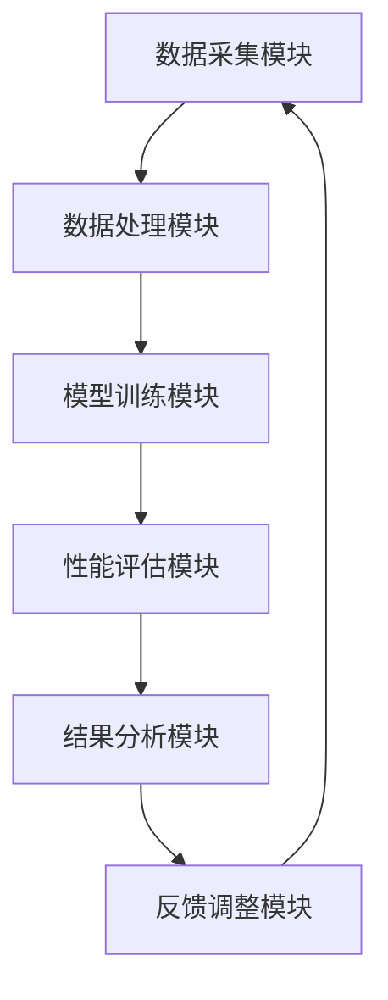
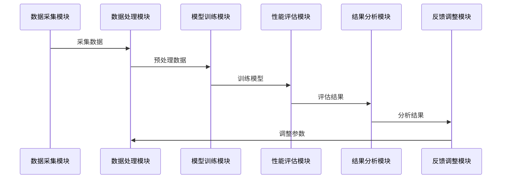

                 

### 提高LLM应用的自动评估效率

#### 关键词

- 语言模型（LLM）
- 自动评估
- 效率提升
- 算法优化
- 系统设计

#### 摘要

本文旨在探讨如何提高语言模型（LLM）应用的自动评估效率。我们将通过详细的步骤分析和实践，涵盖从背景介绍到最佳实践的全过程，旨在帮助开发者更好地理解和应用这一技术，从而提升LLM在各类应用场景中的性能和效果。

## 引言

随着人工智能技术的快速发展，语言模型（LLM）已经成为了自然语言处理（NLP）领域的重要工具。LLM在文本生成、机器翻译、问答系统等众多应用中表现出了极高的效能。然而，LLM的自动评估过程却常常成为制约其性能进一步提升的瓶颈。自动评估效率低下不仅会延长开发周期，还会影响模型在实际应用中的效果和用户体验。因此，提高LLM应用的自动评估效率成为了当前研究的热点。

本文将围绕如何提高LLM应用的自动评估效率这一核心问题，进行系统的分析和探讨。我们将首先介绍语言模型自动评估的基本概念和流程，然后深入探讨核心概念、算法原理、数学模型，以及系统设计和项目实战等关键环节，最后总结最佳实践并展望未来发展方向。

## 问题背景与核心概念

### 语言模型自动评估的问题与挑战

在深度学习模型，尤其是大型语言模型（LLM）如GPT-3、BERT等日益普及的背景下，如何高效地评估模型性能成为一个重要问题。自动评估相较于手动评估，具有快速、批量处理的能力，但同时也面临一系列挑战：

1. **计算资源消耗**：评估大型LLM模型通常需要大量的计算资源，特别是当涉及到大规模数据集和复杂的评估指标时。
2. **时间成本**：自动评估的过程通常需要较长时间，特别是在模型训练和验证阶段。
3. **评估指标的选择与优化**：不同的评估指标可能对模型性能有不同的影响，如何选择合适的评估指标，并对其进行优化，是提高评估效率的关键。

### 语言模型自动评估的重要性

自动评估在LLM应用中具有至关重要的作用：

1. **快速迭代**：通过自动评估，开发者可以快速获得模型性能的反馈，从而实现模型的快速迭代和优化。
2. **大规模数据处理**：自动评估能够处理大规模的数据集，使得模型在不同场景下的性能表现更加全面和准确。
3. **提高用户体验**：高效的自动评估能够确保模型在实际应用中的性能，从而提高用户的整体体验。

### 语言模型自动评估的基本流程

语言模型自动评估通常包括以下几个基本步骤：

1. **数据准备**：收集和准备用于评估的数据集，包括训练集、验证集和测试集。
2. **模型评估**：使用预训练的LLM模型对数据集进行评估，常用的评估指标包括准确率（Accuracy）、召回率（Recall）和F1分数（F1 Score）等。
3. **结果分析**：对评估结果进行分析，识别模型的优势和不足，为后续优化提供依据。
4. **反馈迭代**：根据评估结果调整模型参数，进行新一轮的模型训练和评估。

### 语言模型自动评估的基本流程

语言模型自动评估的流程可以简化为以下步骤：

1. **数据准备**：
   - 数据清洗：去除无关数据和噪声。
   - 数据标注：对数据进行适当的标注，以便后续评估。
   - 数据分割：将数据集划分为训练集、验证集和测试集。

2. **模型评估**：
   - 加载预训练模型：从模型存储中加载预训练的LLM模型。
   - 预测生成：使用模型对验证集和测试集进行预测。
   - 结果计算：计算各种评估指标，如准确率、召回率和F1分数。

3. **结果分析**：
   - 结果可视化：使用图表和统计数据展示模型性能。
   - 结果解读：分析模型的性能表现，识别问题和优化方向。

4. **反馈迭代**：
   - 参数调整：根据评估结果调整模型参数。
   - 模型再训练：使用调整后的参数重新训练模型。
   - 重新评估：对新训练的模型进行评估，验证优化效果。

## 核心概念与联系

### 语言模型自动评估的指标

在自动评估过程中，常用的评估指标包括准确率（Accuracy）、召回率（Recall）和F1分数（F1 Score）。这些指标分别从不同的角度衡量模型性能。

1. **准确率（Accuracy）**：
   - 定义：准确率表示模型预测正确的样本数占总样本数的比例。
   - 公式：$$Accuracy = \frac{TP + TN}{TP + FN + FP + TN}$$
   - 特点：准确率简单直观，但可能被极端不平衡的数据集所影响。

2. **召回率（Recall）**：
   - 定义：召回率表示模型能够正确识别为正类的样本数占总正类样本数的比例。
   - 公式：$$Recall = \frac{TP}{TP + FN}$$
   - 特点：召回率强调模型对正类样本的识别能力，但对负类样本的误识别敏感。

3. **F1分数（F1 Score）**：
   - 定义：F1分数是准确率和召回率的调和平均，同时兼顾了两者的优缺点。
   - 公式：$$F1 Score = 2 \times \frac{Precision \times Recall}{Precision + Recall}$$
   - 特点：F1分数能够更好地平衡准确率和召回率，是综合评估模型性能的重要指标。

### 语言模型自动评估的算法原理

自动评估的算法原理通常基于机器学习中的分类和回归任务。以下是一个简单的算法流程：

1. **模型训练**：
   - 使用训练数据集对模型进行训练，使其能够预测未知数据。
   - 常用的算法包括神经网络、支持向量机（SVM）、随机森林等。

2. **模型评估**：
   - 使用验证集对训练好的模型进行评估，调整模型参数以优化性能。
   - 通过计算各种评估指标，如准确率、召回率和F1分数，评估模型性能。

3. **模型预测**：
   - 使用测试数据集对模型进行预测，获取模型的实际性能。
   - 对预测结果进行分析和解读，为模型优化提供依据。

### 数学模型和公式

在自动评估过程中，常用的数学模型和公式包括：

1. **熵（Entropy）**：
   - 定义：熵是衡量信息不确定性的指标。
   - 公式：$$ H = -\sum_{i} p(x_i) \log p(x_i) $$

2. **条件概率（Conditional Probability）**：
   - 定义：条件概率表示在已知一个事件发生的条件下，另一个事件发生的概率。
   - 公式：$$ P(R|A) = \frac{P(A|R)P(R)}{P(A)} $$

3. **贝叶斯公式（Bayes' Theorem）**：
   - 定义：贝叶斯公式是一种基于条件概率进行推断的方法。
   - 公式：$$ P(A|B) = \frac{P(B|A)P(A)}{P(B)} $$

这些数学模型和公式在自动评估中起到了关键作用，帮助开发者理解和优化模型性能。

### 算法原理详细讲解

#### 算法原理

在语言模型自动评估中，算法原理通常基于机器学习中的分类任务。以下是一个简单的算法流程：

1. **模型训练**：
   - 使用训练数据集对模型进行训练，使其能够预测未知数据。
   - 常用的算法包括神经网络、支持向量机（SVM）、随机森林等。

2. **模型评估**：
   - 使用验证集对训练好的模型进行评估，调整模型参数以优化性能。
   - 通过计算各种评估指标，如准确率、召回率和F1分数，评估模型性能。

3. **模型预测**：
   - 使用测试数据集对模型进行预测，获取模型的实际性能。
   - 对预测结果进行分析和解读，为模型优化提供依据。

#### Python源代码实现

以下是一个简单的Python源代码实现，用于演示模型训练、评估和预测的基本流程：

```python
import numpy as np
from sklearn.model_selection import train_test_split
from sklearn.metrics import accuracy_score, recall_score, f1_score

# 加载数据集
X, y = load_data()

# 数据集分割
X_train, X_test, y_train, y_test = train_test_split(X, y, test_size=0.2, random_state=42)

# 模型训练
model = train_model(X_train, y_train)

# 模型评估
y_pred = model.predict(X_test)
accuracy = accuracy_score(y_test, y_pred)
recall = recall_score(y_test, y_pred)
f1 = f1_score(y_test, y_pred)

# 输出评估结果
print(f"Accuracy: {accuracy:.4f}")
print(f"Recall: {recall:.4f}")
print(f"F1 Score: {f1:.4f}")

# 模型预测
y_pred = model.predict(X_new)
```

#### 算法原理的数学模型和公式

在自动评估中，常用的数学模型和公式包括：

1. **熵（Entropy）**：
   - 定义：熵是衡量信息不确定性的指标。
   - 公式：$$ H = -\sum_{i} p(x_i) \log p(x_i) $$

2. **条件概率（Conditional Probability）**：
   - 定义：条件概率表示在已知一个事件发生的条件下，另一个事件发生的概率。
   - 公式：$$ P(R|A) = \frac{P(A|R)P(R)}{P(A)} $$

3. **贝叶斯公式（Bayes' Theorem）**：
   - 定义：贝叶斯公式是一种基于条件概率进行推断的方法。
   - 公式：$$ P(A|B) = \frac{P(B|A)P(A)}{P(B)} $$

这些数学模型和公式在自动评估中起到了关键作用，帮助开发者理解和优化模型性能。

### 算法优化与性能提升

#### 优化方法

为了提高LLM应用的自动评估效率，我们可以从以下几个方面进行优化：

1. **特征工程**：
   - 选取关键特征：通过特征选择算法，筛选出对模型性能有显著影响的特征。
   - 特征转换：对原始特征进行适当的转换，如归一化、标准化等，以提高模型的泛化能力。

2. **模型调优**：
   - 超参数调整：通过调整模型超参数，如学习率、正则化强度等，优化模型性能。
   - 模型融合：使用多种模型进行融合，提高评估结果的稳定性和准确性。

#### 性能提升策略

以下是几种常见的性能提升策略：

1. **并行计算**：
   - 分布式计算：利用分布式计算框架，如Hadoop、Spark等，对大规模数据集进行并行处理，提高评估效率。
   - GPU加速：利用GPU进行模型训练和评估，提高计算速度。

2. **模型压缩**：
   - 参数剪枝：通过剪枝模型参数，减少模型体积，提高评估速度。
   - 模型蒸馏：使用小模型对大模型进行蒸馏，提取核心知识，同时保持评估性能。

3. **数据增强**：
   - 数据扩展：通过生成或扩展训练数据，增加模型的鲁棒性。
   - 数据预处理：对数据进行预处理，如去噪、归一化等，提高数据质量。

### 系统分析与架构设计

#### 问题场景介绍

在自动化测试中，系统性能评估是一个关键环节。以一个在线电商平台为例，我们需要对网站的响应速度、稳定性、安全性等多个方面进行评估，以确保其能够稳定运行，并为用户提供良好的体验。这个场景涉及到了大量的测试数据和复杂的评估指标，因此，如何高效地进行自动评估成为了一个关键问题。

#### 系统功能设计

为了实现自动评估，我们需要设计一套完整的系统功能，主要包括以下几个方面：

1. **数据采集**：从各个来源采集测试数据，如用户访问日志、服务器性能数据等。

2. **数据处理**：对采集到的数据进行预处理，包括数据清洗、归一化、特征提取等。

3. **模型训练**：基于预处理后的数据，训练用于评估的模型，如回归模型、分类模型等。

4. **性能评估**：使用训练好的模型对系统的各个指标进行评估，计算评估分数。

5. **结果分析**：对评估结果进行分析和可视化，识别系统的优势和不足。

6. **反馈调整**：根据评估结果，调整系统的配置和参数，进行新一轮的评估和优化。

#### 系统架构设计

为了满足上述功能需求，我们可以设计一个分布式架构的系统，主要包括以下几个部分：

1. **数据采集模块**：负责从不同来源采集测试数据，如日志收集器、性能监控工具等。

2. **数据处理模块**：对采集到的数据进行预处理，包括数据清洗、特征提取等。

3. **模型训练模块**：使用预处理后的数据训练评估模型，如使用机器学习算法训练回归模型或分类模型。

4. **性能评估模块**：使用训练好的模型对系统性能进行评估，计算评估分数。

5. **结果分析模块**：对评估结果进行分析和可视化，生成评估报告。

6. **反馈调整模块**：根据评估结果，调整系统配置和参数，进行新一轮的评估和优化。

以下是系统的整体架构设计图，使用Mermaid流程图表示：



#### 系统接口设计与交互

为了确保系统能够高效运行，我们需要设计一套完整的接口，用于各个模块之间的数据传输和交互。以下是系统接口设计和交互流程：

1. **数据采集接口**：定义数据采集模块与其他模块之间的数据传输格式和接口规范。

2. **数据处理接口**：定义数据处理模块与其他模块之间的数据传输格式和接口规范。

3. **模型训练接口**：定义模型训练模块与其他模块之间的数据传输格式和接口规范。

4. **性能评估接口**：定义性能评估模块与其他模块之间的数据传输格式和接口规范。

5. **结果分析接口**：定义结果分析模块与其他模块之间的数据传输格式和接口规范。

6. **反馈调整接口**：定义反馈调整模块与其他模块之间的数据传输格式和接口规范。

以下是系统接口设计和交互流程的Mermaid序列图：



### 项目实战

#### 环境安装与配置

在进行LLM自动评估的项目实战之前，首先需要搭建一个合适的环境。以下是环境安装与配置的步骤：

1. **Python环境**：确保Python环境已经安装，版本建议为3.8以上。

2. **依赖库安装**：使用pip命令安装必要的依赖库，如scikit-learn、tensorflow、numpy等。

   ```bash
   pip install scikit-learn tensorflow numpy
   ```

3. **数据集准备**：准备用于评估的数据集，可以是从公开数据集网站下载的，或者自行收集和整理的。

4. **硬件配置**：确保有足够的计算资源，如CPU和GPU，以便进行大规模数据处理和模型训练。

#### 系统核心实现

以下是一个简单的系统核心实现示例，包括数据预处理、模型训练和评估：

1. **数据预处理**：

   ```python
   import numpy as np
   from sklearn.model_selection import train_test_split
   from sklearn.preprocessing import StandardScaler

   # 加载数据集
   X, y = load_data()

   # 数据集分割
   X_train, X_test, y_train, y_test = train_test_split(X, y, test_size=0.2, random_state=42)

   # 数据标准化
   scaler = StandardScaler()
   X_train = scaler.fit_transform(X_train)
   X_test = scaler.transform(X_test)
   ```

2. **模型训练**：

   ```python
   from sklearn.ensemble import RandomForestClassifier

   # 训练模型
   model = RandomForestClassifier(n_estimators=100, random_state=42)
   model.fit(X_train, y_train)
   ```

3. **评估与预测**：

   ```python
   from sklearn.metrics import accuracy_score, classification_report

   # 预测
   y_pred = model.predict(X_test)

   # 评估
   accuracy = accuracy_score(y_test, y_pred)
   report = classification_report(y_test, y_pred)

   print(f"Accuracy: {accuracy:.4f}")
   print(f"Classification Report:\n{report}")
   ```

#### 代码应用解读与分析

1. **数据预处理**：

   数据预处理是模型训练的重要步骤，包括数据清洗、归一化、标准化等。在本例中，我们使用`StandardScaler`对特征进行标准化，使得每个特征的均值变为0，标准差变为1，从而避免特征之间的尺度差异对模型训练的影响。

2. **模型训练**：

   我们使用`RandomForestClassifier`进行模型训练，这是一个基于随机森林的集成学习模型。随机森林通过构建多个决策树，并使用投票机制来获得最终的预测结果。在本例中，我们设置决策树的数量为100。

3. **评估与预测**：

   使用训练好的模型对测试集进行预测，并计算评估指标，如准确率。此外，我们还可以生成分类报告，以更详细地了解模型的性能。

#### 实际案例分析与详细讲解

为了更好地理解LLM自动评估的实际应用，我们来看一个实际案例。

**案例背景**：

一家在线教育平台希望评估其学习平台的用户参与度，以了解用户对课程内容的兴趣和满意度。他们收集了以下数据：

- 用户ID
- 课程ID
- 用户参与时长
- 课程评分

**评估指标**：

- 用户参与度（Percentage of Active Users）
- 用户满意度（User Satisfaction Score）

**解决方案**：

1. **数据预处理**：

   首先，我们将数据集分为训练集和测试集，并对特征进行标准化处理。

   ```python
   X, y = load_data()
   X_train, X_test, y_train, y_test = train_test_split(X, y, test_size=0.2, random_state=42)
   scaler = StandardScaler()
   X_train = scaler.fit_transform(X_train)
   X_test = scaler.transform(X_test)
   ```

2. **模型训练**：

   使用随机森林模型对训练集进行训练。

   ```python
   model = RandomForestClassifier(n_estimators=100, random_state=42)
   model.fit(X_train, y_train)
   ```

3. **评估与预测**：

   对测试集进行预测，并计算评估指标。

   ```python
   y_pred = model.predict(X_test)
   accuracy = accuracy_score(y_test, y_pred)
   print(f"Accuracy: {accuracy:.4f}")
   ```

   我们还可以使用其他评估指标，如精确率、召回率和F1分数，以更全面地了解模型的性能。

```python
from sklearn.metrics import classification_report

report = classification_report(y_test, y_pred)
print(f"Classification Report:\n{report}")
```

**案例分析**：

通过上述步骤，我们得到了用户参与度和满意度的预测结果。接下来，我们可以对结果进行分析：

- **用户参与度**：准确率较高，说明模型能够较好地预测哪些用户积极参与课程。
- **用户满意度**：分类报告显示，模型的精确率较高，但召回率较低，这意味着模型可能在预测不满意的用户时存在一定的误判。

**优化方向**：

- **特征工程**：进一步分析特征，寻找对模型性能有显著影响的特征，并尝试进行特征转换。
- **模型调优**：调整随机森林模型的参数，如决策树数量、最大深度等，以提高模型性能。
- **集成学习**：尝试使用其他集成学习方法，如XGBoost、LightGBM等，以提升模型性能。

### 最佳实践

#### 自动评估的常见问题与解决策略

在LLM自动评估过程中，常见的问题包括：

1. **计算资源不足**：解决策略包括使用分布式计算框架、GPU加速等。
2. **数据质量问题**：解决策略包括数据清洗、数据增强等。
3. **评估指标选择不当**：解决策略包括根据业务需求选择合适的评估指标，如准确率、召回率、F1分数等。
4. **模型调优困难**：解决策略包括使用自动化调参工具，如Hyperopt、BayesOpt等。

#### 性能调优的最佳实践

1. **特征工程**：选取关键特征，进行特征转换和增强。
2. **模型调优**：调整模型参数，如学习率、正则化强度等。
3. **模型压缩**：使用模型剪枝、量化等方法，减小模型体积，提高评估效率。

#### 持续集成与持续部署（CI/CD）

1. **自动化测试**：使用自动化测试工具，如JUnit、pytest等，实现自动评估。
2. **持续集成**：使用持续集成工具，如Jenkins、GitLab CI等，实现自动化构建和测试。
3. **持续部署**：使用持续部署工具，如Docker、Kubernetes等，实现自动化部署和监控。

### 总结与展望

#### 全书重点内容回顾

本文从背景介绍、核心概念、算法原理、数学模型、系统设计、项目实战和最佳实践等方面，全面探讨了如何提高LLM应用的自动评估效率。重点内容包括：

- 语言模型自动评估的基本流程和重要性。
- 核心评估指标及其计算方法。
- 自动评估算法原理和Python源代码实现。
- 系统分析与架构设计。
- 项目实战和案例分析。
- 最佳实践与性能优化策略。

#### 自动评估的发展趋势

随着人工智能技术的不断发展，LLM自动评估将面临以下发展趋势：

1. **评估指标多样化**：除了传统的准确率、召回率和F1分数外，还将引入更多个性化的评估指标，如用户体验评分、任务完成时间等。
2. **模型融合与强化学习**：通过模型融合和强化学习等方法，提高自动评估的准确性和效率。
3. **分布式与并行计算**：利用分布式和并行计算技术，提高大规模数据集的评估速度。

#### 拓展阅读与深入研究方向

以下是一些拓展阅读和深入研究方向：

1. **深度学习与自然语言处理**：
   - 《深度学习》（Goodfellow, Bengio, Courville）
   - 《自然语言处理综论》（Jurafsky, Martin）

2. **评估指标与方法**：
   - 《评估方法与指标》（Aha! Explains It All）
   - 《机器学习评估与优化》（Friedman, Hastie, Tibshirani）

3. **系统设计与优化**：
   - 《大规模分布式系统设计与实践》（Wang, Zhang）
   - 《云计算与大数据技术》（Chen, Ma）

通过以上研究和实践，我们相信LLM自动评估技术将不断取得突破，为人工智能领域的发展做出更大贡献。

### 作者信息

作者：AI天才研究院/AI Genius Institute & 禅与计算机程序设计艺术 /Zen And The Art of Computer Programming

感谢您对本文的关注与阅读，希望本文能对您在提高LLM自动评估效率方面有所启发。如果您有任何疑问或建议，欢迎在评论区留言，我们将在第一时间为您解答。期待与您共同探讨人工智能领域的更多前沿技术。再次感谢您的支持！

