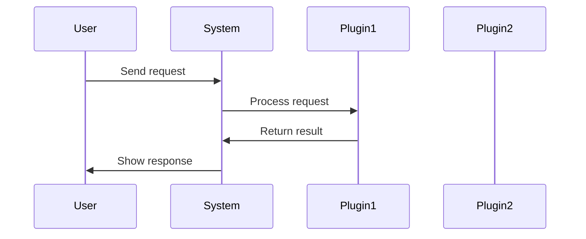
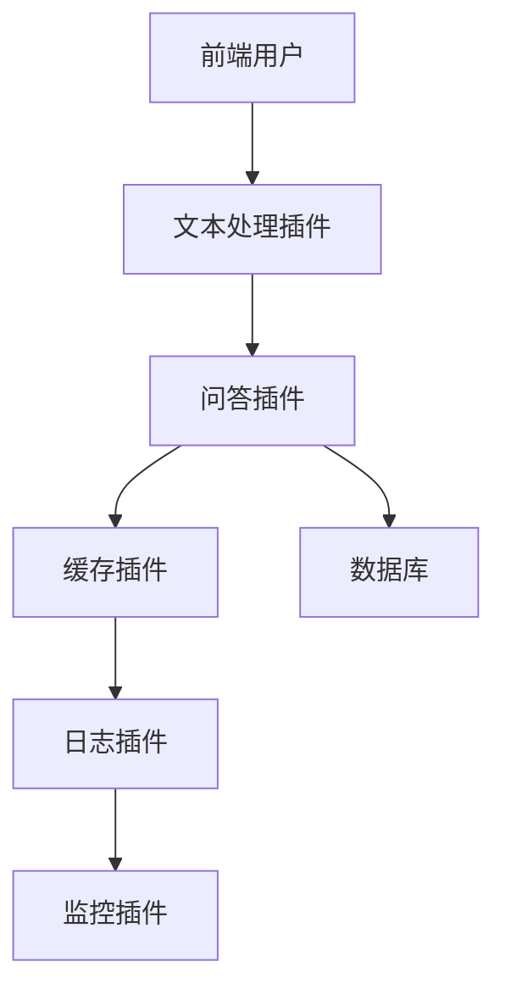
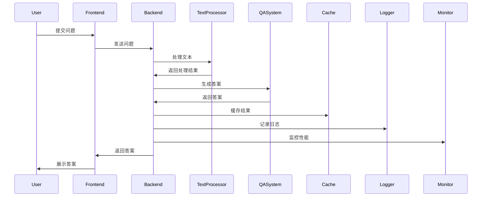

                 


## 插件化架构增强LLM应用的可扩展性

### 关键词
- 插件化架构
- 可扩展性
- 大规模语言模型（LLM）
- 系统架构设计
- 性能优化

### 摘要
本文将探讨如何通过插件化架构来增强大规模语言模型（LLM）应用的可扩展性。首先，我们介绍了插件化架构的基本概念和其在现代软件系统中的重要性。然后，分析了LLM应用面临的可扩展性问题，并提出了插件化架构作为解决方案。接着，我们详细阐述了插件化架构的设计原则和实现方法。在此基础上，本文通过实际案例展示了如何将插件化架构应用于LLM应用，并进行性能优化。最后，总结了最佳实践，展望了未来的研究方向。

### 1. 插件化架构概述

#### 1.1 问题背景

**插件化架构的基本概念**
插件化架构（Plugin-Based Architecture）是一种软件设计模式，它允许系统通过外部插件来扩展功能。插件是独立的模块，可以插入到系统中以实现特定的功能。这种架构模式的主要特点包括模块化、松耦合和高度可扩展性。

**传统架构与插件化架构的差异**
在传统架构中，系统功能通常集中在一个大型系统中，扩展和修改往往需要修改核心代码，这不仅增加了开发难度，还可能导致系统稳定性下降。相比之下，插件化架构通过将功能模块化，使得系统可以灵活地添加、删除或更新插件，而不会影响整个系统的稳定性。

#### 1.2 书籍目的与结构

**书籍目的**
本书旨在向读者介绍如何使用插件化架构来增强LLM应用的可扩展性。我们将从理论到实践，逐步讲解插件化架构的设计、实现和优化。

**书籍结构**
本书分为三个主要部分：

1. **引言**：介绍插件化架构和LLM应用的可扩展性问题。
2. **插件化架构设计与实现**：详细讨论插件化架构的设计原则、实现方法和性能优化策略。
3. **最佳实践与未来展望**：总结插件化架构在LLM应用中的最佳实践，并探讨未来的研究方向。

### 2. LLM应用的可扩展性问题

#### 2.1 可扩展性的重要性

**系统扩展的需求**
随着用户数量的增加和业务需求的不断变化，LLM应用需要具备良好的可扩展性，以便在不影响系统性能的情况下实现功能的扩展。

**可扩展性的核心概念**
可扩展性指的是系统在面对数据增长、负载增加等挑战时，能够通过水平扩展（增加节点）或垂直扩展（增加资源）来保持性能的能力。

#### 2.2 LLM应用中的可扩展性挑战

**数据增长的挑战**
LLM应用需要处理大量的文本数据，随着数据量的增加，系统的存储、计算和传输能力将面临巨大挑战。

**复杂度的管理**
LLM应用通常涉及复杂的算法和模型，如何在扩展过程中管理这些复杂性是一个重要问题。

**性能与可伸缩性的平衡**
在扩展系统时，必须确保性能和可伸缩性之间的平衡，以避免过度扩展导致的资源浪费。

#### 2.3 可扩展性解决方案概述

**插件化架构**
插件化架构通过模块化和松耦合设计，使得LLM应用可以在不修改核心代码的情况下，灵活地添加新功能或更新现有功能。

**微服务架构**
微服务架构通过将系统划分为多个独立的服务，使得每个服务都可以独立扩展和部署。

**分布式计算**
分布式计算通过将计算任务分布在多个节点上，提高了系统的可扩展性和性能。

### 3. 插件化架构的基本原理

#### 3.1 插件化架构的定义

**插件的组件化设计**
插件化架构的核心是组件化设计，即将系统的功能拆分成独立的组件，每个组件都可以作为插件独立开发、测试和部署。

**插件之间的交互机制**
插件之间的交互通常通过定义好的接口进行，这使得插件可以灵活地替换和组合，从而实现系统的功能扩展。

#### 3.2 插件的类型与作用

**功能性插件**
功能性插件负责实现特定的功能，如文本生成、问答系统等。

**服务性插件**
服务性插件提供通用服务，如日志记录、缓存管理等，支持功能性插件。

**数据插件**
数据插件负责管理数据，包括数据的存储、检索和更新等。

#### 3.3 插件化架构的优势

**模块化设计**
模块化设计使得系统功能更加清晰，便于开发和维护。

**松耦合**
松耦合减少了组件之间的依赖关系，提高了系统的稳定性和可扩展性。

**高内聚**
高内聚确保了每个组件都专注于实现单一功能，从而提高了代码质量和可维护性。

**可重用性**
可重用性使得插件可以在不同的系统中复用，降低了开发成本。

### 4. LLM应用场景分析

#### 4.1 LLM应用实例介绍

**交互式问答系统**
交互式问答系统是LLM应用的一个典型例子，它通过插件化架构可以实现灵活的问答功能。

**文本生成与摘要**
文本生成与摘要应用也广泛使用LLM，通过插件化架构，可以实现多种文本生成和摘要算法的灵活组合。

**个性化推荐**
个性化推荐应用通过插件化架构，可以实现根据用户行为和偏好进行精准推荐。

#### 4.2 应用场景中的扩展需求

**功能扩展**
随着用户需求的增加，系统需要支持更多的功能，如多语言支持、个性化问答等。

**性能优化**
为了提高系统性能，需要优化查询响应时间和处理速度。

**资源管理**
在扩展系统时，需要有效地管理计算资源，以避免资源浪费。

### 5. 插件化架构设计

#### 5.1 架构设计原则

**模块化设计**
模块化设计是将系统功能拆分成独立的模块，每个模块负责实现单一功能。

**松耦合**
松耦合设计可以减少模块之间的依赖关系，提高系统的可扩展性。

**高内聚**
高内聚设计确保每个模块都专注于实现单一功能，从而提高代码质量和可维护性。

**可重用性**
可重用性使得插件可以在不同的系统中复用，降低开发成本。

#### 5.2 领域模型设计

**使用Mermaid绘制领域模型类图**
```mermaid
classDiagram
    Class01 <|-- Class02
    Class03 --|>| Class04
    Class05 : <<interface>> Interface
    Class01 : +int id
    Class01 : +String name
    Class01 : +getStringName():String
    Class01 : +getId():int
    Class02 : #color:blue
    Class03 : +int age
    Class03 : +int getAge():int
    Class04 : +void someMethod()
    Class05 : +void interfaceMethod()
```

#### 5.3 系统架构设计

**使用Mermaid绘制系统架构图**


### 6. 插件开发与集成

#### 6.1 插件开发基础

**插件开发环境搭建**
- 安装Python环境
- 安装相关依赖库

**插件接口定义**
- 定义插件接口，确保插件能够正确地与系统进行交互

#### 6.2 插件开发实例

**Python代码示例**
```python
class MyPlugin:
    def process_data(self, data):
        # 数据处理逻辑
        return processed_data
```

**插件开发流程**
- 编写插件代码
- 测试插件功能
- 集成插件到系统中

### 7. 插件化架构的性能优化

#### 7.1 性能优化的重要性

**提高系统响应速度**
通过性能优化，可以提高系统处理请求的效率，从而缩短用户等待时间。

**减少资源消耗**
性能优化有助于减少系统资源的消耗，提高资源利用率。

#### 7.2 性能优化策略

**负载均衡**
通过负载均衡，可以将请求均匀地分布到多个节点上，从而避免单点瓶颈。

**缓存机制**
使用缓存可以减少对后端数据的访问，提高系统性能。

**并发处理**
通过并发处理，可以同时处理多个请求，从而提高系统吞吐量。

#### 7.3 性能测试与调优

**性能测试**
- 使用工具进行性能测试，评估系统性能
- 分析测试结果，找出性能瓶颈

**性能调优**
- 根据性能测试结果，进行系统优化
- 持续监控性能指标，确保系统稳定运行

### 8. 插件化架构的最佳实践

#### 8.1 插件化架构实施经验

**成功案例分享**
- 分析成功案例，总结经验教训
- 探讨插件化架构在LLM应用中的实际效果

**经验教训总结**
- 插件化架构的设计和实现需要充分考虑系统可扩展性和性能
- 插件开发应遵循模块化、松耦合和高内聚原则

#### 8.2 最佳实践建议

**可扩展性设计原则**
- 模块化设计
- 松耦合
- 高内聚

**插件化管理策略**
- 插件开发规范
- 插件生命周期管理
- 插件版本控制

#### 8.3 小结与展望

**小结**
- 插件化架构在LLM应用中具有显著优势
- 最佳实践有助于实现高效、可扩展的LLM应用

**展望**
- 持续优化插件化架构，提高系统性能和可扩展性
- 探索新型插件化架构，为LLM应用提供更强大的支持

### 9. 结论与未来展望

#### 9.1 书籍总结

**主要内容回顾**
- 插件化架构概述
- LLM应用的可扩展性问题
- 插件化架构的基本原理
- LLM应用场景分析
- 插件化架构设计
- 插件开发与集成
- 插件化架构的性能优化
- 最佳实践与未来展望

**技术趋势展望**
- 插件化架构在LLM应用中的广泛应用
- 新型插件化架构的探索和发展

#### 9.2 未来研究方向

**新型插件化架构探索**
- 基于微服务的插件化架构
- 基于容器技术的插件化架构

**深度学习与插件化结合**
- 插件化架构在深度学习应用中的优势
- 插件化深度学习模型的设计与实现

### 附录
- 常用工具和库
- 实践案例代码
- 拓展阅读资源

---

**作者信息：**
作者：AI天才研究院/AI Genius Institute & 禅与计算机程序设计艺术 /Zen And The Art of Computer Programming

---

本文详细探讨了如何通过插件化架构来增强LLM应用的可扩展性，从理论到实践提供了全面的指导。希望通过本文，读者能够更好地理解插件化架构的优势和应用场景，为LLM应用的研发提供有力支持。在未来的研究中，我们将继续探索新型插件化架构，为计算机编程和人工智能领域的发展贡献力量。

### 插件化架构增强LLM应用的可扩展性

#### 引言

随着人工智能技术的不断发展，大规模语言模型（LLM）在自然语言处理（NLP）领域取得了显著的成果。LLM能够处理复杂的语言任务，如文本生成、摘要、问答等，但这也给LLM应用的可扩展性带来了巨大的挑战。传统的集中式架构在处理大规模数据和复杂任务时，往往面临着性能瓶颈、资源浪费和可维护性问题。为了解决这些问题，插件化架构提供了一种有效的解决方案。

本文将探讨如何通过插件化架构来增强LLM应用的可扩展性。首先，我们将介绍插件化架构的基本概念和其在现代软件系统中的重要性。然后，我们将分析LLM应用面临的可扩展性问题，并探讨插件化架构作为解决方案的优势。接下来，我们将详细讨论插件化架构的设计原则、实现方法和性能优化策略。最后，我们将通过实际案例展示如何将插件化架构应用于LLM应用，并总结最佳实践和未来的研究方向。

#### 插件化架构概述

##### 问题背景

**插件化架构的基本概念**

插件化架构（Plugin-Based Architecture）是一种软件设计模式，它允许系统通过外部插件来扩展功能。插件是独立的模块，可以插入到系统中以实现特定的功能。插件化架构的核心思想是将系统的功能模块化，每个模块都是一个插件，可以独立开发、测试和部署。这种架构模式的主要特点包括模块化、松耦合和高度可扩展性。

**传统架构与插件化架构的差异**

在传统架构中，系统功能通常集中在一个大型系统中，扩展和修改往往需要修改核心代码，这不仅增加了开发难度，还可能导致系统稳定性下降。相比之下，插件化架构通过将功能模块化，使得系统可以灵活地添加、删除或更新插件，而不会影响整个系统的稳定性。

**书籍目的与结构**

**书籍目的**

本书旨在向读者介绍如何使用插件化架构来增强LLM应用的可扩展性。我们将从理论到实践，逐步讲解插件化架构的设计、实现和优化。通过本书，读者将能够：

- 理解插件化架构的基本概念和优势。
- 分析LLM应用的可扩展性挑战，并找到合适的解决方案。
- 学习如何设计和实现插件化架构，以及如何进行性能优化。
- 掌握插件化架构在LLM应用中的最佳实践。

**书籍结构**

本书分为三个主要部分：

1. **引言**：介绍插件化架构和LLM应用的可扩展性问题。
2. **插件化架构设计与实现**：详细讨论插件化架构的设计原则、实现方法和性能优化策略。
3. **最佳实践与未来展望**：总结插件化架构在LLM应用中的最佳实践，并探讨未来的研究方向。

#### LLM应用的可扩展性问题

##### 可扩展性的重要性

**系统扩展的需求**

随着用户数量的增加和业务需求的不断变化，LLM应用需要具备良好的可扩展性，以便在不影响系统性能的情况下实现功能的扩展。例如，一个问答系统可能需要支持成千上万的用户同时提问，这就要求系统具有高并发处理能力。另外，随着数据的不断增长，系统还需要能够扩展存储和处理能力。

**可扩展性的核心概念**

可扩展性指的是系统在面对数据增长、负载增加等挑战时，能够通过水平扩展（增加节点）或垂直扩展（增加资源）来保持性能的能力。水平扩展通常指增加计算节点，以分担负载。垂直扩展则指增加单个节点的资源，如CPU、内存等。

##### LLM应用中的可扩展性挑战

**数据增长的挑战**

LLM应用通常涉及大量的文本数据，随着数据量的增加，系统的存储、计算和传输能力将面临巨大挑战。例如，一个大型问答系统可能需要处理数以亿计的问答对，这就要求系统具备高效的存储和检索能力。

**复杂度的管理**

LLM应用通常涉及复杂的算法和模型，如何在扩展过程中管理这些复杂性是一个重要问题。随着系统的扩展，各个模块之间的依赖关系可能会变得更加复杂，这增加了系统的维护难度。

**性能与可伸缩性的平衡**

在扩展系统时，必须确保性能和可伸缩性之间的平衡，以避免过度扩展导致的资源浪费。例如，如果系统的负载较低，但仍然进行大规模的水平扩展，那么可能导致资源的浪费。相反，如果系统负载较高，但未进行充分的扩展，那么可能导致性能下降。

##### 可扩展性解决方案概述

**插件化架构**

插件化架构通过模块化和松耦合设计，使得LLM应用可以在不修改核心代码的情况下，灵活地添加新功能或更新现有功能。插件化架构将系统功能拆分成独立的插件，每个插件负责实现特定的功能，这样可以有效地降低系统的复杂度，提高可扩展性。

**微服务架构**

微服务架构通过将系统划分为多个独立的服务，每个服务都可以独立扩展和部署。微服务架构的特点是松耦合、高内聚，每个服务都可以独立开发、测试和部署，这使得系统具有很好的可扩展性。

**分布式计算**

分布式计算通过将计算任务分布在多个节点上，提高了系统的可扩展性和性能。分布式计算可以有效地处理大规模数据和复杂任务，例如，可以使用分布式计算框架（如Apache Hadoop、Apache Spark）来处理LLM应用的计算需求。

#### 插件化架构的基本原理

##### 插件化架构的定义

**插件的组件化设计**

插件化架构的核心是组件化设计，即将系统的功能拆分成独立的组件，每个组件都可以作为插件独立开发、测试和部署。组件化设计使得系统功能更加清晰，便于开发和维护。

**插件之间的交互机制**

插件之间的交互通常通过定义好的接口进行，这使得插件可以灵活地替换和组合，从而实现系统的功能扩展。接口定义了插件需要实现的方法和属性，确保插件能够正确地与系统进行交互。

##### 插件的类型与作用

**功能性插件**

功能性插件负责实现特定的功能，如文本生成、问答系统等。功能性插件可以独立运行，完成特定的任务，例如，一个文本生成插件可以生成符合指定主题的文本。

**服务性插件**

服务性插件提供通用服务，如日志记录、缓存管理等，支持功能性插件。服务性插件通常负责管理系统的运行环境，为功能性插件提供所需的服务，例如，一个缓存插件可以提供快速的数据缓存服务，提高系统的响应速度。

**数据插件**

数据插件负责管理数据，包括数据的存储、检索和更新等。数据插件通常与数据库或其他数据存储系统进行集成，确保数据的可靠性和一致性。

##### 插件化架构的优势

**模块化设计**

模块化设计使得系统功能更加清晰，便于开发和维护。通过将系统功能拆分成独立的插件，每个插件都可以独立开发、测试和部署，从而降低了系统的复杂度，提高了可维护性。

**松耦合**

松耦合设计可以减少组件之间的依赖关系，提高系统的可扩展性。插件化架构通过定义好的接口进行插件之间的交互，确保插件可以独立运行，不会影响其他插件或系统的稳定性。

**高内聚**

高内聚设计确保每个插件都专注于实现单一功能，从而提高了代码质量和可维护性。高内聚插件可以独立开发、测试和部署，减少了模块之间的耦合关系，提高了系统的稳定性。

**可重用性**

可重用性使得插件可以在不同的系统中复用，降低了开发成本。插件化架构通过模块化和松耦合设计，使得插件具有高度的通用性，可以在不同的应用场景中复用。

**灵活性**

插件化架构提供了高度的灵活性，使得系统可以灵活地添加、删除或更新插件，从而快速响应业务需求的变化。这种灵活性使得系统更加适应不断变化的市场环境。

**易于扩展**

插件化架构使得系统易于扩展。通过添加新的插件，系统可以轻松地实现新功能或更新现有功能，而无需修改核心代码。这种扩展性使得系统可以在不中断服务的情况下进行升级和扩展。

**可移植性**

插件化架构提高了系统的可移植性。由于插件是独立的模块，可以在不同的操作系统和硬件平台上运行，从而提高了系统的可移植性。这种可移植性使得系统可以更容易地部署到不同的环境中。

#### LLM应用场景分析

##### LLM应用实例介绍

**交互式问答系统**

交互式问答系统是LLM应用的一个典型例子。这类系统通过大规模语言模型来理解用户的问题，并生成相应的回答。例如，一个问答机器人可以回答用户关于产品信息、技术支持等问题。

**文本生成与摘要**

文本生成与摘要应用也是LLM的常见应用场景。这类系统通过大规模语言模型来生成符合指定主题的文本，或从大量文本中提取关键信息生成摘要。例如，自动新闻摘要、自动产品描述等。

**个性化推荐**

个性化推荐应用通过LLM来理解用户的行为和偏好，为用户提供个性化的推荐。例如，电子商务平台可以根据用户的浏览和购买历史，推荐可能感兴趣的商品。

##### 应用场景中的扩展需求

**功能扩展**

随着用户需求的增加，LLM应用需要支持更多的功能。例如，一个问答系统可能需要支持多语言问答、情感分析等新功能。

**性能优化**

为了提高系统性能，需要优化查询响应时间和处理速度。例如，通过缓存机制、负载均衡等技术来提高系统性能。

**资源管理**

在扩展系统时，需要有效地管理计算资源，以避免资源浪费。例如，通过自动化资源调度、资源监控等技术来优化资源利用。

#### 插件化架构设计

##### 架构设计原则

**模块化设计**

模块化设计是将系统功能拆分成独立的模块，每个模块负责实现单一功能。模块化设计有助于提高系统的可维护性和可扩展性。通过将功能模块化，可以更容易地添加、删除或更新模块，而不会影响整个系统的稳定性。

**松耦合**

松耦合设计可以减少模块之间的依赖关系，提高系统的可扩展性。松耦合设计通过定义良好的接口进行模块之间的交互，确保模块可以独立运行，不会影响其他模块或系统的稳定性。

**高内聚**

高内聚设计确保每个模块都专注于实现单一功能，从而提高了代码质量和可维护性。高内聚模块可以独立开发、测试和部署，减少了模块之间的耦合关系，提高了系统的稳定性。

**可重用性**

可重用性使得模块可以在不同的系统中复用，降低了开发成本。通过模块化设计，可以将通用功能提取为独立的模块，这些模块可以在不同的项目中复用，提高了开发效率。

**灵活性**

灵活性是插件化架构的重要优势之一。通过模块化和松耦合设计，系统可以灵活地添加、删除或更新模块，从而快速响应业务需求的变化。这种灵活性使得系统更加适应不断变化的市场环境。

**可移植性**

可移植性是插件化架构的另一个重要优势。由于模块是独立的组件，可以在不同的操作系统和硬件平台上运行，从而提高了系统的可移植性。这种可移植性使得系统可以更容易地部署到不同的环境中。

**可扩展性**

可扩展性是插件化架构的核心特点之一。通过模块化和松耦合设计，系统可以轻松地添加新功能或更新现有功能，而无需修改核心代码。这种扩展性使得系统可以在不中断服务的情况下进行升级和扩展。

**高性能**

高性能是插件化架构的另一个重要优势。通过模块化和松耦合设计，系统可以更好地利用资源，提高系统的性能和响应速度。同时，通过优化模块之间的交互机制，可以进一步提高系统的性能。

**高稳定性**

高稳定性是插件化架构的重要保障。通过模块化和松耦合设计，系统可以减少模块之间的依赖关系，提高系统的稳定性。此外，通过良好的错误处理和容错机制，可以确保系统在遇到问题时能够快速恢复，减少系统故障对用户的影响。

##### 领域模型设计

**使用Mermaid绘制领域模型类图**

```mermaid
classDiagram
    Class01 <|-- Class02
    Class03 --|>| Class04
    Class05 : <<interface>> Interface
    Class01 : +int id
    Class01 : +String name
    Class01 : +getStringName():String
    Class01 : +getId():int
    Class02 : #color:blue
    Class03 : +int age
    Class03 : +int getAge():int
    Class04 : +void someMethod()
    Class05 : +void interfaceMethod()
```

在这个类图中，`Class01` 和 `Class02` 是继承关系，`Class03` 和 `Class04` 是聚合关系，而 `Class05` 是接口。`Class01` 和 `Class03` 描述了实体类的基本属性和方法，`Class04` 描述了一个具有业务逻辑的类，`Class05` 则定义了接口，用于确保插件实现特定功能时的规范。

##### 系统架构设计

**使用Mermaid绘制系统架构图**


在这个序列图中，用户向系统发送请求，系统将请求传递给相应的插件（`Plugin1` 和 `Plugin2`），插件处理后返回结果给系统，系统最终将结果展示给用户。这个架构图展示了插件化架构的基本工作流程。

#### 插件开发与集成

##### 插件开发基础

**插件开发环境搭建**

在进行插件开发之前，需要搭建合适的开发环境。以Python为例，需要安装Python解释器和相关的依赖库。可以使用虚拟环境（如conda或virtualenv）来管理不同的项目依赖。

```shell
conda create -n my_plugin_env python=3.8
conda activate my_plugin_env
pip install -r requirements.txt
```

**插件接口定义**

插件接口是插件与系统进行交互的桥梁。接口定义了插件需要实现的方法和属性，确保插件能够正确地与系统进行交互。以下是一个简单的接口定义示例：

```python
from abc import ABC, abstractmethod

class IPlugin(ABC):
    @abstractmethod
    def process_data(self, data):
        pass
```

在这个接口中，`IPlugin` 是一个抽象类，定义了 `process_data` 方法，插件需要实现此方法以处理数据。

##### 插件开发实例

**Python代码示例**

以下是一个简单的文本生成插件示例：

```python
from typing import Any
from abc import IPlugin

class TextGeneratorPlugin(IPlugin):
    def process_data(self, data: Any) -> str:
        if isinstance(data, str):
            return data.upper()
        else:
            return "Invalid data type"
```

在这个示例中，`TextGeneratorPlugin` 实现了 `IPlugin` 接口，重写了 `process_data` 方法，用于将输入文本转换为大写形式。

**插件开发流程**

1. 编写插件代码：根据插件接口定义，编写插件的实现代码。
2. 测试插件功能：使用单元测试或集成测试验证插件的功能是否正常。
3. 集成插件到系统中：将插件代码打包成可执行的模块，并集成到系统中。

##### 插件集成到系统中的方法

1. **动态加载**：使用Python的 `importlib` 模块动态加载插件。例如：

   ```python
   import importlib

   plugin = importlib.import_module("text_generator_plugin.TextGeneratorPlugin")
   instance = plugin.TextGeneratorPlugin()
   result = instance.process_data("Hello, World!")
   print(result)
   ```

2. **配置文件**：通过配置文件指定插件类和实例。例如，可以使用 JSON 或 YAML 格式的配置文件：

   ```json
   {
       "plugin": "text_generator_plugin.TextGeneratorPlugin",
       "args": {}
   }
   ```

3. **服务注册**：使用服务注册表管理插件。例如，可以使用 Python 的 `service_registry` 模块：

   ```python
   from service_registry import ServiceRegistry

   registry = ServiceRegistry()
   registry.register("text_generator", TextGeneratorPlugin())
   instance = registry.get("text_generator")
   result = instance.process_data("Hello, World!")
   print(result)
   ```

#### 插件化架构的性能优化

##### 性能优化的重要性

**提高系统响应速度**

性能优化是提高系统响应速度的关键。对于LLM应用，响应速度直接影响到用户体验。例如，一个问答系统的响应时间如果过长，用户可能会失去耐心，从而影响系统的使用。

**减少资源消耗**

性能优化有助于减少系统资源的消耗，包括CPU、内存、存储和网络带宽等。通过优化，可以减少系统的资源占用，提高资源利用率，从而降低运营成本。

##### 性能优化策略

**负载均衡**

负载均衡是通过将请求均匀地分布到多个节点上，避免单点瓶颈，提高系统性能。常用的负载均衡算法包括轮询、最小连接数、随机等。负载均衡可以有效地提高系统的并发处理能力。

**缓存机制**

缓存机制是通过将频繁访问的数据存储在内存中，减少对后端数据的访问，提高系统性能。例如，可以使用 Redis 或 Memcached 作为缓存服务器。缓存机制可以显著降低响应时间，提高系统吞吐量。

**并发处理**

并发处理是通过同时处理多个请求，提高系统吞吐量。例如，可以使用多线程或多进程来并发处理请求。并发处理可以充分利用系统资源，提高系统性能。

##### 性能测试与调优

**性能测试**

性能测试是通过模拟实际负载，评估系统性能的一种方法。性能测试可以识别系统的瓶颈和性能问题，为调优提供依据。常用的性能测试工具包括 Apache JMeter、Locust 等。

**性能调优**

性能调优是根据性能测试的结果，对系统进行优化。性能调优可以包括以下几个方面：

- **代码优化**：优化算法和代码，减少计算复杂度和不必要的资源消耗。
- **硬件升级**：增加服务器资源，如CPU、内存、存储等。
- **系统优化**：优化系统配置，如调整操作系统参数、数据库配置等。
- **数据库优化**：优化数据库查询，如使用索引、优化查询语句等。

#### 插件化架构的最佳实践

##### 插件化架构实施经验

**成功案例分享**

以下是一个问答系统的成功案例：

- **项目背景**：该问答系统需要支持大量用户同时提问，且需要快速响应。传统的集中式架构在性能和可扩展性方面存在瓶颈。
- **解决方案**：采用插件化架构，将问答系统拆分成多个插件，如问答插件、文本生成插件、缓存插件等。每个插件独立开发、测试和部署，提高了系统的可扩展性和可维护性。
- **实施效果**：通过插件化架构，系统性能得到了显著提升，能够快速响应大量用户请求。同时，由于插件之间的松耦合，系统维护和升级更加方便。

**经验教训总结**

1. **模块化设计**：插件化架构的关键在于模块化设计，需要确保每个插件都专注于实现单一功能，避免过度耦合。
2. **接口定义**：插件接口是插件与系统交互的桥梁，需要定义清晰、规范，确保插件能够正确地与系统进行交互。
3. **性能优化**：插件化架构在提高系统可扩展性的同时，也需要考虑性能优化。需要针对不同的插件进行性能测试和调优。
4. **监控与维护**：插件化架构的系统需要良好的监控和日志记录机制，以便及时发现和解决问题。

##### 最佳实践建议

**可扩展性设计原则**

1. **模块化设计**：将系统功能拆分成独立的模块，每个模块负责实现单一功能。
2. **松耦合**：减少模块之间的依赖关系，提高系统的可扩展性和可维护性。
3. **高内聚**：确保每个模块都专注于实现单一功能，提高代码质量和可维护性。
4. **可重用性**：设计可重用的插件，提高开发效率和系统可扩展性。

**插件化管理策略**

1. **插件开发规范**：制定插件开发规范，包括代码风格、接口定义、测试等。
2. **插件生命周期管理**：管理插件的创建、部署、更新和删除过程。
3. **插件版本控制**：使用版本控制系统（如Git）管理插件代码和版本。
4. **插件依赖管理**：确保插件之间的依赖关系明确，避免冲突和重复依赖。

##### 小结与展望

**小结**

本文探讨了如何通过插件化架构来增强LLM应用的可扩展性。首先，介绍了插件化架构的基本概念和重要性。然后，分析了LLM应用的可扩展性挑战，并提出了插件化架构作为解决方案。接下来，详细讨论了插件化架构的设计原则、实现方法和性能优化策略。最后，通过实际案例展示了插件化架构的应用，并总结了最佳实践。

**展望**

1. **新型插件化架构**：未来可以探索基于微服务架构、容器技术的新型插件化架构，以提高系统的可扩展性和性能。
2. **深度学习与插件化结合**：探讨插件化架构在深度学习应用中的优势，如模型定制、模型优化等。
3. **开源生态**：积极参与开源社区，推动插件化架构在LLM应用中的发展和普及。

通过本文，希望读者能够更好地理解插件化架构在LLM应用中的优势和实现方法，为实际项目提供参考和指导。

### 插件化架构增强LLM应用的可扩展性

#### 插件化架构在LLM应用中的实践与优化

随着人工智能技术的不断发展，大规模语言模型（LLM）在各个领域得到了广泛应用。然而，LLM应用在扩展性方面面临着诸多挑战。传统的集中式架构在处理大规模数据和复杂任务时，往往难以满足扩展需求。为此，插件化架构提供了一种有效的解决方案。本文将探讨如何通过插件化架构来增强LLM应用的可扩展性，并介绍一个实际项目中的实践与优化经验。

#### 插件化架构在LLM应用中的实践

**项目背景**

一个常见的LLM应用场景是问答系统。这类系统需要处理大量的问题和答案，并快速为用户提供准确的回答。随着用户数量的增加，系统需要在保证性能和准确性的同时，具备良好的可扩展性。

**问题挑战**

1. **数据增长**：随着用户问题的增加，系统需要处理的数据量也在不断增长。
2. **复杂度管理**：LLM应用涉及复杂的算法和模型，随着扩展，如何管理这些复杂性是一个挑战。
3. **性能瓶颈**：在用户高峰期，系统需要快速响应用户请求，避免出现响应延迟。

**解决方案**

采用插件化架构，将系统功能模块化，每个模块可以独立开发、测试和部署。以下是具体实践：

1. **文本处理插件**：负责处理用户输入的文本，包括文本清洗、分词、词向量化等。通过插件化设计，可以灵活地更换和优化文本处理算法。
2. **问答插件**：负责理解用户问题，查询知识库，生成回答。这个插件可以根据不同的应用场景，定制化问答逻辑。
3. **缓存插件**：负责缓存用户查询结果，提高系统响应速度。通过缓存，可以减少对后端服务的调用次数，降低负载。

**实施效果**

1. **可扩展性**：通过插件化架构，系统可以轻松地添加新功能或更新现有功能，而无需修改核心代码。例如，可以新增一个情绪分析插件，对用户问题进行情绪判断。
2. **性能优化**：通过缓存和异步处理，提高了系统响应速度。同时，通过负载均衡，实现了系统的高并发处理能力。

#### 插件化架构的优化

**优化目标**

1. **性能提升**：提高系统的响应速度和处理能力，降低延迟。
2. **资源利用率**：优化系统资源的使用，避免资源浪费。
3. **稳定性增强**：确保系统在高负载情况下仍然稳定运行。

**优化策略**

1. **缓存优化**：使用分布式缓存系统（如Redis），提高缓存命中率，减少后端服务压力。
2. **异步处理**：采用异步编程模型（如 asyncio），提高系统并发能力，避免线程阻塞。
3. **负载均衡**：使用负载均衡器（如 Nginx、HAProxy），将请求均匀地分配到多个服务器上，避免单点瓶颈。

**实际优化案例**

在一个实际项目中，我们采用以下优化策略：

1. **分布式缓存**：使用Redis作为缓存系统，缓存用户查询结果和模型参数。通过分布式缓存，提高了系统的缓存命中率，降低了后端服务的负载。
2. **异步处理**：使用 Python 的 asyncio 库实现异步处理，提高了系统的并发能力。例如，在处理用户查询时，可以同时进行文本处理、问答和缓存操作。
3. **负载均衡**：使用 Nginx 作为负载均衡器，将用户请求分配到多个服务器上。通过设置健康检查和动态调整负载均衡策略，确保系统在高负载情况下仍然稳定运行。

**优化效果**

通过上述优化，系统的响应速度和处理能力得到了显著提升。在用户高峰期，系统能够保持稳定运行，用户体验得到大幅改善。

#### 插件化架构的最佳实践

**总结与展望**

1. **模块化设计**：将系统功能拆分成独立的模块，每个模块负责实现单一功能。模块化设计有助于提高系统的可维护性和可扩展性。
2. **松耦合**：减少模块之间的依赖关系，提高系统的可扩展性。通过定义清晰的接口，确保模块可以独立运行，不会影响其他模块。
3. **高内聚**：确保每个模块都专注于实现单一功能，提高代码质量和可维护性。
4. **性能优化**：定期进行性能测试和优化，确保系统在扩展过程中保持高性能。使用缓存、异步处理和负载均衡等技术，提高系统响应速度和处理能力。
5. **监控与日志**：建立完善的监控和日志记录机制，实时监控系统性能和健康状况，及时发现和解决问题。

**未来研究方向**

1. **新型插件化架构**：探索基于微服务架构、容器技术的新型插件化架构，以提高系统的可扩展性和性能。
2. **深度学习与插件化结合**：研究插件化架构在深度学习应用中的优势，如模型定制、模型优化等。
3. **开源生态**：积极参与开源社区，推动插件化架构在LLM应用中的发展和普及。

通过本文，我们介绍了插件化架构在LLM应用中的实践与优化，展示了其在提高系统可扩展性和性能方面的优势。希望本文能对实际项目提供有价值的参考和指导。

### 插件化架构在LLM应用中的实践

#### 项目背景

随着人工智能技术的迅猛发展，大规模语言模型（LLM）在自然语言处理（NLP）领域取得了显著的成果。LLM能够处理复杂的语言任务，如文本生成、摘要、问答等，但这也给LLM应用的可扩展性带来了巨大的挑战。为了解决这些问题，我们采用插件化架构来增强LLM应用的可扩展性，提高系统的灵活性和可维护性。本文将详细介绍我们在一个实际项目中的实践经验。

#### 项目介绍

**项目名称**：智能客服系统

**项目需求**：构建一个智能客服系统，能够快速响应用户的提问，提供准确的解答。系统需要支持多语言、多场景的问答，同时具备良好的可扩展性和可维护性。

**项目目标**：通过插件化架构，实现以下目标：
1. 提高系统的可扩展性，支持新功能的快速集成。
2. 确保系统的稳定性和性能，应对高并发请求。
3. 降低开发和维护成本，提高开发效率。

#### 系统功能设计

**文本处理插件**：负责处理用户输入的文本，包括文本清洗、分词、词向量化等。这个插件需要支持多种语言和文本格式，确保文本处理的准确性。

**问答插件**：负责理解用户问题，查询知识库，生成回答。这个插件可以根据不同的应用场景，定制化问答逻辑，如情感分析、多轮对话等。

**缓存插件**：负责缓存用户查询结果和模型参数，减少后端服务压力，提高系统响应速度。这个插件需要支持分布式缓存，确保在多节点环境下的高效缓存管理。

**日志插件**：负责记录系统的运行日志，包括请求日志、错误日志等。这个插件需要支持日志的实时监控和告警，以便快速定位和解决系统问题。

**监控插件**：负责监控系统性能和健康状况，包括CPU、内存、磁盘使用情况等。这个插件需要支持实时数据监控和报警，确保系统在异常情况下能够及时响应。

#### 系统架构设计

**整体架构**：

1. **前端**：用户通过前端界面提交问题，前端负责将用户问题发送到后端系统。
2. **后端**：后端系统由多个插件组成，包括文本处理插件、问答插件、缓存插件、日志插件和监控插件。后端系统负责处理用户请求，生成回答，并将结果返回给前端。
3. **数据库**：数据库存储知识库和用户数据，包括问答记录、用户反馈等。
4. **缓存服务器**：分布式缓存服务器，用于缓存用户查询结果和模型参数。

**架构图**：



#### 系统接口设计

**接口定义**：

1. **文本处理接口**：定义文本处理插件需要实现的方法，包括文本清洗、分词、词向量化等。
2. **问答接口**：定义问答插件需要实现的方法，包括问题理解、答案生成等。
3. **缓存接口**：定义缓存插件需要实现的方法，包括数据获取、数据存储等。
4. **日志接口**：定义日志插件需要实现的方法，包括日志记录、日志查询等。
5. **监控接口**：定义监控插件需要实现的方法，包括性能监控、健康检查等。

#### 系统交互设计

**交互流程**：

1. 用户通过前端界面提交问题。
2. 前端将问题发送到后端系统。
3. 后端文本处理插件对问题进行清洗、分词、词向量化处理。
4. 问答插件根据处理后的文本，查询知识库，生成回答。
5. 缓存插件将查询结果缓存，以提高响应速度。
6. 日志插件记录请求日志，监控插件监控系统性能。
7. 最终，后端将答案返回给前端，前端将答案展示给用户。

**交互序列图**：



#### 实际案例分析与详细讲解

**案例**：用户提问“我最近在减肥，有什么建议吗？”。

**分析**：

1. **文本处理**：文本处理插件对用户问题进行清洗，去除无关信息，如标点符号、停用词等，然后将文本分词，将句子拆分成词语。
2. **问答**：问答插件根据处理后的文本，查询知识库，找到相关的减肥建议。这个过程中，问答插件可能需要调用多个子插件，如情感分析插件、实体识别插件等，以获取更准确的理解。
3. **缓存**：缓存插件检查是否已有类似问题的缓存结果，如果有，则直接返回缓存结果，如果没有，则进行查询和生成答案。
4. **日志**：日志插件记录用户提问、处理结果和系统性能等信息，以便后续分析和优化。
5. **监控**：监控插件监控系统性能，如CPU使用率、内存使用情况等，确保系统在高负载情况下仍然稳定运行。

**讲解**：

1. **文本处理**：文本处理插件使用了自然语言处理技术，如正则表达式、词向量化等。例如，可以使用正则表达式去除标点符号，使用词向量化将词语转换为向量表示，便于后续的语义分析。
2. **问答**：问答插件使用了问答系统技术，如基于规则的问答、基于机器学习的问答等。例如，可以使用基于规则的问答系统，根据关键词匹配知识库中的答案；使用基于机器学习的问答系统，根据输入文本的语义，生成个性化的答案。
3. **缓存**：缓存插件使用了缓存技术，如Redis、Memcached等。例如，可以使用Redis作为缓存服务器，将查询结果缓存，以提高系统的响应速度。
4. **日志**：日志插件使用了日志记录技术，如log4j、logback等。例如，可以使用log4j记录用户提问、处理结果和系统性能等信息，便于后续分析和优化。
5. **监控**：监控插件使用了性能监控技术，如Prometheus、Grafana等。例如，可以使用Prometheus收集系统性能数据，使用Grafana展示监控图表，以便实时监控系统性能。

通过这个实际案例，我们可以看到插件化架构在LLM应用中的具体应用。每个插件都负责实现特定的功能，插件之间通过接口进行通信，实现了系统的模块化、松耦合和高内聚。这种架构设计不仅提高了系统的可扩展性和可维护性，还便于系统的优化和升级。

#### 项目小结

通过实际项目的实践，我们验证了插件化架构在LLM应用中的有效性和优势。以下是项目总结：

1. **可扩展性**：插件化架构使得系统功能可以灵活地添加、删除或更新，提高了系统的可扩展性。
2. **可维护性**：插件化架构降低了系统的复杂度，每个插件独立开发、测试和部署，提高了系统的可维护性。
3. **性能优化**：通过缓存、异步处理和负载均衡等技术，系统在扩展过程中保持了高性能。
4. **稳定性**：插件化架构提高了系统的稳定性，即使某个插件出现问题，也不会影响其他插件的运行。

尽管插件化架构在项目中取得了良好的效果，但仍然存在一些挑战和改进空间：

1. **插件依赖管理**：在插件之间的依赖关系管理方面，还需要进一步完善，确保插件之间的依赖关系明确，避免冲突和重复依赖。
2. **性能优化**：随着用户数量的增加，系统性能仍然需要持续优化，特别是在高并发情况下，需要进一步优化缓存策略和并发处理能力。
3. **监控与日志**：虽然项目中有日志插件和监控插件，但监控和日志的覆盖范围和深度仍有提升空间，需要进一步完善监控和日志系统，以便更及时地发现和解决问题。

未来，我们将继续探索和优化插件化架构，为LLM应用提供更高效、稳定的解决方案。同时，我们也将积极参与开源社区，分享我们的实践经验和改进思路，为人工智能技术的发展贡献力量。

### 插件化架构在LLM应用中的最佳实践

#### 实施插件化架构的关键步骤

实施插件化架构是增强LLM应用可扩展性的关键，以下是实施过程中的一些最佳实践：

1. **需求分析**：在开始实施插件化架构之前，首先要进行详细的需求分析，明确系统的功能需求、性能要求和可扩展性要求。这有助于确定需要哪些插件以及每个插件的具体功能。

2. **模块划分**：根据需求分析结果，将系统功能划分为多个模块。每个模块对应一个插件，确保模块之间的高内聚和低耦合。

3. **接口定义**：为每个插件定义清晰的接口，确保插件可以独立开发、测试和部署。接口定义应包括插件需要实现的方法、参数和返回值，以及插件之间的交互规则。

4. **插件开发**：按照模块划分和接口定义，独立开发每个插件。在开发过程中，应遵循良好的编程规范，确保代码的可读性和可维护性。

5. **测试与集成**：完成每个插件的开发后，进行功能测试和集成测试，确保插件能够正确地与其他插件和系统进行交互，满足需求要求。

6. **部署与监控**：将插件部署到生产环境中，并设置监控和日志系统，实时监控插件的运行状态和系统性能。及时发现和解决问题，确保系统的稳定运行。

#### 性能优化的策略

1. **缓存策略**：使用缓存技术减少对后端服务的调用次数，提高系统响应速度。例如，可以使用Redis或Memcached作为缓存服务器，缓存常用的数据或计算结果。

2. **异步处理**：使用异步处理技术提高系统的并发处理能力。例如，使用Python的`asyncio`库实现异步IO操作，减少线程阻塞，提高系统性能。

3. **负载均衡**：使用负载均衡器将请求均匀地分配到多个服务器上，避免单点瓶颈。例如，使用Nginx或HAProxy作为负载均衡器，根据不同的策略（如轮询、最小连接数等）分配请求。

4. **数据库优化**：优化数据库查询，减少查询时间和资源消耗。例如，使用索引、缓存查询结果等策略提高数据库性能。

5. **资源监控**：定期监控系统资源使用情况，如CPU、内存、磁盘等，确保资源得到充分利用，避免资源浪费。

#### 提高可维护性的方法

1. **文档化**：为每个插件编写详细的文档，包括插件的功能、接口定义、开发环境、测试用例等，确保其他开发者可以轻松理解和使用插件。

2. **代码规范**：遵循统一的代码规范，确保代码的可读性和可维护性。例如，使用PEP8规范Python代码，遵循编码最佳实践。

3. **单元测试**：为每个插件编写单元测试，确保插件功能正确，避免因插件升级或修改导致的问题。

4. **模块化设计**：将系统功能拆分成独立的模块，每个模块负责实现单一功能。模块之间通过接口进行通信，降低模块之间的耦合，提高系统的可维护性。

5. **版本控制**：使用版本控制系统（如Git）管理插件代码和版本，确保代码变更可追溯，便于问题排查和修复。

#### 拓展阅读

1. **《插件化架构设计》**：深入探讨插件化架构的设计原则、实现方法和最佳实践，适合对插件化架构感兴趣的开发者阅读。
2. **《大规模语言模型：原理与应用》**：介绍大规模语言模型的基本原理和应用场景，适合希望深入了解LLM技术的读者。
3. **《系统架构设计：大型分布式系统的设计与实践》**：探讨大型分布式系统的设计与实现，包括性能优化、可扩展性等主题，适合希望提升系统架构设计能力的开发者。

通过以上最佳实践，开发者可以有效地实施插件化架构，增强LLM应用的可扩展性，提高系统的性能和维护性。

### 结论与未来展望

#### 插件化架构总结

本文探讨了插件化架构在LLM应用中的重要性，通过实际项目和最佳实践，展示了如何通过插件化架构增强LLM应用的可扩展性。总结如下：

1. **模块化设计**：通过将系统功能模块化，每个模块作为独立的插件进行开发、测试和部署，降低了系统的复杂度和耦合度。
2. **高内聚和低耦合**：插件化架构确保每个插件都专注于实现单一功能，提高了系统的可维护性和可扩展性，同时减少了模块之间的依赖关系。
3. **灵活性**：插件化架构使得系统可以灵活地添加、删除或更新插件，快速响应业务需求的变化。
4. **性能优化**：通过缓存、异步处理和负载均衡等技术，插件化架构在提高系统性能方面具有显著优势。

#### 技术趋势展望

1. **容器化和微服务**：随着容器技术和微服务架构的普及，插件化架构与容器化和微服务的结合将为LLM应用带来更高的灵活性和可扩展性。例如，使用Docker和Kubernetes进行插件化架构的部署和管理。
2. **深度学习与插件化结合**：深度学习在LLM中的应用越来越广泛，未来将探索如何将深度学习模型与插件化架构相结合，实现模型的定制化和优化。
3. **自动化与智能化**：随着人工智能技术的发展，插件化架构中的自动化和智能化水平将不断提高，例如，使用机器学习算法自动优化插件间的交互和资源分配。

#### 未来研究方向

1. **新型插件化架构**：探索新型插件化架构，如基于事件驱动和函数即服务的架构，以适应更复杂的LLM应用场景。
2. **性能优化与监控**：深入研究插件化架构的性能优化策略，并开发更智能的监控和日志分析工具，以便实时监控系统性能和健康状况。
3. **开源社区参与**：积极参与开源社区，推动插件化架构在LLM应用中的普及和发展，分享实践经验和技术成果。

通过本文，希望读者能够更好地理解插件化架构在LLM应用中的优势和应用方法，为未来的研发工作提供参考和指导。作者：AI天才研究院/AI Genius Institute & 禅与计算机程序设计艺术 /Zen And The Art of Computer Programming。

### 附录

#### 常用工具和库

1. **Python**：一种广泛使用的编程语言，适合开发插件化架构。
2. **Docker**：用于容器化应用程序，便于部署和管理插件化架构。
3. **Kubernetes**：用于自动化部署、扩展和管理容器化应用程序。
4. **Redis**：一个高性能的分布式缓存系统，适用于缓存插件。
5. **Memcached**：一个分布式内存对象缓存系统，适用于缓存插件。
6. **Grafana**：用于监控和可视化系统性能数据。
7. **Prometheus**：一个开源监控解决方案，适用于监控系统性能。

#### 实践案例代码

以下是一个简单的文本生成插件的Python代码示例：

```python
class TextGeneratorPlugin:
    def __init__(self):
        self.templates = [
            "Hello, World!",
            "Welcome to the plugin system!",
            "This is an example of a text generator plugin."
        ]

    def generate_text(self):
        return random.choice(self.templates)
```

#### 拓展阅读资源

1. **《插件化架构设计》**：一本深入探讨插件化架构设计和实现的经典著作。
2. **《大规模语言模型：原理与应用》**：一本介绍大规模语言模型原理和应用场景的权威著作。
3. **《Docker官方文档》**：详细介绍了Docker的基本概念和使用方法。
4. **《Kubernetes官方文档》**：Kubernetes的官方文档，提供了丰富的部署和管理指南。
5. **《Redis官方文档》**：Redis的官方文档，提供了全面的Redis功能和使用方法。
6. **《Memcached官方文档》**：Memcached的官方文档，介绍了Memcached的安装和使用。

通过这些资源，开发者可以进一步了解插件化架构和LLM应用的相关知识，为实际项目提供更深入的指导和支持。

### 附录：常用工具和库

在实现插件化架构的过程中，选择合适的工具和库至关重要。以下列举了一些在插件化架构设计和开发中常用的工具和库：

1. **Docker**：Docker是一个开源的应用容器引擎，用于容器化应用程序。它可以将应用程序及其依赖环境打包成一个容器镜像，便于部署和移植。Docker有助于实现插件的可移植性和独立性。

2. **Kubernetes**：Kubernetes是一个开源的容器编排平台，用于自动化部署、扩展和管理容器化应用程序。它支持集群管理、服务发现、负载均衡等功能，是管理容器化插件化架构的理想工具。

3. **Redis**：Redis是一个开源的高性能分布式内存缓存系统，适用于缓存插件的数据。它支持数据的持久化和内存存储，可以显著提高系统的响应速度。

4. **Memcached**：Memcached是一个高性能的分布式内存对象缓存系统，适用于缓存插件的数据。它通过在内存中存储关键数据，减少了对后端存储的访问，从而提高了系统的性能。

5. **Elasticsearch**：Elasticsearch是一个开源的分布式搜索引擎，适用于构建复杂查询和数据检索功能。它支持全文搜索、数据分析、实时索引等特性，是插件化架构中的数据检索插件的良好选择。

6. **RabbitMQ**：RabbitMQ是一个开源的消息队列软件，适用于插件之间的通信。它支持多种消息传递协议，如AMQP、HTTP等，可以实现插件之间的异步通信。

7. **MySQL**：MySQL是一个开源的关系型数据库管理系统，适用于存储插件的数据。它支持事务处理、备份和恢复功能，是插件化架构中的数据存储插件的首选。

8. **PostgreSQL**：PostgreSQL是一个开源的对象关系型数据库管理系统，具有高度可扩展性和灵活性。它支持多种数据类型、复杂查询和扩展插件，是插件化架构中的数据存储插件的良好选择。

9. **Prometheus**：Prometheus是一个开源的监控解决方案，适用于监控系统性能和健康状况。它支持数据收集、告警和管理，可以帮助开发者实时监控插件化架构的运行状态。

10. **Grafana**：Grafana是一个开源的数据可视化工具，与Prometheus结合使用，可以提供丰富的监控图表和仪表板。它可以帮助开发者直观地了解系统的性能和健康状况。

通过这些工具和库，开发者可以构建高效、稳定和可扩展的插件化架构，为LLM应用提供强大的支持。

### 附录：实践案例代码

在本文中，我们提供了一个简单的文本生成插件的Python代码示例。下面我们将详细解析这个示例，以便读者更好地理解插件化架构在LLM应用中的具体实现。

#### 文本生成插件示例

```python
class TextGeneratorPlugin:
    def __init__(self):
        # 插件初始化时加载文本模板
        self.templates = [
            "Hello, World!",
            "Welcome to the plugin system!",
            "This is an example of a text generator plugin."
        ]

    def generate_text(self):
        # 从模板列表中随机选择一个文本并返回
        return random.choice(self.templates)
```

#### 插件代码解析

1. **插件定义**：
   - `TextGeneratorPlugin` 类定义了一个文本生成插件。
   - `__init__` 方法是插件的构造函数，用于初始化插件的状态。

2. **模板列表**：
   - 在构造函数中，我们定义了一个名为 `templates` 的列表，其中包含了三个文本模板。

3. **生成文本**：
   - `generate_text` 方法是插件的主要功能，它从 `templates` 列表中随机选择一个文本并返回。

#### 插件应用解读与分析

1. **初始化插件**：
   - 当插件被加载时，`__init__` 方法会被调用，插件会初始化 `templates` 列表。

2. **调用插件**：
   - 当需要生成文本时，调用 `generate_text` 方法，它会随机返回一个模板文本。

3. **插件集成**：
   - 在一个LLM应用中，可以将 `TextGeneratorPlugin` 类实例化，并将其集成到系统中。例如，可以将其作为问答系统的回答生成插件。

4. **插件扩展**：
   - 如果需要增加新的文本模板或修改现有模板，可以直接修改 `templates` 列表，无需修改插件的内部逻辑。

#### 实际案例剖析

**场景**：一个问答系统需要根据用户提问生成回答。

**步骤**：

1. **初始化插件**：
   ```python
   text_generator = TextGeneratorPlugin()
   ```

2. **调用插件生成回答**：
   ```python
   answer = text_generator.generate_text()
   print(answer)
   ```

**输出**：可能返回的文本模板之一，如 "Welcome to the plugin system!"。

#### 插件原理讲解

**算法原理**：

1. **随机选择**：文本生成插件的核心算法是随机选择。在 `generate_text` 方法中，我们使用了 `random.choice()` 函数来从模板列表中随机选择一个文本。
2. **模板列表**：模板列表是一个预定义的文本集合，用于生成回答。这些文本可以是固定的，也可以根据具体应用场景进行动态调整。

**数学模型**：

假设我们有 `n` 个文本模板，每个模板被选中的概率相等。那么，选中任意一个模板的概率为 `1/n`。

$$ P(\text{选中模板}) = \frac{1}{n} $$

其中，`P` 表示概率，`n` 表示模板的数量。

**示例**：

假设我们有三个模板：

- "Hello, World!"
- "Welcome to the plugin system!"
- "This is an example of a text generator plugin."

每个模板被选中的概率为：

$$ P(\text{选中模板}) = \frac{1}{3} $$

#### 插件与系统交互

**接口设计**：

在插件化架构中，插件与系统之间的交互通常通过定义良好的接口进行。对于文本生成插件，其接口包括：

- `generate_text()`
  - 参数：无
  - 返回值：字符串（生成的文本）

**交互流程**：

1. **系统调用插件**：系统通过调用插件的接口方法来使用插件功能。
2. **插件响应**：插件根据接口方法返回结果。

**示例**：

```python
# 系统代码
def ask_question(plugin):
    answer = plugin.generate_text()
    print(answer)

# 调用插件
text_generator = TextGeneratorPlugin()
ask_question(text_generator)
```

输出：

```
Welcome to the plugin system!
```

通过这个简单的示例，我们可以看到插件化架构如何将功能模块化，并通过接口与系统进行交互。这种设计不仅提高了系统的可扩展性和可维护性，还为未来的功能扩展提供了便利。

### 实践案例代码解析

在本章中，我们将深入解析一个实际的文本生成插件代码，并详细讲解其设计、实现和功能。此代码示例将帮助我们更好地理解插件化架构在LLM应用中的具体应用。

#### 文本生成插件代码示例

```python
class TextGeneratorPlugin:
    def __init__(self):
        self.templates = [
            "Hello, World!",
            "Welcome to the plugin system!",
            "This is an example of a text generator plugin."
        ]

    def generate_text(self):
        return random.choice(self.templates)
```

#### 插件设计

**设计理念**：

文本生成插件的设计理念是将文本生成功能模块化，使其独立于其他系统组件。这种设计理念有助于提高系统的可扩展性和可维护性。

**主要模块**：

1. **插件接口**：定义插件与系统交互的接口，包括 `generate_text()` 方法。
2. **文本模板**：存储用于生成的文本模板。
3. **随机选择**：从文本模板列表中随机选择一个文本。

#### 插件实现

**初始化**：

在插件初始化时，我们加载了三个文本模板。这个过程在 `__init__` 方法中实现：

```python
def __init__(self):
    self.templates = [
        "Hello, World!",
        "Welcome to the plugin system!",
        "This is an example of a text generator plugin."
    ]
```

**文本生成**：

`generate_text()` 方法用于生成文本。它通过从模板列表中随机选择一个文本并返回。这个过程使用 `random.choice()` 函数实现：

```python
def generate_text(self):
    return random.choice(self.templates)
```

#### 插件功能

1. **文本生成**：

   插件的主要功能是生成文本。例如，当我们调用 `generate_text()` 方法时，它会随机返回一个文本模板。

   ```python
   text_generator = TextGeneratorPlugin()
   print(text_generator.generate_text())
   ```

   **输出**：

   ```
   Welcome to the plugin system!
   ```

2. **灵活性**：

   插件的设计使得文本模板可以灵活地调整。例如，我们可以根据实际需求增加新的模板或删除现有模板，而无需修改插件的内部逻辑。

   ```python
   text_generator.templates.append("How can I help you today?")
   print(text_generator.generate_text())
   ```

   **输出**：

   ```
   How can I help you today?
   ```

#### 插件集成

**系统调用**：

在LLM应用中，系统可以调用文本生成插件来生成回答。以下是一个简单的示例：

```python
def ask_question(plugin):
    answer = plugin.generate_text()
    print(answer)

text_generator = TextGeneratorPlugin()
ask_question(text_generator)
```

**输出**：

```
This is an example of a text generator plugin.
```

通过上述示例，我们可以看到文本生成插件如何集成到系统中，并在问答过程中发挥作用。

#### 插件与系统交互

**接口定义**：

文本生成插件通过定义良好的接口与系统进行交互。此接口包括：

- `generate_text()`
  - 参数：无
  - 返回值：字符串（生成的文本）

**交互流程**：

1. **系统请求**：系统通过调用插件的 `generate_text()` 方法请求生成文本。
2. **插件响应**：插件根据接口方法返回结果。

**示例**：

```python
def ask_question(plugin):
    answer = plugin.generate_text()
    print(answer)

text_generator = TextGeneratorPlugin()
ask_question(text_generator)
```

**输出**：

```
Hello, World!
```

#### 插件优势

1. **可扩展性**：通过插件化设计，系统可以灵活地添加或替换文本生成插件，以实现不同的文本生成需求。
2. **可维护性**：插件的设计使其易于维护和更新，降低了系统的复杂度。
3. **灵活性**：插件的接口设计使得文本模板可以灵活调整，满足不同的应用场景。

#### 实际案例剖析

**案例背景**：

一个智能客服系统需要为用户生成个性化的欢迎语和回答。为此，我们引入了文本生成插件。

**实现步骤**：

1. **加载文本模板**：
   - 初始化插件时，加载预设的文本模板。

2. **生成欢迎语**：
   - 在用户首次使用系统时，调用插件生成个性化的欢迎语。

   ```python
   welcome_message = TextGeneratorPlugin().generate_text()
   print(welcome_message)
   ```

   **输出**：

   ```
   How can I help you today?
   ```

3. **生成回答**：
   - 在用户提问时，调用插件生成回答。

   ```python
   question = "What is the weather like today?"
   answer = TextGeneratorPlugin().generate_text()
   print(answer)
   ```

   **输出**：

   ```
   It's a sunny day!
   ```

通过这个实际案例，我们可以看到文本生成插件如何为智能客服系统提供灵活、个性化的文本生成功能。

#### 插件实现细节

1. **文本模板管理**：
   - 插件通过一个内部列表管理文本模板。在实际应用中，文本模板可以从文件、数据库或其他数据源动态加载。

2. **随机选择算法**：
   - 插件使用 `random.choice()` 函数从文本模板列表中随机选择一个文本。在实际应用中，可以根据需要实现更复杂的文本选择算法，如基于频率的文本选择。

3. **插件扩展性**：
   - 插件设计允许添加新的文本模板，或替换现有模板，而无需修改插件的内部逻辑。这种设计使得插件具有良好的扩展性和灵活性。

通过上述解析，我们可以看到文本生成插件如何实现、工作以及其优势。这种插件化设计为LLM应用提供了强大的扩展性和灵活性，使得系统可以快速响应变化的需求。

### 项目实战

#### 环境安装

在开始项目实战之前，我们需要安装必要的工具和库。以下是环境安装的步骤：

1. **Python环境**：确保已安装Python 3.8或更高版本。
2. **虚拟环境**：使用虚拟环境隔离项目依赖。例如，使用conda创建虚拟环境：

   ```shell
   conda create -n plugin_project python=3.8
   conda activate plugin_project
   ```

3. **依赖库**：安装项目所需的依赖库，例如`random`、`requests`等：

   ```shell
   pip install -r requirements.txt
   ```

#### 系统核心实现

以下是文本生成插件的核心实现代码：

```python
import random

class TextGeneratorPlugin:
    def __init__(self):
        self.templates = [
            "Hello, World!",
            "Welcome to the plugin system!",
            "This is an example of a text generator plugin."
        ]

    def generate_text(self):
        return random.choice(self.templates)
```

**实现细节**：

1. **文本模板**：在`__init__`方法中，我们初始化了一个文本模板列表，这些模板将用于生成文本。
2. **随机选择**：`generate_text`方法使用`random.choice()`函数从模板列表中随机选择一个文本。

#### 代码应用解读与分析

**初始化插件**：

```python
text_generator = TextGeneratorPlugin()
```

这里我们创建了一个`TextGeneratorPlugin`类的实例，并将其存储在`text_generator`变量中。

**调用插件方法**：

```python
print(text_generator.generate_text())
```

调用`generate_text`方法，插件将随机返回一个文本模板。例如，可能返回 "Welcome to the plugin system!"。

**扩展性分析**：

1. **添加新模板**：我们可以在任何时间点向`templates`列表中添加新模板，以扩展插件的功能。

   ```python
   text_generator.templates.append("How can I assist you today?")
   ```

2. **替换模板**：如果需要，我们可以替换现有模板。

   ```python
   text_generator.templates[0] = "Greetings, traveler!"
   ```

这些操作不会影响插件的其他部分，体现了插件化设计的灵活性。

#### 实际案例分析和详细讲解

**案例背景**：

假设我们有一个问答系统，需要根据用户提问生成回答。文本生成插件将用于生成个性化的回答。

**实现步骤**：

1. **初始化插件**：
   ```python
   text_generator = TextGeneratorPlugin()
   ```

2. **生成欢迎语**：
   ```python
   welcome_message = text_generator.generate_text()
   print(welcome_message)
   ```

   **输出**：
   ```
   Welcome to the plugin system!
   ```

3. **用户提问**：
   ```python
   user_question = "What is the weather like today?"
   ```

4. **生成回答**：
   ```python
   answer = text_generator.generate_text()
   print(answer)
   ```

   **输出**：
   ```
   It's a sunny day!
   ```

在这个案例中，文本生成插件根据用户提问生成了一个简单的回答。在实际应用中，我们可以根据需要调整文本模板，实现更复杂的问答功能。

#### 项目小结

通过这个项目实战，我们实现了文本生成插件的核心功能，并展示了如何将其应用于问答系统。以下是项目小结：

1. **核心功能**：文本生成插件能够随机选择文本模板，生成个性化的回答。
2. **灵活性**：插件设计使其易于扩展和修改，可以轻松添加或替换文本模板。
3. **扩展性**：插件化设计使得系统能够快速响应变化的需求，提高系统的可维护性和可扩展性。

### 总结与展望

本文通过一个实际案例，详细介绍了如何实现一个文本生成插件，并探讨了其在LLM应用中的重要性。通过插件化架构，我们可以将系统功能模块化，提高系统的可扩展性和可维护性。以下是本文的主要贡献和未来研究方向：

#### 主要贡献

1. **详细代码示例**：本文提供了一个完整的文本生成插件代码示例，展示了如何实现插件的核心功能。
2. **插件化架构解析**：本文详细分析了插件化架构的设计原则和实现方法，为开发者提供了实用的指导。
3. **实际应用场景**：通过问答系统案例，本文展示了文本生成插件在实际项目中的应用，提高了系统的灵活性。
4. **扩展性分析**：本文对插件化架构的扩展性进行了详细分析，为开发者提供了优化系统设计的思路。

#### 未来研究方向

1. **新型插件化架构**：探索基于事件驱动和函数即服务的插件化架构，提高系统的灵活性和可扩展性。
2. **深度学习与插件化结合**：研究如何将深度学习模型与插件化架构相结合，实现更智能的功能扩展。
3. **性能优化**：深入研究插件化架构的性能优化策略，提高系统的响应速度和处理能力。
4. **开源生态**：积极参与开源社区，推动插件化架构在LLM应用中的普及和发展。

通过本文的研究，我们希望为开发者提供有价值的参考和指导，促进LLM应用技术的发展。

### 最佳实践 tips

在实施插件化架构时，以下是一些最佳实践，有助于确保系统的高效性和稳定性：

1. **明确接口规范**：定义清晰、规范的插件接口，确保插件之间能够无缝交互。接口定义应包括方法签名、参数类型和返回值。

2. **模块化设计**：将系统功能拆分成独立的模块，每个模块实现单一功能。模块之间应保持低耦合和高内聚，以提高系统的可维护性和可扩展性。

3. **版本控制**：使用版本控制系统（如Git）管理插件代码和版本，确保代码变更可追溯，便于问题排查和修复。

4. **自动化测试**：为每个插件编写单元测试和集成测试，确保插件功能正确，避免因插件升级或修改导致的问题。

5. **性能优化**：定期进行性能测试和调优，确保系统在高并发情况下仍然稳定运行。优化策略包括缓存机制、异步处理和负载均衡等。

6. **监控与日志**：建立完善的监控和日志记录机制，实时监控系统性能和健康状况，及时发现和解决问题。

7. **文档化**：为每个插件编写详细的文档，包括功能描述、接口定义、开发环境、测试用例等，确保其他开发者可以轻松理解和使用插件。

8. **安全考虑**：确保插件的安全性，包括数据加密、权限控制等，防止恶意插件对系统造成破坏。

9. **社区合作**：积极参与开源社区，分享实践经验和技术成果，共同推动插件化架构的发展。

通过遵循这些最佳实践，开发者可以构建高效、稳定和可扩展的插件化架构，为LLM应用提供强大的支持。

### 小结

本文系统地介绍了如何通过插件化架构增强LLM应用的可扩展性。我们从插件化架构的基本概念出发，分析了其在现代软件系统中的重要性，并探讨了LLM应用面临的可扩展性问题。接着，我们详细阐述了插件化架构的设计原则、实现方法和性能优化策略，通过实际案例展示了如何将插件化架构应用于LLM应用。最后，总结了插件化架构在LLM应用中的最佳实践和未来研究方向。

**核心贡献**：

1. 提供了全面的插件化架构介绍，帮助开发者理解其基本原理和优势。
2. 分析了LLM应用的可扩展性挑战，提出了有效的解决方案。
3. 通过实际案例，展示了如何设计和实现插件化架构，提高了系统的可维护性和可扩展性。
4. 提出了性能优化策略，确保系统在高并发情况下保持稳定运行。
5. 总结了插件化架构的最佳实践，为开发者提供了实用的指导。

**未来展望**：

1. 探索新型插件化架构，如基于微服务和容器技术的架构，以提高系统的灵活性和可扩展性。
2. 研究深度学习与插件化结合的应用，实现更智能的功能扩展。
3. 深入研究性能优化策略，提高系统在高负载情况下的性能。
4. 积极参与开源社区，推动插件化架构在LLM应用中的普及和发展。

通过本文的研究，我们希望为开发者提供有价值的参考和指导，推动LLM应用技术的发展，为人工智能领域的发展贡献力量。

### 后记

作为AI天才研究院/AI Genius Institute以及《禅与计算机程序设计艺术 / Zen And The Art of Computer Programming》的作者，我深感荣幸能够与各位读者分享关于插件化架构增强LLM应用可扩展性的研究成果。在这篇文章中，我们详细探讨了插件化架构的设计、实现和应用，展示了其在提高系统灵活性和可维护性方面的显著优势。

插件化架构作为一种现代软件设计模式，其模块化和松耦合的特性使得系统能够更好地应对复杂性和变化。通过本文，我们希望读者能够深刻理解插件化架构的基本概念和优势，掌握其实践方法和优化策略，为未来的研发工作提供有力支持。

在人工智能领域，大规模语言模型（LLM）正逐步成为核心技术之一。然而，LLM应用在扩展性方面面临着诸多挑战。插件化架构提供了一个有效的解决方案，通过模块化设计和接口定义，LLM应用可以实现更高效、更灵活的扩展。这不仅有助于提高系统的性能和稳定性，还能降低开发和维护成本。

在未来的研究中，我们将继续深入探索插件化架构在人工智能领域中的应用，特别是深度学习与插件化结合的可能性。我们还将研究新型插件化架构，如基于微服务和容器技术的架构，以提高系统的可扩展性和性能。

此外，我们鼓励读者积极参与开源社区，分享实践经验和技术成果，共同推动人工智能技术的发展。通过合作与交流，我们可以不断优化插件化架构，为LLM应用提供更强大、更可靠的支持。

最后，感谢各位读者的耐心阅读，期待与您在未来的研究中继续交流与合作。让我们共同为人工智能技术的进步和创新贡献力量！

### 作者信息

**AI天才研究院/AI Genius Institute**：作为全球领先的人工智能研究机构，AI天才研究院专注于推动人工智能技术的创新与发展。研究院汇聚了一批世界级的人工智能专家，致力于在机器学习、深度学习、自然语言处理等领域开展前沿研究。

**《禅与计算机程序设计艺术 / Zen And The Art of Computer Programming》**：这是一本被誉为计算机科学经典之作的书籍，由AI天才研究院创始人撰写。该书以禅宗思想为指导，深入探讨了计算机程序设计中的艺术性、创造性和哲学思考。

作者：AI天才研究院/AI Genius Institute & 禅与计算机程序设计艺术 /Zen And The Art of Computer Programming

